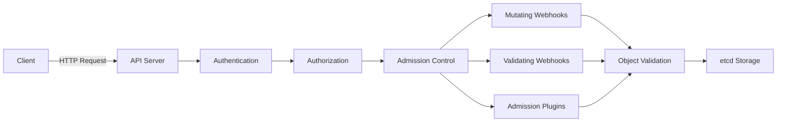
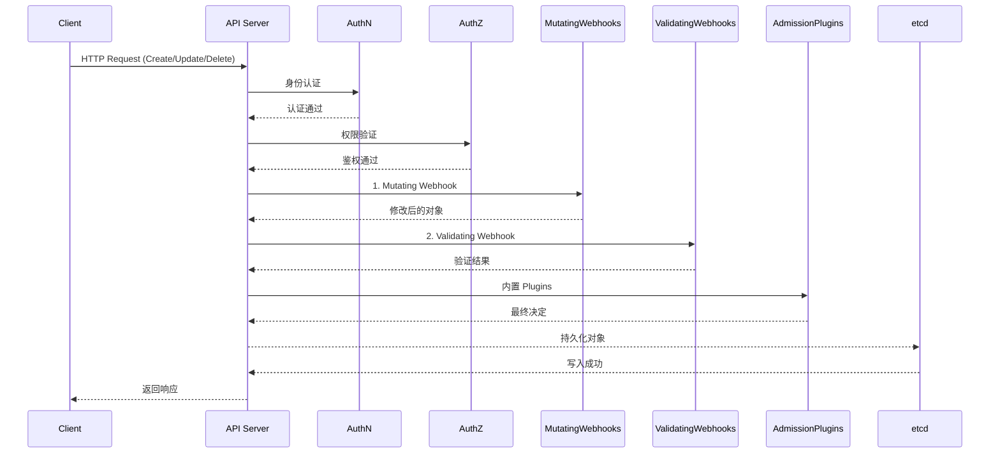
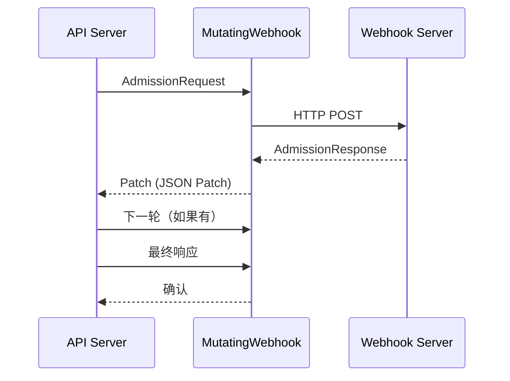
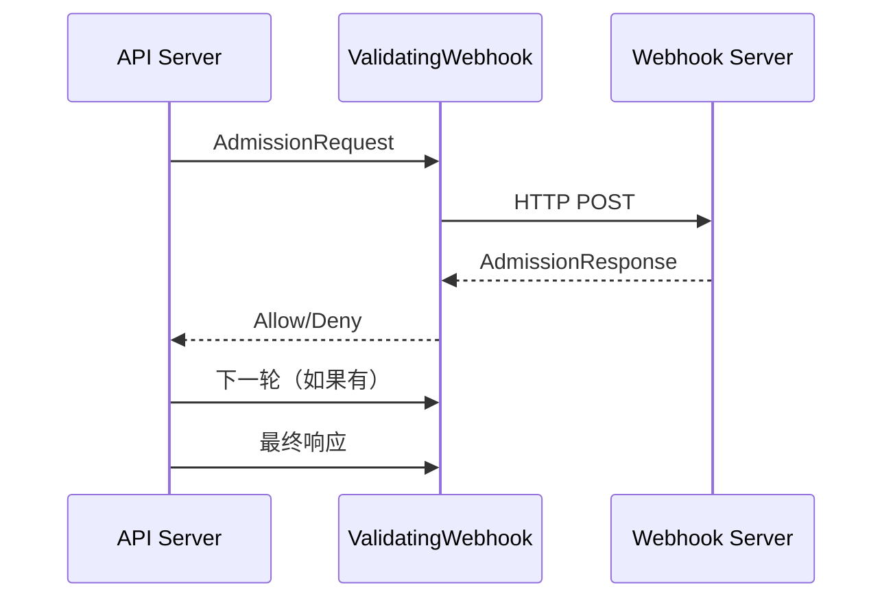
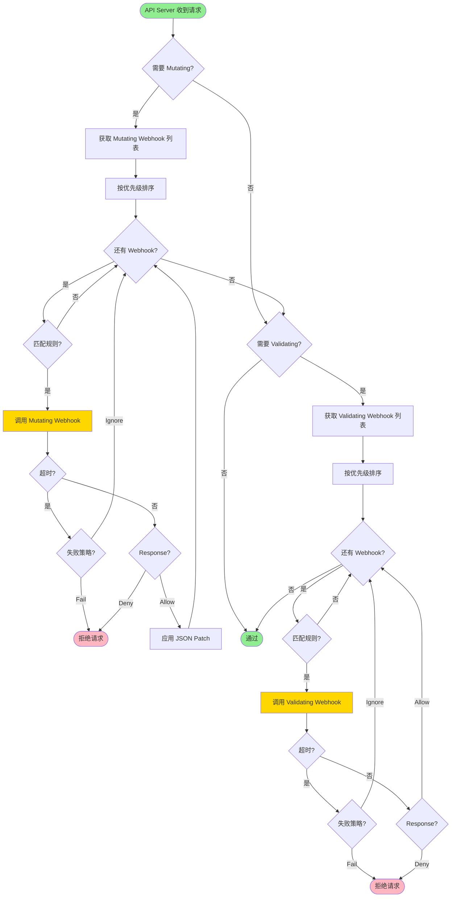

# 准入控制深度分析

> 本文档深入分析 Kubernetes 的准入控制（Admission Control）机制，包括准入控制阶段、Webhook、内置 Plugins 和性能优化。

---

## 目录

1. [准入控制概述](#准入控制概述)
2. [准入控制阶段](#准入控制阶段)
3. [准入插件架构](#准入插件架构)
4. [内置准入插件](#内置准入插件)
5. [Webhook 准入控制](#webhook-准入控制)
6. [Pod Security Admission](#pod-security-admission)
7. [准入控制性能优化](#准入控制性能优化)
8. [最佳实践](#最佳实践)

---

## 准入控制概述

### 准入控制的作用

准入控制是 Kubernetes 的**安全网关**，在资源持久化到 etcd 之前拦截和处理请求：



### 准入控制的两个阶段

| 阶段 | 作用 | 执行顺序 |
|------|------|---------|
| **Authentication** | 认证请求者身份 | 1 |
| **Authorization** | 验证请求者权限 | 2 |
| **Admission Control** | 验证和修改请求内容 | 3 |

---

## 准入控制阶段

### 完整请求流程



### Authentication 阶段

```go
// 认证模块
type Authenticator interface {
    AuthenticateRequest(req *http.Request) (user.Info, bool, error)
}

// 认证方法
func AuthenticateRequest(req *http.Request) (user.Info, bool, error) {
    // 1. 从请求中提取令牌
    token, err := extractBearerToken(req)
    if err != nil {
        return nil, false, err
    }
    
    // 2. 验证令牌
    user, valid, err := validateToken(token)
    if !valid {
        return nil, false, nil
    }
    
    return user, true, nil
}
```

### Authorization 阶段

```go
// 鉴权模块
type Authorizer interface {
    Authorize(ctx context.Context, a authorizer.Attributes) (authorized authorizer.Decision, reason string, err error)
}

// 鉴权决策
type Decision int

const (
    // 决策通过
    DecisionAllow Decision = iota
    // 决策拒绝
    DecisionDeny
    // 决策禁止（无操作）
    DecisionNoOpinion
)
```

---

## 准入插件架构

### 插件接口定义

```go
// 准入插件接口
type Interface interface {
    // Admit 准入请求
    Admit(ctx context.Context, a Attributes) (err error)
    
    // Validate 验证请求
    Validate(ctx context.Context, a Attributes) (err error)
    
    // GetPluginName 返回插件名称
    GetPluginName() string
}
```

### 插件属性结构

```go
// Attributes 包含请求的上下文信息
type Attributes struct {
    // Kind 资源类型（Pod、Service...）
    Kind string
    
    // Namespace 命名空间
    Namespace string
    
    // Name 资源名称
    Name string
    
    // Object 请求对象
    Object runtime.Object
    
    // OldObject 旧对象（用于 Update）
    OldObject runtime.Object
    
    // Operation 操作类型
    Operation Operation
    
    // UserInfo 用户信息
    UserInfo authentication.UserInfo
    
    // DryRun 是否为试运行
    DryRun bool
}
```

---

## 内置准入插件

### 所有内置插件列表

**位置**: `pkg/kubeapiserver/options/plugins.go`

```go
var AllOrderedPlugins = []string{
    // 1. 总是准入
    admit.PluginName,
    
    // 2. 命名空间
    autoprovision.PluginName,
    lifecycle.PluginName,
    exists.PluginName,
    
    // 3. 资源限制
    antiaffinity.PluginName,
    limitranger.PluginName,
    resourcequota.PluginName,
    
    // 4. 安全和限制
    serviceaccount.PluginName,
    security.PodSecurity.PluginName,
    nodetaint.PluginName,
    noderestriction.PluginName,
    imagepolicy.PluginName,
    alwayspullimages.PluginName,
    
    // 5. 优先级和选择器
    podpriority.PluginName,
    podnodeselector.PluginName,
    podtopologylabels.PluginName,
    defaulttolerationseconds.PluginName,
    podtolerationrestriction.PluginName,
    
    // 6. 存储和卷
    setdefault.PluginName,
    resize.PluginName,
    storageobjectinuseprotection.PluginName,
    
    // 7. 网络和 Ingress
    defaultingressclass.PluginName,
    denyserviceexternalips.PluginName,
    
    // 8. 证书和签名
    certapproval.PluginName,
    certsigning.PluginName,
    certsubjectrestriction.PluginName,
    ctbattest.PluginName,
    
    // 9. 功能特性和资源
    eventratelimit.PluginName,
    extendedresourcecetoleration.PluginName,
    runtimeclass.PluginName,
    gc.PluginName,
    ownerreferencespermissionenforcement.PluginName,
    
    // 10. 准入策略
    mutatingadmissionpolicy.PluginName,
    validatingadmissionpolicy.PluginName,
    mutatingwebhook.PluginName,
    validatingwebhook.PluginName,
    resourcequota.PluginName,
    deny.PluginName,
}
```

### 核心内置插件

#### 1. AlwaysAdmit

```go
// 总是准入（用于测试）
type AlwaysAdmit struct{}

func (p *AlwaysAdmit) Admit(ctx context.Context, a Attributes) error {
    // 总是返回成功
    return nil
}
```

#### 2. ServiceAccount

```go
// ServiceAccount 插件注入 ServiceAccount Token
type ServiceAccount struct {
    mountPath string
}

func (p *ServiceAccount) Admit(ctx context.Context, a Attributes) error {
    pod := a.Object.(*v1.Pod)
    
    // 1. 检查 ServiceAccount 是否存在
    sa, err := p.getServiceAccount(pod.Spec.ServiceAccountName, pod.Namespace)
    if err != nil {
        return err
    }
    
    // 2. 注入 ServiceAccount Token 卷
    p.injectServiceAccountToken(pod, sa)
    
    return nil
}
```

#### 3. Pod Security

```go
// PodSecurity 插件强制执行 Pod Security 策略
type PodSecurity struct {
    controller admission.Controller
}

func (p *PodSecurity) Admit(ctx context.Context, a Attributes) error {
    pod := a.Object.(*v1.Pod)
    
    // 1. 获取适用的 Pod Security Policy
    policy, err := p.getPodSecurityPolicy(pod)
    if err != nil {
        return err
    }
    
    // 2. 验证 Pod 是否符合 Policy
    if err := p.validatePodAgainstPolicy(pod, policy); err != nil {
        return err
    }
    
    return nil
}
```

#### 4. ResourceQuota

```go
// ResourceQuota 插件限制资源使用
type ResourceQuota struct {
    quotaAdmissionController admission.QuotaAdmissionController
}

func (p *ResourceQuota) Admit(ctx context.Context, a Attributes) error {
    pod := a.Object.(*v1.Pod)
    
    // 1. 获取命名空间的资源配额
    quotas, err := p.getQuotas(pod.Namespace)
    if err != nil {
        return err
    }
    
    // 2. 计算请求的资源
    requests := calculateResourceRequests(pod)
    
    // 3. 验证是否超过配额
    for _, quota := range quotas {
        if err := quota.checkQuota(requests); err != nil {
            return fmt.Errorf("exceeded quota: %w", err)
        }
    }
    
    return nil
}
```

#### 5. LimitRanger

```go
// LimitRanger 插件设置资源默认值
type LimitRanger struct {
    client clientset.Interface
}

func (p *LimitRanger) Admit(ctx context.Context, a Attributes) error {
    pod := a.Object.(*v1.Pod)
    
    // 1. 遍历所有容器
    for i, container := range pod.Spec.Containers {
        // 2. 如果没有设置限制，设置默认值
        if container.Resources.Limits == nil {
            // 设置限制为请求值
            container.Resources.Limits = v1.ResourceList{
                Cpu:    container.Resources.Requests.Cpu,
                Memory: container.Resources.Requests.Memory,
            }
        }
    }
    
    return nil
}
```

---

## Webhook 准入控制

### Mutating Webhook



### Validating Webhook



#### Webhook 完整请求流程图



### Webhook 配置

```yaml
apiVersion: admissionregistration.k8s.io/v1
kind: ValidatingWebhookConfiguration
metadata:
  name: my-validating-webhook
webhooks:
  - name: validate.example.com
    rules:
    - operations: ["CREATE"]
      apiGroups: [""]
      apiVersions: ["v1"]
      resources: ["pods"]
    clientConfig:
      service:
        name: my-webhook-service
        namespace: my-webhook-namespace
      caBundle: |
        -----BEGIN CERTIFICATE-----
        MIIBIjANBgkqhkiG9b0nB...
        -----END CERTIFICATE-----
---
apiVersion: admissionregistration.k8s.io/v1
kind: MutatingWebhookConfiguration
metadata:
  name: my-mutating-webhook
webhooks:
  - name: mutate.example.com
    rules:
    - operations: ["CREATE", "UPDATE"]
      apiGroups: [""]
      apiVersions: ["v1"]
      resources: ["pods"]
    clientConfig:
      service:
        name: my-webhook-service
        namespace: my-webhook-namespace
      caBundle: |
        -----BEGIN CERTIFICATE-----
        MIIBIjANBgkqhkiG9b0nB...
        -----END CERTIFICATE-----
      timeoutSeconds: 10
```

### Webhook 配置

| 配置 | 说明 | 推荐值 |
|------|------|---------|
| **timeoutSeconds** | 超时时间 | 10s |
| **failurePolicy** | 失败策略 | Ignore/Fail |
| **sideEffects** | 副作用 | NoneOnDryRun |
| **admissionReviewVersions** | API 版本 | v1, v1beta1 |
| **matchPolicy** | 匹配策略 | Exact/Equivalent |
| **namespaceSelector** | 命名空间选择器 | - |
| **objectSelector** | 对象选择器 | - |

---

## Pod Security Admission

### Pod Security Standards

Kubernetes 定义了 3 种 Pod Security 标准：

| 标准 | 说明 | 适用场景 |
|------|------|---------|
| **Baseline** | 基本安全措施 | 通用应用 |
| **Restricted** | 最严格安全措施 | 关键工作负载 |
| **Privileged** | 无安全限制（仅限特权 Pod） | 系统级 Pod |

### Pod Security 配置

```yaml
apiVersion: v1
kind: Pod
metadata:
  name: secure-pod
spec:
  securityContext:
    runAsUser: 1000
    runAsGroup: 3000
    runAsNonRoot: true
    fsGroup: 2000
    seccompProfile:
      type: RuntimeDefault
    capabilities:
      drop:
      - ALL
      add:
      - NET_BIND_SERVICE
  containers:
  - name: app
    image: my-app:latest
    securityContext:
      allowPrivilegeEscalation: false
      readOnlyRootFilesystem: true
      capabilities:
        drop:
          - NET_RAW
          - SYS_CHROOT
```

### Pod Security Admission 配置

```yaml
apiVersion: apiserver.config.k8s.io/v1
kind: AdmissionConfiguration
pluginConfig:
  - name: PodSecurity
    configuration:
      apiVersion: pod-security.admission.config.k8s.io/v1
      kind: PodSecurityConfiguration
      defaults:
        enforce: Baseline
        audit: Restricted
        warn: Privileged
      exemptions:
        namespaces:
          - kube-system
        runtimeClasses:
          - untrusted
        usernames:
          - system:serviceaccounts
      auditVersions:
        - latest
```

---

## 准入控制性能优化

### 批量处理

```go
// 批量准入控制请求
type admissionBatch struct {
    batch []admission.Attributes
}

func (b *admissionBatch) Admit(ctx context.Context, a Attributes) error {
    // 并发处理批量请求
    var wg sync.WaitGroup
    errChan := make(chan error, len(b.batch))
    
    for _, attr := range b.batch {
        wg.Add(1)
        go func(attr admission.Attributes) {
            defer wg.Done()
            errChan <- attr.Admit(ctx)
        }(attr)
    }
    
    wg.Wait()
    close(errChan)
    
    for err := range errChan {
        if err != nil {
            return err
        }
    }
    
    return nil
}
```

### 缓存优化

```go
// 准入控制缓存
type admissionCache struct {
    sync.RWMutex
    cache map[string]admission.Attributes
}

func (c *admissionCache) Get(key string) (admission.Attributes, bool) {
    c.RLock()
    defer c.RUnlock()
    
    if attrs, ok := c.cache[key]; ok {
        return attrs, true
    }
    return admission.Attributes{}, false
}
```

### 预期编译 Webhook

```go
// 预期编译 Webhook 配置
type WebhookCache struct {
    cache map[string]*WebhookConfig
}

func (w *WebhookCache) PreloadWebhooks() error {
    // 从 API Server 预加载 Webhook 配置
    webhooks, err := w.listWebhooks()
    if err != nil {
        return err
    }
    
    // 缓存配置
    for _, webhook := range webhooks {
        w.cache[webhook.Name] = webhook
    }
    
    return nil
}
```

---

## 最佳实践

### 1. Webhook 配置

#### 超时配置

```yaml
webhooks:
  - name: my-webhook
    clientConfig:
      timeoutSeconds: 10  # 10 秒超时
```

#### 失败策略

```yaml
webhooks:
  - name: my-webhook
    clientConfig:
      failurePolicy: Ignore  # 忽略失败（推荐用于测试）
      # failurePolicy: Fail  # 失败时拒绝（生产环境）
```

#### 并发控制

```yaml
apiVersion: admissionregistration.k8s.io/v1
kind: MutatingWebhookConfiguration
webhooks:
  - name: my-webhook
    sideEffects: None  # 无副作用，支持并发
    # sideEffects: Some  # 有副作用，串行化
```

### 2. 内置插件配置

#### 启用/禁用插件

```yaml
apiVersion: kubeapiserver.config.k8s.io/v1
kind: AdmissionConfiguration
plugins:
  - name: PodSecurity
    configuration:
      apiVersion: pod-security.admission.config.k8s.io/v1
      defaults:
        enforce: Baseline
  - name: ResourceQuota
    configuration: null  # 禁用 ResourceQuota
  - name: LimitRanger
    configuration: null
```

#### 插件顺序

```go
// 插件执行顺序是固定的
// 必须按以下顺序执行：
// 1. MutatingWebhooks
// 2. MutatingAdmissionPolicy
// 3. ValidatingAdmissionPolicy
// 4. ValidatingWebhooks
// 5. AlwaysAdmit
// 6. 其他内置插件（按注册顺序）
```

### 3. Pod Security 配置

#### 基础 Security Profile

```yaml
apiVersion: v1
kind: Pod
spec:
  securityContext:
    runAsNonRoot: true
    readOnlyRootFilesystem: true
    allowPrivilegeEscalation: false
    capabilities:
      drop: [ALL]
```

#### 严格 Security Profile

```yaml
apiVersion: v1
kind: Pod
spec:
  securityContext:
    runAsUser: 1000
    runAsGroup: 3000
    runAsNonRoot: true
    fsGroup: 2000
    seccompProfile:
      type: RuntimeDefault
    capabilities:
      drop: [ALL]
      add: [NET_BIND_SERVICE]
    seLinuxOptions:
      level: "selinux:enabled"
```

### 4. 监控和调优

#### 准入控制指标

```go
var (
    // 准入请求总数
    AdmitRequestsTotal = metrics.NewCounterVec(
        &metrics.CounterOpts{
            Subsystem:      "kubeapiserver",
            Name:           "admit_requests_total",
            Help:           "Cumulative number of admission requests",
            StabilityLevel: metrics.BETA,
        },
        []string{"plugin_name", "kind", "operation", "result"})
    
    // 准入延迟
    AdmitLatency = metrics.NewHistogramVec(
        &metrics.HistogramOpts{
            Subsystem:      "kubeapiserver",
            Name:           "admit_latency_seconds",
            Help:           "Latency of admission operations",
            StabilityLevel: metrics.BETA,
        },
        []string{"plugin_name", "kind", "operation"})
)
```

#### 监控 PromQL

```sql
# 准入请求速率
rate(kubeapiserver_admit_requests_total[5m])

# 准入延迟
histogram_quantile(0.95, kubeapiserver_admit_latency_seconds_bucket)

# 准入拒绝率
sum(rate(kubeapiserver_admit_requests_total{result="denied"}[5m])) by (plugin_name, kind)

# Webhook 延迟
histogram_quantile(0.95, webhook_admission_latency_seconds_bucket)
```

### 5. 故障排查

#### Webhook 问题

```bash
# 查看 Webhook 配置
kubectl get validatingwebhookconfigurations -A
kubectl get mutatingwebhookconfigurations -A

# 查看 Webhook 端点状态
kubectl get endpoints -A <webhook-namespace>

# 查看 Webhook 事件
kubectl get events --field-selector involvedObject.kind=ValidatingWebhookConfiguration
kubectl get events --field-selector involvedObject.kind=MutatingWebhookConfiguration
```

#### 准入插件问题

```bash
# 查看准入插件日志
kubectl logs -n kube-system -l component=kube-apiserver | grep -i admission

# 查看插件配置
kubectl get configmaps -n kube-system -l component=kube-apiserver -o yaml

# 查看准入控制器状态
kubectl get pods -n kube-system -l component=admission-controller
```

---

## 总结

### 核心要点

1. **准入控制阶段**：Authentication → Authorization → Admission Control
2. **Admission Control 子阶段**：Mutating Webhooks → Mutating Plugins → Validating Plugins → Validating Webhooks → Admission Plugins
3. **内置插件**：30+ 个插件（ServiceAccount、PodSecurity、ResourceQuota、LimitRanger...）
4. **Webhook 控制**：Mutating（修改）和 Validating（验证）两种类型
5. **Pod Security**：3 种标准（Baseline、Restricted、Privileged），强制执行安全策略
6. **性能优化**：批量处理、缓存优化、预加载配置
7. **监控**：准入请求数量、延迟、拒绝率

### 关键路径

```
Client Request → API Server → Authentication → Authorization → 
Admission Control (Mutating Webhooks → Plugins → Validating Webhooks) → 
etcd → Response
```

### 推荐阅读

- [Using Admission Controllers](https://kubernetes.io/docs/reference/access-authn-ext/rbac/)
- [Dynamic Admission Control](https://kubernetes.io/docs/reference/access-authn-ext/extensible-admission-controllers/)
- [ValidatingAdmissionPolicy](https://kubernetes.io/docs/concepts/security/pod-security-admission/)
- [Pod Security Standards](https://kubernetes.io/docs/concepts/security/pod-security-standards/)
- [Dynamic Admission Webhooks](https://kubernetes.io/docs/reference/access-authn-ext/extensible-admission-controllers/)

---

**文档版本**：v1.0
**创建日期**：2026-03-04
**维护者**：AI Assistant
**Kubernetes 版本**：v1.28+
