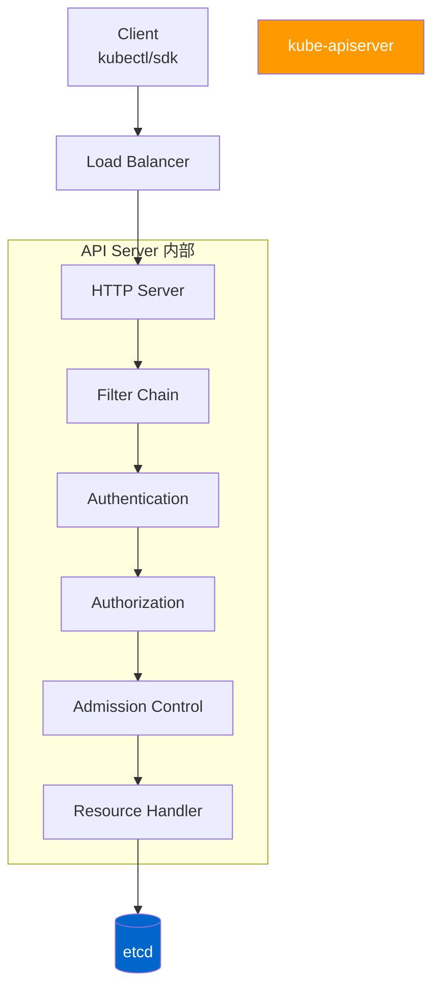
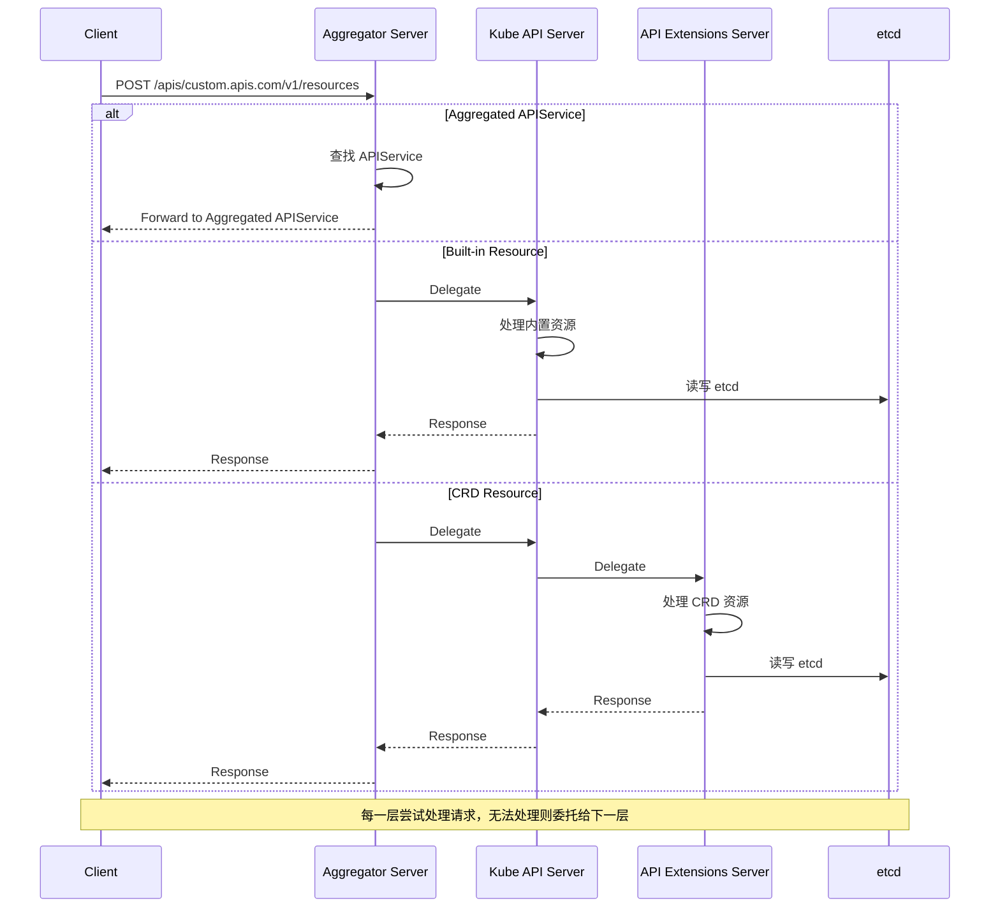
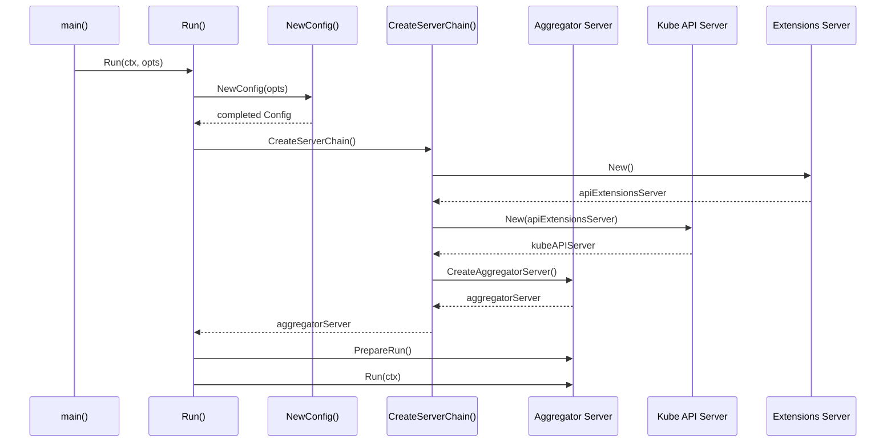
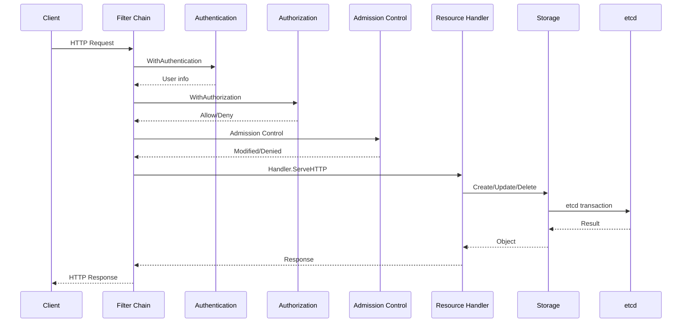
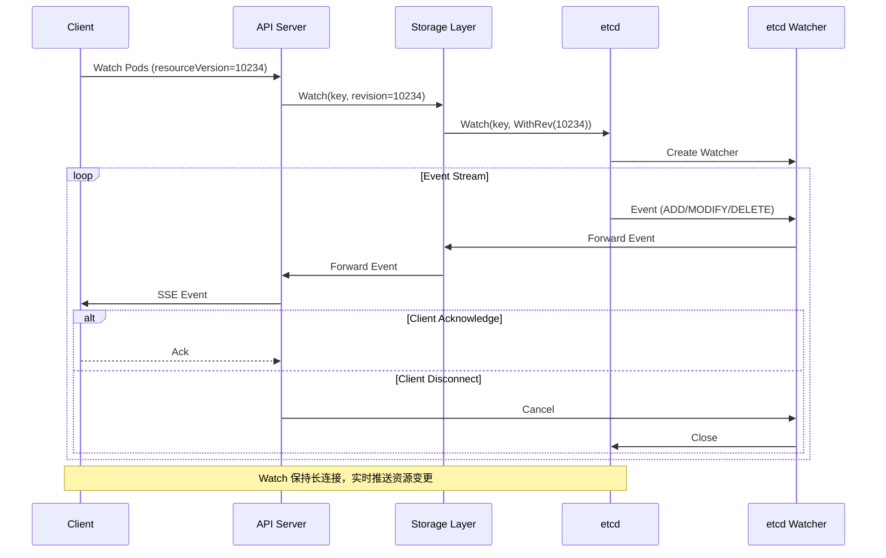
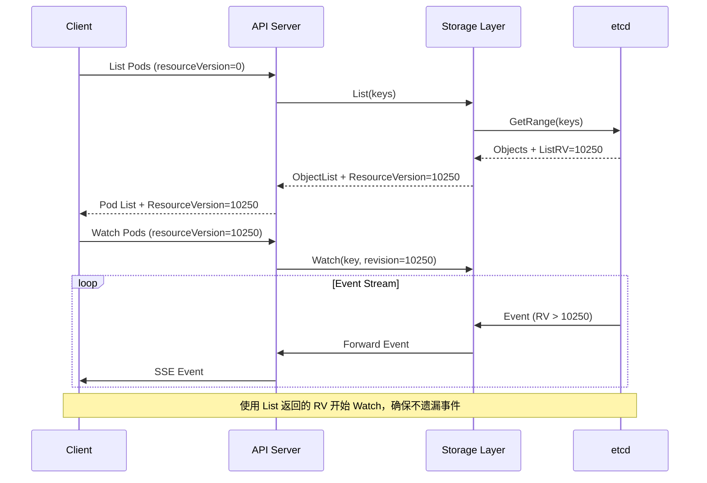

# Kubernetes API Server 深度解析

## 概述

kube-apiserver 是 Kubernetes 集群的控制平面核心组件，负责：
- 提供统一的 RESTful API 入口
- 处理认证、授权和准入控制
- 管理 Kubernetes 资源对象
- 与 etcd 交互进行持久化
- 支持 Watch/List 机制
- 实现 Aggregated APIServer（聚合 API Server）

本文档深入分析 API Server 的启动流程、请求处理链、认证授权机制、准入控制和 CRD 处理。

---

## 一、API Server 架构

### 1.1 整体架构



### 1.2 服务器链（Server Chain）

kube-apiserver 使用委托模式实现三层服务器链：

```
Aggregator Server (最外层)
    ↓
API Extensions Server (CRD)
    ↓
Kube API Server (内置资源)
```

**代码位置：** `cmd/kube-apiserver/app/server.go`

```go
// CreateServerChain creates the apiservers connected via delegation.
func CreateServerChain(config CompletedConfig) (*aggregatorapiserver.APIAggregator, error) {
    // 1. 创建 Not Found Handler
    notFoundHandler := notfoundhandler.New(...)

    // 2. 创建 API Extensions Server (CRD)
    apiExtensionsServer, err := config.ApiExtensions.New(
        genericapiserver.NewEmptyDelegateWithCustomHandler(notFoundHandler),
    )

    // 3. 创建 Kube API Server
    kubeAPIServer, err := config.KubeAPIs.New(apiExtensionsServer.GenericAPIServer)

    // 4. 创建 Aggregator Server
    aggregatorServer, err := controlplaneapiserver.CreateAggregatorServer(
        config.Aggregator,
        kubeAPIServer.ControlPlane.GenericAPIServer,
        apiExtensionsServer.Informers.Apiextensions().V1().CustomResourceDefinitions(),
        crdAPIEnabled,
        apiVersionPriorities,
    )

    return aggregatorServer, nil
}
```

**委托关系：**
- Aggregator 将无法处理的请求委托给 Kube API Server
- Kube API Server 将无法处理的请求委托给 API Extensions Server
- API Extensions Server 返回 404

#### 服务器链委托流程图



---

## 二、启动流程

### 2.1 主入口

**文件：** `cmd/kube-apiserver/app/server.go`

```go
func Run(ctx context.Context, opts options.CompletedOptions) error {
    // 1. 打印版本信息
    klog.Infof("Version: %+v", utilversion.Get())

    // 2. 创建配置
    config, err := NewConfig(opts)
    if err != nil {
        return err
    }

    // 3. 完成配置
    completed, err := config.Complete()
    if err != nil {
        return err
    }

    // 4. 创建服务器链
    server, err := CreateServerChain(completed)
    if err != nil {
        return err
    }

    // 5. 准备运行
    prepared, err := server.PrepareRun()
    if err != nil {
        return err
    }

    // 6. 启动服务器
    return prepared.Run(ctx)
}
```

### 2.2 配置创建

**文件：** `cmd/kube-apiserver/app/config.go`

配置分为三个主要部分：

1. **ApiExtensionsConfig** - CRD 支持
2. **KubeAPIServerConfig** - 内置 API
3. **AggregatorConfig** - 聚合 API

```go
type Config struct {
    GenericConfig *genericapiserver.Config

    ApiExtensions apiextensionsapiserver.Config
    KubeAPIs     controlplaneapiserver.Config
    Aggregator    aggregatorapiserver.Config
}
```

### 2.3 初始化流程图



---

## 三、请求处理链

### 3.1 HTTP Filter 链

API Server 使用一系列 HTTP 过滤器处理请求：

```
请求 → Filter Chain → Handler → Storage → etcd
```

**关键过滤器：**

| 过滤器 | 作用 | 位置 |
|--------|------|------|
| WithAuthentication | 认证 | `pkg/kubeapiserver/filters/` |
| WithAuthorization | 授权 | `pkg/kubeapiserver/filters/` |
| WithImpersonation | 伪装支持 | `staging/k8s.io/apiserver/pkg/endpoints/filters/` |
| WithAudit | 审计日志 | `staging/k8s.io/apiserver/pkg/endpoints/filters/` |
| WithRequestInfo | 请求信息 | `staging/k8s.io/apiserver/pkg/endpoints/filters/` |
| WithWarningRecorder | 警告记录 | `staging/k8s.io/apiserver/pkg/endpoints/filters/` |
| WithWatchValidation | Watch 验证 | `staging/k8s.io/apiserver/pkg/endpoints/filters/` |

**代码位置：** `pkg/kubeapiserver/filters/`

```go
// BuildHandlerChain builds a handler chain for the API Server.
func BuildHandlerChain(apiHandler http.Handler, c *Config) http.Handler {
    handler := apiHandler

    // 添加审计日志
    handler = WithAudit(handler, c.RequestContextMapper, ...)

    // 添加授权
    handler = WithAuthorization(handler, c.AuthorizationInfo.Authorizer)

    // 添加认证
    handler = WithAuthentication(handler, c.AuthenticationInfo.Authenticator)

    // 添加请求信息
    handler = WithRequestInfo(handler, c.RequestInfoResolver)

    // 添加其他过滤器...
    return handler
}
```

### 3.2 请求处理流程图



---

## 四、认证机制（Authentication）

### 4.1 认证流程

```
HTTP Request → Authenticator → User Info → Authorization
```

**文件位置：**
- 认证配置：`pkg/kubeapiserver/options/authentication.go`
- 认证实现：`staging/k8s.io/apiserver/pkg/authentication/`

### 4.2 认证方式

Kubernetes 支持多种认证方式：

#### 1. Token 认证
- 静态 Token 文件
- ServiceAccount Token
- Bootstrap Token

**代码：** `staging/k8s.io/apiserver/pkg/authentication/token/`

#### 2. TLS 认证
- 客户端证书认证

**代码：** `staging/k8s.io/apiserver/pkg/authentication/request/x509/`

#### 3. OIDC 认证
- OpenID Connect

**代码：** `staging/k8s.io/apiserver/pkg/authentication/request/union/`

#### 4. Webhook 认证
- 外部认证服务

**代码：** `staging/k8s.io/apiserver/pkg/authentication/webhook/`

### 4.3 认证器链

```go
type RequestAuthenticator struct {
    authenticators [] authenticator.Request
}

func (a *RequestAuthenticator) AuthenticateRequest(req *http.Request) (authenticator.Response, bool, error) {
    for _, currAuthenticator := range a.authenticators {
        resp, ok, err := currAuthenticator.AuthenticateRequest(req)
        if err != nil {
            return authenticator.Response{}, false, err
        }
        if ok {
            return resp, true, nil
        }
    }
    return authenticator.Response{}, false, nil
}
```

### 4.4 认证信息

认证成功后返回：

```go
type Response struct {
    User      user.Info
    Audiences []string
}
```

**示例：**
```go
user.Info{
    Name:   "system:admin",
    Groups: []string{"system:masters"},
}
```

---

## 五、授权机制（Authorization）

### 5.1 授权流程

```
User Info → Authorizer → Allow/Deny → Admission Control
```

**文件位置：**
- 授权配置：`pkg/kubeapiserver/options/authorization.go`
- 授权实现：`pkg/kubeapiserver/authorizer/`

### 5.2 授权方式

#### 1. RBAC（Role-Based Access Control）
- 基于角色的访问控制
- 最常用的授权方式

**代码：** `pkg/kubeapiserver/authorizer/rbac/`

```go
type Authorizer struct {
    roleGetter           rbacregistry.RoleGetter
    roleBindingGetter    rbacregistry.RoleBindingGetter
    clusterRoleGetter    rbacregistry.ClusterRoleGetter
    clusterRoleBindingGetter rbacregistry.ClusterRoleBindingGetter
}
```

**RBAC 评估流程：**
1. 查找用户绑定到哪些 Role/ClusterRole
2. 收集所有 Role 的规则
3. 检查请求是否匹配任意规则

#### 2. Node Authorizer
- 专门用于 kubelet 的授权
- 允许 kubelet 读取节点相关的资源

**代码：** `pkg/kubeapiserver/authorizer/node/`

#### 3. Webhook 授权
- 外部授权服务

**代码：** `staging/k8s.io/apiserver/plugin/pkg/authorizer/webhook/`

### 5.3 授权请求

```go
type AuthorizerRequestAttributes struct {
    User            user.Info
    Verb            string      // get, list, create, update, delete, etc.
    APIGroup        string
    APIVersion      string
    Resource        string      // pods, services, etc.
    Subresource      string      // status, log, exec, etc.
    Name            string
    ResourceRequest  bool
    Path            string      // for non-resource URLs
}
```

### 5.4 授权决策

```go
type Decision int

const (
    DecisionDeny Decision = iota
    DecisionAllow
    DecisionNoOpinion
)
```

**授权器链：**
```go
type DelegatingAuthorizer struct {
    authorizers []authorizer.Authorizer
}

func (a *DelegatingAuthorizer) Authorize(ctx context.Context, attr authorizer.Attributes) (authorizer.Decision, string, error) {
    for _, authorizer := range a.authorizers {
        decision, reason, err := authorizer.Authorize(ctx, attr)
        if decision == authorizer.DecisionAllow {
            return authorizer.DecisionAllow, reason, nil
        }
        if decision == authorizer.DecisionDeny {
            return authorizer.DecisionDeny, reason, nil
        }
    }
    return authorizer.DecisionNoOpinion, "", nil
}
```

---

## 六、准入控制（Admission Control）

### 6.1 准入控制流程

```
Authorized Request → Mutating Admission → Validating Admission → Storage
```

**文件位置：**
- 准入控制：`pkg/kubeapiserver/admission/`
- Admission Plugin：`staging/k8s.io/apiserver/pkg/admission/`

### 6.2 准入控制类型

#### 1. Mutating Admission
- 修改请求对象
- 可以添加/修改字段
- 按顺序执行

#### 2. Validating Admission
- 验证请求对象
- 不能修改对象
- 并行执行（某些情况下）

### 6.3 内置 Admission Plugins

| Plugin | 类型 | 作用 |
|--------|------|------|
| NamespaceLifecycle | Validating | 防止删除系统 namespace |
| LimitRanger | Mutating/Validating | 资源限制 |
| ResourceQuota | Validating | 资源配额 |
| ServiceAccount | Mutating/Validating | 自动添加 ServiceAccount |
| PodSecurity | Validating | Pod 安全策略 |
| Priority | Mutating | 设置 Pod Priority |
| DefaultStorageClass | Mutating | 设置默认 StorageClass |
| MutatingAdmissionWebhook | Mutating | 外部 Mutating Webhook |
| ValidatingAdmissionWebhook | Validating | 外部 Validating Webhook |

**代码：** `pkg/kubeapiserver/options/admission.go`

### 6.4 准入控制链

```go
type admissionChain []admission.Interface

func (ac admissionChain) Admit(ctx context.Context, a admission.Attributes, o admission.ObjectInterfaces) error {
    // Mutating phase
    for _, plugin := range ac {
        if plugin.Handles(a.GetOperation()) {
            if mutator, ok := plugin.(admission.MutationInterface); ok {
                if err := mutator.Admit(ctx, a, o); err != nil {
                    return err
                }
            }
        }
    }

    // Validating phase
    for _, plugin := range ac {
        if plugin.Handles(a.GetOperation()) {
            if validator, ok := plugin.(admission.ValidationInterface); ok {
                if err := validator.Validate(ctx, a, o); err != nil {
                    return err
                }
            }
        }
    }

    return nil
}
```

### 6.5 Admission Webhook

#### Mutating Webhook

```yaml
apiVersion: admissionregistration.k8s.io/v1
kind: MutatingWebhookConfiguration
metadata:
  name: example-mutating
webhooks:
- name: example.com/mutate
  rules:
  - apiGroups: [""]
    apiVersions: ["v1"]
    operations: ["CREATE", "UPDATE"]
    resources: ["pods"]
  clientConfig:
    service:
      name: webhook-service
      namespace: default
      path: /mutate
  admissionReviewVersions: ["v1"]
  sideEffects: None
```

#### Validating Webhook

```yaml
apiVersion: admissionregistration.k8s.io/v1
kind: ValidatingWebhookConfiguration
metadata:
  name: example-validating
webhooks:
- name: example.com/validate
  rules:
  - apiGroups: [""]
    apiVersions: ["v1"]
    operations: ["CREATE", "UPDATE", "DELETE"]
    resources: ["pods"]
  clientConfig:
    service:
      name: webhook-service
      namespace: default
      path: /validate
  admissionReviewVersions: ["v1"]
  sideEffects: None
```

**代码：** `staging/k8s.io/apiserver/pkg/admission/plugin/webhook/`

---

## 七、CRD 处理机制

### 7.1 CRD 流程

```
CRD 对象 → API Extensions Server → OpenAPI Schema → REST Storage → Aggregator → Client
```

**文件位置：**
- CRD API：`pkg/apis/apiextensions/`
- CRD Controller：`pkg/controller/`

### 7.2 CRD 定义

```yaml
apiVersion: apiextensions.k8s.io/v1
kind: CustomResourceDefinition
metadata:
  name: crontabs.stable.example.com
spec:
  group: stable.example.com
  versions:
    - name: v1
      served: true
      storage: true
      schema:
        openAPIV3Schema:
          type: object
          properties:
            spec:
              type: object
              properties:
                cronSpec:
                  type: string
                  pattern: '^(\d+|\*/\d+)\s+(\d+|\*/\d+)\s+(\d+|\*/\d+)\s+(\d+|\*/\d+)\s+(\d+|\*/\d+)$'
                image:
                  type: string
                replicas:
                  type: integer
                  minimum: 1
                  maximum: 10
  scope: Namespaced
  names:
    plural: crontabs
    singular: crontab
    kind: CronTab
    shortNames:
    - ct
```

### 7.3 CRD 版本管理

**版本转换流程：**

```
v1beta1 → v1 → storage (v1)
```

**代码：** `pkg/apis/apiextensions/apiserver/cr_conversion.go`

```go
type CustomResourceDefinition struct {
    Spec CustomResourceDefinitionSpec
}

type CustomResourceDefinitionSpec struct {
    Group string
    Versions []CustomResourceDefinitionVersion
    Conversion *CustomResourceConversion
}

type CustomResourceDefinitionVersion struct {
    Name   string
    Served bool
    Storage bool
    Schema *JSONSchemaProps
}
```

### 7.4 CRD 转换模式

#### 1. None（默认）
- 只有 storage 版本存储在 etcd

#### 2. Webhook
- 使用外部服务进行版本转换

```yaml
apiVersion: apiextensions.k8s.io/v1
kind: CustomResourceDefinition
spec:
  conversion:
    strategy: Webhook
    webhook:
      clientConfig:
        service:
          name: conversion-webhook
          namespace: default
          path: /convert
      conversionReviewVersions: ["v1", "v1beta1"]
```

### 7.5 CRD REST Storage 生成

API Extensions Server 动态生成 CRD 的 REST Storage：

**代码：** `pkg/apiextensions/apiserver/cr_handler.go`

```go
func (r *APIExtensionsServer) setupCustomResourceDefinitionHandler(apiGroupInfo *genericapiserver.APIGroupInfo) error {
    // 动态生成 REST Storage
    storage := map[string]rest.Storage{
        "customresourcedefinitions": &crdREST{},
    }

    // 注册 REST Storage
    if err := apiGroupInfo.GenericAPIServer.InstallAPIGroup(&genericapiserver.APIGroupInfo{
        GroupMeta: groupMeta,
        VersionedResourcesStorageMap: map[string]map[string]rest.Storage{
            "v1": storage,
        },
    }); err != nil {
        return err
    }

    return nil
}
```

---

## 八、Watch/List 机制

### 8.1 Watch 机制

Watch 允许客户端订阅资源变更：

```
Client → Watch Request → Informer → etcd Watch → Event Stream → Client
```

**代码：** `staging/k8s.io/apiserver/pkg/storage/etcd3/`

#### Watch 完整流程图



#### List+Watch 完整流程图



```go
func (s *store) Watch(ctx context.Context, key string, opts storage.ListOptions) (watch.Interface, error) {
    revision := uint64(0)
    if opts.ResourceVersion != "" {
        revision, _ = strconv.ParseUint(opts.ResourceVersion, 10, 64)
    }

    w, err := s.client.Watch(ctx, s.transformer.EncodeKey(key), revision)
    if err != nil {
        return nil, err
    }

    return s.filterWatch(w, opts), nil
}
```

### 8.2 List 机制

List 获取资源列表：

```go
func (s *store) List(ctx context.Context, options *internalversion.ListOptions) (runtime.Object, error) {
    // 1. 获取所有 keys
    keys, err := s.listKeys(ctx, options)
    if err != nil {
        return nil, err
    }

    // 2. 批量获取对象
    items := []runtime.Object{}
    for _, key := range keys {
        obj, _, err := s.Get(ctx, key, options.ResourceVersion)
        if err != nil {
            continue
        }
        items = append(items, obj)
    }

    // 3. 返回列表
    list := &unstructured.UnstructuredList{
        Items: items,
    }
    return list, nil
}
```

### 8.3 Resource Version

**作用：**
- 确保客户端获取一致性视图
- 支持断点续传 Watch
- 防止读旧数据

**类型：**
- **etcd 版本号**：数字，例如 `10234`
- **etcd 修订版**：字符串，例如 `"10234"`

**使用示例：**
```bash
# 第一次 List
kubectl get pods --resource-version=0

# 使用返回的 ResourceVersion 继续 Watch
kubectl get pods --watch --resource-version=10234
```

---

## 九、API 请求限流

### 9.1 限流层次

```
Client → Max Requests In Flight → Max Mutating Requests In Flight → Min Request Timeout
```

### 9.2 配置参数

**启动参数：**
```bash
--max-requests-inflight=400              # 总并发请求数
--max-mutating-requests-inflight=200     # 修改类并发请求数
--min-request-timeout=1800s             # 最小请求超时
--request-timeout=60s                    # 默认请求超时
```

**代码：** `pkg/kubeapiserver/options/serving.go`

### 9.3 限流实现

**代码：** `staging/k8s.io/apiserver/pkg/util/flowcontrol/`

```go
type MaxInFlightController struct {
    nonMutatingLimiter chan struct{}
    mutatingLimiter    chan struct{}
}

func (m *MaxInFlightController) Wait(req *http.Request) error {
    if isMutatingRequest(req) {
        select {
        case m.mutatingLimiter <- struct{}{}:
            defer func() { <-m.mutatingLimiter }()
            return nil
        default:
            return errors.New("server is overloaded with mutating requests")
        }
    } else {
        select {
        case m.nonMutatingLimiter <- struct{}{}:
            defer func() { <-m.nonMutatingLimiter }()
            return nil
        default:
            return errors.New("server is overloaded with non-mutating requests")
        }
    }
}
```

---

## 十、etcd 集成

### 10.1 etcd 存储

**文件位置：** `staging/k8s.io/apiserver/pkg/storage/etcd3/`

```go
type store struct {
    client    clientv3.Client
    codec     runtime.Codec
    versioner storage.Versioner
}

func (s *store) Create(ctx context.Context, key string, obj, out runtime.Object, ttl uint64) error {
    // 1. 序列化对象
    data, err := runtime.Encode(s.codec, obj)
    if err != nil {
        return err
    }

    // 2. 创建 etcd transaction
    txn := s.client.Txn(ctx)

    // 3. 执行创建操作
    resp, err := txn.
        Then(
            clientv3.OpPut(key, string(data), clientv3.WithLease(clientv3.LeaseID(ttl))),
        ).
        Commit()

    if err != nil {
        return err
    }

    // 4. 更新 ResourceVersion
    updateResourceVersion(resp)

    return nil
}
```

### 10.2 事务支持

```go
func (s *store) GuaranteedUpdate(ctx context.Context, key string, ptrToType runtime.Object, dryrun bool, preconditionFunc ...storage.Precondition) error {
    // 1. 获取当前值
    current, err := s.Get(ctx, key, "")
    if err != nil && !errors.IsNotFound(err) {
        return err
    }

    // 2. 执行更新函数
    err = preconditionFunc(current)
    if err != nil {
        return err
    }

    // 3. 创建事务
    txn := s.client.Txn(ctx)

    // 4. 条件更新（CAS）
    txn.Then(
        clientv3.OpPut(key, string(data), clientv3.WithIgnoreLease()),
    )

    // 5. 提交事务
    resp, err := txn.Commit()
    if err != nil {
        return err
    }

    if !resp.Succeeded {
        return storage.ErrConflict
    }

    return nil
}
```

### 10.3 Watch 机制

```go
func (s *store) Watch(ctx context.Context, key string, rev int64) (watch.Interface, error) {
    // 1. 创建 etcd Watcher
    w := s.client.Watch(ctx, key, clientv3.WithRev(rev))

    // 2. 转换事件
    events := make(chan watch.Event)
    go func() {
        for e := range w {
            events <- s.transformEvent(e)
        }
        close(events)
    }()

    return eventsWatcher{ch: events}, nil
}
```

---

## 十一、关键代码路径

### 11.1 启动流程
```
cmd/kube-apiserver/app/server.go
├── NewAPIServerCommand()          # 创建命令
├── Run()                          # 启动 API Server
├── CreateServerChain()             # 创建服务器链
└── CreateAggregatorServer()        # 创建聚合服务器
```

### 11.2 认证
```
pkg/kubeapiserver/options/authentication.go     # 认证配置
staging/k8s.io/apiserver/pkg/authentication/    # 认证实现
├── request/
│   ├── token/                    # Token 认证
│   ├── x509/                     # TLS 认证
│   └── union/                    # 认证器链
└── webhook/                     # Webhook 认证
```

### 11.3 授权
```
pkg/kubeapiserver/options/authorization.go      # 授权配置
pkg/kubeapiserver/authorizer/                    # 授权实现
├── rbac/                                       # RBAC 授权
├── node/                                       # Node 授权
└── modes/modes.go                               # 授权模式
```

### 11.4 准入控制
```
pkg/kubeapiserver/options/admission.go           # 准入控制配置
pkg/kubeapiserver/admission/                    # 准入控制实现
staging/k8s.io/apiserver/pkg/admission/        # Admission Plugin
├── plugins/                                    # 内置 Plugins
│   ├── namespace/lifecycle.go
│   ├── resourcequota/
│   ├── serviceaccount/
│   └── webhook/                              # Webhook 准入
```

### 11.5 CRD
```
pkg/apis/apiextensions/                      # CRD API
├── v1/
│   ├── types.go                            # CRD 类型定义
│   └── register.go
staging/k8s.io/apiextensions-apiserver/    # API Extensions Server
├── pkg/apiserver/                          # REST Storage
│   ├── cr_handler.go                       # CRD Handler
│   └── crd_rest.go                         # CRD REST
└── pkg/controller/                         # CRD Controller
```

### 11.6 存储
```
staging/k8s.io/apiserver/pkg/storage/        # 存储 API
├── etcd3/                                 # etcd3 实现
│   ├── store.go                            # REST Storage
│   ├── watch.go                            # Watch 实现
│   └── metrics.go                          # 存储指标
└── value/                                 # 值转换
```

---

## 十二、最佳实践

### 12.1 API Server 配置

**生产环境推荐配置：**

```bash
# 限流配置
--max-requests-inflight=1600
--max-mutating-requests-inflight=400

# 请求超时
--min-request-timeout=1800s
--default-watch-cache-size=1500

# etcd 配置
--etcd-servers=https://etcd-cluster:2379
--etcd-cafile=/etc/kubernetes/pki/etcd/ca.crt
--etcd-certfile=/etc/kubernetes/pki/apiserver-etcd-client.crt
--etcd-keyfile=/etc/kubernetes/pki/apiserver-etcd-client.key
--etcd-prefix=/registry

# 安全配置
--authorization-mode=Node,RBAC
--enable-admission-plugins=NodeRestriction,PodSecurity
--enable-bootstrap-token-auth=true

# 审计日志
--audit-log-path=/var/log/kubernetes/audit.log
--audit-log-maxage=30
--audit-log-maxbackup=10
```

### 12.2 性能优化

1. **启用 Watch Cache**
   ```bash
   --watch-cache=true
   --default-watch-cache-size=1500
   ```

2. **启用 HTTP/2**
   ```bash
   --service-node-port-range=30000-32767
   --max-connection-bytes-per-second=100000
   ```

3. **使用 Aggregated APIServer**
   - 减少主 API Server 负载
   - 支持独立扩展

### 12.3 安全加固

1. **启用 RBAC**
   ```bash
   --authorization-mode=Node,RBAC
   ```

2. **启用 Pod Security**
   ```bash
   --enable-admission-plugins=NodeRestriction,PodSecurity
   ```

3. **使用 TLS**
   ```bash
   --tls-cert-file=/etc/kubernetes/pki/apiserver.crt
   --tls-private-key-file=/etc/kubernetes/pki/apiserver.key
   ```

4. **启用审计日志**
   ```bash
   --audit-log-path=/var/log/kubernetes/audit.log
   --audit-log-maxage=30
   --audit-log-maxbackup=10
   ```

---

## 十三、故障排查

### 13.1 常见问题

#### 1. 认证失败
**症状：** `Unauthorized (401)`

**排查：**
- 检查 kubeconfig 配置
- 验证证书有效性
- 检查 ServiceAccount Token

#### 2. 授权失败
**症状：** `Forbidden (403)`

**排查：**
- 检查 RBAC 规则
- 验证用户/组权限
- 使用 `kubectl auth can-i` 测试

#### 3. 准入控制失败
**症状：** `Admission denied (422)`

**排查：**
- 检查 Admission Plugin 日志
- 验证 Webhook 连接
- 检查对象验证规则

### 13.2 调试技巧

1. **启用详细日志**
   ```bash
   --v=4
   --vmodule=auth*=4,admission*=4
   ```

2. **检查 etcd 连接**
   ```bash
   ETCDCTL_API=3 etcdctl \
     --endpoints=https://etcd:2379 \
     --cacert=/etc/kubernetes/pki/etcd/ca.crt \
     --cert=/etc/kubernetes/pki/etcd-client.crt \
     --key=/etc/kubernetes/pki/etcd-client.key \
     endpoint health
   ```

3. **监控指标**
   - `apiserver_request_total` - 请求总数
   - `apiserver_request_duration_seconds` - 请求延迟
   - `etcd_request_duration_seconds` - etcd 延迟

---

## 十四、总结

### 14.1 架构特点

1. **三层服务器链**：Aggregator → Kube API → Extensions
2. **过滤器链**：认证 → 授权 → 准入控制
3. **委托模式**：灵活扩展，降低耦合
4. **CRD 支持**：动态扩展 API
5. **etcd 集成**：强一致性存储

### 14.2 关键流程

1. **启动流程**：配置 → 服务器链 → 准备运行 → 启动
2. **请求流程**：认证 → 授权 → 准入控制 → 处理 → etcd
3. **Watch 流程**：Watch Request → etcd Watch → Event Stream → Client

### 14.3 扩展点

1. **Authentication Webhook** - 自定义认证
2. **Authorization Webhook** - 自定义授权
3. **Admission Webhook** - 自定义准入控制
4. **CRD** - 自定义资源
5. **Aggregated APIServer** - 自定义 API Server

---

## 参考资源

- [Kubernetes API Server 文档](https://kubernetes.io/docs/concepts/architecture/control-plane-node/apiserver/)
- [Kubernetes 源码](https://github.com/kubernetes/kubernetes)
- [API Server 设计文档](https://github.com/kubernetes/community/blob/master/contributors/design-proposals/)

---

**文档版本**：v1.0
**最后更新**：2026-03-03
**分析范围**：Kubernetes v1.x
