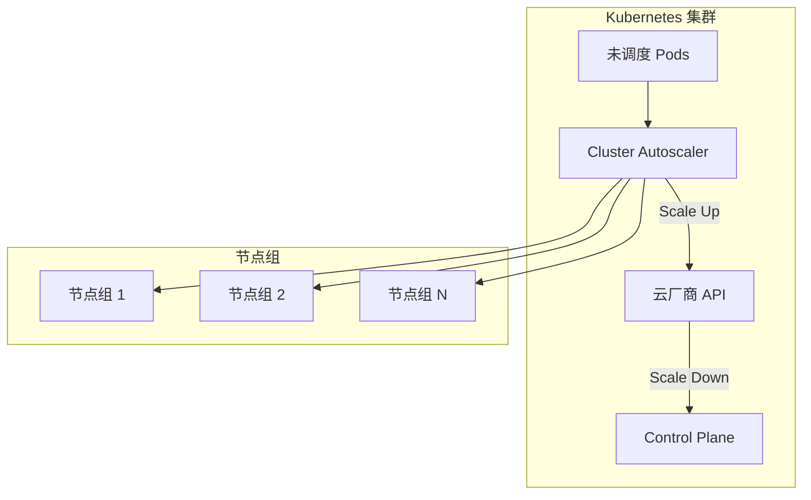
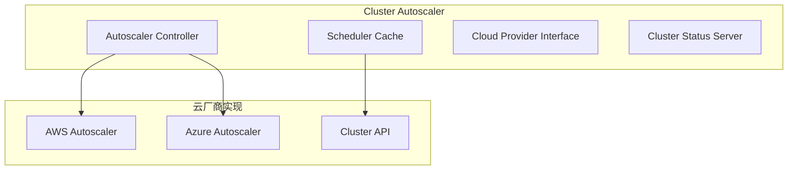
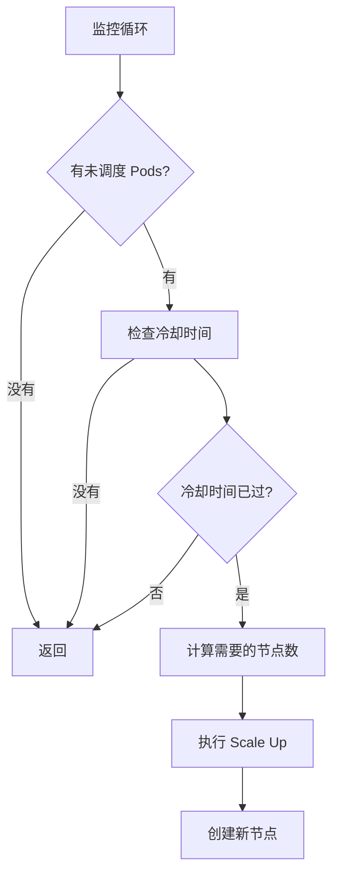
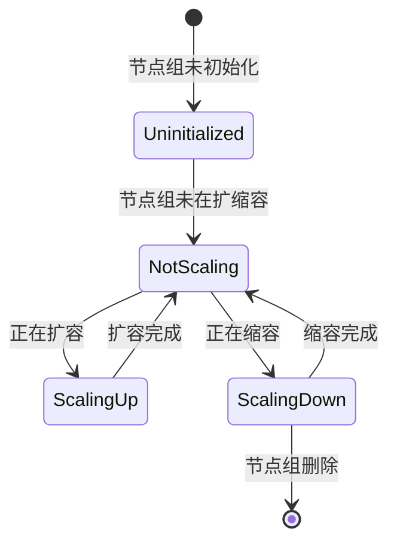
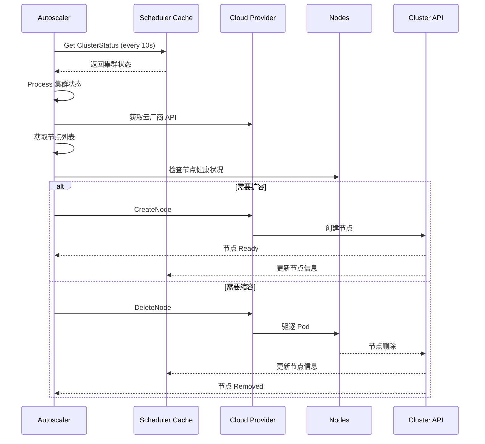
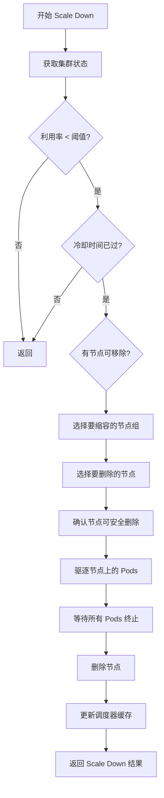

# Cluster Autoscaler 深度分析

> 本文档深入分析 Kubernetes 的 Cluster Autoscaler，包括工作机制、扩缩容策略、节点组管理和最佳实践。

---

## 目录

1. [Cluster Autoscaler 概述](#cluster-autoscaler-概述)
2. [Autoscaler 架构](#autoscaler-架构)
3. [扩缩容策略](#扩缩容策略)
4. [节点组管理](#节点组管理)
5. [工作流分析](#工作流分析)
6. [性能优化](#性能优化)
7. [最佳实践](#最佳实践)

---

## Cluster Autoscaler 概述

### Cluster Autoscaler 的作用

Cluster Autoscaler（Cluster API Autoscaler）是 Kubernetes 的**集群扩缩容组件**，根据 Pod 未调度情况自动增删节点：



### Cluster Autoscaler 的价值

| 价值 | 说明 |
|------|------|
| **成本优化** | 根据负载动态调整集群规模，节省资源成本 |
| **弹性** | 自动应对流量高峰和低谷 |
| **可用性** | 确保 Pod 能够被及时调度 |
| **零停机** | 平滑扩缩容，避免集群不可用 |

---

## Autoscaler 架构

### Autoscaler 组件



### Autoscaler 接口定义

**位置**: `pkg/autoscaler/cluster-autoscaler/autoscaler.go`

```go
// Autoscaler 接口
type Autoscaler interface {
    // Register 注册节点组
    Register(group *autoscaling.Group) error
    
    // Unregister 注销节点组
    Unregister(group string) error
    
    // Update 获取集群状态
    Update(clusterStatus *clusterstatus.ClusterStatus) error
    
    // Process 处理节点组
    Process(group string, clusterStatus *clusterstatus.ClusterStatus) (*autoscaling.ScaleStatus, *clusterstatus.NodeGroupCondition)
}
```

### Cloud Provider 接口

```go
// CloudProvider 云厂商接口
type CloudProvider interface {
    // ListNodes 列出所有节点
    ListNodes(minNodes int, maxNodes int) ([]string, error)
    
    // CreateNode 创建新节点
    CreateNode(name string, zone string, config map[string]string) (*cloudprovider.NodeInfo, error)
    
    // DeleteNode 删除节点
    DeleteNode(name string) error
    
    // GetNodeGroupForNode 获取节点的节点组
    GetNodeGroupForNode(name string) (cloudprovider.NodeGroup, error)
}
```

---

## 扩缩容策略

### 扩缩容触发条件



### Scale Up 算法

```go
// calculateScaleUp 计算需要扩容的节点数
func (a *autoscaler) calculateScaleUp(
    clusterStatus *clusterstatus.ClusterStatus,
    targetSize int,
    nodes []string,
) (int, *cloudprovider.NodeInfo, error) {
    
    // 1. 计算已调度和未调度的 Pods
    scheduledPods := countScheduledPods(clusterStatus)
    unscheduledPods := countUnscheduledPods(clusterStatus)
    
    // 2. 计算每个节点可以运行的最大 Pod 数
    maxPodsPerNode := calculateMaxPodsPerNode(nodes)
    
    // 3. 计算需要的节点数
    totalPods := scheduledPods + unscheduledPods
    neededNodes := math.Ceil(float64(totalPods) / float64(maxPodsPerNode))
    
    // 4. 计算需要增加的节点数
    currentNodes := len(nodes)
    nodesToAdd := neededNodes - currentNodes
    
    return nodesToAdd, nodesToAdd, nil
}
```

### Scale Down 算法

```go
// calculateScaleDown 计算需要缩容的节点数
func (a *autoscaler) calculateScaleDown(
    clusterStatus *clusterstatus.ClusterStatus,
    nodes []string,
    scaleDownUtilThreshold float64,
    scaleDownUnneededTime time.Duration,
) (int, []string, error) {
    
    // 1. 计算每个节点的利用率
    avgUtilization := calculateNodeUtilization(clusterStatus)
    
    // 2. 如果利用率低，且满足冷却时间
    if avgUtilization < scaleDownUtilThreshold &&
        time.Since(a.lastScaleDownTime) > scaleDownUnneededTime {
        
        // 3. 计算可以移除的节点数
        nodesToRemove := calculateNodesToRemove(clusterStatus, scaleDownUtilThreshold)
        
        return -len(nodesToRemove), nil, nil
    }
    
    return 0, nil, nil
}
```

### 扩缩容策略类型

| 策略 | 说明 | 配置 |
|------|------|---------|
| **线性策略** | 根据线性公式计算节点数 | `scaleUpFromZero: false` |
| **阶梯策略** | 以固定步长扩缩容 | `expander` |
| **指数策略** | 指数级别扩缩容 | `expander: exponential` |
| **保守策略** | 扩容延迟更长，但避免过度扩容 | `scaleDownUtilizationThreshold: 0.5` |

---

## 节点组管理

### 节点组概念

节点组将多个节点分组，便于统一管理：

```yaml
apiVersion: autoscaling.k8s.io/v1beta1
kind: Cluster
metadata:
  name: my-cluster
spec:
  clusterAutoscaler:
    nodeGroups:
    - name: spot-group
      minSize: 3
      maxSize: 10
      instanceType: t3.micro
      labels:
        key: cost-optimized
        value: "true"
```

### 节点组配置

```go
// NodeGroup 节点组定义
type NodeGroup struct {
    // 节点组名称
    Name string
    
    // 最小节点数
    MinSize int
    
    // 最大节点数
    MaxSize int
    
    // 实例类型
    InstanceType string
    
    // 节点标签
    Labels map[string]string
    
    // 亲和性配置
    Affinities []v1.NodeSelector
    
    // 污点容忍度
    Tolerations []v1.Toleration
}
```

### 节点组状态



---

## 工作流分析

### 监控循环



### Scale Up 工作流

```mermaid
flowchart TD
    A[开始 Scale Up] --> B[获取集群状态]
    B --> C{未调度 Pods > 阈值?}
    
    C -->|是| D[冷却时间已过?}
    C -->|否| E[返回]
    
    D -->|是| F[计算需要节点数]
    D -->|否| E
    
    F --> G[选择节点组]
    G --> H[计算需要添加的节点数]
    H --> I[创建新节点]
    I --> J[等待节点 Ready]
    J --> K[验证节点]
    K --> L[更新调度器缓存]
    L --> M[返回 Scale Up 结果]
```

### Scale Down 工作流



---

## 性能优化

### 并发扩缩容

```go
// 并发执行 Scale Up
func (a *autoscaler) scaleUpConcurrent(
    group *autoscaling.Group,
    clusterStatus *clusterstatus.ClusterStatus,
    cloud cloudprovider.CloudProvider,
) error {
    
    // 1. 为每个节点组并发扩容
    var wg sync.WaitGroup
    errChan := make(chan error, len(group.NodeGroups))
    
    for _, nodeGroup := range group.NodeGroups {
        wg.Add(1)
        go func(ng *autoscaling.Group) {
            defer wg.Done()
            errChan <- a.scaleUpNodeGroup(ng, clusterStatus, cloud)
        }(nodeGroup)
    }
    
    wg.Wait()
    close(errChan)
    
    for err := range errChan {
        if err != nil {
            return err
        }
    }
    
    return nil
}
```

### 缓存优化

```go
// ClusterStatusCache 集群状态缓存
type ClusterStatusCache struct {
    sync.RWMutex
    cache map[string]*clusterstatus.ClusterStatus
}

func (c *ClusterStatusCache) Get(key string) (*clusterstatus.ClusterStatus, bool) {
    c.RLock()
    defer c.RUnlock()
    
    if status, ok := c.cache[key]; ok {
        return status, true
    }
    
    return nil, false
}

func (c *ClusterStatusCache) Update(key string, status *clusterstatus.ClusterStatus) {
    c.Lock()
    defer c.Unlock()
    c.cache[key] = status
}
```

### 指标收集

```go
// Autoscaler 指标
var (
    // Scale Up 总次数
    ScaleUpTotal = metrics.NewCounterVec(
        &metrics.CounterOpts{
            Subsystem:      "cluster_autoscaler",
            Name:           "scale_up_total",
            Help:           "Total number of scale up operations",
            StabilityLevel: metrics.BETA,
        },
        []string{"node_group"})
    
    // Scale Down 总次数
    ScaleDownTotal = metrics.NewCounterVec(
        &metrics.CounterOpts{
            Subsystem:      "cluster_autoscaler",
            Name:           "scale_down_total",
            Help:           "Total number of scale down operations",
            StabilityLevel: metrics.BETA,
        },
        []string{"node_group"})
    
    // Scale 延迟
    ScaleDuration = metrics.NewHistogramVec(
        &metrics.HistogramOpts{
            Subsystem:      "cluster_autoscaler",
            Name:           "scale_duration_seconds",
            Help:           "Duration of scale operations",
            StabilityLevel: metrics.BETA,
        },
        []string{"operation_type", "node_group"})
    
    // 未调度 Pod 数
    UnscheduledPods = metrics.NewGauge(
        &metrics.GaugeOpts{
            Subsystem:      "cluster_autoscaler",
            Name:           "unscheduled_pods",
            Help:           "Current number of unscheduled pods",
            StabilityLevel: metrics.BETA,
        })
)
```

---

## 最佳实践

### 1. 节点组配置

#### 使用多个节点组

```yaml
apiVersion: autoscaling.k8s.io/v1beta1
kind: Cluster
metadata:
  name: multi-group-cluster
spec:
  clusterAutoscaler:
    nodeGroups:
    - name: cpu-optimized
      minSize: 3
      maxSize: 10
      instanceType: c5.xlarge
      labels:
        key: cpu-optimized
        value: "true"
    - name: memory-optimized
      minSize: 3
      maxSize: 10
      instanceType: r5.8xlarge
      labels:
        key: memory-optimized
        value: "true"
    - name: spot-group
      minSize: 3
      maxSize: 10
      instanceType: t3.micro
      labels:
        key: spot
        value: "true"
```

#### 混合实例类型

```yaml
apiVersion: autoscaling.k8s.io/v1beta1
kind: Cluster
metadata:
  name: mixed-instance-cluster
spec:
  clusterAutoscaler:
    nodeGroups:
    - name: on-demand
      minSize: 3
      maxSize: 10
      instanceType: m5.large
    - name: spot
      minSize: 0
      maxSize: 10
      instanceType: t3.micro
      minNodes: 3
```

### 2. 扩缩容策略配置

#### 保守扩缩容

```yaml
apiVersion: kube-system/cluster-autoscaler-config
kind: ClusterAutoscalerConfig
metadata:
  name: conservative
scaleUp:
  maxNodesTotal: 50
  scaleDown:
    # 高利用率阈值，避免缩容
  scaleDownUtilizationThreshold: 0.7
  # 更长的冷却时间
  scaleDownUnneededTime: 20m
```

#### 激进扩缩容

```yaml
apiVersion: kube-system/cluster-autoscaler-config
kind: ClusterAutoscalerConfig
metadata:
  name: aggressive
scaleUp:
  maxNodesTotal: 100
  scaleDown:
  # 低利用率阈值，快速缩容
  scaleDownUtilizationThreshold: 0.4
  # 更短的冷却时间
  scaleDownUnneededTime: 10m
```

### 3. 过度配置

#### 启用过度配置

```yaml
apiVersion: kube-system/cluster-autoscaler-config
kind: ClusterAutoscalerConfig
metadata:
  name: overprovisioned
scaleUp:
  # 配置过度配置
  overprovisioned:
    # 预配置 5% 的额外节点
    maxGracefulDeletion: 10m
    # 使用优先级调度
    prioritization: true
```

### 4. 监控和告警

#### Prometheus 查询

```sql
# Scale Up 速率
sum(rate(cluster_autoscaler_scale_up_total[5m])) by (node_group)

# Scale Down 速率
sum(rate(cluster_autoscaler_scale_down_total[5m])) by (node_group)

# Scale 延迟 P95
histogram_quantile(0.95, cluster_autoscaler_scale_duration_seconds_bucket)

# 未调度 Pod 数
cluster_autoscaler_unscheduled_pods

# 节点组利用率
sum(kube_node_status{condition="Ready"}) by (label_node_group)
```

#### 告警配置

```yaml
apiVersion: monitoring.coreos.com/v1
kind: PrometheusRule
metadata:
  name: autoscaler-alerts
spec:
  groups:
    - name: autoscaler
  rules:
    # Scale Up 过于 10 分钟
    - alert: ScaleUpTooSlow
      expr: time() - cluster_autoscaler_scale_up_total > 600
      for: 5m
      labels:
        severity: warning
      annotations:
        summary: "Scale up operation took too long"

    # 未调度 Pod 过多
    - alert: TooManyUnscheduledPods
      expr: cluster_autoscaler_unscheduled_pods > 100
      for: 5m
      labels:
        severity: warning
      annotations:
        summary: "Too many unscheduled pods"
```

### 5. 故障排查

#### 扩缩容失败

```bash
# 查看 Autoscaler 日志
kubectl logs -n kube-system -l component=cluster-autoscaler -f

# 查看集群状态
kubectl get cluster

# 查看节点组
kubectl get nodegroup

# 查看云厂商事件
aws autoscaler describe-events --cluster <cluster-name>
az cluster-autoscaler describe-events --cluster <cluster-name>
gcloud container cluster describe-events --cluster <cluster-name>
```

#### 节点组问题

```bash
# 检查节点组状态
kubectl get nodegroup

# 查看节点组配置
kubectl describe cluster

# 查看节点状态
kubectl get nodes -o wide

# 检查云厂商节点
aws ec2 describe-instances --instance-ids <instance-ids>
az vm list --show-details --ids <instance-ids>
```

#### 冷却时间问题

```bash
# 查看冷却时间
kubectl get configmaps -n kube-system -l component=cluster-autoscaler -o yaml

# 检查扩缩容历史
kubectl get events --field-selector involvedObject.kind=Node | sort-by='.lastTimestamp' | tail -20
```

### 6. 优化建议

#### 减少扩缩容频率

```yaml
apiVersion: kube-system/cluster-autoscaler-config
kind: ClusterAutoscalerConfig
metadata:
  name: optimized
scaleUp:
  # 增加最大节点数
  maxNodesTotal: 50
  # 减少最小 Pod 数量
  minNodes: 10
  # 增加扩缩容间隔
  maxPodGracePeriod: 5m
  # 保守的扩缩容阈值
  scanInterval: 30s
```

#### 使用混合实例类型

```yaml
apiVersion: kube-system/cluster-autoscaler-config
kind: ClusterAutoscalerConfig
metadata:
  name: hybrid
scaleUp:
  maxNodesTotal: 100
  maxEmptyBulkDelete: 10
  nodeGroups:
    - name: on-demand
      minSize: 3
      maxSize: 20
      instanceType: m5.large
    - name: spot
      minSize: 0
      maxSize: 30
      instanceType: t3.micro
```

#### 避免过度配置

```yaml
apiVersion: kube-system/cluster-autoscaler-config
kind: ClusterAutoscalerConfig
metadata:
  name: cost-optimized
scaleUp:
  maxNodesTotal: 30
  scaleDown:
    # 更高的缩容阈值
    scaleDownUtilizationThreshold: 0.5
  # 更长的冷却时间
    scaleDownUnneededTime: 30m
  # 禁用过度配置
  overprovisioned:
    enabled: false
```

---

## 总结

### 核心要点

1. **Cluster Autoscaler 概述**：自动扩缩容集群节点，基于未调度 Pods
2. **Autoscaler 架构**：Autoscaler Controller、Scheduler Cache、Cloud Provider
3. **扩缩容策略**：Scale Up/Down 算法，线性/阶梯/指数策略
4. **节点组管理**：NodeGroups 统一管理，支持混合实例类型
5. **工作流分析**：监控循环 → Scale Up/Down → 节点操作
6. **性能优化**：并发扩缩容、缓存、指标收集
7. **最佳实践**：节点组配置、扩缩容策略、监控告警、故障排查

### 关键路径

```
监控循环 → 发现未调度 Pods → 冷却检查 → Scale Up → 
Cloud Provider → 创建节点 → 节点 Ready → 调度器缓存 → 
Pod 可调度

监控循环 → 发现低利用率 → 冷却检查 → Scale Down → 
Cloud Provider → 删除节点 → Pods 驱逐 → 节点删除 → 调度器缓存
```

### 推荐阅读

- [Cluster Autoscaler](https://github.com/kubernetes/autoscaler/tree/master/cluster-autoscaler)
- [AWS Autoscaler](https://github.com/kubernetes/autoscaler/tree/master/aws)
- [Azure Autoscaler](https://github.com/kubernetes/autoscaler/tree/master/azure)
- [GCE Autoscaler](https://github.com/kubernetes/autoscaler/tree/master/clusterapi)
- [Cluster Autoscaler Configuration](https://github.com/kubernetes/autoscaler/blob/master/cluster-autoscaler/api/config/types.go)

---

**文档版本**：v1.0
**创建日期**：2026-03-04
**维护者**：AI Assistant
**Kubernetes 版本**：v1.28+
