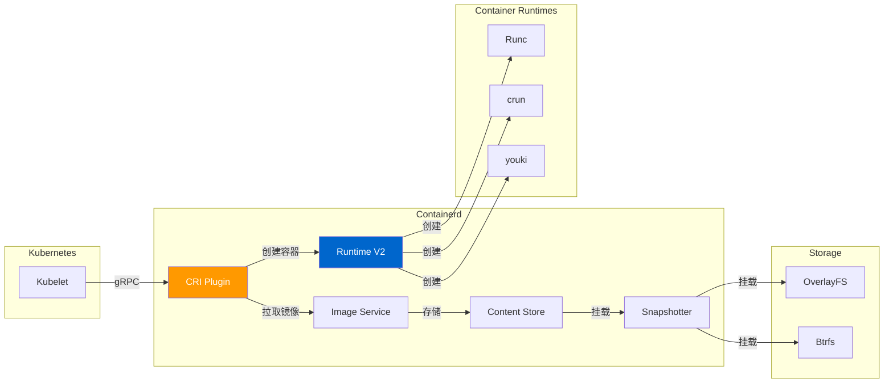
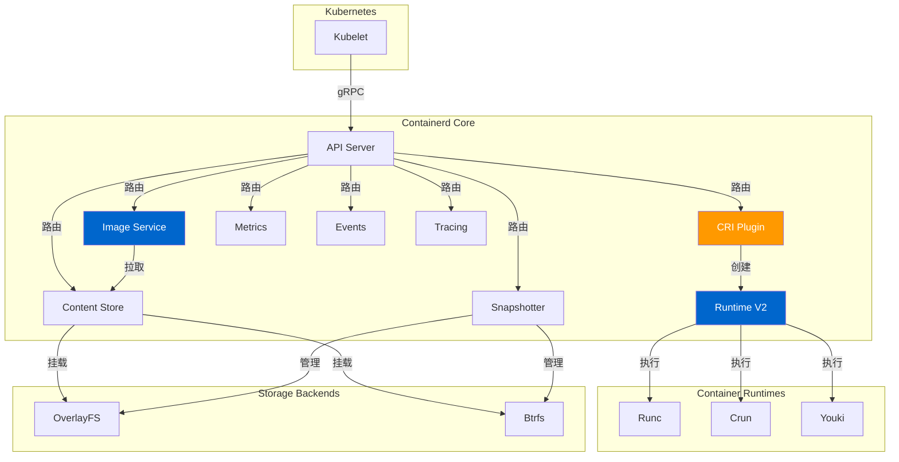
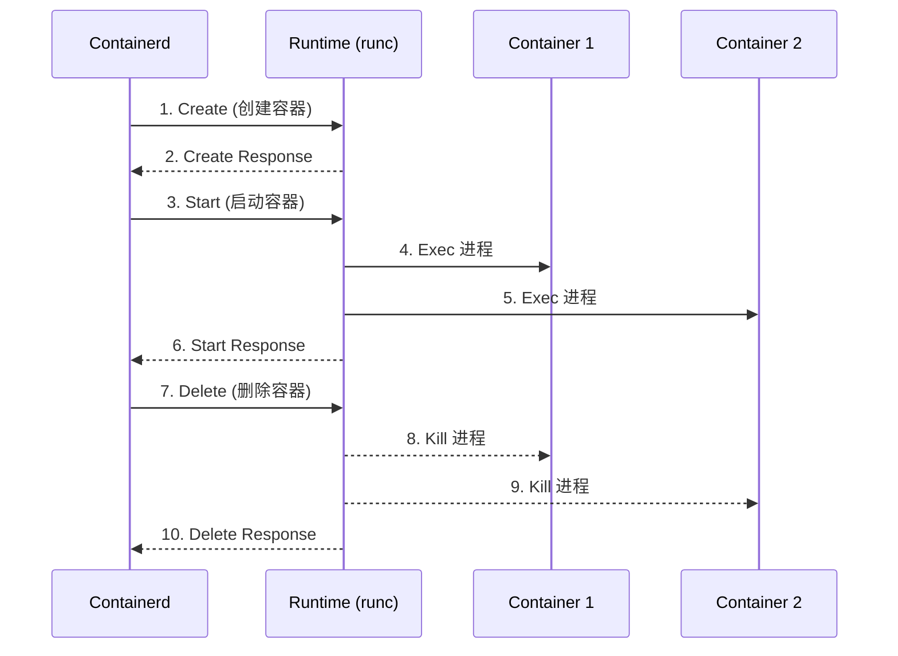
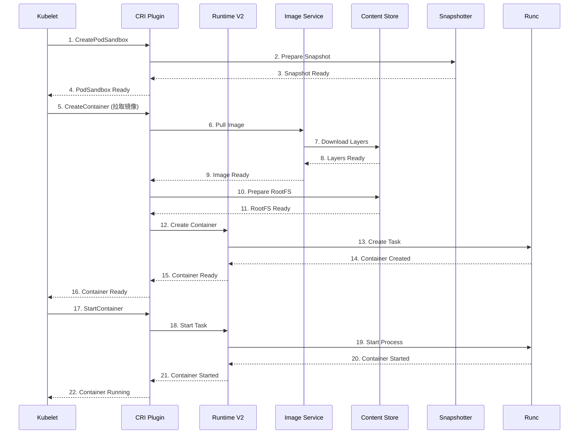
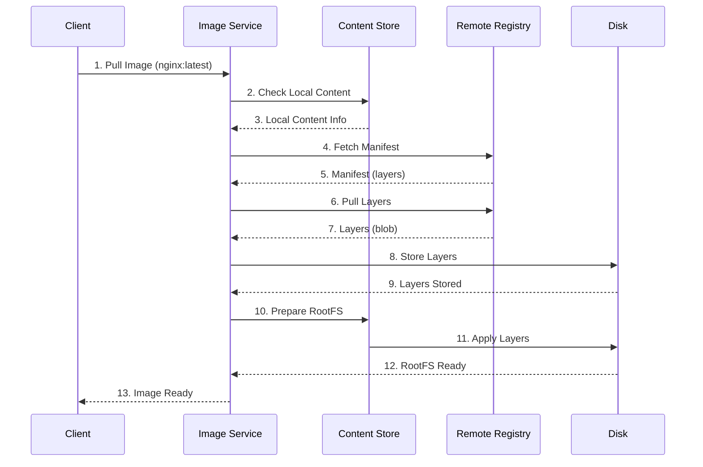

# Containerd 深度分析

> 本文档深入分析 Containerd，包括架构、Runtime V2 协议、容器创建和管理、镜像拉取和存储、安全隔离。

---

## 目录

1. [Containerd 概述](#containerd-概述)
2. [Containerd 架构](#containerd-架构)
3. [Runtime V2 协议](#runtime-v2-协议)
4. [容器创建和管理](#容器创建和管理)
5. [镜像拉取和存储](#镜像拉取和存储)
6. [CRI 实现](#cri-实现)
7. [Snapshots 和内容寻址](#snapshots-和内容寻址)
8. [安全和隔离](#安全和隔离)
9. [性能优化](#性能优化)
10. [故障排查](#故障排查)

---

## Containerd 概述

### Containerd 的作用

Containerd 是一个工业级的容器运行时，专注于运行和管理容器生命周期：



### Containerd 的核心特性

| 特性 | 说明 |
|------|------|
| **工业级**：生产级别的容器运行时 |
| **性能**：高效的容器管理和启动 |
| **CRI 兼容**：完全兼容 Kubernetes CRI |
| **可扩展性**：插件化架构，支持自定义扩展 |
| **安全性**：强大的安全隔离和权限控制 |
| **轻量级**：资源占用低，适合大规模部署 |

### Containerd vs Docker

| 特性 | Docker | Containerd |
|------|--------|------------|
| **架构** | 单体架构 | 插件化架构 |
| **资源占用** | 高 | 低 |
| **性能** | 一般 | 优秀 |
| **安全性** | 好 | 优秀 |
| **CRI 支持** | 间接支持 | 原生支持 |
| **可扩展性** | 有限 | 优秀 |
| **Kubernetes 集成** | 1.24 之前默认 | 1.24+ 默认 |

---

## Containerd 架构

### 整体架构



### 核心组件

#### 1. CRI Plugin

**位置**：`pkg/cri/`

CRI Plugin 实现 Kubernetes CRI 接口：

```go
type criService struct {
    // 客户端
    client containerd.Client

    // 镜像服务
    images images.Images

    // 容器运行时
    runtime containerd.Runtime

    // 快照管理器
    snapshots snapshots.Snapshotter

    // 容器存储
    containers containers.Store
}
```

#### 2. Runtime V2

**位置**：`pkg/runtime/v2/`

Runtime V2 管理容器运行时：

```go
type V2Runtime struct {
    // 运行时列表
    runtimes map[string]V2Runtime

    // 二进制
    bin string

    // 根目录
    root string
}

type V2Runtime struct {
    // 运行时名称
    Name string

    // 运行时类型
    Type string

    // 运行时二进制
    Binary string

    // 运行时根目录
    Root string

    // 运行时选项
    Options map[string]Option
}
```

#### 3. Image Service

**位置**：`pkg/images/`

Image Service 管理镜像：

```go
type ImageService struct {
    // 客户端
    client containerd.Client

    // 内容存储
    content content.Store

    // 快照管理器
    snapshots snapshots.Snapshotter

    // 镜像存储
    images images.Store

    // 差异存储
    differ diff.Store
}
```

#### 4. Content Store

**位置**：`pkg/content/`

Content Store 管理内容寻址：

```go
type Store interface {
    // Info 获取内容信息
    Info(ctx context.Context, desc ocispec.Descriptor) (ocispec.Descriptor, error)

    // Reader 获取内容读取器
    Reader(ctx context.Context, desc ocispec.Descriptor) (io.ReadCloser, error)

    // Writer 获取内容写入器
    Writer(ctx context.Context, desc ocispec.Descriptor, opts ...WriterOpt) (content.Writer, error)

    // Delete 删除内容
    Delete(ctx context.Context, desc ocispec.Descriptor) error
}
```

#### 5. Snapshotter

**位置**：`pkg/snapshotter/`

Snapshotter 管理快照：

```go
type Snapshotter interface {
    // Stat 获取快照状态
    Stat(ctx context.Context, key string) (Info, error)

    // Update 更新快照
    Update(ctx context.Context, info Info, fieldpaths ...string) error

    // Usage 获取快照使用情况
    Usage(ctx context.Context, key string) (Usage, error)

    // Mounts 挂载快照
    Mounts(ctx context.Context, key string) ([]mount.Mount, error)

    // Commit 提交快照
    Commit(ctx context.Context, name string, opts ...Opt) (string, error)

    // Remove 删除快照
    Remove(ctx context.Context, key string) error

    // View 获取快照视图
    View(ctx context.Context, key string) ([]mount.Mount, error)
}
```

---

## Runtime V2 协议

### 协议概述

Runtime V2 是 Containerd 的容器运行时接口，替代了 Shim v1：



### 创建容器

**位置**：`pkg/runtime/v2/shim_v2.go`

```go
// Create 创建容器
func (r *Runtime) Create(ctx context.Context, id string, opts CreateOpts) (string, error) {
    // 1. 构建请求
    request := &task.CreateTaskRequest{
        ID:       id,
        Rootfs:   opts.Rootfs,
        Terminal: opts.Terminal,
        Stdin:    opts.Stdin,
        Stdout:   opts.Stdout,
        Stderr:   opts.Stderr,
        Cwd:      opts.Cwd,
        Env:      opts.Env,
        Args:     opts.Args,
    }

    // 2. 调用运行时创建
    response, err := r.client.Task.Create(ctx, &task.CreateTaskRequest{})
    if err != nil {
        return "", err
    }

    return response.Pid, nil
}
```

### 启动容器

```go
// Start 启动容器
func (r *Runtime) Start(ctx context.Context, id string) error {
    // 1. 构建请求
    request := &task.StartRequest{
        ID: id,
    }

    // 2. 调用运行时启动
    _, err := r.client.Task.Start(ctx, request)
    if err != nil {
        return err
    }

    return nil
}
```

### 删除容器

```go
// Delete 删除容器
func (r *Runtime) Delete(ctx context.Context, id string, opts DeleteOpts) error {
    // 1. 构建请求
    request := &task.DeleteRequest{
        ID:        id,
        Force:     opts.Force,
    }

    // 2. 调用运行时删除
    _, err := r.client.Task.Delete(ctx, request)
    if err != nil {
        return err
    }

    return nil
}
```

### Exec 进程

```go
// Exec 执行进程
func (r *Runtime) Exec(ctx context.Context, id string, opts ExecOpts) (string, error) {
    // 1. 构建请求
    request := &task.ExecProcessRequest{
        ID:       id,
        Terminal: opts.Terminal,
        Stdin:    opts.Stdin,
        Stdout:   opts.Stdout,
        Stderr:   opts.Stderr,
        Cwd:      opts.Cwd,
        Env:      opts.Env,
        User:     opts.User,
        Args:     opts.Args,
    }

    // 2. 调用运行时执行
    response, err := r.client.Task.Exec(ctx, request)
    if err != nil {
        return "", err
    }

    return response.Pid, nil
}
```

---

## 容器创建和管理

### 容器创建流程



### 创建容器实现

**位置**：`pkg/cri/server/container_create.go`

```go
// CreateContainer 创建容器
func (c *criService) CreateContainer(ctx context.Context, r *runtimeapi.CreateContainerRequest) (*runtimeapi.CreateContainerResponse, error) {
    // 1. 获取容器配置
    config, err := c.getContainerConfig(r)
    if err != nil {
        return nil, err
    }

    // 2. 准备 RootFS
    rootfs, err := c.prepareRootFS(ctx, r)
    if err != nil {
        return nil, err
    }

    // 3. 创建容器
    id, err := c.runtime.Create(ctx, r.PodSandboxId, config.Name, rootfs, config.Options)
    if err != nil {
        return nil, err
    }

    // 4. 更新容器状态
    c.updateContainerStatus(id, runtimeapi.ContainerState_CONTAINER_CREATED)

    return &runtimeapi.CreateContainerResponse{
        ContainerId: id,
    }, nil
}

// prepareRootFS 准备 RootFS
func (c *criService) prepareRootFS(ctx context.Context, r *runtimeapi.CreateContainerRequest) (string, error) {
    // 1. 获取镜像
    image, err := c.getImage(ctx, r.Image)
    if err != nil {
        return "", err
    }

    // 2. 准备 RootFS 快照
    snapshot, err := c.prepareRootFSSnapshot(ctx, image)
    if err != nil {
        return "", err
    }

    return snapshot, nil
}

// prepareRootFSSnapshot 准备 RootFS 快照
func (c *criService) prepareRootFSSnapshot(ctx context.Context, image images.Image) (string, error) {
    // 1. 创建准备快照
    snapshot, err := c.snapshotter.Prepare(ctx, snapshot.Opt{
        Kind:    snapshot.KindView,
        Rootfs:  true,
    })
    if err != nil {
        return "", err
    }

    // 2. 应用镜像到快照
    err = image.Apply(ctx, snapshot)
    if err != nil {
        return "", err
    }

    return snapshot.Key, nil
}
```

### 启动容器实现

```go
// StartContainer 启动容器
func (c *criService) StartContainer(ctx context.Context, r *runtimeapi.StartContainerRequest) (*runtimeapi.StartContainerResponse, error) {
    // 1. 获取容器
    container, err := c.containerStore.Get(r.ContainerId)
    if err != nil {
        return nil, err
    }

    // 2. 启动容器
    err = c.runtime.Start(ctx, container.ID)
    if err != nil {
        return nil, err
    }

    // 3. 更新容器状态
    c.updateContainerStatus(container.ID, runtimeapi.ContainerState_CONTAINER_RUNNING)

    return &runtimeapi.StartContainerResponse{}, nil
}
```

### 停止容器实现

```go
// StopContainer 停止容器
func (c *criService) StopContainer(ctx context.Context, r *runtimeapi.StopContainerRequest) (*runtimeapi.StopContainerResponse, error) {
    // 1. 获取容器
    container, err := c.containerStore.Get(r.ContainerId)
    if err != nil {
        return nil, err
    }

    // 2. 停止容器
    err = c.runtime.Stop(ctx, container.ID, r.Timeout)
    if err != nil {
        return nil, err
    }

    // 3. 更新容器状态
    c.updateContainerStatus(container.ID, runtimeapi.ContainerState_CONTAINER_EXITED)

    return &runtimeapi.StopContainerResponse{}, nil
}
```

---

## 镜像拉取和存储

### 镜像拉取流程



### 拉取镜像实现

**位置**：`pkg/images/`

```go
// Pull 拉取镜像
func (i *ImageService) Pull(ctx context.Context, ref reference.Named, opts ...Opt) (images.Image, error) {
    // 1. 解析引用
    named, err := reference.ParseNormalizedNamed(ref)
    if err != nil {
        return nil, err
    }

    // 2. 获取远程引用
    desc, err := i.resolve(ctx, named)
    if err != nil {
        return nil, err
    }

    // 3. 创建镜像配置
    config, err := i.newImageConfig(ctx, desc, opts...)
    if err != nil {
        return nil, err
    }

    // 4. 创建镜像
    img, err := i.createImage(ctx, config)
    if err != nil {
        return nil, err
    }

    // 5. 拉取所有层
    if err := i.fetchLayers(ctx, img, opts...); err != nil {
        return nil, err
    }

    // 6. 创建 RootFS 快照
    if err := i.unpack(ctx, img, opts...); err != nil {
        return nil, err
    }

    return img, nil
}

// fetchLayers 拉取所有层
func (i *ImageService) fetchLayers(ctx context.Context, img images.Image, opts ...Opt) error {
    // 1. 获取层
    layers, err := img.Target.Layers(ctx)
    if err != nil {
        return err
    }

    // 2. 拉取每个层
    for _, layer := range layers {
        if err := i.fetchLayer(ctx, layer, opts...); err != nil {
            return err
        }
    }

    return nil
}

// fetchLayer 拉取层
func (i *ImageService) fetchLayer(ctx context.Context, layer manifest.Descriptor, opts ...Opt) error {
    // 1. 检查本地存储
    _, err := i.content.Info(ctx, layer)
    if err == nil {
        // 已存在
        return nil
    }

    // 2. 从远程拉取
    rc, err := i.fetch(ctx, layer, opts...)
    if err != nil {
        return err
    }
    defer rc.Close()

    // 3. 写入本地存储
    cw, err := i.content.Write(ctx, layer, opts...)
    if err != nil {
        return err
    }
    defer cw.Close()

    // 4. 复制数据
    if _, err := io.Copy(cw, rc); err != nil {
        return err
    }

    return cw.Commit(ctx, content.Size(cw))
}
```

### 镜像存储实现

**位置**：`pkg/images/`

```go
// Write 写入内容
func (cs *contentStore) Write(ctx context.Context, desc ocispec.Descriptor, opts ...WriterOpt) (content.Writer, error) {
    // 1. 创建写入器
    w := &writer{
        store: cs,
        desc:  desc,
        offset: 0,
        digests: make(map[string]digest.Digest),
    }

    // 2. 应用选项
    for _, opt := range opts {
        opt(w)
    }

    return w, nil
}

// Commit 提交内容
func (w *writer) Commit(ctx context.Context, size int64) (content.Info, error) {
    // 1. 创建信息
    info := content.Info{
        Digest: w.digest,
        Size:   size,
    }

    // 2. 更新存储
    if err := w.store.update(ctx, w.desc, info); err != nil {
        return content.Info{}, err
    }

    return info, nil
}
```

---

## CRI 实现

### CRI 服务

**位置**：`pkg/cri/`

```go
// RuntimeService 运行时服务
type RuntimeService struct {
    // 客户端
    client containerd.Client

    // 运行时
    runtime containerd.Runtime

    // 快照管理器
    snapshots snapshots.Snapshotter

    // 容器存储
    containers containers.Store

    // 沙盒存储
    sandboxes sandboxes.Store
}

// Version 获取版本
func (c *RuntimeService) Version(ctx context.Context, r *runtimeapi.VersionRequest) (*runtimeapi.VersionResponse, error) {
    // 1. 获取 containerd 版本
    version, err := c.client.Version(ctx)
    if err != nil {
        return nil, err
    }

    // 2. 获取运行时版本
    runtimeVersion, err := c.runtime.Version(ctx)
    if err != nil {
        return nil, err
    }

    return &runtimeapi.VersionResponse{
        Version:           version.Version,
        ApiVersion:         version.APIVersion,
        RuntimeName:        runtimeVersion.Name,
        RuntimeVersion:     runtimeVersion.Version,
        RuntimeApiVersion:  runtimeVersion.APIVersion,
    }, nil
}
```

### CreatePodSandbox

```go
// CreatePodSandbox 创建 Pod 沙盒
func (c *RuntimeService) CreatePodSandbox(ctx context.Context, r *runtimeapi.CreatePodSandboxRequest) (*runtimeapi.CreatePodSandboxResponse, error) {
    // 1. 获取沙盒配置
    config, err := c.getSandboxConfig(r)
    if err != nil {
        return nil, err
    }

    // 2. 创建沙盒
    id, err := c.sandboxes.Create(ctx, config)
    if err != nil {
        return nil, err
    }

    // 3. 准备沙盒
    if err := c.prepareSandbox(ctx, id, config); err != nil {
        return nil, err
    }

    return &runtimeapi.CreatePodSandboxResponse{
        PodSandboxId: id,
    }, nil
}
```

### RemovePodSandbox

```go
// RemovePodSandbox 删除 Pod 沙盒
func (c *RuntimeService) RemovePodSandbox(ctx context.Context, r *runtimeapi.RemovePodSandboxRequest) (*runtimeapi.RemovePodSandboxResponse, error) {
    // 1. 获取沙盒
    sb, err := c.sandboxes.Get(r.PodSandboxId)
    if err != nil {
        return nil, err
    }

    // 2. 停止所有容器
    if err := c.stopAllContainers(ctx, sb); err != nil {
        return nil, err
    }

    // 3. 删除沙盒
    if err := c.sandboxes.Delete(ctx, sb.ID); err != nil {
        return nil, err
    }

    return &runtimeapi.RemovePodSandboxResponse{}, nil
}
```

---

## Snapshots 和内容寻址

### Snapshot 管理

**位置**：`pkg/snapshotter/`

```go
// Snapshot 快照
type Snapshot struct {
    // Key 快照键
    Key string

    // Kind 快照类型
    Kind snapshot.Kind

    // Parent 父快照
    Parent string

    // Labels 标签
    Labels map[string]string

    // Usage 使用情况
    Usage Usage

    // CreatedAt 创建时间
    CreatedAt time.Time

    // UpdatedAt 更新时间
    UpdatedAt time.Time
}

// Usage 使用情况
type Usage struct {
    // Inodes Inode 使用量
    Inodes uint64

    // Size 大小
    Size uint64
}
```

### 内容寻址

**位置**：`pkg/content/`

```go
// Descriptor 描述符
type Descriptor struct {
    // Digest 摘要
    Digest digest.Digest

    // Algorithm 算法
    Algorithm string

    // Annotations 注解
    Annotations map[string]string
}

// Address 地址
type Address struct {
    // Protocol 协议
    Protocol string

    // Path 路径
    Path string

    // Size 大小
    Size int64

    // Digest 摘要
    Digest digest.Digest
}
```

---

## 安全和隔离

### 命名空间隔离

Containerd 支持多种隔离技术：

| 隔离类型 | 说明 | 安全性 |
|---------|------|--------|
| **User Namespace** | 隔离用户 ID | ⭐⭐⭐ |
| **PID Namespace** | 隔离进程 ID | ⭐⭐ |
| **Network Namespace** | 隔离网络栈 | ⭐⭐⭐ |
| **IPC Namespace** | 隔离进程间通信 | ⭐⭐ |
| **UTS Namespace** | 隔离主机名 | ⭐ |
| **Mount Namespace** | 隔离挂载点 | ⭐⭐⭐ |
| **Cgroup** | 隔离资源限制 | ⭐⭐⭐⭐ |

### Rootless 模式

Rootless 模式让 Containerd 作为非 root 用户运行：

```bash
# 创建用户
useradd -u containerd -s /bin/false containerd

# 切换用户
su - containerd

# 启动 Containerd
containerd --config /etc/containerd/config.toml
```

### Seccomp 配置

```yaml
# /etc/containerd/seccomp/default.json
{
  "defaultAction": "SCMP_ACT_ALLOW",
  "syscalls": [
    {
      "names": [
        "clone",
        "execve",
        "open",
        "read",
        "write",
        "close",
        "exit"
      ],
      "action": "SCMP_ACT_ALLOW",
      "args": [],
      "comment": "Default allowed syscalls"
    },
    {
      "names": [
        "kexec_load_image",
        "kexec_file_load_image"
      ],
      "action": "SCMP_ACT_ERRNO",
      "comment": "Block kexec"
    }
  ]
}
```

---

## 性能优化

### 配置优化

```toml
# /etc/containerd/config.toml
version = 2

[plugins]
  [plugins."io.containerd.grpc.v1.cri".containerd]
    # 禁用 PLEG
    disable_tcp_service = true
    # 容器超时
    max_container_log_line_size = 16384
    # 并发拉取
    max_concurrent_downloads = 10
    # 镜像拉取超时
    image_pull_progress_timeout = "5m"
    # 信号处理
    enable_unprivileged_ports = false
    # 垃圾回收
    enable_streaming_directories = true
    # 空闲清理
    image_pull_progress_timeout = "5m"
    # 性能优化
    max_container_log_line_size = 16384
    max_concurrent_downloads = 10
    enable_streaming_directories = true

[plugins."io.containerd.internal.v1.tracing"]
  # 启用追踪
  sampling_ratio = 1.0

[plugins."io.containerd.internal.v1.metrics"]
  # 启用指标
  prometheus_address = "/run/containerd/metrics"
  go_metrics_enabled = true
```

### BoltDB 优化

```go
// Backend 后端优化
func (b *Backend) batchTx() *batchTx {
    tx := b.db.Begin(true)
    
    // 增加批量大小
    tx.MaxBatchSize = 1000
    
    // 禁用同步（提高性能）
    tx.NoSync = true
    
    return &batchTx{
        tx: tx,
        batch: make([]batchOp, 0, 1000),
    }
}
```

---

## 故障排查

### 问题 1：容器启动失败

**症状**：容器无法启动，状态为 `ContainerCreating`

**排查步骤**：

```bash
# 1. 查看 Containerd 日志
journalctl -u containerd -f

# 2. 查看容器状态
ctr containers ls

# 3. 查看容器日志
ctr logs <container-id>

# 4. 检查镜像
ctr images ls
```

**解决方案**：

```bash
# 1. 重新拉取镜像
ctr images pull nginx:latest

# 2. 检查镜像完整性
ctr images check nginx:latest

# 3. 清理缓存
systemctl restart containerd
```

### 问题 2：镜像拉取失败

**症状**：镜像拉取超时或失败

**排查步骤**：

```bash
# 1. 测试镜像拉取
ctr images pull nginx:latest --debug

# 2. 检查网络连接
curl -I https://registry-1.docker.io/v2/

# 3. 检查存储空间
df -h
```

**解决方案**：

```bash
# 1. 配置镜像代理
# /etc/containerd/config.toml
[plugins."io.containerd.grpc.v1.cri".containerd]
  [plugins."io.containerd.grpc.v1.cri".containerd.registries]
    [plugins."io.containerd.grpc.v1.cri".containerd.registries."docker.io"]
      endpoint = ["https://registry-1.docker.io"]
      mirror = ["https://proxy.example.com"]
```

### 问题 3：性能下降

**症状**：容器启动慢，性能差

**排查步骤**：

```bash
# 1. 查看 Containerd 指标
curl http://localhost/metrics | grep containerd

# 2. 查看 I/O 统计
iotop -oP

# 3. 查看内存使用
free -m
```

**解决方案**：

```toml
# /etc/containerd/config.toml
[plugins."io.containerd.grpc.v1.cri".containerd]
  # 启用流式目录
  enable_streaming_directories = true
  # 增加并发拉取
  max_concurrent_downloads = 10
```

---

## 总结

### 关键要点

1. **插件化架构**：支持多种扩展和自定义
2. **Runtime V2**：高性能的容器运行时接口
3. **内容寻址**：基于摘要的内容存储
4. **Snapshotter**：高效的快照管理
5. **CRI 兼容**：完全兼容 Kubernetes CRI
6. **安全性**：支持多种隔离技术
7. **性能优化**：低资源占用，高性能

### 源码位置

| 组件 | 位置 |
|------|------|
| Containerd 核心 | `github.com/containerd/containerd` |
| CRI Plugin | `pkg/cri/` |
| Runtime V2 | `pkg/runtime/v2/` |
| Image Service | `pkg/images/` |
| Content Store | `pkg/content/` |
| Snapshotter | `pkg/snapshotter/` |

### 相关资源

- [Containerd 官方文档](https://containerd.io/)
- [Containerd GitHub](https://github.com/containerd/containerd)
- [Runtime V2 规范](https://github.com/containerd/containerd/tree/main/runtime/v2)
- [CRI 规范](https://github.com/kubernetes/cri-api/)

---

::: tip 最佳实践
1. 使用 Rootless 模式提高安全性
2. 配置 Seccomp 限制系统调用
3. 启用指标监控 Containerd 性能
4. 定期清理未使用的镜像和容器
5. 使用镜像缓存加速部署
:::

::: warning 注意事项
- Rootless 模式需要额外的配置
- Seccomp 可能影响某些应用
- 清理缓存会删除未使用的镜像
:::
