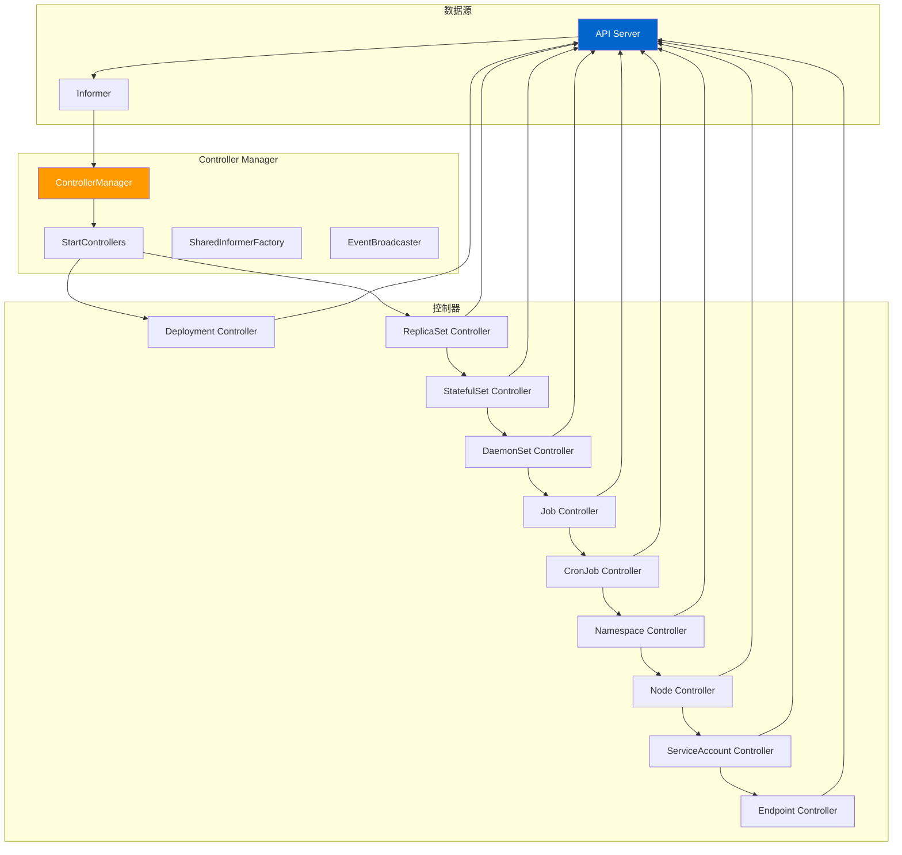
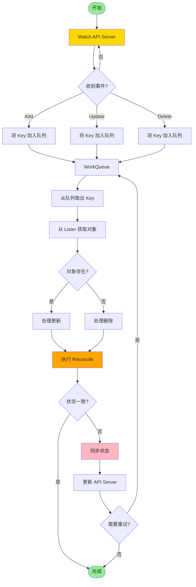
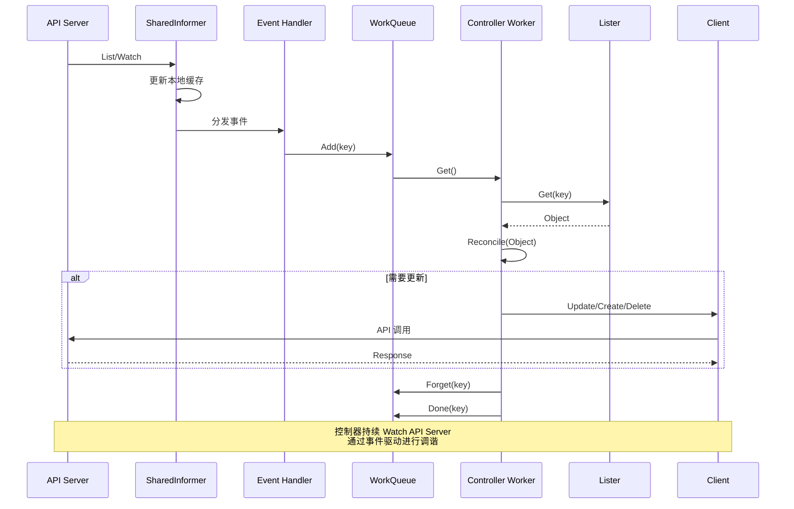
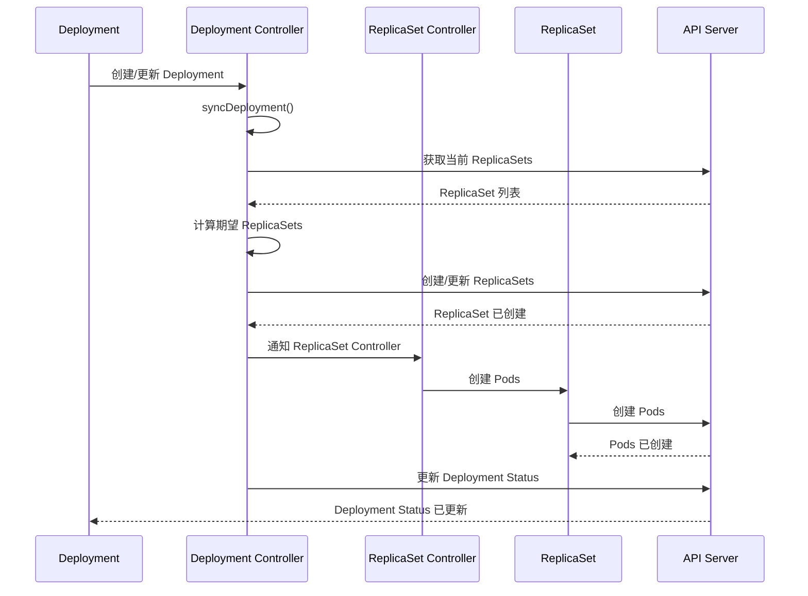
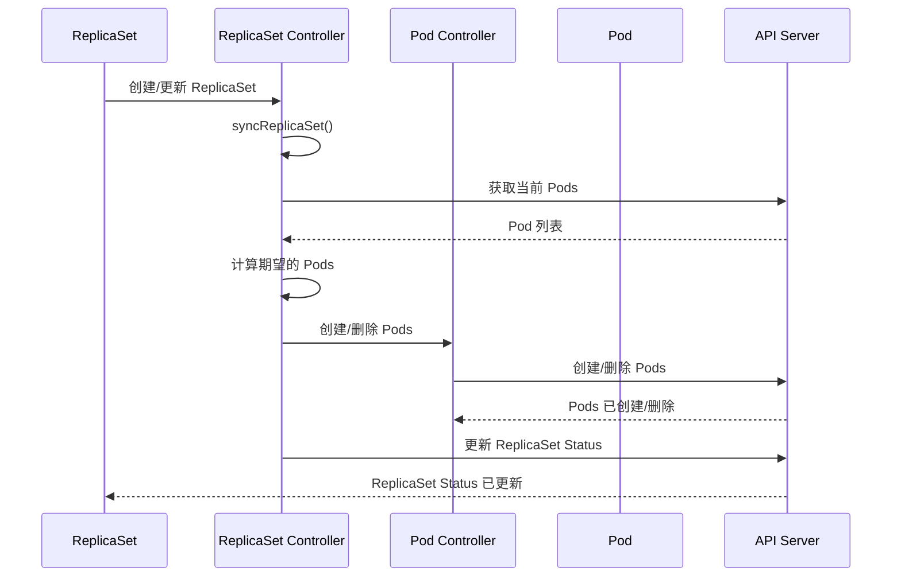
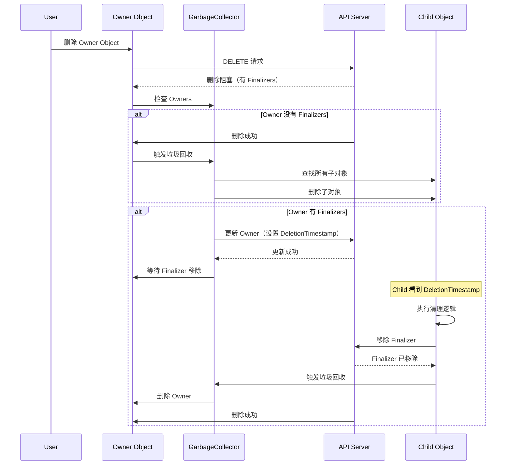

# Kubernetes Controller Manager 深度解析

## 概述

kube-controller-manager 是 Kubernetes 集群的控制平面组件，负责：
- 运行多个核心控制器（Deployment, ReplicaSet, StatefulSet, DaemonSet 等）
- 协调期望状态和实际状态
- 处理垃圾回收（Garbage Collection）
- 管理命名空间、节点、服务账号等
- 支持控制器启动顺序依赖

本文档深入分析 Controller Manager 的启动流程、控制器框架、核心控制器实现、垃圾回收机制和 OwnerReference/Finalizers。

---

## 一、Controller Manager 架构

### 1.1 整体架构



### 1.2 控制器框架

```
期望状态（YAML/JSON） → Controller → Informer → API Server → 实际状态
                                              ↓
                                              Watch/Event
                                              ↓
                                              调谐（Reconcile）
```

**核心概念：**
- **期望状态（Desired State）**：用户在 YAML/JSON 中定义的状态
- **实际状态（Actual State）**：集群中实际运行的状态
- **调谐（Reconcile）**：控制器将实际状态调谐到期望状态的过程

### 1.3 控制器列表

| 控制器 | 作用 | 位置 |
|---------|------|------|
| Deployment Controller | 管理 Deployments | `pkg/controller/deployment/` |
| ReplicaSet Controller | 管理 ReplicaSets | `pkg/controller/replicaset/` |
| StatefulSet Controller | 管理 StatefulSets | `pkg/controller/statefulset/` |
| DaemonSet Controller | 管理 DaemonSets | `pkg/controller/daemon/` |
| Job Controller | 管理 Jobs | `pkg/controller/job/` |
| CronJob Controller | 管理 CronJobs | `pkg/controller/cronjob/` |
| Namespace Controller | 管理命名空间 | `pkg/controller/namespace/` |
| Node Controller | 管理节点 | `pkg/controller/node/` |
| ServiceAccount Controller | 管理服务账号 | `pkg/controller/serviceaccount/` |
| Endpoint Controller | 管理 Endpoints | `pkg/controller/endpoint/` |
| Service Controller | 管理 Services | `pkg/controller/service/` |
| ResourceQuota Controller | 管理资源配额 | `pkg/controller/resourcequota/` |
| PV Controller | 管理 PVs | `pkg/controller/persistentvolume/` |
| PVC Controller | 管理 PVCs | `pkg/controller/persistentvolume/` |

---

## 二、启动流程

### 2.1 主入口

**文件：** `cmd/kube-controller-manager/app/controllermanager.go`

```go
func NewControllerManagerCommand() *cobra.Command {
    s, err := options.NewKubeControllerManagerOptions()
    if err != nil {
        klog.Background().Error(err, "Unable to initialize command options")
        klog.FlushAndExit(klog.ExitFlushTimeout, 1)
    }

    cmd := &cobra.Command{
        Use: kubeControllerManager,
        Long: `The Kubernetes controller manager is a daemon that embeds
the core control loops shipped with Kubernetes. In applications of robotics and
automation, a control loop is a non-terminating loop that regulates the state of
the system. In Kubernetes, a controller is a control loop that watches the shared
state of the cluster through to apiserver and makes changes attempting to move the
current state towards the desired state.`,
        RunE: func(cmd *cobra.Command, args []string) error {
            return Run(ctx, c.Complete())
        },
    }

    return cmd
}
```

### 2.2 Run 函数

```go
func Run(ctx context.Context, c *config.CompletedConfig) error {
    // 1. 创建 SharedInformerFactory
    informerFactory := informers.NewSharedInformerFactory(
        c.Client,
        c.ComponentConfig.ResyncPeriod,
    )

    // 2. 创建控制器
    controllers := NewControllerInitializers(informerFactory, c)

    // 3. 启动控制器
    if err := StartControllers(ctx, controllers, c); err != nil {
        return err
    }

    // 4. 运行控制器
    informerFactory.Start(stopCh)

    <-stopCh
    return nil
}
```

### 2.3 控制器初始化

**文件：** `cmd/kube-controller-manager/app/core.go`

```go
func NewControllerInitializers(informerFactory informers.SharedInformerFactory, c *config.CompletedConfig) []ControllerInitializer {
    controllers := []ControllerInitializer{}

    // 核心控制器
    controllers = append(controllers, deployment.NewController)
    controllers = append(controllers, replicaset.NewController)
    controllers = append(controllers, statefulset.NewController)
    controllers = append(controllers, daemonset.NewController)

    // 批处理控制器
    controllers = append(controllers, job.NewController)
    controllers = append(controllers, cronjob.NewController)

    // 资源控制器
    controllers = append(controllers, namespace.NewController)
    controllers = append(controllers, node.NewController)
    controllers = append(controllers, serviceaccount.NewController)

    // 网络控制器
    controllers = append(controllers, endpoint.NewController)
    controllers = append(controllers, service.NewController)

    // 配额控制器
    controllers = append(controllers, resourcequota.NewController)

    return controllers
}
```

---

## 三、控制器框架

### 3.1 Controller 接口

**文件：** `pkg/controller/controller.go`

```go
type Controller interface {
    Run(workers int, stopCh <-chan struct{})
    HasSynced() bool
}
```

### 3.2 通用控制器结构

```go
type BaseController struct {
    // Listers 从 Informer 的本地缓存中获取对象
    lister cache.GenericLister

    // Sync Handler 处理调谐逻辑
    syncHandler func(key string) error

    // Queue 工作队列，存储需要处理的 key
    queue workqueue.RateLimitingInterface

    // EventRecorder 记录事件
    eventRecorder record.EventRecorder
}

func (c *BaseController) Run(workers int, stopCh <-chan struct{}) {
    defer c.queue.ShutDown()

    // 1. 启动 Informer
    go c.informer.Run(stopCh)

    // 2. 等待同步
    if !cache.WaitForCacheSync(stopCh, c.hasSynced) {
        return
    }

    // 3. 启动 worker
    for i := 0; i < workers; i++ {
        go wait.Until(c.worker, time.Second, stopCh)
    }

    <-stopCh
}

func (c *BaseController) worker() {
    for c.processNextWorkItem() {
    }
}

func (c *BaseController) processNextWorkItem() bool {
    // 1. 从队列获取 key
    key, quit := c.queue.Get()
    if quit {
        return false
    }

    // 2. 调谐
    err := c.syncHandler(key)

    // 3. 处理结果
    if err == nil {
        c.queue.Forget(key)
    } else if IsRetryableError(err) {
        c.queue.AddRateLimited(key)
    } else {
        c.queue.Forget(key)
        c.eventRecorder.Eventf(object, corev1.EventTypeWarning, "Failed", "Failed to sync: %v", err)
    }

    return true
}
```

### 3.3 Informer 机制

```go
// 创建 Informer
informer := informerFactory.Apps().V1().Deployments().Informer()

// 添加事件处理器
informer.AddEventHandler(cache.ResourceEventHandlerFuncs{
    AddFunc: func(obj interface{}) {
        key, err := cache.MetaNamespaceKeyFunc(obj)
        if err == nil {
            c.queue.Add(key)
        }
    },
    UpdateFunc: func(oldObj, newObj interface{}) {
        key, err := cache.MetaNamespaceKeyFunc(newObj)
        if err == nil {
            c.queue.Add(key)
        }
    },
    DeleteFunc: func(obj interface{}) {
        key, err := cache.MetaNamespaceKeyFunc(obj)
        if err == nil {
            c.queue.Add(key)
        }
    },
})

// 启动 Informer
informer.Run(stopCh)
```

#### 控制器完整循环流程图



#### 控制器与 Informer 交互流程图



---

## 四、Deployment Controller 深度分析

### 4.1 Deployment Controller 结构

**文件：** `pkg/controller/deployment/deployment_controller.go`

```go
type DeploymentController struct {
    // ReplicaSet 控制
    rsControl controller.RSControlInterface
    client    clientset.Interface

    // Listers
    dLister appslisters.DeploymentLister
    rsLister appslisters.ReplicaSetLister
    podLister corelisters.PodLister
    podIndexer cache.Indexer

    // 同步状态
    dListerSynced cache.InformerSynced
    rsListerSynced cache.InformerSynced
    podListerSynced cache.InformerSynced

    // 工作队列
    queue workqueue.TypedRateLimitingInterface[string]
}
```

### 4.2 Deployment 调谐流程



### 4.3 syncDeployment 函数

```go
func (dc *DeploymentController) syncDeployment(ctx context.Context, key string) error {
    // 1. 解析 key
    namespace, name, err := cache.SplitMetaNamespaceKey(key)
    if err != nil {
        return err
    }

    // 2. 获取 Deployment
    deployment, err := dc.dLister.Deployments(namespace).Get(name)
    if errors.IsNotFound(err) {
        return nil
    }
    if err != nil {
        return err
    }

    // 3. 获取相关的 ReplicaSets
    rsList, err := dc.getReplicaSetsForDeployment(deployment)
    if err != nil {
        return err
    }

    // 4. 获取相关的 Pods
    podList, err := dc.getPodsForDeployment(deployment, rsList)
    if err != nil {
        return err
    }

    // 5. 计算期望的 ReplicaSets
    newRS, rsList, err := dc.getNewReplicaSet(deployment, rsList)
    if err != nil {
        return err
    }

    // 6. 缩放 ReplicaSets
    if deployment.Spec.Replicas != nil {
        if _, _, err := dc.scaleReplicaSet(ctx, newRS, *deployment.Spec.Replicas, deployment); err != nil {
            return err
        }
    }

    // 7. 清理旧的 ReplicaSets
    if err := dc.cleanupReplicaSets(ctx, deployment, rsList); err != nil {
        return err
    }

    // 8. 更新 Deployment Status
    if err := dc.updateDeploymentStatus(ctx, deployment, newRS, rsList, podList); err != nil {
        return err
    }

    return nil
}
```

### 4.4 滚动更新策略

**文件：** `pkg/controller/deployment/rolling.go`

```go
type RollingUpdater struct {
    client           clientset.Interface
    rsControl       controller.RSControlInterface
    queue           workqueue.RateLimitingInterface
    pauseCondition  *apps.DeploymentCondition
}

func (ru *RollingUpdater) RollingUpdate(deployment *apps.Deployment, rs *apps.ReplicaSet, pods []*v1.Pod) error {
    // 1. 计算新的 ReplicaSet
    newRS := ru.calculateNewReplicaSet(deployment, rs, pods)

    // 2. 创建新的 ReplicaSet
    if err := ru.rsControl.CreateReplicaSet(ctx, newRS); err != nil {
        return err
    }

    // 3. 缩放新的 ReplicaSet
    if err := ru.rsControl.ScaleReplicaSet(ctx, newRS, *deployment.Spec.Replicas, deployment); err != nil {
        return err
    }

    // 4. 等待新的 Pods Ready
    if err := ru.waitForNewReplicaSetReady(ctx, newRS); err != nil {
        return err
    }

    // 5. 缩放旧的 ReplicaSet
    if err := ru.rsControl.ScaleReplicaSet(ctx, oldRS, 0, deployment); err != nil {
        return err
    }

    // 6. 删除旧的 ReplicaSet
    if err := ru.rsControl.DeleteReplicaSet(ctx, oldRS); err != nil {
        return err
    }

    return nil
}
```

### 4.5 滚动更新参数

```yaml
apiVersion: apps/v1
kind: Deployment
spec:
  strategy:
    type: RollingUpdate
    rollingUpdate:
      maxSurge: 25%          # 最大超出的 Pod 数量
      maxUnavailable: 25%      # 最大不可用的 Pod 数量
  minReadySeconds: 0          # 最小就绪时间
  revisionHistoryLimit: 10     # 保留的历史版本数
```

---

## 五、ReplicaSet Controller 深度分析

### 5.1 ReplicaSet Controller 结构

**文件：** `pkg/controller/replicaset/`

```go
type ReplicaSetController struct {
    // Pod 控制
    podControl controller.PodControlInterface
    client    clientset.Interface

    // Listers
    rsLister appslisters.ReplicaSetLister
    podLister corelisters.PodLister
    podIndexer cache.Indexer

    // 同步状态
    rsListerSynced cache.InformerSynced
    podListerSynced cache.InformerSynced

    // 工作队列
    queue workqueue.TypedRateLimitingInterface[string]
}
```

### 5.2 ReplicaSet 调谐流程



### 5.3 syncReplicaSet 函数

```go
func (rsc *ReplicaSetController) syncReplicaSet(ctx context.Context, key string) error {
    // 1. 解析 key
    namespace, name, err := cache.SplitMetaNamespaceKey(key)
    if err != nil {
        return err
    }

    // 2. 获取 ReplicaSet
    rs, err := rsc.rsLister.ReplicaSets(namespace).Get(name)
    if errors.IsNotFound(err) {
        return nil
    }
    if err != nil {
        return err
    }

    // 3. 获取相关的 Pods
    podList, err := rsc.getPodsForReplicaSet(rs)
    if err != nil {
        return err
    }

    // 4. 计算期望的 Pod 数量
    desiredReplicas := *rs.Spec.Replicas

    // 5. 计算 Pod 的差异
    diff := len(podList) - desiredReplicas

    // 6. 调整 Pods
    if diff > 0 {
        // 删除多余的 Pods
        if err := rsc.deletePods(ctx, rs, diff); err != nil {
            return err
        }
    } else if diff < 0 {
        // 创建缺失的 Pods
        if err := rsc.createPods(ctx, rs, -diff); err != nil {
            return err
        }
    }

    // 7. 更新 ReplicaSet Status
    if err := rsc.updateReplicaSetStatus(ctx, rs, podList); err != nil {
        return err
    }

    return nil
}
```

---

## 六、StatefulSet Controller 深度分析

### 6.1 StatefulSet Controller 结构

**文件：** `pkg/controller/statefulset/stateful_set_control.go`

```go
type StatefulSetControl struct {
    // Pod 控制
    podControl controller.PodControlInterface

    // Listers
    ssLister appslisters.StatefulSetLister
    podLister corelisters.PodLister
    pvcLister corelisters.PersistentVolumeClaimLister

    // 工作队列
    queue workqueue.RateLimitingInterface[string]
}
```

### 6.2 StatefulSet 特性

StatefulSet 与 ReplicaSet 的区别：

| 特性 | StatefulSet | ReplicaSet |
|------|-------------|------------|
| Pod 名称 | 有序（web-0, web-1, web-2） | 随机 |
| Pod 网络 | 稳定网络标识 | 随机网络 |
| 存储 | 专用 PVC | 共享 PVC |
| 部署顺序 | 有序部署 | 并发部署 |
| 缩放 | 顺序缩放 | 并发缩放 |

### 6.3 StatefulSet 调谐流程

```go
func (ssc *StatefulSetControl) syncStatefulSet(ctx context.Context, key string) error {
    // 1. 解析 key
    namespace, name, err := cache.SplitMetaNamespaceKey(key)
    if err != nil {
        return err
    }

    // 2. 获取 StatefulSet
    ss, err := ssc.ssLister.StatefulSets(namespace).Get(name)
    if errors.IsNotFound(err) {
        return nil
    }
    if err != nil {
        return err
    }

    // 3. 获取相关的 Pods
    podList, err := ssc.getPodsForStatefulSet(ss)
    if err != nil {
        return err
    }

    // 4. 计算期望的 Pods
    desiredReplicas := *ss.Spec.Replicas

    // 5. 按 Pod 名称排序（0, 1, 2, ...）
    sort.Slice(podList, func(i, j int) bool {
        return getOrdinal(podList[i].Name) < getOrdinal(podList[j].Name)
    })

    // 6. 顺序创建/删除 Pods
    for i := 0; i < desiredReplicas; i++ {
        if i < len(podList) {
            // Pod 已存在，检查是否需要更新
            if !podEquals(podList[i], ss, i) {
                if err := ssc.updatePod(ctx, podList[i], ss, i); err != nil {
                    return err
                }
            }
        } else {
            // Pod 不存在，创建新的 Pod
            if err := ssc.createPod(ctx, ss, i); err != nil {
                return err
            }
        }
    }

    // 7. 删除多余的 Pods（按逆序）
    for i := len(podList) - 1; i >= desiredReplicas; i-- {
        if err := ssc.deletePod(ctx, podList[i]); err != nil {
            return err
        }
    }

    return nil
}
```

---

## 七、DaemonSet Controller 深度分析

### 7.1 DaemonSet Controller 结构

**文件：** `pkg/controller/daemon/`

```go
type DaemonSetsController struct {
    // Pod 控制
    podControl controller.PodControlInterface

    // Listers
    dsLister appslisters.DaemonSetLister
    nodeLister corelisters.NodeLister
    podLister corelisters.PodLister
    nodeIndexer cache.Indexer

    // 工作队列
    queue workqueue.TypedRateLimitingInterface[string]
}
```

### 7.2 DaemonSet 特性

DaemonSet 确保：
- 每个节点运行一个 Pod 副本
- 节点加入/退出时自动创建/删除 Pod
- 支持节点选择器（NodeSelector）
- 支持容忍节点的 Taints

### 7.3 DaemonSet 调谐流程

```go
func (dsc *DaemonSetsController) syncDaemonSet(ctx context.Context, key string) error {
    // 1. 获取 DaemonSet
    ds, err := dsc.dsLister.DaemonSets(namespace).Get(name)
    if errors.IsNotFound(err) {
        return nil
    }
    if err != nil {
        return err
    }

    // 2. 获取所有符合条件的节点
    nodeList, err := dsc.getNodesForDaemonSet(ds)
    if err != nil {
        return err
    }

    // 3. 获取当前运行的 Pods
    podList, err := dsc.getPodsForDaemonSet(ds)
    if err != nil {
        return err
    }

    // 4. 为每个节点创建 Pod
    for _, node := range nodeList {
        if !dsc.hasPodForNode(podList, node.Name) {
            if err := dsc.podControl.CreatePod(ctx, ds, node); err != nil {
                return err
            }
        }
    }

    // 5. 删除多余的 Pods
    if err := dsc.deleteOrphanedPods(ctx, ds, nodeList, podList); err != nil {
        return err
    }

    return nil
}
```

---

## 八、垃圾回收机制

### 8.1 垃圾回收器

**文件：** `pkg/controller/garbagecollector/`

```go
type GarbageCollector struct {
    // 客户端
    client clientset.Interface

    // 监控器
    monitors []monitors.Interface

    // 工作队列
    attemptToDeleteWorkqueue workqueue.RateLimitingInterface
    dirtyWorkqueue          workqueue.RateLimitingInterface
}
```

### 8.2 OwnerReference

OwnerReference 定义对象的父子关系：

```go
type OwnerReference struct {
    APIVersion string `json:"apiVersion,omitempty"`
    Kind       string `json:"kind,omitempty"`
    Name       string `json:"name,omitempty"`
    UID        types.UID `json:"uid,omitempty"`
    Controller *bool  `json:"controller,omitempty"`
    BlockOwnerDeletion *bool `json:"blockOwnerDeletion,omitempty"`
}
```

**示例：**
```yaml
apiVersion: apps/v1
kind: ReplicaSet
metadata:
  name: my-replicaset
spec:
  replicas: 3
  template:
    metadata:
      ownerReferences:
      - apiVersion: apps/v1
        kind: Deployment
        name: my-deployment
        uid: 12345
        controller: true
        blockOwnerDeletion: true
```

### 8.3 Finalizers

Finalizers 阻止对象被删除：

```go
type ObjectMeta struct {
    Finalizers []string
}
```

**示例：**
```yaml
apiVersion: v1
kind: Pod
metadata:
  name: my-pod
  finalizers:
  - kubernetes.io/pv-protection
  - kubernetes.io/pvc-protection
```

### 8.4 垃圾回收流程



### 8.5 垃圾回收算法

```go
func (gc *GarbageCollector) attemptToDeleteObject(ctx context.Context, item *node) error {
    // 1. 获取对象
    owner, err := gc.getOwner(item.identity)
    if err != nil {
        return err
    }

    // 2. 检查 Finalizers
    if len(owner.Finalizers) > 0 {
        // 3. 有 Finalizers，等待清理
        klog.InfoS("object with finalizers", "object", klog.KObj(owner))
        return nil
    }

    // 4. 没有 Finalizers，可以删除
    if err := gc.client.Delete(ctx, owner); err != nil {
        return err
    }

    // 5. 删除成功，处理子对象
    if err := gc.processItem(item); err != nil {
        return err
    }

    return nil
}
```

---

## 九、关键代码路径

### 9.1 启动流程
```
cmd/kube-controller-manager/app/controllermanager.go
├── NewControllerManagerCommand()      # 创建命令
├── Run()                            # 运行控制器管理器
└── StartControllers()                 # 启动所有控制器
```

### 9.2 控制器框架
```
pkg/controller/controller.go
├── Controller                        # 控制器接口
└── BaseController                  # 通用控制器实现
```

### 9.3 Deployment Controller
```
pkg/controller/deployment/
├── deployment_controller.go            # 主控制器
├── sync.go                           # 调谐逻辑
├── rolling.go                        # 滚动更新
├── recreate.go                       # 重建策略
└── rollback.go                       # 回滚逻辑
```

### 9.4 ReplicaSet Controller
```
pkg/controller/replicaset/
├── replica_set_control.go           # 主控制器
├── replica_set_utils.go            # 工具函数
└── replica_set.go                  # 类型定义
```

### 9.5 StatefulSet Controller
```
pkg/controller/statefulset/
├── stateful_set_control.go          # 主控制器
├── stateful_set_utils.go           # 工具函数
├── stateful_set_status_updater.go # 状态更新
└── stateful_set.go                  # 类型定义
```

### 9.6 DaemonSet Controller
```
pkg/controller/daemon/
├── daemon_controller.go                # 主控制器
├── daemon_controller_test.go         # 测试
└── daemon_controller_utils.go         # 工具函数
```

### 9.7 垃圾回收器
```
pkg/controller/garbagecollector/
├── garbagecollector.go                # 垃圾回收器
├── builder.go                        # 构建器
└── graph.go                         # 依赖图
```

---

## 十、最佳实践

### 10.1 控制器配置

**生产环境推荐配置：**

```bash
--concurrent-deployment-syncs=5        # 并行 Deployment 同步数
--concurrent-gc-syncs=20            # 并行垃圾回收数
--use-endpoint-slices=true           # 使用 EndpointSlices
--node-monitor-period=5s             # 节点监控周期
--pod-eviction-timeout=30s           # Pod 驱逐超时
--pv-recycler-pod-template-file=/etc/kubernetes/pv-recycler.yaml
--enable-garbage-collector=true      # 启用垃圾回收
--enable-attach-detach-reconcile-sync=true  # 启用卷挂载/卸载同步
```

### 10.2 控制器开发最佳实践

1. **使用 SharedInformerFactory**
   - 减少 API Server 压力
   - 共享 Informer 和 Lister

2. **使用工作队列**
   - 缓冲变更事件
   - 支持限流

3. **记录事件**
   - 方便故障排查
   - 提供审计日志

4. **使用 OwnerReference**
   - 建立对象关系
   - 支持垃圾回收

5. **使用 Finalizers**
   - 阻止删除
   - 执行清理逻辑

### 10.3 性能优化

1. **并行处理**
   ```yaml
   --concurrent-deployment-syncs=5
   --concurrent-replicaset-syncs=5
   ```

2. **批量处理**
   - 使用 List 获取所有对象
   - 减少往返次数

3. **本地缓存**
   - 使用 Informer 的本地缓存
   - 避免频繁访问 API Server

4. **使用 WorkQueue**
   - 限流避免压垮 API Server
   - 重试失败的操作

---

## 十一、故障排查

### 11.1 常见问题

#### 1. 控制器不同步
**症状：** Pod 数量不等于期望值

**排查：**
- 检查控制器日志
- 使用 `kubectl describe deployment` 查看状态
- 检查控制器是否运行

#### 2. 垃圾回收失败
**症状：** 对象无法删除

**排查：**
- 检查 Finalizers
- 检查 OwnerReference
- 检查垃圾回收器日志

#### 3. 控制器冲突
**症状：** 多个控制器操作同一资源

**排查：**
- 检查控制器配置
- 使用 Leader Election
- 避免重复注册

### 11.2 调试技巧

1. **启用详细日志**
   ```bash
   --v=4
   --vmodule=controller*=4
   ```

2. **检查控制器状态**
   ```bash
   kubectl get deployments --all-namespaces
   kubectl describe deployment <deployment-name>
   ```

3. **监控指标**
   - `controller_runtime_reconcile_total` - 调谐次数
   - `controller_runtime_reconcile_errors_total` - 调谐错误
   - `workqueue_depth` - 工作队列深度

4. **检查事件**
   ```bash
   kubectl get events --sort-by='.lastTimestamp'
   ```

---

## 十二、总结

### 12.1 架构特点

1. **多控制器架构**：多个控制器独立运行，协同工作
2. **SharedInformerFactory**：共享 Informer，减少 API Server 压力
3. **工作队列**：缓冲变更事件，支持限流
4. **垃圾回收机制**：自动清理孤儿对象
5. **OwnerReference**：建立对象关系

### 12.2 关键流程

1. **启动流程**：配置 → 创建控制器 → 启动 Informers → 启动 Workers
2. **调谐流程**：Informer → Queue → Worker → SyncHandler → API Server
3. **垃圾回收流程**：删除对象 → 检查 Finalizers → 删除子对象

### 12.3 扩展点

1. **自定义控制器**：实现 Controller 接口
2. **CRD 控制器**：使用 Controller Runtime
3. **Operator 模式**：扩展 Kubernetes 能力

---

## 参考资源

- [Kubernetes Controller Manager 文档](https://kubernetes.io/docs/concepts/architecture/controller/)
- [Kubernetes 源码](https://github.com/kubernetes/kubernetes)
- [控制器设计文档](https://github.com/kubernetes/community/blob/master/contributors/design-proposals)

---

**文档版本**：v1.0
**最后更新**：2026-03-03
**分析范围**：Kubernetes v1.x
