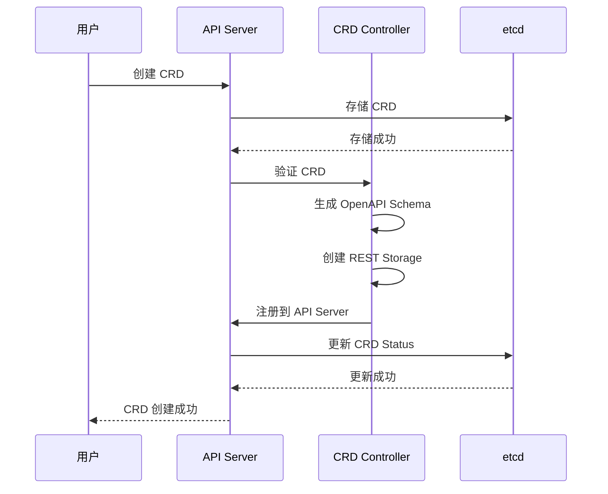
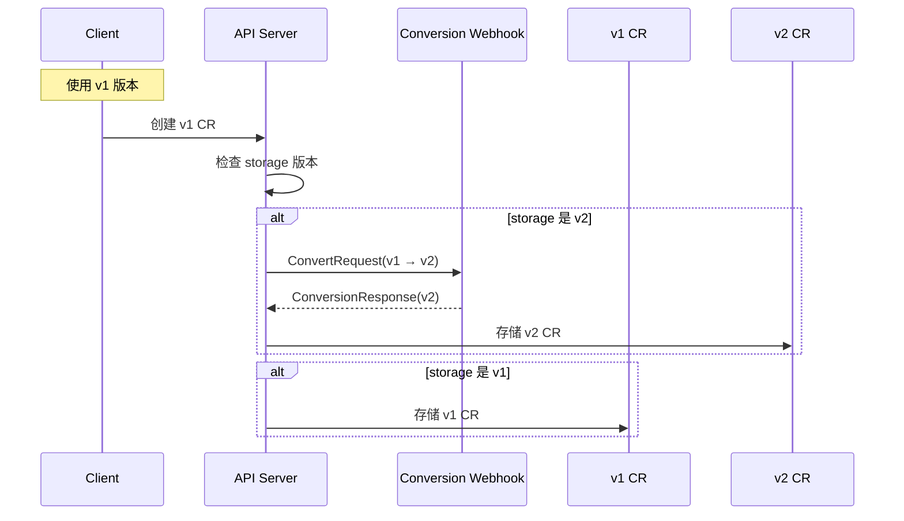
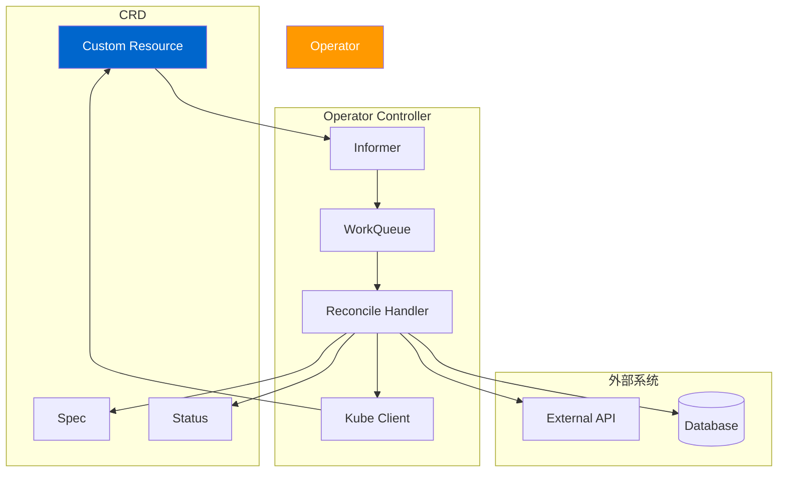

# Kubernetes CRD 和 Operator 深度解析

## 概述

CRD（Custom Resource Definition）允许用户在 Kubernetes 中定义自定义资源类型，Operator 模式通过控制器协调自定义资源的状态。本文档深入分析 CRD 的定义、注册、版本管理、转换机制和 Operator 开发模式。

---

## 一、CRD 概述

### 1.1 CRD 作用

CRD 允许：
- 扩展 Kubernetes API
- 定义自定义资源类型
- 使用 kubectl 管理自定义资源
- 实现特定业务逻辑

### 1.2 Operator 模式

Operator 是使用自定义资源的控制器：
- 监听 CRD 资源
- 实现业务逻辑
- 协调期望状态和实际状态
- 自动化管理应用

### 1.3 CRD 架构

```mermaid
graph TB
    subgraph "CRD 定义"
        User[用户]
        YAML[CRD YAML]
        API[API Server]
    end

    subgraph "CRD 处理"
        CRD[CRD Controller]
        Schema[OpenAPI Schema]
        Storage[REST Storage]
        Version[版本转换]
    end

    subgraph "Operator"
        Operator[Operator Controller]
        Reconcile[Reconcile Loop]
        Logic[业务逻辑]
    end

    subgraph "自定义资源"
        CR[Custom Resource]
        Spec[Spec]
        Status[Status]
    end

    User --> YAML --> API
    API --> CRD --> Schema --> Storage
    CRD --> Version --> API

    Operator --> CR
    Operator --> Reconcile --> Logic --> CR
    CR --> Spec --> Status

    style API fill:#ff9900,color:#fff
    style CR fill:#0066cc,color:#fff
```

---

## 二、CRD 定义

### 2.1 CRD YAML 示例

```yaml
apiVersion: apiextensions.k8s.io/v1
kind: CustomResourceDefinition
metadata:
  name: crontabs.stable.example.com
spec:
  group: stable.example.com
  versions:
    - name: v1
      served: true
      storage: true
      schema:
        openAPIV3Schema:
          type: object
          properties:
            spec:
              type: object
              properties:
                cronSpec:
                  type: string
                  pattern: '^(\d+|\*/\d+)\s+(\d+|\*/\d+)\s+(\d+|\*/\d+)\s+(\d+|\*/\d+)\s+(\d+|\*/\d+)$'
                image:
                  type: string
                replicas:
                  type: integer
                  minimum: 1
                  maximum: 10
            status:
              type: object
              properties:
                phase:
                  type: string
                  lastExecutionTime:
                    type: string
      subresources:
        status: {}
  scope: Namespaced
  names:
    plural: crontabs
    singular: crontab
    kind: CronTab
    shortNames:
    - ct
    conversion:
      strategy: Webhook
      webhook:
        clientConfig:
          service:
            name: webhook-service
            namespace: default
            path: /convert
        conversionReviewVersions: ["v1", "v1beta1"]
```

### 2.2 CRD 字段说明

| 字段 | 类型 | 说明 |
|------|------|------|
| `group` | string | API Group，例如 `stable.example.com` |
| `versions` | array | 支持的版本列表 |
| `scope` | string | `Namespaced` 或 `Cluster` |
| `names` | object | 资源名称 |
| `conversion` | object | 版本转换配置 |
| `validation` | object | 验证规则 |
| `subresources` | object | 子资源配置 |

### 2.3 版本字段

**CustomResourceDefinitionVersion：**

| 字段 | 说明 |
|------|------|
| `name` | 版本名称，例如 `v1` |
| `served` | 是否通过 API Server 服务 |
| `storage` | 是否存储在 etcd 中 |
| `schema` | OpenAPI v3 Schema |
| `subresources` | 子资源定义 |
| `additionalPrinterColumns` | 额外的打印列 |

---

## 三、CRD 注册流程

### 3.1 CRD 创建流程



### 3.2 CRD Status

```yaml
status:
  acceptedNames:
    kind: CronTab
    plural: crontabs
    shortNames:
    - ct
  conditions:
    - type: NamesAccepted
      status: True
      reason: NoConflicts
      lastTransitionTime: "2026-03-03T00:00:00Z"
    - type: Established
      status: True
      reason: InitialNamesAccepted
      lastTransitionTime: "2026-03-03T00:00:05Z"
  storedVersions:
    - v1
```

**Condition 类型：**

| Condition | 说明 |
|-----------|------|
| `NamesAccepted` | 名称是否被接受 |
| `NonStructuralSchema` | Schema 是否结构化 |
| `Terminating` | 是否正在终止 |
| `Established` | 是否已建立 |
| `Unknown` | 未知状态 |

---

## 四、CRD 版本管理

### 4.1 版本策略

Kubernetes CRD 支持两种版本策略：

#### 1. None（默认）
- 只有 `storage=true` 的版本存储在 etcd
- 其他版本自动转换到 storage 版本

#### 2. Webhook
- 使用外部 Webhook 进行版本转换
- 支持双向转换

### 4.2 版本转换流程



### 4.3 Conversion Webhook

**CRD 配置：**
```yaml
conversion:
  strategy: Webhook
  webhook:
    clientConfig:
      service:
        name: conversion-webhook
        namespace: default
        path: /convert
    conversionReviewVersions: ["v1", "v1beta1"]
```

**Webhook 请求：**
```go
type ConversionReview struct {
    Request  ConversionRequest `json:"request"`
    Response *ConversionResponse `json:"response,omitempty"`
}

type ConversionRequest struct {
    DesiredAPIVersion string            `json:"desiredAPIVersion"`
    Objects          []runtime.RawExtension `json:"objects"`
}

type ConversionResponse struct {
    UID     types.UID              `json:"uid"`
    Result   runtime.RawExtension    `json:"result,omitempty"`
    Failed   *ConversionResponseFields `json:"failed,omitempty"`
}
```

**Webhook 实现：**
```go
func (h *ConversionWebhook) ServeHTTP(w http.ResponseWriter, r *http.Request) {
    var review apiextensionsv1.ConversionReview
    if err := json.NewDecoder(r.Body).Decode(&review); err != nil {
        http.Error(w, err.Error(), http.StatusBadRequest)
        return
    }

    // 转换对象
    converted, err := h.convertObjects(review.Request.Objects, review.Request.DesiredAPIVersion)
    if err != nil {
        review.Response.Failed = &apiextensionsv1.ConversionResponseFields{
            Message: err.Error(),
        }
    } else {
        review.Response.Result = converted
    }

    // 返回转换结果
    json.NewEncoder(w).Encode(review)
}
```

---

## 五、OpenAPI Schema

### 5.1 Schema 结构

```yaml
spec:
  versions:
    - name: v1
      schema:
        openAPIV3Schema:
          type: object
          properties:
            spec:
              type: object
              required: [spec]
              properties:
                cronSpec:
                  type: string
                image:
                  type: string
            status:
              type: object
              x-kubernetes-patch-merge-key: status
              properties:
                phase:
                  type: string
                replicas:
                  type: integer
                  minimum: 0
```

### 5.2 Schema 验证

**验证级别：**

| 级别 | 说明 |
|------|------|
| `x-kubernetes-validation: <level>` | 自定义验证 |
| `properties.<name>.type` | 类型检查 |
| `required` | 必填字段 |
| `minimum/maximum` | 数值范围 |
| `pattern` | 正则表达式 |
| `enum` | 枚举值 |

### 5.3 Schema 特性

**x-kubernetes-patch-merge-key：**
- 指定用于 merge patch 的字段
- 通常设置为 `status`

**x-kubernetes-embedded-resource:**
- 嵌入另一个资源
- 例如 Pod Template 嵌入 Deployment

---

## 六、Subresources

### 6.1 Status Subresource

**CRD 配置：**
```yaml
versions:
  - name: v1
    subresources:
      status: {}
```

**Status Subresource 允许：**
- 单独更新 status 字段
- 避免 spec 被意外修改
- 使用 `PATCH` 操作

**更新 Status：**
```bash
kubectl patch crontab my-cron \
  --subresource=status \
  --type=merge \
  -p '{"status":{"phase":"Completed"}}'
```

### 6.2 Scale Subresource

**CRD 配置：**
```yaml
versions:
  - name: v1
    subresources:
      scale:
        specReplicasPath: .spec.replicas
        statusReplicasPath: .status.replicas
```

**Scale Subresource 允许：**
- 使用 `kubectl scale` 命令
- 自动处理扩缩容逻辑

---

## 七、Operator 开发

### 7.1 Operator 架构



### 7.2 使用 Kubebuilder 开发

#### 项目初始化

```bash
kubebuilder init --domain my.domain --repository my-operator
```

#### 创建 API

```bash
kubebuilder create api \
  --group my.domain \
  --version v1 \
  --kind CronTab
```

#### 创建 Controller

```bash
kubebuilder create controller \
  --kind CronTab \
  --name=crontab-controller
```

#### 实现 Reconcile 逻辑

**文件：** `internal/controller/crontab_controller.go`

```go
func (r *CronTabReconciler) Reconcile(ctx context.Context, req ctrl.Request) (ctrl.Result, error) {
    // 1. 获取 CronTab
    cronTab := &mydomainv1.CronTab{}
    if err := r.Get(ctx, req.NamespacedName, cronTab); err != nil {
        return ctrl.Result{}, client.IgnoreNotFound(err)
    }

    // 2. 检查删除
    if !cronTab.DeletionTimestamp.IsZero() {
        return ctrl.Result{}, nil
    }

    // 3. 获取相关的 Pods
    podList := &corev1.PodList{}
    if err := r.List(ctx, podList, client.InNamespace(req.Namespace), client.MatchingLabels(labels.Set{"crontab": req.Name})); err != nil {
        return ctrl.Result{}, err
    }

    // 4. 调整 Pod 数量
    if len(podList.Items) < int(*cronTab.Spec.Replicas) {
        // 创建缺失的 Pods
        for i := 0; i < int(*cronTab.Spec.Replicas) - len(podList.Items); i++ {
            pod := &corev1.Pod{
                ObjectMeta: metav1.ObjectMeta{
                    Name:      fmt.Sprintf("%s-%d", req.Name, i),
                    Namespace: req.Namespace,
                    Labels:    labels.Set{"crontab": req.Name},
                },
                Spec: corev1.PodSpec{
                    Containers: []corev1.Container{
                        {
                            Name:  "cron",
                            Image: cronTab.Spec.Image,
                        },
                    },
                },
            }

            if err := r.Create(ctx, pod); err != nil {
                return ctrl.Result{}, err
            }
        }
    }

    // 5. 更新 Status
    cronTab.Status.Phase = "Running"
    cronTab.Status.Replicas = int32(len(podList.Items))
    if err := r.Status().Update(ctx, cronTab); err != nil {
        return ctrl.Result{}, err
    }

    // 6. 重新调谐
    return ctrl.Result{RequeueAfter: time.Minute * 5}, nil
}
```

### 7.3 Operator 最佳实践

1. **使用 Finalizers**
   ```go
   if !cronTab.DeletionTimestamp.IsZero() && hasFinalizer(cronTab, "my.domain/finalizer") {
       // 执行清理逻辑
       if err := r.cleanup(ctx, cronTab); err != nil {
           return ctrl.Result{}, err
       }
       
       // 移除 Finalizer
       if err := r.removeFinalizer(ctx, cronTab, "my.domain/finalizer"); err != nil {
           return ctrl.Result{}, err
       }
   }
   ```

2. **使用 Events**
   ```go
   r.Recorder.Eventf(cronTab, corev1.EventTypeNormal, "Created", "Created pod %s", podName)
   ```

3. **使用 Conditions**
   ```go
   cronTab.Status.Conditions = []mydomainv1.Condition{
       {
           Type:               "Ready",
           Status:             "True",
           LastTransitionTime: metav1.Now(),
           Reason:              "PodsReady",
           Message:             "All pods are ready",
       },
   }
   ```

4. **错误处理**
   ```go
   if err != nil {
       r.Recorder.Eventf(cronTab, corev1.EventTypeWarning, "ReconcileError", "Reconcile failed: %v", err)
       return ctrl.Result{}, err
   }
   ```

5. **限流**
   ```go
   // 返回 RequeueAfter 避免频繁重试
   return ctrl.Result{RequeueAfter: time.Minute * 5}, nil
   ```

---

## 八、CRD 高级特性

### 8.1 Selectable Fields

**CRD 配置：**
```yaml
spec:
  versions:
    - name: v1
      selectableFields:
        - jsonPath: .spec.cronSpec
        - jsonPath: .spec.image
```

**使用 Field Selector：**
```bash
kubectl get crontabs --field-selector=spec.cronSpec==0 0 * * *
```

### 8.2 Additional Printer Columns

**CRD 配置：**
```yaml
spec:
  versions:
    - name: v1
      additionalPrinterColumns:
        - name: Schedule
          type: string
          description: The cron schedule
          jsonPath: .spec.cronSpec
```

**kubectl 输出：**
```bash
kubectl get crontabs
NAME         SCHEDULE    PHASE     REPLICAS
my-cron-1   0 0 * * *   Running    3
```

### 8.3 Validation

**CRD 配置：**
```yaml
spec:
  validation:
    openAPIV3Schema:
      type: object
      x-kubernetes-validations:
        - rule: "min_replicas"
          message: "Replicas must be at least 1"
          min: 1
```

---

## 九、关键代码路径

### 9.1 CRD API
```
staging/k8s.io/apiextensions-apiserver/pkg/apis/apiextensions/
├── types.go                        # CRD 类型定义
├── register.go                     # 注册
└── conversion.go                   # 转换逻辑
```

### 9.2 CRD Controller
```
staging/k8s.io/apiextensions-apiserver/pkg/apiserver/
├── cr_handler.go                   # CRD Handler
├── crd_rest.go                     # CRD REST Storage
├── discovery.go                    # API Discovery
└── webhook_adaptor.go              # Webhook 适配器
```

### 9.3 Controller Runtime
```
staging/k8s.io/controller-runtime/
├── pkg/builder/
│   ├── builder.go                   # 构建器
│   └── controller.go               # 控制器构建
└── pkg/controller/
    ├── controller.go                # 控制器接口
    └── reconcile.go                # 调谐逻辑
```

---

## 十、最佳实践

### 10.1 CRD 设计

1. **使用 Semantic Versioning**
   - 遵循 `v1`, `v1beta1`, `v1alpha1` 命名约定
   - 稳定版本使用 `v1`
   - 实验性版本使用 `alpha`

2. **Spec vs Status 分离**
   - Spec 由用户控制
   - Status 由控制器控制

3. **使用 Label**
   - 支持查询和过滤
   - 避免命名冲突

4. **使用 Finalizers**
   - 阻止删除
   - 执行清理逻辑

### 10.2 Operator 开发

1. **使用 Controller Runtime**
   - 简化控制器开发
   - 提供常用功能

2. **实现幂等性**
   - 多次调用结果相同
   - 避免重复操作

3. **错误处理**
   - 记录事件
   - 返回错误
   - 限流重试

4. **测试**
   - 单元测试
   - 集成测试
   - 端到端测试

---

## 十一、故障排查

### 11.1 常见问题

#### 1. CRD 未建立
**症状：** `Established` Condition 为 False

**排查：**
- 检查 CRD Schema
- 检查 CRD Name 冲突
- 检查 API Server 日志

#### 2. 自定义资源无法创建
**症状：** `CustomResourceDefinitionNotFound`

**排查：**
- 检查 CRD 是否已建立
- 检查 API Version
- 检查 CRD Name

#### 3. Operator 调谐失败
**症状：** `ReconcileError` Event

**排查：**
- 检查 Operator 日志
- 检查权限
- 检查 RBAC 规则

### 11.2 调试技巧

1. **启用详细日志**
   ```bash
   --v=4
   --vmodule=apiextensions*=4,controller-runtime*=4
   ```

2. **检查 CRD Status**
   ```bash
   kubectl get crd <crd-name> -o yaml
   ```

3. **检查 Events**
   ```bash
   kubectl get events --sort-by='.lastTimestamp'
   ```

4. **监控指标**
   - `controller_runtime_reconcile_total` - 调谐次数
   - `controller_runtime_reconcile_errors_total` - 调谐错误
   - `workqueue_depth` - 工作队列深度

---

## 十二、总结

### 12.1 CRD 特性

1. **扩展 API**：定义自定义资源类型
2. **版本管理**：支持多版本和转换
3. **Subresources**：Status 和 Scale
4. **OpenAPI Schema**：验证和文档
5. **Selectable Fields**：字段选择器
6. **Printer Columns**：自定义输出列

### 12.2 Operator 特性

1. **自动化**：自动调谐资源状态
2. **幂等性**：多次调用结果相同
3. **事件记录**：记录操作和错误
4. **限流**：避免频繁重试
5. **Finalizers**：支持清理逻辑

### 12.3 关键流程

1. **CRD 注册流程**：CRD → API Server → Schema → REST Storage
2. **Operator 调谐流程**：Informer → Queue → Reconcile → API Server
3. **版本转换流程**：Request → Webhook → Response → Storage

---

## 参考资源

- [Kubernetes CRD 文档](https://kubernetes.io/docs/concepts/extend-kubernetes/api-extension/custom-resources/)
- [Operator SDK](https://sdk.operatorframework.io/)
- [Kubebuilder 文档](https://book.kubebuilder.io/)
- [Kubernetes 源码](https://github.com/kubernetes/kubernetes)
- [CRD 设计文档](https://github.com/kubernetes/community/blob/master/contributors/design-proposals)

---

**文档版本**：v1.0
**最后更新**：2026-03-03
**分析范围**：Kubernetes v1.x
