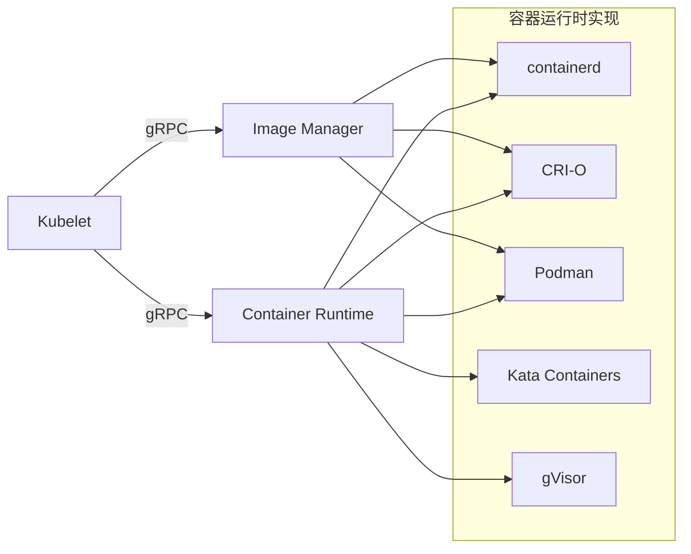
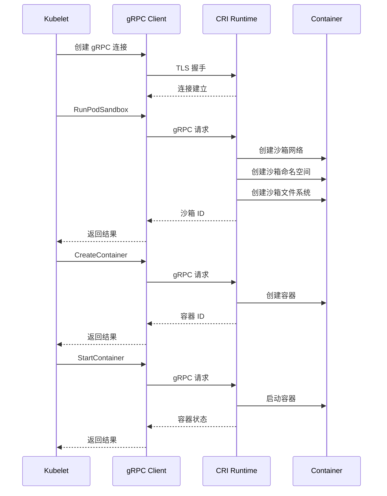
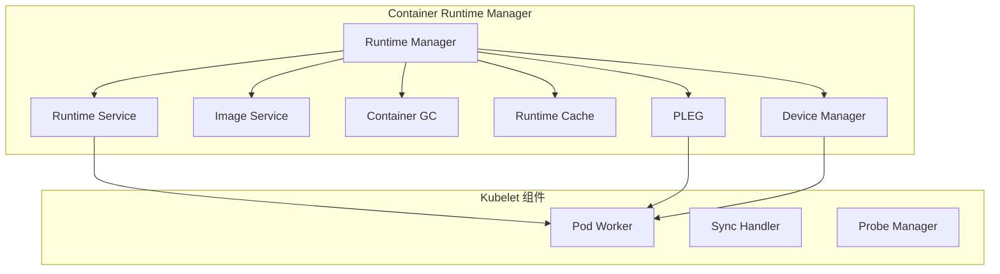
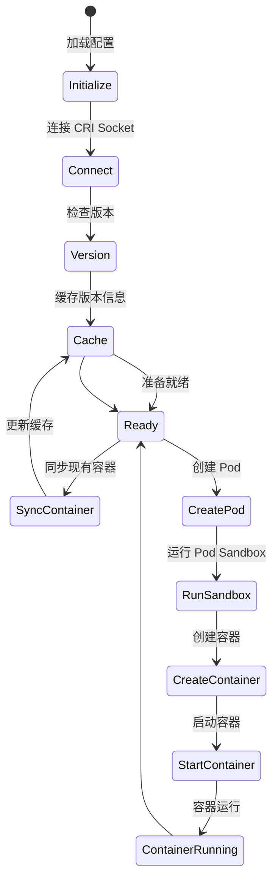
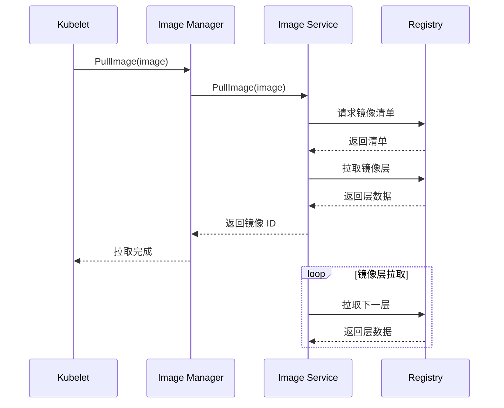
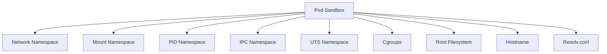
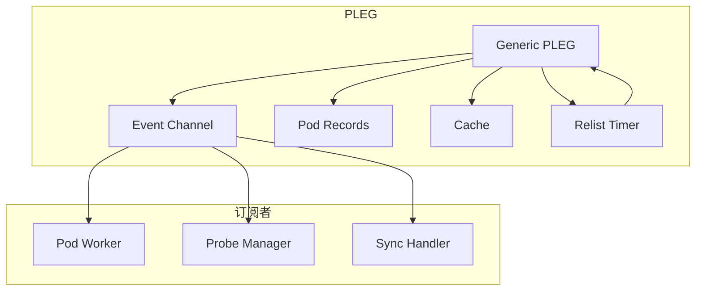
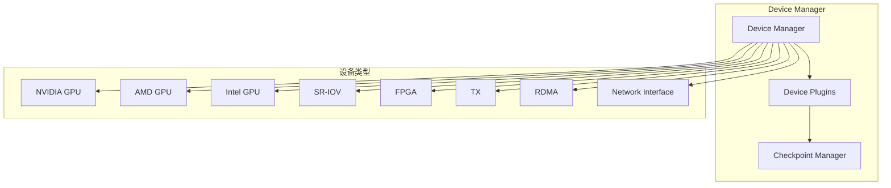

# CRI 深度分析

> 本文档深入分析 Kubernetes 容器运行时接口（CRI），包括 CRI API 定义、Container Runtime Manager 实现、镜像管理、PLEG 和 Device Manager。

---

## 目录

1. [CRI 概述](#cri-概述)
2. [CRI API 架构](#cri-api-架构)
3. [Container Runtime Manager](#container-runtime-manager)
4. [镜像管理](#镜像管理)
5. [Pod Sandbox 机制](#pod-sandbox-机制)
6. [PLEG - Pod Lifecycle Event Generator](#pleg---pod-lifecycle-event-generator)
7. [Device Manager](#device-manager)
8. [CRI 最佳实践](#cri-最佳实践)

---

## CRI 概述

### CRI 的作用

CRI（Container Runtime Interface）是 Kubernetes 与容器运行时（Container Runtime）之间的**标准接口**，实现：



### CRI 版本演进

| 版本 | 发布时间 | 主要特性 | Kubernetes 版本 |
|------|---------|---------|--------------|
| **v1alpha1** | 2016 | 首个版本 | 1.5 |
| **v1alpha2** | 2017 | 增加 Image Service | 1.6 |
| **v1** | 2018 | 稳定 API，TLS 支持 | 1.10 |
| **v1alpha2** | 2019 | Runtime Config、设备映射 | 1.15 |
| **v1alpha3** | 2020 | Windows 支持、User Namespaces | 1.18 |
| **v1alpha2** | 2021 | 改进 Windows 支持 | 1.21 |
| **v1** | 2021 | 稳定版本 | 1.23 |

### CRI 主要接口

CRI 定义了两个主要 gRPC 服务：

**1. RuntimeService** - 管理 Pod 和容器生命周期

**2. ImageService** - 管理镜像

```go
// CRI Runtime Service 接口
service RuntimeService {
    // Version 返回运行时版本信息
    rpc Version(VersionRequest) returns (VersionResponse) {}
    
    // RunPodSandbox 创建 Pod 沙箱
    rpc RunPodSandbox(RunPodSandboxRequest) returns (RunPodSandboxResponse) {}
    
    // StopPodSandbox 停止 Pod 沙箱
    rpc StopPodSandbox(StopPodSandboxRequest) returns (StopPodSandboxResponse) {}
    
    // RemovePodSandbox 删除 Pod 沙箱
    rpc RemovePodSandbox(RemovePodSandboxRequest) returns (RemovePodSandboxResponse) {}
    
    // PodSandboxStatus 返回 Pod 沙箱状态
    rpc PodSandboxStatus(PodSandboxStatusRequest) returns (PodSandboxStatusResponse) {}
    
    // ListPodSandbox 列出所有 Pod 沙箱
    rpc ListPodSandbox(ListPodSandboxRequest) returns (ListPodSandboxResponse) {}
    
    // CreateContainer 创建容器
    rpc CreateContainer(CreateContainerRequest) returns (CreateContainerResponse) {}
    
    // StartContainer 启动容器
    rpc StartContainer(StartContainerRequest) returns (StartContainerResponse) {}
    
    // StopContainer 停止容器
    rpc StopContainer(StopContainerRequest) returns (StopContainerResponse) {}
    
    // RemoveContainer 删除容器
    rpc RemoveContainer(RemoveContainerRequest) returns (RemoveContainerResponse) {}
    
    // ListContainers 列出容器
    rpc ListContainers(ListContainersRequest) returns (ListContainersResponse) {}
    
    // ContainerStatus 返回容器状态
    rpc ContainerStatus(ContainerStatusRequest) returns (ContainerStatusResponse) {}
    
    // UpdateRuntimeConfig 更新运行时配置
    rpc UpdateRuntimeConfig(UpdateRuntimeConfigRequest) returns (UpdateRuntimeConfigResponse) {}
    
    // Status 返回运行时状态
    rpc Status(StatusRequest) returns (StatusResponse) {}
}

// CRI Image Service 接口
service ImageService {
    // ListImages 列出镜像
    rpc ListImages(ListImagesRequest) returns (ListImagesResponse) {}
    
    // ImageStatus 返回镜像状态
    rpc ImageStatus(ImageStatusRequest) returns (ImageStatusResponse) {}
    
    // PullImage 拉取镜像
    rpc PullImage(PullImageRequest) returns (PullImageResponse) {}
    
    // RemoveImage 删除镜像
    rpc RemoveImage(RemoveImageRequest) returns (RemoveImageResponse) {}
    
    // ImageFsInfo 返回镜像文件系统信息
    rpc ImageFsInfo(ImageFsInfoRequest) returns (ImageFsInfoResponse) {}
}
```

---

## CRI API 架构

### CRI 通信方式

Kubelet 通过 gRPC 与容器运行时通信：



### CRI 安全性

```go
// CRI 连接配置
type criConfig struct {
    RuntimeEndpoint    string  // Unix socket 路径
    ImageEndpoint     string  // Unix socket 路径
    RuntimeRequestTimeout  time.Duration
    RuntimeSyncTimeout    time.Duration
    ImagePullProgressDeadline  time.Duration
    // 启用 TLS
    EnableTLS bool
    // TLS 证书配置
    TLSCertFile string
    TLSKeyFile  string
    TLSCAFile   string
}
```

| 安全特性 | 说明 | 推荐配置 |
|---------|------|---------|
| **Unix Socket** | 本地通信，网络隔离 | `/run/containerd/containerd.sock` |
| **TLS** | 可选，增强安全性 | 生产环境启用 |
| **文件权限** | 限制访问权限 | `chmod 600` |
| **证书轮换** | 定期更新证书 | 90 天 |

---

## Container Runtime Manager

### Runtime Manager 架构

**位置**: `pkg/kubelet/kuberuntime/kuberuntime_manager.go`



### Runtime Manager 实现

```go
type kubeGenericRuntimeManager struct {
    // gRPC 服务客户端
    runtimeService   internalapi.RuntimeService
    imageService     internalapi.ImageManagerService
    
    // 版本缓存
    versionCache    *cache.ObjectCache
    
    // 容器 GC 管理器
    containerGC    *containerGC
    
    // 镜像拉取器
    imagePuller    images.ImageManager
    
    // 容器管理器
    containerManager cm.ContainerManager
    
    // 内部生命周期处理器
    internalLifecycle cm.InternalContainerLifecycle
    
    // 日志管理器
    logManager      logs.ContainerLogManager
    
    // RuntimeClass 管理器
    runtimeClassManager *runtimeclass.Manager
    
    // PLEG 管理器
    pleg            PodLifecycleEventGenerator
    
    // 健康检查结果管理
    livenessManager  proberesults.Manager
    readinessManager proberesults.Manager
    startupManager   proberesults.Manager
    
    // 机器信息
    machineInfo    *cadvisorapi.MachineInfo
}

// NewKubeGenericRuntimeManager 创建 Runtime Manager
func NewKubeGenericRuntimeManager(
    runtimeName string,
    runtimeEndpoint string,
    imageEndpoint string,
    runtimeVersion string,
    runtimeAPIVersion string,
    seccompDefault bool,
    seccompProfileRoot string,
    machineInfo *cadvisorapi.MachineInfo,
    podStateProvider podStateProvider,
    osInterface kubecontainer.OSInterface,
    recorder record.EventRecorderLogger,
    ...) KubeGenericRuntime
```

### Runtime Manager 核心接口

```go
type KubeGenericRuntime interface {
    // Runtime 接口
    kubecontainer.Runtime
    kubecontainer.StreamingRuntime
    kubecontainer.CommandRunner
    
    // 版本检查
    Version() (string, error)
    
    // API 版本检查
    RuntimeAPIVersion() (string, error)
    
    // 运行时健康检查
    Status() error
    
    // 更新运行时配置
    UpdateRuntimeConfig(version string, cfg *runtimeapi.UpdateRuntimeConfigRequest) error
}
```

### Runtime 启动流程



---

## 镜像管理

### 镜像拉取流程



### Image Manager 实现

**位置**: `pkg/kubelet/images/pullmanager/pull_manager.go`

```go
type ImageManager interface {
    // PullImage 拉取镜像
    PullImage(image string, pod *v1.Pod, pullSecrets []v1.Secret) (string, error)
    
    // GetImageRef 返回镜像引用
    GetImageRef(containerID string) (v1.ContainerImage, error)
    
    // ListImages 列出镜像
    ListImages() ([]Image, error)
    
    // RemoveImage 删除镜像
    RemoveImage(image string) error
    
    // Stats 返回镜像统计
    Stats() (ImageStats, error)
}
```

### 镜像 GC 机制

```go
type containerGC struct {
    // 最小垃圾回收间隔
    minGCPeriod time.Duration
    
    // 最大垃圾回收间隔
    maxGCPeriod time.Duration
    
    // 镜像 GC 间隔
    imageGCPeriod time.Duration
    
    // 镜像 GC 高水位
    imageGCHighThresholdPercent int
    
    // 镜像 GC 低水位
    imageGCLowThresholdPercent int
    
    // 上次 GC 时间
    lastGCTime time.Time
}

// GarbageCollect 执行垃圾回收
func (gc *containerGC) GarbageCollect() ([][]string, error) {
    // 1. 获取所有镜像
    images, err := gc.runtime.ListImages()
    if err != nil {
        return nil, err
    }
    
    // 2. 获取所有容器
    containers, err := gc.runtime.ListContainers()
    if err != nil {
        return nil, err
    }
    
    // 3. 找出未使用的镜像
    unusedImages := findUnusedImages(images, containers)
    
    // 4. 删除未使用的镜像
    return gc.runtime.RemoveImages(unusedImages)
}
```

### 镜像 GC 配置

| 参数 | 说明 | 推荐值 |
|------|------|---------|
| `imageGCHighThresholdPercent` | 触发 GC 的高水位 | 85 |
| `imageGCLowThresholdPercent` | GC 到达的低水位 | 80 |
| `imageGCPeriod` | GC 检查周期 | 5m |
| `minGCPeriod` | 最小 GC 间隔 | 1m |
| `maxGCPeriod` | 最大 GC 间隔 | 10m |

---

## Pod Sandbox 机制

### Sandbox 架构

Pod Sandbox 是容器的**隔离环境**，包括：



### Sandbox 创建流程

**位置**: `pkg/kubelet/kuberuntime/kuberuntime_sandbox_linux.go`

```go
// RunPodSandbox 创建 Pod 沙箱
func (m *kubeGenericRuntimeManager) RunPodSandbox(ctx context.Context, pod *v1.Pod, sandboxConfig *runtimeapi.PodSandboxConfig) (string, error) {
    // 1. 生成沙箱配置
    config := m.generatePodSandboxConfig(pod, sandboxConfig)
    
    // 2. 创建沙箱网络
    if err := m.createSandboxNetwork(ctx, pod, config); err != nil {
        return "", err
    }
    
    // 3. 创建沙箱文件系统
    if err := m.createSandboxFS(ctx, pod, config); err != nil {
        return "", err
    }
    
    // 4. 创建命名空间
    if err := m.createSandboxNamespaces(ctx, pod, config); err != nil {
        return "", err
    }
    
    // 5. 创建 cgroups
    if err := m.createSandboxCgroups(ctx, pod, config); err != nil {
        return "", err
    }
    
    // 6. 调用 CRI RunPodSandbox
    resp, err := m.runtimeService.RunPodSandbox(ctx, config)
    if err != nil {
        return "", err
    }
    
    return resp.PodSandboxId, nil
}
```

### Sandbox 状态管理

| 状态 | 说明 | 触发条件 |
|------|------|---------|
| **Ready** | 沙箱准备就绪，可以创建容器 | 创建成功 |
| **NotReady** | 沙箱未准备就绪 | 网络问题、资源不足 |
| **Unknown** | 沙箱状态未知 | CRI 连接失败 |

---

## PLEG - Pod Lifecycle Event Generator

### PLEG 架构

**位置**: `pkg/kubelet/pleg/generic.go`



### PLEG 实现

```go
type GenericPLEG struct {
    // 容器运行时
    runtime kubecontainer.Runtime
    
    // 事件通道
    eventChannel chan *PodLifecycleEvent
    
    // Pod 记录
    podRecords podRecords
    
    // 最后重列表时间
    relistTime atomic.Value
    
    // 缓存
    cache kubecontainer.Cache
    
    // 时钟
    clock clock.Clock
    
    // 重列表锁
    relistLock sync.Mutex
    
    // 运行状态
    isRunning bool
    
    // 重列表配置
    relistDuration *RelistDuration
}

// PodLifecycleEvent 表示 Pod 生命周期事件
type PodLifecycleEvent struct {
    ID        types.UID
    Type      string
    Data      interface{}
}

// Event 类型
const (
    ContainerStarted   = "CONTAINER_STARTED"
    ContainerStopped  = "CONTAINER_STOPPED"
    ContainerRemoved  = "CONTAINER_REMOVED"
    PodRemoved        = "POD_REMOVED"
)
```

### PLEG Relist 机制

```go
// Relist 定期重列表容器状态
func (g *GenericPLEG) Relist() {
    g.relistLock.Lock()
    defer g.relistLock.Unlock()
    
    // 1. 获取当前运行时状态
    pods, err := g.runtime.GetPods(context.Background())
    if err != nil {
        return
    }
    
    // 2. 与之前状态对比
    oldPods := g.cache.GetPods()
    events := g.generateEvents(oldPods, pods)
    
    // 3. 发送事件
    for _, event := range events {
        g.eventChannel <- event
    }
    
    // 4. 更新缓存
    g.updateCache(pods)
    
    // 5. 记录重列表时间
    g.relistTime.Store(g.clock.Now())
}

// generateEvents 生成事件
func (g *GenericPLEG) generateEvents(oldPods, newPods []*kubecontainer.Pod) []*PodLifecycleEvent {
    events := []*PodLifecycleEvent{}
    
    // 对比 Pod 列表
    for _, newPod := range newPods {
        oldPod := findPod(oldPods, newPod.ID)
        if oldPod == nil {
            // 新 Pod
            events = append(events, &PodLifecycleEvent{
                ID:   newPod.ID,
                Type:  PodAdded,
                Data:  newPod,
            })
        } else {
            // 检查容器变化
            containerEvents := g.compareContainers(oldPod, newPod)
            events = append(events, containerEvents...)
        }
    }
    
    // 检查删除的 Pod
    for _, oldPod := range oldPods {
        if findPod(newPods, oldPod.ID) == nil {
            events = append(events, &PodLifecycleEvent{
                ID:   oldPod.ID,
                Type:  PodRemoved,
                Data:  oldPod,
            })
        }
    }
    
    return events
}
```

### PLEG 健康检查

```go
// Healthy 检查 PLEG 健康状态
func (g *GenericPLEG) Healthy() (bool, error) {
    relistTime := g.getRelistTime()
    if relistTime.IsZero() {
        return false, fmt.Errorf("pleg has yet to be successful")
    }
    
    // 记录指标
    metrics.PLEGLastSeen.Set(float64(relistTime.Unix()))
    
    elapsed := g.clock.Since(relistTime)
    if elapsed > g.relistDuration.RelistThreshold {
        return false, fmt.Errorf("pleg was last seen active %v ago; threshold is %v", elapsed, g.relistDuration.RelistThreshold)
    }
    
    return true, nil
}
```

### PLEG 配置

| 参数 | 说明 | 推荐值 |
|------|------|---------|
| `relistPeriod` | 重列表周期 | 10s |
| `relistThreshold` | 健康检查阈值 | 3m |

---

## Device Manager

### Device Manager 架构

**位置**: `pkg/kubelet/cm/devicemanager/pod_devices.go`



### Device Plugin 接口

```go
// DevicePluginServer 设备插件服务器接口
type DevicePluginServer interface {
    // DevicePluginService 实现
    plugin.DevicePluginService
    
    // Register 注册到 Kubelet
    Register(plugin.DevicePluginService) error
    
    // GetDevicePluginOptions 获取设备选项
    GetDevicePluginOptions(version string) (*plugin.DevicePluginOptions, error)
    
    // ListAndWatch 列出并监听设备
    ListAndWatch(empty *plugin.Empty) (*plugin.ListAndWatchResponse, error)
    
    // Allocate 分配设备
    Allocate(context.Context, *plugin.AllocateRequest) (*plugin.AllocateResponse, error)
    
    // PreStartContainer 容器启动前调用
    PreStartContainer(context.Context, *plugin.PreStartContainerRequest) (*plugin.PreStartContainerResponse, error)
    
    // GetPreferredAllocation 获取首选分配
    GetPreferredAllocation(context.Context, *plugin.PreferredAllocationRequest) (*plugin.PreferredAllocationResponse, error)
    
    // Stop 停止插件
    Stop(context.Context, *plugin.Empty) (*plugin.Empty, error)
}
```

### 设备分配流程

```mermaid
sequenceDiagram
    participant Kubelet
    participant Device Manager
    participant Device Plugin
    participant Hardware

    Kubelet->>Device Manager: 分配设备
    Device Manager->>Device Plugin: Allocate
    Device Plugin->>Hardware: 检查设备状态
    Hardware-->>Device Plugin: 返回设备信息
    Device Plugin-->>Device Manager: 返回分配结果
    Device Manager-->>Kubelet: 设备已分配
    
    Note over Kubelet,Hardware: 容器运行
        Kubelet->>Device Plugin: PreStartContainer
        Device Plugin->>Hardware: 初始化设备
        Hardware-->>Device Plugin: 初始化完成
        Device Plugin-->>Kubelet: 就绪
    end Note
```

### 设备类型

| 设备类型 | 说明 | 示例设备 |
|---------|------|---------|
| **NVIDIA GPU** | NVIDIA GPU 加速 | NVIDIA Tesla V100 |
| **AMD GPU** | AMD GPU 加速 | AMD MI100 |
| **Intel GPU** | Intel GPU 加速 | Intel Xe |
| **SR-IOV** | I/O 设备虚拟化 | virtio-net |
| **FPGA** | 现场可编程门阵列 | Xilinx VU9P |
| **RDMA** | 远程直接内存访问 | ConnectX-5 |
| **Network Interface** | 网络设备 | eth0 |

### Device Manager 配置

```yaml
# Kubelet 配置
apiVersion: kubelet.config.k8s.io/v1beta1
kind: KubeletConfiguration
devicePluginDirs:
- /var/lib/kubelet/device-plugins
- /var/lib/kubelet/device-plugins/*.sock
```

---

## CRI 最佳实践

### 1. 性能优化

#### 并发拉取镜像

```go
// 并发拉取镜像
func (m *kubeGenericRuntimeManager) PullImage(image string, pod *v1.Pod) error {
    // 检查是否支持并发拉取
    if m.features.SupportsConcurrentImagePulls {
        // 并发拉取镜像层
        return m.pullImageConcurrently(image, pod)
    }
    return m.pullImageSequentially(image, pod)
}
```

#### 缓存版本信息

```go
// 缓存运行时版本
type versionCache struct {
    sync.Mutex
    cache *cache.ObjectCache
}

func (v *versionCache) GetVersion() (string, error) {
    v.Lock()
    defer v.Unlock()
    
    if version, ok := v.cache.Get("runtimeVersion"); ok {
        return version.(string), nil
    }
    
    // 调用运行时获取版本
    version, err := v.runtime.Version()
    if err != nil {
        return "", err
    }
    
    v.cache.Set("runtimeVersion", version, versionCacheTTL)
    return version, nil
}
```

### 2. 可靠性优化

#### 健康检查

```go
// 定期检查运行时健康
func (m *kubeGenericRuntimeManager) runtimeHealthCheck() error {
    ctx, cancel := context.WithTimeout(context.Background(), 30*time.Second)
    defer cancel()
    
    // 调用 Status API
    _, err := m.runtimeService.Status(ctx, &runtimeapi.StatusRequest{})
    if err != nil {
        return fmt.Errorf("runtime health check failed: %v", err)
    }
    
    return nil
}
```

#### 错误重试

```go
// 带重试的镜像拉取
func (m *kubeGenericRuntimeManager) PullImageWithRetry(image string, pod *v1.Pod) error {
    var lastErr error
    for i := 0; i < maxRetries; i++ {
        err := m.imageService.PullImage(context.Background(), &runtimeapi.PullImageRequest{
            Image: &runtimeapi.ImageSpec{Image: image},
        })
        
        if err == nil {
            return nil
        }
        
        lastErr = err
        time.Sleep(time.Second * time.Duration(i+1))
    }
    
    return fmt.Errorf("failed to pull image after %d retries: %v", maxRetries, lastErr)
}
```

### 3. 安全性优化

#### TLS 通信

```go
// TLS 客户端配置
type tlsConfig struct {
    CertFile string
    KeyFile  string
    CAFile   string
}

func NewRuntimeClient(endpoint string, tlsConfig *tlsConfig) (RuntimeService, error) {
    dialOpts := []grpc.DialOption{
        grpc.WithTransportCredentials(insecure.NewCredentials()),
    }
    
    if tlsConfig != nil {
        creds, err := credentials.NewClientTLSFromFile(tlsConfig.CertFile, tlsConfig.KeyFile, tlsConfig.CAFile)
        if err != nil {
            return nil, err
        }
        dialOpts = append(dialOpts, grpc.WithTransportCredentials(creds))
    }
    
    conn, err := grpc.Dial(endpoint, dialOpts...)
    if err != nil {
        return nil, err
    }
    
    return runtimeapi.NewRuntimeServiceClient(conn), nil
}
```

#### 权限控制

```yaml
# Pod 配置
apiVersion: v1
kind: Pod
spec:
  containers:
  - name: gpu-container
    securityContext:
      capabilities:
        add: ["SYS_ADMIN"]
      privileged: false
    resources:
      limits:
        nvidia.com/gpu: 1
```

### 4. 监控和调试

#### CRI 指标

```go
var CRIOperationsDuration = metrics.NewHistogramVec(
    &metrics.HistogramOpts{
        Subsystem:      "kubelet",
        Name:           "cri_operations_duration_seconds",
        Help:           "Duration in seconds for CRI operations",
        StabilityLevel: metrics.ALPHA,
    },
    []string{"operation_type"},
)
```

#### 日志记录

```go
// 详细的 CRI 操作日志
func (m *kubeGenericRuntimeManager) logCriOperation(op string, pod *v1.Pod, err error) {
    if err != nil {
        m.recorder.Eventf(m.ref(pod), v1.EventTypeWarning, "CRIError",
            "%s failed: %v", op, err)
    } else {
        klog.V(4).InfoS("CRI operation successful", "operation", op, "pod", klog.KObj(pod))
    }
}
```

---

## 总结

### 核心要点

1. **CRI 是标准接口**：Kubelet 通过 gRPC 与容器运行时通信
2. **两个主要服务**：RuntimeService（Pod/容器）和 ImageService（镜像）
3. **Container Runtime Manager**：管理 CRI 连接、版本缓存、GC、PLEG、Device Manager
4. **Pod Sandbox**：容器的隔离环境，包括命名空间、cgroups、文件系统
5. **PLEG**：通过定期重列表检测容器状态变化
6. **Device Manager**：管理设备插件（GPU、FPGA、RDMA...）的分配

### 关键路径

```
Pod 创建 → Runtime Manager → RunPodSandbox → 创建命名空间/cgroups → 
创建容器 → StartContainer → PLEG 检测 → Pod Worker 同步
```

### 推荐阅读

- [CRI Specification](https://github.com/kubernetes/cri-api)
- [containerd CRI Implementation](https://github.com/containerd/containerd)
- [CRI-O Implementation](https://github.com/cri-o/cri-o)
- [Device Plugins](https://kubernetes.io/docs/concepts/extend-kubernetes/compute-storage-net/device-plugins/)

---

**文档版本**：v1.0
**创建日期**：2026-03-04
**维护者**：AI Assistant
**Kubernetes 版本**：v1.28+
