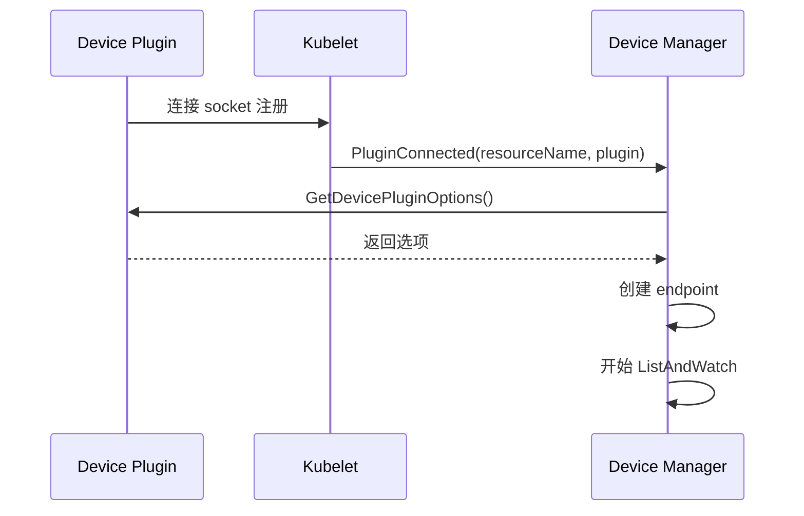
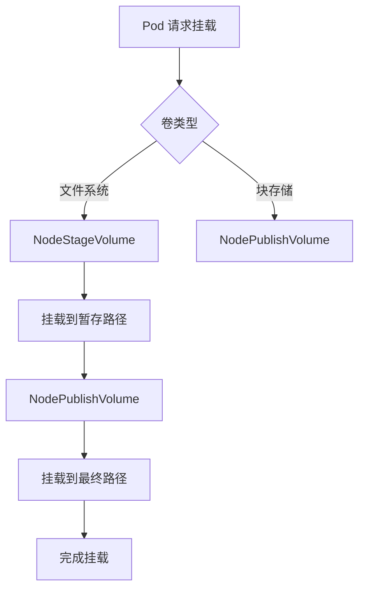
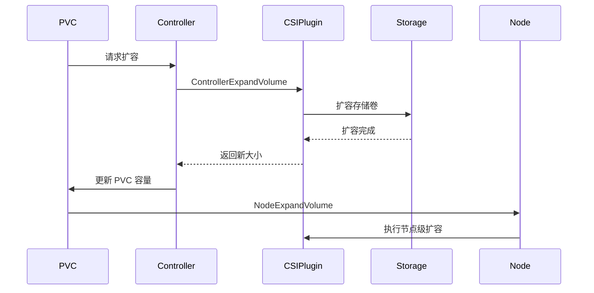

# Kubernetes CSI 容器存储接口驱动机制源码分析

## 1. 概述 - CSI 的职责和作用

### CSI 核心职责

Kubernetes CSI (Container Storage Interface) 是一个标准化的接口规范，允许存储供应商为 Kubernetes 开发可插拔的存储插件。

### 主要职责

1. **存储驱动标准化**：为所有存储供应商提供标准的接口规范
2. **生命周期管理**：
   - 卷创建：`CreateVolume`
   - 卷挂载：`NodeStageVolume`、`NodePublishVolume`
   - 卷卸载：`NodeUnpublishVolume`、`NodeUnstageVolume`
   - 卷删除：`DeleteVolume`
3. **节点级操作**：节点信息、卷扩容、卷统计
4. **集成集成**：与 Kubernetes API、Kubelet、Controller 集成

## 2. 目录结构

```
pkg/volume/csi/
├── csi_plugin.go          # 主要的 CSI 插件实现
├── csi_client.go          # CSI 客户端接口
├── csi_attacher.go        # CSI 挂载器实现
├── csi_mounter.go        # CSI 文件系统挂载实现
├── csi_block.go          # CSI 块存储实现
├── csi_drivers_store.go   # 驱动存储管理
├── csi_util.go           # 工具函数
└── expander.go            # 卷扩容实现
```

## 3. 核心机制

### 3.1 CSI 驱动注册



### 3.2 卷挂载流程



### 3.3 卷扩容



## 4. 核心数据结构

```go
type csiPlugin struct {
    host                      volume.VolumeHost
    csiDriverLister           storagelisters.CSIDriverLister
    csiDriverInformer         cache.SharedIndexInformer
    volumeAttachmentLister    storagelisters.VolumeAttachmentLister
}

type Driver struct {
    endpoint                string
    highestSupportedVersion *utilversion.Version
}
```

## 5. 最佳实践

### 5.1 Sidecar 容器配置

```yaml
apiVersion: apps/v1
kind: Deployment
metadata:
  name: csi-driver
spec:
  template:
    spec:
      containers:
      - name: csi-driver
        image: registry.example.com/csi-driver:latest
        args:
          - --endpoint=$(CSI_ENDPOINT)
          - --node-id=$(KUBE_NODE_NAME)
        env:
        - name: CSI_ENDPOINT
          value: unix:///csi/csi.sock
        - name: KUBE_NODE_NAME
          valueFrom:
            fieldRef:
              fieldPath: spec.nodeName
```

### 5.2 CSIDriver 配置

```yaml
apiVersion: storage.k8s.io/v1
kind: CSIDriver
metadata:
  name: example.csi.driver
spec:
  attachRequired: true
  podInfoOnMount: true
  volumeLifecycleModes:
    - Persistent
  fsGroupPolicy: File
```

## 6. 总结

Kubernetes CSI 是一个强大而灵活的存储接口框架，通过标准化的接口规范，让存储供应商能够为 Kubernetes 开发可插拔的存储插件。
