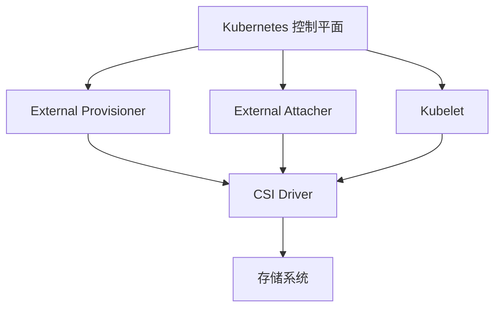
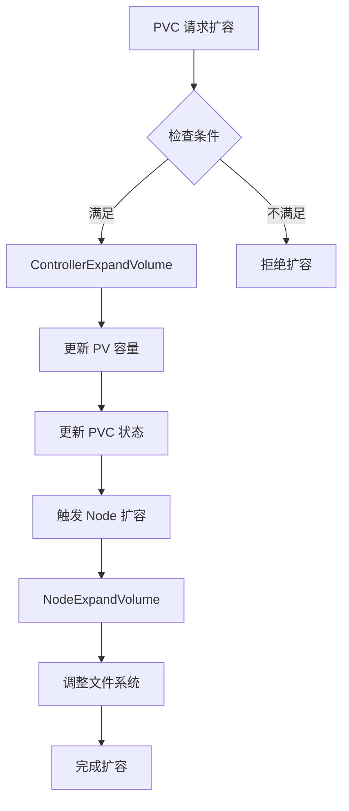
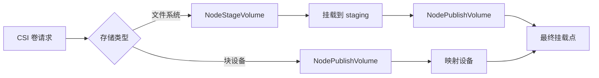
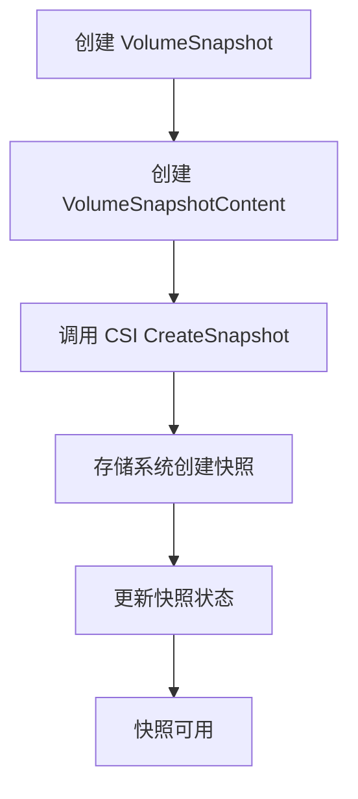

# Kubernetes CSI 容器存储接口驱动机制源码深度分析

## 1. 概述

### CSI 的核心价值

CSI (Container Storage Interface) 是 Kubernetes 中的一个标准化接口，它通过将存储插件从 Kubernetes 核心中解耦，实现了存储供应商开发可插拔存储插件的能力。

### 主要优势

- **标准化接口**：所有存储供应商遵循统一的规范
- **灵活性**：可以轻松添加新的存储系统
- **迭代性**：CSI 可以独立于 Kubernetes 版本进行更新
- **多样性**：支持文件系统、块存储、对象存储等多种存储类型

### 在 Kubernetes 架构中的位置



## 2. 目录结构

```
pkg/volume/csi/
├── csi_plugin.go          # CSI 插件的主入口，实现 VolumePlugin 接口
├── csi_client.go          # CSI 客户端接口定义，封装 gRPC 调用
├── csi_attacher.go        # 负责 VolumeAttachment 管理，实现挂载/卸载逻辑
├── csi_mounter.go        # 文件系统挂载实现，支持 Stage/Publish 操作
├── csi_block.go          # 块设备存储实现
├── csi_drivers_store.go   # 驱动信息存储和管理
├── csi_util.go           # 通用工具函数
└── expander.go            # 卷扩容实现，支持在线扩容
```

## 3. CSI Sidecar 组件详解

### 3.1 CSI Sidecar 概述

CSI Sidecar 是 Kubernetes CSI 架构中的关键组件，它们作为独立的容器运行，与 CSI 驱动协同工作。主要的 Sidecar 组件包括：

1. **csi-provisioner**：负责卷的创建和删除
2. **csi-attacher**：负责卷的挂载和卸载
3. **csi-resizer**：负责卷的扩容
4. **csi-snapshotter**：负责卷快照功能

### 3.2 csi-provisioner 深度解析

**核心功能：**
- VolumeCreate: 创建新卷
- VolumeDelete: 删除卷
- ControllerPublishVolume: 发布卷到节点

**工作原理：**
1. 监听 PVC 事件：通过 Informer 监听 PVC 的创建和删除
2. 调用 CSI 接口：将 PVC 转换为 CSI CreateVolume 请求
3. 管理拓扑：处理存储拓扑约束和卷绑定
4. 更新状态：更新 PV 的状态和属性

### 3.3 csi-attacher 深度解析

**VolumeAttachment 生命周期管理：**
```
Attaching -> Attached -> Detaching -> Detached
```

**关键实现逻辑：**

```go
// Attach 流程
func (ea *ExistingVolumesController) syncAttach(attacher volumes.AttacherDriver, volumeName string, va *storage.VolumeAttachment) error {
    // 1. 创建 VolumeAttachment 对象
    // 2. 等待 CSI 驱动完成 ControllerPublishVolume
    // 3. 更新 VolumeAttachment 状态为 Attached
    // 4. 返回挂载信息给 Kubelet
}

// Detach 流程
func (ea *ExistingVolumesController) syncDetach(detacher volumes.DetacherDriver, volumeName string, va *storage.VolumeAttachment) error {
    // 1. 更新 VolumeAttachment 状态为 Detaching
    // 2. 调用 ControllerUnpublishVolume
    // 3. 更新状态为 Detached
    // 4. 删除 VolumeAttachment 对象
}
```

### 3.4 csi-resizer 深度解析

**卷扩容流程：**

**扩容触发条件：**
1. PVC.Spec.resources.requests.storage 更大
2. StorageClass.AllowVolumeExpansion = true
3. 驱动支持 ControllerExpandVolume

**扩容实现：**


## 4. 卷挂载完整流程

### 4.1 卷挂载生命周期

```
1. PVC 卷绑定
2. Attach/Detach Controller 创建 VolumeAttachment
3. csi-attacher 调用 ControllerPublishVolume
4. CSI 驱动实际挂载操作
5. 更新 VolumeAttachment 状态为 Attached
6. Kubelet 调用 Attach
7. Kubelet 调用 NodeStageVolume（如果需要）
8. Kubelet 调用 NodePublishVolume
9. 挂载完成
```

### 4.2 详细挂载步骤

**控制器阶段：**

```go
// ControllerPublishVolume 调用
func (c *csiAttacher) ControllerPublishVolume(ctx context.Context, volumeID string, readOnly bool, nodeID string, secrets map[string]string) (map[string]string, error) {
    // 1. 连接 CSI 驱动
    // 2. 调用 ControllerPublishVolume RPC
    // 3. 返回挂载元数据
    // 4. 处理错误和重试
}
```

**节点阶段：**

```go
// NodeStageVolume 流程
func (c *csiMountMgr) NodeStageVolume(ctx context.Context, volumeSpec volume.Spec, stagingTarget string, secrets map[string]string) error {
    // 1. 准备 staging 路径
    // 2. 检查驱动是否支持 Stage
    // 3. 调用 NodeStageVolume
    // 4. 挂载到 staging 路径
}

// NodePublishVolume 流程
func (c *csiMountMgr) NodePublishVolume(ctx context.Context, volumeSpec volume.Spec, targetPath string, secrets map[string]string) error {
    // 1. 创建目标路径
    // 2. 调用 NodePublishVolume
    // 3. 从 staging 挂载到目标
    // 4. 设置权限和所有权
}
```

### 4.3 不同存储类型的处理

**文件系统存储：**
- 需要 staging 路径
- 支持多次挂载
- 需要文件系统权限设置

**块设备存储：**
- 直接设备映射
- 不需要 staging 路径
- 设备文件管理



## 5. VolumeAttachment 资源管理

### 5.1 VolumeAttachment 资源结构

```yaml
apiVersion: storage.k8s.io/v1
kind: VolumeAttachment
metadata:
  name: <unique-name>
spec:
  attacher: <csi-driver-name>
  nodeName: <node-name>
  source:
    persistentVolumeName: <pv-name>
status:
  attached: true
  attachmentMetadata:
    device-path: /dev/sdx
  attachError:
    message: "error message"
    time: "2024-01-01T00:00:00Z"
```

### 5.2 状态管理机制

```go
type VolumeAttachmentStatus struct {
    Attached bool
    AttachmentMetadata map[string]string
    AttachError *VolumeError
    DetachError *VolumeError
}

type VolumeError struct {
    Message  string
    Time     metav1.Time
}
```

### 5.3 错误处理

- **AttachError**: 挂载过程中的错误
- **DetachError**: 卸载过程中的错误
- **ResourceExhausted**: 资源耗尽
- **FailedPrecondition**: 预制件失败

## 6. CSI Snapshot 功能实现

### 6.1 Snapshot 资源定义

```yaml
# VolumeSnapshot
apiVersion: snapshot.storage.k8s.io/v1
kind: VolumeSnapshot
metadata:
  name: pvc-snapshot
spec:
  volumeSnapshotClassName: csi-snapclass
  source:
    persistentVolumeClaimName: my-pvc

# VolumeSnapshotContent
apiVersion: snapshot.storage.k8s.io/v1
kind: VolumeSnapshotContent
metadata:
  name: snapcontent-xxx
spec:
  volumeSnapshotRef:
    name: pvc-snapshot
    kind: VolumeSnapshot
  driver: csi.driver.example.com
  deletionPolicy: Delete
  source:
    volumeHandle: <csi-volume-handle>
```

### 6.2 Snapshot 实现流程



## 7. 卷扩展流程详解

### 7.1 扩容条件检查

```go
// 扩容前置条件
1. PVC.spec.capacity > PVC.status.capacity
2. StorageClass.allowVolumeExpansion = true
3. PV 支持 PVC 的访问模式
4. CSI 驱动支持扩容
5. 没有正在进行的扩容操作
```

### 7.2 控制器扩容

```go
// ControllerExpandVolume 实现
func (c *csiBlockResizer) ExpandVolume(ctx context.Context, devicePath, deviceMountPath, volumeName string, newSize resource.Quantity) (resource.Quantity, bool, error) {
    // 1. 获取设备信息
    // 2. 调用 CSI 控制器扩容接口
    // 3. 处理返回结果
    // 4. 更新 PV 和 PVC 状态
}
```

### 7.3 节点扩容

```go
// NodeExpandVolume 实现
func (c *csiBlockResizer) NodeExpandVolume(ctx context.Context, devicePath, deviceMountPath, volumeName string, newSize resource.Quantity) (resource.Quantity, bool, error) {
    // 1. 检查设备路径和挂载点
    // 2. 调用 CSI 驱动扩容
    // 3. 处理文件系统扩容（resize2fs/xfs_growfs）
    // 4. 验证扩容结果
}
```

### 7.4 文件系统扩容命令

```bash
# ext2/ext3/ext4
resize2fs /dev/sdx

# xfs
xfs_growfs /mountpoint
```

## 8. 与外部 CSI 驱动的交互

### 8.1 gRPC 通信机制

```go
type csiDriverClient struct {
    driverName csiDriverName
    addr       csiAddr
    conn       *grpc.ClientConn
    nodeClient csipbv1.NodeClient
    controllerClient csipbv1.ControllerClient
    identityClient csipbv1.IdentityClient
}
```

### 8.2 CSI 接口调用

**主要 CSI 接口：**

| 服务类别 | 接口 | 描述 |
|---------|------|------|
| Identity | GetPluginInfo | 获取插件信息 |
| Identity | GetPluginCapabilities | 获取插件能力 |
| Controller | CreateVolume | 创建卷 |
| Controller | DeleteVolume | 删除卷 |
| Controller | ControllerPublishVolume | 控制器发布卷 |
| Controller | ControllerUnpublishVolume | 控制器取消发布 |
| Controller | ControllerExpandVolume | 控制器扩容卷 |
| Node | NodeStageVolume | 节点准备卷 |
| Node | NodePublishVolume | 节点发布卷 |
| Node | NodeUnpublishVolume | 节点取消发布 |
| Node | NodeExpandVolume | 节点扩容卷 |

### 8.3 驱动发现和注册

```go
// 注册流程
func (h *RegistrationHandler) RegisterPlugin(pluginName string, endpoint string, versions []string) error {
    // 1. 验证版本
    // 2. 存储驱动信息
    // 3. 获取节点信息
    // 4. 安装 CSI 驱动
    // 5. 更新节点信息管理器
}
```

### 8.4 驱动能力管理

```go
type PluginCapability_Service struct {
    Type PluginCapability_Service
}

const (
    PluginCapability_Service_CONTROLLER_SERVICE PluginCapability_Service_Type = 1
    PluginCapability_Service_NODE_SERVICE        PluginCapability_Service_Type = 2
)
```

## 9. CSIDriver 配置

### 9.1 CSIDriver 资源定义

```yaml
apiVersion: storage.k8s.io/v1
kind: CSIDriver
metadata:
  name: csi.example.com
spec:
  attachRequired: true
  podInfoOnMount: true
  volumeLifecycleModes:
    - Persistent
  fsGroupPolicy: File
  storageCapacity: true
```

### 9.2 配置参数说明

| 参数 | 描述 |
|------|------|
| `attachRequired` | 是否需要 Attach 操作 |
| `podInfoOnMount` | 挂载时是否传递 Pod 信息 |
| `volumeLifecycleModes` | 支持的卷生命周期模式 |
| `fsGroupPolicy` | FSGroup 策略 |
| `storageCapacity` | 是否支持存储容量查询 |

## 10. 监控指标

### 10.1 关键指标

| 指标名称 | 类型 | 描述 |
|---------|------|------|
| `csi_sidecar_operations_total` | Counter | CSI 操作总数 |
| `csi_sidecar_operations_errors_total` | Counter | CSI 操作错误数 |
| `csi_sidecar_operation_duration_seconds` | Histogram | CSI 操作耗时 |

## 11. 最佳实践

### 11.1 Sidecar 容器配置

```yaml
apiVersion: apps/v1
kind: Deployment
metadata:
  name: csi-driver
spec:
  template:
    spec:
      containers:
      - name: csi-driver
        image: registry.example.com/csi-driver:latest
        args:
          - --endpoint=$(CSI_ENDPOINT)
          - --node-id=$(KUBE_NODE_NAME)
        env:
        - name: CSI_ENDPOINT
          value: unix:///csi/csi.sock
        - name: KUBE_NODE_NAME
          valueFrom:
            fieldRef:
              fieldPath: spec.nodeName
        volumeMounts:
        - name: socket-dir
          mountPath: /csi
      volumes:
      - name: socket-dir
        hostPath:
          path: /var/lib/kubelet/pods
          type: DirectoryOrCreate
```

### 11.2 驱动开发最佳实践

1. **错误处理**：实现完整的错误码处理
2. **超时管理**：合理设置超时时间（默认 2 分钟）
3. **幂等性**：确保操作可以安全重试
4. **状态同步**：保持 Kubernetes 状态与实际一致

### 11.3 部署注意事项

1. **Sidecar 版本**：确保 Sidecar 与 Kubernetes 版本兼容
2. **资源限制**：合理配置 Sidecar 资源限制
3. **健康检查**：实现完整的健康检查机制
4. **日志记录**：详细记录关键操作日志

## 12. 总结

Kubernetes CSI 机制通过标准化的接口设计，实现了存储系统的灵活插拔。其核心特点包括：

1. **模块化设计**：通过 Sidecar 组件实现功能解耦
2. **标准化接口**：遵循 CSI 规范，确保兼容性
3. **生命周期管理**：完整的卷生命周期管理
4. **扩展性**：支持多种存储类型和功能

理解 CSI 的实现原理，有助于更好地部署和使用 CSI 驱动，解决存储相关的疑难问题。
