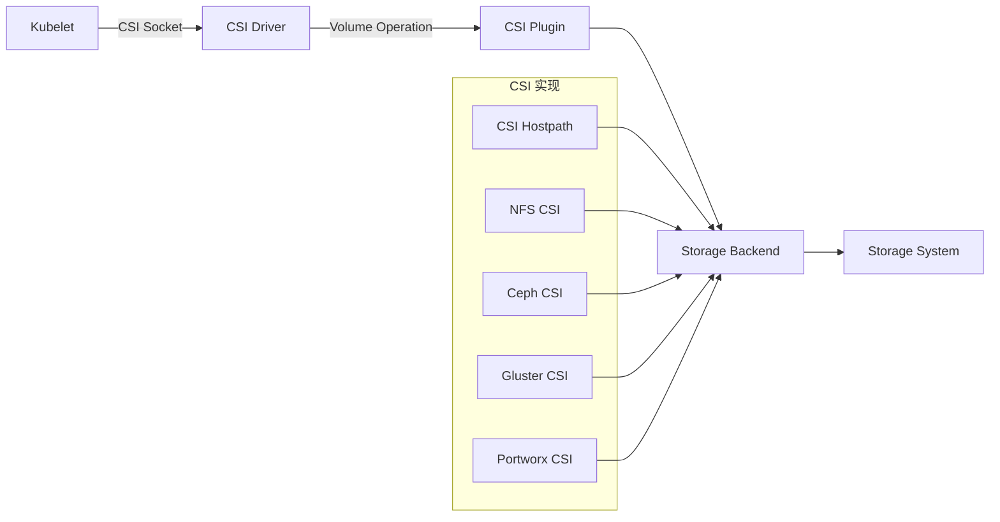
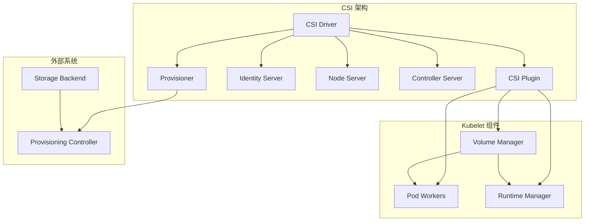
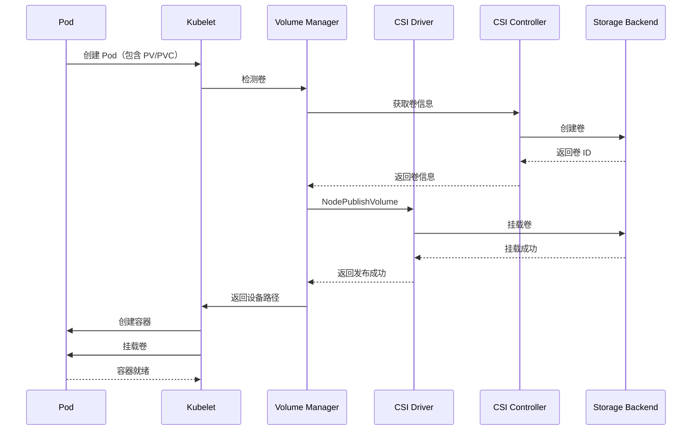
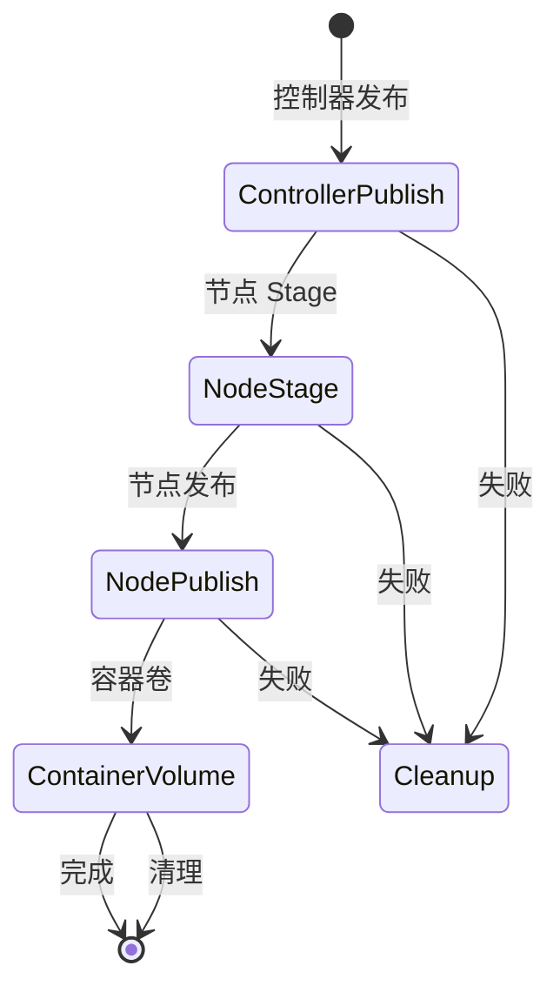
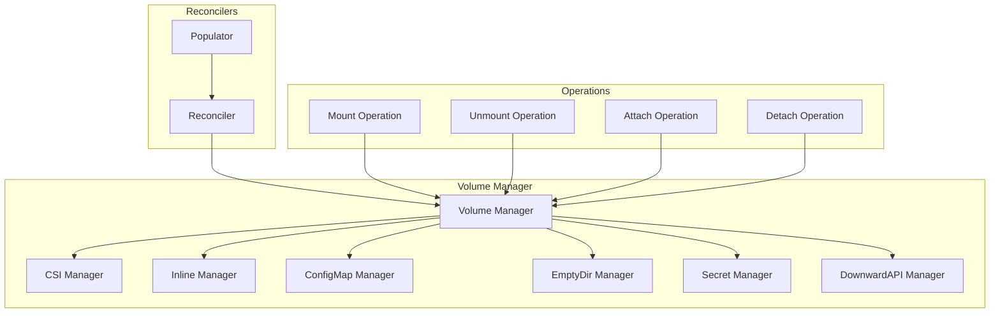
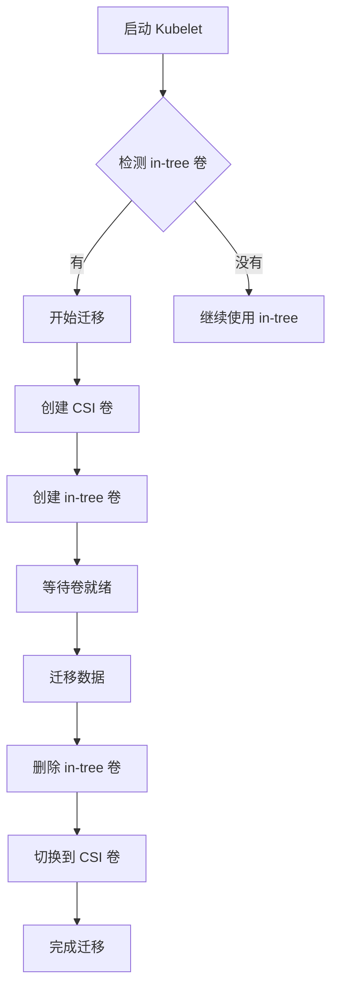

# CSI Volume Manager 深度分析

> 本文档深入分析 Kubernetes 的 CSI（Container Storage Interface）Volume Manager，包括 CSI 架构、卷挂载流程、Volume Manager 实现和最佳实践。

---

## 目录

1. [CSI 概述](#csi-概述)
2. [CSI 架构](#csi-架构)
3. [卷挂载流程](#卷挂载流程)
4. [Volume Manager 实现](#volume-manager-实现)
5. [CSI 迁移](#csi-迁移)
6. [性能优化](#性能优化)
7. [最佳实践](#最佳实践)

---

## CSI 概述

### CSI 的作用

CSI（Container Storage Interface）是 Kubernetes 的**统一存储接口**，用于对接各种存储系统：



### CSI 的价值

| 价值 | 说明 |
|------|------|
| **统一接口** | 标准化的存储接口，对接不同存储后端 |
| **解耦架构** | 存储插件与 Kubernetes 核心解耦 |
| **灵活性** | 支持动态扩容、卷快照、克隆等高级特性 |
| **高性能** | 直接与存储后端通信，减少中间层 |

---

## CSI 架构

### CSI 组件



### CSI ID 定义

**位置**: `pkg/apis/core/types.go`

```go
// CSI 卷类型定义
const (
    // CSI 卷类型
    CSIVolume = "CSI"
)

// CSIVolumeSource CSI 卷源定义
type CSIVolumeSource struct {
    // 驱动名称
    Driver string
    
    // 卷句柄
    VolumeHandle string
    
    // 只读
    ReadOnly bool
    
    // 文件系统类型
    FSType string
    
    // 卷属性
    VolumeAttributes map[string]string
    
    // 容器发布配置
    Publishing *CSIVolumePublishingInfo
}

// CSIVolumePublishingInfo 卷发布信息
type CSIVolumePublishingInfo struct {
    // 节点发布配置
    NodePublishSecretRef *v1.SecretReference
    // 阶段发布配置
    ControllerPublishSecretRef *v1.SecretReference
    // 卷访问模式
    VolumeMode v1.CSIVolumeMode
}
```

---

## 卷挂载流程

### 卷挂载时序



### 卷挂载阶段



### CSI Operation 接口

```go
// CSI Operation ID 定义
type CSIOperationID string

// CSI 上下文
type CSIContext struct {
    // CSI Operation ID
    CSIOperationID CSIOperationID
    // Volume ID
    VolumeID string
    // Pod UID
    PodUID types.UID
    // Volume 名称
    VolumeName string
    // CSI Driver name
    DriverName string
    // CSI Socket 路径
    CSISocket string
}

// CSI Volume Manager 接口
type CSIVolumeManager interface {
    // NodePublishVolume 节点发布卷
    NodePublishVolume(ctx context.Context, context CSIContext, volumeName string, volumeID string, driverName string, readOnly bool, accessMode v1.CSIVolumeAccessMode, volumeCapability v1.CSIVolumeCapability, volumeContext map[string]string, secrets map[string]string, volumeAttributes map[string]string) error
    
    // NodeUnpublishVolume 节点取消发布
    NodeUnpublishVolume(ctx context.Context, context CSIContext, volumeName string, volumeID string, driverName string, accessMode v1.CSIVolumeAccessMode, secrets map[string]string, volumeAttributes map[string]string) error
    
    // NodeStageVolume 节点 Stage 卷
    NodeStageVolume(ctx context.Context, context CSIContext, volumeName string, volumeID string, driverName string, volumeCapability v1.CSIVolumeCapability, volumeContext map[string]string, secrets map[string]string, volumeAttributes map[string]string) (map[string]string, error)
    
    // NodeUnstageVolume 节点取消 Stage
    NodeUnstageVolume(ctx context.Context, context CSIContext, volumeName string, volumeID string, driverName string, accessMode v1.CSIVolumeAccessMode) error
}
```

---

## Volume Manager 实现

### Volume Manager 架构

**位置**: `pkg/kubelet/volumemanager/volume_manager.go`



### Volume Manager 接口

```go
// VolumeManager 接口定义
type VolumeManager interface {
    // Run 运行 Volume Manager
    Run(ctx context.Context, sourcesReady config.SourcesReady, podStateProvider PodStateProvider, podManager PodManager, secretManager secret.SecretManager) error
    
    // WaitForAttachAndMount 等待卷附加和挂载
    WaitForAttachAndMount(ctx context.Context, pod *v1.Pod, timeout time.Duration) error
    
    // GetVolumesForPod 获取 Pod 的卷
    GetVolumesForPod(pod *v1.Pod) []v1.Volume
}
```

### CSI Manager 实现

```go
// CSIVolumeManager CSI 卷管理器
type csiVolumeManager struct {
    // Volume 插件映射
    volumePluginMgr *volume.VolumePluginMgr
    
    // CSI 客户端
    csiClient v1.CSIClient
    
    // 卷信息缓存
    volumeInfoCache volumeInfoCache
    
    // 操作执行器
    operationExecutor *operationexecutor.OperationExecutor
}

// NodePublishVolume 节点发布卷
func (m *csiVolumeManager) NodePublishVolume(
    ctx context.Context,
    context CSIContext,
    volumeName string,
    volumeID string,
    driverName string,
    readOnly bool,
    accessMode v1.CSIVolumeAccessMode,
    volumeCapability v1.CSIVolumeCapability,
    volumeContext map[string]string,
    secrets map[string]string,
    volumeAttributes map[string]string) error {
    
    // 1. 获取 CSI 插件
    plugin, err := m.volumePluginMgr.GetCSIPlugin(driverName)
    if err != nil {
        return fmt.Errorf("failed to get CSI plugin: %w", err)
    }
    
    // 2. 调用 NodePublishVolume
    _, err = plugin.NodePublishVolume(ctx, volumeID, readOnly, volumeCapability, secrets, volumeContext)
    if err != nil {
        return fmt.Errorf("failed to publish volume: %w", err)
    }
    
    return nil
}
```

---

## CSI 迁移

### 迁移触发条件

| 条件 | 说明 |
|------|------|
| **Kubelet 启动时** | 检测使用 in-tree 的卷 |
| **PV 更新时** | 检测 PV 类型为 CSI |
| **PVC 创建时** | 检测存储类为 CSI |

### 迁移流程



---

## 性能优化

### 并发挂载

```go
// 并发挂载多个卷
func (m *csiVolumeManager) MountVolumesConcurrent(
    ctx context.Context,
    pod *v1.Pod,
    volumes []v1.Volume,
) error {
    
    // 1. 为每个卷创建挂载操作
    ops := make([]MountOperation, len(volumes))
    for _, volume := range volumes {
        op := MountOperation{
            Volume: volume,
            Pod:    pod,
        }
        ops = append(ops, op)
    }
    
    // 2. 并发执行挂载
    var wg sync.WaitGroup
    errChan := make(chan error, len(ops))
    
    for _, op := range ops {
        wg.Add(1)
        go func(op MountOperation) {
            defer wg.Done()
            err := op.Execute(ctx)
            errChan <- err
        }(op)
    }
    
    wg.Wait()
    close(errChan)
    
    // 3. 检查错误
    for err := range errChan {
        if err != nil {
            return err
        }
    }
    
    return nil
}
```

### 卷信息缓存

```go
// VolumeInfoCache 卷信息缓存
type VolumeInfoCache struct {
    sync.RWMutex
    cache map[string]volumeInfoCacheEntry
}

type volumeInfoCacheEntry struct {
    info    *volumeInfoCacheEntryInfo
    version int
}

func (c *VolumeInfoCache) Get(volumeID string) (*volumeInfoCacheEntryInfo, bool) {
    c.RLock()
    defer c.RUnlock()
    
    if entry, ok := c.cache[volumeID]; ok {
        return entry.info, true
    }
    
    return nil, false
}

func (c *VolumeInfoCache) Update(volumeID string, info *volumeInfoCacheEntryInfo) {
    c.Lock()
    defer c.Unlock()
    
    c.cache[volumeID] = &volumeInfoCacheEntry{
        info:    info,
        version: 1,
    }
}
```

---

## 最佳实践

### 1. CSI Driver 配置

#### 使用 HostPath 插件

```yaml
apiVersion: v1
kind: CSIDriver
metadata:
  name: hostpath
spec:
  attachRequired: false
  podInfoOnMount: false
```

#### 使用 NFS CSI 插件

```yaml
apiVersion: v1
kind: CSIDriver
metadata:
  name: nfs.csi.k8s.io
spec:
  attachRequired: true
  volumeLifecycleModes:
    - Persistent
  fsGroupPolicy: Filesystem
```

### 2. Storage Class 配置

#### 使用 CSI 存储类

```yaml
apiVersion: storage.k8s.io/v1
kind: StorageClass
metadata:
  name: fast-ssd
provisioner: csi-driver.example.com
parameters:
  type: "fast-ssd"
  csi:
    fsType: "ext4"
    volumeAttributes:
      provisioningType: "fast"
reclaimPolicy: Delete
allowVolumeExpansion: true
volumeBindingMode: WaitForFirstConsumer
```

#### 使用延迟绑定

```yaml
apiVersion: storage.k8s.io/v1
kind: StorageClass
metadata:
  name: delayed-binding
provisioner: csi-driver.example.com
volumeBindingMode: WaitForFirstConsumer
```

### 3. 监控和调优

#### CSI 指标

```go
var (
    // CSI 操作延迟
    CSIOperationDuration = metrics.NewHistogramVec(
        &metrics.HistogramOpts{
            Subsystem:      "kubelet",
            Name:           "csi_operation_duration_seconds",
            Help:           "Duration of CSI operations",
            StabilityLevel: metrics.ALPHA,
        },
        []string{"operation_type", "driver_name"})
    
    // CSI 操作错误
    CSIOperationErrorsTotal = metrics.NewCounterVec(
        &metrics.CounterOpts{
            Subsystem:      "kubelet",
            Name:           "csi_operation_errors_total",
            Help:           "Total number of CSI operation errors",
            StabilityLevel: metrics.ALPHA,
        },
        []string{"operation_type", "driver_name"})
    
    // CSI 卷数量
    CSIVolumes = metrics.NewGauge(
        &metrics.GaugeOpts{
            Subsystem:      "kubelet",
            Name:           "csi_volumes",
            Help:           "Number of CSI volumes",
            StabilityLevel: metrics.ALPHA,
        })
)
```

#### 监控 PromQL

```sql
# CSI 操作延迟 P95
histogram_quantile(0.95, kubelet_csi_operation_duration_seconds_bucket{operation_type="NodePublishVolume"})

# CSI 操作错误率
sum(rate(kubelet_csi_operation_errors_total[5m])) by (operation_type, driver_name)

# CSI 卷数量
kubelet_csi_volumes
```

### 4. 故障排查

#### CSI 卷挂载失败

```bash
# 查看卷挂载日志
kubectl logs -n kube-system -l component=kubelet | grep -i "csi.*mount"

# 查看卷状态
kubectl describe pod <pod-name> | grep -A 10 "Volumes:"

# 查看卷事件
kubectl get events --field-selector reason=FailedMount
```

#### CSI Driver 问题

```bash
# 查看 CSI Driver 状态
kubectl get csidriver

# 查看 CSI Driver 日志
kubectl logs -n kube-system -l app=<csi-driver-name>

# 查看 CSI Socket
kubectl exec -it <node-name> -- ls -la /var/lib/kubelet/pods/*/volumes/*/
```

---

## 总结

### 核心要点

1. **CSI 概述**：统一存储接口，对接不同存储后端
2. **CSI 架构**：CSI Driver、CSI Plugin、Identity/Node/Controller Server、Provisioner
3. **卷挂载流程**：ControllerPublish → NodeStage → NodePublish → ContainerVolume
4. **Volume Manager 实现**：管理卷插件、执行卷操作、并发挂载
5. **CSI 迁移**：从 in-tree 卷迁移到 CSI 卷
6. **性能优化**：并发挂载、卷信息缓存、指标收集
7. **最佳实践**：CSI Driver 配置、Storage Class 配置、监控告警

### 关键路径

```
Pod 创建 → Volume Manager → CSI Controller → CSI Driver → Storage Backend → 
CSI Driver → Volume Manager → Kubelet → Container Runtime → 容器
```

### 推荐阅读

- [CSI Spec](https://github.com/container-storage-interface/spec)
- [CSI Implementation](https://github.com/kubernetes-csi/external-attacher)
- [Kubernetes CSI Migration](https://kubernetes.io/docs/concepts/storage/volumes/)
- [CSI Volume Management](https://kubernetes.io/docs/concepts/storage/volumes/#csi)

---

**文档版本**：v1.0
**创建日期**：2026-03-04
**维护者**：AI Assistant
**Kubernetes 版本**：v1.28+
