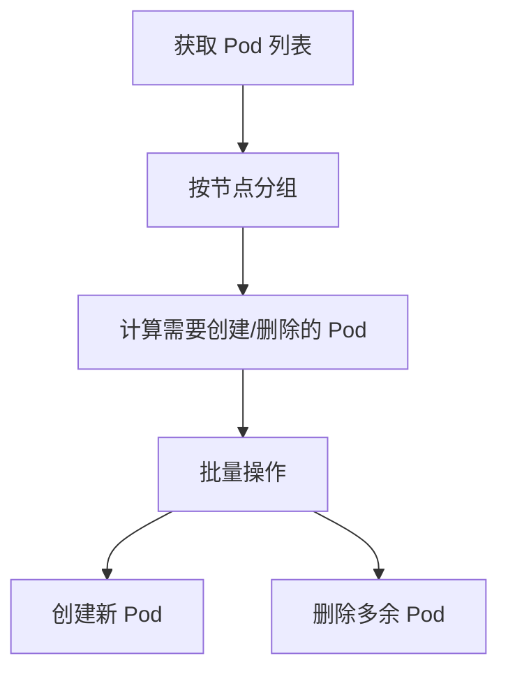
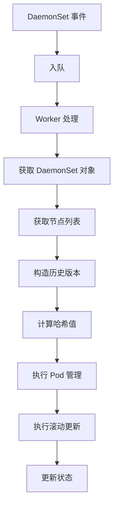

# Kubernetes DaemonSet Controller 源码深度分析

## 1. 概述

DaemonSet Controller 是 Kubernetes 控制平面中的核心控制器之一，负责确保在每个符合条件的节点上运行一个 Pod 副本。

### 核心职责

- **Pod 管理**：在每个符合条件的节点上维护指定数量的 Pod 副本
- **节点选择**：根据 DaemonSet 的选择器和节点属性决定哪些节点应该运行 Pod
- **滚动更新**：实现 DaemonSet 的滚动更新机制
- **故障恢复**：监控 Pod 状态，在 Pod 失败时自动重建
- **历史版本管理**：维护 DaemonSet 的历史版本，支持回滚操作

### 关键特性

- **自愈能力**：当 Pod 或节点发生故障时，自动创建新的 Pod
- **优雅终止**：支持 Pod 的优雅终止和删除
- **并发控制**：通过 burstReplicas 限制同时创建/删除的 Pod 数量
- **事件记录**：记录重要事件，便于调试和监控

## 2. 目录结构

```
pkg/controller/daemon/
├── daemon_controller.go      # 主控制器实现
├── update.go                 # 滚动更新逻辑
├── util/daemonset_util.go    # 工具函数
└── metrics/metrics.go        # 监控指标
```

## 3. 核心机制

### 3.1 节点选择机制

```go
func NodeShouldRunDaemonPod(logger klog.Logger, node *v1.Node, ds *apps.DaemonSet) (bool, bool) {
    // 1. 检查 spec.template.spec.nodeName 是否匹配
    // 2. 检查节点亲和性
    // 3. 检查节点污点容忍度
    return fitsNodeName && fitsNodeAffinity && fitsTaints, 
           fitsNodeName && fitsNodeAffinity && (fitsTaints || hasUntoleratedNoExecuteTaint)
}
```

### 3.2 Pod 管理机制



### 3.3 滚动更新机制

支持两种更新策略：

#### OnDelete 策略
- 手动删除旧 Pod 才会创建新 Pod
- 适用于需要精细控制更新过程的场景

#### RollingUpdate 策略（默认）
- 支持 maxSurge 和 maxUnavailable 配置
- 通过滚动更新实现平滑升级

```yaml
spec:
  updateStrategy:
    type: RollingUpdate
    rollingUpdate:
      maxSurge: 25%
      maxUnavailable: 25%
```

## 4. 核心数据结构

```go
type DaemonSetsController struct {
    kubeClient       clientset.Interface
    podControl       controller.PodControlInterface
    burstReplicas     int
    syncHandler      func(ctx context.Context, dsKey string) error
    expectations      controller.ControllerExpectationsInterface
    dsLister         appslisters.DaemonSetLister
    podLister        corelisters.PodLister
    nodeLister       corelisters.NodeLister
    queue            workqueue.TypedRateLimitingInterface[string]
}
```

## 5. 工作流程



## 6. 最佳实践

### 6.1 配置建议

```yaml
apiVersion: apps/v1
kind: DaemonSet
metadata:
  name: logging-agent
spec:
  revisionHistoryLimit: 10
  updateStrategy:
    type: RollingUpdate
    rollingUpdate:
      maxSurge: 25%
      maxUnavailable: 25%
  selector:
    matchLabels:
      app: logging-agent
  template:
    metadata:
      labels:
        app: logging-agent
    spec:
      tolerations:
      - operator: Exists
      containers:
      - name: agent
        image: logging-agent:latest
        resources:
          limits:
            cpu: 200m
            memory: 200Mi
```

### 6.2 使用场景

1. **节点级守护进程**：网络插件、日志收集器、监控代理
2. **系统级服务**：kube-proxy、DNS 服务
3. **存储插件**：CSI 驱动、存储卷控制器

## 7. 总结

Kubernetes DaemonSet Controller 通过多种机制确保在每个节点上稳定运行 Pod 副本，理解其工作原理有助于更好地使用和调试 DaemonSet。
