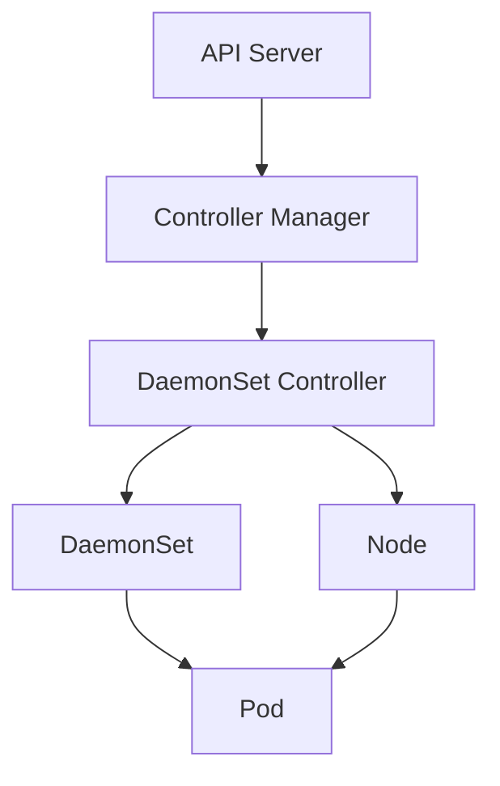
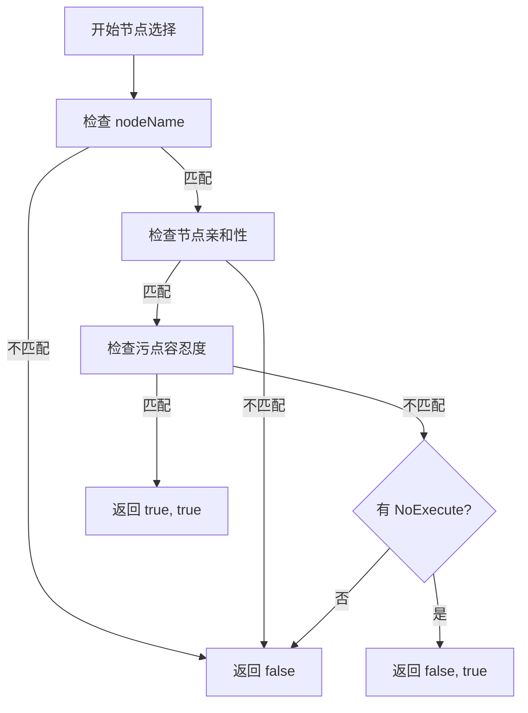
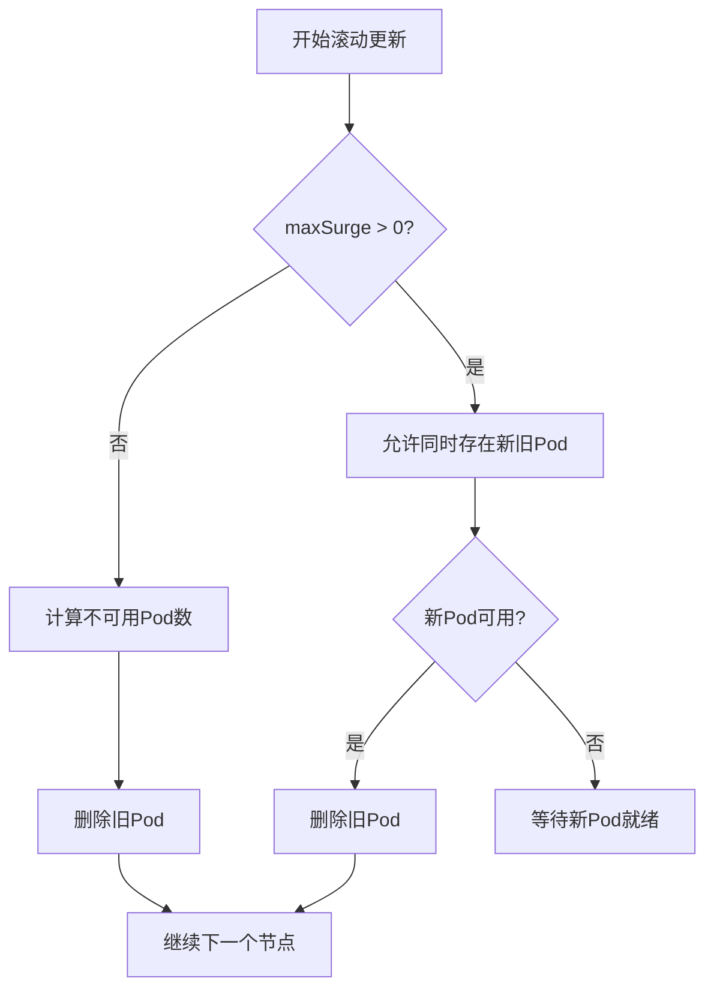
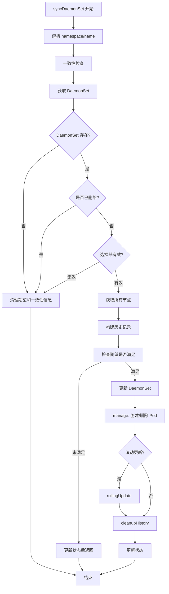
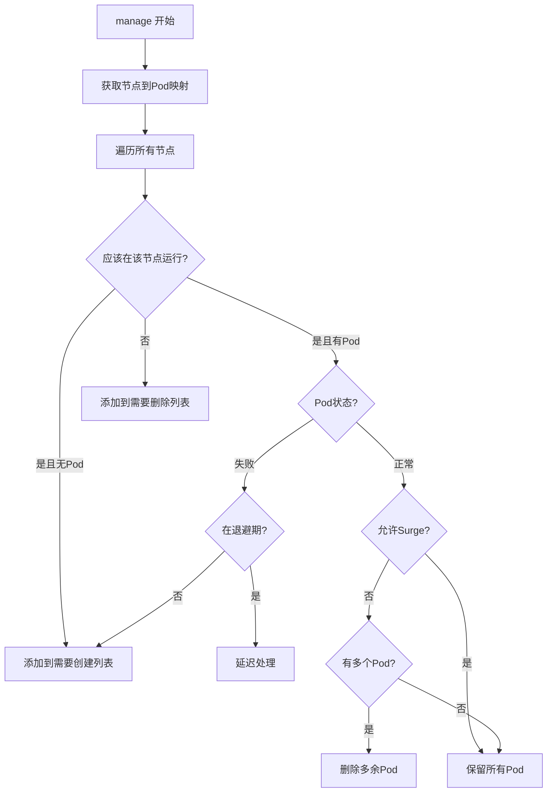
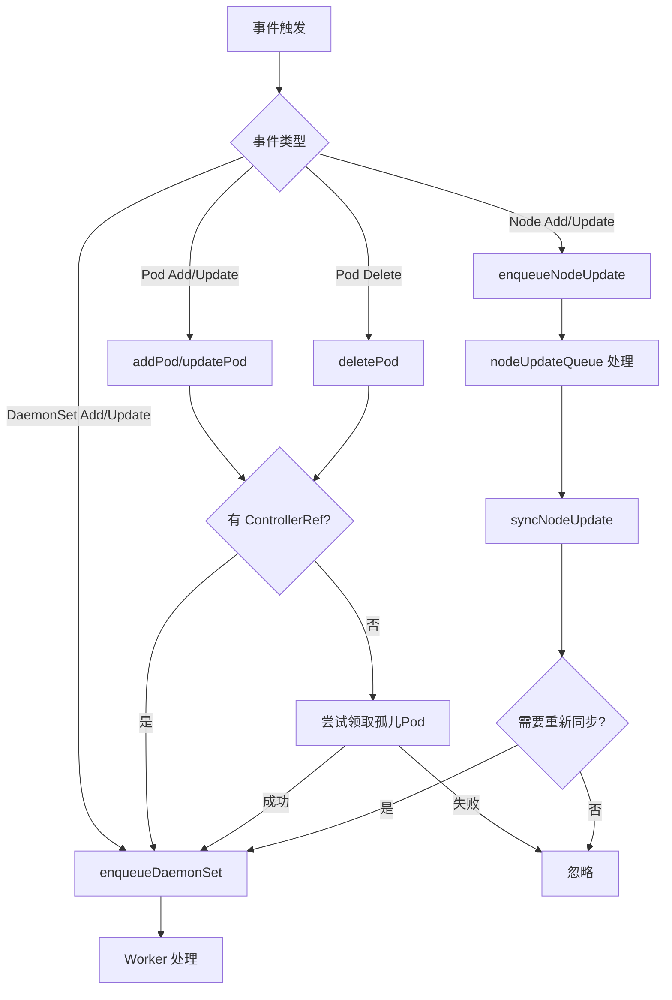

# Kubernetes DaemonSet Controller 源码深度分析

## 1. 概述

DaemonSet Controller 是 Kubernetes 控制平面中的核心控制器之一，负责确保在每个符合条件的节点上运行一个 Pod 副本。与 Deployment 不同，DaemonSet 不保证副本数，而是根据节点数量动态调整 Pod 数量。

### 核心职责

- **Pod 管理**：在每个符合条件的节点上维护指定数量的 Pod 副本
- **节点选择**：根据 DaemonSet 的选择器和节点属性决定哪些节点应该运行 Pod
- **滚动更新**：实现 DaemonSet 的滚动更新机制，支持 maxSurge/maxUnavailable
- **故障恢复**：监控 Pod 状态，在 Pod 失败时自动重建
- **历史版本管理**：维护 DaemonSet 的历史版本，支持回滚操作

### 关键特性

- **自愈能力**：当 Pod 或节点发生故障时，自动创建新的 Pod
- **优雅终止**：支持 Pod 的优雅终止和删除
- **并发控制**：通过 burstReplicas 限制同时创建/删除的 Pod 数量
- **事件记录**：记录重要事件，便于调试和监控
- **默认容忍度**：自动添加对节点故障和压力的容忍度

### 在 Kubernetes 架构中的位置



DaemonSet Controller 直接监听 Node 和 Pod 事件，当节点状态变化时自动调整 Pod 数量。

## 2. 目录结构

```
pkg/controller/daemon/
├── daemon_controller.go      # 主控制器实现
├── update.go                 # 滚动更新逻辑
├── util/daemonset_util.go    # 工具函数
└── metrics/metrics.go        # 监控指标
```

### 关键文件说明

- **daemon_controller.go**：主控制器实现，包含核心同步逻辑
- **update.go**：滚动更新策略实现，处理 maxSurge/maxUnavailable
- **util/daemonset_util.go**：节点选择、Pod 计算等工具函数
- **metrics/**：监控指标收集和导出

## 3. 核心机制

### 3.1 节点选择机制

#### NodeShouldRunDaemonPod 函数

这是节点选择的核心判断函数：

```go
func NodeShouldRunDaemonPod(logger klog.Logger, node *v1.Node, ds *apps.DaemonSet) (bool, bool) {
    pod := NewPod(ds, node.Name)

    // 1. 检查节点名称匹配
    if !(ds.Spec.Template.Spec.NodeName == "" || ds.Spec.Template.Spec.NodeName == node.Name) {
        return false, false
    }

    // 2. 检查节点污点和容忍度
    taints := node.Spec.Taints
    fitsNodeName, fitsNodeAffinity, fitsTaints := predicates(logger, pod, node, taints)
    if !fitsNodeName || !fitsNodeAffinity {
        return false, false
    }

    // 3. 检查污容忍度，如果已有运行中的Pod，需要特殊处理NoExecute污点
    if !fitsTaints {
        // 检查是否有NoExecute污点被容忍
        _, hasUntoleratedTaint := v1helper.FindMatchingUntoleratedTaint(logger, taints, pod.Spec.Tolerations, func(t *v1.Taint) bool {
            return t.Effect == v1.TaintEffectNoExecute
        }, utilfeature.DefaultFeatureGate.Enabled(features.TaintTolerationComparisonOperators))
        return false, !hasUntoleratedTaint
    }

    return true, true
}
```

#### predicates 函数

```go
func predicates(logger klog.Logger, pod *v1.Pod, node *v1.Node, taints []v1.Taint) (fitsNodeName, fitsNodeAffinity, fitsTaints bool) {
    // 1. 节点名称匹配
    fitsNodeName = len(pod.Spec.NodeName) == 0 || pod.Spec.NodeName == node.Name

    // 2. 节点亲和性检查
    fitsNodeAffinity, _ = nodeaffinity.GetRequiredNodeAffinity(pod).Match(node)

    // 3. 污点检查
    _, hasUntoleratedTaint := v1helper.FindMatchingUntoleratedTaint(logger, taints, pod.Spec.Tolerations, func(t *v1.Taint) bool {
        return t.Effect == v1.TaintEffectNoExecute || t.Effect == v1.TaintEffectNoSchedule
    }, utilfeature.DefaultFeatureGate.Enabled(features.TaintTolerationComparisonOperators))
    fitsTaints = !hasUntoleratedTaint

    return
}
```

#### 节点选择流程



### 3.2 DaemonSet 默认容忍度

DaemonSet 自动添加对节点故障和压力的容忍度：

```go
func AddOrUpdateDaemonPodTolerations(spec *v1.PodSpec) {
    // 添加对节点故障的容忍度
    v1helper.AddOrUpdateTolerationInPodSpec(spec, &v1.Toleration{
        Key:      v1.TaintNodeNotReady,
        Operator: v1.TolerationOpExists,
        Effect:   v1.TaintEffectNoExecute,
    })

    v1helper.AddOrUpdateTolerationInPodSpec(spec, &v1.Toleration{
        Key:      v1.TaintNodeUnreachable,
        Operator: v1.TolerationOpExists,
        Effect:   v1.TaintEffectNoExecute,
    })

    // 添加对各种压力污点的容忍度
    // 包括 MemoryPressure, DiskPressure, PIDPressure, Unschedulable, NetworkUnavailable
}
```

### 3.3 滚动更新机制

DaemonSet 支持两种更新策略：

#### OnDelete 策略

- 手动删除旧 Pod 才会创建新 Pod
- 适用于需要精细控制更新过程的场景

#### RollingUpdate 策略（默认）

支持 maxSurge 和 maxUnavailable 配置：

```yaml
spec:
  updateStrategy:
    type: RollingUpdate
    rollingUpdate:
      maxSurge: 25%
      maxUnavailable: 25%
```

#### maxSurge/maxUnavailable 计算逻辑

```go
func (dsc *DaemonSetsController) updatedDesiredNodeCounts(ctx context.Context, ds *apps.DaemonSet, nodeList []*v1.Node, nodeToDaemonPods map[string][]*v1.Pod) (int, int, int, error) {
    var desiredNumberScheduled int
    for i := range nodeList {
        node := nodeList[i]
        wantToRun, _ := NodeShouldRunDaemonPod(logger, node, ds)
        if !wantToRun {
            continue
        }
        desiredNumberScheduled++

        if _, exists := nodeToDaemonPods[node.Name]; !exists {
            nodeToDaemonPods[node.Name] = nil
        }
    }

    // 计算最大不可用数量
    maxUnavailable, err := util.UnavailableCount(ds, desiredNumberScheduled)
    // 计算最大激增数量
    maxSurge, err := util.SurgeCount(ds, desiredNumberScheduled)

    // 默认策略：如果都未配置，默认允许1个不可用
    if desiredNumberScheduled > 0 && maxUnavailable == 0 && maxSurge == 0 {
        maxUnavailable = 1
    }

    return maxSurge, maxUnavailable, desiredNumberScheduled, nil
}
```

#### 无 Surge 情况（maxSurge = 0）

```go
if maxSurge == 0 {
    var numUnavailable int
    var allowedReplacementPods []string
    var candidatePodsToDelete []string

    for nodeName, pods := range nodeToDaemonPods {
        newPod, oldPod, ok := findUpdatedPodsOnNode(ds, pods, hash)
        if !ok {
            numUnavailable++
            continue
        }

        // 处理各种情况...
    }

    oldPodsToDelete := append(allowedReplacementPods, candidatePodsToDelete[:remainingUnavailable]...)
    return dsc.syncNodes(ctx, ds, oldPodsToDelete, nil, hash)
}
```

#### 有 Surge 情况（maxSurge > 0）



### 3.4 历史版本管理

DaemonSet 通过 ControllerRevision 机制管理历史版本：

#### 构建历史记录

```go
func (dsc *DaemonSetsController) constructHistory(ctx context.Context, ds *apps.DaemonSet) (cur *apps.ControllerRevision, old []*apps.ControllerRevision, err error) {
    // 1. 获取所有相关的 ControllerRevision
    histories, err = dsc.controlledHistories(ctx, ds)

    // 2. 为每个历史记录添加唯一标签
    for _, history := range histories {
        if _, ok := history.Labels[apps.DefaultDaemonSetUniqueLabelKey]; !ok {
            toUpdate := history.DeepCopy()
            toUpdate.Labels[apps.DefaultDaemonSetUniqueLabelKey] = toUpdate.Name
            // 更新历史记录
        }
    }

    // 3. 分离当前版本和历史版本
    for _, history := range histories {
        found, err = Match(ds, history)
        if found {
            currentHistories = append(currentHistories, history)
        } else {
            old = append(old, history)
        }
    }

    // 4. 创建或更新当前版本
    currRevision := maxRevision(old) + 1
    if len(currentHistories) == 0 {
        // 创建新版本
        cur, err = dsc.snapshot(ctx, ds, currRevision)
    } else {
        // 去重并更新版本号
        cur, err = dsc.dedupCurHistories(ctx, ds, currentHistories)
    }

    return cur, old, err
}
```

#### 清理历史记录

```go
func (dsc *DaemonSetsController) cleanupHistory(ctx context.Context, ds *apps.DaemonSet, old []*apps.ControllerRevision) error {
    // 1. 确定保留的历史数量
    toKeep := int(*ds.Spec.RevisionHistoryLimit)
    toKill := len(old) - toKeep

    // 2. 收集所有活跃 Pod 的 hash
    liveHashes := make(map[string]bool)
    for _, pods := range nodesToDaemonPods {
        for _, pod := range pods {
            if hash := pod.Labels[apps.DefaultDaemonSetUniqueLabelKey]; len(hash) > 0 {
                liveHashes[hash] = true
            }
        }
    }

    // 3. 按版本号排序，删除最旧的未使用历史
    sort.Sort(historiesByRevision(old))
    for _, history := range old {
        if toKill <= 0 {
            break
        }
        if hash := history.Labels[apps.DefaultDaemonSetUniqueLabelKey]; liveHashes[hash] {
            continue  // 仍在使用，不删除
        }
        // 删除历史记录
        err := dsc.kubeClient.AppsV1().ControllerRevisions(ds.Namespace).Delete(ctx, history.Name, metav1.DeleteOptions{})
        toKill--
    }

    return nil
}
```

### 3.5 burstReplicas 并发控制

```go
const (
    // 并发创建/删除 Pod 的限值
    BurstReplicas = 250
)

func (dsc *DaemonSetsController) syncNodes(ctx context.Context, ds *apps.DaemonSet, podsToDelete, nodesNeedingDaemonPods []string, hash string) error {
    // 计算实际创建和删除数量
    createDiff := len(nodesNeedingDaemonPods)
    deleteDiff := len(podsToDelete)

    // 应用 burstReplicas 限制
    if createDiff > dsc.burstReplicas {
        createDiff = dsc.burstReplicas
    }
    if deleteDiff > dsc.burstReplicas {
        deleteDiff = dsc.burstReplicas
    }

    // 设置期望值
    dsc.expectations.SetExpectations(logger, dsKey, createDiff, deleteDiff)

    // 使用 WaitGroup 和 goroutine 批量处理
    errCh := make(chan error, createDiff+deleteDiff)
    createWait := sync.WaitGroup{}

    // 批量创建 Pod
    for i := 0; i < createDiff; i++ {
        createWait.Add(1)
        go func(nodeName string) {
            defer createWait.Done()
            // 创建 Pod
            err := dsc.podControl.CreatePods(ctx, ds.Namespace, template, nodeName, controller.GetPodsOwnerRef(ds))
            if err != nil {
                errCh <- err
            }
        }(nodesNeedingDaemonPods[i])
    }

    // 批量删除 Pod
    for i := 0; i < deleteDiff; i++ {
        // 删除 Pod
        err := dsc.podControl.DeletePod(ctx, ds.Namespace, podsToDelete[i], ds)
        if err != nil {
            errCh <- err
        }
    }

    // 等待所有操作完成
    createWait.Wait()
    close(errCh)

    return nil
}
```

### 3.6 节点状态变化处理

```go
func (dsc *DaemonSetsController) syncNodeUpdate(ctx context.Context, nodeName string) error {
    // 获取节点信息
    node, err := dsc.nodeLister.Get(nodeName)

    // 获取节点上的所有 DaemonSet Pod
    podsOnNode, err := dsc.podIndexer.ByIndex(controller.PodNodeNameKey, nodeName)

    // 对每个 DaemonSet 进行检查
    for _, ds := range dsList {
        shouldRun, shouldContinueRunning := NodeShouldRunDaemonPod(logger, node, ds)

        // 决定是否需要重新同步
        if (shouldRun && !scheduled) ||
           (!shouldContinueRunning && scheduled) ||
           (scheduled && ds.Status.NumberMisscheduled > 0) {
            dsc.enqueueDaemonSet(ds)
        }
    }
}
```

## 4. 核心数据结构

### 4.1 DaemonSetsController 结构

```go
type DaemonSetsController struct {
    kubeClient clientset.Interface
    eventBroadcaster record.EventBroadcaster
    eventRecorder    record.EventRecorder
    podControl controller.PodControlInterface
    crControl  controller.ControllerRevisionControlInterface

    // 并发控制限值
    burstReplicas int
    syncHandler func(ctx context.Context, dsKey string) error
    expectations controller.ControllerExpectationsInterface

    // 各种 Listers 和 Indexers
    dsLister     appslisters.DaemonSetLister
    historyLister appslisters.ControllerRevisionLister
    podLister    corelisters.PodLister
    podIndexer   cache.Indexer
    nodeLister   corelisters.NodeLister

    // 工作队列
    queue         workqueue.TypedRateLimitingInterface[string]
    nodeUpdateQueue workqueue.TypedRateLimitingInterface[string]

    failedPodsBackoff *flowcontrol.Backoff
    consistencyStore consistencyutil.ConsistencyStore
}
```

### 4.2 DaemonSetStatus 结构

```go
type DaemonSetStatus struct {
    // 当前应该运行的 Pod 数量
    CurrentNumberScheduled int32
    // 实际运行的 Pod 数量
    DesiredNumberScheduled int32
    // 实际运行的 Pod 数量
    NumberAvailable int32
    // 就绪的 Pod 数量
    NumberReady int32
    // 不应该运行但实际运行的 Pod 数量
    NumberMisscheduled int32
    // 正在终止的 Pod 数量
    NumberUnavailable int32
    // 更新后的版本号
    UpdatedNumberScheduled int32
    // 观察到的代数
    ObservedGeneration int64
    // 当前状态的条件列表
    Conditions []DaemonSetCondition
}
```

## 5. 工作流程

### 5.1 syncDaemonSet 完整流程



### 5.2 manage 函数流程



### 5.3 podsShouldBeOnNode 核心逻辑

```go
func (dsc *DaemonSetsController) podsShouldBeOnNode(
    logger klog.Logger,
    node *v1.Node,
    nodeToDaemonPods map[string][]*v1.Pod,
    ds *apps.DaemonSet,
    hash string,
) (nodesNeedingDaemonPods, podsToDelete []string) {

    // 1. 判断是否应该在该节点运行
    shouldRun, shouldContinueRunning := NodeShouldRunDaemonPod(logger, node, ds)
    daemonPods, exists := nodeToDaemonPods[node.Name]

    switch {
    case shouldRun && !exists:
        // 需要创建新 Pod
        nodesNeedingDaemonPods = append(nodesNeedingDaemonPods, node.Name)

    case shouldContinueRunning:
        // 处理失败的 Pod
        for _, pod := range daemonPods {
            if pod.Status.Phase == v1.PodFailed {
                // 失败重试机制
                backoffKey := failedPodsBackoffKey(ds, node.Name)
                if dsc.failedPodsBackoff.IsInBackOffSinceUpdate(backoffKey, now) {
                    // 在退避期，延后处理
                    dsc.enqueueDaemonSetAfter(ds, delay)
                    continue
                }
                // 删除失败的 Pod
                podsToDelete = append(podsToDelete, pod.Name)
            }
        }

        // 处理多 Pod 情况
        if !util.AllowsSurge(ds) {
            // 不允许 Surge，只保留一个 Pod
            if len(daemonPodsRunning) > 1 {
                // 删除多余的 Pod
                sort.Sort(podByCreationTimestampAndPhase(daemonPodsRunning))
                for i := 1; i < len(daemonPodsRunning); i++ {
                    podsToDelete = append(podsToDelete, daemonPodsRunning[i].Name)
                }
            }
        }

    case !shouldContinueRunning && exists:
        // 不应该运行但存在 Pod，全部删除
        for _, pod := range daemonPods {
            if pod.DeletionTimestamp == nil {
                podsToDelete = append(podsToDelete, pod.Name)
            }
        }
    }

    return nodesNeedingDaemonPods, podsToDelete
}
```

### 5.4 事件处理流程



## 6. 监控指标

### 6.1 关键指标

| 指标名称 | 类型 | 描述 |
|---------|------|------|
| `daemonset_controller_syncs_total` | Counter | 同步操作总数 |
| `daemonset_controller_sync_duration_seconds` | Histogram | 同步操作耗时分布 |
| `daemonset_controller_daemonsets` | Gauge | 当前管理的 DaemonSet 数量 |
| `daemonset_controller_pods` | Gauge | 当前管理的 Pod 数量 |
| `daemonset_controller_nodes` | Gauge | 当前监控的节点数 |

## 7. 最佳实践

### 7.1 配置建议

```yaml
apiVersion: apps/v1
kind: DaemonSet
metadata:
  name: logging-agent
spec:
  revisionHistoryLimit: 10
  updateStrategy:
    type: RollingUpdate
    rollingUpdate:
      maxSurge: 25%
      maxUnavailable: 25%
  selector:
    matchLabels:
      app: logging-agent
  template:
    metadata:
      labels:
        app: logging-agent
    spec:
      # 容忍度（可选，DaemonSet 会自动添加基本容忍度）
      tolerations:
      - operator: Exists
      containers:
      - name: agent
        image: logging-agent:latest
        resources:
          limits:
            cpu: 200m
            memory: 200Mi
          requests:
            cpu: 100m
            memory: 100Mi
```

### 7.2 节点选择策略

1. ** nodeName**：精确指定节点名称
2. **nodeSelector**：通过标签选择节点
3. **nodeAffinity**：更复杂的节点亲和性规则
4. **tolerations**：容忍节点的污点

### 7.3 使用场景

1. **节点级守护进程**：网络插件、日志收集器、监控代理
2. **系统级服务**：kube-proxy、DNS 服务
3. **存储插件**：CSI 驱动、存储卷控制器

### 7.4 故障排查

1. **Pod 无法创建**：
   - 检查节点是否有足够资源
   - 检查节点污点是否被容忍
   - 查看 Pod 事件了解失败原因

2. **滚动更新卡住**：
   - 检查 maxSurge/maxUnavailable 配置
   - 查看新 Pod 是否就绪
   - 检查是否有节点不满足条件

3. **Pod 数量不正确**：
   - 检查节点选择器
   - 检查节点状态
   - 查看 DaemonSet 状态

## 8. 总结

DaemonSet Controller 通过以下核心机制确保在每个节点上稳定运行 Pod 副本：

1. **节点选择机制**：基于 nodeName、节点亲和性、污点容忍度的复杂选择逻辑
2. **滚动更新**：支持 maxSurge/maxUnavailable，实现平滑更新
3. **历史版本管理**：通过 ControllerRevision 管理版本历史
4. **并发控制**：burstReplicas 限制 API 请求频率
5. **故障恢复**：自动处理 Pod 失败和节点故障
6. **默认容忍度**：自动添加对常见节点问题的容忍

理解 DaemonSet Controller 的工作原理有助于更好地使用和调试 DaemonSet，特别是在大规模集群中的部署和运维。
