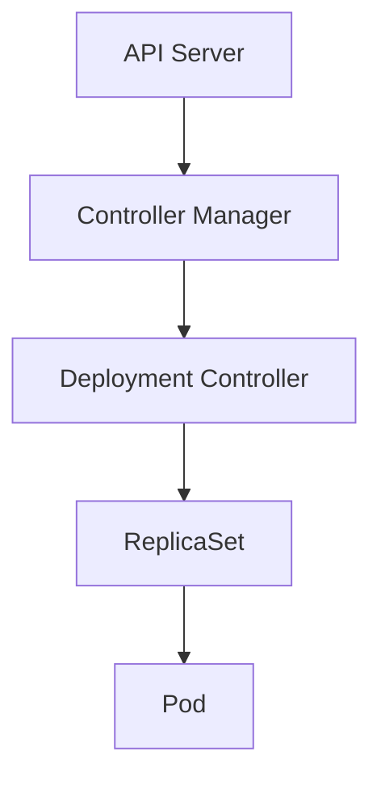
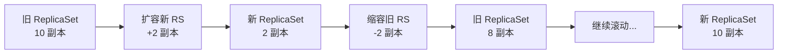
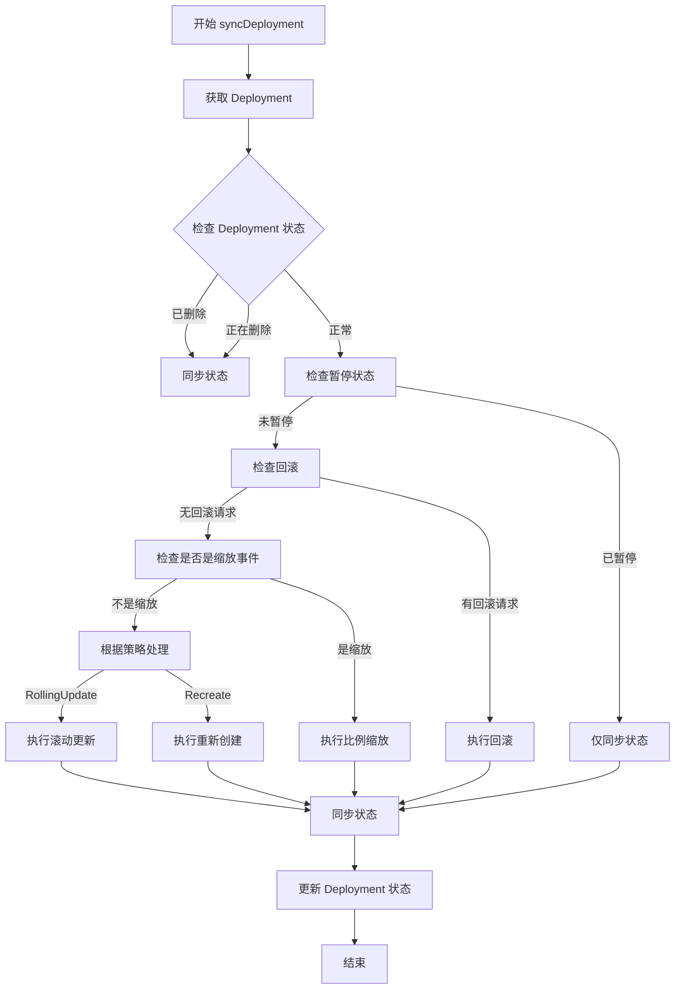

# Kubernetes Deployment Controller 深度源码分析

## 1. 概述

### Deployment Controller 的职责和作用

Deployment Controller 是 Kubernetes 控制平面中的核心控制器之一，主要负责管理 Deployment 资源的整个生命周期。它的主要职责包括：

- **ReplicaSet 管理**：创建、更新和删除 ReplicaSet，确保 Deployment 的期望副本数得到满足
- **滚动更新**：实现应用的无中断更新，支持滚动更新（RollingUpdate）和重新创建（Recreate）两种策略
- **版本控制**：维护部署历史，支持回滚到之前的版本
- **进度跟踪**：监控部署进度，在超时或失败时报告状态
- **暂停/恢复**：支持暂停和恢复部署过程，便于调试和手动干预
- **比例缩放**：在缩放事件中按比例调整新旧 ReplicaSet 的大小，确保服务可用性

### 在 Kubernetes 架构中的位置

Deployment 位于 Kubernetes 的控制器层次结构中：



Deployment Controller 通过 Informer 机制监听 Deployment、ReplicaSet 和 Pod 的变化，通过调谐循环确保实际状态与期望状态一致。

## 2. 目录结构

```
pkg/controller/deployment/
├── deployment_controller.go    # 主控制器实现
├── sync.go                    # 同步逻辑和状态管理
├── rolling.go                 # 滚动更新策略实现
├── recreate.go                # 重新创建策略实现
├── rollback.go                # 回滚机制实现
├── progress.go                 # 进度跟踪和超时处理
├── config/                    # 配置相关
│   ├── doc.go
│   ├── types.go
│   ├── v1alpha1/
│   └── zz_generated.*
├── util/deployment_util.go    # 工具函数库
└── *_test.go                  # 测试文件
```

### 关键文件作用

- **deployment_controller.go**：主控制器，包含事件处理、工作队列和主要协调逻辑
- **sync.go**：核心同步逻辑，包括 ReplicaSet 创建、状态同步和清理
- **rolling.go**：实现滚动更新策略，包括新旧 ReplicaSet 的协调
- **recreate.go**：实现重新创建策略，先删除所有 Pod 再创建新的
- **rollback.go**：实现回滚功能，支持回滚到指定版本
- **progress.go**：监控部署进度，处理超时和失败情况
- **util/deployment_util.go**：提供各种工具函数，包含常量定义和辅助方法

## 3. 核心机制

### 3.1 ReplicaSet 创建和管理

Deployment Controller 通过以下步骤管理 ReplicaSet：

```go
// 1. 计算模板哈希
podTemplateSpecHash := ComputeHash(&newRSTemplate, d.Status.CollisionCount)

// 2. 添加标签选择器
newRSSelector := CloneSelectorAndAddLabel(
    d.Spec.Selector,
    apps.DefaultDeploymentUniqueLabelKey,
    podTemplateSpecHash
)

// 3. 创建 ReplicaSet
newRS := &apps.ReplicaSet{
    ObjectMeta: metav1.ObjectMeta{
        Name:            generateReplicaSetName(d.Name, podTemplateSpecHash),
        Namespace:       d.Namespace,
        OwnerReferences: []metav1.OwnerReference{*metav1.NewControllerRef(d, controllerKind)},
        Labels:          newRSTemplate.Labels,
    },
    Spec: apps.ReplicaSetSpec{
        Replicas:        new(int32),
        MinReadySeconds: d.Spec.MinReadySeconds,
        Selector:        newRSSelector,
        Template:        newRSTemplate,
    },
}
```

### 3.2 滚动更新（RollingUpdate）策略

滚动更新是 Deployment 的默认更新策略，确保服务在更新过程中保持可用：

```go
// 1. 先扩容新 ReplicaSet
scaledUp, err := dc.reconcileNewReplicaSet(ctx, allRSs, newRS, d)

// 2. 再缩容旧 ReplicaSet
scaledDown, err := dc.reconcileOldReplicaSets(ctx, allRSs, oldRSs, newRS, d)

// 3. 确保最小可用性
minAvailable := *(deployment.Spec.Replicas) - maxUnavailable
newRSUnavailablePodCount := *(newRS.Spec.Replicas) - newRS.Status.AvailableReplicas
maxScaledDown := allPodsCount - minAvailable - newRSUnavailablePodCount
```

#### 关键概念

- **Max Surge**：最大可以超出期望副本数
- **Max Unavailable**：最大不可用副本数
- **Min Ready Seconds**：Pod 启动后需要保持就绪的最小时间



### 3.3 回滚（Rollback）机制

Deployment 支持回滚到之前的版本：

```go
// 1. 获取回滚目标
rollbackTo := getRollbackTo(d)

// 2. 查找目标版本的 ReplicaSet
for _, rs := range allRSs {
    v, err := Revision(rs)
    if v == rollbackTo.Revision {
        // 3. 执行回滚
        performedRollback, err := dc.rollbackToTemplate(ctx, d, rs)
        return err
    }
}

// 4. 清理回滚 spec
return dc.updateDeploymentAndClearRollbackTo(ctx, d)
```

### 3.4 暂停/恢复（Pause/Resume）

Deployment 支持暂停和恢复部署过程：

```go
if d.Spec.Paused {
    // 暂停时只同步状态，不进行实际更新
    return dc.syncStatusOnly(ctx, d, rsList)
}

// 恢复时添加相应的事件
if !d.Spec.Paused && pausedCondExists {
    condition := NewDeploymentCondition(
        apps.DeploymentProgressing,
        v1.ConditionUnknown,
        ResumedDeployReason,
        "Deployment is resumed"
    )
    SetDeploymentCondition(&d.Status, *condition)
}
```

### 3.5 比例缩放（Proportional Scaling）

在缩放事件中，Deployment Controller 按比例调整新旧 ReplicaSet：

```go
// 计算可分配的额外副本数
allowedSize := *(deployment.Spec.Replicas) + deploymentutil.MaxSurge(*deployment)
deploymentReplicasToAdd := allowedSize - allRSsReplicas

// 按比例分配到各个 ReplicaSet
for i := range allRSs {
    rs := allRSs[i]
    proportion := deploymentutil.GetReplicaSetProportion(
        rs, *deployment, deploymentReplicasToAdd, deploymentReplicasAdded
    )
    nameToSize[rs.Name] = *(rs.Spec.Replicas) + proportion
}
```

### 3.6 清理策略（RevisionHistoryLimit）

Deployment 会维护历史 ReplicaSet 用于回滚，但可以通过 `revisionHistoryLimit` 限制数量：

```go
func (dc *DeploymentController) cleanupDeployment(ctx context.Context, oldRSs []*apps.ReplicaSet, deployment *apps.Deployment) error {
    if !deploymentutil.HasRevisionHistoryLimit(deployment) {
        return nil
    }

    // 计算需要清理的数量
    diff := int32(len(cleanableRSes)) - *deployment.Spec.RevisionHistoryLimit
    if diff <= 0 {
        return nil
    }

    // 按版本号排序并删除最旧的
    sort.Sort(deploymentutil.ReplicaSetsByRevision(cleanableRSes))
    for i := int32(0); i < diff; i++ {
        // 确保没有正在运行的副本
        if rs.Status.Replicas == 0 && *(rs.Spec.Replicas) == 0 {
            dc.client.AppsV1().ReplicaSets(rs.Namespace).Delete(ctx, rs.Name, metav1.DeleteOptions{})
        }
    }
}
```

## 4. 核心数据结构

### 4.1 DeploymentController 结构

```go
type DeploymentController struct {
    // ReplicaSet 控制接口
    rsControl controller.RSControlInterface

    // Kubernetes 客户端
    client clientset.Interface

    // 事件广播器和记录器
    eventBroadcaster record.EventBroadcaster
    eventRecorder    record.EventRecorder

    // 同步处理器（可注入用于测试）
    syncHandler func(ctx context.Context, dKey string) error

    // 列表器和索引器
    dLister appslisters.DeploymentLister
    rsLister appslisters.ReplicaSetLister
    podLister corelisters.PodLister
    podIndexer cache.Indexer

    // 同步状态检查函数
    dListerSynced cache.InformerSynced
    rsListerSynced cache.InformerSynced
    podListerSynced cache.InformerSynced

    // 工作队列
    queue workqueue.TypedRateLimitingInterface[string]
}
```

### 4.2 关键状态和配置

```go
// Deployment 状态
type DeploymentStatus struct {
    ObservedGeneration  int64
    Replicas            int32          // 实际副本数
    UpdatedReplicas     int32          // 更新到新版本的副本数
    ReadyReplicas       int32          // 就绪副本数
    AvailableReplicas   int32          // 可用副本数
    UnavailableReplicas int32          // 不可用副本数
    CollisionCount     *int32         // 哈希冲突计数
    Conditions         []DeploymentCondition // 部署条件
}

// 部署条件类型
type DeploymentCondition struct {
    Type               DeploymentConditionType
    Status             ConditionStatus
    LastUpdateTime     metav1.Time
    LastTransitionTime metav1.Time
    Reason             string
    Message            string
}

// 部署策略
type DeploymentStrategy struct {
    Type          DeploymentStrategyType
    RollingUpdate *RollingUpdateDeployment
}
```

## 5. 工作流程

### 5.1 syncDeployment 流程



### 5.2 事件处理

Deployment Controller 监听以下事件：

1. **Deployment 事件**：
   - Add/Update/Delete：触发整个 Deployment 的同步
   - 修改 spec.template：触发滚动更新
   - 修改 spec.replicas：触发缩放

2. **ReplicaSet 事件**：
   - Add：新 ReplicaSet 被创建，可能需要被 Deployment 接管
   - Update：ReplicaSet 状态变化，触发 Deployment 状态同步
   - Delete：ReplicaSet 被删除，影响 Deployment 的历史记录

3. **Pod 事件**：
   - Delete：对于 Recreate 策略，Pod 删除完成后触发下一步

### 5.3 调谐循环

```go
// 主工作循环
func (dc *DeploymentController) worker(ctx context.Context) {
    for dc.processNextWorkItem(ctx) {
    }
}

func (dc *DeploymentController) processNextWorkItem(ctx context.Context) bool {
    key, quit := dc.queue.Get()
    if quit {
        return false
    }
    defer dc.queue.Done(key)

    // 执行同步
    err := dc.syncHandler(ctx, key)
    dc.handleErr(ctx, err, key)

    return true
}
```

## 6. 关键代码片段

### 6.1 滚动更新核心逻辑

```go
// reconcileNewReplicaSet 扩容新 ReplicaSet
func (dc *DeploymentController) reconcileNewReplicaSet(ctx context.Context, allRSs []*apps.ReplicaSet, newRS *apps.ReplicaSet, deployment *apps.Deployment) (bool, error) {
    if *(newRS.Spec.Replicas) == *(deployment.Spec.Replicas) {
        return false, nil // 无需扩容
    }

    if *(newRS.Spec.Replicas) > *(deployment.Spec.Replicas) {
        // 缩容新 ReplicaSet
        scaled, _, err := dc.scaleReplicaSet(ctx, newRS, *(deployment.Spec.Replicas), deployment, false)
        return scaled, err
    }

    // 计算应该扩容到多少
    newReplicasCount, err := deploymentutil.NewRSNewReplicas(deployment, allRSs, newRS)
    if err != nil {
        return false, err
    }

    // 执行扩容
    scaled, _, err := dc.scaleReplicaSet(ctx, newRS, newReplicasCount, deployment, false)
    return scaled, err
}
```

### 6.2 滚动更新中的缩容逻辑

```go
// reconcileOldReplicaSets 缩容旧 ReplicaSet
func (dc *DeploymentController) reconcileOldReplicaSets(ctx context.Context, allRSs []*apps.ReplicaSet, oldRSs []*apps.ReplicaSet, newRS *apps.ReplicaSet, deployment *apps.Deployment) (bool, error) {
    oldPodsCount := deploymentutil.GetReplicaCountForReplicaSets(oldRSs)
    if oldPodsCount == 0 {
        return false, nil // 无需缩容
    }

    allPodsCount := deploymentutil.GetReplicaCountForReplicaSets(allRSs)
    maxUnavailable := deploymentutil.MaxUnavailable(*deployment)
    minAvailable := *(deployment.Spec.Replicas) - maxUnavailable

    // 计算最大可缩容数量
    newRSUnavailablePodCount := *(newRS.Spec.Replicas) - newRS.Status.AvailableReplicas
    maxScaledDown := allPodsCount - minAvailable - newRSUnavailablePodCount

    if maxScaledDown <= 0 {
        return false, nil
    }

    // 先清理不健康的副本
    oldRSs, cleanupCount, err := dc.cleanupUnhealthyReplicas(ctx, oldRSs, deployment, maxScaledDown)
    if err != nil {
        return false, nil
    }

    // 再缩容旧 ReplicaSet
    scaledDownCount, err := dc.scaleDownOldReplicaSetsForRollingUpdate(ctx, allRSs, oldRSs, deployment)
    return cleanupCount+scaledDownCount > 0, err
}
```

### 6.3 进度超时检测

```go
// requeueStuckDeployment 检测是否超时并重新排队
func (dc *DeploymentController) requeueStuckDeployment(ctx context.Context, d *apps.Deployment, newStatus apps.DeploymentStatus) time.Duration {
    currentCond := util.GetDeploymentCondition(d.Status, apps.DeploymentProgressing)

    // 没有进度截止时间或没有进度条件
    if !util.HasProgressDeadline(d) || currentCond == nil {
        return time.Duration(-1)
    }

    // 部署已完成或已超时
    if util.DeploymentComplete(d, &newStatus) || currentCond.Reason == util.TimedOutReason {
        return time.Duration(-1)
    }

    // 计算超时时间
    after := currentCond.LastUpdateTime.Time.Add(
        time.Duration(*d.Spec.ProgressDeadlineSeconds) * time.Second,
    ).Sub(nowFn())

    if after < time.Second {
        // 立即重新排队
        dc.enqueueRateLimited(d)
        return time.Duration(0)
    }

    // 延迟重新排队
    dc.enqueueAfter(d, after+time.Second)
    return after
}
```

## 7. 最佳实践建议

### 7.1 配置建议

1. **设置适当的 progressDeadlineSeconds**
   ```yaml
   spec:
     progressDeadlineSeconds: 600  # 10分钟
   ```

2. **合理的滚动更新配置**
   ```yaml
   spec:
     strategy:
       type: RollingUpdate
       rollingUpdate:
         maxSurge: 25%          # 最多超出25%的副本
         maxUnavailable: 25%    # 最多25%的副本不可用
   ```

3. **保留适当的历史版本**
   ```yaml
   spec:
     revisionHistoryLimit: 10  # 保留10个历史版本
   ```

### 7.2 使用建议

1. **使用 kubectl rollout 命令监控进度**
   ```bash
   kubectl rollout status deployment/nginx-deployment
   kubectl rollout history deployment/nginx-deployment
   kubectl rollout undo deployment/nginx-deployment --to-revision=2
   ```

2. **使用 kubectl rollout pause 暂停部署**
   ```bash
   kubectl rollout pause deployment/nginx-deployment
   # 应用修改
   kubectl rollout resume deployment/nginx-deployment
   ```

3. **设置合理的就绪探针**
   ```yaml
   spec:
     template:
       spec:
         containers:
         - name: nginx
           readinessProbe:
             httpGet:
               path: /
               port: 80
             initialDelaySeconds: 5
             periodSeconds: 10
   ```

### 7.3 故障排查

1. **检查 Deployment 状态**
   ```bash
   kubectl get deployment nginx-deployment -o yaml
   kubectl describe deployment nginx-deployment
   ```

2. **检查 ReplicaSet 状态**
   ```bash
   kubectl get rs -l app=nginx
   kubectl describe rs <rs-name>
   ```

3. **检查 Pod 状态**
   ```bash
   kubectl get pods -l app=nginx
   kubectl describe pod <pod-name>
   kubectl logs <pod-name>
   ```

4. **常见问题**
   - ImagePullBackOff：检查镜像名称和仓库访问权限
   - CrashLoopBackOff：检查容器健康检查和日志
   - 超时问题：调整 progressDeadlineSeconds 或检查应用启动时间

## 8. 总结

Deployment Controller 是 Kubernetes 中功能最丰富的控制器之一，它通过管理 ReplicaSet 来实现应用的部署、更新和回滚。理解其工作原理对于：

- **故障排查**：快速定位部署失败的原因
- **性能优化**：合理配置参数以获得最佳性能
- **功能扩展**：基于现有功能开发更复杂的部署策略
- **架构设计**：设计符合业务需求的部署流程

通过深入理解 Deployment Controller 的源码，我们可以更好地利用 Kubernetes 的部署功能，构建更加稳定和高效的应用部署系统。
