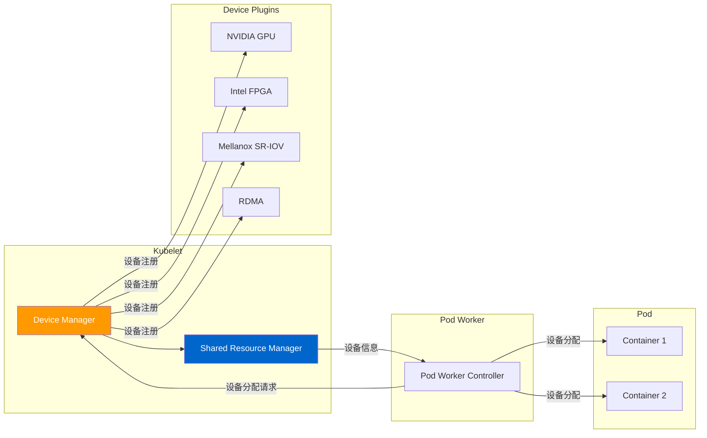
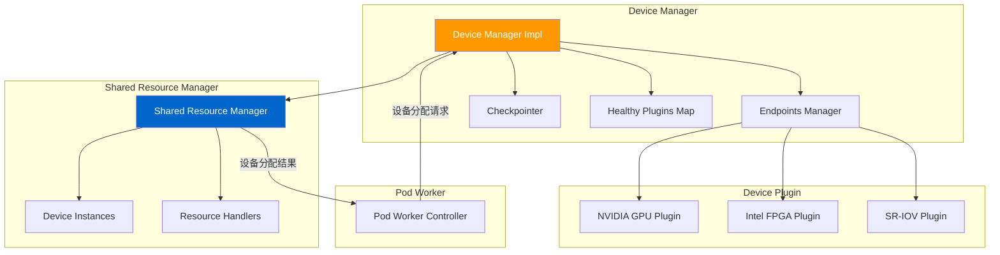
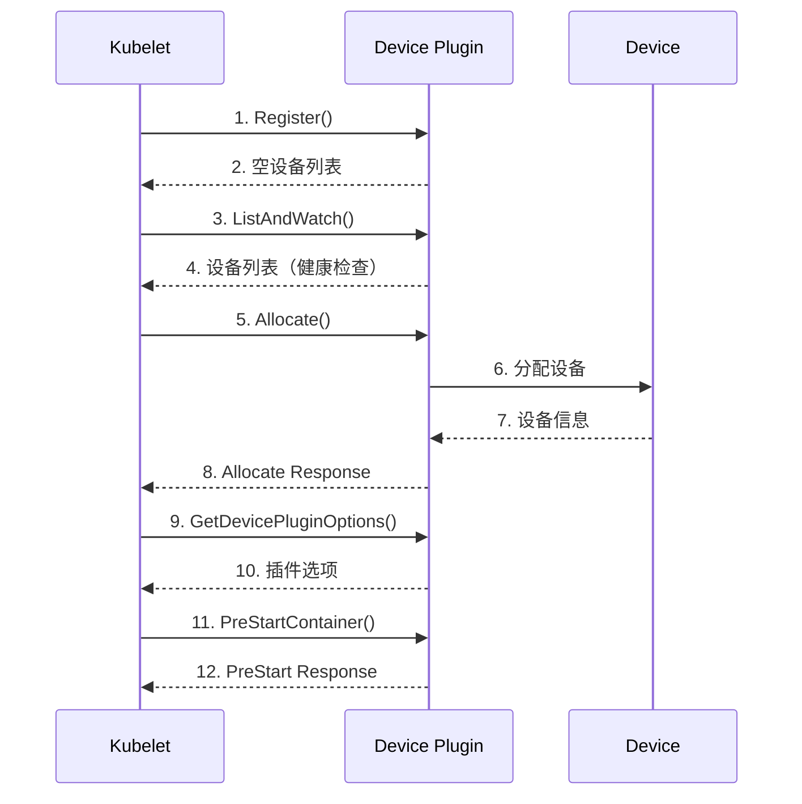
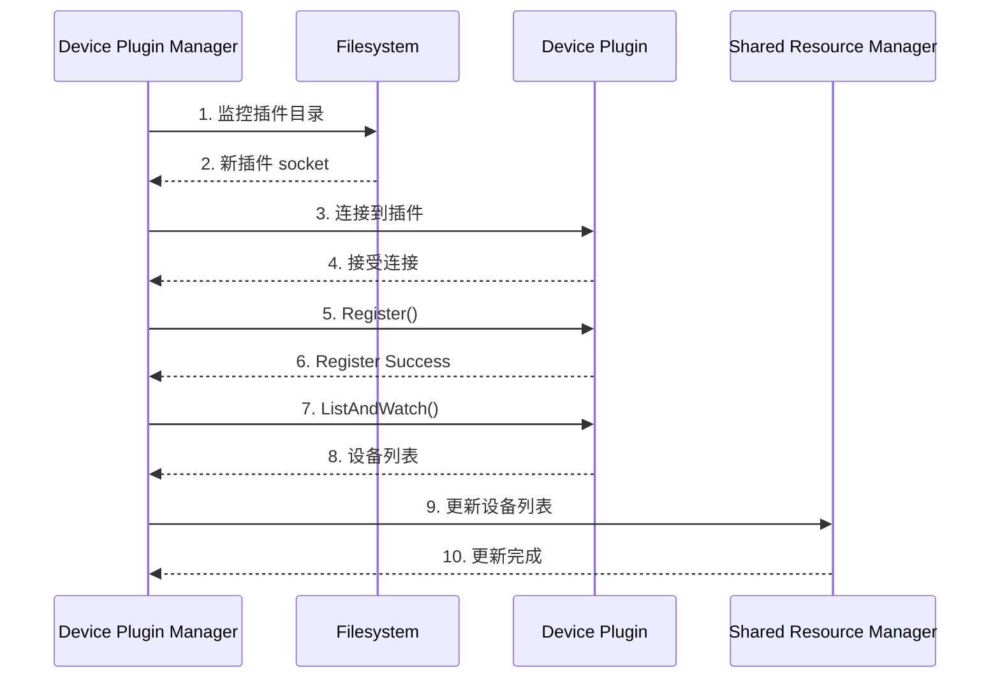
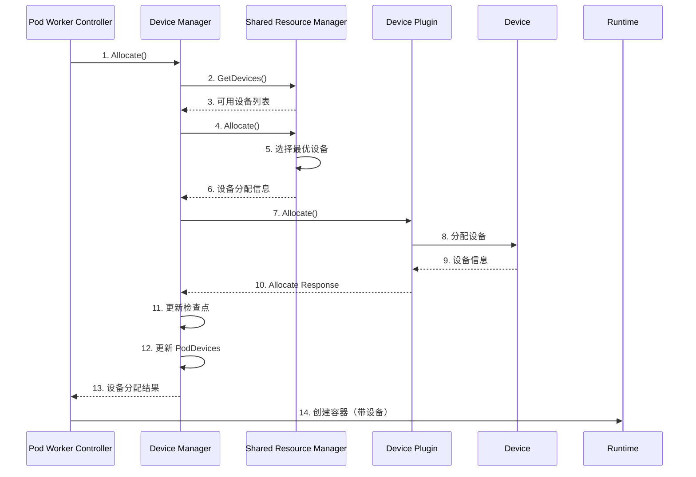
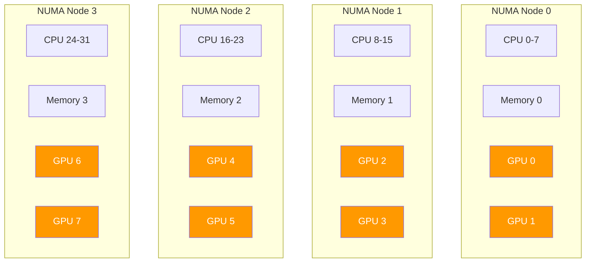
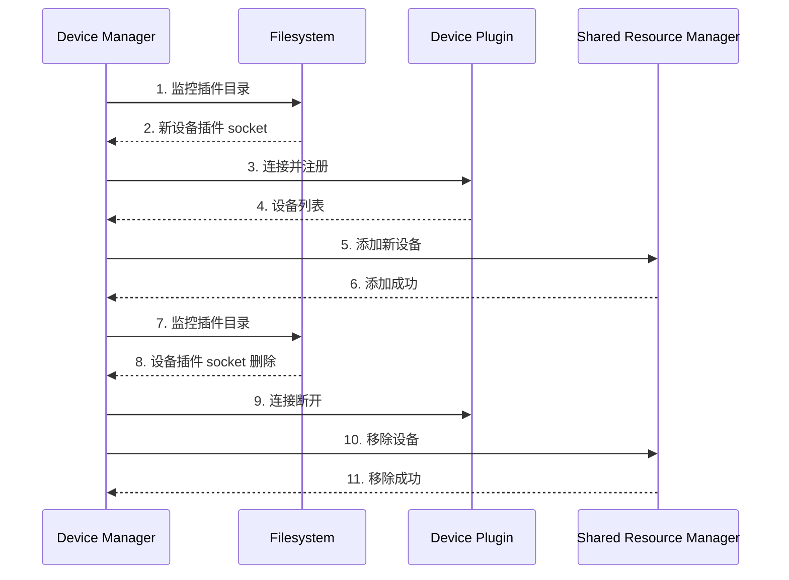

# Device Manager 深度分析

> 本文档深入分析 Kubernetes 的 Device Manager，包括 Device Plugin 接口、设备注册和健康检查、设备分配流程、设备资源管理、NUMA 拓扑感知和设备热插拔。

---

## 目录

1. [Device Manager 概述](#device-manager-概述)
2. [Device Manager 架构](#device-manager-架构)
3. [Device Plugin 接口](#device-plugin-接口)
4. [设备注册和健康检查](#设备注册和健康检查)
5. [设备分配流程](#设备分配流程)
6. [设备资源管理](#设备资源管理)
7. [NUMA 拓扑感知](#numa-拓扑感知)
8. [设备热插拔](#设备热插拔)
9. [常见 Device Plugin](#常见-device-plugin)
10. [性能优化](#性能优化)
11. [故障排查](#故障排查)
12. [最佳实践](#最佳实践)

---

## Device Manager 概述

### Device Manager 的作用

Device Manager 是 Kubelet 中负责管理硬件设备（GPU、FPGA、SR-IOV、RDMA 等）的核心组件：



### Device Manager 的职责

| 职责 | 说明 |
|------|------|
| **设备注册** | 注册和管理所有可用的硬件设备 |
| **设备健康检查** | 定期检查设备健康状态 |
| **设备分配** | 为 Pod 分配合适的设备 |
| **设备资源管理** | 管理设备的资源限制和配额 |
| **NUMA 拓扑感知** | 考虑 NUMA 节点亲和性进行设备分配 |
| **设备热插拔** | 支持动态添加/移除设备 |

### Device Manager 的价值

- **统一接口**：为不同类型的硬件设备提供统一的管理接口
- **资源隔离**：确保设备资源不被过度分配
- **性能优化**：通过 NUMA 拓扑感知优化设备访问性能
- **可扩展性**：支持通过 Device Plugin 添加新设备类型
- **AI/ML 支持**：为 AI/ML 工作负载提供硬件加速支持

---

## Device Manager 架构

### 整体架构



### 核心组件

#### 1. DeviceManagerImpl

**位置**：`pkg/kubelet/cm/devicemanager/manager.go`

DeviceManagerImpl 是 Device Manager 的核心实现：

```go
// DeviceManagerImpl 设备管理器实现
type DeviceManagerImpl struct {
    // 端点管理器
    endpoints map[string]endpointInfo

    // 健康插件列表
    healthyPlugins map[string]bool

    // 设备实例
    checkpointedResources map[string]checkpointFile

    // 共享资源管理器
    resourceManager *resourceManager

    // 设备插件目录
    pluginDir string

    // Pod 设备分配缓存
    podDevices device.PodDevices

    // 停止通道
    stopCh chan struct{}
}
```

#### 2. EndpointsManager

**位置**：`pkg/kubelet/cm/devicemanager/endpoint.go`

EndpointsManager 管理与 Device Plugin 的通信：

```go
// endpointsManager 端点管理器
type endpointsManager struct {
    // 端点列表
    endpoints map[string]endpointInfo

    // 端点锁
    endpointsLock sync.RWMutex

    // 插件目录
    pluginDir string
}

// endpointInfo 端点信息
type endpointInfo struct {
    // gRPC 客户端
    client *grpc.ClientConn

    // Device Plugin 客户端
    pluginClient pb.DevicePluginClient

    // 设备名称
    resourceName string

    // socket 路径
    socketPath string
}
```

#### 3. Checkpointer

**位置**：`pkg/kubelet/cm/devicemanager/checkpoint.go`

Checkpointer 负责持久化设备分配状态：

```go
// checkpointer 检查点管理器
type checkpointer struct {
    // 检查点文件路径
    dataDir string

    // 检查点文件
    checkpointFile *os.File

    // 设备状态
    deviceStates map[string]*allocateInfo
}

// checkpointFile 检查点文件
type checkpointFile struct {
    // Pod 设备分配
    PodDevices map[string]*podDevicesCheckpoint `json:"podDevices"`

    // 设备健康状态
    DeviceStates map[string]*deviceStateCheckpoint `json:"deviceStates"`
}
```

#### 4. SharedResourceManager

**位置**：`pkg/kubelet/cm/devicemanager/devices.go`

SharedResourceManager 管理共享设备和资源分配：

```go
// resourceManager 资源管理器
type resourceManager struct {
    // 设备实例
    devices map[string][]deviceInfo

    // 资源处理程序
    resourceHandlers map[string]resourceHandler

    // Pod 设备缓存
    podDevices device.PodDevices
}

// deviceInfo 设备信息
type deviceInfo struct {
    // 设备 ID
    ID string

    // 设备健康状态
    Health string

    // NUMA 节点
    Topology *pluginapi.TopologyInfo

    // 设备属性
    Properties *pluginapi.Device
}
```

---

## Device Plugin 接口

### Device Plugin 协议

Device Plugin 通过 gRPC 与 Kubelet 通信：



### gRPC 接口定义

**位置**：`staging/src/k8s.io/kubelet/pkg/apis/deviceplugin/v1beta1/api.proto`

#### 1. Register

注册 Device Plugin：

```protobuf
service Registration {
    rpc Register(RegisterRequest) returns (Empty);
}

message RegisterRequest {
    string version = 1;
    string endpoint = 2;
    string resource_name = 3;
    string options = 4;
}
```

#### 2. ListAndWatch

列出和监控设备：

```protobuf
service DevicePlugin {
    rpc ListAndWatch(Empty) returns (stream ListAndWatchResponse);
    rpc Allocate(AllocateRequest) returns (AllocateResponse);
    rpc GetDevicePluginOptions(Empty) returns (DevicePluginOptions);
    rpc PreStartContainer(PreStartContainerRequest) returns (PreStartContainerResponse);
}
```

**ListAndWatchResponse**：

```protobuf
message ListAndWatchResponse {
    repeated Device devices = 1;
}

message Device {
    string ID = 1;
    string health = 2;
    TopologyInfo topology = 3;
    map<string, string> properties = 4;
}
```

#### 3. Allocate

分配设备：

```protobuf
message AllocateRequest {
    repeated string devices_ids = 1;
    map<string, string> allocations = 2;
}

message AllocateResponse {
    repeated ContainerAllocateResponse container_responses = 1;
}

message ContainerAllocateResponse {
    repeated string envs = 1;
    repeated Mount mounts = 2;
    repeated DeviceSpec devices = 3;
    map<string, string> annotations = 4;
}
```

#### 4. GetDevicePluginOptions

获取插件选项：

```protobuf
message DevicePluginOptions {
    bool pre_start_required = 1;
}
```

### Device Plugin 实现

#### NVIDIA GPU Plugin 示例

**位置**：`k8s.io/kubelet/pkg/apis/deviceplugin/v1beta1/api.go`

```go
// NVIDIADevicePlugin NVIDIA GPU 设备插件
type NVIDIADevicePlugin struct {
    // gRPC 服务器
    server *grpc.Server

    // 设备列表
    devices []*pluginapi.Device

    // 健康检查通道
    health chan *pluginapi.Device

    // socket 路径
    socket string
}

// Register 注册设备插件
func (m *NVIDIADevicePlugin) Register() error {
    // 1. 创建 gRPC 连接
    conn, err := grpc.Dial(kubeletSocket, grpc.WithInsecure(), grpc.WithBlock(),
        grpc.WithContextDialer(dialer), grpc.WithDefaultCallOptions(grpc.MaxCallRecvMsgSize(maxMsgSize)))
    if err != nil {
        return err
    }
    defer conn.Close()

    // 2. 创建注册客户端
    client := pluginapi.NewRegistrationClient(conn)

    // 3. 注册插件
    req := &pluginapi.RegisterRequest{
        Version:      pluginapi.Version,
        Endpoint:     m.socket,
        ResourceName: "nvidia.com/gpu",
        Options:      &pluginapi.DevicePluginOptions{},
    }

    _, err = client.Register(context.Background(), req)
    return err
}

// ListAndWatch 列出和监控设备
func (m *NVIDIADevicePlugin) ListAndWatch(empty *pluginapi.Empty, stream pluginapi.DevicePlugin_ListAndWatchServer) error {
    // 1. 获取 GPU 设备列表
    devs := m.getDevices()

    // 2. 发送设备列表
    stream.Send(&pluginapi.ListAndWatchResponse{Devices: devs})

    // 3. 监控设备健康状态
    for {
        select {
        case dev := <-m.health:
            dev.Health = pluginapi.Unhealthy
            stream.Send(&pluginapi.ListAndWatchResponse{Devices: []*pluginapi.Device{dev}})
        case <-m.stop:
            return nil
        }
    }
}

// Allocate 分配 GPU
func (m *NVIDIADevicePlugin) Allocate(ctx context.Context, req *pluginapi.AllocateRequest) (*pluginapi.AllocateResponse, error) {
    responses := pluginapi.AllocateResponse{
        ContainerResponses: []*pluginapi.ContainerAllocateResponse{},
    }

    // 1. 为每个设备分配资源
    for _, deviceID := range req.ContainerAllocations[0].DevicesIDs {
        // 2. 获取设备 UUID
        uuid := m.deviceIDtoUUID[deviceID]

        // 3. 生成设备路径
        devPath := "/dev/nvidia" + strings.TrimPrefix(uuid, "GPU-")

        // 4. 构建分配响应
        response := &pluginapi.ContainerAllocateResponse{
            Devices: []*pluginapi.DeviceSpec{
                {
                    HostPath:      devPath,
                    ContainerPath: devPath,
                    Permissions:   "rw",
                },
            },
            Envs: map[string]string{
                "NVIDIA_VISIBLE_DEVICES": deviceID,
            },
        }

        responses.ContainerResponses = append(responses.ContainerResponses, response)
    }

    return &responses, nil
}
```

---

## 设备注册和健康检查

### 设备注册流程



### 代码实现

#### 1. 监控插件目录

**位置**：`pkg/kubelet/cm/devicemanager/endpoint.go`

```go
// Start 启动设备管理器
func (dm *DeviceManagerImpl) Start(activePods ActivePodsFunc, sourcesReady config.SourcesReady) error {
    // 1. 启动端点管理器
    go dm.monitorDevicePlugins()

    // 2. 恢复之前的设备分配
    if err := dm.restoreDeviceStates(); err != nil {
        klog.Errorf("Failed to restore device states: %v", err)
    }

    return nil
}

// monitorDevicePlugins 监控设备插件
func (dm *DeviceManagerImpl) monitorDevicePlugins() {
    // 1. 监控插件目录
    fsnotifyWatcher, err := fsnotify.NewWatcher()
    if err != nil {
        klog.Errorf("Failed to create watcher: %v", err)
        return
    }

    err = fsnotifyWatcher.Add(dm.pluginDir)
    if err != nil {
        klog.Errorf("Failed to watch plugin directory: %v", err)
        return
    }

    // 2. 扫描现有插件
    currentPlugins, err := filepath.Glob(filepath.Join(dm.pluginDir, "*.sock"))
    if err != nil {
        klog.Errorf("Failed to scan plugins: %v", err)
    } else {
        for _, pluginPath := range currentPlugins {
            dm.handleNewPlugin(pluginPath)
        }
    }

    // 3. 监控插件变化
    for {
        select {
        case event := <-fsnotifyWatcher.Events:
            if event.Op&fsnotify.Create == fsnotify.Create {
                dm.handleNewPlugin(event.Name)
            } else if event.Op&fsnotify.Remove == fsnotify.Remove {
                dm.handleRemovedPlugin(event.Name)
            }
        case err := <-fsnotifyWatcher.Errors:
            klog.Errorf("Watcher error: %v", err)
        case <-dm.stopCh:
            return
        }
    }
}
```

#### 2. 处理新插件

**位置**：`pkg/kubelet/cm/devicemanager/endpoint.go`

```go
// handleNewPlugin 处理新插件
func (dm *DeviceManagerImpl) handleNewPlugin(pluginPath string) {
    // 1. 提取插件名称
    resourceName := path.Base(pluginPath)

    // 2. 连接到插件
    conn, err := grpc.Dial(pluginPath, grpc.WithInsecure(), grpc.WithBlock(),
        grpc.WithContextDialer(func(ctx context.Context, addr string) (net.Conn, error) {
            return (&net.Dialer{}).DialContext(ctx, "unix", addr)
        }))
    if err != nil {
        klog.Errorf("Failed to connect to plugin %s: %v", resourceName, err)
        return
    }

    // 3. 创建插件客户端
    client := pluginapi.NewDevicePluginClient(conn)

    // 4. 获取插件选项
    opts, err := client.GetDevicePluginOptions(context.Background(), &pluginapi.Empty{})
    if err != nil {
        klog.Errorf("Failed to get plugin options: %v", err)
        return
    }

    // 5. 注册插件
    _, err = client.Register(context.Background(), &pluginapi.RegisterRequest{
        Version:      pluginapi.Version,
        Endpoint:     path.Base(pluginPath),
        ResourceName: resourceName,
    })
    if err != nil {
        klog.Errorf("Failed to register plugin: %v", err)
        return
    }

    // 6. 添加到端点列表
    dm.endpointsLock.Lock()
    dm.endpoints[resourceName] = endpointInfo{
        client:        conn,
        pluginClient:  client,
        resourceName:  resourceName,
        socketPath:    pluginPath,
    }
    dm.endpointsLock.Unlock()

    // 7. 启动设备监控
    go dm.watchDevices(resourceName, client)
}
```

#### 3. 监控设备健康状态

**位置**：`pkg/kubelet/cm/devicemanager/endpoint.go`

```go
// watchDevices 监控设备
func (dm *DeviceManagerImpl) watchDevices(resourceName string, client pluginapi.DevicePluginClient) {
    // 1. 调用 ListAndWatch
    stream, err := client.ListAndWatch(context.Background(), &pluginapi.Empty{})
    if err != nil {
        klog.Errorf("Failed to watch devices: %v", err)
        return
    }

    // 2. 处理设备更新
    for {
        resp, err := stream.Recv()
        if err == io.EOF {
            break
        }
        if err != nil {
            klog.Errorf("Failed to receive devices: %v", err)
            return
        }

        // 3. 更新设备列表
        dm.updateDeviceList(resourceName, resp.Devices)
    }
}

// updateDeviceList 更新设备列表
func (dm *DeviceManagerImpl) updateDeviceList(resourceName string, devices []*pluginapi.Device) {
    // 1. 转换设备信息
    deviceInfos := make([]deviceInfo, 0, len(devices))
    for _, dev := range devices {
        deviceInfos = append(deviceInfos, deviceInfo{
            ID:        dev.ID,
            Health:    dev.Health,
            Topology:  dev.Topology,
            Properties: dev,
        })
    }

    // 2. 更新资源管理器
    dm.resourceManager.Update(resourceName, deviceInfos)

    // 3. 更新健康插件列表
    dm.endpointsLock.Lock()
    dm.healthyPlugins[resourceName] = true
    dm.endpointsLock.Unlock()
}
```

---

## 设备分配流程

### 完整分配流程



### 代码实现

#### 1. 设备分配入口

**位置**：`pkg/kubelet/cm/devicemanager/manager.go`

```go
// Allocate 分配设备
func (dm *DeviceManagerImpl) Allocate(pod *v1.Pod, container *v1.Container) error {
    // 1. 提取设备请求
    deviceRequests, err := dm.getDeviceRequests(pod, container)
    if err != nil {
        return err
    }

    // 2. 为每个设备资源分配设备
    for resourceName, requests := range deviceRequests {
        // 3. 调用资源管理器分配
        allocation, err := dm.resourceManager.Allocate(resourceName, requests, pod)
        if err != nil {
            return err
        }

        // 4. 更新 Pod 设备缓存
        dm.podDevices.Insert(podUID, containerName, resourceName, allocation)
    }

    // 5. 保存检查点
    return dm.checkpoint()
}
```

#### 2. 共享资源分配

**位置**：`pkg/kubelet/cm/devicemanager/devices.go`

```go
// Allocate 分配共享资源
func (rm *resourceManager) Allocate(resourceName string, requests []string, pod *v1.Pod) (*pluginapi.ContainerAllocateResponse, error) {
    // 1. 获取资源处理程序
    resourceHandler, ok := rm.resourceHandlers[resourceName]
    if !ok {
        return nil, fmt.Errorf("no handler for resource %s", resourceName)
    }

    // 2. 调用 Allocate
    return resourceHandler.Allocate(requests, pod)
}

// Allocate 分配设备
func (h *resourceHandler) Allocate(deviceIDs []string, pod *v1.Pod) (*pluginapi.ContainerAllocateResponse, error) {
    // 1. 检查设备是否可用
    for _, deviceID := range deviceIDs {
        device := h.getDevice(deviceID)
        if device.Health != pluginapi.Healthy {
            return nil, fmt.Errorf("device %s is unhealthy", deviceID)
        }
    }

    // 2. 检查设备是否已被分配
    for _, deviceID := range deviceIDs {
        if h.isDeviceAllocated(deviceID) {
            return nil, fmt.Errorf("device %s is already allocated", deviceID)
        }
    }

    // 3. 更新设备分配状态
    for _, deviceID := range deviceIDs {
        h.allocateDevice(deviceID, pod.UID)
    }

    // 4. 调用 Device Plugin Allocate
    client := h.endpoint.pluginClient
    allocateReq := &pluginapi.AllocateRequest{
        ContainerAllocations: []*pluginapi.ContainerAllocateRequest{
            {
                DevicesIDs: deviceIDs,
            },
        },
    }

    allocateResp, err := client.Allocate(context.Background(), allocateReq)
    if err != nil {
        // 回滚分配
        for _, deviceID := range deviceIDs {
            h.deallocateDevice(deviceID)
        }
        return nil, err
    }

    return allocateResp.ContainerResponses[0], nil
}
```

#### 3. NUMA 拓扑感知分配

**位置**：`pkg/kubelet/cm/devicemanager/devices.go`

```go
// AllocateWithTopology NUMA 拓扑感知分配
func (h *resourceHandler) AllocateWithTopology(deviceIDs []string, pod *v1.Pod, podTopology []*pluginapi.NUMANode) (*pluginapi.ContainerAllocateResponse, error) {
    // 1. 获取 Pod 的 NUMA 拓扑
    if len(podTopology) == 0 {
        return h.Allocate(deviceIDs, pod)
    }

    // 2. 选择最优 NUMA 节点
    bestNUMANode := h.selectBestNUMANode(deviceIDs, podTopology)

    // 3. 在选定的 NUMA 节点中分配设备
    devicesInNUMA := h.filterDevicesByNUMA(deviceIDs, bestNUMANode.NodeID)
    if len(devicesInNUMA) < len(deviceIDs) {
        return nil, fmt.Errorf("not enough devices in NUMA node %d", bestNUMANode.NodeID)
    }

    // 4. 调用 Allocate
    return h.Allocate(devicesInNUMA, pod)
}

// selectBestNUMANode 选择最优 NUMA 节点
func (h *resourceHandler) selectBestNUMANode(deviceIDs []string, podTopology []*pluginapi.NUMANode) *pluginapi.NUMANode {
    // 1. 统计每个 NUMA 节点中可用的设备数量
    numaDeviceCount := make(map[int64]int)
    for _, deviceID := range deviceIDs {
        device := h.getDevice(deviceID)
        if device.Topology != nil {
            for _, numaNode := range device.Topology.Nodes {
                numaDeviceCount[numaNode.ID]++
            }
        }
    }

    // 2. 选择设备最多的 NUMA 节点
    bestNodeID := int64(-1)
    maxCount := 0
    for nodeID, count := range numaDeviceCount {
        if count > maxCount {
            maxCount = count
            bestNodeID = nodeID
        }
    }

    // 3. 返回最优 NUMA 节点
    for _, numaNode := range podTopology {
        if numaNode.ID == bestNodeID {
            return numaNode
        }
    }

    return nil
}
```

---

## 设备资源管理

### 资源类型

| 资源类型 | Device Plugin | 说明 |
|---------|--------------|------|
| **GPU** | nvidia.com/gpu | NVIDIA GPU |
| **AMD GPU** | amd.com/gpu | AMD GPU |
| **Intel GPU** | intel.com/gpu | Intel GPU |
| **FPGA** | intel.com/fpga | Intel FPGA |
| **SR-IOV** | mellanox.com/sriov_vf | Mellanox SR-IOV |
| **RDMA** | rdma/rdma | RDMA 设备 |
| **TPU** | google.com/tpu | Google TPU |
| **NPU** | huawei.com/npu | 华为 NPU |

### 资源请求示例

#### GPU 请求

```yaml
apiVersion: v1
kind: Pod
metadata:
  name: gpu-pod
spec:
  containers:
  - name: gpu-container
    image: nvidia/cuda:11.0.3-base
    resources:
      limits:
        nvidia.com/gpu: 2  # 请求 2 个 GPU
    command: ["nvidia-smi"]
```

#### FPGA 请求

```yaml
apiVersion: v1
kind: Pod
metadata:
  name: fpga-pod
spec:
  containers:
  - name: fpga-container
    image: fpga-operator:latest
    resources:
      limits:
        intel.com/fpga: 1  # 请求 1 个 FPGA
```

#### SR-IOV 请求

```yaml
apiVersion: v1
kind: Pod
metadata:
  name: sriov-pod
spec:
  containers:
  - name: sriov-container
    image: nginx
    resources:
      limits:
        mellanox.com/sriov_vf: 2  # 请求 2 个 SR-IOV VF
```

### 资源管理代码

#### 设备资源统计

**位置**：`pkg/kubelet/cm/devicemanager/devices.go`

```go
// GetCapacity 获取设备容量
func (h *resourceHandler) GetCapacity() v1.ResourceList {
    // 1. 统计健康设备数量
    healthyCount := 0
    for _, device := range h.devices {
        if device.Health == pluginapi.Healthy {
            healthyCount++
        }
    }

    // 2. 构建资源列表
    resourceList := v1.ResourceList{
        v1.ResourceName(h.resourceName): resource.MustParse(strconv.Itoa(healthyCount)),
    }

    return resourceList
}

// GetAllocatableDevices 获取可分配设备
func (h *resourceHandler) GetAllocatableDevices() []string {
    // 1. 筛选健康且未分配的设备
    allocatableDevices := make([]string, 0)
    for _, device := range h.devices {
        if device.Health == pluginapi.Healthy && !h.isDeviceAllocated(device.ID) {
            allocatableDevices = append(allocatableDevices, device.ID)
        }
    }

    return allocatableDevices
}
```

---

## NUMA 拓扑感知

### NUMA 拓扑概念

NUMA（Non-Uniform Memory Access）是一种计算机内存访问架构，每个处理器都有自己的本地内存：



### NUMA 拓扑信息

**位置**：`pkg/kubelet/cm/devicemanager/devices.go`

```go
// TopologyInfo 拓扑信息
type TopologyInfo struct {
    Nodes []*NUMANode `protobuf:"bytes,1,rep,name=nodes,proto3" json:"nodes,omitempty"`
}

// NUMANode NUMA 节点
type NUMANode struct {
    ID int64 `protobuf:"varint,1,opt,name=ID,proto3" json:"ID,omitempty"`
}
```

### NUMA 拓扑感知分配

```go
// AllocateWithTopology NUMA 拓扑感知分配
func (h *resourceHandler) AllocateWithTopology(deviceIDs []string, pod *v1.Pod, podTopology []*pluginapi.NUMANode) (*pluginapi.ContainerAllocateResponse, error) {
    // 1. 获取 Pod 的 NUMA 拓扑
    if len(podTopology) == 0 {
        return h.Allocate(deviceIDs, pod)
    }

    // 2. 选择最优 NUMA 节点
    bestNUMANode := h.selectBestNUMANode(deviceIDs, podTopology)

    // 3. 在选定的 NUMA 节点中分配设备
    devicesInNUMA := h.filterDevicesByNUMA(deviceIDs, bestNUMANode.NodeID)
    if len(devicesInNUMA) < len(deviceIDs) {
        return nil, fmt.Errorf("not enough devices in NUMA node %d", bestNUMANode.NodeID)
    }

    // 4. 调用 Allocate
    return h.Allocate(devicesInNUMA, pod)
}

// selectBestNUMANode 选择最优 NUMA 节点
func (h *resourceHandler) selectBestNUMANode(deviceIDs []string, podTopology []*pluginapi.NUMANode) *pluginapi.NUMANode {
    // 1. 统计每个 NUMA 节点中可用的设备数量
    numaDeviceCount := make(map[int64]int)
    for _, deviceID := range deviceIDs {
        device := h.getDevice(deviceID)
        if device.Topology != nil {
            for _, numaNode := range device.Topology.Nodes {
                numaDeviceCount[numaNode.ID]++
            }
        }
    }

    // 2. 选择设备最多的 NUMA 节点
    bestNodeID := int64(-1)
    maxCount := 0
    for nodeID, count := range numaDeviceCount {
        if count > maxCount {
            maxCount = count
            bestNodeID = nodeID
        }
    }

    // 3. 返回最优 NUMA 节点
    for _, numaNode := range podTopology {
        if numaNode.ID == bestNodeID {
            return numaNode
        }
    }

    return nil
}
```

---

## 设备热插拔

### 热插拔支持

Device Manager 支持设备的热插拔（Hotplug）：



### 代码实现

#### 热插拔设备

**位置**：`pkg/kubelet/cm/devicemanager/endpoint.go`

```go
// monitorDevicePlugins 监控设备插件
func (dm *DeviceManagerImpl) monitorDevicePlugins() {
    // 1. 监控插件目录
    fsnotifyWatcher, err := fsnotify.NewWatcher()
    if err != nil {
        klog.Errorf("Failed to create watcher: %v", err)
        return
    }

    err = fsnotifyWatcher.Add(dm.pluginDir)
    if err != nil {
        klog.Errorf("Failed to watch plugin directory: %v", err)
        return
    }

    // 2. 监控插件变化
    for {
        select {
        case event := <-fsnotifyWatcher.Events:
            if event.Op&fsnotify.Create == fsnotify.Create {
                // 新插件
                dm.handleNewPlugin(event.Name)
            } else if event.Op&fsnotify.Remove == fsnotify.Remove {
                // 插件移除
                dm.handleRemovedPlugin(event.Name)
            }
        case err := <-fsnotifyWatcher.Errors:
            klog.Errorf("Watcher error: %v", err)
        case <-dm.stopCh:
            return
        }
    }
}

// handleRemovedPlugin 处理移除的插件
func (dm *DeviceManagerImpl) handleRemovedPlugin(pluginPath string) {
    // 1. 提取插件名称
    resourceName := path.Base(pluginPath)

    // 2. 关闭连接
    dm.endpointsLock.Lock()
    if endpoint, ok := dm.endpoints[resourceName]; ok {
        endpoint.client.Close()
        delete(dm.endpoints, resourceName)
    }
    dm.endpointsLock.Unlock()

    // 3. 从健康插件列表移除
    dm.endpointsLock.Lock()
    delete(dm.healthyPlugins, resourceName)
    dm.endpointsLock.Unlock()

    // 4. 从资源管理器移除设备
    dm.resourceManager.Remove(resourceName)

    // 5. 保存检查点
    dm.checkpoint()
}
```

---

## 常见 Device Plugin

### 1. NVIDIA GPU Plugin

**特点**：
- 支持 NVIDIA GPU
- 提供设备健康检查
- 支持 MIG（Multi-Instance GPU）

**资源名称**：`nvidia.com/gpu`

**项目地址**：https://github.com/NVIDIA/k8s-device-plugin

### 2. Intel FPGA Plugin

**特点**：
- 支持 Intel FPGA
- 支持动态重配置
- 提供设备性能监控

**资源名称**：`intel.com/fpga`

**项目地址**：https://github.com/intel/intel-device-plugins-for-kubernetes

### 3. Mellanox SR-IOV Plugin

**特点**：
- 支持 Mellanox SR-IOV VF
- 支持 RDMA
- 提供网络性能优化

**资源名称**：`mellanox.com/sriov_vf`

**项目地址**：https://github.com/Mellanox/k8s-rdma-shared-dev-plugin

### 4. AMD GPU Plugin

**特点**：
- 支持 AMD GPU
- 支持 ROCm
- 提供设备监控

**资源名称**：`amd.com/gpu`

**项目地址**：https://github.com/RadeonOpenCompute/k8s-device-plugin

---

## 性能优化

### 优化策略

#### 1. 批量设备分配

```go
// BatchAllocate 批量分配设备
func (dm *DeviceManagerImpl) BatchAllocate(pod *v1.Pod) error {
    // 1. 收集所有容器请求
    containerDeviceRequests := make(map[string][]deviceRequest)
    for _, container := range pod.Spec.Containers {
        requests, _ := dm.getDeviceRequests(pod, container)
        containerDeviceRequests[container.Name] = requests
    }

    // 2. 批量分配
    for resourceName, requests := range containerDeviceRequests {
        allocation, err := dm.resourceManager.Allocate(resourceName, requests, pod)
        if err != nil {
            return err
        }

        dm.podDevices.Insert(pod.UID, containerName, resourceName, allocation)
    }

    return nil
}
```

#### 2. 设备缓存

```go
// deviceCache 设备缓存
type deviceCache struct {
    sync.RWMutex
    devices map[string]*deviceInfo
}

// Get 获取缓存
func (c *deviceCache) Get(deviceID string) (*deviceInfo, bool) {
    c.RLock()
    defer c.RUnlock()
    dev, ok := c.devices[deviceID]
    return dev, ok
}

// Set 设置缓存
func (c *deviceCache) Set(deviceID string, dev *deviceInfo) {
    c.Lock()
    defer c.Unlock()
    c.devices[deviceID] = dev
}
```

#### 3. NUMA 拓扑预分配

```go
// PreAllocateNUMA 预分配 NUMA 节点
func (h *resourceHandler) PreAllocateNUMA(pod *v1.Pod, numaNode int64) error {
    // 1. 预分配 NUMA 节点中的所有设备
    devices := h.getDevicesInNUMA(numaNode)

    // 2. 标记设备为已预留
    for _, device := range devices {
        h.reserveDevice(device.ID, pod.UID)
    }

    return nil
}
```

---

## 故障排查

### 常见问题

#### 问题 1：设备分配失败

**症状**：Pod 状态为 `ContainerCreating`，事件显示 `Failed to allocate device`

**排查步骤**：

```bash
# 1. 查看 Pod 事件
kubectl describe pod <pod-name>

# 2. 查看 Device Plugin 日志
kubectl logs <device-plugin-pod> -n kube-system

# 3. 检查设备是否可用
kubectl describe node <node-name> | grep -A 20 "Allocated resources"

# 4. 查看 Kubelet 日志
journalctl -u kubelet -f | grep -i device
```

**解决方案**：

```bash
# 1. 重启 Device Plugin
kubectl delete pod <device-plugin-pod> -n kube-system

# 2. 检查设备驱动
lspci | grep -i nvidia  # NVIDIA GPU
ls -l /dev/nvidia*

# 3. 检查 Kubelet 设备插件目录
ls -l /var/lib/kubelet/device-plugins/
```

#### 问题 2：NUMA 拓扑感知不生效

**症状**：设备分配在错误的 NUMA 节点

**排查步骤**：

```bash
# 1. 查看 NUMA 拓扑
numactl -H

# 2. 查看设备 NUMA 节点
nvidia-smi -q | grep "GPU 0000:00:00.0" -A 5 | grep NUMA

# 3. 查看 Pod 的 NUMA 策略
kubectl get pod <pod-name> -o yaml | grep -A 10 "numa"
```

**解决方案**：

```yaml
# 启用 NUMA 策略
apiVersion: v1
kind: Pod
metadata:
  name: numa-aware-pod
spec:
  containers:
  - name: gpu-container
    image: nvidia/cuda:11.0.3-base
    resources:
      limits:
        nvidia.com/gpu: 2
  nodeSelector:
    kubernetes.io/arch: amd64
  topologySpreadConstraints:
  - maxSkew: 1
    topologyKey: topology.kubernetes.io/zone
    whenUnsatisfiable: DoNotSchedule
```

#### 问题 3：设备热插拔失败

**症状**：新设备未被发现

**排查步骤**：

```bash
# 1. 检查设备是否被识别
lspci | grep -i nvidia

# 2. 检查设备插件目录
ls -l /var/lib/kubelet/device-plugins/

# 3. 查看设备插件日志
kubectl logs <device-plugin-pod> -n kube-system -f

# 4. 重启 Kubelet
systemctl restart kubelet
```

**解决方案**：

```bash
# 1. 重新加载设备驱动
modprobe -r nvidia
modprobe nvidia

# 2. 重启设备插件
kubectl delete pod <device-plugin-pod> -n kube-system

# 3. 重启 Kubelet
systemctl restart kubelet
```

---

## 最佳实践

### 1. 选择合适的设备类型

| 场景 | 推荐设备 | 原因 |
|------|---------|------|
| AI/ML 训练 | NVIDIA GPU | CUDA 生态成熟 |
| AI/ML 推理 | NVIDIA GPU/TPU | 高性能推理 |
| FPGA 加速 | Intel FPGA | 低延迟、高吞吐 |
| 网络加速 | Mellanox SR-IOV | RDMA 支持 |
| 视频编码 | Intel Quick Sync | 硬件加速 |

### 2. 设置合理的设备请求

```yaml
apiVersion: v1
kind: Pod
metadata:
  name: gpu-pod
spec:
  containers:
  - name: gpu-container
    image: nvidia/cuda:11.0.3-base
    resources:
      requests:
        nvidia.com/gpu: 1  # 请求 1 个 GPU
      limits:
        nvidia.com/gpu: 1  # 限制 1 个 GPU
```

### 3. 使用设备共享

```yaml
apiVersion: v1
kind: Pod
metadata:
  name: shared-gpu-pod
spec:
  containers:
  - name: container-1
    image: nvidia/cuda:11.0.3-base
    resources:
      limits:
        nvidia.com/gpu: 1
    env:
    - name: CUDA_VISIBLE_DEVICES
      value: "0"
  - name: container-2
    image: nvidia/cuda:11.0.3-base
    resources:
      limits:
        nvidia.com/gpu: 1
    env:
    - name: CUDA_VISIBLE_DEVICES
      value: "0"
```

### 4. 监控设备使用率

```yaml
apiVersion: v1
kind: ServiceMonitor
metadata:
  name: nvidia-dcgm-exporter
spec:
  selector:
    matchLabels:
      app: nvidia-dcgm-exporter
  endpoints:
  - port: metrics
    interval: 15s
```

**关键指标**：

```yaml
# GPU 利用率
DCGM_FI_DEV_GPU_UTIL

# GPU 显存使用率
DCGM_FI_DEV_FB_USED

# GPU 温度
DCGM_FI_DEV_GPU_TEMP
```

### 5. 使用 NodeAffinity 优化设备分配

```yaml
apiVersion: v1
kind: Pod
metadata:
  name: gpu-pod-with-affinity
spec:
  containers:
  - name: gpu-container
    image: nvidia/cuda:11.0.3-base
    resources:
      limits:
        nvidia.com/gpu: 2
  affinity:
    nodeAffinity:
      requiredDuringSchedulingIgnoredDuringExecution:
        nodeSelectorTerms:
        - matchExpressions:
          - key: accelerator
            operator: In
            values:
            - nvidia-tesla-v100
```

---

## 总结

### 关键要点

1. **统一接口**：Device Manager 为不同类型的硬件设备提供统一的管理接口
2. **插件化设计**：通过 Device Plugin 支持多种设备类型
3. **健康检查**：定期检查设备健康状态，自动移除不健康设备
4. **资源管理**：确保设备资源不被过度分配
5. **NUMA 拓扑感知**：考虑 NUMA 节点亲和性优化性能
6. **热插拔支持**：支持动态添加/移除设备
7. **AI/ML 支持**：为 AI/ML 工作负载提供硬件加速支持

### 源码位置

| 组件 | 位置 |
|------|------|
| Device Manager | `pkg/kubelet/cm/devicemanager/` |
| Device Plugin | `staging/src/k8s.io/kubelet/pkg/apis/deviceplugin/` |
| Shared Resource Manager | `pkg/kubelet/cm/devicemanager/devices.go` |
| NVIDIA GPU Plugin | https://github.com/NVIDIA/k8s-device-plugin |
| Intel FPGA Plugin | https://github.com/intel/intel-device-plugins-for-kubernetes |

### 相关资源

- [Kubernetes Device Plugins 文档](https://kubernetes.io/docs/concepts/extend-kubernetes/compute-storage-net/device-plugins/)
- [Device Plugin API](https://github.com/kubernetes/kubernetes/tree/master/staging/src/k8s.io/kubelet/pkg/apis/deviceplugin)
- [NVIDIA GPU Plugin](https://github.com/NVIDIA/k8s-device-plugin)

---

::: tip 最佳实践
1. 使用官方 Device Plugin（NVIDIA GPU、Intel FPGA 等）
2. 合理设置设备请求和限制
3. 使用 NUMA 拓扑感知优化性能
4. 监控设备使用率和健康状态
5. 定期检查设备插件日志
:::

::: warning 注意事项
- Device Plugin 需要运行在特权模式
- 设备分配是静态的，不支持动态调整
- NUMA 拓扑感知需要硬件支持
- 设备热插拔需要设备插件支持
:::
