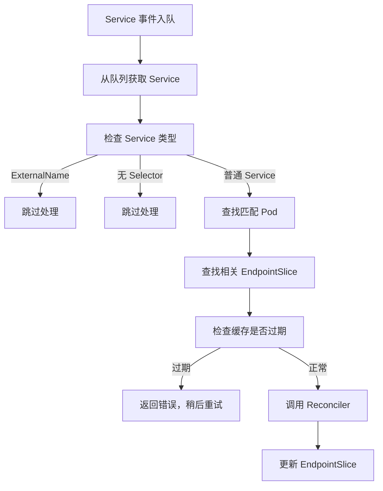

# Kubernetes EndpointSlice Controller 源码深度分析

## 1. 概述 - EndpointSlice Controller 的职责和作用

EndpointSlice Controller 是 Kubernetes 中负责管理服务端点发现的核心控制器。它是 Kubernetes 从传统 Endpoints API 向更高效的 EndpointSlice API 迁移的关键组件。

### 主要职责

1. **服务端点映射**：将匹配 Service selector 的 Pod 自动映射到对应的 EndpointSlice 中
2. **端点切片管理**：将大量端点智能地分割到多个 EndpointSlice 中（每个最多 1000 个端点）
3. **拓扑感知路由**：实现基于区域（zone）的流量分发优化
4. **增量更新**：高效的变更检测和批量处理机制
5. **服务发现**：维护 Service、Pod 和 EndpointSlice 之间的一致性关系

## 2. 目录结构

```
pkg/controller/endpointslice/
├── endpointslice_controller.go          # 主控制器实现
└── config/                             # 配置相关
```

## 3. 核心机制

### 3.1 EndpointSlice 创建机制

```go
// 端点切片命名规则
"<service-name>-<hash>"
// 标签示例
labels := map[string]string{
    discovery.LabelServiceName:   "my-service",
    discovery.LabelManagedBy:     "endpointslice-controller.k8s.io",
}
```

### 3.2 Pod 到 Endpoint 映射

1. **Pod 选择条件**：
   - 匹配 Service 的 selector
   - Pod 处于 Ready 状态
   - Pod 未在终止中
   - Pod 已分配 IP 地址

2. **端点信息结构**：
```go
type Endpoint struct {
    Addresses:  []string        // IP 地址列表
    Hostname:   *string         // 主机名
    NodeName:   *string         // 节点名称
    Zone:       *string         // 区域信息
    Conditions: EndpointConditions // 端点状态
    Hints:      *EndpointHints // 拓扑提示
}
```

## 4. 工作流程



## 5. 核心数据结构

```go
type Controller struct {
    client           clientset.Interface
    serviceLister     corelisters.ServiceLister
    podLister        corelisters.PodLister
    endpointSliceLister discoverylisters.EndpointSliceLister
    nodeLister       corelisters.NodeLister
    reconciler       *endpointslicerec.Reconciler
    
    serviceQueue workqueue.TypedRateLimitingInterface[string]
    podQueue     workqueue.TypedRateLimitingInterface[*PodProjectionKey]
    topologyQueue workqueue.TypedRateLimitingInterface[string]
    
    maxEndpointsPerSlice int32
    endpointSliceTracker *endpointsliceutil.EndpointSliceTracker
    triggerTimeTracker  *endpointsliceutil.TriggerTimeTracker
    topologyCache       *topologycache.TopologyCache
}
```

## 6. 最佳实践

### 6.1 性能优化

1. **批量处理**：设置合理的 `endpointUpdatesBatchPeriod`（默认 1 秒）
2. **监控指标**：
   - `endpoint_slice_controller_syncs{result="success|stale|error"}`
   - `endpoint_slice_controller_endpoints_desired`
   - `endpoint_slice_controller_num_endpoint_slices`

### 6.2 故障排查

1. **EndpointSlice 始终处于 "stale" 状态**：检查 Informer 缓存同步
2. **服务端点更新延迟**：检查 `endpointUpdatesBatchPeriod` 设置
3. **拓扑提示不工作**：确保节点有正确的区域标签

## 7. 总结

EndpointSlice Controller 是 Kubernetes 服务发现架构的核心组件，通过分片机制支持大规模集群，通过合理的配置和监控可以确保高效运行。
