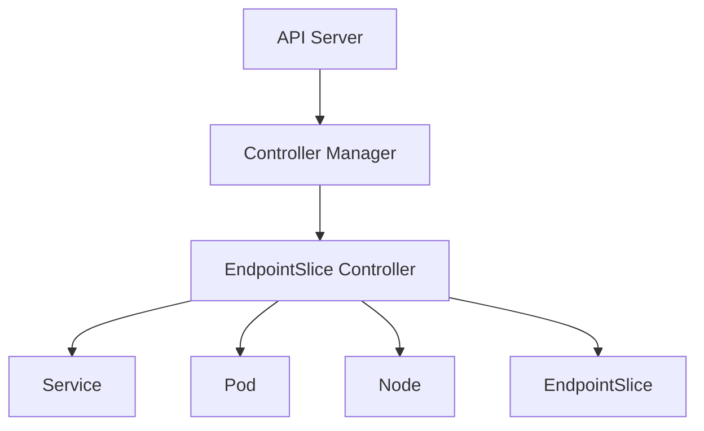
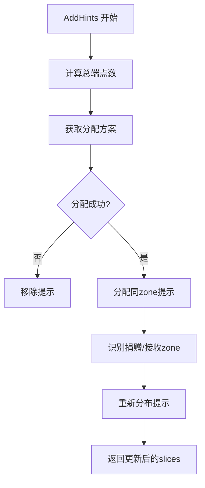
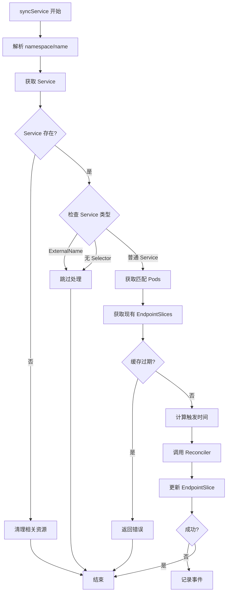
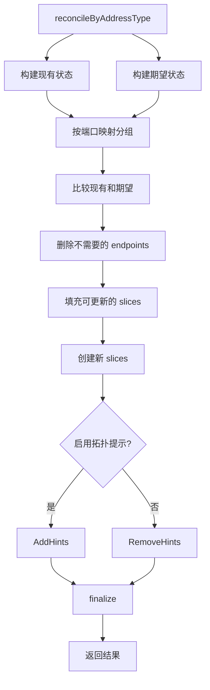
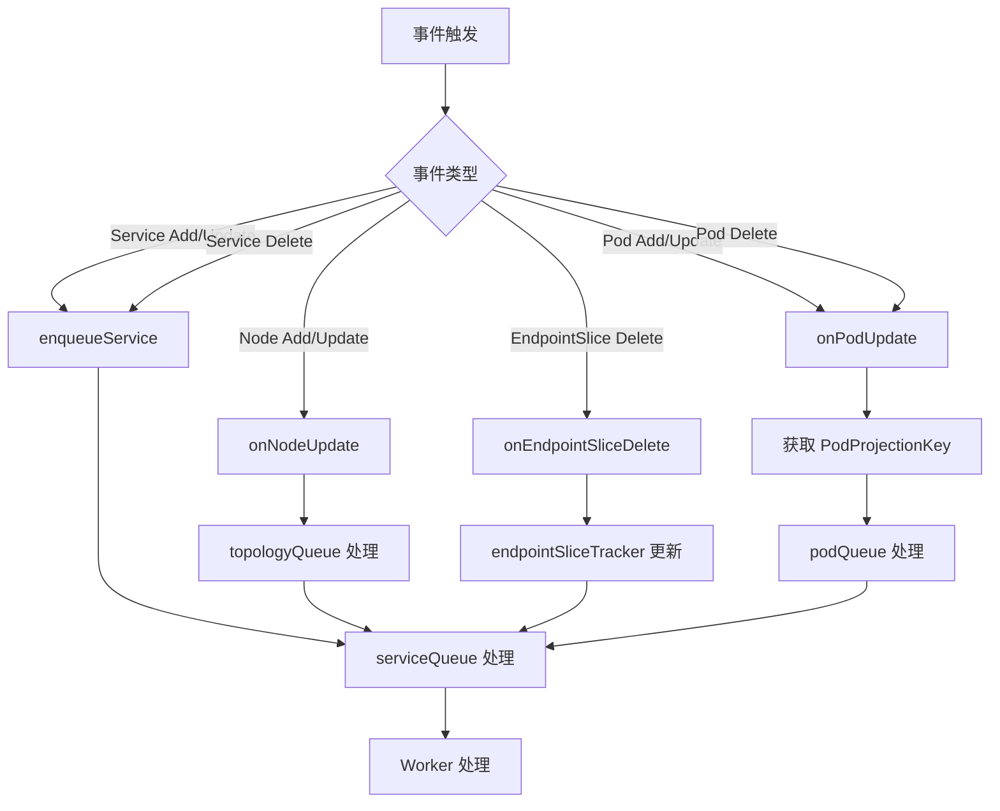

# Kubernetes EndpointSlice Controller 源码深度分析

## 1. 概述

EndpointSlice Controller 是 Kubernetes 中负责管理服务端点发现的核心控制器。它是 Kubernetes 从传统 Endpoints API 向更高效的 EndpointSlice API 迁移的关键组件，专门设计用于解决大规模集群中的服务发现问题。

### 主要职责

1. **服务端点映射**：将匹配 Service selector 的 Pod 自动映射到对应的 EndpointSlice 中
2. **端点切片管理**：将大量端点智能地分割到多个 EndpointSlice 中（每个最多 100 个端点）
3. **拓扑感知路由**：实现基于区域（zone）的流量分发优化
4. **增量更新**：高效的变更检测和批量处理机制
5. **服务发现**：维护 Service、Pod 和 EndpointSlice 之间的一致性关系

### 在 Kubernetes 架构中的位置



EndpointSlice Controller 监听 Service、Pod 和 Node 的变化，自动创建和维护对应的 EndpointSlice 资源。

## 2. 目录结构

```
pkg/controller/endpointslice/
├── endpointslice_controller.go          # 主控制器实现
├── config/                               # 配置相关
├── endpointslice_tracker.go              # EndpointSlice 追踪器
├── trigger_time_tracker.go               # 触发时间追踪
└── metrics/                              # 监控指标
```

### 关键文件说明

- **endpointslice_controller.go**：主控制器实现，包含核心协调逻辑
- **endpointslice_tracker.go**：追踪 EndpointSlice 的版本和状态
- **trigger_time_tracker.go**：追踪触发时间，用于决定何时更新 EndpointSlice
- **metrics/**：监控指标收集和导出

## 3. 核心机制

### 3.1 EndpointSlice 创建机制

#### 创建 EndpointSlice 的核心逻辑

```go
func newEndpointSlice(logger klog.Logger, service *v1.Service, endpointMeta *endpointMeta, controllerName string) *discovery.EndpointSlice {
    gvk := schema.GroupVersionKind{Version: "v1", Kind: "Service"}
    ownerRef := metav1.NewControllerRef(service, gvk)

    epSlice := &discovery.EndpointSlice{
        ObjectMeta: metav1.ObjectMeta{
            Labels:          map[string]string{},
            GenerateName:    getEndpointSlicePrefix(service.Name),
            OwnerReferences: []metav1.OwnerReference{*ownerRef},
            Namespace:       service.Namespace,
        },
        Ports:       endpointMeta.ports,
        AddressType: endpointMeta.addressType,
        Endpoints:   []discovery.Endpoint{},
    }

    // 添加父 Service 的标签
    epSlice.Labels, _ = setEndpointSliceLabels(logger, epSlice, service, controllerName)

    return epSlice
}
```

#### EndpointSlice 命名规则

```
<service-name>-<hash>
```

标签结构：
```go
labels := map[string]string{
    discovery.LabelServiceName:   "my-service",
    discovery.LabelManagedBy:     "endpointslice-controller.k8s.io",
}
```

### 3.2 Pod 到 Endpoint 映射

#### Pod 选择条件

1. **匹配 Service 的 selector**
2. **Pod 处于 Ready 状态**（或 `publishNotReadyAddresses` 为 true）
3. **Pod 已分配 IP 地址**
4. **Pod 未在终止中**（或允许终止中的 Pod）

#### Pod 投影键结构

```go
type PodProjectionKey struct {
    Namespace  string
    Labels     labels.Set // 当前 Pod 标签
    OldLabels  labels.Set // 更新事件中的旧标签
    PodChanged bool       // Pod 字段是否影响其 endpoints 成员资格
}
```

#### Pod 到 Endpoint 的转换

```go
func podToEndpoint(pod *v1.Pod, node *v1.Node, service *v1.Service, addressType discovery.AddressType) discovery.Endpoint {
    serving := endpointutil.IsPodReady(pod)
    terminating := pod.DeletionTimestamp != nil
    ready := service.Spec.PublishNotReadyAddresses || (serving && !terminating)

    ep := discovery.Endpoint{
        Addresses: getEndpointAddresses(pod.Status, service, addressType),
        Conditions: discovery.EndpointConditions{
            Ready:       &ready,
            Serving:     &serving,
            Terminating: &terminating,
        },
        TargetRef: &v1.ObjectReference{
            Kind:      "Pod",
            Namespace: pod.ObjectMeta.Namespace,
            Name:      pod.ObjectMeta.Name,
            UID:       pod.ObjectMeta.UID,
        },
    }

    if pod.Spec.NodeName != "" {
        ep.NodeName = &pod.Spec.NodeName
    }

    if node != nil && node.Labels[v1.LabelTopologyZone] != "" {
        ep.Zone = ptr.To(node.Labels[v1.LabelTopologyZone])
    }

    return ep
}
```

#### Endpoint 数据结构

```go
type Endpoint struct {
    // IP 地址列表（支持多个地址）
    Addresses []string

    // 主机名
    Hostname *string

    // 节点名称
    NodeName *string

    // Zone 信息
    Zone *string

    // 端点状态条件
    Conditions EndpointConditions

    // 拓扑提示
    Hints *EndpointHints

    // 目标引用
    TargetRef *v1.ObjectReference

    // 拓扑拓扑
    Topology map[string]string
}

type EndpointConditions struct {
    Ready       *bool
    Serving     *bool
    Terminating *bool
}

type EndpointHints struct {
    ForZones []ForZone
}

type ForZone struct {
    Name string
}
```

### 3.3 拓扑提示机制（Zone-aware Routing）

#### TopologyCache 结构

```go
type TopologyCache struct {
    lock sync.Mutex
    sufficientNodeInfo bool
    cpuByZone map[string]*resource.Quantity
    cpuRatiosByZone map[string]float64
    endpointsByService map[string]map[discovery.AddressType]EndpointZoneInfo
    hintsPopulatedByService sets.Set[string]
}
```

#### 拓扑提示添加流程



#### 拓扑提示分配逻辑

```go
func (t *TopologyCache) AddHints(logger klog.Logger, si *SliceInfo) ([]*discovery.EndpointSlice, []*discovery.EndpointSlice, []*EventBuilder) {
    totalEndpoints := si.getTotalReadyEndpoints()
    allocations, allocationsEvent := t.getAllocations(totalEndpoints)

    if allocationsEvent != nil {
        // 无法分配，移除提示
        return slicesToCreate, slicesToUpdate, events
    }

    allocatedHintsByZone := si.getAllocatedHintsByZone(allocations)

    // 步骤 1: 为所有 endpoints 分配同 zone 提示
    for _, slice := range allocatableSlices {
        for i, endpoint := range slice.Endpoints {
            if !EndpointReady(endpoint) {
                endpoint.Hints = nil
                continue
            }
            if endpoint.Zone == nil || *endpoint.Zone == "" {
                // 没有指定 zone，移除提示
                t.RemoveHints(si.ServiceKey, si.AddressType)
                return slicesToCreate, slicesToUpdate, events
            }

            allocatedHintsByZone[*endpoint.Zone]++
            slice.Endpoints[i].Hints = &discovery.EndpointHints{ForZones: []discovery.ForZone{{Name: *endpoint.Zone}}}
        }
    }

    // 步骤 2: 识别哪些 zone 需要捐赠/接收 slice
    givingZones, receivingZones := getGivingAndReceivingZones(allocations, allocatedHintsByZone)

    // 步骤 3: 根据 Zone 重新分布 endpoints
    redistributions := redistributeHints(logger, allocatableSlices, givingZones, receivingZones)

    return si.ToCreate, si.ToUpdate, events
}
```

### 3.4 变更检测算法

#### EndpointSliceTracker 实现

```go
type EndpointSliceTracker struct {
    lock sync.Mutex
    generationsByService map[types.NamespacedName]GenerationsBySlice
}

// ShouldSync 返回是否需要同步该 EndpointSlice
func (est *EndpointSliceTracker) ShouldSync(endpointSlice *discovery.EndpointSlice) bool {
    gfs, ok := est.GenerationsForSliceUnsafe(endpointSlice)
    if !ok {
        return true
    }
    g, ok := gfs[endpointSlice.UID]
    return !ok || endpointSlice.Generation > g
}

// StaleSlices 检查是否有过期的 slices
func (est *EndpointSliceTracker) StaleSlices(service *v1.Service, endpointSlices []*discovery.EndpointSlice) bool {
    nn := types.NamespacedName{Name: service.Name, Namespace: service.Namespace}
    gfs, ok := est.generationsByService[nn]
    if !ok {
        return false
    }

    providedSlices := map[types.UID]int64{}
    for _, endpointSlice := range endpointSlices {
        providedSlices[endpointSlice.UID] = endpointSlice.Generation
        g, ok := gfs[endpointSlice.UID]
        if ok && (g == deletionExpected || g > endpointSlice.Generation) {
            return true
        }
    }

    for uid, generation := range gfs {
        if generation == deletionExpected {
            continue
        }
        _, ok := providedSlices[uid]
        if !ok {
            return true
        }
    }
    return false
}
```

#### EndpointSet 实现

```go
type EndpointSet map[endpointHash]*discovery.Endpoint

func hashEndpoint(endpoint *discovery.Endpoint) endpointHash {
    sort.Strings(endpoint.Addresses)
    hashObj := endpointHashObj{Addresses: endpoint.Addresses}
    if endpoint.Hostname != nil {
        hashObj.Hostname = *endpoint.Hostname
    }
    if endpoint.TargetRef != nil {
        hashObj.Namespace = endpoint.TargetRef.Namespace
        hashObj.Name = endpoint.TargetRef.Name
    }
    return endpointHash(deepHashObjectToString(hashObj))
}

// 提供简单的方法来比较 Endpoints 集合
func (s EndpointSet) Insert(items ...*discovery.Endpoint) EndpointSet {
    for _, item := range items {
        s[hashEndpoint(item)] = item
    }
    return s
}

func (s EndpointSet) Delete(items ...*discovery.Endpoint) EndpointSet {
    for _, item := range items {
        delete(s, hashEndpoint(item))
    }
    return s
}
```

### 3.5 分片算法

#### 根据端口映射进行分片

```go
func (r *Reconciler) reconcileByPortMapping(
    logger klog.Logger,
    service *v1.Service,
    existingSlices []*discovery.EndpointSlice,
    desiredSet endpointsliceutil.EndpointSet,
    endpointMeta *endpointMeta,
) ([]*discovery.EndpointSlice, []*discovery.EndpointSlice, []*discovery.EndpointSlice, int, int) {

    // 1. 遍历现有 slices，删除不再需要的 endpoints
    for _, existingSlice := range existingSlices {
        newEndpoints := []discovery.Endpoint{}
        endpointUpdated := false
        for _, endpoint := range existingSlice.Endpoints {
            got := desiredSet.Get(&endpoint)
            if got != nil {
                newEndpoints = append(newEndpoints, *got)
                if !endpointsliceutil.EndpointsEqualBeyondHash(got, &endpoint) {
                    endpointUpdated = true
                }
                desiredSet.Delete(&endpoint)
            }
        }
        // ... 处理更新或删除
    }

    // 2. 如果还有需要添加的 endpoints，填充到标记为更新的 slices
    if desiredSet.Len() > 0 && sliceNamesToUpdate.Len() > 0 {
        // 按 endpoint 数量排序，先填充最满的 slices
        sort.Sort(endpointSliceEndpointLen(slices))

        for _, slice := range slices {
            for desiredSet.Len() > 0 && len(slice.Endpoints) < int(r.maxEndpointsPerSlice) {
                endpoint, _ := desiredSet.PopAny()
                slice.Endpoints = append(slice.Endpoints, *endpoint)
            }
        }
    }

    // 3. 如果还有剩余 endpoints，创建新的 slices
    for desiredSet.Len() > 0 {
        var sliceToFill *discovery.EndpointSlice

        // 尝试找到最接近填满的 slice
        if desiredSet.Len() < int(r.maxEndpointsPerSlice) && sliceNamesUnchanged.Len() > 0 {
            unchangedSlices := ...
            sliceToFill = getSliceToFill(unchangedSlices, desiredSet.Len(), int(r.maxEndpointsPerSlice))
        }

        if sliceToFill == nil {
            sliceToFill = newEndpointSlice(logger, service, endpointMeta, r.controllerName)
        } else {
            sliceToFill = sliceToFill.DeepCopy()
        }

        // 填充剩余的 endpoints
        for desiredSet.Len() > 0 && len(sliceToFill.Endpoints) < int(r.maxEndpointsPerSlice) {
            endpoint, _ := desiredSet.PopAny()
            sliceToFill.Endpoints = append(sliceToFill.Endpoints, *endpoint)
        }
    }

    return slicesToCreate, slicesToUpdate, slicesToDelete, numAdded, numRemoved
}
```

#### 最大 Endpoints 数量控制

默认的 `maxEndpointsPerSlice` 是 100，这个值可以通过 API server 的 flag `--max-endpoints-per-slice` 来修改。


### 3.6 TopologyCache 缓存机制

#### 节点拓扑分布更新

```go
func (t *TopologyCache) SetNodes(logger klog.Logger, nodes []*v1.Node) {
    cpuByZone := map[string]*resource.Quantity{}
    sufficientNodeInfo := true
    totalCPU := resource.Quantity{}

    for _, node := range nodes {
        if hasExcludedLabels(node.Labels) {
            continue
        }
        if !isNodeReady(node) {
            continue
        }

        nodeCPU := node.Status.Allocatable.Cpu()
        zone, ok := node.Labels[v1.LabelTopologyZone]

        if !ok || zone == "" || nodeCPU.IsZero() {
            // 节点信息不完整，放弃
            sufficientNodeInfo = false
            break
        }

        totalCPU.Add(*nodeCPU)
        if _, ok = cpuByZone[zone]; !ok {
            cpuByZone[zone] = nodeCPU
        } else {
            cpuByZone[zone].Add(*nodeCPU)
        }
    }

    t.lock.Lock()
    defer t.lock.Unlock()

    if totalCPU.IsZero() || !sufficientNodeInfo || len(cpuByZone) < 2 {
        t.sufficientNodeInfo = false
        t.cpuByZone = nil
        t.cpuRatiosByZone = nil
    } else {
        t.sufficientNodeInfo = sufficientNodeInfo
        t.cpuByZone = cpuByZone

        t.cpuRatiosByZone = map[string]float64{}
        for zone, cpu := range cpuByZone {
            t.cpuRatiosByZone[zone] = float64(cpu.MilliValue()) / float64(totalCPU.MilliValue())
        }
    }
}
```

#### 负载分配计算

```go
func (t *TopologyCache) getAllocations(numEndpoints int) (map[string]allocation, *EventBuilder) {
    // 检查是否有足够的节点信息
    if t.cpuRatiosByZone == nil {
        return nil, &EventBuilder{...}
    }
    if len(t.cpuRatiosByZone) < 2 {
        return nil, &EventBuilder{...}
    }
    if len(t.cpuRatiosByZone) > numEndpoints {
        return nil, &EventBuilder{...}
    }

    remainingMinEndpoints := numEndpoints
    minTotal := 0
    allocations := map[string]allocation{}

    // 计算每个 zone 的最小分配
    for zone, ratio := range t.cpuRatiosByZone {
        desired := ratio * float64(numEndpoints)
        minimum := int(math.Ceil(desired * (1 / (1 + overloadThreshold))))
        allocations[zone] = allocation{
            minimum: minimum,
            desired: math.Max(desired, float64(minimum)),
        }
        minTotal += minimum
        remainingMinEndpoints -= minimum
        if remainingMinEndpoints < 0 {
            return nil, &EventBuilder{...}
        }
    }

    // 计算最大分配
    for zone, allocation := range allocations {
        allocation.maximum = allocation.minimum + numEndpoints - minTotal
        allocations[zone] = allocation
    }

    return allocations, nil
}
```

### 3.7 与传统 Endpoints API 的对比

#### 传统 Endpoints 的局限性

| 问题 | 描述 |
|------|------|
| 单一大对象 | 所有 endpoints 都存储在一个 Endpoints 对象中 |
| 更新开销大 | 单个 endpoint 变更需要更新整个对象 |
| 缺乏分片支持 | 无法有效地进行分片和缓存 |
| 规模限制 | 难以处理大规模服务 |

#### EndpointSlice 的优势

| 特性 | EndpointSlice |
|------|---------------|
| 分片存储 | 一个 Service 可以对应多个 EndpointSlice |
| 增量更新 | 只变更相关的 slices，减少 API 压力 |
| 拓扑感知 | 支持 zone-aware 和 node-aware routing |
| 多地址类型 | 支持 IPv4、IPv6、FQDN 等 |
| 更好的扩展性 | 适合大规模集群 |

#### API 对比

```go
// 传统 Endpoints
type Endpoints struct {
    ObjectMeta metav1.ObjectMeta
    Subsets    []EndpointSubset
}

type EndpointSubset struct {
    Addresses           []Address
    NotReadyAddresses   []Address
    Ports               []EndpointPort
}

// EndpointSlice
type EndpointSlice struct {
    ObjectMeta metav1.ObjectMeta
    AddressType AddressType  // IPv4, IPv6, FQDN
    Ports       []EndpointPort
    Endpoints   []Endpoint
}
```

## 4. 核心数据结构

### 4.1 Controller 结构

```go
type Controller struct {
    client           clientset.Interface
    eventBroadcaster record.EventBroadcaster
    eventRecorder    record.EventRecorder

    serviceLister corelisters.ServiceLister
    servicesSynced cache.InformerSynced

    podLister corelisters.PodLister
    podsSynced cache.InformerSynced

    endpointSliceLister discoverylisters.EndpointSliceLister
    endpointSlicesSynced cache.InformerSynced
    endpointSliceTracker *endpointsliceutil.EndpointSliceTracker

    nodeLister corelisters.NodeLister
    nodesSynced cache.InformerSynced

    reconciler *endpointslicerec.Reconciler

    triggerTimeTracker *endpointsliceutil.TriggerTimeTracker

    serviceQueue workqueue.TypedRateLimitingInterface[string]
    podQueue workqueue.TypedRateLimitingInterface[*endpointsliceutil.PodProjectionKey]
    topologyQueue workqueue.TypedRateLimitingInterface[string]

    maxEndpointsPerSlice int32
    workerLoopPeriod time.Duration
    endpointUpdatesBatchPeriod time.Duration

    topologyCache *topologycache.TopologyCache
}
```

### 4.2 Reconciler 结构

```go
type Reconciler struct {
    client clientset.Interface
    nodeLister corelisters.NodeLister
    maxEndpointsPerSlice int32
    endpointSliceTracker *endpointsliceutil.EndpointSliceTracker
    metricsCache *metrics.Cache
    topologyCache *topologycache.TopologyCache
    preferSameTrafficDistribution bool
    eventRecorder record.EventRecorder
    controllerName string
}
```

## 5. 工作流程

### 5.1 syncService 完整流程



### 5.2 reconcileByAddressType 协调逻辑



### 5.3 finalize 最终处理

```go
func (r *Reconciler) finalize(
    service *corev1.Service,
    slicesToCreate, slicesToUpdate, slicesToDelete []*discovery.EndpointSlice,
    triggerTime time.Time,
) error {
    // 1. 将要删除的 slices 转换为更新，避免删除后立即创建
    for i := 0; i < len(slicesToDelete); {
        if len(slicesToCreate) == 0 {
            break
        }
        sliceToDelete := slicesToDelete[i]
        slice := slicesToCreate[len(slicesToCreate)-1]

        if sliceToDelete.AddressType == slice.AddressType && ownedBy(sliceToDelete, service) {
            slice.Name = sliceToDelete.Name
            slicesToCreate = slicesToCreate[:len(slicesToCreate)-1]
            slicesToUpdate = append(slicesToUpdate, slice)
            slicesToDelete = append(slicesToDelete[:i], slicesToDelete[i+1:]...)
        } else {
            i++
        }
    }

    // 2. 创建新的 EndpointSlices
    if service.DeletionTimestamp == nil {
        for _, endpointSlice := range slicesToCreate {
            addTriggerTimeAnnotation(endpointSlice, triggerTime)
            createdSlice, err := r.client.DiscoveryV1().EndpointSlices(service.Namespace).Create(context.TODO(), endpointSlice, metav1.CreateOptions{})
            if err != nil {
                return fmt.Errorf("failed to create EndpointSlice for Service %s/%s: %v", service.Namespace, service.Name, err)
            }
            r.endpointSliceTracker.Update(createdSlice)
        }
    }

    // 3. 更新现有的 EndpointSlices
    for _, endpointSlice := range slicesToUpdate {
        addTriggerTimeAnnotation(endpointSlice, triggerTime)
        updatedSlice, err := r.client.DiscoveryV1().EndpointSlices(service.Namespace).Update(context.TODO(), endpointSlice, metav1.UpdateOptions{})
        if err != nil {
            return fmt.Errorf("failed to update %s EndpointSlice for Service %s/%s: %v", endpointSlice.Name, service.Namespace, service.Name, err)
        }
        r.endpointSliceTracker.Update(updatedSlice)
    }

    // 4. 删除不再需要的 EndpointSlices
    for _, endpointSlice := range slicesToDelete {
        err := r.client.DiscoveryV1().EndpointSlices(service.Namespace).Delete(context.TODO(), endpointSlice.Name, metav1.DeleteOptions{})
        if err != nil {
            return fmt.Errorf("failed to delete %s EndpointSlice for Service %s/%s: %v", endpointSlice.Name, service.Namespace, service.Name, err)
        }
        r.endpointSliceTracker.ExpectDeletion(endpointSlice)
    }

    return nil
}
```

### 5.4 事件处理流程



## 6. 监控指标

### 6.1 关键指标

| 指标名称 | 类型 | 描述 |
|---------|------|------|
| `endpoint_slice_controller_syncs` | Counter | 同步操作总数（按结果分类） |
| `endpoint_slice_controller_endpoints_desired` | Gauge | 期望的端点总数 |
| `endpoint_slice_controller_num_endpoint_slices` | Gauge | 当前 EndpointSlice 数量 |
| `endpoint_slice_controller_changes` | Counter | EndpointSlice 变更次数 |
| `endpoint_slice_controller_sync_latency` | Histogram | 同步操作延迟 |
| `endpoint_slice_controller_endpoint_conversion_latency` | Histogram | Endpoint 转换延迟 |

### 6.2 指标使用示例

```bash
# 查看同步操作统计
kubectl get --raw /metrics | grep endpoint_slice_controller_syncs

# 查看端点数量
kubectl get --raw /metrics | grep endpoint_slice_controller_endpoints_desired

# 查看 EndpointSlice 数量
kubectl get --raw /metrics | grep endpoint_slice_controller_num_endpoint_slices
```

## 7. 最佳实践

### 7.1 性能优化

1. **批量处理**：设置合理的 `endpointUpdatesBatchPeriod`（默认 1 秒）
2. **调整 maxEndpointsPerSlice**：根据集群规模调整每个 slice 的最大端点数
3. **启用拓扑提示**：在多区域集群中启用 zone-aware routing
4. **监控指标**：定期检查关键指标

### 7.2 配置建议

```yaml
# API Server 配置
--max-endpoints-per-slice=100  # 每个 EndpointSlice 的最大端点数
--endpoint-updates-batch-period=1s  # 批量处理间隔
```

### 7.3 启用拓扑提示

在 Service 上添加 annotation：

```yaml
apiVersion: v1
kind: Service
metadata:
  name: my-service
  annotations:
    service.kubernetes.io/topology-aware-hints: auto
spec:
  # ...
```

### 7.4 故障排查

1. **EndpointSlice 始终处于 "stale" 状态**：
   - 检查 Informer 缓存同步
   - 查看控制器日志

2. **服务端点更新延迟**：
   - 检查 `endpointUpdatesBatchPeriod` 设置
   - 查看队列堆积情况

3. **拓扑提示不工作**：
   - 确保节点有正确的区域标签
   - 检查是否有足够的节点信息

4. **EndpointSlice 数量过多**：
   - 检查 `maxEndpointsPerSlice` 配置
   - 考虑调整 Service 配置

## 8. 总结

EndpointSlice Controller 是 Kubernetes 服务发现架构的核心组件，通过以下方式实现了高效的服务端点管理：

1. **分片机制**：将大量 endpoints 分散到多个 EndpointSlice 中，避免单个对象过大
2. **增量更新**：只更新发生变化的 slices，减少 API 调用
3. **拓扑感知**：支持 zone-aware 和 node-aware 的路由提示
4. **多地址类型**：支持 IPv4、IPv6、FQDN 等多种地址类型
5. **高效的变更检测**：通过 EndpointSliceTracker 和 EndpointSet 来精确检测变更
6. **批量处理**：通过队列和延迟机制批量处理变更，提高效率

这个实现充分展示了 Kubernetes 控制器模式的精髓，以及如何在大规模分布式系统中处理复杂的状态同步问题。
