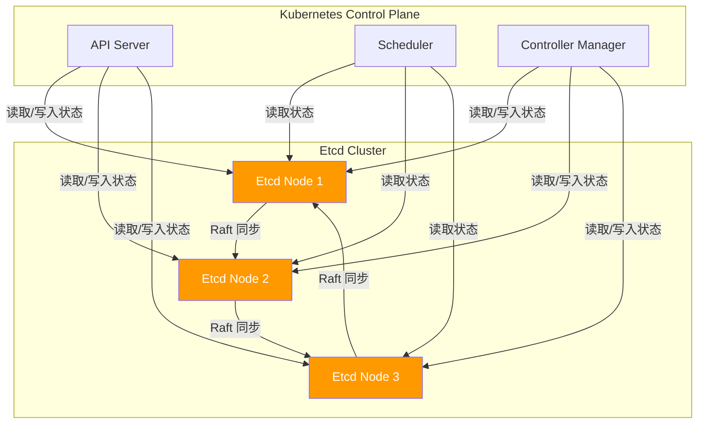
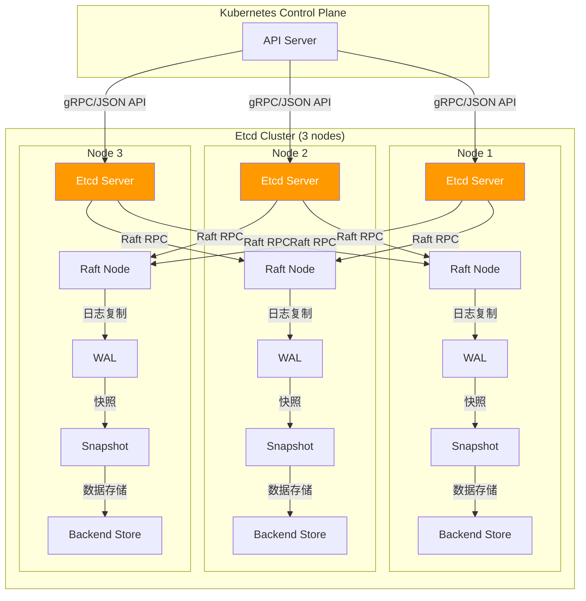
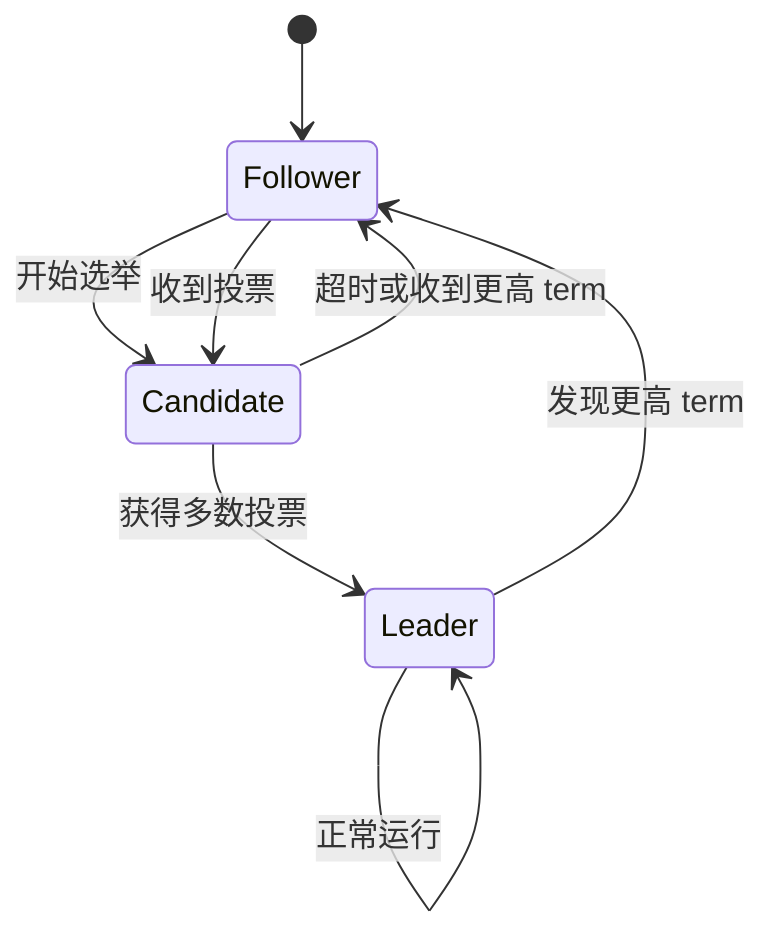
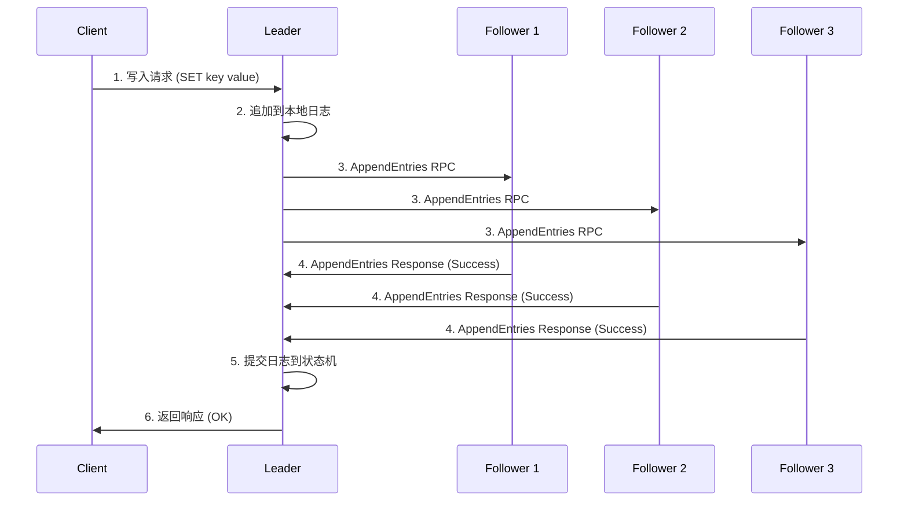

# Etcd 深度分析

> 本文档深入分析 Etcd，包括架构、Raft 协议、数据存储和一致性、监控告警、性能优化和故障排查。

---

## 目录

1. [Etcd 概述](#etcd-概述)
2. [Etcd 架构](#etcd-架构)
3. [Raft 协议详解](#raft-协议详解)
4. [数据存储和一致性](#数据存储和一致性)
5. [客户端 API](#客户端-api)
6. [安全和访问控制](#安全和访问控制)
7. [监控和告警](#监控和告警)
8. [性能优化](#性能优化)
9. [故障排查](#故障排查)
10. [最佳实践](#最佳实践)

---

## Etcd 概述

### Etcd 的作用

Etcd 是一个分布式的键值存储系统，用于 Kubernetes 的状态存储：



### Etcd 的核心特性

| 特性 | 说明 |
|------|------|
| **分布式**：支持多节点部署，提供高可用 |
| **强一致性**：基于 Raft 协议保证数据一致性 |
| **键值存储**：简单高效的键值存储 API |
| **事务支持**：支持多键原子操作 |
| **Watch 机制**：支持监听键值变化 |
| **TTL 支持**：支持键的过期时间 |
| **gRPC API**：支持 gRPC 和 JSON API |
| **安全认证**：支持 TLS 和基于证书的认证 |

### Etcd 在 Kubernetes 中的作用

Etcd 是 Kubernetes 的"大脑"，存储所有集群状态：

- **Pod 信息**：Pod 的状态、配置、绑定关系
- **Node 信息**：节点的状态、资源、标签
- **Service 信息**：Service 的配置、端点
- **ConfigMap 和 Secret**：配置和敏感数据
- **Deployment 和 StatefulSet**：期望状态
- **所有自定义资源 (CRD)**：自定义资源的实例

---

## Etcd 架构

### 整体架构



### 核心组件

#### 1. Etcd Server

**位置**：`go.etcd.io/etcd/serverv3/serve.go`

Etcd Server 是 Etcd 的核心组件，负责：
- 处理客户端请求
- Raft 协议实现
- 数据持久化
- Watch 机制

```go
// EtcdServer Etcd Server
type EtcdServer struct {
    // Raft Node
    raftNode *raft.Raft

    // Backend Store
    backend backend.Backend

    // Snapshotter
    snapshotter Snapshotter

    // WAL
    wal WAL

    // Cluster
    cluster *cluster.RaftCluster

    // Transport
    transport *transport.Transport
}
```

#### 2. Raft Node

**位置**：`go.etcd.io/etcd/raft/raft.go`

Raft Node 实现 Raft 共识协议：
- Leader 选举
- 日志复制
- 提交和状态机
- 成员变更

```go
// Raft Raft 节点
type Raft struct {
    // id 节点 ID
    id uint64

    // lead 主节点 ID
    lead uint64

    // term 术语
    term uint64

    // vote 投票
    vote uint64

    // readState 读状态
    readState ReadState

    // log 日志
    log *raftLog

    // stable 稳定日志索引
    stable uint64

    // applied 已应用索引
    applied uint64

    // state 状态
    state StateType

    // progress 进度
    progress map[uint64]Progress
}
```

#### 3. Backend Store

**位置**：`go.etcd.io/etcd/backend/backend.go`

Backend Store 负责数据持久化：
- BoltDB 实现
- MVCC 支持
- 事务支持
- 索引和查询

```go
// Backend 后端存储
type Backend struct {
    // BoltDB 数据库
    db *bolt.DB

    // batchTx 批量事务
    batchTx *batchTx

    // readTx 读事务
    readTx *readTx

    // tx 事务
    tx concurrentReadTx
}
```

#### 4. Snapshotter

**位置**：`go.etcd.io/etcd/snapshot/snapshotter.go`

Snapshotter 负责快照管理：
- 创建快照
- 加载快照
- 恢复数据

```go
// Snapshotter 快照管理器
type Snapshotter interface {
    // Save 保存快照
    Save(r Snapshot, conf *raftproto.SnapshotMetadata) error

    // Load 加载快照
    Load() (*Snapshot, error)

    // Prune 清理快照
    Prune() error
}
```

---

## Raft 协议详解

### Raft 概述

Raft 是一个分布式一致性算法，提供：

- **Leader 选举**：在节点中选举 Leader
- **日志复制**：Leader 将日志复制到 Follower
- **安全性**：保证数据一致性和安全性
- **效率**：与 Paxos 相比效率更高

### Raft 状态



### 选举流程

**位置**：`go.etcd.io/etcd/raft/raft.go`

```go
// campaign 发起选举
func (r *Raft) campaign(t CampaignType) error {
    // 1. 增加 term
    r.term++

    // 2. 投票给自己
    r.votes[r.id] = true

    // 3. 发送 RequestVote RPC
    for _, id := range r.remotes {
        if id == r.id {
            continue
        }
        r.send(id, pb.Message{
            Type: pb.MsgReqVote,
            Term: r.term,
            From: r.id,
            To:   id,
            LastLogTerm: r.lastLogTerm,
            LastLogIndex: r.lastLogIndex,
        })
    }

    return nil
}

// handleRequestVote 处理投票请求
func (r *Raft) handleRequestVote(m pb.Message) {
    // 1. 检查 term
    if m.Term < r.term {
        // 返回旧 term
        r.send(m.From, pb.Message{
            Type: pb.MsgReqVoteResp,
            Term: r.term,
            From: r.id,
            To:   m.From,
            Reject: true,
        })
        return
    }

    // 2. 检查日志
    if m.LastLogTerm < r.lastLogTerm || 
       (m.LastLogTerm == r.lastLogTerm && m.LastLogIndex < r.lastLogIndex) {
        // 日志更旧，拒绝
        r.send(m.From, pb.Message{
            Type: pb.MsgReqVoteResp,
            Term: r.term,
            From: r.id,
            To:   m.From,
            Reject: true,
        })
        return
    }

    // 3. 投票
    r.votes[m.From] = true

    // 4. 检查是否获得多数
    if r.countVotes(r.votes) > len(r.peers)/2 {
        // 成为 Leader
        r.becomeLeader()
    }

    return nil
}
```

### 日志复制流程



### 日志复制实现

**位置**：`go.etcd.io/etcd/raft/raft.go`

```go
// replicate 复制日志
func (r *Raft) replicate() {
    // 1. 获取待复制日志
    ents := r.raftLog.entries[r.applied+1:]

    // 2. 发送到所有 Follower
    for _, id := range r.peers {
        if id == r.id {
            continue
        }

        r.send(id, pb.Message{
            Type:   pb.MsgApp,
            Term:   r.term,
            From:   r.id,
            To:     id,
            Index:  r.raftLog.lastIndex(),
            LogTerm: r.raftLog.lastTerm(),
            Entries: ents,
            Commit:  r.raftLog.committed,
        })
    }
}

// handleAppendEntries 处理 AppendEntries
func (r *Raft) handleAppendEntries(m pb.Message) {
    // 1. 检查 term
    if m.Term < r.term {
        // 返回失败
        r.send(m.From, pb.Message{
            Type:   pb.MsgAppResp,
            Term:   r.term,
            From:   r.id,
            To:     m.From,
            Index:  m.Index,
            Reject: true,
        })
        return
    }

    // 2. 检查日志一致性
    if m.Index < r.raftLog.committed {
        // 已提交的日志，跳过
        r.send(m.From, pb.Message{
            Type:   pb.MsgAppResp,
            Term:   r.term,
            From:   r.id,
            To:     m.From,
            Index:  m.Index,
            Reject: false,
        })
        return
    }

    // 3. 追加日志
    if m.Index >= r.raftLog.lastIndex() {
        // 新日志，追加
        r.raftLog.append(m.Entries...)
    }

    // 4. 提交已应用的日志
    if m.Commit > r.raftLog.committed {
        r.raftLog.commitTo(m.Commit)
    }

    // 5. 返回成功
    r.send(m.From, pb.Message{
        Type:   pb.MsgAppResp,
        Term:   r.term,
        From:   r.id,
        To:     m.From,
        Index:  m.Index,
        Reject: false,
    })
}
```

---

## 数据存储和一致性

### MVCC 机制

Etcd 使用 MVCC（多版本并发控制）支持并发读写：

```go
// KV 键值对
type KV struct {
    Key         []byte
    Value       []byte
    CreateRev  int64
    ModRev     int64
    Version     int64
    Lease      int64
}

// revision 修订号
type revision int64
```

### 事务支持

```go
// Tx 事务
type Tx struct {
    backend backend.Backend
    beginRev int64
}

// Txn 事务
type Txn struct {
    backend backend.Backend
    beginRev int64
    mutations []mutation
}

// Commit 提交事务
func (t *Txn) Commit() (*TxnResponse, error) {
    // 1. 执行事务
    tx := t.backend.BatchTx()
    tx.Lock()
    defer tx.Unlock()

    // 2. 应用所有变更
    for _, m := range t.mutations {
        if m.isDelete {
            tx.Delete(m.kv)
        } else {
            tx.Put(m.kv, m.val)
        }
    }

    // 3. 提交
    err := tx.Commit()

    return &TxnResponse{
        Header: txnHeader{
            Revision: tx.Rev(),
        },
    }, err
}
```

### 数据一致性保证

```go
// consistencyLevel 一致性级别
type consistencyLevel int

const (
    // ConsistencyNone 无一致性要求
    consistencyNone consistencyLevel = iota
    // ConsistencyReadLinearizable 可线性化读取
    consistencyReadLinearizable
    // ConsistencyReadSerializable 可序列化读取
    consistencyReadSerializable
)

// applyConsistency 应用一致性
func (a *applierV3) applyConsistency(op *clientv3.RangeRequest, currentRev revision) {
    switch op.Consistency {
    case consistencyNone:
        // 无一致性要求
        return
    case consistencyReadLinearizable:
        // 线性化读取
        if currentRev >= op.Revision {
            return
        }
    case consistencyReadSerializable:
        // 可序列化读取
        // 实现略
    }
}
```

---

## 客户端 API

### gRPC API

**位置**：`go.etcd.io/etcd/api/v3rpc/rpctypes.go`

```go
// KV KV 服务
type KVServer struct {
    client *clientv3.Client
}

// Range 范围查询
func (kv *KVServer) Range(ctx context.Context, r *RangeRequest) (*RangeResponse, error) {
    // 1. 构建查询请求
    req := &clientv3.RangeRequest{
        Key:      r.key,
        RangeEnd: r.rangeEnd,
        Limit:    r.limit,
        Revision: r.revision,
        Sort:     r.sortOrder,
    }

    // 2. 执行查询
    resp, err := kv.client.Range(ctx, req)
    if err != nil {
        return nil, err
    }

    return &RangeResponse{
        Header:  resp.Header,
        Kvs:     resp.Kvs,
        Count:   resp.Count,
        More:    resp.More,
    }, nil
}

// Put 设置键值
func (kv *KVServer) Put(ctx context.Context, r *PutRequest) (*PutResponse, error) {
    // 1. 构建设置请求
    req := &clientv3.PutRequest{
        Key:   r.key,
        Value: r.value,
        Lease: r.leaseID,
        PrevKV: r.prevKV,
    }

    // 2. 执行设置
    resp, err := kv.client.Put(ctx, req)
    if err != nil {
        return nil, err
    }

    return &PutResponse{
        Header: resp.Header,
        PrevKV: resp.PrevKV,
    }, nil
}
```

### Watch 机制

```go
// Watcher 监听器
type Watcher struct {
    client *clientv3.Client
    ctx     context.Context
}

// Watch 监听键值变化
func (w *Watcher) Watch(key string, opts ...clientv3.OpOption) clientv3.WatchChan {
    // 1. 构建监听选项
    op := clientv3.OpGet(key)
    for _, opt := range opts {
        op = opt(op)
    }

    // 2. 创建 Watch 通道
    return w.client.Watch(w.ctx, op)
}
```

### Lease 机制

```go
// Lease 租约
type Lease struct {
    ID      string
    TTL     int64
    Keys    []string
}

// Grant 授予租约
func (l *Lease) Grant(ctx context.Context, ttl int64) (*LeaseGrantResponse, error) {
    // 1. 构建授予请求
    req := &clientv3.LeaseGrantRequest{
        TTL: ttl,
        ID:  l.ID,
    }

    // 2. 执行授予
    resp, err := l.client.Lease.Grant(ctx, req)
    if err != nil {
        return nil, err
    }

    return &LeaseGrantResponse{
        ID:  resp.ID,
        TTL: resp.TTL,
    }, nil
}
```

---

## 安全和访问控制

### TLS 认证

```yaml
# /etc/etcd/etcd.conf.yml
auth:
  # 启用客户端证书认证
  client-cert-auth: true

  # 启用 TLS
  client-cert-transport-security:
    cert-file: /etc/etcd/ssl/etcd.pem
    key-file: /etc/etcd/ssl/etcd-key.pem
    client-ca-file: /etc/etcd/ssl/etcd-ca.pem
    auto-tls: false

  # 启用双向 TLS
  peer-client-cert-auth: true
  peer-cert-file: /etc/etcd/ssl/etcd.pem
  peer-key-file: /etc/etcd/ssl/etcd-key.pem
  peer-client-ca-file: /etc/etcd/ssl/etcd-ca.pem
```

### RBAC 集成

```go
// AuthServer 认证服务器
type AuthServer struct {
    store backend.AuthStore
}

// Authenticate 认证
func (a *AuthServer) Authenticate(ctx context.Context, username, password string) (*auth.AuthenticateResponse, error) {
    // 1. 查找用户
    user, err := a.store.GetUser(ctx, username)
    if err != nil {
        return nil, err
    }

    // 2. 验证密码
    if !user.Authenticate(password) {
        return nil, auth.ErrAuthFailed
    }

    // 3. 生成 Token
    token, err := a.store.GenerateToken(ctx, username)
    if err != nil {
        return nil, err
    }

    return &auth.AuthenticateResponse{
        Token: token,
    }, nil
}
```

---

## 监控和告警

### Prometheus 指标

```yaml
# Prometheus 配置
scrape_configs:
- job_name: 'etcd'
  static_configs:
  - targets:
    - 'etcd1:2379'
    - 'etcd2:2379'
    - 'etcd3:2379'
  metrics_path: '/metrics'
  relabel_configs:
  - source_labels: [__address__]
    target_label: __param_target
    regex: '(.*):2379;(.*)'
    replacement: '${2}'
```

### 关键指标

```go
// Metrics 指标
type Metrics struct {
    // Raft 状态
    RaftAppliedIndex    prometheus.Gauge
    RaftCommittedIndex   prometheus.Gauge
    RaftCurrentTerm      prometheus.Gauge
    RaftLogSize         prometheus.Gauge

    // 客户端请求
    ClientRequestsTotal  prometheus.Counter
    ClientRequestsFailed prometheus.Counter
    ClientRequestsLatency prometheus.Histogram

    // 磁盘 I/O
    DiskWALFsyncDuration  prometheus.Histogram
    DiskBackendFsyncDuration prometheus.Histogram

    // 内存使用
    MemoryUsageBytes prometheus.Gauge
    MemoryAllocBytes prometheus.Gauge
}
```

---

## 性能优化

### 配置优化

```yaml
# /etc/etcd/etcd.conf.yml
# 性能优化
snapshot-count: 10000  # 快照数量
heartbeat-interval: 100  # 心跳间隔
election-timeout: 1000  # 选举超时
max-wals: 5  # 最大 WAL 文件数
max-snapshots: 5  # 最大快照数
quota-backend-bytes: 2147483648  # 后端配额（2GB）
```

### BoltDB 优化

```go
// Backend 后端优化
func (b *Backend) batchTx() *batchTx {
    // 1. 增加 BatchLimit
    tx := b.db.Begin(true)

    // 2. 设置 BatchLimit
    tx.MaxBatchSize = 1000

    // 3. 设置 Sync
    tx.NoSync = true

    return &batchTx{
        tx:    tx,
        batch: make([]batchOp, 0, 1000),
    }
}
```

---

## 故障排查

### 问题 1：集群脑裂

**症状**：多个 Leader，数据不一致

**排查步骤**：

```bash
# 1. 检查节点状态
etcdctl endpoint status --endpoints=infra1,infra2,infra3 --write-out=table

# 2. 检查 Raft 状态
etcdctl endpoint status --endpoints=infra1,infra2,infra3 -w json

# 3. 检查网络连接
etcdctl member list --write-out=table
```

**解决方案**：

```bash
# 1. 停止非 Leader 节点
etcdctl member remove <node-id>

# 2. 重新启动集群
etcdctl member add <node-name> --peer-urls=<peer-urls>
```

### 问题 2：WAL 增长过快

**症状**：WAL 文件过大，影响性能

**排查步骤**：

```bash
# 1. 检查 WAL 文件大小
ls -lh /var/lib/etcd/member/snap/*.wal

# 2. 检查 WAL 统计
etcdctl endpoint status --endpoints=infra1,infra2,infra3 -w json | grep wal
```

**解决方案**：

```bash
# 1. 调整 max-wals
etcdctl --endpoints=infra1,infra2,infra3 put max-wals 5

# 2. 调整 snapshot-count
etcdctl --endpoints=infra1,infra2,infra3 put snapshot-count 10000
```

---

## 最佳实践

### 1. 多节点部署

```yaml
# 3 节点集群
name: infra1
initial-advertise-peer-urls: http://infra1:2380,http://infra2:2380,http://infra3:2380
listen-peer-urls: http://infra1:2380
listen-client-urls: http://infra1:2379
advertise-client-urls: http://infra1:2379
initial-cluster: infra1=http://infra1:2380,infra2=http://infra2:2380,infra3=http://infra3:2380
initial-cluster-state: new
```

### 2. 启用 TLS

```yaml
# 双向 TLS
peer-client-cert-auth: true
peer-client-cert-file: /etc/etcd/ssl/peer.pem
peer-client-key-file: /etc/etcd/ssl/peer-key.pem
peer-trusted-ca-file: /etc/etcd/ssl/ca.pem
client-cert-auth: true
client-cert-file: /etc/etcd/ssl/etcd.pem
client-key-file: /etc/etcd/ssl/etcd-key.pem
client-trusted-ca-file: /etc/etcd/ssl/ca.pem
```

### 3. 定期备份

```bash
# 每天备份
etcdctl snapshot save /backup/etcd-$(date +%Y%m%d).db

# 自动化备份
0 0 * * * /bin/bash -c "etcdctl snapshot save /backup/etcd-$(date +\\%Y\\%m\\%d).db"
```

### 4. 监控和告警

```yaml
# Prometheus 监控
alerting:
  alerts:
  - name: EtcdDown
    expr: up{job="etcd"} == 0
    for: 10m
    annotations:
      summary: "Etcd instance down"
```

### 5. 调整性能参数

```yaml
# 性能优化
heartbeat-interval: 100
election-timeout: 1000
max-wals: 5
max-snapshots: 5
snapshot-count: 10000
```

---

## 总结

### 关键要点

1. **分布式一致性**：基于 Raft 协议保证强一致性
2. **高可用**：支持多节点部署，自动故障转移
3. **高性能**：BoltDB 后端，支持 MVCC 和事务
4. **安全性**：支持 TLS 和 RBAC
5. **可观测性**：丰富的指标和监控
6. **易用性**：简单的键值存储 API

### 源码位置

| 组件 | 位置 |
|------|------|
| Etcd Server | `go.etcd.io/etcd/serverv3/` |
| Raft | `go.etcd.io/etcd/raft/` |
| Backend | `go.etcd.io/etcd/backend/` |
| API | `go.etcd.io/etcd/api/v3rpc/` |
| Auth | `go.etcd.io/etcd/auth/` |

### 相关资源

- [Etcd 官方文档](https://etcd.io/docs/latest/)
- [Etcd GitHub](https://github.com/etcd-io/etcd)
- [Kubernetes Etcd 集成](https://kubernetes.io/docs/tasks/administer-cluster/configure-upgrade-etcd/)
- [Raft 论文](https://raft.github.io/raft.pdf)

---

::: tip 最佳实践
1. 部署 3 或 5 节点集群
2. 启用 TLS 双向认证
3. 定期备份和恢复测试
4. 配置监控和告警
5. 调整性能参数（snapshot-count、max-wals）
:::

::: warning 注意事项
- Etcd 磁盘 I/O 性能要求高
- WAL 增长过快会影响性能
- 避免频繁的快照操作
- 集群节点建议使用奇数
:::
