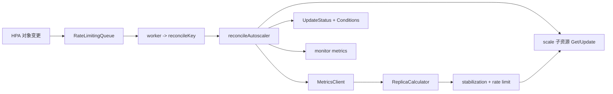

# Kubernetes HPA 扩缩容机制深度解析

## 概述
HPA (Horizontal Pod Autoscaler) 通过周期性 reconcile 计算目标副本数，并更新被缩放对象的 `scale` 子资源。其核心流程位于 `pkg/controller/podautoscaler/horizontal.go`，副本数计算在 `pkg/controller/podautoscaler/replica_calculator.go`，指标获取由 `pkg/controller/podautoscaler/metrics/` 统一抽象，监控埋点在 `pkg/controller/podautoscaler/monitor/`。

本节聚焦：
- reconcile 主循环与控制器状态管理。
- CPU/内存/自定义/外部指标的完整采集与使用路径。
- 关键副本数算法与缩放决策。
- 冷却与稳定窗口（stabilization）和速率限制机制。

## 架构
### 核心组件与接口
- `HorizontalController`：HPA 控制器，负责驱动 reconcile、更新 scale 与状态。
- `ReplicaCalculator`：副本数计算器，封装资源与指标计算逻辑。
- `MetricsClient`：指标客户端接口，统一访问资源指标、custom metrics、external metrics。
- `Monitor`：监控埋点接口，记录 reconcile 与指标计算结果。

关键接口摘要（`pkg/controller/podautoscaler/metrics/interfaces.go`）：
```go
type MetricsClient interface {
  GetResourceMetric(ctx context.Context, resource v1.ResourceName, namespace string, selector labels.Selector, container string) (PodMetricsInfo, time.Time, error)
  GetRawMetric(metricName string, namespace string, selector labels.Selector, metricSelector labels.Selector) (PodMetricsInfo, time.Time, error)
  GetObjectMetric(metricName string, namespace string, objectRef *autoscaling.CrossVersionObjectReference, metricSelector labels.Selector) (int64, time.Time, error)
  GetExternalMetric(metricName string, namespace string, selector labels.Selector) ([]int64, time.Time, error)
}
```

关键数据结构（`pkg/controller/podautoscaler/horizontal.go`）：
```go
type timestampedRecommendation struct {
  recommendation int32
  timestamp      time.Time
}

type timestampedScaleEvent struct {
  replicaChange int32
  timestamp     time.Time
  outdated      bool
}
```

### 组件关系图


## 代码流程
### 1) reconcile 循环如何工作
入口逻辑（`pkg/controller/podautoscaler/horizontal.go`）：
1. `Run` 启动 worker，等待 informer cache 同步。
2. `enqueueHPA` 将 HPA key 放入队列，带 resync 周期；同时注册 selector。
3. `processNextWorkItem` 取 key -> `reconcileKey`。
4. `reconcileKey` 获取 HPA；被删除则清理缓存（recommendations/scaleEvents）。
5. `reconcileAutoscaler` 执行核心逻辑：
   - 解析目标 `ScaleTargetRef` -> `scale` 子资源。
   - 获取当前副本 `currentReplicas`。
   - 通过 `computeReplicasForMetrics` 计算指标提议副本。
   - 进入 `normalizeDesiredReplicas`/`normalizeDesiredReplicasWithBehaviors` 做稳定化和限速。
   - 若需要缩放，更新 `scale.Spec.Replicas` 并记录 `scaleEvents`。
   - 设置状态与条件，更新 HPA status。

缩放更新片段（`pkg/controller/podautoscaler/horizontal.go`）：
```go
scale.Spec.Replicas = desiredReplicas
_, updateErr := a.scaleNamespacer.Scales(hpa.Namespace).Update(ctx, targetGR, scale, metav1.UpdateOptions{})
```

### 2) 指标收集流程（CPU/内存/自定义/外部）
指标分两层：
- `metrics/`：统一的 API 客户端封装，负责从 metrics-server/custom-metrics/external-metrics API 拉取。
- `replica_calculator.go`：拿到指标后进行聚合、过滤、容错处理，再计算副本。

流程概览：
1. `computeReplicasForMetric` 根据 `MetricSpec.Type` 分流：
   - `ResourceMetricSourceType` -> `GetResourceMetric`（CPU/内存）
   - `PodsMetricSourceType` -> `GetRawMetric`
   - `ObjectMetricSourceType` -> `GetObjectMetric`
   - `ExternalMetricSourceType` -> `GetExternalMetric`
2. `metrics/client.go` 实际调用：
   - 资源指标：`resourceMetricsClient.GetResourceMetric`（metrics-server）
   - 自定义指标：`customMetricsClient.GetRawMetric` / `GetObjectMetric`（custom metrics API）
   - 外部指标：`externalMetricsClient.GetExternalMetric`（external metrics API）
3. `ReplicaCalculator` 对指标进行 pod 级过滤和计算（`groupPods`, `calculateRequests` 等）。

资源指标采集片段（`pkg/controller/podautoscaler/metrics/client.go`）：
```go
metrics, err := c.client.PodMetricses(namespace).List(ctx, metav1.ListOptions{LabelSelector: selector.String()})
```

### 3) 副本数计算算法与公式
核心思想：按“平均使用量/目标值”的比例，推导副本数。

#### 3.1 资源指标（CPU/内存）
`ReplicaCalculator.GetResourceReplicas`：
- 计算 `usageRatio = currentUtilization / targetUtilization`
- 如果在 `tolerance` 内，保持副本不变。
- 否则 `desired = ceil(usageRatio * readyPods)`。
- 对 missing/unready pod 做容错：
  - scale down 时 missing pod 视作 100%（或 targetUtilization）。
  - scale up 时 missing/unready pod 视作 0%。

公式实现（`pkg/controller/podautoscaler/metrics/utilization.go`）：
```go
currentUtilization = int32((metricsTotal * 100) / requestsTotal)
utilizationRatio = float64(currentUtilization) / float64(targetUtilization)
```

#### 3.2 Pod 自定义指标
`calcPlainMetricReplicas`：
```
usageRatio = currentUsage / targetUsage
desired = ceil(usageRatio * readyPods)
```
并同样对 missing/unready pods 做补偿。

#### 3.3 Object/External 指标
- Object（整体目标）：`usageRatio = usage / targetUsage`，再按 readyPodCount 推导副本。
- External：
  - `Value` 模式：对外部指标求和后按 `targetUsage` 求 ratio。
  - `AverageValue` 模式：按每 pod 平均目标值计算。

### 4) 扩容与缩容的决策逻辑
主入口在 `reconcileAutoscaler`：
1. 若 `currentReplicas == 0` 且 `minReplicas != 0`，禁用缩放。
2. 若 `currentReplicas` 超出 `min/max`，直接纠偏。
3. 否则按指标计算 `metricDesiredReplicas`。
4. 若 `behavior` 未配置：
   - 走 `normalizeDesiredReplicas`，包含默认 scale up limit 与 downscale stabilization。
5. 若配置了 `behavior`：
   - 走 `normalizeDesiredReplicasWithBehaviors`，包含 stabilization + rate limit。

默认 scale up 限制（`pkg/controller/podautoscaler/horizontal.go`）：
```go
scaleUpLimit := int32(math.Max(2.0*float64(currentReplicas), 4.0))
```

### 5) 冷却时间与稳定窗口如何实现
HPA 有两类“冷却/稳定”机制：

1) **默认 downscale stabilization**  
`stabilizeRecommendation` 会在 `downscaleStabilisationWindow` 内取“最高推荐值”，防止过快缩容。

2) **behavior-driven stabilization & rate limit**  
`normalizeDesiredReplicasWithBehaviors`：
- `stabilizeRecommendationWithBehaviors`：
  - ScaleUp: 取窗口内 **最低** 推荐值。
  - ScaleDown: 取窗口内 **最高** 推荐值。
- `convertDesiredReplicasWithBehaviorRate`：
  - 结合 `HPAScalingRules` 的 `Policies` 与 `SelectPolicy`，依据历史 `scaleUpEvents/scaleDownEvents` 做速率限制。
  - `getReplicasChangePerPeriod` 统计周期内变更量。

稳定化逻辑片段：
```go
if rec.timestamp.After(upCutoff) {
  upRecommendation = min(rec.recommendation, upRecommendation)
}
if rec.timestamp.After(downCutoff) {
  downRecommendation = max(rec.recommendation, downRecommendation)
}
```

## 关键算法要点
- **容忍区间**：`Tolerances` 支持 scale up/down 不同阈值，避免小抖动。
- **缺失指标处理**：missing/unready pods 在不同方向下采用不同假设，避免过度缩放。
- **限速与稳定化分离**：先 stabilization，再应用速率限制。
- **事件驱动限速**：`timestampedScaleEvent` 记录历史缩放，用于 `HPAScalingRules` 计算。

## 示例
### 示例 1：CPU 平均利用率 60%，目标 50%
假设：
- `readyPods = 10`
- `currentUtilization = 60%`
- `targetUtilization = 50%`
计算：
```
usageRatio = 60 / 50 = 1.2
desired = ceil(1.2 * 10) = 12
```
随后进入 stabilization + rate limit 进行修正。

### 示例 2：External AverageValue 指标
假设：
- `statusReplicas = 5`
- `external metric sum = 1000`
- `targetAverageValue = 150`
计算：
```
usageRatio = 1000 / (150 * 5) = 1.333
desired = ceil(1000 / 150) = 7
```

## 参考实现文件
- `pkg/controller/podautoscaler/horizontal.go`
- `pkg/controller/podautoscaler/replica_calculator.go`
- `pkg/controller/podautoscaler/metrics/client.go`
- `pkg/controller/podautoscaler/metrics/utilization.go`
- `pkg/controller/podautoscaler/monitor/monitor.go`
- `pkg/controller/podautoscaler/monitor/metrics.go`
