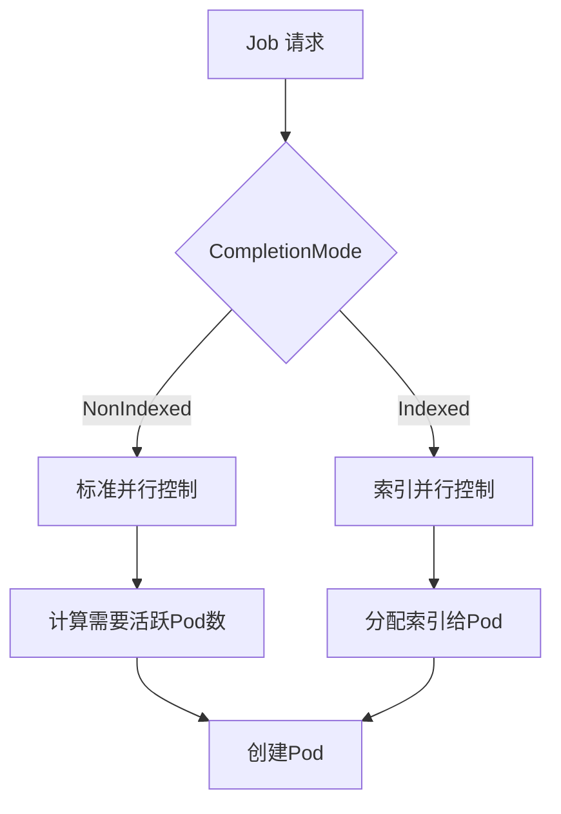
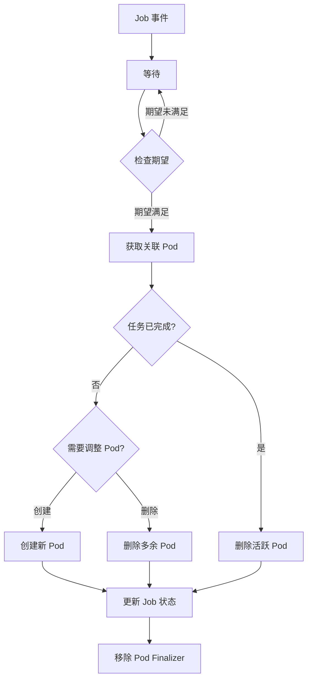

# Kubernetes Job Controller 源码深度分析

## 1. 概述

Job Controller 是 Kubernetes 中用于管理批处理任务的核心控制器。

### 主要职责

- **Pod 创建与管理**：根据 Job 的并行性和完成数配置创建和管理 Pod
- **任务执行跟踪**：监控 Pod 的执行状态，跟踪成功和失败的 Pod 数量
- **重试策略执行**：实现基于退避策略的重试机制
- **并行任务协调**：支持索引任务（Indexed Job）
- **任务生命周期管理**：包括任务启动、执行、暂停、完成和失败

## 2. 目录结构

```
pkg/controller/job/
├── job_controller.go      # 主控制器实现
├── backoff_utils.go      # 退避算法实现
├── indexed_job_utils.go  # 索引任务相关工具函数
├── pod_failure_policy.go # Pod 失败策略处理
├── success_policy.go     # 任务成功策略处理
├── tracking_utils.go      # Pod 跟踪和 finalizer 管理
└── util/utils.go         # 通用工具函数
```

## 3. 核心机制

### 3.1 Pod 创建机制

```go
// 计算需要的活跃 Pod 数量
func (jm *Controller) calculateWantActive(job *batch.Job, jobCtx *syncJobCtx) int32 {
    if job.Spec.Completions == nil {
        // 任意一个 Pod 成功后不再创建新 Pod
        if jobCtx.succeeded > 0 {
            return jobCtx.active
        }
        return *job.Spec.Parallelism
    } else {
        // 限制不超过剩余完成数
        wantActive := *job.Spec.Completions - jobCtx.succeeded
        if wantActive > *job.Spec.Parallelism {
            wantActive = *job.Spec.Parallelism
        }
        return wantActive
    }
}
```

### 3.2 完成跟踪机制

Job 使用 Finalizer 机制确保 Pod 计数的准确性：

```go
// 使用 batch.JobTrackingFinalizer 标记 Pod
// uncountedTerminatedPods 结构跟踪未计数的 Pod
```

### 3.3 重试策略

Job Controller 实现了两种重试策略：

#### 全局退避策略
```go
type backoffRecord struct {
    key                      string
    failuresAfterLastSuccess int32
    lastFailureTime          *time.Time
}
```

#### 索引级退避策略
```go
// 为每个索引独立维护退避状态
addIndexFailureCountAnnotation(template, job, lastFailedPod)
```

### 3.4 并行控制



## 4. 核心数据结构

```go
type Controller struct {
    kubeClient clientset.Interface
    podControl controller.PodControlInterface
    expectations controller.ControllerExpectationsInterface
    jobLister batchv1listers.JobLister
    podStore corelisters.PodLister
    queue workqueue.TypedRateLimitingInterface[string]
    clock clock.WithTicker
    podBackoffStore *backoffStore
}
```

## 5. 工作流程



## 6. 最佳实践

### 6.1 Job 设计

```yaml
# 并行执行 5 个任务，总共需要 10 个成功
spec:
  parallelism: 5
  completions: 10
  backoffLimit: 6
  activeDeadlineSeconds: 3600
```

### 6.2 索引任务

```yaml
# 启用索引模式
spec:
  completionMode: Indexed
  parallelism: 10
  completions: 100
  template:
    metadata:
      labels:
        batch.kubernetes.io/job-completion-index: "${index}"
```

### 6.3 Pod 失败策略

```yaml
# 忽略特定容器的失败
spec:
  podFailurePolicy:
    rules:
    - action: Ignore
      onExitCodes:
        containerName: worker
        operator: In
        values: [143, 137]
```

## 7. 总结

Kubernetes Job Controller 通过精巧的设计实现了批处理任务的可靠执行，其核心特点包括健壮的状态管理、灵活的重试机制、高效的并行执行和完善的错误处理。
