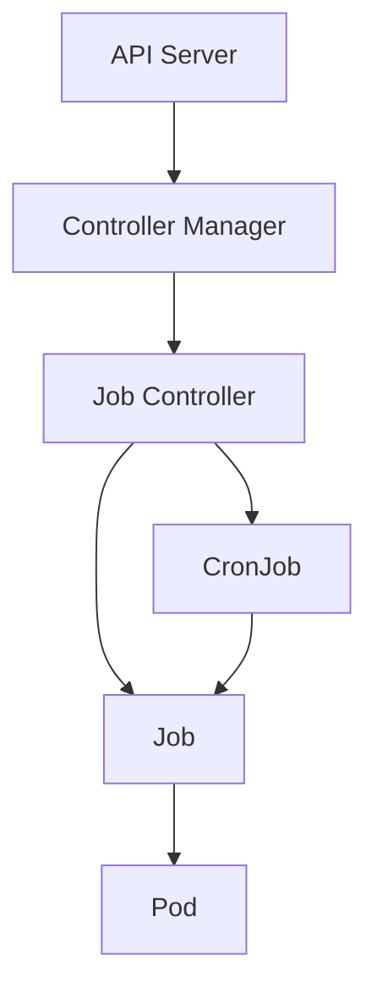
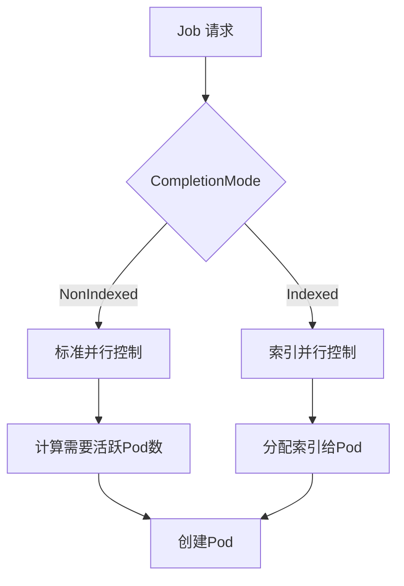
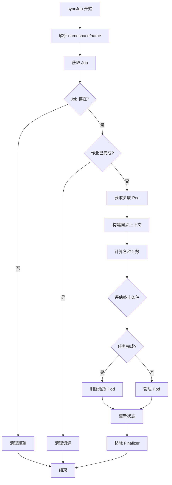

# Kubernetes Job Controller 源码深度分析

## 1. 概述

Job Controller 是 Kubernetes 中用于管理批处理任务的核心控制器。

### 主要职责

- **Pod 创建与管理**：根据 Job 的并行性和完成数配置创建和管理 Pod
- **任务执行跟踪**：监控 Pod 的执行状态，跟踪成功和失败的 Pod 数量
- **重试策略执行**：实现基于退避策略的重试机制
- **并行任务协调**：支持索引任务（Indexed Job）
- **任务生命周期管理**：包括任务启动、执行、暂停、完成和失败

### 在 Kubernetes 架构中的位置



## 2. 目录结构

```
pkg/controller/job/
├── job_controller.go      # 主控制器实现
├── backoff_utils.go      # 退避算法实现
├── indexed_job_utils.go  # 索引任务相关工具函数
├── pod_failure_policy.go # Pod 失败策略处理
├── success_policy.go     # 任务成功策略处理
├── tracking_utils.go      # Pod 跟踪和 finalizer 管理
└── util/utils.go         # 通用工具函数
```

## 3. 核心机制

### 3.1 Pod 创建机制

```go
// 计算需要的活跃 Pod 数量
func (jm *Controller) calculateWantActive(job *batch.Job, jobCtx *syncJobCtx) int32 {
    if job.Spec.Completions == nil {
        // 任意一个 Pod 成功后不再创建新 Pod
        if jobCtx.succeeded > 0 {
            return jobCtx.active
        }
        return *job.Spec.Parallelism
    } else {
        // 限制不超过剩余完成数
        wantActive := *job.Spec.Completions - jobCtx.succeeded
        if wantActive > *job.Spec.Parallelism {
            wantActive = *job.Spec.Parallelism
        }
        return wantActive
    }
}
```

### 3.2 完成跟踪机制

Job 使用 Finalizer 机制确保 Pod 计数的准确性：

```go
// 使用 batch.JobTrackingFinalizer 标记 Pod
const JobTrackingFinalizer = "batch/job-tracking-finalizer"

// uncountedTerminatedPods 结构跟踪未计数的 Pod
type UncountedTerminatedPods struct {
    Succeeded []types.UID `json:"succeeded,omitempty"`
    Failed   []types.UID `json:"failed,omitempty"`
}
```

### 3.3 重试策略

Job Controller 实现了两种重试策略：

#### 全局退避策略

```go
type backoffRecord struct {
    key                      string
    failuresAfterLastSuccess int32
    lastFailureTime          *time.Time
}
```

#### 索引级退避策略

```go
// 为每个索引独立维护退避状态
addIndexFailureCountAnnotation(template, job, lastFailedPod)
```

### 3.4 并行控制



## 4. Pod 失败策略详细实现

### 4.1 失败策略匹配机制

```go
func matchPodFailurePolicy(podFailurePolicy *batch.PodFailurePolicy, failedPod *v1.Pod) (*string, bool, *batch.PodFailurePolicyAction) {
    if podFailurePolicy == nil {
        return nil, true, nil
    }

    ignore := batch.PodFailurePolicyActionIgnore
    failJob := batch.PodFailurePolicyActionFailJob
    failIndex := batch.PodFailurePolicyActionFailIndex
    count := batch.PodFailurePolicyActionCount

    // 遍历所有规则
    for index, podFailurePolicyRule := range podFailurePolicy.Rules {
        if podFailurePolicyRule.OnExitCodes != nil {
            // 检查退出码规则
            if containerStatus := matchOnExitCodes(&failedPod.Status, podFailurePolicyRule.OnExitCodes); containerStatus != nil {
                switch podFailurePolicyRule.Action {
                case batch.PodFailurePolicyActionIgnore:
                    return nil, false, &ignore
                case batch.PodFailurePolicyActionFailJob:
                    msg := fmt.Sprintf("Container %s for pod %s/%s failed with exit code %v",
                        containerStatus.Name, failedPod.Namespace, failedPod.Name,
                        containerStatus.State.Terminated.ExitCode)
                    return &msg, true, &failJob
                }
            }
        }
    }
    return nil, true, nil
}
```

### 4.2 退出码匹配实现

```go
func isOnExitCodesOperatorMatching(exitCode int32, requirement *batch.PodFailurePolicyOnExitCodesRequirement) bool {
    switch requirement.Operator {
    case batch.PodFailurePolicyOnExitCodesOpIn:
        for _, value := range requirement.Values {
            if value == exitCode {
                return true
            }
        }
        return false
    case batch.PodFailurePolicyOnExitCodesOpNotIn:
        for _, value := range requirement.Values {
            if value == exitCode {
                return false
            }
        }
        return true
    default:
        return false
    }
}
```

### 4.3 失败策略示例

```yaml
# 忽略特定容器的失败
spec:
  podFailurePolicy:
    rules:
    - action: Ignore
      onExitCodes:
        containerName: worker
        operator: In
        values: [143, 137]
```

## 5. 任务成功策略处理

### 5.1 SuccessPolicy 匹配机制

```go
func matchSuccessPolicy(logger klog.Logger, successPolicy *batch.SuccessPolicy, completions int32, succeededIndexes orderedIntervals) (string, bool) {
    if !feature.DefaultFeatureGate.Enabled(features.JobSuccessPolicy) || successPolicy == nil || len(succeededIndexes) == 0 {
        return "", false
    }

    for index, rule := range successPolicy.Rules {
        if rule.SucceededIndexes != nil {
            // 解析成功索引规则
            requiredIndexes := parseIndexesFromString(logger, *rule.SucceededIndexes, int(completions))
            // 检查是否满足索引匹配规则
            if matchSucceededIndexesRule(requiredIndexes, succeededIndexes, rule.SucceededCount) {
                return fmt.Sprintf("Matched rules at index %d", index), true
            }
        } else if rule.SucceededCount != nil && succeededIndexes.total() >= int(*rule.SucceededCount) {
            return fmt.Sprintf("Matched rules at index %d", index), true
        }
    }
    return "", false
}
```

## 6. 索引分配算法

### 6.1 索引计算和分配

```go
// 计算成功和失败的索引
func calculateSucceededIndexes(logger klog.Logger, job *batch.Job, pods []*v1.Pod) (orderedIntervals, orderedIntervals) {
    // 从状态中解析之前的成功索引
    prevIntervals := parseIndexesFromString(logger, job.Status.CompletedIndexes, int(*job.Spec.Completions))

    newSucceeded := sets.New[int]()
    for _, p := range pods {
        ix := getCompletionIndex(p.Annotations)
        if p.Status.Phase == v1.PodSucceeded && ix != unknownCompletionIndex &&
           ix < int(*job.Spec.Completions) && hasJobTrackingFinalizer(p) {
            newSucceeded.Insert(ix)
        }
    }

    // 合并新旧索引
    result := prevIntervals.withOrderedIndexes(sets.List(newSucceeded))
    return prevIntervals, result
}
```

### 6.2 区间合并算法

```go
func (oi orderedIntervals) merge(newOi orderedIntervals) orderedIntervals {
    var result orderedIntervals
    i := 0
    j := 0
    var lastInterval *interval

    for i < len(oi) && j < len(newOi) {
        if oi[i].First < newOi[j].First {
            appendOrMergeWithLastInterval(oi[i])
            i++
        } else {
            appendOrMergeWithLastInterval(newOi[j])
            j++
        }
    }

    return result
}
```

### 6.3 索引分配示例

```
 completions: 10
 parallelism: 3

 初始状态：succeeded = {}, failed = {}

 第一次分配：activePods = 3
   - Pod-0: index = 0
   - Pod-1: index = 1
   - Pod-2: index = 2

 Pod-0 完成：succeeded = {0}
 下次分配：index = 3

 Pod-1 失败：failed = {1}
 下次分配：index = 3
```

## 7. Finalizer 管理和 Pod 追踪

### 7.1 Finalizer 机制设计

```go
// 检查 Pod 是否有 JobTrackingFinalizer
func hasJobTrackingFinalizer(pod *v1.Pod) bool {
    for _, fin := range pod.Finalizers {
        if fin == batch.JobTrackingFinalizer {
            return true
        }
    }
    return false
}

// 添加 JobTrackingFinalizer
func appendJobCompletionFinalizerIfNotFound(finalizers []string) []string {
    for _, fin := range finalizers {
        if fin == batch.JobTrackingFinalizer {
            return finalizers
        }
    }
    return append(finalizers, batch.JobTrackingFinalizer)
}
```

### 7.2 Finalizer 移除条件

```go
func canRemoveFinalizer(logger klog.Logger, jobCtx *syncJobCtx, pod *v1.Pod, considerPodFailed bool) bool {
    // 作业终止或 Pod 成功，可以移除 Finalizer
    if jobCtx.job.DeletionTimestamp != nil || jobCtx.finishedCondition != nil || pod.Status.Phase == v1.PodSucceeded {
        return true
    }

    // 处理索引级退避延迟
    if hasBackoffLimitPerIndex(jobCtx.job) {
        if index := getCompletionIndex(pod.Annotations); index != unknownCompletionIndex {
            // 检查是否需要延迟删除
            if p, ok := jobCtx.podsWithDelayedDeletionPerIndex[index]; ok && p.UID == pod.UID {
                return false
            }
        }
    }

    return true
}
```

### 7.3 UID 跟踪期望管理

```go
// uidTrackingExpectations 跟踪 Pod UID 的最终删除期望
type uidTrackingExpectations struct {
    store cache.Store
}

// 期望删除 Finalizer
func (u *uidTrackingExpectations) expectFinalizersRemoved(logger klog.Logger, jobKey string, deletedKeys []types.UID) error {
    logger.V(4).Info("Expecting tracking finalizers removed", "key", jobKey, "podUIDs", deletedKeys)

    uids := u.getSet(jobKey)
    uids.Lock()
    uids.set.Insert(deletedKeys...)
    uids.Unlock()
    return nil
}
```

## 8. 与 CronJob 的交互

### 8.1 CronJob 创建 Job

```go
func (jm *ControllerV2) createJob(ctx context.Context, cronJob *batchv1.CronJob, schedule time.Time, hash string) (*batchv1.Job, error) {
    // 创建 Job 对象
    job := &batchv1.Job{
        ObjectMeta: metav1.ObjectMeta{
            Name:      fmt.Sprintf("%s-%d", cronJob.Name, hash),
            Namespace: cronJob.Namespace,
            Labels:    map[string]string{
                "cronjob-name": cronJob.Name,
            },
            OwnerReferences: []metav1.OwnerReference{
                *metav1.NewControllerRef(cronJob, controllerKind),
            },
        },
        Spec: *cronJob.Spec.JobTemplate.Spec.DeepCopy(),
    }

    // 设置 CronJob 特有的字段
    if job.Spec.Template.Spec.RestartPolicy == "" {
        job.Spec.Template.Spec.RestartPolicy = v1.RestartPolicyOnFailure
    }

    // 创建 Job
    createdJob, err := jm.jobControl.CreateJobs(ctx, job.Namespace, job)
    return createdJob, err
}
```

### 8.2 Job 状态同步

```go
func (jm *ControllerV2) syncCronJob(ctx context.Context, cronJobKey string) (*time.Duration, error) {
    // 获取 CronJob
    cronJob, err := jm.cronJobLister.CronJobs(ns).Get(name)

    // 获取相关的 Jobs
    selector, err := metav1.LabelSelectorAsSelector(cronJob.Spec.JobTemplate.Spec.Selector)
    jobs, err := jm.jobLister.Jobs(cronJob.Namespace).List(selector)

    // 处理每个 Job
    for _, job := range jobs {
        if util.IsJobFinished(job) {
            // 检查是否需要清理
            if shouldCleanupJob(cronJob, job) {
                err := jm.jobControl.DeleteJob(ctx, job.Namespace, job.Name)
            }
        }
    }

    // 创建新 Job（如果需要）
    if shouldCreateJob(cronJob) {
        job, err := jm.createJob(ctx, cronJob, nextSchedule, hash)
    }

    return &requeueAfter, nil
}
```

## 9. 核心数据结构

### 9.1 Controller 结构

```go
type Controller struct {
    kubeClient clientset.Interface
    podControl controller.PodControlInterface

    // 期望管理机制
    expectations controller.ControllerExpectationsInterface
    finalizerExpectations *uidTrackingExpectations

    // 存储
    jobLister batchv1listers.JobLister
    podStore corelisters.PodLister
    podIndexer cache.Indexer

    // 队列
    queue workqueue.TypedRateLimitingInterface[string]
    orphanQueue workqueue.TypedRateLimitingInterface[orphanPodKey]

    // 事件广播器
    broadcaster record.EventBroadcaster
    recorder record.EventRecorder

    // 时钟和退避
    clock clock.WithTicker
    podBackoffStore *backoffStore

    // 完成任务期望跟踪
    finishedJobExpectations sync.Map
    consistencyStore consistencyutil.ConsistencyStore
}
```

### 9.2 JobStatus 结构

```go
type JobStatus struct {
    // 活跃的 Pod 数量
    Active int32
    // 完成的 Pod 数量
    Succeeded int32
    // 失败的 Pod 数量
    Failed int32
    // 终止中的 Pod 数量（FeatureGate 控制）
    Terminating *int32
    // 观察到的代数
    ObservedGeneration int64

    // 完成的索引列表
    CompletedIndexes string

    // 未计数的终止 Pod
    UncountedTerminatedPods *UncountedTerminatedPods

    // 当前状态的条件列表
    Conditions []JobCondition
}
```

## 10. 工作流程

### 10.1 syncJob 完整流程



### 10.2 manageJob 逻辑

```go
func (jm *Controller) manageJob(ctx context.Context, job *batch.Job, jobCtx *syncJobCtx) (int32, string, error) {
    active := int32(len(jobCtx.activePods))
    parallelism := *job.Spec.Parallelism

    // 计算需要的活跃 Pod 数量
    wantActive := int32(0)
    if job.Spec.Completions == nil {
        // 非完成模式：任一 Pod 成功后不再创建新 Pod
        if jobCtx.succeeded > 0 {
            wantActive = active
        } else {
            wantActive = parallelism
        }
    } else {
        // 完成模式：不超过剩余完成数
        wantActive = *job.Spec.Completions - jobCtx.succeeded
        if wantActive > parallelism {
            wantActive = parallelism
        }
    }

    // 1. 删除多余的 Pod
    rmAtLeast := active - wantActive
    if rmAtLeast > 0 {
        podsToDelete := activePodsForRemoval(job, jobCtx.activePods, int(rmAtLeast))
        jm.expectations.ExpectDeletions(logger, jobKey, len(podsToDelete))
        removedReady, removed, err := jm.deleteJobPods(ctx, job, jobKey, podsToDelete)
        active -= removed
        return active, metrics.JobSyncActionPodsDeleted, err
    }

    // 2. 创建新的 Pod
    diff := wantActive - active
    if diff > 0 {
        // 检查全局退避
        remainingTime := jobCtx.newBackoffRecord.getRemainingTime(jm.clock, DefaultJobPodFailureBackOff, MaxJobPodFailureBackOff)
        if remainingTime > 0 {
            jm.enqueueSyncJobWithDelay(logger, job, remainingTime)
            return 0, metrics.JobSyncActionPodsCreated, nil
        }

        // 批量创建 Pod
        jm.expectations.ExpectCreations(logger, jobKey, int(diff))
        // ... 创建逻辑 ...

        return active + diff, metrics.JobSyncActionPodsCreated, errorFromChannel(errCh)
    }

    return active, metrics.JobSyncActionTracking, nil
}
```

## 11. 最佳实践

### 11.1 Job 设计

```yaml
# 并行执行 5 个任务，总共需要 10 个成功
spec:
  parallelism: 5
  completions: 10
  backoffLimit: 6
  activeDeadlineSeconds: 3600
```

### 11.2 索引任务

```yaml
# 启用索引模式
spec:
  completionMode: Indexed
  parallelism: 10
  completions: 100
  template:
    metadata:
      labels:
        batch.kubernetes.io/job-completion-index: "${index}"
```

### 11.3 Pod 失败策略

```yaml
# 忽略特定容器的失败
spec:
  podFailurePolicy:
    rules:
    - action: Ignore
      onExitCodes:
        containerName: worker
        operator: In
        values: [143, 137]
```

## 12. 监控指标

### 12.1 关键指标

| 指标名称 | 类型 | 描述 |
|---------|------|------|
| `job_sync_total` | Counter | 同步操作总数 |
| `job_sync_duration_seconds` | Histogram | 同步操作耗时 |
| `job_pod_finished_total` | Counter | 完成的 Pod 总数 |
| `job_pod_active` | Gauge | 当前活跃 Pod 数量 |

## 13. 总结

Kubernetes Job Controller 通过精巧的设计实现了批处理任务的可靠执行，其核心特点包括：

1. **灵活的失败处理**：Pod Failure Policy 提供了细粒度的失败控制
2. **索引任务支持**：通过 Indexed Completion 模式实现并行独立任务
3. **智能退避机制**：全局和索引级的退避策略
4. **Finalizer 跟踪**：确保状态计数的准确性
5. **与 CronJob 集成**：支持定时任务管理和历史清理

理解 Job Controller 的工作原理有助于更好地设计批处理任务，提高任务执行的可靠性。
