# Kubernetes CNI 插件机制深度分析

## 文档概览

- **文档名称**: Kubernetes CNI 插件机制深度分析
- **分析版本**: Kubernetes 1.25.0
- **文档状态**: ✅ 完成版
- **创建日期**: 2026-02-23

---

## 一、CNI 核心概念

### 1.1 什么是 CNI

**CNI (Container Network Interface)** 是一个用于配置 Linux 容器网络接口的规范和库。

**核心作用:**
- 配置容器的网络接口
- 为容器分配 IP 地址
- 设置路由和防火墙规则
- 管理容器的网络生命周期

### 1.2 CNI 的设计原则


**四大原则:**
1. **可插拔性**: 容器运行时不需要知道网络实现细节
2. **无状态**: 不需要维护状态，易于扩展和容错
3. **简单**: 轻量级，易于实现
4. **语言无关**: 可以用任何编程语言实现

### 1.3 CNI vs 其他网络方案

| 特性 | CNI | CNM (Docker) | Kube-proxy |
|-----|------|--------------|------------|
| **组织** | CNCF | Docker | Kubernetes |
| **接口** | 二进制可执行文件 | gRPC API | 内嵌代码 |
| **状态** | 无状态 | 有状态 | 有状态 |
| **语言无关** | ✅ | ❌ | ❌ |
| **Kubernetes 支持** | ✅ 原生 | ❌ 需适配 | ✅ 内置 |

---

## 二、CNI 架构和规范

### 2.1 CNI 架构概览

```mermaid
graph TB
    subgraph "Kubernetes 节点"
        Kubelet[Kubelet]
        CNIDir[/opt/cni/bin]
        CNIConfig[/etc/cni/net.d]
        Plugin[CNI 插件]
    end

    subgraph "容器运行时"
        PodSandbox[Pod 沙箱]
        Container[容器]
    end

    subgraph "Linux 网络栈"
        Bridge[网桥]
        Veth[虚拟网卡对]
        Route[路由表]
        IPTables[iptables 规则]
    end

    Kubelet -->|读取配置| CNIConfig
    Kubelet -->|调用插件| CNIDir
    CNIDir -->|执行| Plugin
    Plugin -->|配置网络| Bridge
    Plugin -->|创建 Veth| Veth
    Plugin -->|设置路由| Route
    Plugin -->|配置规则| IPTables
    Veth -->|一端| PodSandbox
    Veth -->|另一端| Bridge
    Bridge -->|连接| Route
    IPTables -->|流量过滤| Route

    style Kubelet fill:#326ce5
    style Plugin fill:#ff9900
    style Bridge fill:#00aa00
```

### 2.2 CNI 插件接口规范

**标准 CNI 操作:**

| 操作 | 说明 |
|-----|------|
| **ADD** | 创建网络接口（创建容器时） |
| **DEL** | 删除网络接口（删除容器时） |
| **CHECK** | 检查网络接口状态 |
| **VERSION** | 返回插件版本信息 |

#### 2.2.1 ADD 操作

**输入:**
```json
{
  "cniVersion": "1.0.0",
  "name": "mynet",
  "type": "bridge",
  "ipam": {
    "type": "host-local",
    "subnet": "10.244.0.0/16",
    "rangeStart": "10.244.1.0",
    "rangeEnd": "10.244.255.255",
    "gateway": "10.244.1.1"
  },
  "bridge": "cni0",
  "isGateway": true,
  "ipMasq": true,
  "mtu": 1500,
  "containerID": "abc123",
  "netns": "/var/run/netns/abc123"
}
```

**输出:**
```json
{
  "cniVersion": "1.0.0",
  "interfaces": [
    {
      "name": "eth0",
      "mac": "00:11:22:33:44:55",
      "sandbox": "/var/run/netns/abc123"
    }
  ],
  "ips": [
    {
      "version": "4",
      "address": "10.244.1.5/16",
      "gateway": "10.244.1.1"
    }
  ],
  "routes": [
    {
      "dst": "0.0.0.0/0",
      "gw": "10.244.1.1"
    }
  ],
  "dns": {
    "nameservers": ["8.8.8.8", "8.8.4.4"]
  }
}
```

#### 2.2.2 DEL 操作

**输入:** 同 ADD 操作（containerID 和 netns 字段）

**输出:** 空 JSON 对象 `{}`

### 2.3 CNI 配置文件

**标准配置文件结构:**

```json
{
  "cniVersion": "1.0.0",
  "name": "k8s-pod-network",
  "plugins": [
    {
      "type": "bridge",
      "bridge": "cni0",
      "isGateway": true,
      "ipMasq": true,
      "ipam": {
        "type": "host-local",
        "subnet": "10.244.0.0/16",
        "rangeStart": "10.244.1.0",
        "rangeEnd": "10.244.255.255",
        "gateway": "10.244.1.1"
      }
    },
    {
      "type": "portmap",
      "capabilities": {
        "portMappings": true
      }
    }
  ]
}
```

**配置文件位置:**
- 主配置: `/etc/cni/net.d/10-kubernetes.conflist`
- 插件二进制: `/opt/cni/bin/`

---

## 三、Kubelet 与 CNI 集成

### 3.1 Kubelet 网络插件接口

**源码路径**: `pkg/kubelet/`

Kubelet 定义了一个通用的网络插件接口，CNI 是其中一种实现。

### 3.2 CNI 插件初始化流程

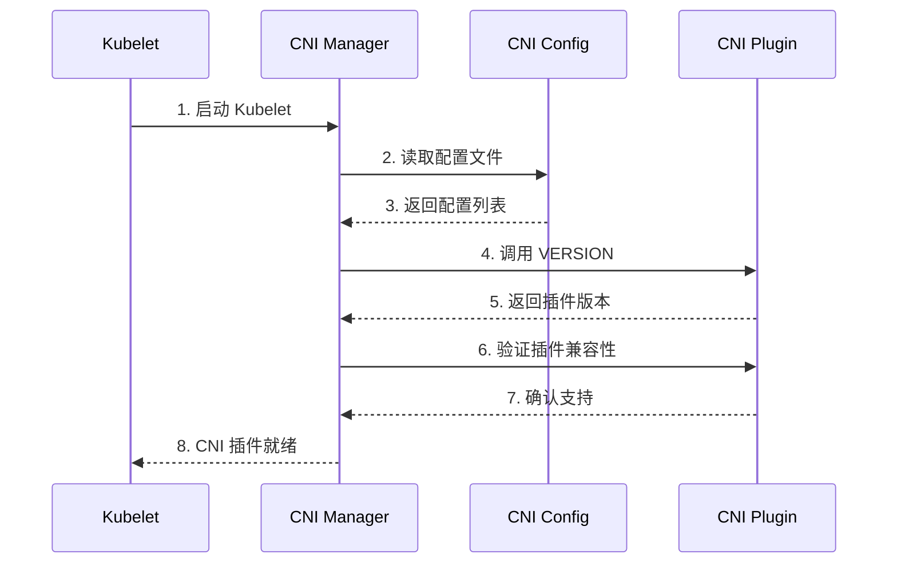

### 3.3 Pod 网络创建流程

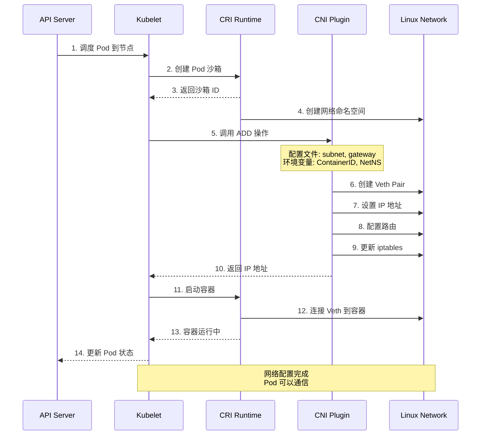

### 3.4 Pod 网络删除流程

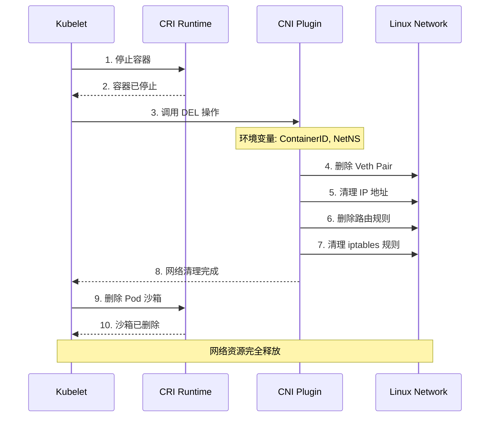

---

## 四、主流 CNI 插件深度分析

### 4.1 Flannel

#### 4.1.1 架构原理

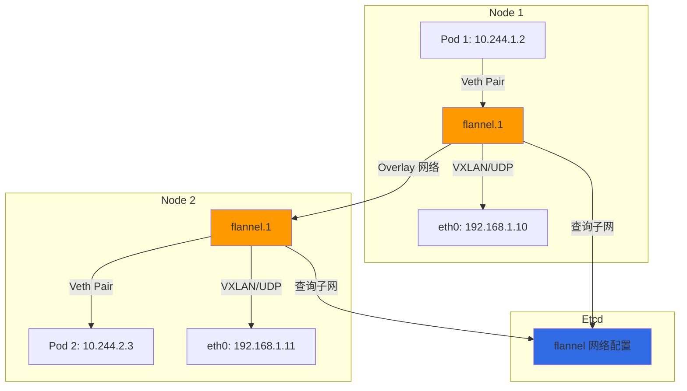

#### 4.1.2 工作原理

**核心机制:**
1. **子网分配**: 从 etcd 查询或分配一个子网
2. **VTEP (Virtual Tunnel Endpoint)**: 创建虚拟隧道端点
3. **Overlay 网络**: 使用 VXLAN 或 Host-GW 模式
4. **后端存储**: 使用 etcd 存储子网和 MAC 地址

**数据包流向:**
```
Pod 1 (10.244.1.2)
    ↓
Veth Pair
    ↓
flannel.1 (VTEP)
    ↓
VXLAN 封装 (UDP 端口 8472)
    ↓
eth0 (物理网卡)
    ↓
物理网络
    ↓
eth0 (目标节点)
    ↓
flannel.1 (目标 VTEP)
    ↓
Veth Pair
    ↓
Pod 2 (10.244.2.3)
```

#### 4.1.3 优缺点

| 优点 | 缺点 |
|-----|------|
| ✅ 配置简单 | ❌ 额外封装开销 |
| ✅ 与 etcd 深度集成 | ❌ 网络性能较低 |
| ✅ 支持多种后端 | ❌ 依赖外部 etcd |
| ✅ 稳定成熟 | ❌ 不支持网络策略 |

### 4.2 Calico

#### 4.2.1 架构原理

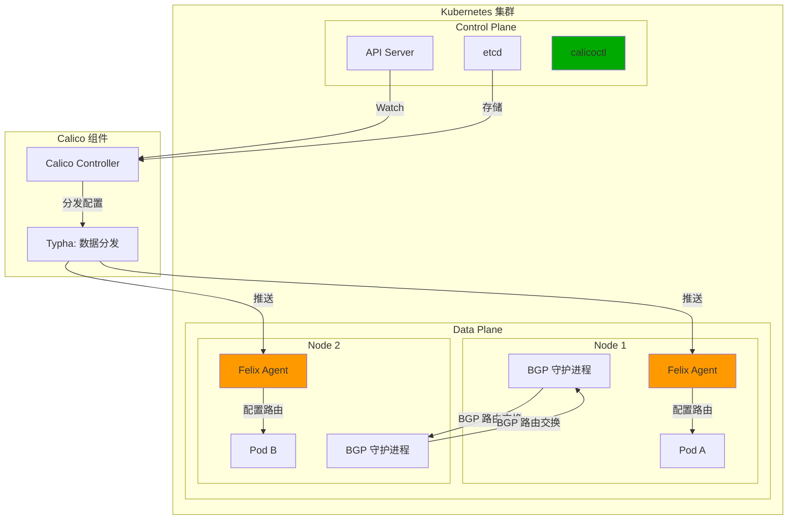

#### 4.2.2 工作原理

**核心机制:**

1. **纯三层网络**: 使用 BGP 路由，无需 Overlay
2. **Felix Agent**: 在每个节点运行，配置路由和 iptables
3. **BGP**: 使用 BGP 协议交换路由信息
4. **网络策略**: 原生支持 Kubernetes NetworkPolicy

**数据包流向:**
```
Pod A (10.244.1.2)
    ↓
Veth Pair
    ↓
eth0 (Node 1)
    ↓
路由表 (10.244.2.0/24 → Node 2)
    ↓
eth0 (Node 2)
    ↓
Veth Pair
    ↓
Pod B (10.244.2.3)
```

**无 Overlay，直接路由！**

#### 4.2.3 优缺点

| 优点 | 缺点 |
|-----|------|
| ✅ 无 Overlay，高性能 | ❌ 配置复杂 |
| ✅ 原生支持网络策略 | ❌ 需要 BGP 知识 |
| ✅ 支持大规模集群 | ❌ 跨子网需要额外配置 |
| ✅ 丰富的网络功能 | ❌ 资源占用较高 |

### 4.3 Cilium

#### 4.3.1 架构原理

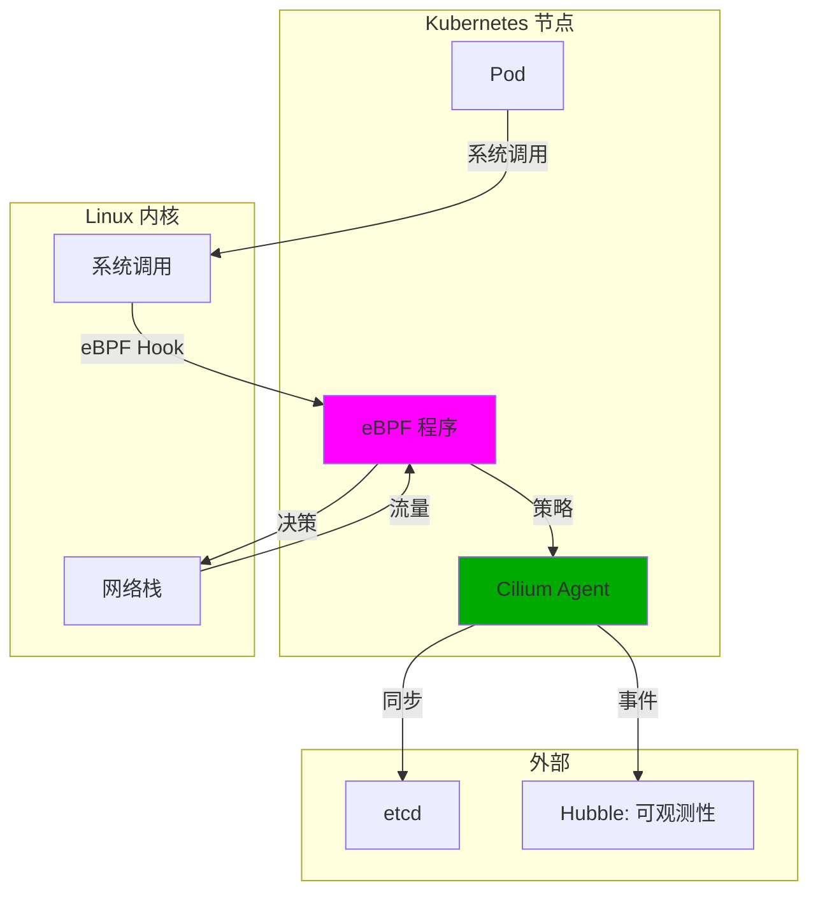

#### 4.3.2 工作原理

**核心机制:**

1. **eBPF (Extended Berkeley Packet Filter)**:
   - 在内核空间运行程序
   - 无需切换到用户空间
   - 高性能

2. **透明代理**:
   - 使用 eBPF 拦截网络流量
   - 无需 iptables/NAT
   - Source IP 保持

3. **网络策略**:
   - 基于 eBPF 实现
   - 高效过滤
   - 实时生效

**数据包流向:**
```
Pod A
    ↓
系统调用 (connect/send)
    ↓
eBPF 程序 (内核空间)
    ↓
路由决策 (无 NAT)
    ↓
直接转发到 Pod B
```

#### 4.3.3 优缺点

| 优点 | 缺点 |
|-----|------|
| ✅ eBPF 极高性能 | ❌ 需要 Linux 4.10+ |
| ✅ 无 NAT，保留源 IP | ❌ 复杂度高 |
| ✅ 可观测性强 | ❌ 对旧系统不友好 |
| ✅ 安全性高 | ❌ 调试较难 |

### 4.4 主流 CNI 插件对比

| 特性 | Flannel | Calico | Cilium |
|-----|---------|--------|--------|
| **架构** | Overlay (VXLAN) | 纯三层 | eBPF |
| **性能** | 中 | 高 | 极高 |
| **网络策略** | ❌ 不支持 | ✅ 支持 | ✅ 支持 |
| **配置复杂度** | 低 | 中 | 高 |
| **学习曲线** | 平缓 | 中等 | 陡峭 |
| **适用场景** | 简单集群 | 生产环境 | 高性能场景 |

---

## 五、网络策略 (NetworkPolicy) 实现

### 5.1 NetworkPolicy 资源定义

**源码位置**: `staging/src/k8s.io/api/networking/v1/types.go`

```go
type NetworkPolicy struct {
    metav1.TypeMeta
    metav1.ObjectMeta
    Spec NetworkPolicySpec
}

type NetworkPolicySpec struct {
    PodSelector metav1.LabelSelector
    PolicyTypes []PolicyType
    Ingress []NetworkPolicyIngressRule
    Egress  []NetworkPolicyEgressRule
}
```

**示例:**
```yaml
apiVersion: networking.k8s.io/v1
kind: NetworkPolicy
metadata:
  name: allow-web-traffic
spec:
  podSelector:
    matchLabels:
      app: web
  policyTypes:
  - Ingress
  - Egress
  ingress:
  - from:
    - podSelector:
        matchLabels:
          app: frontend
    ports:
    - protocol: TCP
      port: 80
  egress:
  - to:
    - namespaceSelector:
        matchLabels:
          name: database
    ports:
    - protocol: TCP
      port: 5432
```

### 5.2 网络策略执行流程

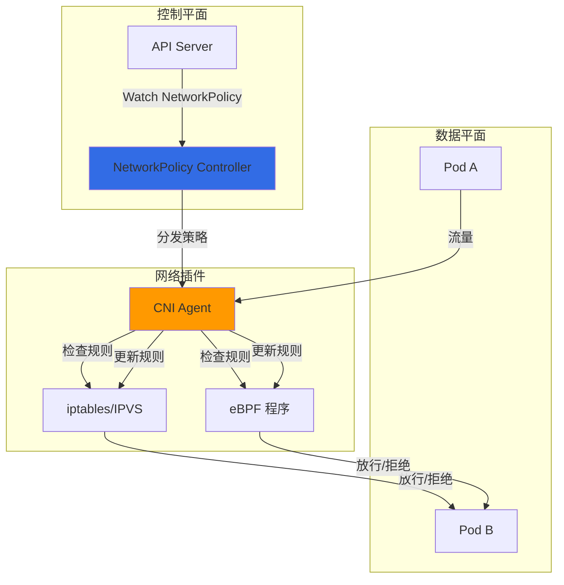

### 5.3 不同 CNI 的网络策略实现

| CNI | 实现方式 | 特点 |
|-----|----------|------|
| **Flannel** | 不支持 | 需要配合其他插件 |
| **Calico** | iptables + IPSet | 成熟稳定 |
| **Cilium** | eBPF | 高性能 |
| **Weave Net** | iptables + 快速数据路径 | 灵活 |
| **Canal** | Flannel + Calico | 混合方案 |

---

## 六、CNI 插件开发

### 6.1 CNI 插件开发步骤

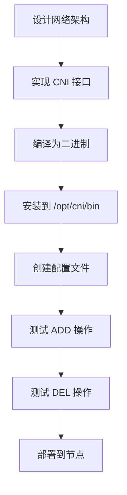

### 6.2 最小化 CNI 插件示例

**main.go:**
```go
package main

import (
    "encoding/json"
    "fmt"
    "os"
)

func main() {
    // 读取标准输入
    stdin, err := os.Stdin.Stat()
    if err != nil {
        panic(err)
    }

    if stdin.Size() == 0 {
        fmt.Println(`{"cniVersion": "1.0.0", "supportedVersions": ["1.0.0"]}`)
        os.Exit(0)
    }

    // 解析 CNI 配置
    var config struct {
        CNIVersion string `json:"cniVersion"`
        Name       string `json:"name"`
        Type       string `json:"type"`
    }

    decoder := json.NewDecoder(os.Stdin)
    if err := decoder.Decode(&config); err != nil {
        panic(err)
    }

    // 获取环境变量
    containerID := os.Getenv("CNI_CONTAINERID")
    netns := os.Getenv("CNI_NETNS")

    // 执行网络配置
    // ... 实现具体的网络逻辑

    // 返回结果
    result := map[string]interface{}{
        "cniVersion": "1.0.0",
        "interfaces": []map[string]interface{}{
            {
                "name":     "eth0",
                "sandbox":  netns,
            },
        },
        "ips": []map[string]interface{}{
            {
                "version":  "4",
                "address":  "10.244.1.5/16",
                "gateway":  "10.244.1.1",
            },
        },
    }

    json.NewEncoder(os.Stdout).Encode(result)
}
```

### 6.3 测试 CNI 插件

```bash
# 编译
go build -o my-cni-plugin

# 安装
sudo cp my-cni-plugin /opt/cni/bin/
sudo chmod +x /opt/cni/bin/my-cni-plugin

# 创建配置
sudo tee /etc/cni/net.d/10-my-cni.conf <<EOF
{
  "cniVersion": "1.0.0",
  "name": "mynet",
  "type": "my-cni-plugin",
  "ipam": {
    "type": "host-local",
    "subnet": "10.244.0.0/16"
  }
}
EOF

# 测试
CNI_COMMAND=ADD \
CNI_CONTAINERID=abc123 \
CNI_NETNS=/var/run/netns/abc123 \
/opt/cni/bin/my-cni-plugin < /etc/cni/net.d/10-my-cni.conf
```

---

## 七、CNI 故障排查

### 7.1 常见问题

| 问题 | 可能原因 | 解决方案 |
|-----|---------|---------|
| **Pod 无法通信** | CNI 插件未启动 | 检查 kubelet 日志和 CNI 插件状态 |
| **IP 地址冲突** | IPAM 配置错误 | 检查子网分配和回收 |
| **网络策略不生效** | CNI 不支持 | 使用支持网络策略的 CNI |
| **性能差** | Overlay 封装 | 使用纯三层 CNI (Calico) |

### 7.2 排查工具

```bash
# 查看 CNI 插件版本
/opt/cni/bin/<plugin-name> -version

# 查看 CNI 配置
cat /etc/cni/net.d/*.conf

# 查看 Pod 网络配置
kubectl exec -it <pod> -- ip addr
kubectl exec -it <pod> -- ip route

# 查看 Kubelet 日志
journalctl -u kubelet | grep CNI

# 测试网络连通性
kubectl exec -it <pod> -- ping <another-pod-ip>
kubectl exec -it <pod> -- curl http://<service-name>
```

### 7.3 调试流程

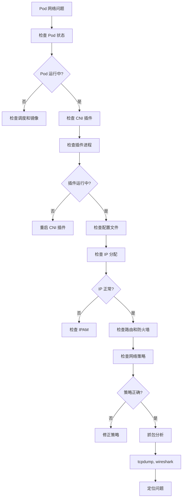

---

## 八、最佳实践

### 8.1 选择 CNI 插件

**决策树:**
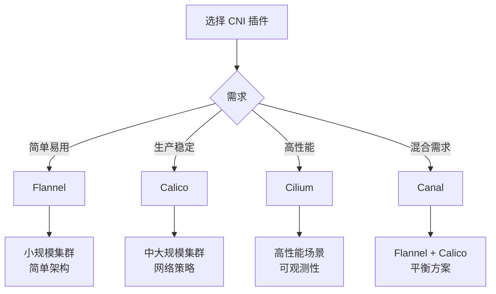

### 8.2 生产环境配置

**Kubelet 配置:**
```yaml
apiVersion: kubelet.config.k8s.io/v1beta1
kind: KubeletConfiguration
cniConfDir: /etc/cni/net.d
cniBinDir: /opt/cni/bin
networkPlugin: cni
```

**Calico 配置示例:**
```yaml
apiVersion: operator.tigera.io/v1
kind: Installation
metadata:
  name: default
spec:
  calicoNetwork:
    ipPools:
    - blockSize: 26
      cidr: 10.244.0.0/16
      encapsulation: VXLAN
      natOutgoing: Enabled
      nodeSelector: all()
```

### 8.3 性能优化

1. **选择合适的 CNI**:
   - 小集群: Flannel
   - 大集群: Calico (纯三层)
   - 高性能: Cilium (eBPF)

2. **MTU 优化**:
   ```bash
   # 根据网络环境调整 MTU
   # Overlay: MTU 1450 (1500 - 50 封装头)
   # 非 Overlay: MTU 1500
   ```

3. **网络策略优化**:
   - 避免过度复杂的规则
   - 使用标签选择器而不是 IP
   - 定期清理无用策略

---

## 九、CNI 与 K8s 网络模型

### 9.1 Kubernetes 网络模型要求

**四大原则:**

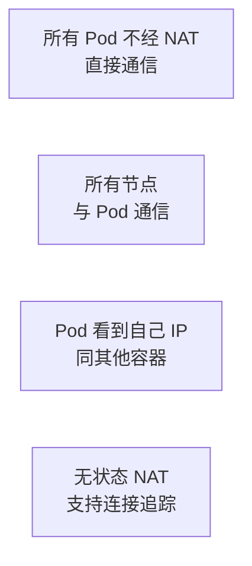

1. **无 NAT**: Pod 之间可以直接通信，无需 NAT
2. **扁平网络**: 所有节点可以与所有 Pod 通信
3. **IP 一致性**: Pod 内看到的 IP 与外部相同
4. **无状态 NAT**: 避免有状态 NAT，支持连接追踪

### 9.2 CNI 如何满足网络模型

| 要求 | Flannel 实现 | Calico 实现 | Cilium 实现 |
|-----|-------------|-------------|-------------|
| **无 NAT** | ✅ Overlay 虽然有封装，但 Pod 到 Pod 是直通 | ✅ BGP 直连 | ✅ eBPF 直连 |
| **扁平网络** | ✅ VXLAN 扁平 | ✅ BGP 扁平 | ✅ eBPF 扁平 |
| **IP 一致性** | ✅ | ✅ | ✅ |
| **无状态 NAT** | ✅ | ✅ | ✅ |

---

## 十、总结

### 10.1 核心要点

1. **CNI 是无状态的插件规范**
   - 通过 stdin/stdout 通信
   - 支持四种操作: ADD, DEL, CHECK, VERSION
   - 配置文件驱动插件行为

2. **Kubelet 管理 CNI 生命周期**
   - Pod 创建时调用 ADD
   - Pod 删除时调用 DEL
   - 监控插件状态

3. **主流 CNI 实现各具特色**
   - Flannel: 简单易用，Overlay
   - Calico: 生产稳定，纯三层
   - Cilium: 极高性能，eBPF

4. **网络策略依赖 CNI 实现**
   - 不是所有 CNI 都支持
   - 实现方式差异大
   - 选择时需确认支持

### 10.2 未来趋势

1. **eBPF 技术崛起**
   - Cilium 领头
   - 其他 CNI 也在集成
   - 性能大幅提升

2. **服务网格集成**
   - CNI + Istio/Linkerd
   - 网络功能下沉
   - 统一流量管理

3. **IPv6 支持**
   - 双栈网络
   - 平滑迁移
   - 生态完善

---

## 附录

### A. 参考资源

**官方文档:**
- [CNI 规范](https://www.cni.dev/)
- [Kubernetes 网络模型](https://kubernetes.io/docs/concepts/cluster-administration/networking/)
- [网络策略](https://kubernetes.io/docs/concepts/services-networking/network-policies/)

**项目地址:**
- [Flannel](https://github.com/flannel-io/flannel)
- [Calico](https://github.com/projectcalico/calico)
- [Cilium](https://github.com/cilium/cilium)

### B. 版本信息

- **Kubernetes 版本**: 1.25.0
- **CNI 规范版本**: 1.0.0
- **文档版本**: 1.0
- **最后更新**: 2026-02-23

---

**文档完成！** 🎉

这个文档涵盖了 Kubernetes CNI 插件机制的所有核心内容，从规范到实现，从原理到实践。祝学习愉快！
