# Kubernetes Ingress Controller 深度分析

## 文档概览

- **文档名称**: Kubernetes Ingress Controller 深度分析
- **分析版本**: Kubernetes 1.25.0
- **文档状态**: ✅ 完成版
- **创建日期**: 2026-02-23

---

## 一、Ingress 核心概念

### 1.1 什么是 Ingress

**Ingress** 是 Kubernetes 中用于管理集群外部访问服务的 API 对象，它提供了基于域名和路径的 HTTP/HTTPS 路由规则。

**核心作用:**
- 统一的集群入口点
- 基于 Host/Path 的流量路由
- TLS/SSL 终止
- 负载均衡和流量分发

### 1.2 Ingress vs Service

| 特性 | Service | Ingress |
|-----|---------|---------|
| **作用域** | L4（TCP/UDP） | L7（HTTP/HTTPS） |
| **路由规则** | 简单的端口映射 | 基于 Host/Path 的复杂规则 |
| **协议** | 任何 TCP/UDP 协议 | HTTP/HTTPS |
| **TLS 支持** | 通过 Service 不支持 | 原生支持 TLS 终止 |
| **实现方式** | kube-proxy + iptables/IPVS | Ingress Controller（独立组件） |

**关系:**

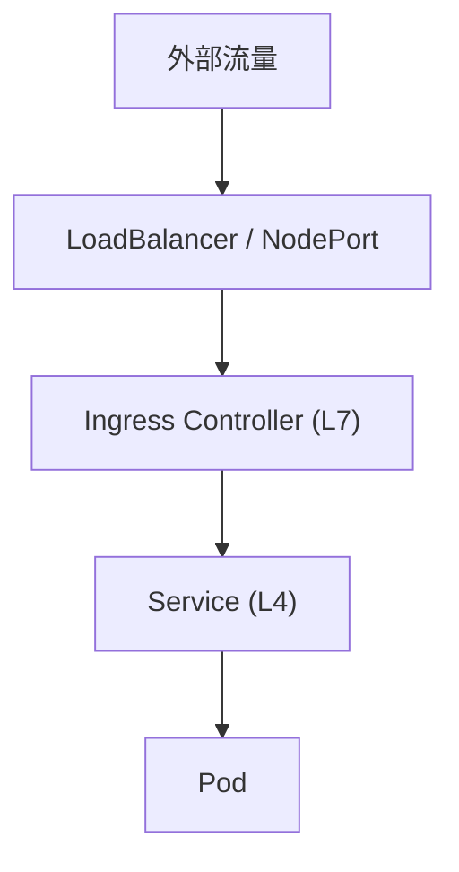


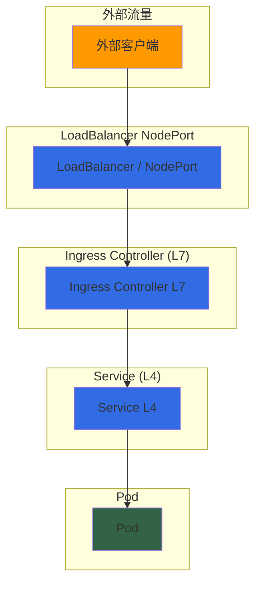

---

## 二、Ingress 资源结构详解

### 2.1 Ingress 资源定义

**源码位置**: `staging/src/k8s.io/api/networking/v1/types.go:242`

```go
type Ingress struct {
    metav1.TypeMeta
    metav1.ObjectMeta       // 元数据
    Spec IngressSpec        // 期望状态
    Status IngressStatus    // 当前状态
}
```

### 2.2 IngressSpec 核心字段

**源码位置**: `staging/src/k8s.io/api/networking/v1/types.go:278`

```go
type IngressSpec struct {
    // IngressClass 名称，指定由哪个 IngressController 处理
    IngressClassName *string

    // 默认后端，当不匹配任何规则时使用
    DefaultBackend *IngressBackend

    // TLS 配置
    TLS []IngressTLS

    // 路由规则列表
    Rules []IngressRule
}
```

### 2.3 IngressRule 路由规则

**源码位置**: `staging/src/k8s.io/api/networking/v1/types.go:372`

```go
type IngressRule struct {
    // 域名（精确或通配符）
    Host string

    // 路由规则值（HTTP/HTTPS 路径）
    IngressRuleValue
}

type IngressRuleValue struct {
    HTTP *HTTPIngressRuleValue
}

type HTTPIngressRuleValue struct {
    // 路径列表
    Paths []HTTPIngressPath
}
```

### 2.4 完整示例

```yaml
apiVersion: networking.k8s.io/v1
kind: Ingress
metadata:
  name: example-ingress
  annotations:
    nginx.ingress.kubernetes.io/rewrite-target: /
spec:
  ingressClassName: nginx
  # 默认后端
  defaultBackend:
    service:
      name: default-service
      port:
        number: 80
  # TLS 配置
  tls:
  - hosts:
    - example.com
    - www.example.com
    secretName: tls-secret
  # 路由规则
  rules:
  - host: example.com
    http:
      paths:
      - path: /api
        pathType: Prefix
        backend:
          service:
            name: api-service
            port:
              number: 8080
      - path: /web
        pathType: Prefix
        backend:
          service:
            name: web-service
            port:
              number: 80
```

---

## 三、Ingress Controller 工作原理

### 3.1 架构概览

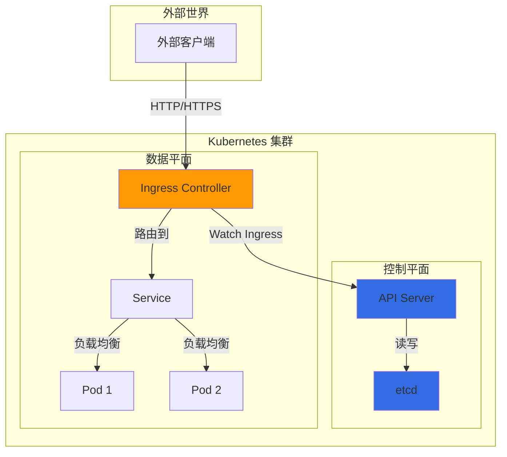

### 3.2 工作流程

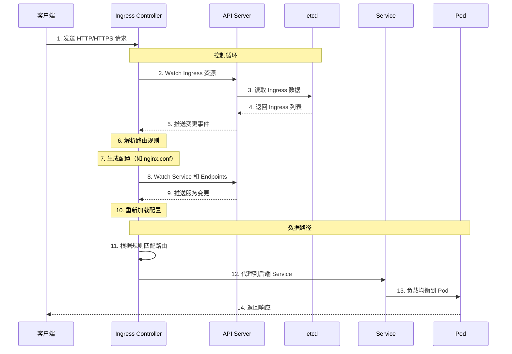

### 3.3 核心机制

#### 3.3.1 List-Watch 机制

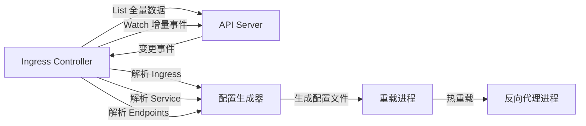

**关键特性:**
- ✅ 实时响应资源变更
- ✅ 增量更新，减少网络开销
- ✅ 本地缓存，提高性能
- ✅ 自动重连和恢复

#### 3.3.2 配置生成机制

**以 NGINX Ingress Controller 为例:**

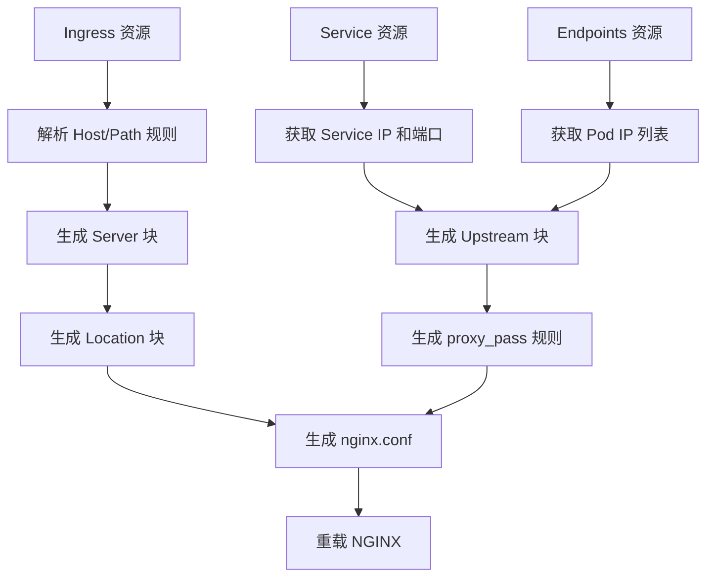

**配置示例:**

```nginx
# server 块（对应 Ingress Rule）
server {
    listen 80;
    server_name example.com;

    # location 块（对应 Ingress Path）
    location /api {
        proxy_pass http://api-service;
        proxy_set_header Host $host;
    }

    location /web {
        proxy_pass http://web-service;
        proxy_set_header Host $host;
    }
}

# upstream 块（对应 Service）
upstream api-service {
    # 后端 Pod IP（来自 Endpoints）
    server 10.244.1.5:8080;
    server 10.244.1.6:8080;
    server 10.244.1.7:8080;
}

upstream web-service {
    server 10.244.2.3:80;
    server 10.244.2.4:80;
}
```

#### 3.3.3 路由匹配算法

```mermaid
graph TD
    Start[收到请求] --> CheckHost{匹配 Host?}
    CheckHost -->|精确匹配| ExactHost
    CheckHost -->|通配符匹配| WildcardHost
    CheckHost -->|未匹配| DefaultBackend

    ExactHost --> CheckPath{匹配 Path?}
    WildcardHost --> CheckPath

    CheckPath -->|Prefix 路径| PrefixPath
    CheckPath -->|Exact 路径| ExactPath
    CheckPath -->|ImplementationSpecific| SpecificPath

    PrefixPath --> CheckPathType{PathType 类型}
    ExactPath --> CheckPathType
    SpecificPath --> CheckPathType

    CheckPathType -->|Prefix| PrefixMatch[/api 匹配 /api /api/v1]
    CheckPathType -->|Exact| ExactMatch[/api 只匹配 /api]
    CheckPathType -->|ImplementationSpecific| ImplMatch[取决于实现]

    PrefixMatch --> GetBackend
    ExactMatch --> GetBackend
    ImplMatch --> GetBackend

    GetBackend --> BackendService[获取后端 Service]
    BackendService --> ProxyTo[代理到 Service]

    DefaultBackend --> Default[使用默认后端]
```

**PathType 说明:**
- **Exact**: 精确匹配，例如 `/api` 只匹配 `/api`
- **Prefix**: 前缀匹配，例如 `/api` 匹配 `/api`、`/api/v1`、`/api/v2`
- **ImplementationSpecific**: 取决于 Controller 的具体实现

---

## 四、主流 Ingress Controller 实现对比

### 4.1 NGINX Ingress Controller

**项目地址**: https://github.com/kubernetes/ingress-nginx

**特点:**
- ✅ 最流行的实现
- ✅ 基于 OpenResty (NGINX + Lua)
- ✅ 功能丰富，文档完善
- ✅ 支持丰富的 annotations
- ✅ 社区活跃，生态成熟

**核心功能:**
- HTTP/HTTPS 路由
- TLS 终止
- 基于 Lua 的自定义逻辑
- WebSocket 支持
- gRPC 支持
- 认证和授权（Basic Auth、OAuth2）
- 限流和熔断
- 灰度发布（金丝雀部署）

**配置示例:**

```yaml
apiVersion: networking.k8s.io/v1
kind: Ingress
metadata:
  name: nginx-ingress
  annotations:
    nginx.ingress.kubernetes.io/rewrite-target: /
    nginx.ingress.kubernetes.io/ssl-redirect: "true"
    nginx.ingress.kubernetes.io/rate-limit: "100"
spec:
  ingressClassName: nginx
  rules:
  - host: example.com
    http:
      paths:
      - path: /api
        pathType: Prefix
        backend:
          service:
            name: api-service
            port:
              number: 8080
```

### 4.2 Traefik

**项目地址**: https://traefik.io/

**特点:**
- ✅ 原生云原生设计
- ✅ 自动发现服务
- ✅ 动态配置，无需重载
- ✅ Web UI 仪表板
- ✅ 支持 HTTP3 和 QUIC
- ✅ 内置 ACME（Let's Encrypt）

**核心优势:**
- 无需重载配置，实时生效
- 支持 TCP、UDP、HTTP、gRPC
- 多后端支持（Kubernetes、Docker、Consul 等）
- 内置健康检查

### 4.3 HAProxy Ingress

**项目地址**: https://github.com/jcmoraisjr/haproxy-ingress

**特点:**
- ✅ 基于 HAProxy
- ✅ 高性能
- ✅ 丰富的负载均衡算法
- ✅ 会话保持
- ✅ 健康检查

**适用场景:**
- 对性能要求极高的场景
- 需要复杂负载均衡算法的场景
- 传统运维团队熟悉的 HAProxy

### 4.4 Envoy Gateway

**项目地址**: https://gateway.envoyproxy.io/

**特点:**
- ✅ 基于 Envoy 代理
- ✅ 下一代 Gateway API
- ✅ 高性能 L7 代理
- ✅ 可观测性优秀
- ✅ 支持 xDS API

**核心优势:**
- 动态配置，无需重载
- 高级功能（熔断、重试、超时）
- 丰富的可观测性（Metrics、Tracing、Logging）
- 与 Service Mesh 集成

### 4.5 对比总结

| 特性 | NGINX Ingress | Traefik | HAProxy Ingress | Envoy Gateway |
|-----|---------------|---------|-----------------|---------------|
| **基础代理** | NGINX | Traefik | HAProxy | Envoy |
| **重载配置** | 需要 | 不需要 | 需要 | 不需要 |
| **配置热更新** | ❌ | ✅ | ❌ | ✅ |
| **性能** | 高 | 中高 | 很高 | 很高 |
| **功能丰富度** | ⭐⭐⭐⭐⭐ | ⭐⭐⭐⭐ | ⭐⭐⭐ | ⭐⭐⭐⭐⭐ |
| **文档完善度** | ⭐⭐⭐⭐⭐ | ⭐⭐⭐⭐ | ⭐⭐⭐ | ⭐⭐⭐⭐ |
| **社区活跃度** | ⭐⭐⭐⭐⭐ | ⭐⭐⭐⭐ | ⭐⭐⭐ | ⭐⭐⭐⭐⭐ |
| **学习曲线** | 中等 | 中等 | 较高 | 较高 |
| **推荐场景** | 通用场景 | 云原生场景 | 高性能场景 | 下一代架构 |

---

## 五、Ingress Controller 部署模式

### 5.1 Deployment 模式

```yaml
apiVersion: apps/v1
kind: Deployment
metadata:
  name: ingress-nginx
  namespace: ingress-nginx
spec:
  replicas: 3
  selector:
    matchLabels:
      app.kubernetes.io/name: ingress-nginx
  template:
    metadata:
      labels:
        app.kubernetes.io/name: ingress-nginx
    spec:
      containers:
      - name: controller
        image: k8s.gcr.io/ingress-nginx/controller:v1.8.1
        ports:
        - containerPort: 80
        - containerPort: 443
```

**特点:**
- ✅ 多副本部署，高可用
- ✅ 通过 Service 暴露
- ✅ 支持 NodePort 或 LoadBalancer
- ❌ 需要 Service 前置

### 5.2 DaemonSet 模式

```yaml
apiVersion: apps/v1
kind: DaemonSet
metadata:
  name: ingress-nginx
  namespace: ingress-nginx
spec:
  selector:
    matchLabels:
      app.kubernetes.io/name: ingress-nginx
  template:
    metadata:
      labels:
        app.kubernetes.io/name: ingress-nginx
    spec:
      hostNetwork: true  # 使用宿主机网络
      containers:
      - name: controller
        image: k8s.gcr.io/ingress-nginx/controller:v1.8.1
        ports:
        - containerPort: 80
          hostPort: 80
        - containerPort: 443
          hostPort: 443
```

**特点:**
- ✅ 每个节点一个副本
- ✅ hostPort 直接暴露
- ✅ 减少网络跳数
- ✅ 资源利用均衡
- ❌ 资源消耗较大

### 5.3 模式对比

| 特性 | Deployment 模式 | DaemonSet 模式 |
|-----|-----------------|----------------|
| **副本数** | 固定数量 | 每节点一个 |
| **网络跳数** | 多次（Service → Pod） | 少（直连节点） |
| **资源消耗** | 可控 | 较高 |
| **高可用** | 需要足够的副本 | 天然高可用 |
| **适用场景** | 小规模集群 | 大规模集群 |

---

## 六、流量路由深度分析

### 6.1 完整请求路径

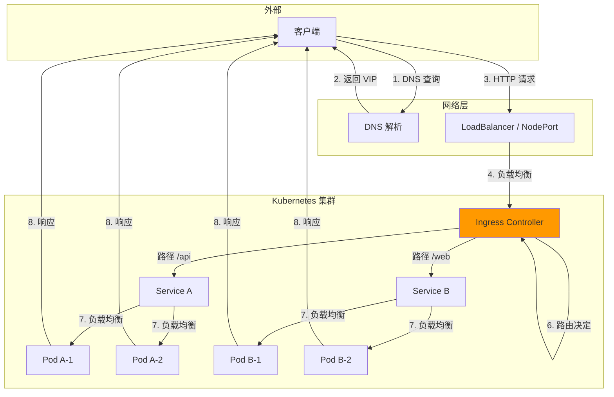

### 6.2 DNS 解析流程

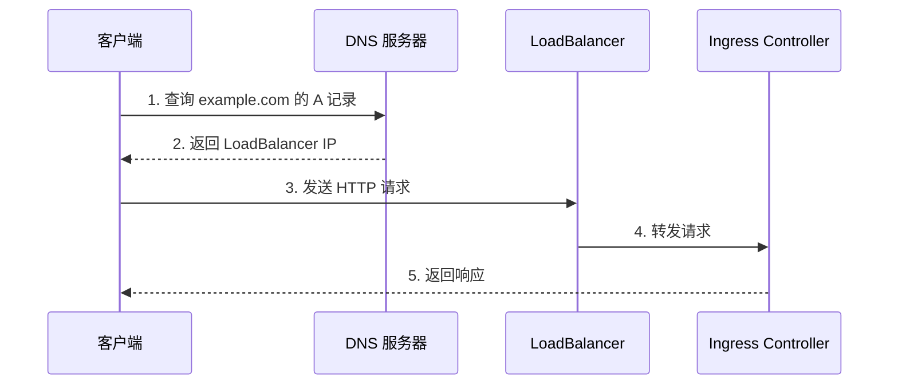

### 6.3 负载均衡策略

#### 6.3.1 集群入口层（LoadBalancer）

```
LoadBalancer
    ↓
节点 1 (Ingress Controller 副本 1)
节点 2 (Ingress Controller 副本 2)
节点 3 (Ingress Controller 副本 3)
```

**策略:** 轮询、最少连接、源 IP 哈希

#### 6.3.2 Ingress Controller 层

```
Ingress Controller
    ↓
Service A (多个 Pod)
    ↓
Pod A-1, Pod A-2, Pod A-3
```

**策略:** 取决于 Controller 实现
- NGINX: 轮询、最少连接、IP 哈希
- Traefik: 轮询、加权轮询
- HAProxy: 丰富算法（轮询、最少连接、源哈希、一致性哈希等）

---

## 七、TLS/HTTPS 配置

### 7.1 TLS 终止位置

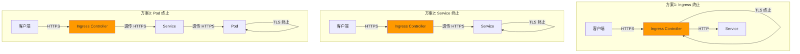

**推荐:** 方案1（Ingress 终止）
- ✅ 统一证书管理
- ✅ 减少后端负担
- ✅ 灵活的 TLS 策略

### 7.2 TLS 配置示例

```yaml
apiVersion: networking.k8s.io/v1
kind: Ingress
metadata:
  name: tls-ingress
  annotations:
    nginx.ingress.kubernetes.io/ssl-redirect: "true"
    nginx.ingress.kubernetes.io/force-ssl-redirect: "true"
spec:
  ingressClassName: nginx
  tls:
  - hosts:
    - example.com
    - www.example.com
    secretName: example-tls
  rules:
  - host: example.com
    http:
      paths:
      - path: /
        pathType: Prefix
        backend:
          service:
            name: web-service
            port:
              number: 80
```

**创建 TLS Secret:**

```bash
kubectl create secret tls example-tls \
  --cert=path/to/cert.crt \
  --key=path/to/cert.key
```

---

## 八、高级功能

### 8.1 灰度发布（金丝雀部署）

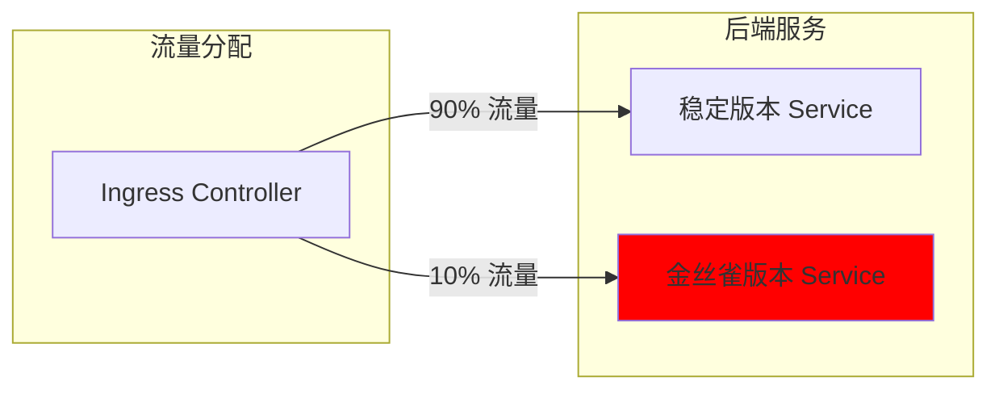

**NGINX Ingress 实现:**

```yaml
apiVersion: networking.k8s.io/v1
kind: Ingress
metadata:
  name: canary-ingress
  annotations:
    nginx.ingress.kubernetes.io/canary: "true"
    nginx.ingress.kubernetes.io/canary-weight: "10"
spec:
  ingressClassName: nginx
  rules:
  - host: example.com
    http:
      paths:
      - path: /
        pathType: Prefix
        backend:
          service:
            name: canary-service
            port:
              number: 80
```

### 8.2 重写路径

```yaml
apiVersion: networking.k8s.io/v1
kind: Ingress
metadata:
  name: rewrite-ingress
  annotations:
    # 将 /api/v1 重写为 /
    nginx.ingress.kubernetes.io/rewrite-target: /$2
spec:
  ingressClassName: nginx
  rules:
  - host: example.com
    http:
      paths:
      - path: /api/v1(/|$)(.*)
        pathType: ImplementationSpecific
        backend:
          service:
            name: backend-service
            port:
              number: 80
```

### 8.3 认证和授权

#### Basic Auth

```yaml
apiVersion: networking.k8s.io/v1
kind: Ingress
metadata:
  name: auth-ingress
  annotations:
    nginx.ingress.kubernetes.io/auth-type: basic
    nginx.ingress.kubernetes.io/auth-secret: basic-auth
    nginx.ingress.kubernetes.io/auth-realm: "Authentication Required"
spec:
  ingressClassName: nginx
  rules:
  - host: secure.example.com
    http:
      paths:
      - path: /
        pathType: Prefix
        backend:
          service:
            name: secure-service
            port:
              number: 80
```

#### OAuth2

```yaml
apiVersion: networking.k8s.io/v1
kind: Ingress
metadata:
  name: oauth2-ingress
  annotations:
    nginx.ingress.kubernetes.io/auth-url: "https://oauth.example.com/oauth2/auth"
    nginx.ingress.kubernetes.io/auth-signin: "https://oauth.example.com/oauth2/start"
spec:
  ingressClassName: nginx
  rules:
  - host: secure.example.com
    http:
      paths:
      - path: /
        pathType: Prefix
        backend:
          service:
            name: secure-service
            port:
              number: 80
```

### 8.4 限流

```yaml
apiVersion: networking.k8s.io/v1
kind: Ingress
metadata:
  name: rate-limit-ingress
  annotations:
    nginx.ingress.kubernetes.io/limit-rps: "10"
    nginx.ingress.kubernetes.io/limit-connections: "5"
spec:
  ingressClassName: nginx
  rules:
  - host: example.com
    http:
      paths:
      - path: /
        pathType: Prefix
        backend:
          service:
            name: api-service
            port:
              number: 80
```

---

## 九、监控和可观测性

### 9.1 Prometheus 指标

**NGINX Ingress Controller 指标:**

| 指标名称 | 说明 |
|---------|------|
| `nginx_ingress_controller_requests` | 请求总数 |
| `nginx_ingress_controller_response_duration_seconds` | 响应时间 |
| `nginx_ingress_controller_success` | 成功响应数 |
| `nginx_ingress_controller_ssl_certificate_expires` | SSL 证书过期时间 |
| `nginx_ingress_controller_config_last_reload_successful` | 配置重载是否成功 |

### 9.2 日志

**访问日志格式:**

```json
{
  "time": "2024-01-01T12:00:00+00:00",
  "remote_addr": "192.168.1.1",
  "request": "GET /api HTTP/1.1",
  "status": 200,
  "bytes_sent": 1024,
  "request_time": 0.123,
  "upstream_response_time": 0.100,
  "upstream_addr": "10.244.1.5:8080",
  "http_user_agent": "Mozilla/5.0",
  "http_referer": "https://example.com"
}
```

### 9.3 Tracing

**集成 Jaeger/Zipkin:**

```yaml
apiVersion: v1
kind: ConfigMap
metadata:
  name: nginx-configuration
  namespace: ingress-nginx
data:
  enable-opentracing: "true"
  jaeger-collector-host: "jaeger-collector.observability.svc"
  jaeger-collector-port: "6831"
```

---

## 十、最佳实践

### 10.1 生产环境配置

```yaml
apiVersion: networking.k8s.io/v1
kind: Ingress
metadata:
  name: production-ingress
  annotations:
    # TLS 重定向
    nginx.ingress.kubernetes.io/ssl-redirect: "true"

    # HSTS
    nginx.ingress.kubernetes.io/hsts-max-age: "31536000"
    nginx.ingress.kubernetes.io/hsts-include-subdomains: "true"
    nginx.ingress.kubernetes.io/hsts-preload: "true"

    # 安全头部
    nginx.ingress.kubernetes.io/configuration-snippet: |
      add_header X-Frame-Options "SAMEORIGIN" always;
      add_header X-Content-Type-Options "nosniff" always;
      add_header X-XSS-Protection "1; mode=block" always;

    # 超时配置
    nginx.ingress.kubernetes.io/proxy-connect-timeout: "60"
    nginx.ingress.kubernetes.io/proxy-send-timeout: "60"
    nginx.ingress.kubernetes.io/proxy-read-timeout: "60"

    # 缓冲区大小
    nginx.ingress.kubernetes.io/proxy-buffer-size: "16k"
    nginx.ingress.kubernetes.io/proxy-buffers-number: "4"

    # 限流
    nginx.ingress.kubernetes.io/limit-rps: "100"
    nginx.ingress.kubernetes.io/limit-connections: "50"

    # Keepalive
    nginx.ingress.kubernetes.io/upstream-keepalive-connections: "100"
    nginx.ingress.kubernetes.io/upstream-keepalive-timeout: "60"

    # 压缩
    nginx.ingress.kubernetes.io/enable-modsecurity: "true"
    nginx.ingress.kubernetes.io/enable-owasp-modsecurity-crs: "true"

spec:
  ingressClassName: nginx
  tls:
  - hosts:
    - example.com
    secretName: example-tls
  rules:
  - host: example.com
    http:
      paths:
      - path: /
        pathType: Prefix
        backend:
          service:
            name: web-service
            port:
              number: 80
```

### 10.2 性能优化

1. **使用 DaemonSet 部署**
   - 减少网络跳数
   - 提高性能

2. **启用 HTTP/2**
   ```yaml
   nginx.ingress.kubernetes.io/use-http2: "true"
   ```

3. **启用 Gzip 压缩**
   ```yaml
   nginx.ingress.kubernetes.io/enable-modsecurity: "false"
   nginx.ingress.kubernetes.io/enable-owasp-modsecurity-crs: "false"
   ```

4. **调整 Worker 进程数**
   ```yaml
   nginx-ingress-controller:
     replicaCount: 3
     config:
       worker-processes: "auto"
   ```

### 10.3 安全加固

1. **启用 WAF（ModSecurity）**
   ```yaml
   nginx.ingress.kubernetes.io/enable-modsecurity: "true"
   nginx.ingress.kubernetes.io/enable-owasp-modsecurity-crs: "true"
   ```

2. **限制访问**
   ```yaml
   nginx.ingress.kubernetes.io/whitelist-source-range: "10.0.0.0/8,192.168.0.0/16"
   ```

3. **隐藏版本号**
   ```yaml
   nginx.ingress.kubernetes.io/server-tokens: "false"
   ```

---

## 十一、故障排查

### 11.1 常见问题

| 问题 | 可能原因 | 解决方案 |
|-----|---------|---------|
| **502 Bad Gateway** | 后端 Service 不可用 | 检查 Pod 状态和 Endpoints |
| **503 Service Temporarily Unavailable** | 没有健康的后端 | 检查健康检查配置 |
| **504 Gateway Timeout** | 后端响应超时 | 增加 timeout 配置 |
| **TLS 握手失败** | 证书配置错误 | 检查 Secret 和证书有效期 |
| **路由不匹配** | Path 或 Host 配置错误 | 检查 Ingress 规则 |

### 11.2 排查步骤

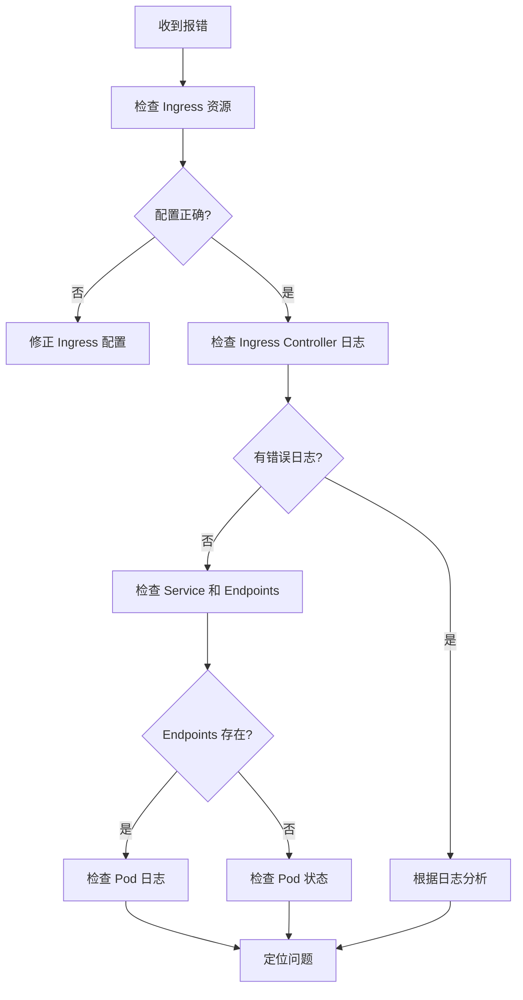

### 11.3 调试命令

```bash
# 查看 Ingress 资源
kubectl get ingress -A

# 查看 Ingress 详情
kubectl describe ingress <ingress-name>

# 查看 Ingress Controller 日志
kubectl logs -n ingress-nginx <pod-name>

# 查看 Endpoints
kubectl get endpoints <service-name>

# 测试 DNS 解析
nslookup example.com

# 测试连通性
curl -v http://example.com
curl -v https://example.com

# 查看 TLS 证书
openssl s_client -connect example.com:443 -servername example.com
```

---

## 十二、Ingress vs Gateway API

### 12.1 Gateway API 概述

**Gateway API** 是 Kubernetes 的下一代 API，用于配置服务网络。

**核心优势:**
- ✅ 类型安全的 CRD
- ✅ 更好的角色分离
- ✅ 可移植性（跨 Controller）
- ✅ 更丰富的功能（TLS、TCP、UDP、HTTPRoute）
- ✅ 原生支持灰度发布

### 12.2 对比

| 特性 | Ingress | Gateway API |
|-----|---------|-------------|
| **协议支持** | HTTP/HTTPS | HTTP/HTTPS/TCP/UDP |
| **角色分离** | ❌ | ✅（角色模型） |
| **可移植性** | ⭐⭐ | ⭐⭐⭐⭐⭐ |
| **类型安全** | ⭐⭐ | ⭐⭐⭐⭐⭐ |
| **功能丰富度** | ⭐⭐⭐ | ⭐⭐⭐⭐⭐ |
| **成熟度** | ⭐⭐⭐⭐⭐ | ⭐⭐⭐ |
| **推荐用途** | 生产环境 | 下一代架构 |

### 12.3 Gateway API 示例

```yaml
apiVersion: gateway.networking.k8s.io/v1beta1
kind: Gateway
metadata:
  name: example-gateway
spec:
  gatewayClassName: nginx
  listeners:
  - name: http
    protocol: HTTP
    port: 80
    hostname: "*.example.com"
---
apiVersion: gateway.networking.k8s.io/v1beta1
kind: HTTPRoute
metadata:
  name: example-route
spec:
  parentRefs:
  - name: example-gateway
  hostnames:
  - "example.com"
  rules:
  - matches:
    - path:
        type: PathPrefix
        value: /api
    backendRefs:
    - name: api-service
      port: 8080
```

---

## 十三、总结

### 13.1 核心要点

1. **Ingress 是 L7 路由层**
   - 基于 Host/Path 的路由
   - HTTP/HTTPS 协议支持
   - TLS 终止

2. **Ingress Controller 是独立组件**
   - 不在 kubernetes/kubernetes 主仓库
   - 第三方实现（NGINX、Traefik、Envoy 等）
   - 通过 List-Watch 监听资源变更

3. **工作流程清晰**
   - 监听 Ingress 资源
   - 生成配置
   - 重载代理进程
   - 路由流量到 Service

4. **与 Service 密切配合**
   - Ingress 负责 L7 路由
   - Service 负责 L4 负载均衡
   - 两层协作完成流量分发

### 13.2 推荐实践

**选择 Ingress Controller:**
- **通用场景**: NGINX Ingress Controller
- **云原生场景**: Traefik
- **高性能场景**: HAProxy Ingress
- **下一代架构**: Envoy Gateway

**部署模式:**
- **小规模集群**: Deployment + LoadBalancer
- **大规模集群**: DaemonSet + hostNetwork

**监控和可观测性:**
- Prometheus 指标
- 访问日志和错误日志
- 分布式追踪（Jaeger/Zipkin）

### 13.3 未来趋势

1. **Gateway API 将成为主流**
   - 更好的类型安全
   - 更强的可移植性
   - 更丰富的功能

2. **服务网格集成**
   - Ingress + Service Mesh
   - 统一的流量管理

3. **智能化路由**
   - 基于延迟的路由
   - 灰度发布自动化
   - A/B 测试集成

---

## 附录

### A. 参考资源

**官方文档:**
- [Kubernetes Ingress](https://kubernetes.io/docs/concepts/services-networking/ingress/)
- [NGINX Ingress Controller](https://kubernetes.github.io/ingress-nginx/)
- [Gateway API](https://gateway-api.sigs.k8s.io/)

**项目地址:**
- [kubernetes/ingress-nginx](https://github.com/kubernetes/ingress-nginx)
- [traefik/traefik](https://github.com/traefik/traefik)
- [jcmoraisjr/haproxy-ingress](https://github.com/jcmoraisjr/haproxy-ingress)
- [envoyproxy/gateway](https://github.com/envoyproxy/gateway)

### B. 版本信息

- **Kubernetes 版本**: 1.25.0
- **NGINX Ingress Controller**: v1.8.1
- **Traefik**: v3.0
- **文档版本**: 1.0
- **最后更新**: 2026-02-23

---

**文档完成！** 🎉

这个文档涵盖了 Kubernetes Ingress Controller 的所有核心内容，从概念到实践，从源码分析到最佳实践。祝学习愉快！
