# Kubernetes 网络策略 (NetworkPolicy) 深度分析

## 文档概览

- **文档名称**: Kubernetes 网络策略深度分析
- **分析版本**: Kubernetes 1.25.0
- **文档状态**: ✅ 完成版
- **创建日期**: 2026-02-23

---

## 一、网络策略核心概念

### 1.1 什么是网络策略

**NetworkPolicy** 是 Kubernetes 中用于控制 Pod 间网络流量的 API 对象，实现了**微分段**（Micro-segmentation）。

**核心作用:**
- 控制入站流量（Ingress）
- 控制出站流量（Egress）
- 实现零信任网络模型
- 隔离敏感应用

### 1.2 默认网络行为

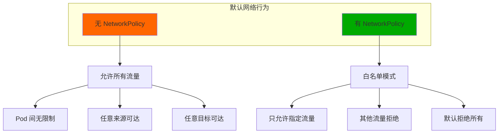

**重要原则:**
- **无策略 = 允许所有**
- **有策略 = 默认拒绝，只允许白名单**

### 1.3 网络策略 vs 传统防火墙

| 特性 | 网络策略 | 传统防火墙 |
|-----|----------|----------|
| **粒度** | Pod 级别 | 主机/子网级别 |
| **动态性** | ✅ 自动跟随 Pod 变化 | ❌ 手动配置 |
| **声明式** | ✅ GitOps 友好 | ❌ 命令式 |
| **标签驱动** | ✅ 基于标签 | ❌ 基于 IP |
| **云原生** | ✅ K8s 原生 | ❌ 外部系统 |

---

## 二、NetworkPolicy 资源结构详解

### 2.1 资源定义

**源码位置**: `staging/src/k8s.io/api/networking/v1/types.go:1`

```go
type NetworkPolicy struct {
    metav1.TypeMeta
    metav1.ObjectMeta           // 元数据
    Spec NetworkPolicySpec       // 策略规范
}

type NetworkPolicySpec struct {
    PodSelector metav1.LabelSelector         // 选择目标 Pod
    PolicyTypes []PolicyType               // 策略类型
    Ingress    []NetworkPolicyIngressRule   // 入站规则
    Egress     []NetworkPolicyEgressRule    // 出站规则
}
```

### 2.2 完整配置示例

```yaml
apiVersion: networking.k8s.io/v1
kind: NetworkPolicy
metadata:
  name: web-app-policy
  namespace: production
spec:
  # 选择目标 Pod
  podSelector:
    matchLabels:
      app: web-server
      tier: frontend

  # 策略类型
  policyTypes:
  - Ingress
  - Egress

  # 入站规则
  ingress:
  - from:
    # 来源 1: 指定命名空间的 Pod
    - podSelector:
        matchLabels:
          app: api-gateway
      namespaceSelector:
        matchLabels:
          name: ingress-ns

    # 来源 2: 指定 IP 范围
    - ipBlock:
        cidr: 10.0.0.0/8
        except:
        - 10.0.1.0/24

    # 来源 3: 同命名空间的 Pod
    - podSelector:
        matchLabels:
          app: cache
    ports:
    - protocol: TCP
      port: 80
    - protocol: TCP
      port: 443

  # 出站规则
  egress:
  - to:
    # 目标 1: 数据库 Pod
    - podSelector:
        matchLabels:
          app: database
      namespaceSelector:
        matchLabels:
          name: db-ns
    ports:
    - protocol: TCP
      port: 5432

  - to:
    # 目标 2: 外部 IP
    - ipBlock:
        cidr: 0.0.0.0/0
    ports:
    - protocol: TCP
      port: 53
      endPort: 443
```

### 2.3 核心字段说明

#### 2.3.1 PodSelector

**作用**: 选择应用策略的目标 Pod

```yaml
podSelector:
  matchLabels:
    app: web
  matchExpressions:
  - {key: tier, operator: In, values: [frontend]}
  - {key: env, operator: NotIn, values: [test]}
```

#### 2.3.2 PolicyTypes

**可选值:**
- `Ingress`: 控制入站流量
- `Egress`: 控制出站流量
- `["Ingress", "Egress"]`: 同时控制入站和出站

**默认行为**:
- 有 `ingress` 规则 → `policyTypes` 默认为 `["Ingress"]`
- 有 `egress` 规则 → `policyTypes` 默认为 `["Ingress", "Egress"]`
- 只有 `ingress`，想要只控制出站 → 必须指定 `policyTypes: ["Egress"]`

#### 2.3.3 NetworkPolicyIngressRule

**结构**:
```go
type NetworkPolicyIngressRule struct {
    Ports   []NetworkPolicyPort  // 端口限制
    From    []NetworkPolicyPeer  // 来源限制
}
```

#### 2.3.4 NetworkPolicyPeer

**三种来源类型**:

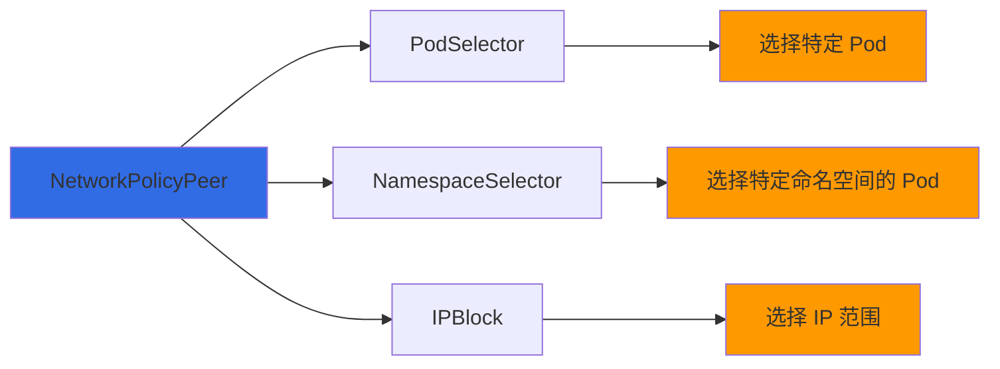

**类型对比**:

| 类型 | 用途 | 示例 |
|-----|------|------|
| **podSelector** | 选择同命名空间的 Pod | `podSelector: {matchLabels: {app: api}}` |
| **namespaceSelector** | 选择其他命名空间的 Pod | `namespaceSelector: {matchLabels: {env: prod}}` |
| **ipBlock** | 选择 IP 段（外部或集群内） | `ipBlock: {cidr: 10.0.0.0/8}` |
| **组合** | 选择特定命名空间的特定 Pod | 两者同时指定 |

#### 2.3.5 IPBlock

**结构**:
```go
type IPBlock struct {
    CIDR   string   // 允许的 CIDR
    Except []string // 排除的 CIDR
}
```

**示例**:
```yaml
# 允许 10.0.0.0/8，但排除 10.0.1.0/24
ipBlock:
  cidr: 10.0.0.0/8
  except:
  - 10.0.1.0/24
```

---

## 三、网络策略工作原理

### 3.1 策略评估模型

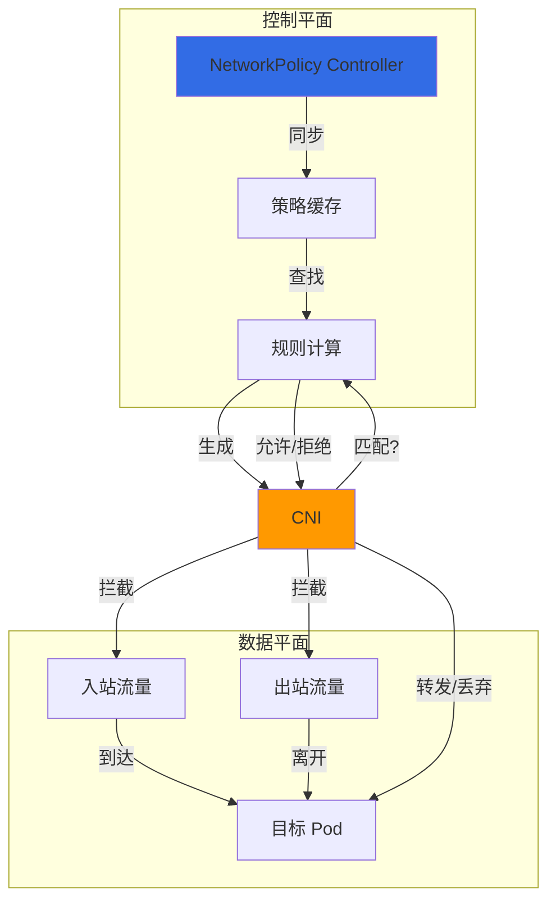

### 3.2 流量匹配逻辑

#### 3.2.1 入站流量决策树

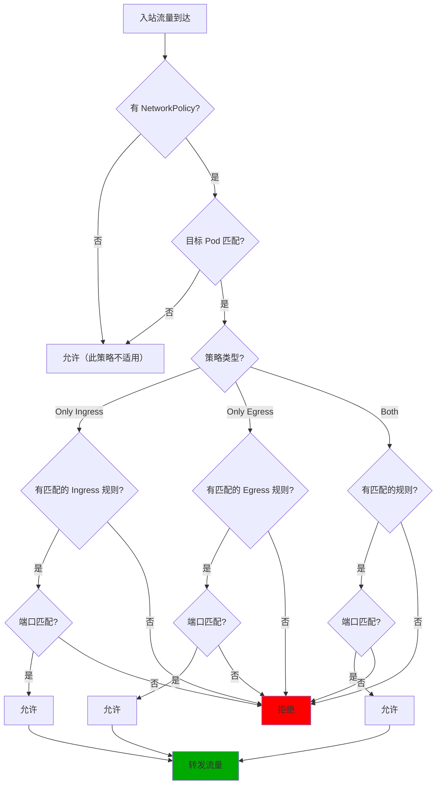

#### 3.2.2 多策略组合

**匹配规则**:
- 如果多个 NetworkPolicy 选择同一个 Pod → 规则**累加**（OR 逻辑）
- 每个 NetworkPolicy 内的规则 → **AND** 逻辑（必须同时满足）
- From/To/Pods 内的列表 → **OR** 逻辑（满足任意一个）

**示例**:
```yaml
# Policy 1: 允许 frontend → backend
apiVersion: networking.k8s.io/v1
kind: NetworkPolicy
metadata:
  name: allow-frontend
spec:
  podSelector: {matchLabels: {app: backend}}
  ingress:
  - from: [podSelector: {matchLabels: {app: frontend}}]
    ports: [{port: 8080}]

---
# Policy 2: 允许 api → backend
apiVersion: networking.k8s.io/v1
kind: NetworkPolicy
metadata:
  name: allow-api
spec:
  podSelector: {matchLabels: {app: backend}}
  ingress:
  - from: [podSelector: {matchLabels: {app: api}}]
    ports: [{port: 8080}]

# 结果: backend 接受来自 frontend 和 api 的流量
```

### 3.3 策略更新流程

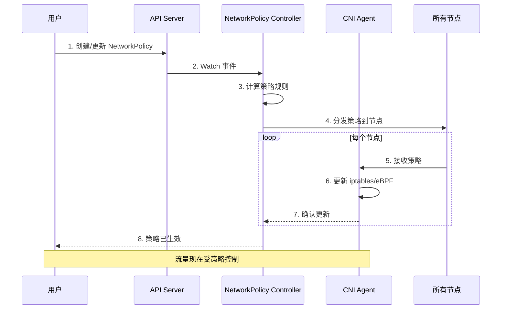

---

## 四、不同 CNI 的网络策略实现

### 4.1 实现方式对比

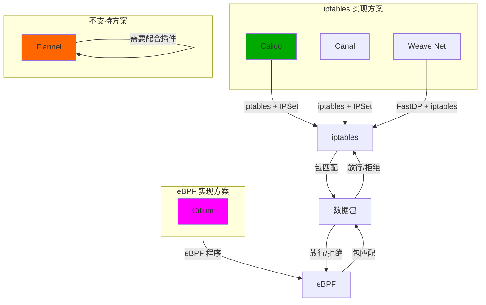

### 4.2 Calico 网络策略实现

#### 4.2.1 架构

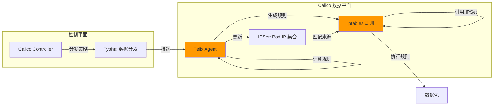

#### 4.2.2 规则生成

**iptables 规则结构**:

```bash
# Chain: KUBE-NWPLCY-6K33P7P
# Policy: allow-frontend-to-backend
# Target Pod: backend (labels: app=backend)

# 1. 检查来源是否在允许的 Pod IPSet
-A KUBE-NWPLCY-6K33P7P7 -m set --match-set KUBE-SRC-G2Q3QYQ3 src \
  -j RETURN

# 2. 检查端口是否匹配
-A KUBE-NWPLCY-6K33P7P7 -p tcp --dport 8080 \
  -j ACCEPT

# 3. 默认拒绝
-A KUBE-NWPLCY-6K33P7P7 -j DROP
```

**IPSet 优势**:
- ✅ 快速匹配大量 IP
- ✅ 减少 iptables 规则数量
- ✅ 易于批量更新

### 4.3 Cilium 网络策略实现

#### 4.3.1 eBPF 实现原理

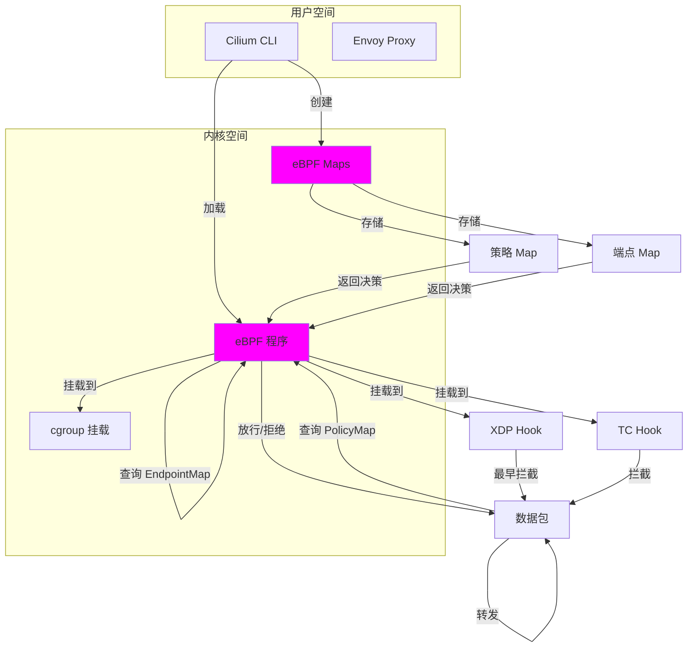

#### 4.3.2 eBPF vs iptables

| 特性 | iptables | eBPF |
|-----|----------|-------|
| **执行位置** | 用户空间 | 内核空间 |
| **性能** | 中等 | 极高 |
| **规则数量** | 受限（线性增长） | 无限制 |
| **更新延迟** | 高（重建规则） | 低（更新 Map） |
| **可观测性** | 有限 | 优秀 |
| **调试难度** | 中等 | 较高 |

**eBPF 优势**:
- ✅ 内核空间执行，无上下文切换
- ✅ 零拷贝，直接访问数据包
- ✅ 精粒度控制
- ✅ 实时更新，无需重建

### 4.4 主流 CNI 支持对比

| CNI | 网络策略支持 | 实现方式 | 性能 | 复杂度 |
|-----|-------------|----------|------|--------|
| **Flannel** | ❌ 不支持 | - | - | - |
| **Calico** | ✅ 支持 | iptables + IPSet | 高 | 中 |
| **Cilium** | ✅ 支持 | eBPF | 极高 | 高 |
| **Weave Net** | ✅ 支持 | iptables + FastDP | 中 | 中 |
| **Canal** | ✅ 支持 | iptables + IPSet | 高 | 中 |
| **Kube-router** | ✅ 支持 | iptables/IPVS | 中 | 中 |

---

## 五、网络策略控制器

### 5.1 控制器工作原理

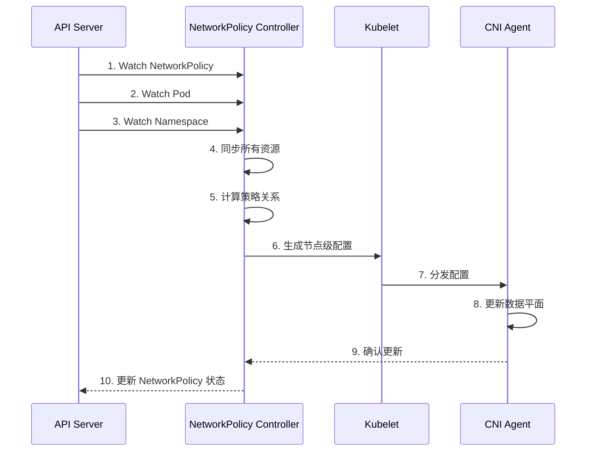

### 5.2 策略计算算法

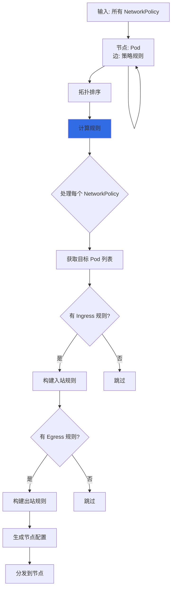

---

## 六、网络策略实战场景

### 6.1 场景1：隔离命名空间

```yaml
# 目标: 生产环境完全隔离
apiVersion: networking.k8s.io/v1
kind: Namespace
metadata:
  name: production
  labels:
    name: production
---
apiVersion: networking.k8s.io/v1
kind: NetworkPolicy
metadata:
  name: default-deny
  namespace: production
spec:
  podSelector: {}  # 选择所有 Pod
  policyTypes:
  - Ingress
  - Egress
  # ingress/egress 为空 → 拒绝所有流量

# 按需添加允许规则
---
apiVersion: networking.k8s.io/v1
kind: NetworkPolicy
metadata:
  name: allow-ns-to-ns
  namespace: production
spec:
  podSelector:
    matchLabels:
      app: web
  policyTypes:
  - Ingress
  ingress:
  - from:
    - namespaceSelector:
        matchLabels:
          name: ingress  # 只允许来自 ingress 命名空间
```

**效果**:
- 默认拒绝所有流量
- 只允许从特定命名空间访问

### 6.2 场景2：分层应用隔离

```yaml
# Frontend 层
apiVersion: networking.k8s.io/v1
kind: NetworkPolicy
metadata:
  name: frontend-policy
  namespace: production
spec:
  podSelector:
    matchLabels:
      tier: frontend
  policyTypes:
  - Ingress
  - Egress
  ingress:
  - from:
    - namespaceSelector:
        matchLabels:
          name: ingress  # 只允许外部流量
  egress:
  - to:
    - podSelector:
        matchLabels:
          tier: backend  # 只能访问 backend
    ports:
    - protocol: TCP
      port: 8080

---
# Backend 层
apiVersion: networking.k8s.io/v1
kind: NetworkPolicy
metadata:
  name: backend-policy
  namespace: production
spec:
  podSelector:
    matchLabels:
      tier: backend
  policyTypes:
  - Ingress
  - Egress
  ingress:
  - from:
    - podSelector:
        matchLabels:
          tier: frontend  # 只允许 frontend
    - namespaceSelector:
        matchLabels:
          name: ingress  # 或外部流量
  egress:
  - to:
    - podSelector:
        matchLabels:
          tier: database  # 只能访问 database
    ports:
    - protocol: TCP
      port: 5432

---
# Database 层
apiVersion: networking.k8s.io/v1
kind: NetworkPolicy
metadata:
  name: database-policy
  namespace: production
spec:
  podSelector:
    matchLabels:
      tier: database
  policyTypes:
  - Ingress
  ingress:
  - from:
    - podSelector:
        matchLabels:
          tier: backend  # 只允许 backend
  egress:
  - to:
    - ipBlock:
        cidr: 0.0.0.0/0  # 允许外部访问（如备份）
    ports:
    - protocol: TCP
      port: 5432
```

**流量路径**:
```
外部 → Frontend → Backend → Database
  ❌       ✅       ✅
```

### 6.3 场景3：多端口服务

```yaml
apiVersion: networking.k8s.io/v1
kind: NetworkPolicy
metadata:
  name: multi-port-policy
spec:
  podSelector:
    matchLabels:
      app: api
  policyTypes:
  - Ingress
  ingress:
  - from:
    - podSelector: {}
    ports:
    # HTTP
    - protocol: TCP
      port: 80
    # HTTPS
    - protocol: TCP
      port: 443
    # gRPC
    - protocol: TCP
      port: 9090
    # 端口范围
    - protocol: TCP
      port: 3000
      endPort: 3010
```

### 6.4 场景4：白名单外部访问

```yaml
apiVersion: networking.k8s.io/v1
kind: NetworkPolicy
metadata:
  name: whitelist-external
spec:
  podSelector:
    matchLabels:
      app: web
  policyTypes:
  - Ingress
  ingress:
  - from:
    # 白名单 IP 段
    - ipBlock:
        cidr: 203.0.113.0/24
    - ipBlock:
        cidr: 192.0.2.0/24
        except:
        - 192.0.2.100/32  # 排除特定 IP
    ports:
    - protocol: TCP
      port: 443
```

---

## 七、故障排查

### 7.1 常见问题

| 问题 | 可能原因 | 解决方案 |
|-----|---------|---------|
| **Pod 无法通信** | 网络策略阻止 | 检查 NetworkPolicy 规则 |
| **策略不生效** | CNI 不支持 | 使用支持策略的 CNI |
| **部分流量被拒绝** | 规则不完整 | 检查端口和来源 |
| **跨命名空间失败** | 缺少 namespaceSelector | 添加正确的选择器 |

### 7.2 排查工具

```bash
# 查看 NetworkPolicy
kubectl get networkpolicies -A
kubectl describe networkpolicy <policy-name>

# 查看 CNI 日志
# Calico
kubectl logs -n kube-system calico-node-xxxxx

# Cilium
kubectl logs -n kube-system cilium-xxxxx

# 查看 iptables 规则
iptables -L KUBE-NWPLCY-xxx -v -n

# 测试网络连通性
kubectl exec -it <pod> -- curl http://<target-pod-ip>:<port>

# 查看 eBPF 程序
cilium bpf policy list
```

### 7.3 排查流程

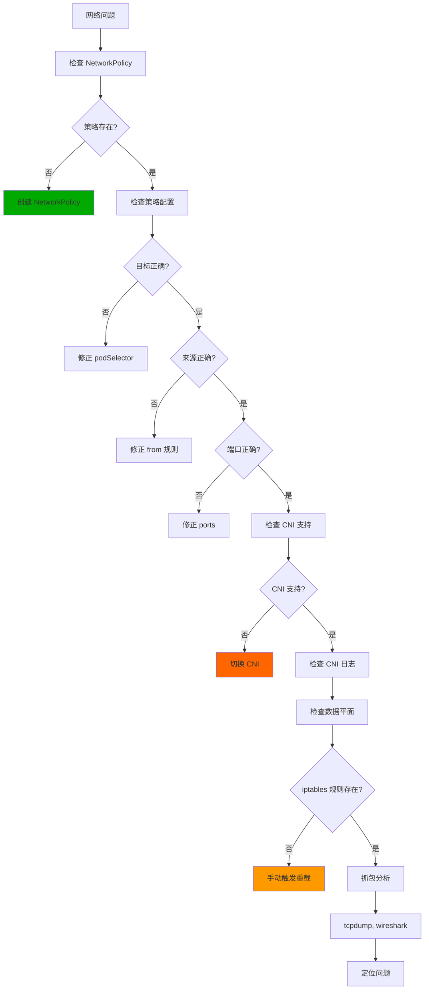

### 7.4 调试技巧

**1. 使用标签测试策略**:
```bash
# 添加调试标签
kubectl label pods <pod> debug-policy=true

# 创建临时策略
cat <<EOF | kubectl apply -f -
apiVersion: networking.k8s.io/v1
kind: NetworkPolicy
metadata:
  name: debug-policy
spec:
  podSelector:
    matchLabels:
      debug-policy: "true"
  ingress:
  - from: []
EOF
```

**2. 临时禁用策略**:
```bash
# 删除策略测试
kubectl delete networkpolicy <policy-name>

# 或使用空规则允许所有
kubectl patch networkpolicy <name> -p '{"spec":{"ingress":[{"from":[]}]}}'
```

**3. 使用网络诊断工具**:
```bash
# Kubernetes 网络诊断
kubectl debug -it <pod> --image=nicolaka/netshoot

# 在调试 Pod 中测试
# nslookup, dig, ping, curl 等工具
```

---

## 八、最佳实践

### 8.1 策略设计原则

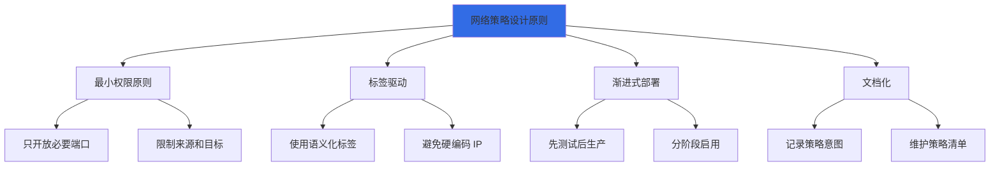

### 8.2 命名空间隔离最佳实践

```yaml
# 1. 默认拒绝所有
apiVersion: networking.k8s.io/v1
kind: NetworkPolicy
metadata:
  name: default-deny-all
  namespace: production
spec:
  podSelector: {}
  policyTypes:
  - Ingress
  - Egress

---
# 2. 允许 DNS (必需)
apiVersion: networking.k8s.io/v1
kind: NetworkPolicy
metadata:
  name: allow-dns
  namespace: production
spec:
  podSelector: {}
  egress:
  - to:
    - namespaceSelector:
        matchLabels:
          k8s-app: kube-dns
    ports:
    - protocol: UDP
      port: 53
---
# 3. 应用特定策略
apiVersion: networking.k8s.io/v1
kind: NetworkPolicy
metadata:
  name: app-specific-policy
  namespace: production
spec:
  podSelector:
    matchLabels:
      app: web
  ingress:
  - from:
    - podSelector:
        matchLabels:
          app: api
```

### 8.3 性能优化

1. **避免过度复杂的规则**:
   - 优先使用标签而不是 IP
   - 合并相似规则
   - 定期清理无用策略

2. **选择高性能 CNI**:
   - 大规模: Calico (IPSet)
   - 高性能: Cilium (eBPF)

3. **监控策略数量**:
   ```bash
   # 查看策略数量
   kubectl get networkpolicies -A --no-headers | wc -l

   # 查看规则总数
   for ns in $(kubectl get ns -o name); do
     kubectl get networkpolicy -n $ns -o jsonpath='{.items[*].spec.ingress}' | jq '.[] | length'
   done
   ```

4. **使用策略工具验证**:
   - `kube-policy-controller`: 模拟和验证
   - `networkpolicy.io`: 可视化
   - `cilium`: 策略可视化

### 8.4 安全最佳实践

1. **零信任模型**:
   ```yaml
   # 默认拒绝所有
   spec:
     podSelector: {}
     policyTypes: [Ingress, Egress]
     # ingress/egress 为空 → 拒绝所有
   ```

2. **分层隔离**:
   - 前端层: 只允许外部 → 后端
   - 后端层: 只允许前端/后端 → 数据库
   - 数据库层: 只允许后端访问

3. **命名空间隔离**:
   - 生产环境完全隔离
   - 开发/测试环境独立
   - 跨命名空间访问显式授权

4. **最小化暴露**:
   - 只开放必要端口
   - 限制来源 IP
   - 定期审计策略

---

## 九、网络策略限制和注意事项

### 9.1 CNI 限制

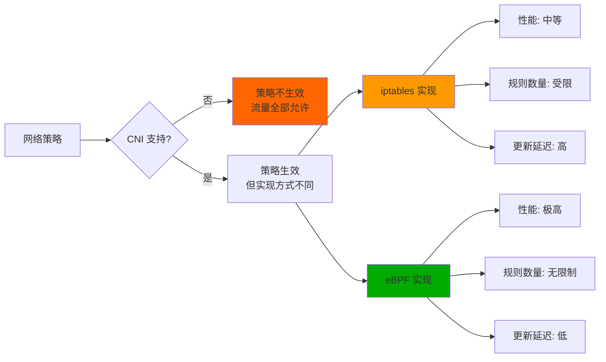

### 9.2 其他限制

| 限制 | 说明 | 影响 |
|-----|------|------|
| **HostNetwork** | Pod 使用 hostNetwork 时，策略可能不生效 | 避免在生产环境使用 |
| **本地回环** | 无法控制 Pod 内的进程间通信 | 应用层控制 |
| **NodePort** | NodePort 流量在策略之前处理 | 配合 Service 策略 |
| **Service** | 策略只控制 Pod IP 流量 | Service IP 需要额外处理 |

### 9.3 最佳建议

1. **选择支持策略的 CNI**:
   - 生产环境: Calico, Cilium, Weave
   - 避免: Flannel (需要配合)

2. **测试策略配置**:
   - 在开发环境验证
   - 使用诊断工具测试
   - 逐步推广到生产

3. **文档化策略**:
   - 记录每个策略的用途
   - 维护策略清单
   - 定期审计和清理

4. **监控和告警**:
   - 监控策略拒绝事件
   - 告警异常流量模式
   - 定期检查策略覆盖率

---

## 十、总结

### 10.1 核心要点

1. **网络策略是零信任模型**
   - 默认允许 → 默认拒绝
   - 白名单模式
   - 显式授权

2. **策略粒度精细**
   - Pod 级别控制
   - 标签驱动
   - 支持端口、协议、方向

3. **CNI 依赖实现**
   - 不是所有 CNI 都支持
   - 实现方式差异大
   - 性能特性不同

4. **声明式管理**
   - GitOps 友好
   - 自动跟随 Pod 变化
   - 版本控制

### 10.2 实践建议

1. **选择合适的 CNI**:
   - 生产稳定: Calico
   - 高性能: Cilium
   - 简单场景: Canal

2. **遵循最佳实践**:
   - 最小权限原则
   - 分层隔离
   - 命名空间隔离

3. **充分测试**:
   - 开发环境验证
   - 诊断工具辅助
   - 逐步部署

4. **持续监控**:
   - 监控策略事件
   - 审计策略配置
   - 定期优化

### 10.3 未来趋势

1. **eBPF 技术普及**
   - Cilium 领头
   - 其他 CNI 集成
   - 性能大幅提升

2. **服务网格集成**
   - NetworkPolicy + Service Mesh
   - 统一流量管理
   - 更精细的控制

3. **自动化策略管理**
   - 基于应用自动生成
   - AI 驱动的策略优化
   - 实时威胁响应

---

## 附录

### A. 参考资源

**官方文档:**
- [网络策略](https://kubernetes.io/docs/concepts/services-networking/network-policies/)
- [策略示例](https://kubernetes.io/docs/concepts/services-networking/network-policies/#default-deny-all-ingress-traffic)

**项目地址:**
- [Calico](https://docs.projectcalico.org/)
- [Cilium](https://docs.cilium.io/)
- [Canal](https://docs.projectcalico.org/docs/canal/)

### B. 版本信息

- **Kubernetes 版本**: 1.25.0
- **NetworkPolicy 版本**: v1
- **文档版本**: 1.0
- **最后更新**: 2026-02-23

---

**文档完成！** 🎉

这个文档涵盖了 Kubernetes 网络策略的所有核心内容，从资源定义到实现，从原理到实战。祝学习愉快！
