# Kubernetes PV/PVC 绑定机制深度分析

## 文档概览

- **文档名称**: Kubernetes PV/PVC 绑定机制深度分析
- **分析版本**: Kubernetes 1.25.0
- **文档状态**: ✅ 完成版
- **创建日期**: 2026-02-23

---

## 一、存储核心概念

### 1.1 PV 和 PVC

**PV (PersistentVolume)**:
- 集群级别的存储资源
- 由管理员手动创建，或由 Provisioner 动态创建
- 代表集群中的实际存储（NFS、iSCSI、Ceph RBD 等）
- 独立于 Pod 的生命周期

**PVC (PersistentVolumeClaim)**:
- 命名空间级别的存储请求
- 由用户创建，用于声明存储需求
- Pod 通过 PVC 挂载存储
- 与 PV 绑定后才能使用

### 1.2 绑定关系

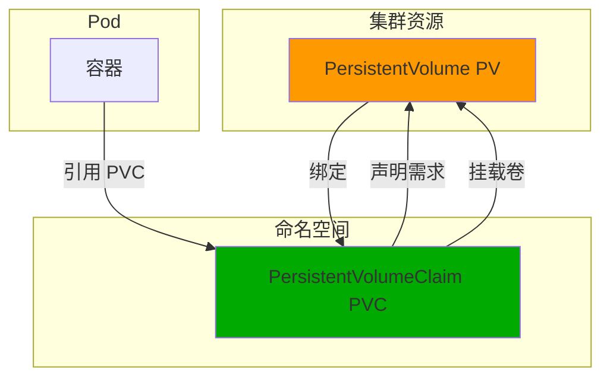

**双向绑定:**
- `pvc.spec.volumeName` → `pv.metadata.name`
- `pv.spec.claimRef` → `pvc` 对象引用

---

## 二、PV 和 PVC 资源结构

### 2.1 PV 资源定义

**源码位置**: `staging/src/k8s.io/api/core/v1/types.go:366`

```go
type PersistentVolume struct {
    metav1.TypeMeta
    metav1.ObjectMeta
    Spec PersistentVolumeSpec
    Status PersistentVolumeStatus
}
```

#### 2.1.1 PV Spec

```go
type PersistentVolumeSpec struct {
    // 容量
    Capacity ResourceList

    // 卷类型（NFS, iSCSI, Ceph RBD 等）
    PersistentVolumeSource

    // 访问模式
    AccessModes []PersistentVolumeAccessMode

    // 绑定的 PVC 引用
    ClaimRef *ObjectReference

    // 回收策略
    PersistentVolumeReclaimPolicy

    // 存储类名称
    StorageClassName string

    // 挂载选项
    MountOptions []string

    // 卷模式（文件系统或块设备）
    VolumeMode *PersistentVolumeMode

    // 节点亲和性
    NodeAffinity *VolumeNodeAffinity
}
```

### 2.2 PVC 资源定义

```go
type PersistentVolumeClaim struct {
    metav1.TypeMeta
    metav1.ObjectMeta
    Spec PersistentVolumeClaimSpec
    Status PersistentVolumeClaimStatus
}
```

#### 2.2.1 PVC Spec

```go
type PersistentVolumeClaimSpec struct {
    // 访问模式
    AccessModes []PersistentVolumeAccessMode

    // 资源请求
    Resources ResourceRequirements

    // 绑定的 PV 名称
    VolumeName string

    // 存储类名称
    StorageClassName string

    // 卷模式
    VolumeMode *PersistentVolumeMode
}
```

### 2.3 访问模式

```go
const (
    // 读写单节点
    ReadWriteOnce PersistentVolumeAccessMode = "ReadWriteOnce"

    // 只读多节点
    ReadOnlyMany PersistentVolumeAccessMode = "ReadOnlyMany"

    // 读写多节点
    ReadWriteMany PersistentVolumeAccessMode = "ReadWriteMany"
)
```

| 访问模式 | 说明 | 适用场景 |
|---------|------|---------|
| **ReadWriteOnce** | 读写，只能被单个节点挂载 | AWS EBS、GCE PD |
| **ReadOnlyMany** | 只读，可被多个节点挂载 | NFS |
| **ReadWriteMany** | 读写，可被多个节点挂载 | NFS、CephFS |

### 2.4 回收策略

```go
const (
    Retain PersistentVolumeReclaimPolicy = "Retain"  // 手动清理
    Delete PersistentVolumeReclaimPolicy = "Delete"  // 自动删除
    // Recycle 已废弃
)
```

| 策略 | PV 被删除后 |
|------|-------------|
| **Retain** | 数据保留，需要手动清理 |
| **Delete** | PV 和底层存储自动删除 |

---

## 三、PV Controller 工作原理

### 3.1 Controller 架构

**源码位置**: `pkg/controller/volume/persistentvolume/pv_controller.go`

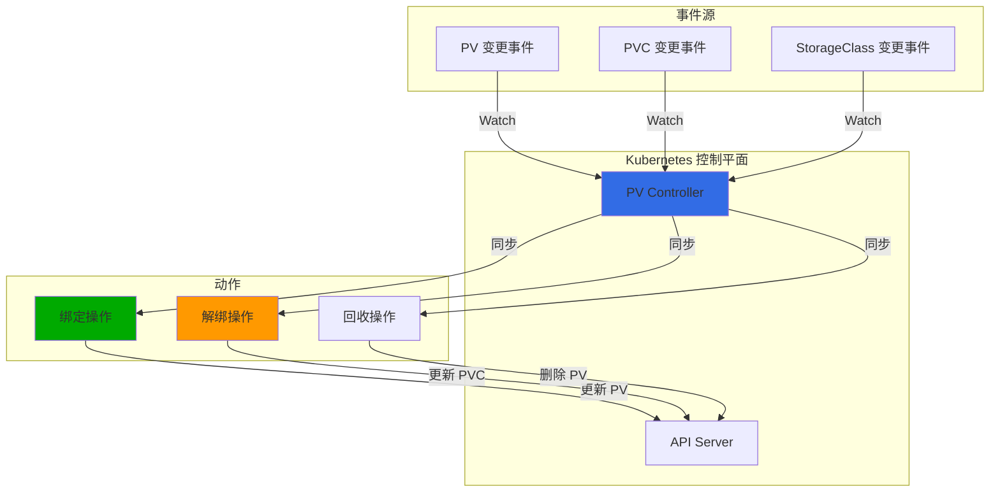

### 3.2 PV Controller 核心逻辑

**源码位置**: `pkg/controller/volume/persistentvolume/pv_controller.go`

**核心思想:**
```go
// PV Controller 使用"空间穿梭"风格编写
// 确保每个分支和条件都被考虑和记录
```

**主要功能:**
1. **同步 PV 和 PVC 状态**
2. **绑定未绑定的 PV 和 PVC**
3. **处理 PV 的回收**
4. **管理 PV 保护**

---

## 四、绑定机制详解

### 4.1 绑定算法流程

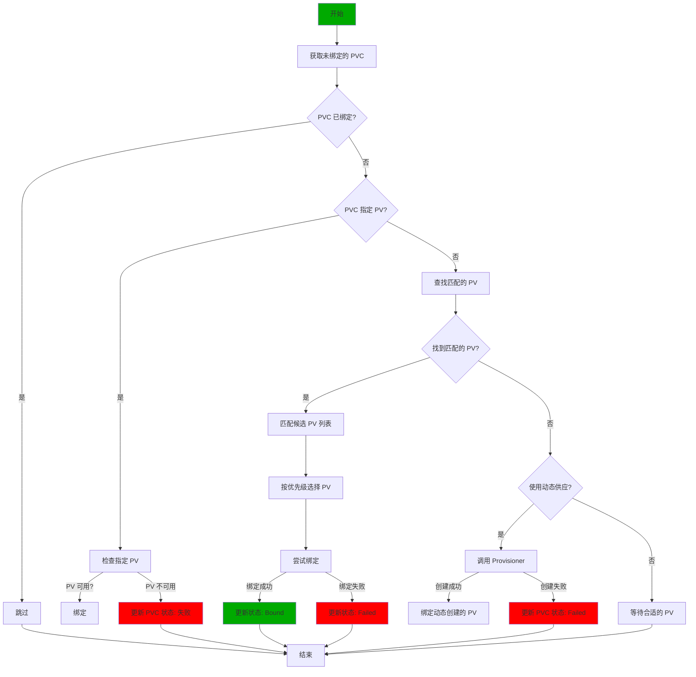

### 4.2 PV 匹配规则

**源码逻辑:**
```go
// 检查 PV 是否与 PVC 匹配
func checkVolumeSufficientCapacity(pv *v1.PersistentVolume, pvc *v1.PersistentVolumeClaim) (bool, error) {
    // 1. 检查容量
    if pv.Spec.Capacity[v1.ResourceStorage].Cmp(pvc.Spec.Resources.Requests[v1.ResourceStorage]) < 0 {
        return false, fmt.Errorf("insufficient capacity")
    }

    // 2. 检查访问模式
    if !checkAccessModes(pv.Spec.AccessModes, pvc.Spec.AccessModes) {
        return false, fmt.Errorf("access modes do not match")
    }

    // 3. 检查存储类
    if pv.Spec.StorageClassName != pvc.Spec.StorageClassName {
        return false, fmt.Errorf("storage class does not match")
    }

    // 4. 检查卷模式
    if pv.Spec.VolumeMode != pvc.Spec.VolumeMode {
        return false, fmt.Errorf("volume mode does not match")
    }

    return true, nil
}
```

### 4.3 绑定步骤

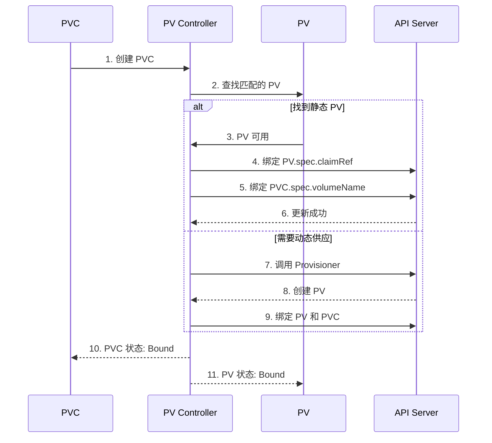

---

## 五、静态卷供应

### 5.1 静态卷供应流程

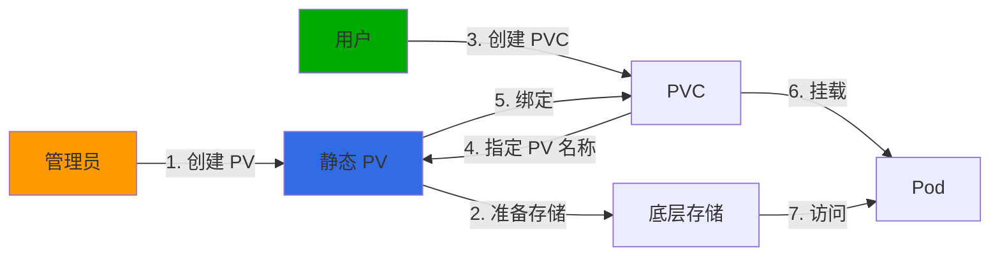

### 5.2 静态 PV 示例

**创建 PV:**
```yaml
apiVersion: v1
kind: PersistentVolume
metadata:
  name: nfs-pv
spec:
  capacity:
    storage: 10Gi
  accessModes:
  - ReadWriteMany
  nfs:
    server: 192.168.1.100
    path: /data/nfs
  storageClassName: nfs-storage
```

**创建 PVC:**
```yaml
apiVersion: v1
kind: PersistentVolumeClaim
metadata:
  name: nfs-pvc
  namespace: default
spec:
  accessModes:
  - ReadWriteMany
  resources:
    requests:
      storage: 5Gi
  volumeName: nfs-pv  # 指定 PV 名称
  storageClassName: nfs-storage
```

**Pod 使用:**
```yaml
apiVersion: v1
kind: Pod
metadata:
  name: app-pod
spec:
  volumes:
  - name: nfs-volume
    persistentVolumeClaim:
      claimName: nfs-pvc
  containers:
  - name: app
    image: nginx
    volumeMounts:
    - name: nfs-volume
      mountPath: /data
```

---

## 六、动态卷供应

### 6.1 动态供应架构

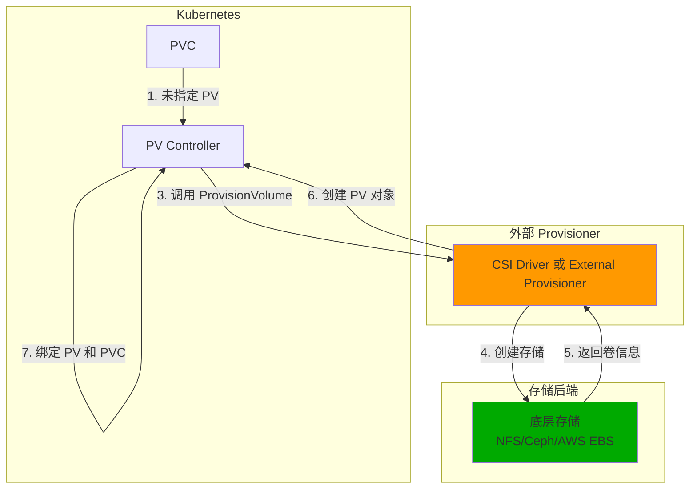

### 6.2 StorageClass

**StorageClass 定义:**
```yaml
apiVersion: storage.k8s.io/v1
kind: StorageClass
metadata:
  name: fast-storage
provisioner: ceph.com/rbd  # Provisioner 名称
parameters:
  type: gp2
  fsType: ext4
  pool: rbd
allowVolumeExpansion: true
reclaimPolicy: Delete
volumeBindingMode: Immediate
```

**参数说明:**
- `provisioner`: Provisioner 插件名称
- `parameters`: 传递给 Provisioner 的参数
- `reclaimPolicy`: PV 回收策略
- `allowVolumeExpansion`: 是否允许扩容
- `volumeBindingMode`: 绑定模式（Immediate/WaitForFirstConsumer）

### 6.3 动态供应流程

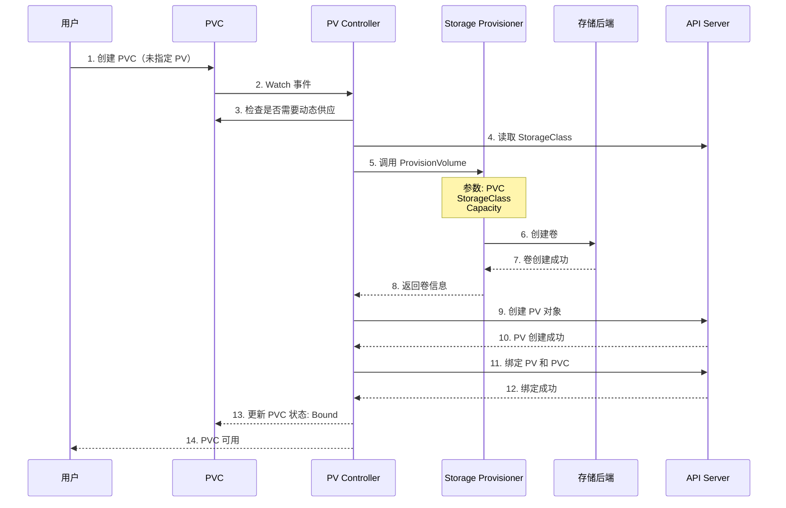

### 6.4 动态供应示例

**StorageClass:**
```yaml
apiVersion: storage.k8s.io/v1
kind: StorageClass
metadata:
  name: ebs-sc
provisioner: kubernetes.io/aws-ebs
parameters:
  type: gp2
  encrypted: "true"
reclaimPolicy: Delete
volumeBindingMode: WaitForFirstConsumer
```

**PVC:**
```yaml
apiVersion: v1
kind: PersistentVolumeClaim
metadata:
  name: ebs-pvc
  namespace: default
spec:
  accessModes:
  - ReadWriteOnce
  storageClassName: ebs-sc  # 引用 StorageClass
  resources:
    requests:
      storage: 10Gi
```

**自动创建:**
```yaml
# Kubernetes 自动创建的 PV
apiVersion: v1
kind: PersistentVolume
metadata:
  name: pvc-ebs-pvc-xxx  # 自动生成名称
  annotations:
    pv.kubernetes.io/provisioned-by: kubernetes.io/aws-ebs
spec:
  capacity:
    storage: 10Gi
  accessModes:
  - ReadWriteOnce
  persistentVolumeReclaimPolicy: Delete
  storageClassName: ebs-sc
  claimRef:
    name: ebs-pvc
    namespace: default
  awsElasticBlockStore:
    volumeID: vol-01234567890abcdef
```

---

## 七、回收机制

### 7.1 回收策略详解

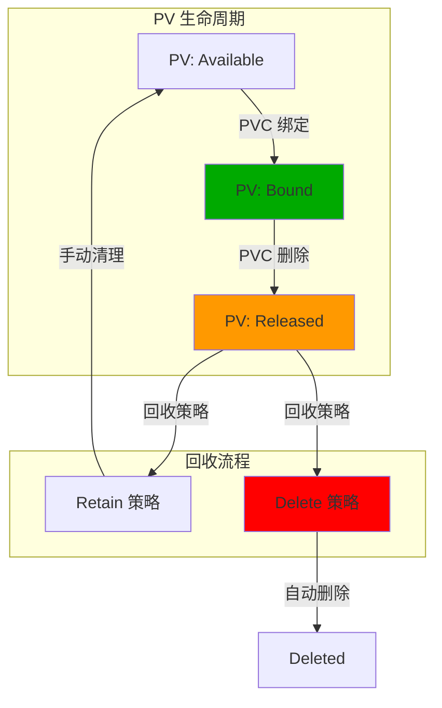

### 7.2 Retain 策略

**流程:**
```
1. PVC 删除
2. PV 状态变为 Released
3. 数据保留
4. 需要手动清理:
   - 删除 PV
   - 或重新绑定到其他 PVC
```

**手动清理步骤:**
```bash
# 1. 删除 PVC
kubectl delete pvc my-pvc

# 2. 查看已释放的 PV
kubectl get pv

# NAME    CAPACITY   ACCESS MODES   RECLAIM POLICY   STATUS      CLAIM
# my-pv   10Gi       RWO           Retain       Released     default/my-pvc

# 3. 删除底层存储（根据后端）
# 例如: 删除 EBS 卷
aws ec2 delete-volume --volume-id vol-01234567890

# 4. 删除 PV
kubectl delete pv my-pv
```

### 7.3 Delete 策略

**流程:**
```
1. PVC 删除
2. PV 状态变为 Released
3. PV Controller 调用 Provisioner
4. 删除底层存储
5. 删除 PV 对象
```

**自动清理！**

### 7.4 回收策略对比

| 策略 | 手动操作 | 数据安全 | 适用场景 |
|------|---------|---------|---------|
| **Retain** | 需要 | 高（需要确认） | 生产环境、重要数据 |
| **Delete** | 不需要 | 中（需备份） | 测试环境、临时数据 |

---

## 八、PV 保护

### 8.1 PV 保护机制

**PV 保护**防止在 Pod 使用时意外删除 PV。

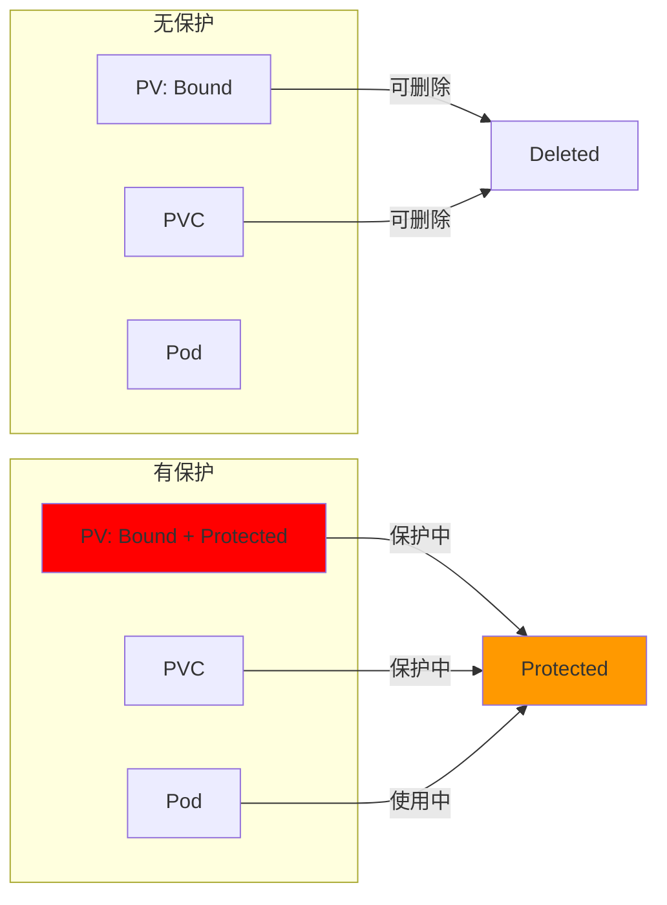

### 8.2 保护条件

**PV 被保护的条件:**
```go
// PV 保护状态
if pv.Status.Phase == v1.VolumeBound &&
   pv.Spec.ClaimRef != nil &&
   isPodUsingPVC(pv.Spec.ClaimRef) {
    return true  // PV 被保护
}
```

### 8.3 保护行为

| 操作 | 无保护 | 有保护 |
|-----|--------|--------|
| **删除 PV** | 立即删除 | 拒绝，返回错误 |
| **修改 PV** | 允许 | 拒绝，返回错误 |
| **删除 PVC** | 解绑 PV | 拒绝，返回错误 |

**错误示例:**
```bash
# 尝试删除被保护的 PV
$ kubectl delete pv my-pv
Error from server (Conflict): Cannot delete PersistentVolume "my-pv" because it is being used.
```

---

## 九、节点亲和性

### 9.1 PV 节点亲和性

**PV 节点亲和性**限制哪些节点可以访问 PV。

```go
type VolumeNodeAffinity struct {
    Required *NodeSelector
    Preferred []NodeSelectorTerm
}
```

### 9.2 亲和性规则

```yaml
apiVersion: v1
kind: PersistentVolume
metadata:
  name: local-pv
spec:
  capacity:
    storage: 10Gi
  accessModes:
  - ReadWriteOnce
  persistentVolumeReclaimPolicy: Retain
  storageClassName: local-storage
  local:
    path: /mnt/disks/ssd1
  nodeAffinity:
    required:
      nodeSelectorTerms:
      - matchExpressions:
        - key: kubernetes.io/hostname
          operator: In
          values:
          - node-1
```

**效果:**
- PV 只能被 `node-1` 访问
- Pod 如果调度到其他节点，无法挂载此 PV

### 9.3 使用场景

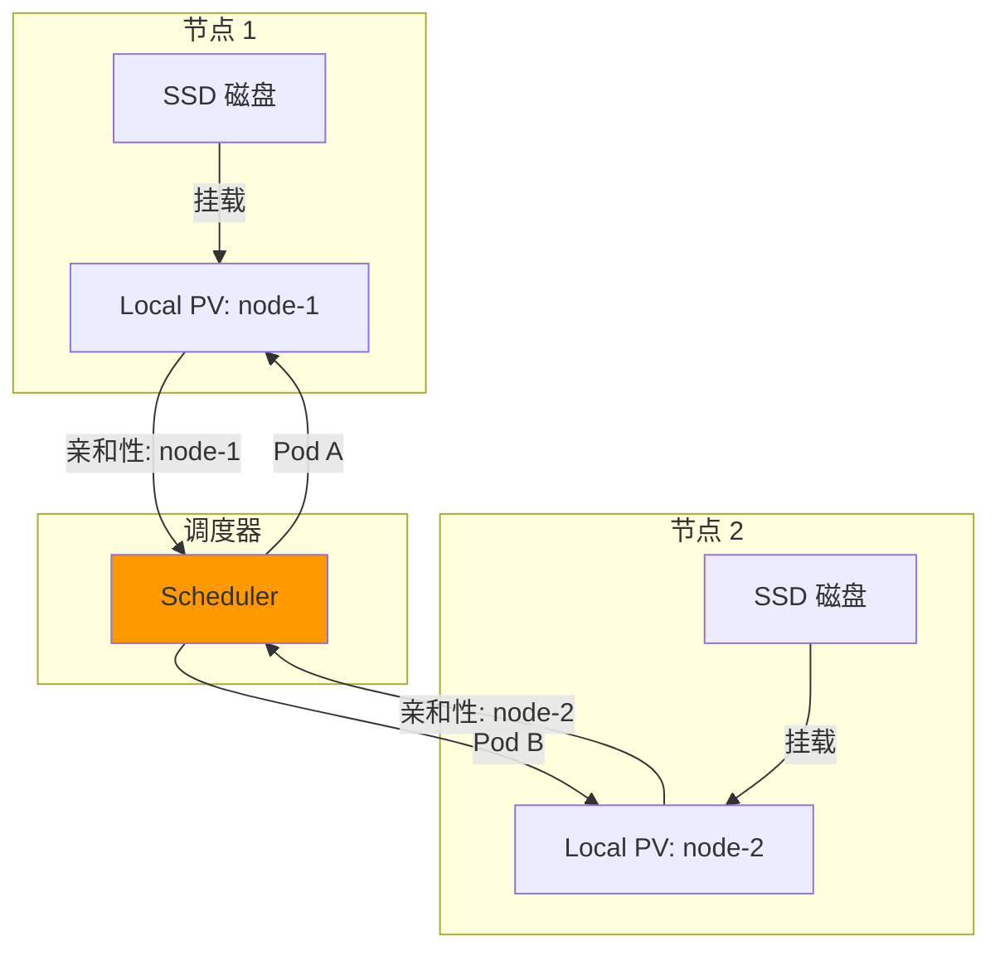

**典型场景:**
- **本地存储**: 每个节点的本地磁盘
- **SSD 存储**: 只在特定节点提供的高性能存储
- **区域感知**: PV 只在特定区域可用

---

## 十、故障排查

### 10.1 常见问题

| 问题 | 可能原因 | 解决方案 |
|-----|---------|---------|
| **PVC 挂载 Pending** | 没有匹配的 PV | 检查容量、访问模式、存储类 |
| **动态供应失败** | Provisioner 不可用 | 检查 Provisioner 日志和配置 |
| **PV 无法删除** | PV 被保护 | 删除使用 PV 的 Pod |
| **绑定失败** | 节点亲和性不匹配 | 检查 PV 亲和性规则 |
| **回收失败** | Provisioner 不支持回收 | 检查回收策略实现 |

### 10.2 排查工具

```bash
# 查看 PV 状态
kubectl get pv -o wide

# 查看 PVC 状态
kubectl get pvc -o wide

# 查看 PVC 详情
kubectl describe pvc <pvc-name>

# 查看 PV 详情
kubectl describe pv <pv-name>

# 查看 PVC 事件
kubectl get events --field-selector involvedObject.name=<pvc-name>

# 查看 PV Controller 日志
kubectl logs -n kube-system <pv-controller-pod> | grep -i error

# 检查 StorageClass
kubectl get storageclass
```

### 10.3 调试流程

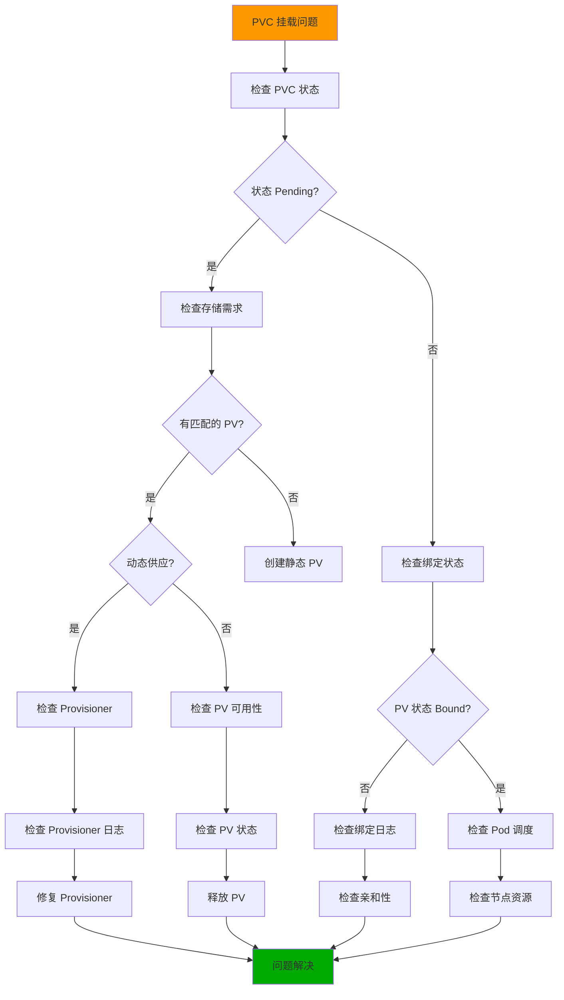

---

## 十一、最佳实践

### 11.1 设计原则

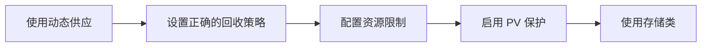

**核心原则:**
1. **优先使用动态供应**: 减少手动管理
2. **合理设置回收策略**: 根据数据重要性选择
3. **启用资源限制**: 防止无限申请存储
4. **使用 PV 保护**: 防止意外删除
5. **标准化存储类**: 统一管理不同类型的存储

### 11.2 生产环境配置

#### 11.2.1 存储类配置

**快速 SSD:**
```yaml
apiVersion: storage.k8s.io/v1
kind: StorageClass
metadata:
  name: fast-ssd
provisioner: kubernetes.io/aws-ebs
parameters:
  type: gp3
  iopsPerGB: "100"
  encrypted: "true"
reclaimPolicy: Delete
allowVolumeExpansion: true
volumeBindingMode: WaitForFirstConsumer
```

**标准 HDD:**
```yaml
apiVersion: storage.k8s.io/v1
kind: StorageClass
metadata:
  name: standard-hdd
provisioner: kubernetes.io/aws-ebs
parameters:
  type: st1
reclaimPolicy: Retain
allowVolumeExpansion: false
volumeBindingMode: Immediate
```

#### 11.2.2 PVC 配置

**生产数据库:**
```yaml
apiVersion: v1
kind: PersistentVolumeClaim
metadata:
  name: database-pvc
  namespace: production
spec:
  accessModes:
  - ReadWriteOnce
  storageClassName: fast-ssd
  resources:
    requests:
      storage: 100Gi
    limits:
      storage: 200Gi  # 设置上限
```

**测试环境:**
```yaml
apiVersion: v1
kind: PersistentVolumeClaim
metadata:
  name: test-pvc
  namespace: staging
spec:
  accessModes:
  - ReadWriteOnce
  storageClassName: standard-hdd
  resources:
    requests:
      storage: 10Gi
```

### 11.3 性能优化

1. **选择合适的存储类型**
   - 数据库: 高 IOPS（SSD）
   - 应用程序: 标准 SSD
   - 日志/缓存: 标准 HDD

2. **设置正确的 IOPS**
   ```yaml
   parameters:
     type: gp3
     iopsPerGB: "100"  # 100 IOPS/GB
   ```

3. **使用本地存储（低延迟）**
   - Node-Local PV
   - 节点亲和性
   - 适合低延迟应用

### 11.4 安全最佳实践

1. **生产环境使用 Retain**
   - 防止意外删除
   - 手动确认后清理

2. **测试环境使用 Delete**
   - 自动清理
   - 减少手动操作

3. **启用 PV 保护**
   - 防止 Pod 使用时删除
   - 生产环境推荐

4. **加密敏感数据**
   ```yaml
   parameters:
     encrypted: "true"
   ```

---

## 十二、总结

### 12.1 核心要点

1. **PV 是集群级别，PVC 是命名空间级别**
   - PV: 由管理员或动态供应创建
   - PVC: 由用户创建声明存储需求
   - 通过双向绑定关联

2. **静态供应 vs 动态供应**
   - 静态: 手动创建 PV，PVC 指定
   - 动态: PVC 引用 StorageClass，自动创建 PV

3. **绑定算法匹配多个维度**
   - 容量（Capacity）
   - 访问模式（AccessModes）
   - 存储类（StorageClass）
   - 卷模式（VolumeMode）
   - 节点亲和性（NodeAffinity）

4. **回收策略定义 PV 删除行为**
   - Retain: 数据保留，手动清理
   - Delete: 自动删除存储

5. **PV 保护防止意外删除**
   - Pod 使用时 PV 被保护
   - 需要先删除 Pod

### 12.2 与其他存储机制对比

| 特性 | PV/PVC | ConfigMap | Secret | EmptyDir |
|-----|---------|----------|--------|----------|
| **数据持久化** | ✅ | ❌ | ❌ | ❌ |
| **容量** | 可指定 | 小 | 小 | 节点临时 |
| **生命周期** | 独立 Pod | 集群级别 | 命名空间级别 | Pod 级别 |
| **动态供应** | ✅ | ❌ | ❌ | ❌ |
| **访问模式** | 多种 | 只读 | 只读 | 读写 |

### 12.3 未来趋势

1. **CSI (Container Storage Interface) 主导**
   - 统一存储接口
   - 丰富的存储后端
   - 动态供应标准化

2. **卷扩容**
   - 原生支持扩容 PVC
   - 自动扩展底层存储
   - 需要文件系统支持

3. **快照和克隆**
   - CSI 原生支持快照
   - 快速创建新卷
   - 备份和恢复

---

## 附录

### A. 参考资源

**官方文档:**
- [持久化存储](https://kubernetes.io/docs/concepts/storage/persistent-volumes/)
- [存储类](https://kubernetes.io/docs/concepts/storage/storage-classes/)
- [动态卷供应](https://kubernetes.io/docs/concepts/storage/dynamic-provisioning/)

**项目地址:**
- [PV Controller](https://github.com/kubernetes/kubernetes/tree/master/pkg/controller/volume/persistentvolume)
- [External Provisioner](https://github.com/kubernetes-sigs/sig-storage-lib-external-provisioner)

### B. 版本信息

- **Kubernetes 版本**: 1.25.0
- **存储 API 版本**: v1
- **文档版本**: 1.0
- **最后更新**: 2026-02-23

---

**文档完成！** 🎉

这个文档涵盖了 Kubernetes PV/PVC 绑定机制的所有核心内容，从资源定义到工作原理，从静态供应到动态供应，从回收机制到故障排查。祝学习愉快！
