# Kubernetes Service 网络机制深入分析

## 概述

Service 是 Kubernetes 中实现服务发现和负载均衡的核心抽象，它为一组 Pod 提供稳定的网络访问入口。本文档深入分析 Service 的网络实现机制，包括 kube-proxy 的工作原理、不同代理模式的实现细节，以及与 Endpoints/EndpointSlice 的协作机制。

## 1. Service 网络架构总览

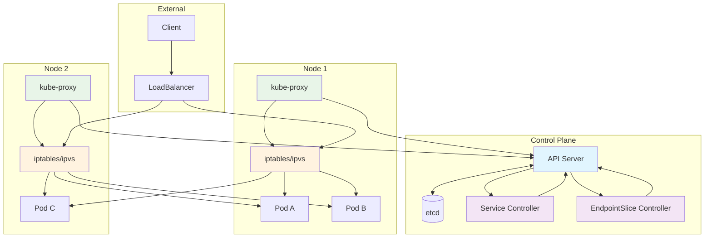

## 2. Service 类型和网络实现

### 2.1 ClusterIP Service
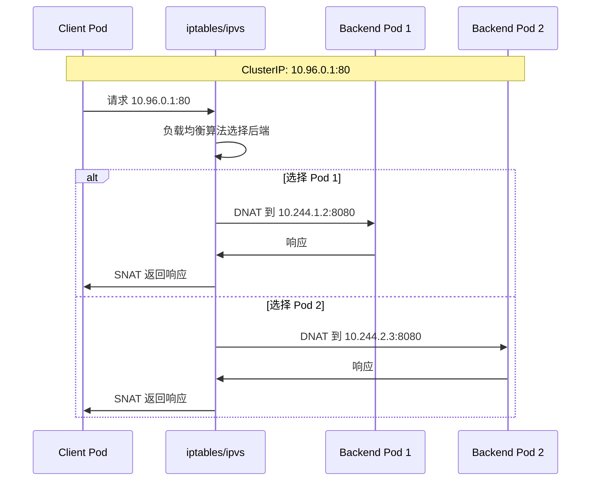

### 2.2 NodePort Service
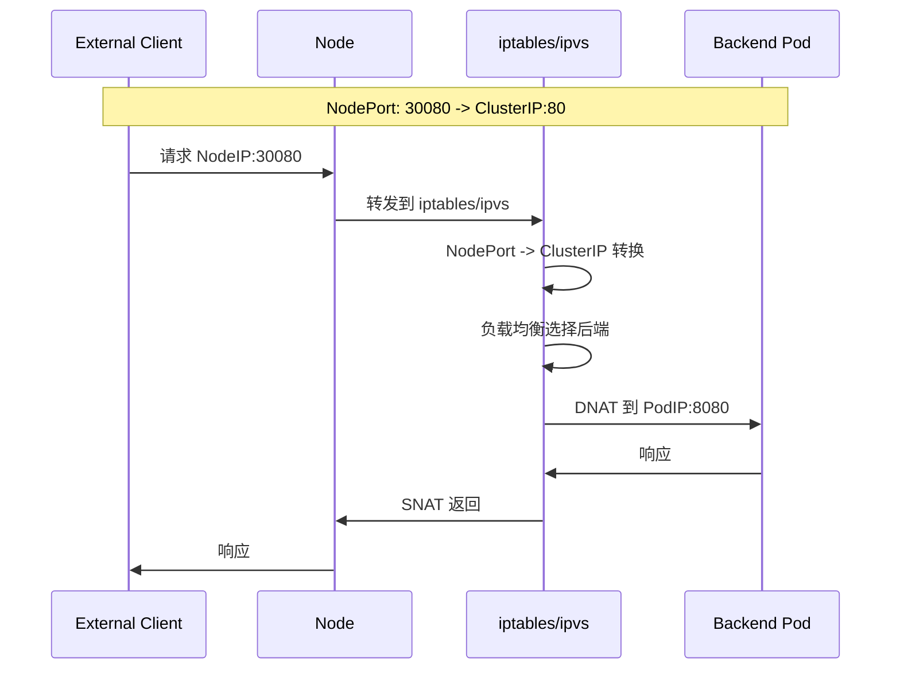

### 2.3 LoadBalancer Service
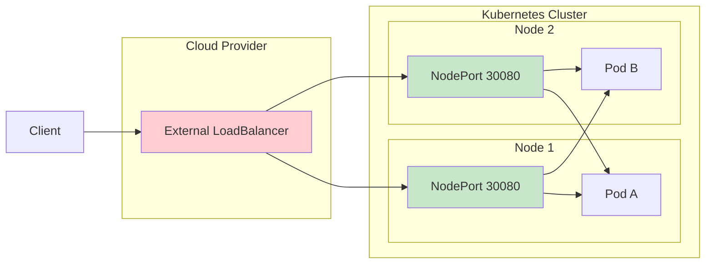

## 3. kube-proxy 核心实现

### 3.1 kube-proxy 架构
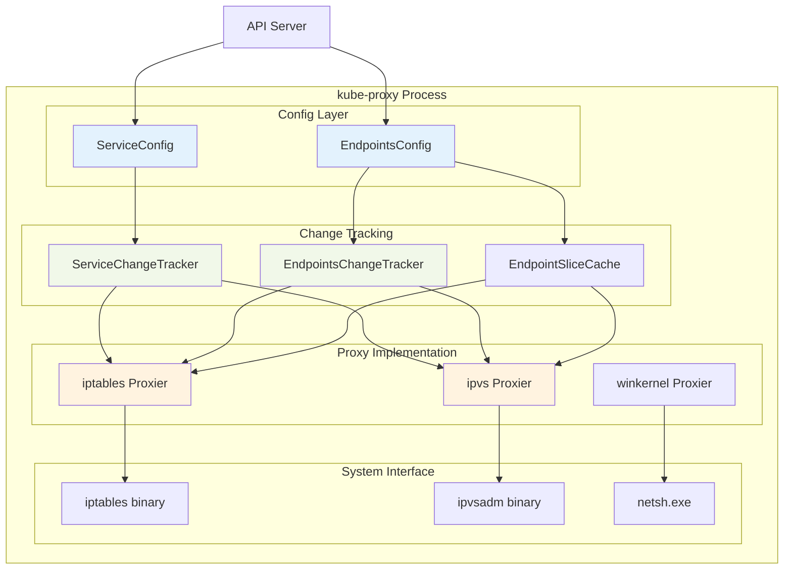

### 3.2 关键数据结构

```go
// Provider 是所有代理实现的核心接口
type Provider interface {
    config.EndpointSliceHandler
    config.ServiceHandler
    config.NodeTopologyHandler
    config.ServiceCIDRHandler
    
    Sync()     // 立即同步当前状态到代理规则
    SyncLoop() // 运行周期性工作循环
}

// ServicePortName 是负载均衡服务的唯一标识符
type ServicePortName struct {
    types.NamespacedName
    Port     string
    Protocol v1.Protocol
}

// ServiceChangeTracker 跟踪 Service 的变更
type ServiceChangeTracker struct {
    lock sync.Mutex
    items map[types.NamespacedName]*serviceChange
    makeServiceInfo makeServicePortFunc
    processServiceMapChange processServiceMapChangeFunc
    ipFamily v1.IPFamily
}
```

## 4. iptables 代理模式详解

### 4.1 iptables 规则链结构
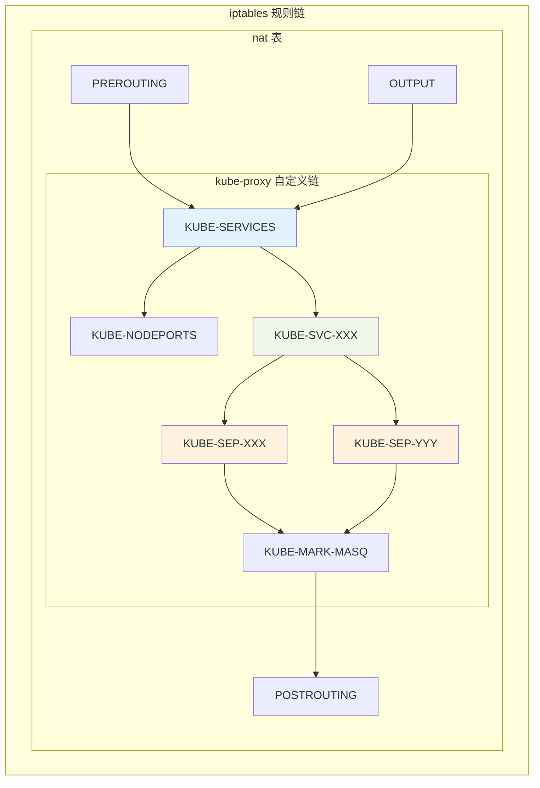

### 4.2 iptables 规则生成流程
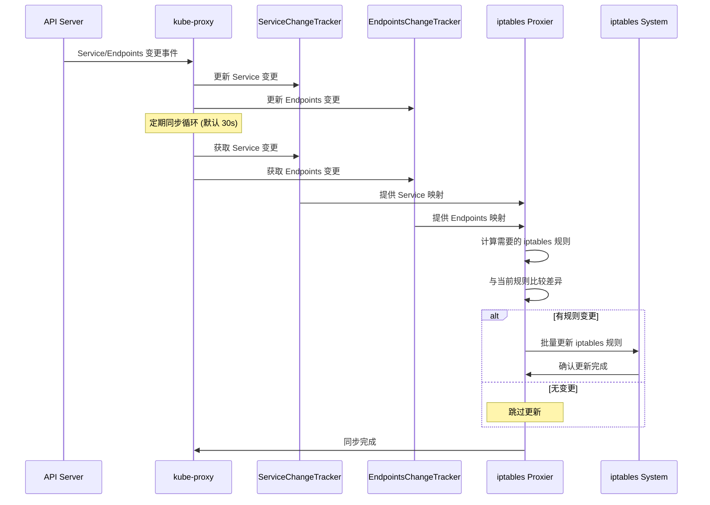

### 4.3 具体 iptables 规则示例

#### ClusterIP Service 规则
```bash
# 主服务链 - 所有流量入口
-A KUBE-SERVICES -m comment --comment "ns1/svc1:p80 cluster IP" \
   -m tcp -p tcp -d 10.20.30.41 --dport 80 -j KUBE-SVC-XPGD46QRK7WJZT7O

# 服务端点分发链 - 负载均衡
-A KUBE-SVC-XPGD46QRK7WJZT7O -m comment --comment "ns1/svc1:p80" \
   -m statistic --mode random --probability 0.50000000000 -j KUBE-SEP-SXIVWICOYRO3J4NJ
-A KUBE-SVC-XPGD46QRK7WJZT7O -m comment --comment "ns1/svc1:p80" \
   -j KUBE-SEP-AAAAAAAAAAAAAAAA

# 具体端点规则 - DNAT 到 Pod
-A KUBE-SEP-SXIVWICOYRO3J4NJ -s 10.244.1.2/32 -m comment --comment "ns1/svc1:p80" \
   -j KUBE-MARK-MASQ
-A KUBE-SEP-SXIVWICOYRO3J4NJ -p tcp -m comment --comment "ns1/svc1:p80" \
   -m tcp -j DNAT --to-destination 10.244.1.2:8080
```

#### NodePort Service 规则
```bash
# NodePort 入口链
-A KUBE-NODEPORTS -p tcp -m comment --comment "ns1/svc1:p80" \
   -m tcp --dport 30080 -j KUBE-EXT-XPGD46QRK7WJZT7O

# 外部流量处理
-A KUBE-EXT-XPGD46QRK7WJZT7O -m comment --comment "masquerade traffic for ns1/svc1:p80 external destinations" \
   -j KUBE-MARK-MASQ
-A KUBE-EXT-XPGD46QRK7WJZT7O -j KUBE-SVC-XPGD46QRK7WJZT7O

# MASQUERADE 标记处理
-A KUBE-MARK-MASQ -j MARK --set-xmark 0x4000/0x4000
-A KUBE-POSTROUTING -m comment --comment "kubernetes service traffic requiring SNAT" \
   -m mark --mark 0x4000/0x4000 -j MASQUERADE
```

## 5. IPVS 代理模式详解

### 5.1 IPVS vs iptables 对比
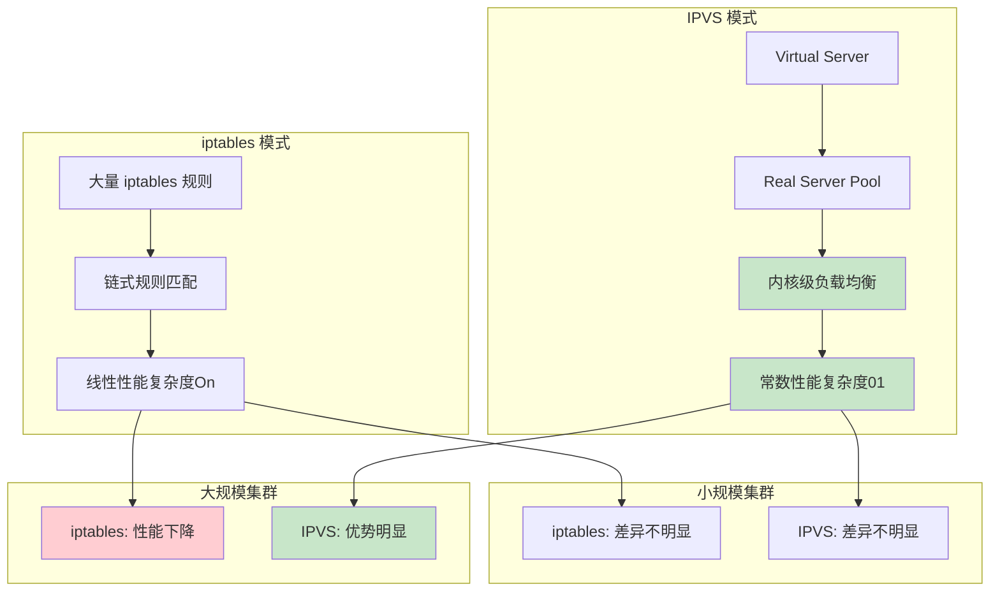

### 5.2 IPVS 负载均衡算法
```go
// IPVS 支持的调度算法
const (
    RoundRobin    = "rr"    // 轮询
    LeastConn     = "lc"    // 最少连接
    DestHash      = "dh"    // 目标哈希
    SourceHash    = "sh"    // 源哈希
    ShortestExp   = "sed"   // 最短期望延迟
    NeverQueue    = "nq"    // 从不排队
)
```

## 6. EndpointSlice 机制

### 6.1 Endpoints vs EndpointSlice
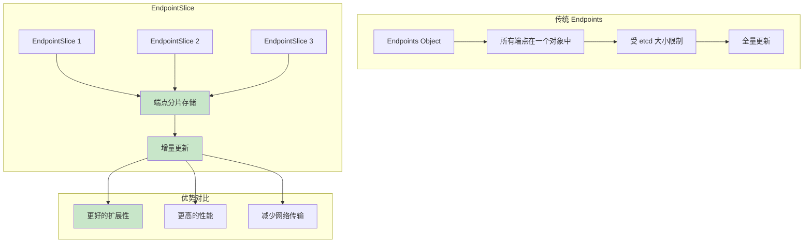

### 6.2 EndpointSlice 控制器工作流程
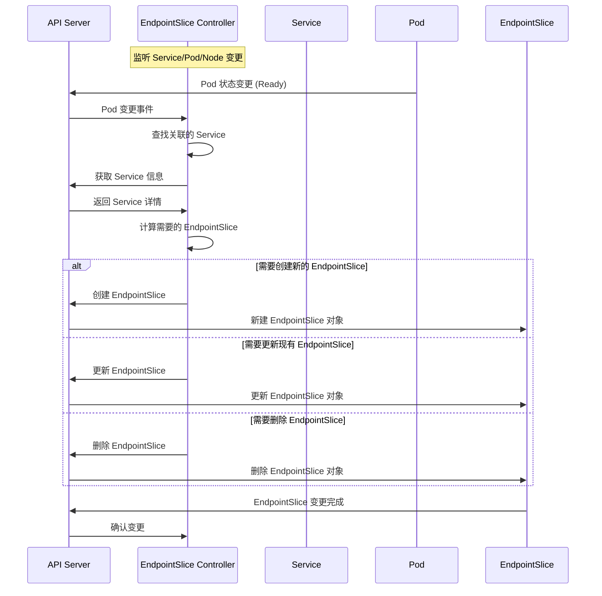

### 6.3 EndpointSlice 分片策略
```go
// EndpointSlice 分片配置
const (
    // 每个 EndpointSlice 最大端点数
    MaxEndpointsPerSlice = 100
    
    // 控制器标识
    ControllerName = "endpointslice-controller.k8s.io"
    
    // 最大重试次数
    maxRetries = 15
    
    // 最小同步延迟
    endpointSliceChangeMinSyncDelay = 1 * time.Second
)
```

## 7. Service 网络流量路径分析

### 7.1 Pod 到 Service 的完整流量路径
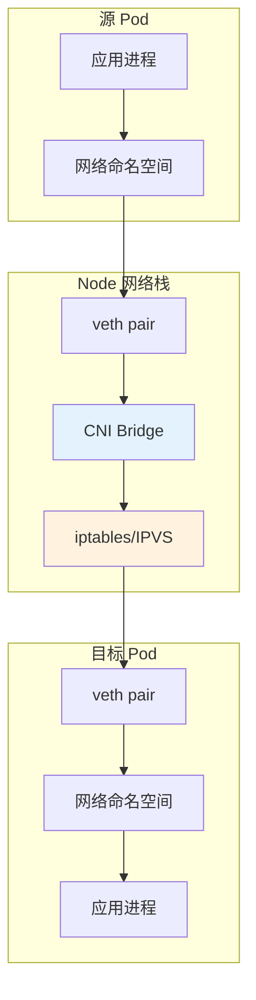

### 7.2 外部流量到 Service 的路径
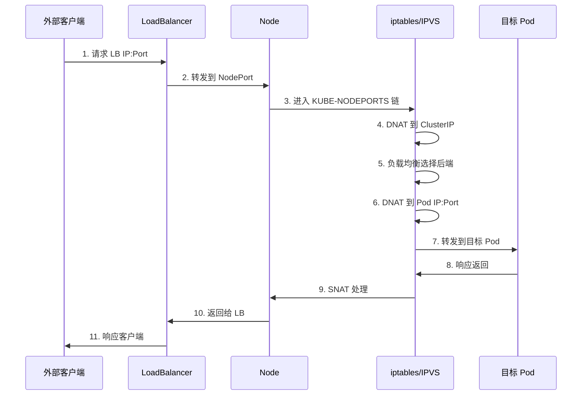

## 8. 网络策略和流量控制

### 8.1 ExternalTrafficPolicy 影响
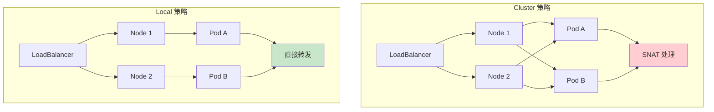

### 8.2 会话亲和性 (Session Affinity)
```go
// Service 会话亲和性配置
type ServiceSpec struct {
    SessionAffinity v1.ServiceAffinity `json:"sessionAffinity,omitempty"`
    SessionAffinityConfig *v1.SessionAffinityConfig `json:"sessionAffinityConfig,omitempty"`
}

// 支持的亲和性类型
const (
    ServiceAffinityNone     ServiceAffinity = "None"
    ServiceAffinityClientIP ServiceAffinity = "ClientIP"
)
```

## 9. 性能优化和故障排查

### 9.1 大规模集群优化
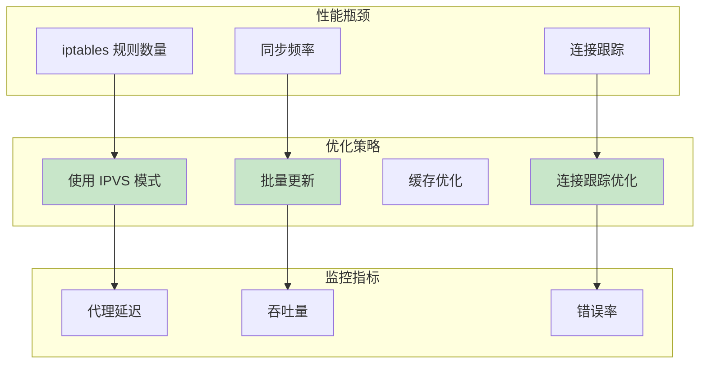

### 9.2 常见故障排查
```bash
# 检查 kube-proxy 状态
kubectl get pods -n kube-system -l k8s-app=kube-proxy

# 查看 kube-proxy 日志
kubectl logs -n kube-system -l k8s-app=kube-proxy

# 检查 iptables 规则
sudo iptables -t nat -L KUBE-SERVICES -n

# 检查 IPVS 规则 (如果使用 IPVS 模式)
sudo ipvsadm -L -n

# 检查 EndpointSlice
kubectl get endpointslices -A

# 测试 Service 连通性
kubectl run test-pod --image=busybox --rm -it -- nslookup my-service
```

## 10. 总结

Service 网络机制是 Kubernetes 中最复杂的组件之一，涉及多个层面的协作：

### 核心组件协作
- **API Server**: 存储 Service/EndpointSlice 配置
- **EndpointSlice Controller**: 维护端点映射关系
- **kube-proxy**: 实现具体的网络代理规则
- **CNI**: 提供底层网络连通性

### 关键技术特点
- **声明式配置**: Service 定义期望状态
- **自动服务发现**: DNS 和环境变量注入
- **负载均衡**: 多种算法支持
- **高可用性**: 多端点故障转移

### 性能考量
- **小规模集群**: iptables 和 IPVS 性能相近
- **大规模集群**: IPVS 具有明显优势
- **网络延迟**: 代理层增加少量延迟
- **连接跟踪**: 需要合理配置以避免瓶颈

通过深入理解这些机制，可以更好地设计和运维 Kubernetes 网络架构，确保服务的高可用性和高性能。

