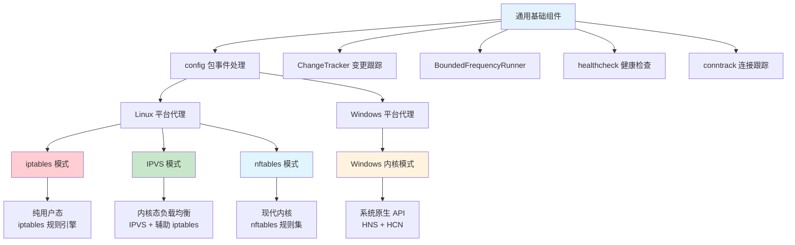
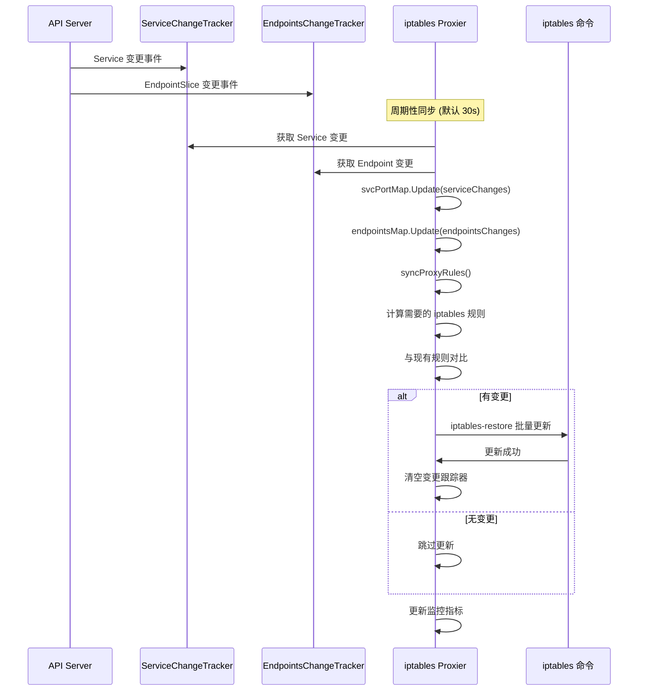
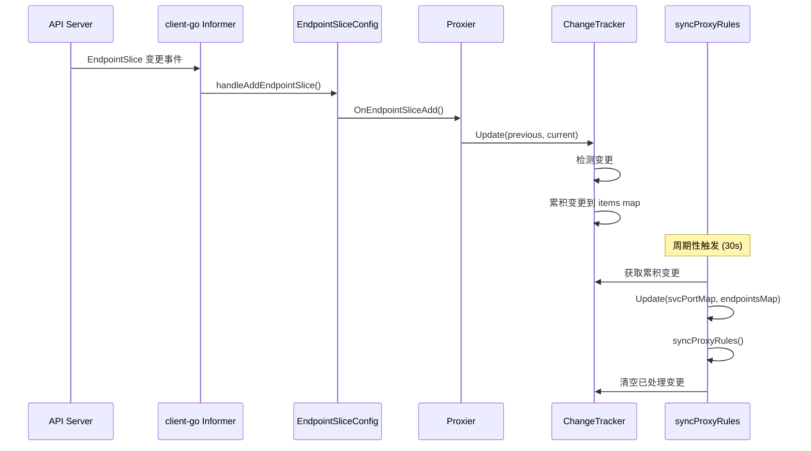

# kube-proxy 源码深度分析

## 概述

基于 `pkg/proxy/` 目录的源码分析，kube-proxy 是 Kubernetes 网络架构的核心组件，负责实现 Service 的负载均衡和网络代理功能。本文档深入分析 kube-proxy 的架构设计、三种代理模式的实现细节，以及与 Kubernetes 控制平面的集成机制。

## 1. kube-proxy 架构分析

### 1.1 核心接口设计

```go
// pkg/proxy/types.go - Provider 接口定义
type Provider interface {
    config.EndpointSliceHandler    // EndpointSlice 变更处理
    config.ServiceHandler          // Service 变更处理
    config.NodeTopologyHandler     // 节点拓扑处理
    config.ServiceCIDRHandler      // Service CIDR 处理
    
    Sync()                         // 立即同步状态到代理规则
    SyncLoop()                     // 运行周期性同步循环
}
```

**设计亮点**：
- **关注点分离**：通过接口组合实现功能模块化
- **事件驱动**：实现了 List-Watch 机制的事件处理
- **周期性同步**：保证最终一致性

### 1.2 目录结构分析

```
pkg/proxy/
├── types.go                      # 核心接口定义
├── servicechangetracker.go       # Service 变更跟踪
├── endpointschangetracker.go     # EndpointSlice 变更跟踪
├── endpoint.go                   # 端点处理逻辑
├── serviceport.go                # ServicePort 处理
├── config/                       # 配置处理
│   └── config.go                 # ServiceHandler/EndpointSliceHandler 实现
├── iptables/                     # iptables 代理模式
│   ├── proxier.go                # iptables Proxier 实现
│   └── cleanup.go                # iptables 清理逻辑
├── ipvs/                         # IPVS 代理模式
│   ├── proxier.go                # IPVS Proxier 实现
│   ├── ipset/                    # ipset 操作封装
│   └── util/                     # IPVS 工具函数
├── winkernel/                    # Windows 内核模式
│   ├── proxier.go                # Windows Proxier 实现
│   └── hns.go                    # Host Network Service 操作
├── nftables/                     # nftables 代理模式（下一代）
│   ├── proxier.go                # nftables Proxier 实现
│   └── supported.go              # 特性支持检测
├── healthcheck/                  # 健康检查
├── conntrack/                    # 连接跟踪
├── metrics/                      # 监控指标
├── topology.go                   # 拓扑感知路由
└── util/                         # 通用工具
```

### 1.3 三种代理模式架构对比

根据源码分析，kube-proxy 实际实现了四种不同的代理模式，比传统理解的更复杂：

#### Linux 平台三种实现对比

| 特性 | iptables 模式 | IPVS 模式 | nftables 模式 |
|------|---------------|-----------|---------------|
| **核心文件** | `pkg/proxy/iptables/` | `pkg/proxy/ipvs/` | `pkg/proxy/nftables/` |
| **主要接口** | `utiliptables.Interface` | `utilipvs.Interface` | `nftables.Interface` |
| **网络表** | NAT 表 + FILTER 表 | IPVS 虚拟服务器 | nftables 规则集 |
| **更新机制** | `iptables-restore` | IPVS 系统调用 | `nft` 命令 |
| **性能特征** | 规则匹配线性复杂度 | 内核级常数复杂度 | 现代内核优化 |
| **扩展性** | 大规模集群性能下降 | 大规模集群优势明显 | 下一代高性能方案 |
| **额外组件** | conntrack 连接跟踪 | ipset + iptables 辅助 | conntrack 连接跟踪 |

#### Windows 平台独立实现

| 特性 | Windows 内核模式 |
|------|------------------|
| **核心文件** | `pkg/proxy/winkernel/` |
| **主要接口** | HNS API + HCN API |
| **网络管理** | Host Network Service |
| **策略管理** | HNS 策略引擎 |
| **性能特征** | Windows 网络栈优化 |
| **架构差异** | 完全不同于 Linux 实现 |

#### 架构层次关系



#### 核心架构发现

1. **IPVS 混合模式**：IPVS + iptables 辅助规则，不是纯 IPVS 实现
2. **nftables 未来方案**：替代传统 iptables 的现代化架构
3. **Windows 异构架构**：基于 HNS/HCN 的完全不同实现路径
4. **统一基础框架**：所有模式共享相同的变更跟踪和事件处理机制

## 2. 核心数据结构分析

### 2.1 ServicePortName - 服务唯一标识

```go
// pkg/proxy/types.go
type ServicePortName struct {
    types.NamespacedName           // Namespace + Name
    Port     string                // 端口名称
    Protocol v1.Protocol           // 协议类型
}

// 示例：default/kubernetes:https:TCP
func (spn ServicePortName) String() string {
    return fmt.Sprintf("%s%s", spn.NamespacedName.String(), fmtPortName(spn.Port))
}
```

**设计考虑**：
- **唯一性保证**：Namespace + Name + Port + Protocol 确保全局唯一
- **哈希友好**：适合作为 map 的 key
- **类型安全**：编译时类型检查

### 2.2 ServiceChangeTracker - 变更跟踪机制

```go
// pkg/proxy/servicechangetracker.go
type ServiceChangeTracker struct {
    lock sync.Mutex
    items map[types.NamespacedName]*serviceChange
    
    makeServiceInfo         makeServicePortFunc
    processServiceMapChange processServiceMapChangeFunc
    ipFamily                v1.IPFamily
}

type serviceChange struct {
    previous ServicePortMap    // 变更前状态
    current  ServicePortMap    // 变更后状态
}
```

**关键方法分析**：

```go
// Update 方法处理 Service 变更
func (sct *ServiceChangeTracker) Update(previous, current *v1.Service) bool {
    // 1. 参数校验
    if previous == nil && current == nil {
        return false
    }
    
    // 2. 确定服务对象
    svc := current
    if svc == nil {
        svc = previous
    }
    
    // 3. 获取唯一标识
    namespacedName := types.NamespacedName{
        Namespace: svc.Namespace, 
        Name: svc.Name
    }
    
    // 4. 线程安全更新
    sct.lock.Lock()
    defer sct.lock.Unlock()
    
    change, exists := sct.items[namespacedName]
    if !exists {
        change = &serviceChange{}
        change.previous = sct.serviceToServiceMap(previous)
        sct.items[namespacedName] = change
    }
    change.current = sct.serviceToServiceMap(current)
    
    // 5. 变更检测
    if reflect.DeepEqual(change.previous, change.current) {
        delete(sct.items, namespacedName)
        return false
    }
    
    return true
}
```

### 2.3 EndpointsChangeTracker - 端点变更跟踪

```go
// pkg/proxy/endpointschangetracker.go
type EndpointsChangeTracker struct {
    lock sync.Mutex
    items map[types.NamespacedName]*endpointsChange
    
    makeEndpointInfo makeEndpointFunc
    ipFamily         v1.IPFamily
}

type endpointsChange struct {
    previous EndpointsMap
    current  EndpointsMap
}
```

**与 ServiceChangeTracker 的对应关系**：
- **相同的变更跟踪模式**：previous vs current 状态对比
- **不同的数据结构**：EndpointsMap 支持多端点管理
- **独立的锁机制**：避免 Service 和 Endpoint 变更互相阻塞

### 2.4 iptables Proxier 结构分析

```go
// pkg/proxy/iptables/proxier.go
type Proxier struct {
    ipFamily v1.IPFamily
    
    // 变更跟踪
    endpointsChanges *proxy.EndpointsChangeTracker
    serviceChanges   *proxy.ServiceChangeTracker
    
    // 同步保护
    mu             sync.Mutex
    svcPortMap     proxy.ServicePortMap
    endpointsMap   proxy.EndpointsMap
    topologyLabels map[string]string
    
    // 初始化状态
    endpointsSlicesSynced bool
    servicesSynced        bool
    
    // 网络工具
    iptables    utiliptables.Interface
    exec        exec.Interface
    logger      klog.Logger
    
    // 定时器
    syncPeriod     time.Duration
    minSyncPeriod  time.Duration
    syncRunner     *runner.BoundedFrequencyRunner
    
    // 规则缓存
    filterChains *bytes.Buffer
    filterRules  *bytes.Buffer
    natChains    *bytes.Buffer
    natRules     *bytes.Buffer
    
    // 连接跟踪
    conntrack *conntrack.Interface
}
```

## 3. iptables 代理模式深度分析

### 3.1 iptables 规则生成流程



### 3.2 syncProxyRules 核心逻辑

```go
// pkg/proxy/iptables/proxier.go:638
func (proxier *Proxier) syncProxyRules() (retryError error) {
    proxier.mu.Lock()
    defer proxier.mu.Unlock()
    
    // 1. 初始化检查
    if !proxier.isInitialized() {
        proxier.logger.V(2).Info("Not syncing iptables until Services and Endpoints have been received")
        return
    }
    
    // 2. 决定是否全量同步
    doFullSync := proxier.needFullSync || (time.Since(proxier.lastFullSync) > proxyutil.FullSyncPeriod)
    
    // 3. 更新内部映射
    serviceUpdateResult := proxier.svcPortMap.Update(proxier.serviceChanges)
    endpointUpdateResult := proxier.endpointsMap.Update(proxier.endpointsChanges)
    
    // 4. 准备规则缓冲区
    proxier.filterChains.Reset()
    proxier.filterRules.Reset()
    proxier.natChains.Reset()
    proxier.natRules.Reset()
    
    // 5. 全量同步时确保基础链存在
    if doFullSync {
        for _, jump := range append(iptablesJumpChains, iptablesKubeletJumpChains...) {
            proxier.iptables.EnsureChain(jump.table, jump.dstChain)
            proxier.iptables.EnsureRule(utiliptables.Prepend, jump.table, jump.srcChain, args...)
        }
    }
    
    // 6. 生成规则
    proxier.generateNatRules(serviceUpdateResult, endpointUpdateResult)
    proxier.generateFilterRules(serviceUpdateResult, endpointUpdateResult)
    
    // 7. 执行规则更新
    success := proxier.executeRulesUpdate(doFullSync)
    
    // 8. 处理结果
    if !success {
        proxier.needFullSync = true
        return fmt.Errorf("Sync failed")
    } else if doFullSync {
        proxier.lastFullSync = time.Now()
    }
    
    return nil
}
```

### 3.3 iptables 规则生成详解

#### 3.3.1 NAT 表规则生成

```go
// NAT 表规则生成逻辑
func (proxier *Proxier) generateNatRules(serviceUpdateResult, endpointUpdateResult) {
    // 1. KUBE-SERVICES 链 - 主入口
    proxier.natChains.WriteString("*nat\n")
    proxier.natChains.WriteString(string(kubeServicesChain) + "\n")
    
    // 2. 遍历所有服务
    for svcPortName := range proxier.svcPortMap {
        svc := proxier.svcPortMap[svcPortName]
        
        // 3. 根据服务类型生成规则
        switch svc.Type() {
        case v1.ServiceTypeClusterIP:
            proxier.generateClusterIPRules(svc, svcPortName)
        case v1.ServiceTypeNodePort:
            proxier.generateNodePortRules(svc, svcPortName)
        case v1.ServiceTypeLoadBalancer:
            proxier.generateLoadBalancerRules(svc, svcPortName)
        }
    }
    
    // 4. POSTROUTING 链处理
    proxier.generatePostroutingRules()
    
    // 5. MASQUERADE 处理
    proxier.generateMasqueradeRules()
}
```

#### 3.3.2 ClusterIP 规则生成

```go
// ClusterIP 规则生成示例
func (proxier *Proxier) generateClusterIPRules(svc *proxy.ServicePort, svcPortName proxy.ServicePortName) {
    // 1. 主服务规则
    args := []string{
        "-m", "comment", "--comment", fmt.Sprintf("%s cluster IP", svcPortName.String()),
        "-m", protocol, "-p", protocol,
        "-d", svc.ClusterIP().String(),
        "--dport", fmt.Sprintf("%d", svc.Port()),
        "-j", string(proxier.serviceChainName(svcPortName)),
    }
    proxier.natRules.Write(args)
    
    // 2. 服务链 - 负载均衡
    chain := proxier.serviceChainName(svcPortName)
    endpoints := proxier.endpointsMap[svcPortName]
    
    // 3. 生成端点分发规则
    for i, endpoint := range endpoints {
        probability := 1.0 / float64(len(endpoints)-i)
        
        args := []string{
            "-m", "comment", "--comment", svcPortName.String(),
            "-m", "statistic", "--mode", "random", "--probability", fmt.Sprintf("%.8f", probability),
            "-j", proxier.endpointChainName(endpoint),
        }
        
        proxier.natRules.Write(args)
    }
    
    // 4. 端点链 - DNAT 规则
    for _, endpoint := range endpoints {
        proxier.generateEndpointRules(endpoint, svcPortName)
    }
}
```

### 3.4 性能优化分析

#### 3.4.1 增量同步机制

```go
// 增量同步判断逻辑
func (proxier *Proxier) shouldSkipFullSync() bool {
    // 1. 检查变更数量
    if len(proxier.serviceChanges) > maxChangesBeforeFullSync {
        return false
    }
    
    // 2. 检查时间间隔
    if time.Since(proxier.lastFullSync) > proxyutil.FullSyncPeriod {
        return false
    }
    
    // 3. 检查规则数量
    if proxier.ruleCountChangedSignificantly() {
        return false
    }
    
    return true
}
```

#### 3.4.2 内存优化技术

```go
// 缓冲区重用机制
func (proxier *Proxier) resetBuffers() {
    // 1. 重置而不是重新分配
    proxier.filterChains.Reset()
    proxier.filterRules.Reset()
    proxier.natChains.Reset()
    proxier.natRules.Reset()
    
    // 2. 预分配容量
    if proxier.filterChains.Cap() < minBufferSize {
        proxier.filterChains.Grow(minBufferSize)
    }
}
```

## 4. IPVS 代理模式深度分析

### 4.1 IPVS vs iptables 架构对比

```mermaid
graph TB
    subgraph "iptables 模式流量路径"
        IPT_PKT[数据包到达]
        IPT_CHAIN[iptables 链遍历]
        IPT_RULE[规则匹配 O(n)]
        IPT_DNAT[DNAT 转换]
        IPT_FORWARD[数据包转发]
        
        IPT_PKT --> IPT_CHAIN
        IPT_CHAIN --> IPT_RULE
        IPT_RULE --> IPT_DNAT
        IPT_DNAT --> IPT_FORWARD
    end
    
    subgraph "IPVS 模式流量路径"
        IPVS_PKT[数据包到达]
        IPVS_VS[Virtual Server 查找 O(1)]
        IPVS_SCHED[调度算法]
        IPVS_RS[Real Server 选择]
        IPVS_FWD[数据包转发]
        
        IPVS_PKT --> IPVS_VS
        IPVS_VS --> IPVS_SCHED
        IPVS_SCHED --> IPVS_RS
        IPVS_RS --> IPVS_FWD
    end
    
    subgraph "性能对比"
        IPT_PERF[iptables: 线性性能]
        IPVS_PERF[IPVS: 常数性能]
    end
    
    IPT_RULE --> IPT_PERF
    IPVS_SCHED --> IPVS_PERF
    
    style IPVS_PERF fill:#c8e6c9
    style IPT_PERF fill:#ffcdd2
```

### 4.2 IPVS Proxier 结构分析

```go
// pkg/proxy/ipvs/proxier.go
type Proxier struct {
    ipFamily v1.IPFamily
    
    // 变更跟踪 (与 iptables 相同)
    endpointsChanges *proxy.EndpointsChangeTracker
    serviceChanges   *proxy.ServiceChangeTracker
    
    mu             sync.Mutex
    svcPortMap     proxy.ServicePortMap
    endpointsMap   proxy.EndpointsMap
    
    // IPVS 特定组件
    ipvs           utilipvs.Interface      // IPVS 操作接口
    ipset          utilipset.Interface     // ipset 操作接口
    scheduler      string                  // 调度算法
    dummyDevice    string                  // 虚拟设备名
    
    // iptables 辅助
    iptables       utiliptables.Interface   // 用于辅助规则
    
    // 连接跟踪
    conntrack      *conntrack.Interface
}

// IPVS 虚拟服务器结构
type VirtualServer struct {
    Address   net.IP
    Port      uint16
    Protocol  string
    Scheduler string
}
```

### 4.3 IPVS 同步逻辑

```go
// pkg/proxy/ipvs/proxier.go:674
func (proxier *Proxier) syncProxyRules() (retryError error) {
    proxier.mu.Lock()
    defer proxier.mu.Unlock()
    
    // 1. 初始化检查 (与 iptables 相同)
    if !proxier.isInitialized() {
        return
    }
    
    // 2. 更新映射
    serviceUpdateResult := proxier.svcPortMap.Update(proxier.serviceChanges)
    endpointUpdateResult := proxier.endpointsMap.Update(proxier.endpointsChanges)
    
    // 3. IPVS 同步核心逻辑
    proxier.syncIPVSRules(serviceUpdateResult, endpointUpdateResult)
    
    // 4. ipset 同步
    proxier.syncIpsets(serviceUpdateResult, endpointUpdateResult)
    
    // 5. 辅助 iptables 规则同步
    proxier.syncAuxiliaryIptablesRules()
    
    return nil
}
```

### 4.4 IPVS 规则同步详解

```go
// IPVS 规则同步核心逻辑
func (proxier *Proxier) syncIPVSRules(serviceUpdateResult, endpointUpdateResult) {
    // 1. 计算期望的 IPVS 服务
    desiredServers := proxier.calculateDesiredIPVSServers(serviceUpdateResult)
    
    // 2. 获取当前 IPVS 服务
    currentServers, _ := proxier.ipvs.GetVirtualServers()
    
    // 3. 计算差异
    toAdd, toUpdate, toDelete := proxier.calculateIPVSDiff(desiredServers, currentServers)
    
    // 4. 执行变更
    for _, server := range toAdd {
        if err := proxier.ipvs.AddVirtualServer(server); err != nil {
            return err
        }
    }
    
    for _, server := range toUpdate {
        if err := proxier.ipvs.UpdateVirtualServer(server); err != nil {
            return err
        }
    }
    
    for _, server := range toDelete {
        if err := proxier.ipvs.DeleteVirtualServer(server); err != nil {
            return err
        }
    }
    
    // 5. 同步 Real Server
    proxier.syncRealServers(serviceUpdateResult, endpointUpdateResult)
}
```

### 4.5 IPVS 调度算法支持

```go
// pkg/proxy/ipvs/util/ipvs.go
const (
    RoundRobin    = "rr"    // 轮询调度
    LeastConn     = "lc"    // 最少连接
    DestHash      = "dh"    // 目标地址哈希
    SourceHash    = "sh"    // 源地址哈希
    ShortestExp   = "sed"   // 最短期望延迟
    NeverQueue    = "nq"    // 从不排队
)

// 调度算法选择逻辑
func selectScheduler(service *v1.Service) string {
    // 1. 检查注解指定
    if scheduler, exists := service.Annotations["ipvs.scheduler"]; exists {
        return scheduler
    }
    
    // 2. 根据服务特性选择
    if service.Spec.SessionAffinity == v1.ServiceAffinityClientIP {
        return SourceHash  // 会话亲和性使用源哈希
    }
    
    // 3. 默认轮询
    return RoundRobin
}
```

## 5. List-Watch 机制集成分析

### 5.1 配置事件处理架构

```go
// pkg/proxy/config/config.go
type EndpointSliceConfig struct {
    listerSynced  cache.InformerSynced
    eventHandlers []EndpointSliceHandler
    logger        klog.Logger
}

// EndpointSlice 变更处理
func (c *EndpointSliceConfig) handleAddEndpointSlice(obj interface{}) {
    endpointSlice := obj.(*discoveryv1.EndpointSlice)
    
    for _, handler := range c.eventHandlers {
        handler.OnEndpointSliceAdd(endpointSlice)
    }
}

func (c *EndpointSliceConfig) handleUpdateEndpointSlice(oldObj, newObj interface{}) {
    oldEndpointSlice := oldObj.(*discoveryv1.EndpointSlice)
    newEndpointSlice := newObj.(*discoveryv1.EndpointSlice)
    
    for _, handler := range c.eventHandlers {
        handler.OnEndpointSliceUpdate(oldEndpointSlice, newEndpointSlice)
    }
}
```

### 5.2 kube-proxy 事件处理流程



### 5.3 事件处理优化策略

```go
// 变更批量处理优化
type Proxier struct {
    // 变更累积缓冲区
    endpointsChanges *proxy.EndpointsChangeTracker
    serviceChanges   *proxy.ServiceChangeTracker
    
    // 去重机制
    lastProcessedVersions map[string]string
    
    // 合并策略
    mergeWindow time.Duration
}

// 变更合并逻辑
func (proxier *Proxier) mergeChanges() {
    // 1. 同一对象的多次变更只保留最新状态
    for key, change := range proxier.serviceChanges.items {
        if proxier.shouldMergeChange(key, change) {
            proxier.mergeServiceChange(key, change)
        }
    }
    
    // 2. 删除无实际变更的条目
    proxier.cleanupNoopChanges()
}
```

## 6. 负载均衡实现分析

### 6.1 iptables 负载均衡

```go
// iptables 随机选择算法实现
func (proxier *Proxier) generateRandomSelection(endpoints []Endpoint) []string {
    rules := make([]string, 0, len(endpoints))
    
    for i, endpoint := range endpoints {
        // 计算概率：1/(n-i) 确保等概率分布
        probability := 1.0 / float64(len(endpoints)-i)
        
        args := []string{
            "-m", "statistic",
            "--mode", "random",
            "--probability", fmt.Sprintf("%.8f", probability),
            "-j", proxier.endpointChainName(endpoint),
        }
        
        rules = append(rules, args)
    }
    
    return rules
}

// 示例：3个端点的规则生成
// -m statistic --mode random --probability 0.33333333 -j KUBE-SEP-AAA
// -m statistic --mode random --probability 0.50000000 -j KUBE-SEP-BBB  
// -j KUBE-SEP-CCC (默认匹配)
```

### 6.2 IPVS 负载均衡

```go
// IPVS 调度器接口
type Scheduler interface {
    Schedule(vs *VirtualServer, dests []Destination) *Destination
}

// 轮询调度实现
type RoundRobinScheduler struct {
    lastSelected map[string]int
}

func (rr *RoundRobinScheduler) Schedule(vs *VirtualServer, dests []Destination) *Destination {
    key := vs.Key()
    
    // 原子递增取模
    index := atomic.AddInt32(&rr.lastSelected[key], 1) % int32(len(dests))
    
    return &dests[index]
}

// 最少连接调度实现
type LeastConnectionScheduler struct {
    connections map[string]int32
}

func (lc *LeastConnectionScheduler) Schedule(vs *VirtualServer, dests []Destination) *Destination {
    var selected *Destination
    minConns := int32(math.MaxInt32)
    
    for i := range dests {
        connCount := atomic.LoadInt32(&lc.connections[dests[i].Key()])
        if connCount < minConns {
            minConns = connCount
            selected = &dests[i]
        }
    }
    
    return selected
}
```

## 7. 连接跟踪和 NAT 处理

### 7.1 conntrack 集成

```go
// pkg/proxy/conntrack/conntrack.go
type Interface interface {
    DeleteConnections(protocol string, ip net.IP, port int, ipv4 bool) error
    DeleteConntrackConnections(protocol string, ip net.IP, port int) error
}

// 连接清理时机
func (proxier *Proxier) cleanupStaleConnections() {
    // 1. 服务删除时清理相关连接
    for deletedService := range proxier.serviceChanges {
        for _, endpoint := range deletedService.previous.Endpoints {
            proxier.conntrack.DeleteConnections(
                endpoint.Protocol,
                endpoint.IP, 
                endpoint.Port,
                proxier.ipFamily == v1.IPv4Protocol,
            )
        }
    }
    
    // 2. 端点移除时清理连接
    for deletedEndpoint := range proxier.endpointsChanges {
        proxier.conntrack.DeleteConnections(
            deletedEndpoint.Protocol,
            deletedEndpoint.IP,
            deletedEndpoint.Port,
            true,
        )
    }
}
```

### 7.2 MASQUERADE 处理

```go
// MASQUERADE 标记机制
const (
    masqueradeMark = 0x4000  // 0x4000/0x4000
)

// MASQUERADE 规则生成
func (proxier *Proxier) generateMasqueradeRules() {
    // 1. 标记需要 MASQUERADE 的流量
    proxier.natRules.WriteString(
        "-A " + string(kubeMarkMasqChain) + 
        " -j MARK --set-xmark " + fmt.Sprintf("%#x/%#x", masqueradeMark, masqueradeMark) + "\n",
    )
    
    // 2. POSTROUTING 链处理标记流量
    proxier.natRules.WriteString(
        "-A " + string(kubePostroutingChain) + 
        " -m comment --comment \"kubernetes service traffic requiring SNAT\" " +
        "-m mark --mark " + fmt.Sprintf("%#x/%#x", masqueradeMark, masqueradeMark) + 
        " -j MASQUERADE\n",
    )
}
```

## 8. 性能监控和指标

### 8.1 关键监控指标

```go
// pkg/proxy/metrics/metrics.go
var (
    // 同步延迟
    SyncProxyRulesLatency = metrics.NewHistogramVec(
        &metrics.HistogramOpts{
            Name:    "sync_proxy_rules_latency_seconds",
            Help:    "Network programming latency",
            Buckets: metrics.DefBuckets,
        },
        []string{"ip_family"},
    )
    
    // 规则数量
    SyncProxyRulesLastQueuedTimestamp = metrics.NewGaugeVec(
        &metrics.GaugeOpts{
            Name: "sync_proxy_rules_last_queued_timestamp_seconds",
            Help: "The last time proxy rules were queued",
        },
        []string{"ip_family"},
    )
    
    // 服务端点数量
    ServicesEndingPoints = metrics.NewGaugeVec(
        &metrics.GaugeOpts{
            Name: "sync_proxy_rules_endpoints_total",
            Help: "Total number of endpoints",
        },
        []string{"ip_family"},
    )
)
```

### 8.2 性能分析

```go
// 性能监控集成
func (proxier *Proxier) syncProxyRules() (retryError error) {
    start := time.Now()
    defer func() {
        // 记录延迟指标
        metrics.SyncProxyRulesLatency.WithLabelValues(string(proxier.ipFamily)).
            Observe(metrics.SinceInSeconds(start))
        
        // 记录规则数量
        metrics.SyncProxyRulesLastSyncTimestamp.WithLabelValues(string(proxier.ipFamily)).
            Set(float64(time.Now().Unix()))
    }()
    
    // 同步逻辑...
}
```

## 9. 总结

### 9.1 kube-proxy 架构优势

1. **模块化设计**：通过 Provider 接口实现多种代理模式
2. **事件驱动**：高效的 List-Watch 机制集成
3. **增量更新**：变更跟踪器优化同步性能
4. **网络高效**：IPVS 模式支持大规模集群
5. **平台兼容**：Linux iptables/IPVS、Windows HNS

### 9.2 源码学习价值

1. **接口设计**：Provider 接口的优雅抽象
2. **并发控制**：锁机制和变更跟踪的配合
3. **性能优化**：增量同步和缓冲区重用
4. **可靠性**：错误重试和全量同步机制
5. **可扩展性**：支持多种代理后端

### 9.3 实际应用启示

1. **网络编程**：iptables/IPVS 的系统级应用
2. **控制器模式**：期望状态 vs 实际状态的调和
3. **事件处理**：Kubernetes Informer 的最佳实践
4. **性能调优**：大规模网络代理的优化策略
5. **跨平台抽象**：统一接口下的多平台实现

通过深入分析 kube-proxy 源码，我们不仅理解了 Kubernetes Service 网络机制的核心实现，还学习到了生产级网络代理软件的设计哲学和工程实践。