# kubeadm 集群引导工具深度分析

> 更新日期：2026-03-08
> 分析版本：v1.36.0-alpha.0
> 源码路径：`cmd/kubeadm/`

---

## 📋 概述

**kubeadm** 是 Kubernetes 官方提供的集群初始化和管理工具，它通过执行一系列预定义的"阶段"（phases）来引导集群的创建、节点的加入、升级和重置等操作。

### 核心特性

- ✅ **简化集群搭建** - 一个命令完成控制平面初始化
- ✅ **标准化流程** - 所有操作通过 phases 模块化执行
- ✅ **自动化证书管理** - 自动生成和管理 TLS 证书
- ✅ **Bootstrap Token 机制** - 安全的节点加入认证
- ✅ **配置文件支持** - 支持 YAML 配置文件定制
- ✅ **Dry-run 模式** - 预演操作而不实际执行
- ✅ **可重入** - 支持中断后恢复

### 命令体系

```bash
kubeadm init          # 初始化控制平面
kubeadm join          # 节点加入集群
kubeadm reset          # 重置节点
kubeadm upgrade        # 升级集群
kubeadm token          # 管理 Bootstrap Token
kubeadm certs          # 证书管理
kubeadm config        # 配置管理
kubeadm completion    # Shell 自动补全
kubeadm version        # 版本信息
kubeadm alpha          # 实验性功能
```

---

## 🏗️ 架构设计

### 整体架构

kubeadm 采用 **Workflow Runner** 架构，将复杂的集群操作分解为多个独立的 phases，每个 phase 负责一个特定的任务。

```mermaid
graph TB
    A[kubeadm 命令] --> B[Workflow Runner]
    B --> C[Phase 1: Preflight]
    B --> D[Phase 2: Certs]
    B --> E[Phase 3: KubeConfig]
    B --> F[Phase 4: etcd]
    B --> G[Phase 5: Control Plane]
    B --> H[Phase 6: Kubelet Start]
    B --> I[Phase 7: Wait Control Plane]
    B --> J[Phase 8: Upload Config]
    B --> K[Phase 9: Upload Certs]
    B --> L[Phase 10: Mark Control Plane]
    B --> M[Phase 11: Bootstrap Token]
    B --> N[Phase 12: Kubelet Finalize]
    B --> O[Phase 13: Addons]
    B --> P[Phase 14: Show Join Command]

    style A fill:#e1f5ff
    style B fill:#fff4e6
    style C fill:#e8f5e9
    style D fill:#e8f5e9
    style E fill:#e8f5e9
    style F fill:#e8f5e9
    style G fill:#fff9c4
    style H fill:#fff9c4
    style I fill:#fff9c4
    style J fill:#fff9c4
    style K fill:#fff9c4
    style L fill:#fff9c4
    style M fill:#fff9c4
    style N fill:#f3e5f5
    style O fill:#f3e5f5
    style P fill:#f3e5f5
```

### 代码结构

```
cmd/kubeadm/
├── kubeadm.go              # 入口函数
├── app/
│   ├── cmd/
│   │   ├── cmd.go         # 命令注册
│   │   ├── init.go        # init 命令
│   │   ├── join.go        # join 命令
│   │   ├── reset.go       # reset 命令
│   │   ├── token.go       # token 管理
│   │   ├── config.go      # 配置管理
│   │   └── phases/       # 各个阶段的实现
│   │       ├── init/      # init phases
│   │       ├── join/      # join phases
│   │       └── reset/     # reset phases
│   ├── phases/            # 核心逻辑实现
│   │   ├── certs.go      # 证书生成
│   │   ├── kubeconfig.go  # kubeconfig 生成
│   │   └── ...
│   ├── discovery/         # 节点发现
│   │   ├── token.go      # Token 发现
│   │   ├── file.go       # 文件发现
│   │   └── https.go      # HTTPS 发现
│   ├── preflight/         # 前置检查
│   ├── constants.go       # 常量定义
│   └── util/            # 工具函数
```

### Workflow Runner

**Workflow Runner** 是 kubeadm 的核心执行引擎，负责：

1. **Phase 注册** - 将所有 phase 注册到 runner
2. **依赖管理** - 管理 phase 之间的依赖关系
3. **并发执行** - 支持并发执行独立的 phases
4. **错误处理** - 统一的错误处理和恢复机制
5. **Dry-run 支持** - 预演模式

**Workflow 接口定义**：

```go
// Phase 定义单个阶段
type Phase struct {
    Name         string        // 阶段名称
    Short        string        // 短描述
    Long         string        // 长描述
    Example      string        // 示例
    Run          RunFunc     // 执行函数
    Phases       []Phase     // 子阶段（支持嵌套）
    InheritFlags []string    // 继承的 flag
}

// Runner 负责执行 phases
type Runner struct {
    Phases        []Phase      // 所有注册的 phases
    Options       Options      // 执行选项
    SkipPhases    []string    // 跳过的 phases
    runData       RunData     // 运行时数据
}
```

---

## 🚀 kubeadm init - 集群初始化

### 命令流程

`kubeadm init` 是集群初始化的核心命令，通过执行 14 个 phases 来完成控制平面的搭建。

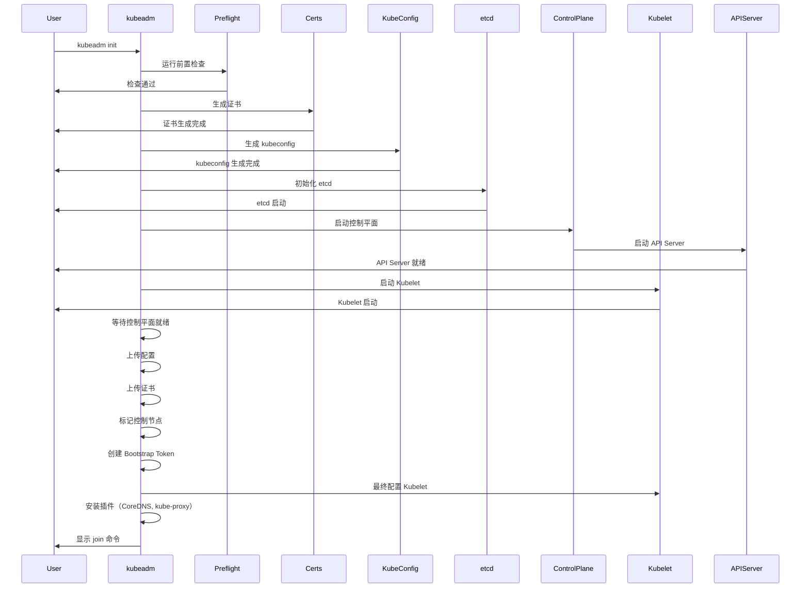

### Phase 1: Preflight（前置检查）

**目标**：确保系统满足 kubeadm 的运行要求

**检查项**：

1. **系统检查**
   - ✅ Root 权限检查
   - ✅ 内核版本检查
   - ✅ Swap 状态检查
   - ✅ Cgroup 驱动检查
   - ✅ Docker/containerd 检查
   - ✅ CRI 版本检查

2. **网络检查**
   - ✅ 端口占用检查（6443, 10250, 10251, 10252）
   - ✅ 防火墙状态检查
   - ✅ DNS 解析检查

3. **资源检查**
   - ✅ CPU 核心数检查（>= 2）
   - ✅ 内存检查（>= 2GB）
   - ✅ 磁盘空间检查

4. **镜像检查**
   - ✅ 拉取所需镜像
   - ✅ 镜像可用性检查

**源码位置**：`cmd/kubeadm/app/cmd/phases/init/preflight.go`

**核心代码**：

```go
func runPreflight(c workflow.RunData) error {
    data, ok := c.(InitData)
    if !ok {
        return errors.New("preflight phase invoked with an invalid data struct")
    }

    fmt.Println("[preflight] Running pre-flight checks")

    // 1. Root 权限检查
    if err := preflight.RunRootCheckOnly(data.IgnorePreflightErrors()); err != nil {
        return err
    }

    // 2. 初始化节点检查
    if err := preflight.RunInitNodeChecks(
        utilsexec.New(),
        data.Cfg(),
        data.IgnorePreflightErrors(),
        false,
        false,
    ); err != nil {
        return err
    }

    if data.DryRun() {
        fmt.Println("[preflight] Would pull required images")
        return nil
    }

    // 3. 拉取镜像
    fmt.Println("[preflight] Pulling images required for setting up a Kubernetes cluster")
    return preflight.RunPullImagesCheck(
        utilsexec.New(),
        data.Cfg(),
        data.IgnorePreflightErrors(),
    )
}
```

### Phase 2: Certs（证书生成）

**目标**：生成集群所需的所有 TLS 证书

**证书清单**：

| 证书名称 | 用途 | CA |
|---------|------|-----|
| ca.crt/ca.key | 集群根证书 | - |
| apiserver.crt/apiserver.key | API Server 证书 | ca |
| apiserver-kubelet-client.crt/apiserver-kubelet-client.key | API Server 访问 Kubelet 的证书 | ca |
| apiserver-etcd-client.crt/apiserver-etcd-client.key | API Server 访问 etcd 的证书 | etcd-ca |
| etcd-ca.crt/etcd-ca.key | etcd CA | - |
| etcd-server.crt/etcd-server.key | etcd Server 证书 | etcd-ca |
| etcd-peer.crt/etcd-peer.key | etcd Peer 证书 | etcd-ca |
| front-proxy-ca.crt/front-proxy-ca.key | Front Proxy CA | - |
| front-proxy-client.crt/front-proxy-client.key | Front Proxy 证书 | front-proxy-ca |
| sa.pub/sa.key | Service Account 公私钥对 | - |

**证书生成流程**：

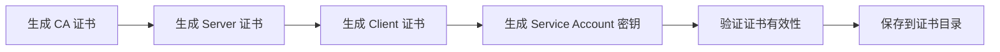

**核心代码**：

```go
// CA 证书生成
func runCAPhase(ca *certsphase.KubeadmCert) func(c workflow.RunData) error {
    return func(c workflow.RunData) error {
        data, ok := c.(InitData)
        if !ok {
            return errors.New("certs phase invoked with an invalid data struct")
        }

        // 检查证书是否已存在
        if cert, err := pkiutil.TryLoadCertFromDisk(
            data.CertificateDir(), ca.BaseName,
        ); err == nil {
            // 证书已存在，验证有效期
            certsphase.CheckCertificatePeriodValidity(ca.BaseName, cert)
            fmt.Printf("[certs] Using existing %s certificate authority\n", ca.BaseName)
            return nil
        }

        // 创建新的 CA 证书
        cfg := data.Cfg()
        cfg.CertificatesDir = data.CertificateWriteDir()

        return certsphase.CreateCACertAndKeyFiles(ca, cfg)
    }
}

// Service Account 密钥生成
func runCertsSa(c workflow.RunData) error {
    data, ok := c.(InitData)
    if !ok {
        return errors.New("certs phase invoked with an invalid data struct")
    }

    // 如果使用外部 CA，跳过 SA 密钥生成
    if data.ExternalCA() {
        fmt.Printf("[certs] Using existing sa keys\n")
        return nil
    }

    // 创建 SA 公私钥对
    return certsphase.CreateServiceAccountKeyAndPublicKeyFiles(
        data.CertificateWriteDir(),
        data.Cfg().ClusterConfiguration.EncryptionAlgorithmType(),
    )
}
```

**证书有效期检查**：

```go
func CheckCertificatePeriodValidity(baseName string, cert *x509.Certificate) error {
    // 检查证书是否过期
    if time.Now().After(cert.NotAfter) {
        return errors.Errorf("certificate %s is expired", baseName)
    }

    // 检查证书是否即将过期（< 30 天）
    if time.Now().Add(30 * 24 * time.Hour).After(cert.NotAfter) {
        klog.Warningf("certificate %s will expire in less than 30 days", baseName)
    }

    return nil
}
```

### Phase 3: KubeConfig（配置文件生成）

**目标**：为各个组件生成 kubeconfig 文件

**kubeconfig 清单**：

| 文件 | 用途 | 用户 |
|------|------|------|
| admin.conf | 管理员配置 | kubernetes-admin |
| kubelet.conf | Kubelet 配置 | system:node:<node-name> |
| controller-manager.conf | Controller Manager 配置 | system:kube-controller-manager |
| scheduler.conf | Scheduler 配置 | system:kube-scheduler |

**kubeconfig 结构**：

```yaml
apiVersion: v1
kind: Config
clusters:
- cluster:
    certificate-authority-data: <base64-encoded-ca-cert>
    server: https://<api-server-endpoint>:6443
  name: kubernetes
contexts:
- context:
    cluster: kubernetes
    user: kubernetes-admin
  name: kubernetes-admin@kubernetes
current-context: kubernetes-admin@kubernetes
users:
- name: kubernetes-admin
  user:
    client-certificate-data: <base64-encoded-cert>
    client-key-data: <base64-encoded-key>
```

**核心代码**：

```go
func runKubeConfig(c workflow.RunData) error {
    data, ok := c.(InitData)
    if !ok {
        return errors.New("kubeconfig phase invoked with an invalid data struct")
    }

    fmt.Println("[kubeconfig] Using kubeconfig folder " +
        data.KubeConfigDir() + """)

    // 为 Kubelet 生成 kubeconfig
    if err := kubeconfigphase.CreateKubeletKubeConfigFile(
        data.Cfg(),
        data.Cfg().NodeRegistration.Name,
        data.KubeConfigDir(),
    ); err != nil {
        return err
    }

    // 为 Controller Manager 生成 kubeconfig
    if err := kubeconfigphase.CreateControlPlaneKubeConfigFile(
        "controller-manager",
        "system:kube-controller-manager",
        data.Cfg(),
        data.KubeConfigDir(),
    ); err != nil {
        return err
    }

    // 为 Scheduler 生成 kubeconfig
    if err := kubeconfigphase.CreateControlPlaneKubeConfigFile(
        "scheduler",
        "system:kube-scheduler",
        data.Cfg(),
        data.KubeConfigDir(),
    ); err != nil {
        return err
    }

    // 为管理员生成 kubeconfig
    if err := kubeconfigphase.CreateAdminKubeConfigFile(
        data.Cfg(),
        data.KubeConfigDir(),
    ); err != nil {
        return err
    }

    return nil
}
```

### Phase 4: etcd（etcd 集群初始化）

**目标**：启动 etcd 集群

**etcd 启动流程**：

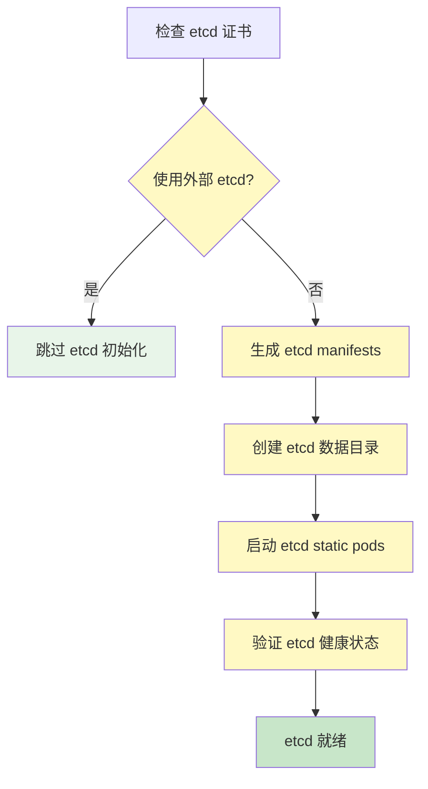

**etcd Static Pod 配置**：

```yaml
apiVersion: v1
kind: Pod
metadata:
  name: etcd
  namespace: kube-system
spec:
  containers:
  - name: etcd
    image: k8s.gcr.io/etcd:3.5.9-0
    command:
    - etcd
    - --advertise-client-urls=https://<node-ip>:2379
    - --listen-client-urls=https://0.0.0.0:2379
    - --listen-peer-urls=https://0.0.0.0:2380
    - --initial-advertise-peer-urls=https://<node-ip>:2380
    - --initial-cluster=<node-name>=https://<node-ip>:2380
    - --initial-cluster-token=etcd-cluster
    - --initial-cluster-state=new
    - --data-dir=/var/lib/etcd
    - --cert-file=/etc/kubernetes/pki/etcd/server.crt
    - --key-file=/etc/kubernetes/pki/etcd/server.key
    - --trusted-ca-file=/etc/kubernetes/pki/etcd/ca.crt
    - --client-cert-auth=true
    - --peer-cert-file=/etc/kubernetes/pki/etcd/peer.crt
    - --peer-key-file=/etc/kubernetes/pki/etcd/peer.key
    - --peer-trusted-ca-file=/etc/kubernetes/pki/etcd/ca.crt
    - --peer-client-cert-auth=true
    env:
    - name: ETCDCTL_API
      value: "3"
    volumeMounts:
    - name: etcd-data
      mountPath: /var/lib/etcd
    - name: etcd-certs
      mountPath: /etc/kubernetes/pki/etcd
      readOnly: true
  volumes:
  - name: etcd-data
    hostPath:
      path: /var/lib/etcd
  - name: etcd-certs
    hostPath:
      path: /etc/kubernetes/pki/etcd
```

### Phase 5: Control Plane（控制平面启动）

**目标**：启动 API Server、Controller Manager、Scheduler

**组件清单**：

| 组件 | 端口 | 功能 |
|------|------|------|
| kube-apiserver | 6443 | Kubernetes API Server |
| kube-controller-manager | 10257 | 控制器管理器 |
| kube-scheduler | 10259 | 调度器 |

**API Server 启动流程**：

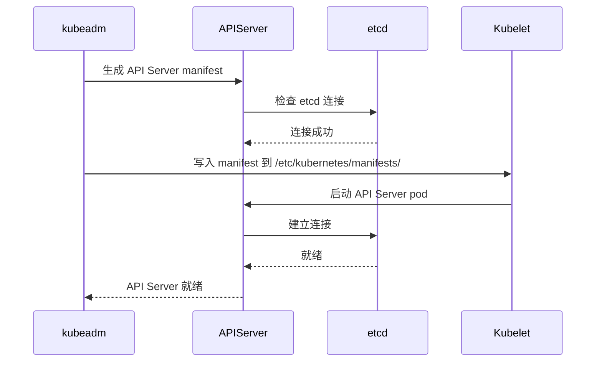

**API Server Manifest 关键配置**：

```yaml
apiVersion: v1
kind: Pod
metadata:
  name: kube-apiserver
  namespace: kube-system
spec:
  containers:
  - name: kube-apiserver
    image: k8s.gcr.io/kube-apiserver:v1.36.0
    command:
    - kube-apiserver
    - --advertise-address=<advertise-address>
    - --allow-privileged=true
    - --authorization-mode=Node,RBAC
    - --client-ca-file=/etc/kubernetes/pki/ca.crt
    - --enable-admission-plugins=NodeRestriction
    - --enable-bootstrap-token-auth=true
    - --etcd-cafile=/etc/kubernetes/pki/etcd/ca.crt
    - --etcd-certfile=/etc/kubernetes/pki/apiserver-etcd-client.crt
    - --etcd-keyfile=/etc/kubernetes/pki/apiserver-etcd-client.key
    - --etcd-servers=https://127.0.0.1:2379
    - --service-account-issuer=kubernetes.default.svc.cluster.local
    - --service-account-key-file=/etc/kubernetes/pki/sa.pub
    - --service-account-signing-key-file=/etc/kubernetes/pki/sa.key
    - --service-cluster-ip-range=<service-subnet>
    - --tls-cert-file=/etc/kubernetes/pki/apiserver.crt
    - --tls-private-key-file=/etc/kubernetes/pki/apiserver.key
```

### Phase 6: Kubelet Start（启动 Kubelet）

**目标**：启动 Kubelet

**Kubelet 启动流程**：

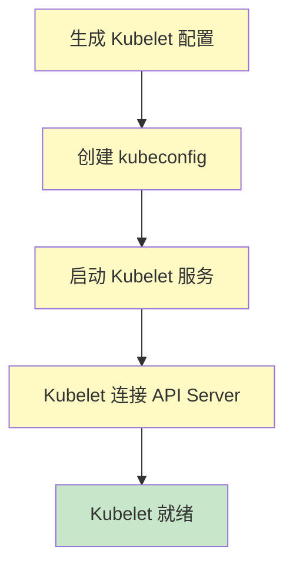

**Kubelet 配置文件**（`/var/lib/kubelet/config.yaml`）：

```yaml
apiVersion: kubelet.config.k8s.io/v1beta1
kind: KubeletConfiguration
authentication:
  anonymous:
    enabled: false
  webhook:
    cacheTTL: 2m
    enabled: true
  x509:
    clientCAFile: /etc/kubernetes/pki/ca.crt
authorization:
  mode: Webhook
  webhook:
    cacheAuthorizedTTL: 5m
    cacheUnauthorizedTTL: 30s
cgroupDriver: systemd
clusterDNS:
- 10.96.0.10
clusterDomain: cluster.local
containerLogMaxSize: 10Mi
containerLogMaxFiles: 5
enableServer: true
evictionHard:
  imagefs.available: 15%
  memory.available: 100Mi
  nodefs.available: 10%
failSwapOn: false
healthzBindAddress: 127.0.0.1
healthzPort: 10248
healthz:
  ping:
    enabled: true
  shm:
    enabled: true
rotateCertificates: true
runtimeRequestTimeout: 10m
serializeImagePulls: false
serverTLSBootstrap: true
staticPodPath: /etc/kubernetes/manifests
streamingConnectionIdleTimeout: 4h
syncFrequency: 1m
volumeStatsAggPeriod: 1m
```

### Phase 7: Wait Control Plane（等待控制平面就绪）

**目标**：等待所有控制平面组件健康

**健康检查端点**：

| 组件 | 端口 | 路径 |
|------|------|------|
| API Server | 6443 | /healthz |
| Scheduler | 10259 | /healthz |
| Controller Manager | 10257 | /healthz |

**等待逻辑**：

```go
func WaitControlPlaneReady(data InitData) error {
    client, err := data.WaitControlPlaneClient()
    if err != nil {
        return err
    }

    // 等待 API Server 就绪
    if err := WaitForAPIServerReady(client, 60*time.Second); err != nil {
        return errors.Wrap(err, "API Server did not start")
    }

    // 等待 Scheduler 就绪
    if err := WaitForComponentReady(client, "kube-scheduler", 60*time.Second); err != nil {
        return errors.Wrap(err, "Scheduler did not start")
    }

    // 等待 Controller Manager 就绪
    if err := WaitForComponentReady(client, "kube-controller-manager", 60*time.Second); err != nil {
        return errors.Wrap(err, "Controller Manager did not start")
    }

    return nil
}
```

### Phase 8: Upload Config（上传配置）

**目标**：将集群配置上传到 ConfigMap

**ConfigMap 清单**：

| ConfigMap | 用途 |
|-----------|------|
| kube-system/kubeadm-config | 集群初始化配置 |
| kube-system/cluster-info | 集群信息（含 CA 证书） |

**kubeadm-config ConfigMap**：

```yaml
apiVersion: v1
kind: ConfigMap
metadata:
  name: kubeadm-config
  namespace: kube-system
data:
  ClusterConfiguration: |
    apiServer:
      extraArgs:
        authorization-mode: Node,RBAC
    certificatesDir: /etc/kubernetes/pki
    clusterName: kubernetes
    controlPlaneEndpoint: ""
    controllerManager: {}
    dns: {}
    etcd:
      local:
        dataDir: /var/lib/etcd
    imageRepository: k8s.gcr.io
    kubernetesVersion: v1.36.0
    networking:
      dnsDomain: cluster.local
      podSubnet: 10.244.0.0/16
      serviceSubnet: 10.96.0.0/12
  InitConfiguration: |
    apiVersion: kubeadm.k8s.io/v1beta4
    bootstrapTokens:
    - token: abcdef.0123456789abcdef
    ...
```

### Phase 9: Upload Certs（上传证书）

**目标**：将控制平面证书加密后上传到 Secret

**Secret 创建**：

```yaml
apiVersion: v1
kind: Secret
metadata:
  name: kubeadm-certs
  namespace: kube-system
type: Opaque
data:
  <base64-encoded-encrypted-certs>
```

**加密流程**：

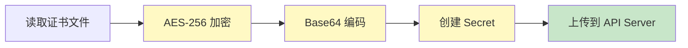

**使用场景**：
- 多个控制平面节点加入时共享证书
- 自动证书分发，无需手动复制

### Phase 10: Mark Control Plane（标记控制节点）

**目标**：标记控制节点

**Label 和 Taint**：

```yaml
# Node Label
metadata:
  labels:
    node-role.kubernetes.io/control-plane: ""
    node-role.kubernetes.io/master: ""  # 旧版本

# Node Taint
spec:
  taints:
  - key: node-role.kubernetes.io/control-plane
    effect: NoSchedule
  - key: node-role.kubernetes.io/master
    effect: NoSchedule
```

**作用**：
- **Label**：标识控制平面节点
- **Taint**：防止普通 Pod 调度到控制节点

### Phase 11: Bootstrap Token（创建 Bootstrap Token）

**目标**：创建 Bootstrap Token 供节点加入

**Token 格式**：

```
<token-id>.<token-secret>
```

**示例**：

```
abcdef.0123456789abcdef
```

**Token 描述**：

| 字段 | 类型 | 说明 |
|------|------|------|
| token-id | string | Token ID（6 字符） |
| token-secret | string | Token Secret（16 字符） |
| description | string | Token 描述 |
| ttl | string | Token 有效期（默认 24h） |
| usages | []string | Token 用途 |

**Token 创建代码**：

```go
func CreateBootstrapToken(data InitData) error {
    for _, token := range data.Cfg().BootstrapTokens {
        // 创建 Bootstrap Token 对象
        bootstrapToken := &bootstrapapi.BootstrapToken{
            TokenID: &token.Token.ID,
            TokenSecret: &token.Token.Secret,
            Description: &token.Description,
            TTL: &token.TTL.Duration,
            Expires: &token.Expires,
            Usages: []string{
                "signing",
                "authentication",
            },
        }

        // 创建 Secret
        secret := &corev1.Secret{
            Type: bootstrapapi.SecretTypeBootstrapToken,
            Data: map[string][]byte{
                bootstrapapi.BootstrapTokenIDKey:     []byte(*token.TokenID),
                bootstrapapi.BootstrapTokenSecretKey:  []byte(*token.TokenSecret),
                bootstrapapi.BootstrapTokenExpirationKey: []byte(token.Expires.Format(time.RFC3339)),
                bootstrapapi.BootstrapTokenUsageAuthentication: []byte("true"),
                bootstrapapi.BootstrapTokenUsageSigning: []byte("true"),
            },
        }

        // 创建 Secret
        _, err := data.Client().CoreV1().Secrets("kube-system").Create(
            context.TODO(),
            secret,
            metav1.CreateOptions{},
        )

        if err != nil {
            return err
        }
    }

    return nil
}
```

### Phase 12: Kubelet Finalize（Kubelet 最终配置）

**目标**：应用最终的 Kubelet 配置

**操作**：
- 重启 Kubelet
- 验证 Kubelet 健康状态
- 确保 Kubelet 正常运行

### Phase 13: Addons（安装插件）

**目标**：安装 CoreDNS 和 kube-proxy

**CoreDNS 部署**：

```yaml
apiVersion: v1
kind: ServiceAccount
metadata:
  name: coredns
  namespace: kube-system
---
apiVersion: v1
kind: ConfigMap
metadata:
  name: coredns
  namespace: kube-system
data:
  Corefile: |
    .:53 {
        errors
        health {
           lameduck 5s
        }
        ready
        kubernetes cluster.local in-addr.arpa ip6.arpa {
           pods insecure
           fallthrough in-addr.arpa ip6.arpa
           ttl 30
        }
        prometheus 9153
        forward . /etc/resolv.conf {
           max_concurrent 1000
        }
        cache 30
        loop
        reload
    }
---
apiVersion: apps/v1
kind: Deployment
metadata:
  name: coredns
  namespace: kube-system
spec:
  replicas: 2
  selector:
    matchLabels:
      k8s-app: kube-dns
  template:
    metadata:
      labels:
        k8s-app: kube-dns
    spec:
      containers:
      - name: coredns
        image: coredns/coredns:1.11.1
        args:
        - -conf
        - /etc/coredns/Corefile
        ports:
        - containerPort: 53
          name: dns
          protocol: UDP
        - containerPort: 53
          name: dns-tcp
          protocol: TCP
        - containerPort: 9153
          name: metrics
          protocol: TCP
```

**kube-proxy 部署**：

```yaml
apiVersion: v1
kind: ServiceAccount
metadata:
  name: kube-proxy
  namespace: kube-system
---
apiVersion: apps/v1
kind: DaemonSet
metadata:
  name: kube-proxy
  namespace: kube-system
spec:
  selector:
    matchLabels:
      k8s-app: kube-proxy
  template:
    metadata:
      labels:
        k8s-app: kube-proxy
    spec:
      containers:
      - name: kube-proxy
        image: k8s.gcr.io/kube-proxy:v1.36.0
        command:
        - /usr/local/bin/kube-proxy
        - --config=/var/lib/kube-proxy/config.conf
        - --hostname-override=$(NODE_NAME)
        securityContext:
          privileged: true
```

### Phase 14: Show Join Command（显示加入命令）

**目标**：显示节点加入集群的命令

**输出示例**：

```
kubeadm join 192.168.1.100:6443 \
  --token abcdef.0123456789abcdef \
  --discovery-token-ca-cert-hash sha256:1234...
```

**CA 证书哈希计算**：

```go
func GetDiscoveryTokenCACertHash(cert *x509.Certificate) (string, error) {
    // 计算 Subject Public Key Info (SPKI) 的 SHA256 哈希
    spki := cert.RawSubjectPublicKeyInfo

    hash := sha256.Sum256(spki)
    hashStr := hex.EncodeToString(hash[:])

    return "sha256:" + hashStr, nil
}
```

---

## 🔗 kubeadm join - 节点加入集群

### 命令流程

`kubeadm join` 通过两个主要阶段完成节点加入：

1. **Discovery（发现）** - 节点发现控制平面
2. **TLS Bootstrap（TLS 引导）** - 建立安全连接

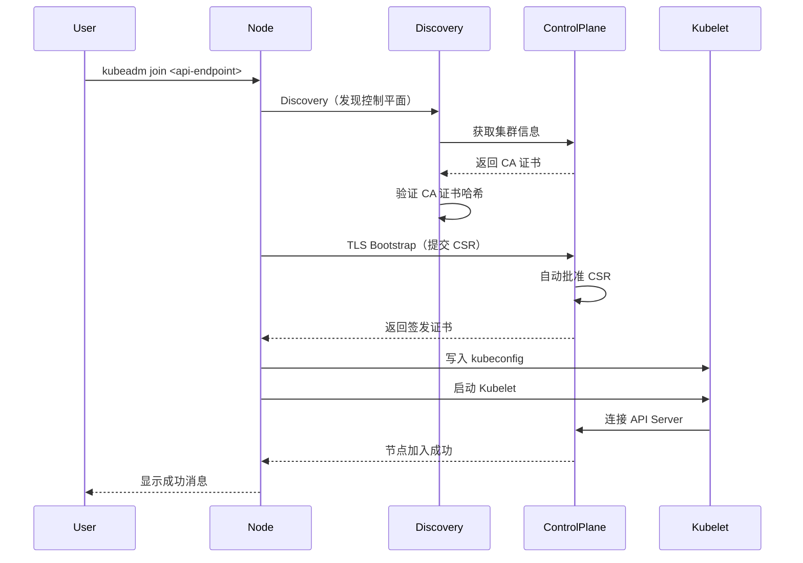

### Discovery（发现）

**发现方式**：

1. **Token Discovery** - 使用 Bootstrap Token
2. **File Discovery** - 使用 kubeconfig 文件
3. **HTTPS Discovery** - 从 HTTPS URL 获取 kubeconfig

**Token Discovery 流程**：

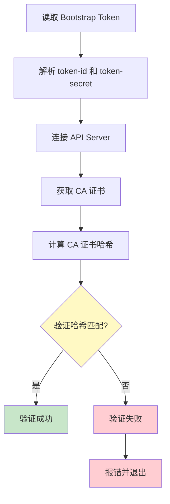

**核心代码**：

```go
// Token Discovery
func TokenDiscovery(discoveryToken, apiEndpoint, caCertHash string) (*Config, error) {
    // 解析 token
    token, err := token.NewToken(discoveryToken)
    if err != nil {
        return nil, errors.Wrap(err, "failed to parse discovery token")
    }

    // 连接 API Server
    client, err := CreateAPIClient(apiEndpoint, discoveryToken)
    if err != nil {
        return nil, errors.Wrap(err, "failed to connect to API Server")
    }

    // 获取 CA 证书
    caCert, err := GetCACertificate(client)
    if err != nil {
        return nil, errors.Wrap(err, "failed to get CA certificate")
    }

    // 验证 CA 证书哈希
    if caCertHash != "" {
        actualHash, err := GetDiscoveryTokenCACertHash(caCert)
        if err != nil {
            return nil, err
        }
        if actualHash != caCertHash {
            return nil, errors.New(
                "discovery token CA cert hash does not match provided hash",
            )
        }
    }

    return &Config{
        APIServerEndpoint: apiEndpoint,
        CACertificate: caCert,
        DiscoveryToken: token,
    }, nil
}
```

### TLS Bootstrap（TLS 引导）

**CSR 提交流程**：

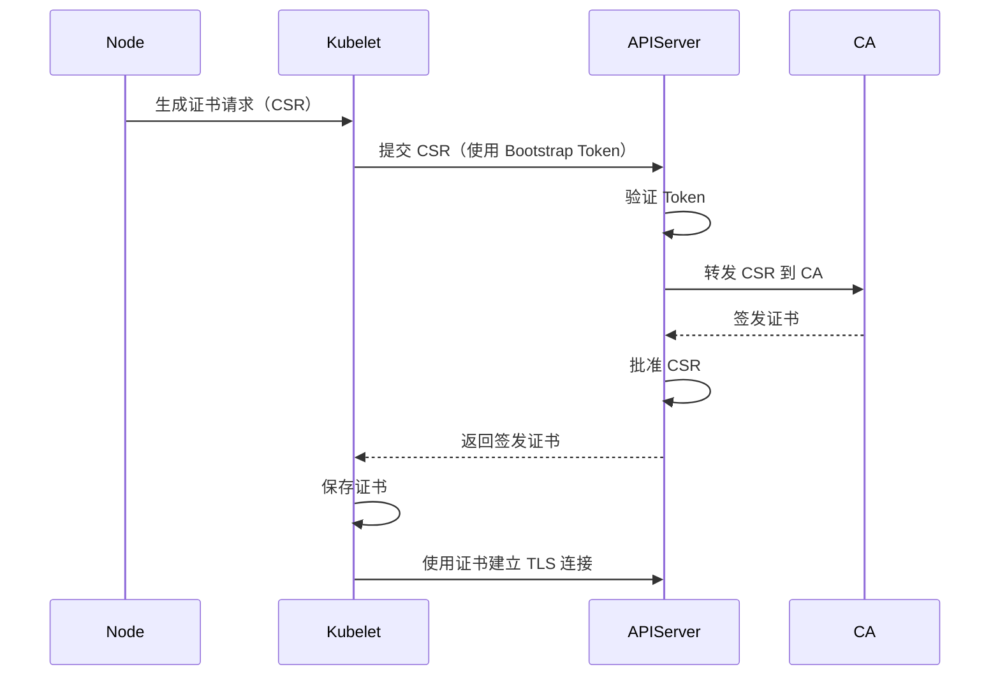

**CSR 创建**：

```go
func CreateCSR(nodeName string) (*x509.CertificateRequest, error) {
    privKey, err := rsa.GenerateKey(2048)
    if err != nil {
        return nil, err
    }

    template := x509.CertificateRequest{
        Subject: pkix.Name{
            CommonName:   fmt.Sprintf("system:node:%s", nodeName),
            Organization: []string{"system:nodes"},
        },
        DNSNames:    []string{nodeName},
        IPAddresses: []net.IP{net.ParseIP(nodeIP)},
        KeyUsage:    x509.KeyUsageDigitalSignature | x509.KeyUsageKeyEncipherment,
        ExtKeyUsage: []x509.ExtKeyUsage{
            x509.ExtKeyUsageServerAuth,
            x509.ExtKeyUsageClientAuth,
        },
    }

    csr, err := x509.CreateCertificateRequest(privKey, template)
    if err != nil {
        return nil, err
    }

    return csr, nil
}
```

### Worker Node 加入

**步骤**：

1. **Pre-flight 检查**
   - Root 权限
   - Swap 状态
   - Kubelet 安装
   - CRI 运行时

2. **Discovery**
   - 使用 Token 发现控制平面
   - 验证 CA 证书哈希

3. **TLS Bootstrap**
   - 生成 CSR
   - 提交到 API Server
   - 获取签发证书

4. **Kubelet 配置**
   - 写入 kubeconfig
   - 启动 Kubelet

5. **节点注册**
   - Kubelet 自动注册到集群

### Control Plane 节点加入

**额外步骤**：

1. **下载证书** - 从 Secret 下载控制平面证书
2. **解密证书** - 使用 CertificateKey 解密
3. **启动 etcd** - 加入 etcd 集群
4. **启动控制平面组件** - API Server, Controller Manager, Scheduler

---

## 📦 kubeadm reset - 节点重置

### 命令流程

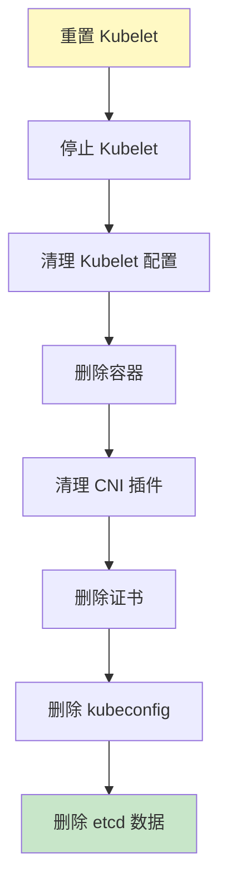

**核心操作**：

```bash
# 停止 Kubelet
systemctl stop kubelet

# 删除容器
docker rm -f $(docker ps -aq)

# 清理 CNI 插件
rm -rf /etc/cni/net.d/*
rm -rf /var/lib/cni/*

# 删除证书
rm -rf /etc/kubernetes/pki/*

# 删除 kubeconfig
rm -rf ~/.kube/*

# 删除 etcd 数据
rm -rf /var/lib/etcd
```

---

## 🔧 配置管理

### 配置文件结构

kubeadm 支持两种配置方式：

1. **命令行参数** - 快速配置
2. **YAML 配置文件** - 复杂配置

### InitConfiguration

**示例**：

```yaml
apiVersion: kubeadm.k8s.io/v1beta4
kind: InitConfiguration
bootstrapTokens:
- token: abcdef.0123456789abcdef
  ttl: 24h
  usages:
  - signing
  - authentication
localAPIEndpoint:
  advertiseAddress: 1.2.3.4
  bindPort: 6443
nodeRegistration:
  name: my-node
  criSocket: unix:///var/run/containerd/containerd.sock
  taints: []
---
apiVersion: kubeadm.k8s.io/v1beta4
kind: ClusterConfiguration
networking:
  serviceSubnet: 10.96.0.0/12
  podSubnet: 10.244.0.0/16
  dnsDomain: cluster.local
kubernetesVersion: v1.36.0
controlPlaneEndpoint: ""
imageRepository: k8s.gcr.io
---
apiVersion: kubelet.config.k8s.io/v1beta1
kind: KubeletConfiguration
cgroupDriver: systemd
```

### JoinConfiguration

**示例**：

```yaml
apiVersion: kubeadm.k8s.io/v1beta4
kind: JoinConfiguration
discovery:
  bootstrapToken:
    token: abcdef.0123456789abcdef
    apiServerEndpoint: 1.2.3.4:6443
    caCertHashes:
    - sha256:1234...
nodeRegistration:
  name: my-node
  criSocket: unix:///var/run/containerd/containerd.sock
```

---

## 🔐 安全机制

### Bootstrap Token 认证

**Token 组件**：

```go
type BootstrapToken struct {
    TokenID     string
    TokenSecret string
    Description string
    TTL         time.Duration
    Expires     time.Time
    Usages      []string
    Groups      []string
}
```

**Token 用途**：

- `signing` - 签名证书
- `authentication` - 认证节点

### TLS 证书管理

**证书轮换**：

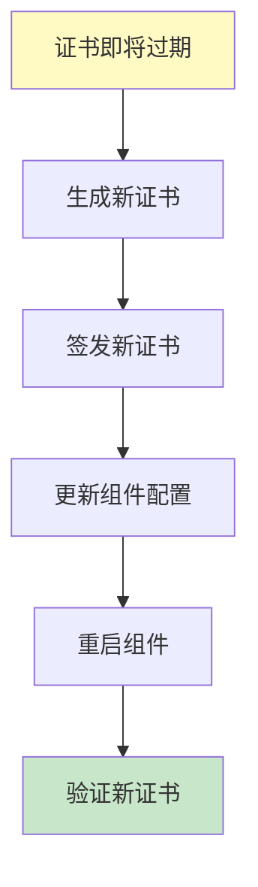

**证书更新命令**：

```bash
# 更新所有证书
kubeadm certs renew all

# 更新特定证书
kubeadm certs renew apiserver
```

### CA 证书哈希验证

**目的**：防止中间人攻击

**流程**：

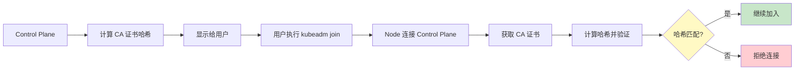

---

## 📊 性能优化

### 镜像拉取优化

**预拉取镜像**：

```bash
# 预拉取所需镜像
kubeadm config images pull

# 使用国内镜像仓库
kubeadm config images pull --image-registry registry.aliyuncs.com/google_containers
```

### 并发 Phase 执行

**配置**：

```yaml
# 允许并发执行 phases
skipPhases: []

# 跳过某些 phases 加速
skipPhases:
  - preflight  # 跳过前置检查（谨慎使用）
```

### Dry-run 模式

**用途**：预演操作而不实际执行

```bash
# 预演 init
kubeadm init --dry-run

# 预演 join
kubeadm join --dry-run
```

---

## 🚨 故障排查

### 常见问题

#### 1. Preflight 检查失败

**问题**：Swap 未关闭

```bash
# 临时关闭
swapoff -a

# 永久关闭
vi /etc/fstab
# 注释掉 swap 行
```

#### 2. 证书生成失败

**问题**：证书已过期

```bash
# 检查证书有效期
openssl x509 -in /etc/kubernetes/pki/ca.crt -noout -dates

# 更新证书
kubeadm certs renew all
```

#### 3. Kubelet 无法启动

**问题**：Cgroup 驱动不匹配

```bash
# 检查 Cgroup 驱动
docker info | grep Cgroup

# 配置 Kubelet
vi /var/lib/kubelet/config.yaml
# 设置 cgroupDriver: systemd
```

#### 4. 节点无法加入

**问题**：CA 证书哈希不匹配

```bash
# 重新获取哈希
kubeadm token create --print-join-command

# 确认哈希
openssl x509 -pubkey -noout -in /etc/kubernetes/pki/ca.crt | openssl rsa -pubin -outform DER | sha256sum
```

### 日志查看

**Kubelet 日志**：

```bash
# 查看 Kubelet 日志
journalctl -u kubelet -f

# 查看 Kubelet 状态
systemctl status kubelet
```

**组件日志**：

```bash
# 查看 API Server 日志
kubectl logs -n kube-system kube-apiserver-<node-name>

# 查看 Controller Manager 日志
kubectl logs -n kube-system kube-controller-manager-<node-name>

# 查看 Scheduler 日志
kubectl logs -n kube-system kube-scheduler-<node-name>
```

---

## 💡 最佳实践

### 1. 规划网络

**推荐配置**：

```yaml
networking:
  serviceSubnet: 10.96.0.0/12    # Service CIDR
  podSubnet: 10.244.0.0/16      # Pod CIDR
  dnsDomain: cluster.local
```

**注意事项**：
- 避免与现有网络冲突
- Pod CIDR 大小要足够（/16 支持最多 65534 个 Pod）
- Service CIDR 使用私有地址范围

### 2. 规划 etcd

**推荐配置**：

```yaml
etcd:
  local:
    dataDir: /var/lib/etcd
    imageRepository: k8s.gcr.io
    extraArgs:
      - --auto-compaction-retention=240
      - --snapshot-count=10000
```

**优化**：
- 使用 SSD 存储 etcd 数据
- 定期备份 etcd 数据
- 配置适当的保留策略

### 3. 使用配置文件

**优势**：

- 版本控制
- 可重复部署
- 团队协作
- 审计跟踪

**示例**：

```bash
# 生成默认配置
kubeadm config print init-defaults > kubeadm-config.yaml

# 修改配置
vi kubeadm-config.yaml

# 使用配置文件初始化
kubeadm init --config kubeadm-config.yaml
```

### 4. 高可用控制平面

**架构**：

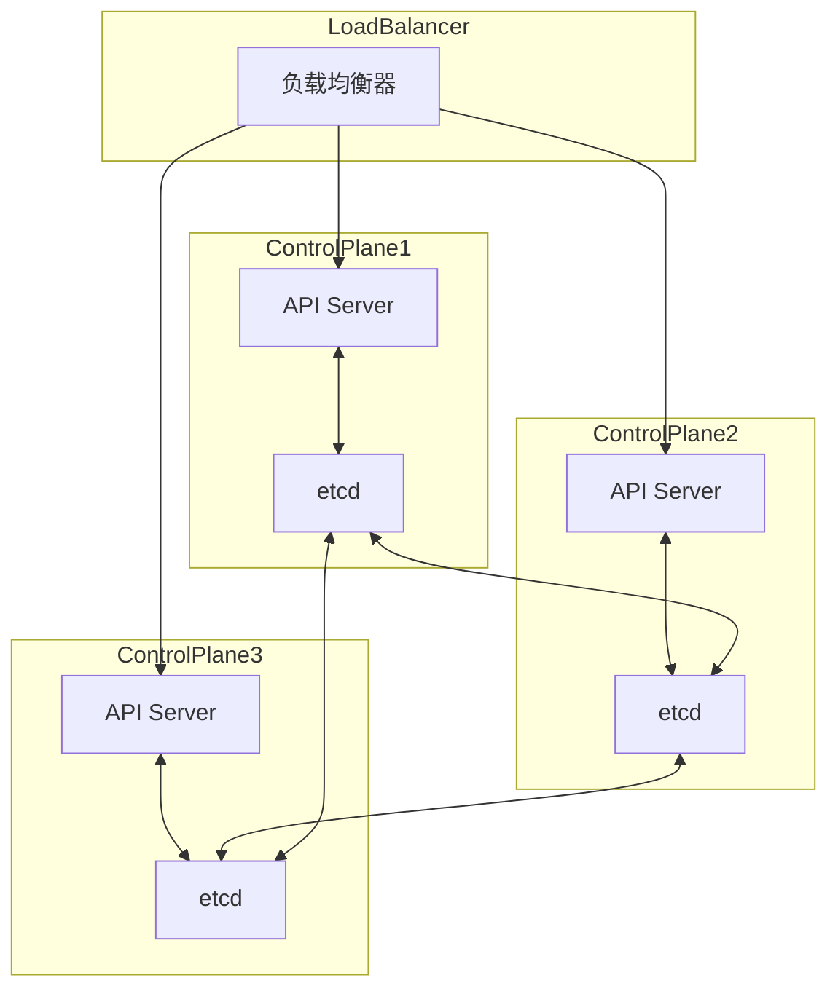

**配置**：

```yaml
controlPlaneEndpoint: "lb.example.com:6443"
```

### 5. 证书管理

**最佳实践**：

```bash
# 定期检查证书有效期
kubeadm certs check-expiration

# 提前更新证书（提前 30 天）
kubeadm certs renew all

# 备份证书
tar -czf kubernetes-certs-$(date +%Y%m%d).tar.gz /etc/kubernetes/pki
```

### 6. 监控和告警

**推荐指标**：

| 组件 | 指标 | 告警阈值 |
|------|------|---------|
| etcd | etcd_disk_wal_fsync_duration_seconds | > 0.1s |
| API Server | apiserver_request_duration_seconds | > 1s |
| Controller Manager | controller_manager_workqueue_duration_seconds | > 5s |
| Kubelet | kubelet_pleg_relist_duration_seconds | > 5s |

---

## 📚 参考资料

- [Kubernetes 文档 - kubeadm](https://kubernetes.io/docs/setup/production-environment/tools/kubeadm/)
- [kubeadm GitHub 仓库](https://github.com/kubernetes/kubeadm)
- [Bootstrap Token 认证](https://kubernetes.io/docs/reference/access-authn-authz/bootstrap-tokens/)
- [证书管理](https://kubernetes.io/docs/tasks/administer-cluster/kubeadm/kubeadm-certs/)
- [升级集群](https://kubernetes.io/docs/tasks/administer-cluster/kubeadm/kubeadm-upgrade/)

---

::: tip 总结
kubeadm 是 Kubernetes 集群初始化的核心工具，通过 14 个 phases 完成控制平面的搭建。理解 kubeadm 的各个 phase 对于排查集群问题和自定义部署流程非常重要。

**关键要点**：
- 🔐 Bootstrap Token 是节点加入的安全机制
- 📜 证书生成和管理是集群安全的基础
- 🔄 Workflow Runner 架构确保 phases 的可重入和并发执行
- 🛡️ CA 证书哈希验证防止中间人攻击
- ⚙️ 配置文件支持复杂的定制需求
:::
