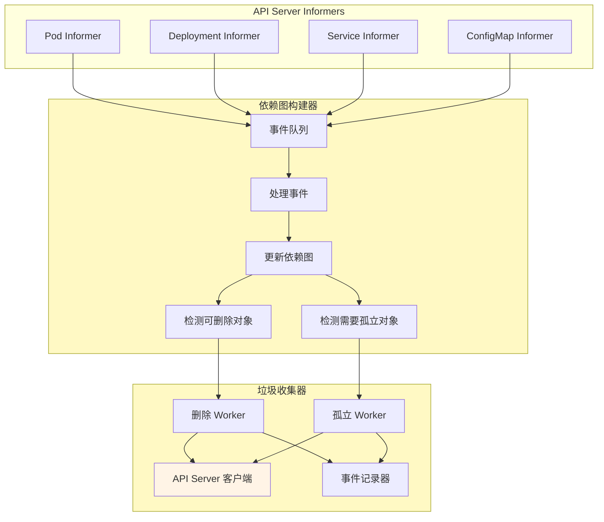
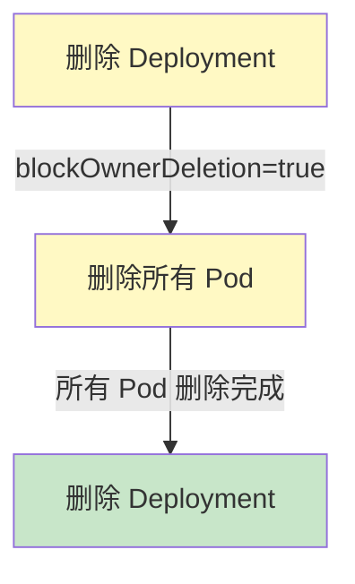
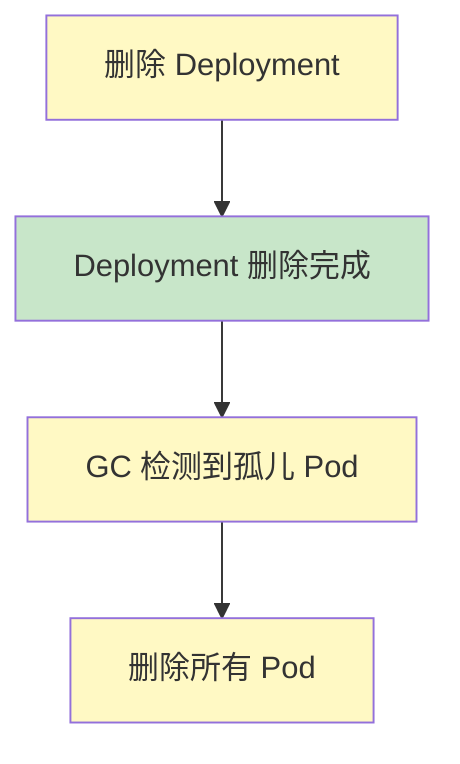
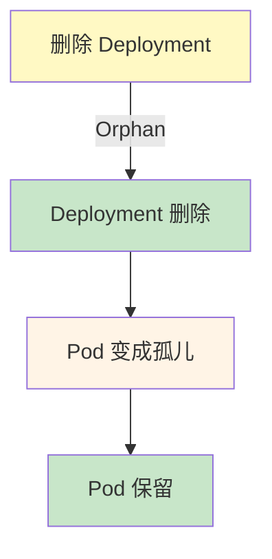

# Garbage Collector（垃圾收集器）深度分析

> 更新日期：2026-03-08
> 分析版本：v1.36.0-alpha.0
> 源码路径：`pkg/controller/garbagecollector/`

---

## 📋 概述

**Garbage Collector** 是 Kubernetes 控制器管理器（kube-controller-manager）的核心组件之一，负责管理 Kubernetes 对象的依赖关系和级联删除。当一个对象被删除时，Garbage Collector 会自动删除依赖于该对象的所有资源。

### 核心特性

- ✅ **依赖关系管理** - 构建和维护对象间的依赖图
- ✅ **级联删除** - 支持三种删除策略（Foreground, Background, Orphan）
- ✅ **Finalizer 机制** - 通过 Finalizer 阻断删除，确保清理工作完成
- ✅ **双向依赖检测** - 防止循环依赖导致的死锁
- ✅ **并发处理** - 多个 Worker 并发处理删除和孤立操作
- ✅ **性能优化** - 批处理、增量更新、缓存机制

### 级联删除策略

| 策略 | 说明 | 行为 |
|------|------|------|
| **Foreground** | 前台删除 | 先删除依赖对象，再删除父对象 |
| **Background** | 后台删除 | 先删除父对象，再删除依赖对象（默认） |
| **Orphan** | 孤立模式 | 删除父对象，依赖对象保留（不删除） |

---

## 🏗️ 架构设计

### 整体架构

Garbage Collector 采用 **生产者-消费者** 架构，分为两个主要组件：

1. **GraphBuilder** - 生产者：监听对象变化，构建依赖图
2. **GarbageCollector** - 消费者：根据依赖图执行删除和孤立操作



### 代码结构

```
pkg/controller/garbagecollector/
├── garbagecollector.go       # 主控制器逻辑
├── graph_builder.go          # 依赖图构建器
├── graph.go                 # 依赖图数据结构
├── operations.go            # 删除和孤立操作
├── patch.go                # Patch 操作
├── dump.go                 # 调试工具
├── uid_cache.go             # UID 缓存
├── errors.go               # 错误定义
└── metrics/                # 监控指标
```

### 依赖图结构

Garbage Collector 使用 **DAG（有向无环图）** 来表示对象间的依赖关系：

```go
// node 表示依赖图中的一个节点
type node struct {
    identity       objectReference  // 对象的唯一标识
    dependents    map[types.UID]*node  // 依赖该对象的所有节点
    owners        *[]metav1.OwnerReference  // 该对象的 owner
    virtual       bool                  // 是否为虚拟节点（用于调试）
    beingDeleted  bool                  // 是否正在被删除
    deletingDependentsCount int    // 正在删除的依赖对象数量
}

// GraphBuilder 构建和维护依赖图
type GraphBuilder struct {
    monitors      monitors                  // 所有资源的监听器
    uidToNode     *concurrentUIDToNode     // UID 到节点的映射
    graphChanges  workqueue.Interface            // 图变更事件队列
    attemptToDelete workqueue.Interface            // 可删除对象队列
    attemptToOrphan workqueue.Interface            # 需要孤立的对象队列
    ...
}
```

---

## 🔄 依赖关系图构建

### ownerReference 机制

Kubernetes 通过 `ownerReference` 字段建立对象间的所有权关系：

```yaml
# Pod 拥有 owner（Deployment）
apiVersion: v1
kind: Pod
metadata:
  name: my-pod
  ownerReferences:
  - apiVersion: apps/v1
    kind: Deployment
    name: my-deployment
    uid: 1234-5678-9abc-def0-123456789abc
    controller: true
    blockOwnerDeletion: true
```

**ownerReference 字段**：

| 字段 | 类型 | 说明 |
|------|------|------|
| apiVersion | string | owner 的 API 版本 |
| kind | string | owner 的类型 |
| name | string | owner 的名称 |
| uid | types.UID | owner 的唯一标识 |
| controller | bool | 是否为控制器管理的对象 |
| blockOwnerDeletion | bool | 是否阻塞 owner 删除 |

### 依赖图构建流程

```mermaid
sequenceDiagram
    participant Informer
    participant GraphBuilder
    participant Graph
    participant Queue

    Informer->>GraphBuilder: 对象添加事件
    GraphBuilder->>Graph: 创建/更新节点
    GraphBuilder->>Graph: 添加 owner 链接
    GraphBuilder->>Graph: 添加 dependent 链接
    GraphBuilder->>Queue: 检查可删除对象
    GraphBuilder->>Queue: 检查需要孤立的对象
    Queue->>GraphBuilder: 处理下一个事件

    style Graph fill:#fff9c4
    style Queue fill:#fff9c4
```

**核心代码**：

```go
// GraphBuilder 处理对象添加事件
func (gb *GraphBuilder) processGraphChanges() {
    for {
        event, shutdown := gb.graphChanges.Get()
        if shutdown {
            break
        }

        switch event.eventType {
        case addEvent:
            gb.processObjectAdd(event.obj, event.gvk)
        case updateEvent:
            gb.processObjectUpdate(event.oldObj, event.newObj, event.gvk)
        case deleteEvent:
            gb.processObjectDelete(event.obj, event.gvk)
        }
    }
}

// 处理对象添加
func (gb *GraphBuilder) processObjectAdd(obj interface{}, gvk schema.GroupVersionKind) {
    accessor, err := meta.Accessor(obj)
    if err != nil {
        return
    }

    // 获取 ownerReferences
    ownerRefs := accessor.GetOwnerReferences()

    // 创建或更新节点
    node := &node{
        identity: objectReferenceFromObject(obj, gvk),
        owners:    &ownerRefs,
    }

    // 更新依赖图
    gb.uidToNode.set(accessor.GetUID(), node)

    // 如果对象有 owner，更新 owner 的 dependents
    for _, ownerRef := range ownerRefs {
        ownerNode := gb.uidToNode.get(ownerRef.UID)
        if ownerNode != nil {
            ownerNode.dependents[accessor.GetUID()] = node
        }
    }

    // 检查对象是否可以被垃圾回收
    gb.maybeScheduleDeletion(node)
}

// 检查并调度删除
func (gb *GraphBuilder) maybeScheduleDeletion(node *node) {
    // 对象没有 owner 或 owner 不存在，可以被删除
    if len(node.owners) == 0 || gb.absentOwnerCache.has(node.owners) {
        gb.attemptToDelete.Add(node.identity)
    }
}
```

### 双向依赖检测

**问题**：循环依赖会导致删除死锁

**检测方法**：

```go
// 检测循环依赖
func (gb *GraphBuilder) detectCycle(current *node, visited map[types.UID]bool, path []*node) bool {
    if visited[current.identity.UID] {
        // 发现循环
        return true
    }

    visited[current.identity.UID] = true
    path = append(path, current)

    // 遍历所有的 owner
    for _, ownerRef := range current.owners {
        ownerNode := gb.uidToNode.get(ownerRef.UID)
        if ownerNode == nil {
            continue
        }

        if gb.detectCycle(ownerNode, visited, path) {
            klog.Warningf("Detected cycle in ownerReferences: %v", path)
            return true
        }
    }

    return false
}
```

---

## 🗑️ 级联删除机制

### 删除策略详解

#### 1. Foreground（前台删除）

**行为**：先删除所有依赖对象，再删除父对象



**实现**：

```go
// Foreground 删除策略
func (gc *GarbageCollector) processAttemptToDeleteWorker(item *node) error {
    // 设置 blockOwnerDeletion 标志
    if item.deletingDependentsCount > 0 {
        return nil  // 等待依赖删除完成
    }

    // 删除所有依赖对象
    for dependentUID, dependentNode := range item.dependents {
        if err := gc.deleteObject(dependentNode.identity, "", policyForeground); err != nil {
            klog.Errorf("Failed to delete dependent %v: %v", dependentNode.identity, err)
            continue
        }
    }

    // 所有依赖删除后，删除父对象
    return gc.deleteObject(item.identity, "", policyForeground)
}
```

#### 2. Background（后台删除）

**行为**：先删除父对象，再删除依赖对象



**实现**：

```go
// Background 删除策略
func (gc *GarbageCollector) processAttemptToDeleteWorker(item *node) error {
    // 直接删除父对象
    if err := gc.deleteObject(item.identity, "", policyBackground); err != nil {
        return err
    }

    // 父对象删除后，依赖对象会成为孤儿
    // GraphBuilder 会检测到并添加到 attemptToOrphan 队列
    return nil
}
```

#### 3. Orphan（孤立模式）

**行为**：删除父对象，依赖对象保留



**实现**：

```go
// Orphan 删除策略
func (gc *GarbageCollector) processAttemptToOrphanWorker(item *node) error {
    // 移除所有依赖对象的 ownerReference
    for dependentUID, dependentNode := range item.dependents {
        if err := gc.orphanDependents(dependentNode); err != nil {
            klog.Errorf("Failed to orphan dependent %v: %v", dependentNode.identity, err)
        continue
        }
    }

    // 删除父对象
    return gc.deleteObject(item.identity, "", policyBackground)
}

// 孤立依赖对象
func (gc *GarbageCollector) orphanDependents(node *node) error {
    // 获取依赖对象
    obj, err := gc.getObject(node.identity)
    if err != nil {
        return err
    }

    // 移除 ownerReference
    patch := &metav1.PartialObjectMetadata{
        OwnerReferences: []metav1.OwnerReference{},
    }

    patchData, err := json.Marshal(map[string]interface{}{
        "metadata": map[string]interface{}{
            "ownerReferences": []metav1.OwnerReference{},
        },
    })

    _, err = gc.patchObject(node.identity, patchData, types.MergePatchType)
    return err
}
```

### 删除流程

```mermaid
sequenceDiagram
    participant User
    participant Kubectl
    participant GC
    participant APIServer

    User->>Kubectl: kubectl delete deployment my-dep
    Kubectl->>APIServer: DELETE deployment
    APIServer-->>Kubectl: 设置 deletionTimestamp
    APIServer->>GC: Update Event
    GC->>GC: 检测到可删除对象
    GC->>APIServer: 删除所有 Pod（Foreground）
    APIServer-->>GC: Pod 删除完成
    GC->>APIServer: 删除 Deployment
    APIServer-->>GC: Deployment 删除完成
    GC->>GC: 从图中移除节点
    GC-->>User: 级联删除完成

    style GC fill:#fff9c4
    style APIServer fill:#fff4e6
```

---

## 🚧 Finalizer 机制

### 目的

Finalizer 是一种**阻塞删除**的机制，确保在对象真正删除前完成清理工作。

### Finalizer 工作流程

```mermaid
sequenceDiagram
    participant User
    participant APIServer
    participant Controller
    participant GC

    User->>APIServer: DELETE 对象
    APIServer->>APIServer: 设置 deletionTimestamp
    APIServer->>APIServer: 添加 finalizers（如果不存在）
    APIServer-->>User: 返回 202 Accepted
    Controller->>APIServer: 执行清理工作
    Controller->>APIServer: 移除 finalizer
    Controller-->>APIServer: 返回 200 OK
    APIServer->>APIServer: 所有 finalizers 移除？
    APIServer->>APIServer: 是
    APIServer->>APIServer: 删除对象
    APIServer->>GC: 对象删除事件
    GC->>GC: 处理依赖对象

    style APIServer fill:#fff4e6
    style Controller fill:#fff9c4
    style GC fill:#fff9c4
```

### Finalizer 示例

```yaml
# PVC 添加 finalizer
apiVersion: v1
kind: PersistentVolumeClaim
metadata:
  name: my-pvc
  finalizers:
  - kubernetes.io/pv-protection  # 阻止删除 PVC 直到 PV 解绑
spec:
  accessModes:
  - ReadWriteOnce
  resources:
    requests:
      storage: 10Gi
```

**Finalizer 删除流程**：

```go
// 移除 Finalizer
func (gc *GarbageCollector) removeFinalizer(logger klog.Logger, owner *node, targetFinalizer string) error {
    err := retry.RetryOnConflict(retry.DefaultBackoff, func() error {
        // 获取对象
        ownerObject, err := gc.getObject(owner.identity)
        if errors.IsNotFound(err) {
            return nil  // 对象已删除
        }

        // 访问 metadata
        accessor, err := meta.Accessor(ownerObject)
        if err != nil {
            return err
        }

        // 获取当前 finalizers
        finalizers := accessor.GetFinalizers()

        // 移除目标 finalizer
        var newFinalizers []string
        for _, f := range finalizers {
            if f == targetFinalizer {
                continue
            }
            newFinalizers = append(newFinalizers, f)
        }

        // 构造 patch
        patch, err := json.Marshal(&ObjectMetaForFinalizersPatch{
            ResourceVersion: accessor.GetResourceVersion(),
            Finalizers:      newFinalizers,
        })

        // 应用 patch
        _, err = gc.patchObject(owner.identity, patch, types.MergePatchType)
        return err
    })

    return err
}
```

---

## 📊 并发处理机制

### Worker 模型

Garbage Collector 使用**多个 Worker** 并发处理队列：

```go
// 启动 GC Workers
func (gc *GarbageCollector) Run(ctx context.Context, workers int, initialSyncTimeout time.Duration) {
    var wg sync.WaitGroup

    // 启动 GraphBuilder
    wg.Go(func() {
        gc.dependencyGraphBuilder.Run(ctx)
    })

    // 启动删除 Workers
    for i := 0; i < workers; i++ {
        wg.Go(func() {
            wait.UntilWithContext(ctx, gc.runAttemptToDeleteWorker, 1*time.Second)
        })
        wg.Go(func() {
            wait.Until(func() { gc.runAttemptToOrphanWorker(logger) }, 1*time.Second, ctx.Done())
        })
    }

    <-ctx.Done()
    wg.Wait()
}

// 删除 Worker
func (gc *GarbageCollector) runAttemptToDeleteWorker() {
    for {
        item, shutdown := gc.attemptToDelete.Get()
        if shutdown {
            break
        }

        if err := gc.processAttemptToDeleteWorker(item); err != nil {
            klog.Errorf("Failed to process attemptToDelete item %v: %v", item.identity, err)
            // 失败后重新入队
            gc.attemptToDelete.AddRateLimited(item.identity)
        }
    }
}

// 孤立 Worker
func (gc *GarbageCollector) runAttemptToOrphanWorker(logger klog.Logger) {
    for {
        item, shutdown := gc.attemptToOrphan.Get()
        if shutdown {
            break
        }

        if err := gc.processAttemptToOrphanWorker(item); err != nil {
            klog.Errorf("Failed to process attemptToOrphan item %v: %v", item.identity, err)
            gc.attemptToOrphan.AddRateLimited(item.identity)
        }
    }
}
```

### 速率限制

```go
// 创建带速率限制的队列
attemptToDelete := workqueue.NewTypedRateLimitingQueueWithConfig(
    workqueue.DefaultTypedControllerRateLimiter[*node](),
    workqueue.TypedRateLimitingQueueConfig[*node]{
        Name: "garbage_collector_attempt_to_delete",
    },
)

// 速率限制器
func DefaultTypedControllerRateLimiter[T]() TypedRateLimiter[T] {
    return &TypedControllerRateLimiter[T]{
        // 最大每秒处理 10 个对象
        maxPerSecond: 10,
        // 最小间隔 100ms
        minBackoff: 100 * time.Millisecond,
    }
}
```

---

## 🔍 监控和指标

### 关键指标

| 指标 | 类型 | 说明 |
|------|------|------|
| `garbage_collector_attempt_to_delete_total` | Counter | 尝试删除的总次数 |
| `garbage_collector_attempt_to_orphan_total` | Counter | 尝试孤立的总次数 |
| `garbage_collector_delete_latency` | Histogram | 删除操作的延迟 |
| `garbage_collector_orphan_latency` | Histogram | 孤立操作的延迟 |
| `garbage_collector_attempt_to_delete_queue_length` | Gauge | 删除队列长度 |
| `garbage_collector_attempt_to_orphan_queue_length` | Gauge | 孤立队列长度 |
| `garbage_collector_graph_changes_total` | Counter | 图变更事件总数 |

### 监控代码

```go
// 注册指标
func Register() {
    metrics.RegisterMetrics(&metrics.RegisterOpts{
        Namespace:      "garbage_collector",
        Subsystem:      "controller",
        StabilityLevel: metrics.ALPHA,
    })
}

// 记录删除操作
func (gc *GarbageCollector) deleteObject(item objectReference, resourceVersion string, policy *metav1.DeletionPropagation) error {
    startTime := time.Now()
    defer func() {
        latency := time.Since(startTime)
        metrics.GarbageCollectorDeleteLatency.Observe(latency.Seconds())
    }()

    err := gc.deleteObject(item, resourceVersion, policy)
    if err == nil {
        metrics.GarbageCollectorAttemptToDeleteTotal.Inc()
    }

    return err
}
```

---

## ⚡ 性能优化

### 1. 增量更新

Garbage Collector 只更新受影响的对象，而不是全量重建图：

```go
// 增量更新节点
func (gb *GraphBuilder) processObjectUpdate(oldObj, newObj interface{}, gvk schema.GroupVersionKind) {
    oldNode := gb.uidToNode.get(oldUID)
    newNode := gb.uidToNode.get(newUID)

    // 如果依赖关系没有变化，跳过
    if reflect.DeepEqual(oldNode.owners, newNode.owners) &&
       reflect.DeepEqual(oldNode.dependents, newNode.dependents) {
        return
    }

    // 更新节点
    gb.uidToNode.set(newUID, newNode)

    // 检查是否需要重新调度删除
    gb.maybeScheduleDeletion(newNode)
}
```

### 2. UID 缓存

避免重复查询 API Server：

```go
// UID 缓存
type ReferenceCache struct {
    cache *lru.Cache
    mutex sync.RWMutex
}

func NewReferenceCache(size int) *ReferenceCache {
    return &ReferenceCache{
        cache: lru.New(size),
    }
}

func (rc *ReferenceCache) has(owners *[]metav1.OwnerReference) bool {
    rc.mutex.RLock()
    defer rc.mutex.RUnlock()

    for _, owner := range *owners {
        if _, exists := rc.cache.Get(owner.UID); exists {
            return true
        }
    }

    return false
}
```

### 3. 批处理

批量删除依赖对象：

```go
// 批量删除
func (gc *GarbageCollector) processAttemptToDeleteWorker(item *node) error {
    var deletionErrors []error

    // 批量删除所有依赖
    for dependentUID, dependentNode := range item.dependents {
        if err := gc.deleteObject(dependentNode.identity, "", policyForeground); err != nil {
            deletionErrors = append(deletionErrors, err)
        }
    }

    // 如果有失败，记录并继续
    if len(deletionErrors) > 0 {
        klog.Warningf("Failed to delete some dependents: %v", deletionErrors)
    }

    // 删除父对象
    return gc.deleteObject(item.identity, "", policyForeground)
}
```

---

## 🚨 故障排查

### 常见问题

#### 1. 对象无法删除

**问题**：Finalizer 未移除

```bash
# 检查对象状态
kubectl get pod my-pod -o yaml | grep finalizers

# 手动移除 finalizer（谨慎使用）
kubectl patch pod my-pod -p '{"metadata":{"finalizers":[]}}' --type=merge
```

#### 2. 依赖对象未删除

**问题**：级联删除卡住

```bash
# 检查依赖关系
kubectl get pod -o wide

# 查看 GC 日志
kubectl logs -n kube-system kube-controller-manager-<node-name> | grep garbage-collector

# 检查 GC 指标
curl http://<controller-manager>:10257/metrics | grep garbage_collector
```

#### 3. 循环依赖

**问题**：依赖图中出现循环

```bash
# 查看依赖关系
kubectl get deployment my-dep -o jsonpath='{.metadata.ownerReferences}'

# 使用 dump 工具查看依赖图
kubectl get pods --all-namespaces -o json | jq '.items[] | {name: .metadata.name, owners: .metadata.ownerReferences}'
```

### 调试工具

#### Garbage Collector Dump

```bash
# 导出当前依赖图
kubectl get --raw /api/v1/namespaces/kube-system/configmaps/garbage-collector-config

# 查看依赖图
kubectl describe configmap garbage-collector-config -n kube-system
```

#### 查看 GC 日志

```bash
# 查看 GC 日志
kubectl logs -n kube-system kube-controller-manager-<node-name> -f | grep garbage-collector

# 设置详细日志
vi /etc/kubernetes/manifests/kube-controller-manager.yaml
# 添加: --v=4
```

---

## 💡 最佳实践

### 1. 使用 Finalizer 进行清理

**示例**：PVC 绑定和解绑

```go
// PVC 控制器
func (r *PVCReconciler) Reconcile(ctx context.Context, req ctrl.Request) (ctrl.Result, error) {
    pvc := &corev1.PersistentVolumeClaim{}
    if err := r.Get(ctx, req.NamespacedName, pvc); err != nil {
        return ctrl.Result{}, err
    }

    // PVC 被删除
    if !pvc.DeletionTimestamp.IsZero() {
        // 检查是否有 PV 绑定
        if pvc.Spec.VolumeName != "" {
            // 移除 finalizer
            pvc.Finalizers = removeString(pvc.Finalizers, "kubernetes.io/pv-protection")
            if err := r.Update(ctx, pvc); err != nil {
                return ctrl.Result{}, err
            }
        }
        return ctrl.Result{}, nil
    }

    return ctrl.Result{}, nil
}
```

### 2. 避免循环依赖

**原则**：
- 不要让 A 依赖 B，B 依赖 A
- 使用中间对象解耦依赖
- 使用标签和 Selector 而不是 ownerReference

### 3. 监控 GC 指标

**推荐告警**：

```yaml
# Prometheus 告警规则
groups:
- name: garbage_collector
  rules:
  - alert: GCDeleteLatencyHigh
    expr: histogram_quantile(0.99, garbage_collector_delete_latency) > 30
    for: 5m
    labels:
      severity: warning
  - alert: GCQueueLengthHigh
    expr: garbage_collector_attempt_to_delete_queue_length > 1000
    for: 5m
    labels:
      severity: warning
```

### 4. 性能调优

**配置参数**：

```yaml
# kube-controller-manager 配置
apiVersion: v1
kind: Pod
metadata:
  name: kube-controller-manager
  namespace: kube-system
spec:
  containers:
  - name: kube-controller-manager
    args:
    - --concurrent-gc-syncs=20          # GC 并发数（默认 20）
    - --enable-garbage-collector=true      # 启用 GC
    - --garbage-collector-sync-period=1m  # GC 同步周期
```

---

## 📚 参考资料

- [Kubernetes 文档 - 垃圾收集](https://kubernetes.io/docs/concepts/architecture/garbage-collection/)
- [Owner References](https://kubernetes.io/docs/concepts/overview/working-with-objects/ownership-dependents/)
- [Finalizers](https://kubernetes.io/docs/concepts/overview/working-with-objects/finalizers/)
- [Kubernetes 源码 - Garbage Collector](https://github.com/kubernetes/kubernetes/tree/master/pkg/controller/garbagecollector)

---

::: tip 总结
Garbage Collector 是 Kubernetes 管理对象依赖和级联删除的核心组件。理解其工作机制对于排查删除问题和设计控制器非常重要。

**关键要点**：
- 🔗 ownerReference 建立对象间的所有权关系
- 📊 依赖图（DAG）跟踪所有依赖关系
- 🗑️ 三种级联删除策略（Foreground, Background, Orphan）
- 🚧 Finalizer 阻断删除，确保清理工作完成
- 🔄 并发处理提高性能
- 📈 监控指标帮助诊断问题
:::
