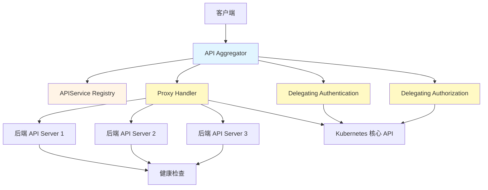
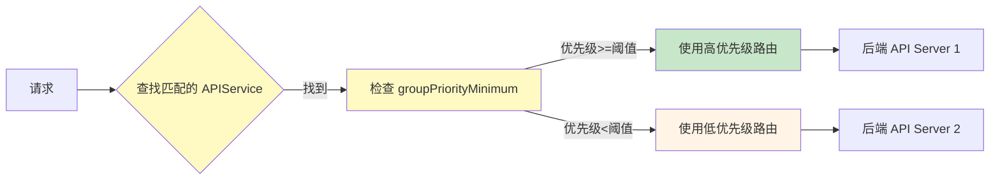
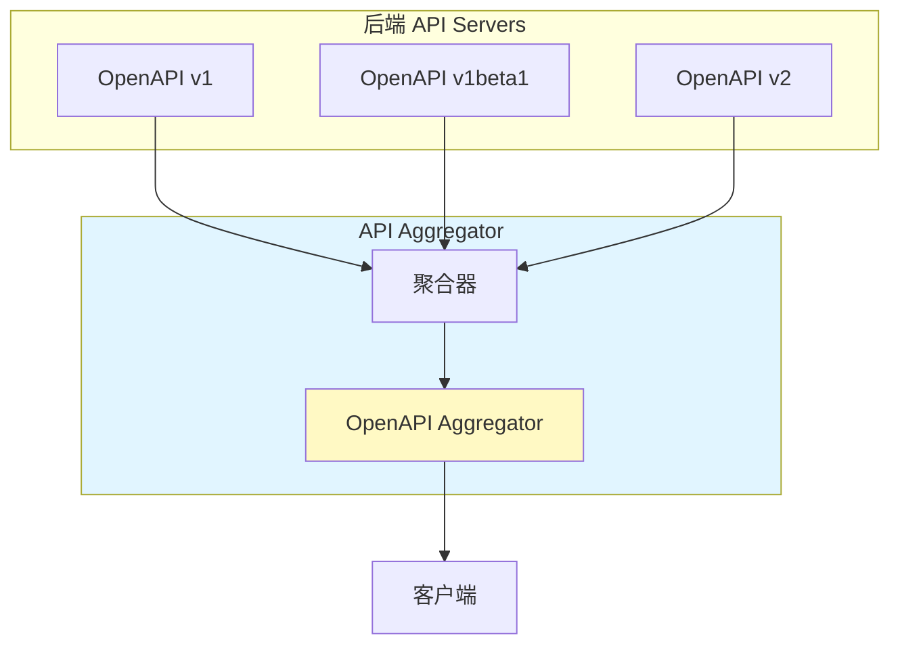

# Kube-Aggregator（API 聚合器）深度分析

> 更新日期：2026-03-08
> 分析版本：v1.36.0-alpha.0
> 源码路径：`staging/src/k8s.io/kube-aggregator/`

---

## 📋 概述

**Kube-Aggregator** 是 Kubernetes API Server 的扩展层，允许用户通过 APIService 将自定义 API 服务器聚合到 Kubernetes API。这是 CRD（Custom Resource Definition）之外另一种扩展 Kubernetes API 的方式。

### 核心特性

- ✅ **API 聚合** - 将多个 API 服务器聚合到统一的端点
- ✅ **优先级路由** - 支持基于优先级的请求分发
- ✅ **服务发现** - 动态发现和管理 APIService
- ✅ **代理转发** - 将请求代理到后端 API 服务器
- ✅ **健康检查** - 自动检测后端 API 服务器健康状态
- ✅ **认证授权** - 集成 Delegating Authentication 和 Authorization
- ✅ **多版本支持** - 支持 OpenAPI v1/v1beta1/v1alpha1

### APIService vs CRD

| 特性 | APIService | CRD |
|------|-----------|-----|
| **实现方式** | 独立 API Server | 内嵌到 kube-apiserver |
| **API 路径** | /apis/&lt;group&gt;/&lt;version&gt; | /apis/&lt;group&gt;/&lt;version&gt;/... |
| **客户端访问** | 与原生 API 无区别 | 需要指定 apiVersion |
| **性能开销** | 独立进程，可独立扩展 | 增加 kube-apiserver 负担 |
| **使用场景** | 需要独立 API 服务器 | 简单的自定义资源 |
| **认证方式** | Delegating Authentication | RBAC + Admission |

---

## 🏗️ 架构设计

### 整体架构

Kube-Aggregator 位于 kube-apiserver 前端，作为 API 请求的第一层：



### 代码结构

```
staging/src/k8s.io/kube-aggregator/
├── main.go                          # 入口函数
├── pkg/
│   ├── apiserver/                   # API Server 实现
│   │   ├── apiserver.go              # 主 Server 逻辑
│   │   ├── apiservice_controller.go  # APIService 注册控制器
│   │   ├── handler_apis.go           # API 路由处理
│   │   ├── handler_discovery.go      # 服务发现处理
│   │   ├── handler_proxy.go          # 代理转发处理
│   │   ├── resolvers.go             # 服务解析器
│   │   └── metrics.go              # 监控指标
│   ├── apis/                        # API 定义
│   │   ├── apiregistration/v1/       # APIService v1 API
│   │   └── config/v1beta1/          # 配置 v1beta1 API
│   ├── controllers/                  # 控制器
│   │   ├── openapi/                # OpenAPI 聚合
│   │   ├── openapiv3/              # OpenAPI v3 聚合
│   │   └── status/                 # 状态控制器
│   ├── client/                       # 生成的客户端
│   └── registry/                     # APIService Registry
```

### APIAggregator 结构

```go
// APIAggregator 是 Kube-Aggregator 的核心结构
type APIAggregator struct {
    GenericAPIServer *genericapiserver.GenericAPIServer

    // API 注册相关的 Informers
    APIRegistrationInformers informers.SharedInformerFactory

    // APIService 管理器
    apiServiceManager APIHandlerManager

    // 代理处理器
    proxyHandler ProxyHandler

    // 服务发现
    discoveryHandler DiscoveryHandler

    // 健康检查器
    healthCheck HealthChecker

    // 优先级系统
    priorityAndFairness PriorityAndFairness

    // 配置
    ExtraConfig *ExtraConfig
}

// ExtraConfig 定义 Aggregator 特定的配置
type ExtraConfig struct {
    PeerAdvertiseAddress   peerreconcilers.PeerAdvertiseAddress

    // Proxy 客户端证书（用于后端 API Server 认证）
    ProxyClientCertFile string
    ProxyClientKeyFile  string

    // Proxy 传输配置
    ProxyTransport *http.Transport

    // 服务解析器
    ServiceResolver ServiceResolver

    // 拒绝重定向
    RejectForwardingRedirects bool

    // 禁用远程可用性控制器
    DisableRemoteAvailableConditionController bool

    // Peer Proxy（用于多节点部署）
    PeerProxy utilpeerproxy.Interface
}
```

---

## 📝 APIService 管理

### APIService 资源

**APIService** 定义了如何将自定义 API 聚合到 Kubernetes：

```yaml
apiVersion: apiregistration.k8s.io/v1
kind: APIService
metadata:
  name: v1beta1.metrics.k8s.io
spec:
  caBundle: LS0tLS0tLS0tLS0tLS0tLS0tLS0tK0...
  group: metrics.k8s.io
  groupPriorityMinimum: 100
  insecureSkipTLSVerify: false
  service:
    name: metrics-server
    namespace: kube-system
  version: v1beta1
  versionPriority: 100
```

**APIService 字段**：

| 字段 | 类型 | 说明 |
|------|------|------|
| spec.caBundle | string | 后端 API Server 的 CA 证书（PEM 格式） |
| spec.group | string | API 组名称（如 metrics.k8s.io） |
| spec.groupPriorityMinimum | int | 组优先级最小值 |
| spec.insecureSkipTLSVerify | bool | 是否跳过 TLS 验证 |
| spec.service | ObjectReference | 引用的 Kubernetes Service |
| spec.version | string | API 版本 |
| spec.versionPriority | int | 版本优先级 |

### APIService 注册流程

```mermaid
sequenceDiagram
    participant User
    participant Kubectl
    participant APIServiceController
    participant Aggregator
    participant Proxy

    User->>Kubectl: 创建 APIService
    Kubectl->>APIServiceController: POST /apis/apiregistration.k8s.io/v1/apiservices
    APIServiceController->>Aggregator: 添加 APIService
    Aggregator->>Aggregator: 验证 Service 存在
    Aggregator->>Aggregator: 获取 Service 的 endpoints
    Aggregator->>Aggregator: 创建代理规则
    Aggregator->>Proxy: 通知代理更新
    Aggregator-->>User: APIService 创建成功

    style Aggregator fill:#e1f5ff
    style Proxy fill:#fff9c4
```

**核心代码**：

```go
// APIService 注册控制器
type APIServiceRegistrationController struct {
    apiHandlerManager APIHandlerManager
    apiServiceLister   listers.APIServiceLister
    apiServiceSynced  cache.InformerSynced
    queue             workqueue.TypedRateLimitingInterface[string]
    syncFn            func(key string) error
}

// 添加 APIService
func (c *APIServiceRegistrationController) addAPIService(apiService *v1.APIService) error {
    // 验证 Service 存在
    _, err := c.kubeClient.CoreV1().Services(apiService.Spec.Service.Namespace).Get(
        context.TODO(),
        apiService.Spec.Service.Name,
        metav1.GetOptions{},
    )
    if err != nil {
        return fmt.Errorf("service %s not found", apiService.Spec.Service.Name)
    }

    // 获取 Service 的 Endpoints
    endpoints, err := c.kubeClient.CoreV1().Endpoints(apiService.Spec.Service.Namespace).Get(
        context.TODO(),
        apiService.Spec.Service.Name,
        metav1.GetOptions{},
    )
    if err != nil {
        return fmt.Errorf("endpoints for service %s not found", apiService.Spec.Service.Name)
    }

    // 创建代理处理
    proxyHandler, err := NewProxyHandler(
        apiService,
        endpoints,
        c.GenericAPIServer,
    )
    if err != nil {
        return err
    }

    // 注册 APIService
    c.apiHandlerManager.AddAPIService(apiService)

    return nil
}

// 移除 APIService
func (c *APIServiceRegistrationController) RemoveAPIService(apiServiceName string) {
    // 移除代理处理
    c.apiHandlerManager.RemoveAPIService(apiServiceName)

    // 从 Registry 中移除
    c.registry.Remove(apiServiceName)
}
```

### APIService 状态管理

**APIServiceCondition** 表示 APIService 的状态：

```yaml
status:
  conditions:
  - type: Available
    status: "True"
    lastTransitionTime: "2026-03-08T09:33:00Z"
    message: "Service is available"
```

**条件类型**：

| 条件 | 说明 |
|------|------|
| Available | APIService 是否可用 |
| ServiceReferencesError | Service 引用是否正确 |
| DiscoveryFailed | 服务发现是否失败 |

---

## 🔄 代理转发机制

### 请求路由流程

```mermaid
sequenceDiagram
    participant Client
    participant Aggregator
    participant Proxy
    participant Backend
    participant AuthN
    participant AuthZ

    Client->>Aggregator: GET /apis/<group>/<version>/<resource>
    Aggregator->>Aggregator: 查找匹配的 APIService
    Aggregator->>AuthN: Delegating Authentication
    AuthN-->>Aggregator: 返回用户信息
    Aggregator->>Proxy: 转发请求
    Proxy->>Backend: 转发到后端 API Server
    Backend->>AuthZ: Delegating Authorization
    AuthZ-->>Backend: 返回授权结果
    Backend-->>Proxy: 返回响应
    Proxy-->>Aggregator: 返回响应
    Aggregator-->>Client: 返回响应

    style Aggregator fill:#e1f5ff
    style Proxy fill:#fff9c4
    style AuthN fill:#fff9c4
    style AuthZ fill:#fff9c4
```

### Proxy Handler 实现

```go
// Proxy Handler 转发请求到后端 API Server
type ProxyHandler struct {
    apiService    *v1.APIService
    serviceName   string
    serviceNamespaces string
    handler      http.Handler
    transport    *http.Transport
}

func NewProxyHandler(
    apiService *v1.APIService,
    endpoints *corev1.Endpoints,
    genericServer *genericapiserver.GenericAPIServer,
) (http.Handler, error) {
    // 创建 RoundTripper
    transport, err := createTransport(apiService, endpoints)
    if err != nil {
        return nil, err
    }

    // 创建 HTTP Client
    client := &http.Client{
        Transport: transport,
    }

    // 创建 Proxy Handler
    proxyHandler := &ProxyHandler{
        apiService:    apiService,
        serviceName:   apiService.Spec.Service.Name,
        serviceNamespaces: apiService.Spec.Service.Namespace,
        transport:    transport,
        handler: &proxyRoundTripper{
            client:        client,
            localAPIServer: genericServer,
        },
    }

    return proxyHandler, nil
}

// ServeHTTP 处理 HTTP 请求
func (p *ProxyHandler) ServeHTTP(w http.ResponseWriter, r *http.Request) {
    // 验证请求路径匹配
    if !p.matchesPath(r.URL.Path) {
        http.Error(w, "Not Found", http.StatusNotFound)
        return
    }

    // 转发请求
    p.transport.RoundTrip(r).Write(w)
}

// 匹配路径
func (p *ProxyHandler) matchesPath(path string) bool {
    expectedPath := fmt.Sprintf("/apis/%s/%s", p.apiService.Spec.Group, p.apiService.Spec.Version)
    return strings.HasPrefix(path, expectedPath)
}
```

### 连接池管理

```go
// Transport 管理到后端的连接池
func createTransport(apiService *v1.APIService, endpoints *corev1.Endpoints) (*http.Transport, error) {
    // 解析 CA Bundle
    caBundle, err := certutil.ParseCertsPEM([]byte(apiService.Spec.CABundle))
    if err != nil {
        return nil, err
    }

    // 创建 TLS Config
    tlsConfig := &tls.Config{
        RootCAs:            caBundle,
        InsecureSkipVerify: apiService.Spec.InsecureSkipTLSVerify,
    }

    // 创建 Transport
    transport := &http.Transport{
        TLSClientConfig: &tls.Config{
            RootCAs: caBundle,
        },
        DialContext: (&net.Dialer{
            Timeout:   30 * time.Second,
            KeepAlive: 30 * time.Second,
        }).DialContext,
        MaxIdleConns:        100,  // 最大空闲连接数
        IdleConnTimeout:       90 * time.Second,
        TLSHandshakeTimeout:   10 * time.Second,
        ResponseHeaderTimeout: 60 * time.Second,
    }

    return transport, nil
}
```

---

## 🔐 认证和授权

### Delegating Authentication

Aggregator 将认证委托给后端 API Server：

```go
// Delegating Authentication
type DelegatingAuthentication struct {
    authenticators []authenticator.Request
}

func (d *DelegatingAuthentication) AuthenticateRequest(req *http.Request) (authenticator.Response, bool, error) {
    // 尝试所有认证器
    for _, authn := range d.authenticators {
        resp, ok, err := authn.AuthenticateRequest(req)
        if err != nil || ok {
            continue
        }
        return resp, true, nil
    }

    // 如果都失败，返回 401
    return authenticator.Response{}, false, nil
}
```

### Delegating Authorization

Aggregator 将授权委托给后端 API Server：

```go
// Delegating Authorization
type DelegatingAuthorization struct {
    authorizers []authorizer.Authorizer
}

func (d *DelegatingAuthorization) Authorize(ctx context.Context, a authorizer.Attributes) (authorized authorizer.Decision, reason string, err error) {
    // 尝试所有授权器
    for _, authz := range d.authorizers {
        decision, reason, err := authz.Authorize(ctx, a)
        if err != nil {
            continue
        }
        if decision != authorizer.DecisionAllow {
            return decision, reason, nil
        }
    }

    // 如果都拒绝，返回 403
    return authorizer.DecisionDeny, "", nil
}
```

---

## 📊 优先级系统

### 优先级路由

Aggregator 支持**基于优先级**的路由，确保高优先级的 API 优先处理：



**优先级规则**：

```go
// PriorityAndFairness 管理优先级和公平性
type PriorityAndFairness struct {
    // APIService 按优先级排序
    prioritizedAPIServices []*APIServiceInfo

    // 请求计数器（用于公平性）
    requestCounters map[string]int64
}

// 按优先级选择 APIService
func (p *PriorityAndFairness) selectAPIService(path string) *APIServiceInfo {
    // 查找匹配的 APIService
    var matches []*APIServiceInfo
    for _, apiService := range p.prioritizedAPIServices {
        if apiService.matches(path) {
            matches = append(matches, apiService)
        }
    }

    if len(matches) == 0 {
        return nil
    }

    // 按优先级排序
    sort.SliceStable(matches, func(i, j int) bool {
        return matches[i].priority > matches[j].priority
    })

    // 返回最高优先级的匹配
    return matches[0]
}
```

---

## 🔍 健康检查机制

### 健康检查流程

```mermaid
sequenceDiagram
    participant Aggregator
    participant HealthChecker
    participant APIService
    participant Backend

    Aggregator->>HealthChecker: 启动健康检查
    HealthChecker->>APIService: 获取所有 APIServices
    APIService-->>HealthChecker: 返回 APIService 列表
    loop 每 10 秒
        HealthChecker->>Backend: GET /healthz
        Backend-->>HealthChecker: 返回健康状态
        HealthChecker->>Aggregator: 更新 APIService 状态
        HealthChecker->>APIService: 更新 Available 条件
    end

    style HealthChecker fill:#fff9c4
    style APIService fill:#fff4e6
```

**健康检查器实现**：

```go
// HealthChecker 检查后端 API 服务器健康状态
type HealthChecker struct {
    aggregator *APIAggregator
    stopCh     <-chan struct{}
}

// Run 启动健康检查
func (h *HealthChecker) Run(stopCh <-chan struct{}) {
    ticker := time.NewTicker(10 * time.Second)
    defer ticker.Stop()

    for {
        select {
        case <-stopCh:
            return
        case <-ticker.C:
            // 检查所有 APIService 的健康状态
            h.checkAPIServices()
        }
    }
}

// 检查 APIService 健康状态
func (h *HealthChecker) checkAPIServices() {
    apiServices, err := h.aggregator.listAPIServices()
    if err != nil {
        klog.Errorf("Failed to list APIServices: %v", err)
        return
    }

    for _, apiService := range apiServices {
        if err := h.checkAPIServiceHealth(apiService); err != nil {
            h.updateAPIServiceStatus(apiService, false, err.Error())
        } else {
            h.updateAPIServiceStatus(apiService, true, "")
        }
    }
}

// 检查单个 APIService 健康状态
func (h *HealthChecker) checkAPIServiceHealth(apiService *v1.APIService) error {
    // 创建 HTTP Client
    client := &http.Client{
        Timeout: 5 * time.Second,
    }

    // 发送健康检查请求
    resp, err := client.Get(fmt.Sprintf("%s/healthz", apiService.ServiceURL))
    if err != nil {
        return err
    }
    defer resp.Body.Close()

    if resp.StatusCode != http.StatusOK {
        return fmt.Errorf("health check failed with status %d", resp.StatusCode)
    }

    return nil
}

// 更新 APIService 状态
func (h *HealthChecker) updateAPIServiceStatus(apiService *v1.APIService, available bool, message string) {
    // 构造 Condition
    condition := metav1.Condition{
        Type:               "Available",
        Status:             metav1.ConditionTrue,
        LastTransitionTime: metav1.Now(),
        Message:            message,
    }

    if !available {
        condition.Status = metav1.ConditionFalse
    }

    // 更新 APIService Status
    status, err := h.aggregator.getAPIServiceStatus(apiService.Name)
    if err != nil {
        klog.Errorf("Failed to get APIService status: %v", err)
        return
    }

    status.Status.Conditions = updateCondition(status.Status.Conditions, condition)

    // 更新到 API Server
    _, err = h.aggregator.updateAPIServiceStatus(apiService.Name, status)
    if err != nil {
        klog.Errorf("Failed to update APIService status: %v", err)
    }
}
```

---

## 📈 OpenAPI 聚合

### OpenAPI 聚合流程

Aggregator 将所有后端 API Server 的 OpenAPI 规范聚合成一个统一的规范：



**OpenAPI 聚合器实现**：

```go
// OpenAPI 聚合器
type OpenAPIAggregator struct {
    aggregator *APIAggregator
    stopCh     <-chan struct{}
}

// Run 启动 OpenAPI 聚合
func (o *OpenAPIAggregator) Run(stopCh <-chan struct{}) {
    ticker := time.NewTicker(30 * time.Second)
    defer ticker.Stop()

    for {
        select {
        case <-stopCh:
            return
        case <-ticker.C:
            // 聚合所有 APIService 的 OpenAPI 规范
            o.aggregateOpenAPI()
        }
    }
}

// 聚合 OpenAPI 规范
func (o *OpenAPIAggregator) aggregateOpenAPI() {
    apiServices, err := o.aggregator.listAPIServices()
    if err != nil {
        klog.Errorf("Failed to list APIServices: %v", err)
        return
    }

    // 创建统一的 OpenAPI 规范
    aggregated := &openapi_v3.Document{
        OpenAPI: "3.0.3",
        Info: &openapi_v3.Info{
            Title:       "Kubernetes Aggregated API",
            Version:     "1.36.0",
        },
        Paths: make(map[string]*openapi_v3.PathItem),
        Components: make(map[string]*openapi_v3.SchemaOrRef),
    }

    // 聚合所有后端的 OpenAPI
    for _, apiService := range apiServices {
        backendOpenAPI, err := o.getBackendOpenAPI(apiService)
        if err != nil {
            klog.Warningf("Failed to get OpenAPI for %s: %v", apiService.Name, err)
            continue
        }

        // 合并到统一的 OpenAPI
        mergeOpenAPI(aggregated, backendOpenAPI)
    }

    // 更新到 Aggregator
    o.aggregator.updateOpenAPI(aggregated)
}
```

---

## ⚡ 性能优化

### 1. 连接池

**优化**：复用到后端的连接

```go
// 连接池配置
transport := &http.Transport{
    MaxIdleConns:        100,   // 最大空闲连接数
    MaxIdleConnsPerHost:  10,    // 每个 Host 最大空闲连接数
    IdleConnTimeout:       90 * time.Second,
    DisableCompression:     true,  // 禁用压缩（减少 CPU）
}
```

### 2. 请求缓存

**优化**：缓存 APIService 和 Endpoints

```go
// 使用 Informer 缓存
type APIServiceInformer struct {
    informer cache.SharedIndexInformer
    lister   cache.GenericLister
}

// 从缓存中获取 APIService
func (a *APIServiceInformer) Get(name string) (*v1.APIService, error) {
    obj, exists, err := a.lister.Get(name)
    if !exists {
        return nil, apierrors.NewNotFound(APIServiceResource, name)
    }

    apiService, ok := obj.(*v1.APIService)
    if !ok {
        return nil, fmt.Errorf("unexpected object type")
    }

    return apiService, nil
}
```

### 3. 限流

**优化**：基于优先级的请求限流

```go
// 优先级限流
type PriorityAndFairness struct {
    // 请求计数器
    requestCounters map[string]int64

    // 限流阈值
    maxRequestsPerSecond int64
}

// 检查是否允许请求
func (p *PriorityAndFairness) shouldAllowRequest(apiServiceName string) bool {
    count := p.requestCounters[apiServiceName]

    // 如果超过阈值，拒绝请求
    if count > p.maxRequestsPerSecond {
        return false
    }

    // 增加计数
    p.requestCounters[apiServiceName]++
    return true
}
```

---

## 🚨 故障排查

### 常见问题

#### 1. APIService 无法访问

**问题**：路由配置错误

```bash
# 检查 APIService 状态
kubectl get apiservices -o yaml

# 查看事件
kubectl get events --all-namespaces --field-selector involvedObject.kind=APIService

# 检查 Aggregator 日志
kubectl logs -n kube-system kube-aggregator-<node-name>
```

#### 2. 后端 API 无法连接

**问题**：CA 证书错误

```bash
# 检查 CA Bundle
kubectl get apiservice <name> -o jsonpath='{.spec.caBundle}'

# 验证 CA 证书
echo <ca-bundle> | openssl x509 -noout -text

# 检查后端 Service
kubectl get svc <service-name> -n <namespace>
```

#### 3. 健康检查失败

**问题**：后端健康检查失败

```bash
# 手动检查后端健康
curl -k https://<backend-url>/healthz

# 查看健康检查日志
kubectl logs -n kube-system kube-aggregator-<node-name> | grep health-check
```

### 调试工具

#### 查看 Aggregator 指标

```bash
# 访问 Aggregator 指标端点
curl http://<aggregator>:443/metrics

# 关键指标
aggregator_apiservice_registrations_total
aggregator_proxy_requests_total
aggregator_proxy_request_duration_seconds
aggregator_healthcheck_total
```

---

## 💡 最佳实践

### 1. 使用 HTTPS 连接后端

**推荐配置**：

```yaml
apiVersion: apiregistration.k8s.io/v1
kind: APIService
metadata:
  name: v1.custom.example.com
spec:
  caBundle: |
    -----BEGIN CERTIFICATE-----
    MIIDxjCCA...（后端 CA 证书）
    -----END CERTIFICATE-----
  group: custom.example.com
  service:
    name: my-custom-api
    namespace: default
  version: v1
  insecureSkipTLSVerify: false  # 使用 TLS 验证
```

### 2. 设置合理的优先级

**推荐配置**：

```yaml
apiVersion: apiregistration.k8s.io/v1
kind: APIService
metadata:
  name: v1.metrics.k8s.io
spec:
  groupPriorityMinimum: 100   # 高优先级
  versionPriority: 100
```

### 3. 监控 Aggregator 指标

**推荐告警**：

```yaml
# Prometheus 告警规则
groups:
- name: kube_aggregator
  rules:
  - alert: AggregatorProxyLatencyHigh
    expr: histogram_quantile(0.99, aggregator_proxy_request_duration_seconds) > 1
    for: 5m
    labels:
      severity: warning
  - alert: APIServiceUnavailable
    expr: aggregator_apiservice_available{condition="False"} > 0
    for: 5m
    labels:
      severity: critical
```

### 4. 使用健康检查

**推荐实现**：

```go
// 后端 API Server 实现健康检查端点
func (s *Server) healthzHandler(w http.ResponseWriter, r *http.Request) {
    // 检查依赖服务
    if !s.checkDependencies() {
        w.WriteHeader(http.StatusServiceUnavailable)
        w.Write([]byte("Service Unhealthy"))
        return
    }

    w.WriteHeader(http.StatusOK)
    w.Write([]byte("OK"))
}
```

---

## 📚 参考资料

- [Kubernetes 文档 - API 聚合](https://kubernetes.io/docs/concepts/cluster-administration/extensible-api-aggregation/)
- [APIService 文档](https://kubernetes.io/docs/reference/kubernetes-api/cluster-resources/api-service/)
- [Kube-Aggregator 源码](https://github.com/kubernetes/kubernetes/tree/master/staging/src/k8s.io/kube-aggregator)
- [OpenAPI 聚合](https://github.com/kubernetes/kube-openapi/)

---

::: tip 总结
Kube-Aggregator 是 Kubernetes API 扩展的核心组件，允许用户通过 APIService 将自定义 API 聚合到统一的 Kubernetes API。理解其工作机制对于设计和实现自定义 API 非常重要。

**关键要点**：
- 🔗 APIService 定义如何聚合自定义 API
- 📝 代理转发机制将请求路由到后端
- 🔐 Delegating Authentication/Authorization 委托给后端
- 📊 优先级系统确保高优先级 API 优先处理
- 🔍 健康检查自动检测后端状态
- 📈 OpenAPI 聚合提供统一的 API 规范
:::
