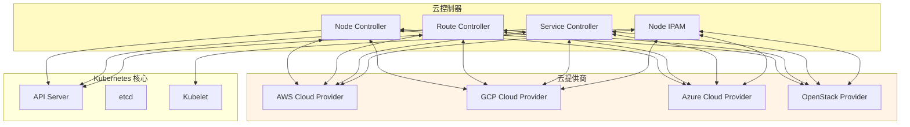
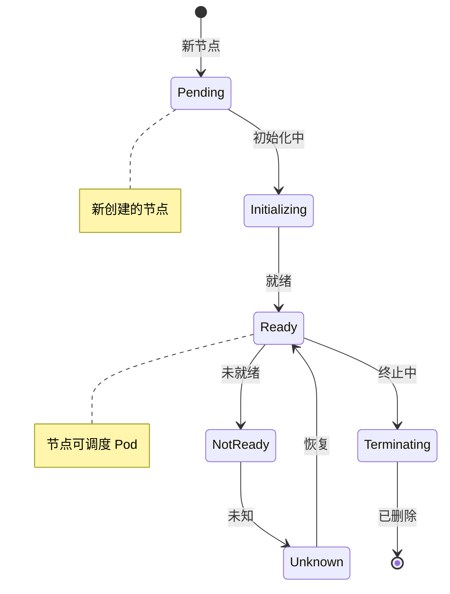
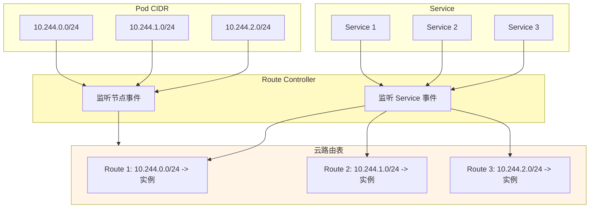
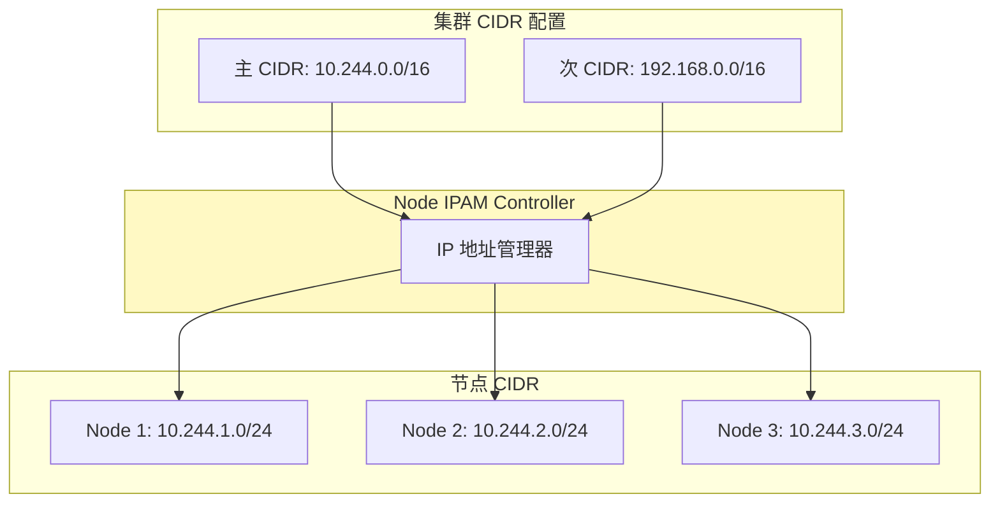

# Cloud Controller Manager（云控制器管理器）深度分析

> 更新日期：2026-03-08
> 分析版本：v1.36.0-alpha.0
> 源码路径：`cmd/cloud-controller-manager/`

---

## 📋 概述

**Cloud Controller Manager（CCM）** 是 Kubernetes 与云厂商集成的核心组件，负责管理云平台特有的资源，如节点、路由、负载均衡器等。

### 核心特性

- ✅ **云厂商集成** - 支持主流云平台（AWS, GCP, Azure, OpenStack 等）
- ✅ **Node Controller** - 节点状态同步和标签管理
- ✅ **Route Controller** - 云路由表管理
- ✅ **Service Controller** - LoadBalancer 创建和管理
- ✅ **Node IPAM** - Node IP 地址分配管理
- ✅ **插件化架构** - 支持云厂商自定义控制器
- ✅ **多云支持** - 支持多个云提供商

### 云厂商支持

| 云厂商 | 提供商标识 | 状态 |
|---------|-----------|------|
| AWS | aws | ✅ 完整支持 |
| GCP | gce | ✅ 完整支持 |
| Azure | azure | ✅ 完整支持 |
| OpenStack | openstack | ✅ 完整支持 |
| vSphere | vsphere | ✅ 完整支持 |
| DigitalOcean | digitalocean | ⏳ 社区支持 |
| External | external | ✅ 外部云厂商 |

---

## 🏗️ 架构设计

### 整体架构

Cloud Controller Manager 采用**主从架构**，主控制器负责启动和管理各个云特定的控制器：



### 代码结构

```
cmd/cloud-controller-manager/
├── main.go                          # 入口函数
├── nodeipamcontroller.go              # Node IPAM 控制器
├── providers.go                      # 云提供商注册

staging/src/k8s.io/cloud-provider/
├── cloud.go                         # 云提供商接口定义
├── app/                             # 配置管理
├── controllers/                      # 控制器实现
│   ├── cloud/                       # 云控制器
│   ├── node/                         # Node 控制器
│   ├── routes/                      # Route 控制器
│   ├── service/                     # Service 控制器
│   └── volume/                      # Volume 控制器
├── instance/                        # 实例管理接口
├── service/                          # LoadBalancer 接口
├── routes/                          # 路由接口
├── zones/                           # 可用区接口
├── clusters/                        # 多集群接口
├── names/                           # 控制器别名
├── options/                          # 命令行选项
└── sample/                          # 示例实现
```

### Cloud Provider 接口

```go
// Cloud Provider 接口定义
type Interface interface {
    // 初始化云提供商
    Initialize(clientBuilder ControllerClientBuilder, stop <-chan struct{}) error

    // LoadBalancer 管理
    LoadBalancer() (LoadBalancer, bool)
    Instances() (Instances, bool)
    InstancesV2() (InstancesV2, bool)
    Zones() (Zones, bool)
    Clusters() (Clusters, bool)
    Routes() (Routes, bool)

    // 云提供商名称
    ProviderName() string

    // 是否需要 ClusterID
    HasClusterID() bool
}

// Controller Client Builder
type ControllerClientBuilder interface {
    Config(name string) (*restclient.Config, error)
    ClientOrDie(name string) *restclient.Config
    Client(name string) (clientset.Interface, error)
    ClientOrDie(name string) clientset.Interface
}
```

---

## 🖥 Node Controller

### Node Controller 架构

Node Controller 负责维护节点状态，同步 Kubernetes 和云厂商之间的节点信息：

```mermaid
sequenceDiagram
    participant NodeController
    participant CloudProvider
    participant APIServer
    participant Kubelet

    NodeController->>CloudProvider: 获取实例信息
    CloudProvider-->>NodeController: 返回实例列表
    NodeController->>NodeController: 处理节点实例
    NodeController->>APIServer: 创建/更新 Node 对象
    APIServer-->>NodeController: Node 创建/更新成功
    NodeController->>CloudProvider: 设置节点标签
    CloudProvider->>Kubelet: 设置主机名
    NodeController->>Kubelet: 设置节点角色
    Kubelet->>Kubelet: 节点就绪

    style NodeController fill:#fff9c4
    style CloudProvider fill:#fff4e6
    style APIServer fill:#fff4e6
```

### Node 状态同步

**Node 状态机**：



**核心代码**：

```go
// Node Controller
type NodeController struct {
    cloud        cloudprovider.Interface
    kubeClient   clientset.Interface
    nodeLister   corev1listers.NodeLister
    nodeSynced  cache.InformerSynced

    // 节点实例缓存
    instanceMap sync.Map
}

// 同步节点状态
func (nc *NodeController) syncNode(key string) error {
    // 1. 从云厂商获取实例信息
    instance, err := nc.cloud.Instances().InstanceID(ctx, nodeName)
    if err != nil {
        return err
    }

    // 2. 获取 Kubernetes Node 对象
    node, err := nc.nodeLister.Get(nodeName)
    if err != nil {
        // 节点不存在，创建新节点
        newNode := &corev1.Node{
            ObjectMeta: metav1.ObjectMeta{
                Name: nodeName,
                Labels: map[string]string{
                    "kubernetes.io/hostname": instance.Hostname,
                },
            },
            Spec: corev1.NodeSpec{
                ProviderID:  nc.cloud.ProviderName() + "://" + instanceID,
                Addresses:  instance.Addresses,
                Taints: []corev1.Taint{
                    {
                        Key:    "node.cloudProvider.kubernetes.io/uninitialized",
                        Value:  "true",
                        Effect: "NoSchedule",
                    },
                },
            },
        }

        _, err = nc.kubeClient.CoreV1().Nodes().Create(context.TODO(), newNode, metav1.CreateOptions{})
        if err != nil {
            return err
        }

        // 设置主机名到云厂商
        return nc.setHostname(instance, node)
    }

    // 3. 更新现有节点
    return nc.updateNode(node, instance)
}

// 更新节点
func (nc *NodeController) updateNode(node *corev1.Node, instance cloudprovider.Instance) error {
    // 移除未初始化 Taint
    node.Spec.Taints = removeTaint(node.Spec.Taints, "node.CloudProvider.kubernetes.io/uninitialized")

    // 更新节点状态
    node.Status.Conditions = []corev1.NodeCondition{
        {
            Type:              "Ready",
            Status:            corev1.ConditionTrue,
            LastHeartbeatTime: metav1.Now(),
            Reason:             "KubeletReady",
            Message:           "Kubelet is posting ready status",
        },
    }

    // 更新节点地址
    node.Status.Addresses = instance.Addresses

    // 更新节点标签
    if node.Labels == nil {
        node.Labels = make(map[string]string)
    }
    node.Labels["kubernetes.io/hostname"] = instance.Hostname

    // 更新到 API Server
    _, err = nc.kubeClient.CoreV1().Nodes().Update(context.TODO(), node, metav1.UpdateOptions{})
    return err
}

// 设置主机名到云厂商
func (nc *NodeController) setHostname(instance cloudprovider.Instance, node *corev1.Node) error {
    // 某些云厂商支持设置主机名（如 AWS）
    instances, ok := nc.cloud.Instances()
    if !ok {
        return nil  // 不支持
    }

    return instances.SetHostname(context.TODO(), node.Name, instance.Hostname)
}
```

### 节点标签管理

**标准标签**：

```yaml
# Kubernetes 节点标签
metadata:
  labels:
    # 节点实例的云厂商
    node.CloudProvider.kubernetes.io/cloudprovider: aws
    # 节点实例类型
    node.kubernetes.io/instance-type: t3.large
    # 节点实例区域
    topology.kubernetes.io/zone: us-west-2a
    # 节点实例可用区
    topology.kubernetes.io/region: us-west-2
    # 节点主机名
    kubernetes.io/hostname: ip-10-0-1-123
```

---

## 🛣️ Route Controller

### Route Controller 架构

Route Controller 负责管理云厂商的路由表，将 Pod CIDR 和 Service CIDR 路由到云厂商的路由系统：



### 路由管理流程

```mermaid
sequenceDiagram
    participant RouteController
    participant CloudProvider
    participant APIServer
    participant Network

    RouteController->>APIServer: Watch Service 事件
    APIServer-->>RouteController: Service 创建/更新
    RouteController->>CloudProvider: 查询当前路由表
    CloudProvider-->>RouteController: 返回现有路由
    RouteController->>RouteController: 计算需要的路由
    RouteController->>CloudProvider: 创建/更新路由
    CloudProvider-->>RouteController: 路由更新成功
    RouteController->>RouteController: 更新路由缓存
    RouteController->>Network: 等待路由生效

    style RouteController fill:#fff9c4
    style CloudProvider fill:#fff4e6
```

**核心代码**：

```go
// Route Controller
type RouteController struct {
    cloud        cloudprovider.Interface
    kubeClient   clientset.Interface
    serviceLister corev1listers.ServiceLister
    nodeLister   corev1listers.NodeLister

    // 路由缓存
    routeCache sync.Map
}

// 同步路由
func (rc *RouteController) syncService(key string) error {
    // 1. 获取 Service
    service, err := rc.serviceLister.Services("").Get(key)
    if err != nil {
        return err
    }

    // 只处理类型为 LoadBalancer 的 Service
    if service.Spec.Type != corev1.ServiceTypeLoadBalancer {
        return nil
    }

    // 2. 获取所有节点
    nodes, err := rc.nodeLister.List(labels.Everything())
    if err != nil {
        return err
    }

    // 3. 查询云厂商当前路由表
    existingRoutes, err := rc.cloud.Routes()
    if err != nil {
        return err
    }

    // 4. 计算需要的路由
    desiredRoutes, err := rc.calculateRoutes(service, nodes)
    if err != nil {
        return err
    }

    // 5. 创建/更新路由
    for _, route := range desiredRoutes {
        if rc.routeExists(route, existingRoutes) {
            // 路由已存在，跳过
            continue
        }

        if err := rc.cloud.Routes().CreateRoute(context.TODO(), route); err != nil {
            klog.Errorf("Failed to create route %s: %v", route.Name, err)
            continue
        }
    }

    // 6. 删除不需要的路由
    for _, existingRoute := range existingRoutes {
        if !rc.routeNeeded(existingRoute, desiredRoutes) {
            if err := rc.cloud.Routes().DeleteRoute(context.TODO(), existingRoute); err != nil {
                klog.Errorf("Failed to delete route %s: %v", existingRoute.Name, err)
            }
        }
    }

    return nil
}

// 计算需要的路由
func (rc *RouteController) calculateRoutes(service *corev1.Service, nodes []*corev1.Node) ([]*cloudprovider.Route, error) {
    var routes []*cloudprovider.Route

    // 遍历所有节点
    for _, node := range nodes {
        // 跳过 NotReady 的节点
        if !isNodeReady(node) {
            continue
        }

        // 创建 Pod CIDR 路由
        routes = append(routes, &cloudprovider.Route{
            Name:            fmt.Sprintf("%s-%s", service.Name, node.Name),
            InstanceID:      node.Spec.ProviderID,
            DestinationCIDR: service.Spec.ClusterIP,  // Service CIDR
            TargetInstanceID: node.Spec.ProviderID,
        })
    }

    return routes, nil
}
```

---

## 🔗 Service Controller

### Service Controller 架构

Service Controller 负责管理云厂商的 LoadBalancer，为类型为 LoadBalancer 的 Service 创建和管理负载均衡器：

```mermaid
sequenceDiagram
    participant ServiceController
    participant CloudProvider
    participant LoadBalancer
    participant APIServer

    ServiceController->>APIServer: Watch Service 事件
    APIServer-->>ServiceController: Service 创建/更新
    ServiceController->>ServiceController: Service 类型为 LoadBalancer？
    ServiceController->>ServiceController: 需要 LoadBalancer？
    alt 是|否| APIServer
    alt 否|是| CloudProvider: GetLoadBalancer
    CloudProvider-->>ServiceController: 检查 LB 是否存在
    CloudProvider-->>ServiceController: 返回 LB 状态
    alt 不存在| CloudProvider: EnsureLoadBalancer
    CloudProvider-->>ServiceController: 创建 LB
    CloudProvider-->>ServiceController: 返回 LB 信息
    ServiceController->>APIServer: 更新 Service Status
    ServiceController->>ServiceController: 设置 Ingress/LoadBalancer IP

    style ServiceController fill:#fff9c4
    style CloudProvider fill:#fff4e6
    style LoadBalancer fill:#fff9c4
```

**核心代码**：

```go
// Service Controller
type ServiceController struct {
    cloud        cloudprovider.Interface
    kubeClient   clientset.Interface
    serviceLister corev1listers.ServiceLister
    nodeLister   corev1listers.NodeLister

    // 节点到 LB 的映射
    lbCache sync.Map
}

// 同步 Service
func (sc *ServiceController) syncService(key string) error {
    // 1. 获取 Service
    service, err := sc.serviceLister.Services("").Get(key)
    if err != nil {
        return err
    }

    // 2. 只处理类型为 LoadBalancer 的 Service
    if service.Spec.Type != corev1.ServiceTypeLoadBalancer {
        return nil
    }

    // 3. 检查 LoadBalancer 是否存在
    lb, exists, err := sc.cloud.LoadBalancer().GetLoadBalancer(context.TODO(), "", service)
    if err != nil {
        return err
    }

    // 4. LoadBalancer 不存在，创建
    if !exists {
        lb, err := sc.ensureLoadBalancer(service)
        if err != nil {
            return err
        }
        exists = true
    }

    // 5. 更新 Service Status
    if len(lb.Ingress) > 0 {
        service.Status.LoadBalancer.Ingress = lb.Ingress
    }

    if lbStatus != nil {
        service.Status.LoadBalancer = *lbStatus
    }

    // 6. 更新到 API Server
    _, err = sc.kubeClient.CoreV1().Services(service.Namespace).Update(context.TODO(), service, metav1.UpdateOptions{})
    return err
}

// 确保 LoadBalancer 存在
func (sc *ServiceController) ensureLoadBalancer(service *corev1.Service) (*cloudprovider.LoadBalancerStatus, error) {
    // 获取所有节点
    nodes, err := sc.nodeLister.List(labels.Everything())
    if err != nil {
        return nil, err
    }

    // 调用云厂商 EnsureLoadBalancer
    lbStatus, err := sc.cloud.LoadBalancer().EnsureLoadBalancer(
        context.TODO(),
        sc.cloud.ProviderName(),
        service,
        nodes,
    )
    if err != nil {
        return nil, err
    }

    return lbStatus, nil
}
```

### LoadBalancer 类型

```yaml
# AWS Elastic Load Balancer (ELB）
spec:
  loadBalancerSource: instances
  type: classic # 或 network
  scheme: internet-facing # 或 internal

# GCP Cloud Load Balancing
spec:
  loadBalancerSource: instance-groups
  type: regional # 或 global
  scheme: external
```

---

## 🌐 Node IPAM Controller

### Node IPAM Controller 架构

Node IPAM Controller 负责为节点分配和管理 IP 地址，支持多种 IP 分配策略：



### IP 分配策略

**CloudAllocator 类型**：

| 类型 | 说明 | 云厂商支持 |
|------|------|-----------|
| **CloudAllocator** | 云厂商分配 | AWS, GCP, Azure, OpenStack |
| **RangeAllocator** | 固定范围分配 | 本地开发，Vagrant |
| **IPAMFromCluster** | 从集群配置分配 | 本地开发 |

**核心代码**：

```go
// Node IPAM Controller
type NodeIpamController struct {
    cloud        cloudprovider.Interface
    kubeClient   clientset.Interface
    nodeLister   corev1listers.NodeLister

    // CIDR 配置
    clusterCIDRs      []*net.IPNet
    serviceCIDR       *net.IPNet
    secondaryServiceCIDR *net.IPNet

    // Node CIDR Mask 大小
    nodeCIDRMaskSizes []int
}

// 分配节点 CIDR
func (nc *NodeIpamController) allocateNodeCIDR(node *corev1.Node) (*net.IPNet, error) {
    // 1. 检查节点是否已有 CIDR
    if node.Spec.PodCIDRs != nil && len(node.Spec.PodCIDRs) > 0 {
        // 节点已有 CIDR，返回
        _, ipNet, err := net.ParseCIDR(node.Spec.PodCIDRs[0])
        if err != nil {
            return nil, err
        }
        return &ipNet, nil
    }

    // 2. 从集群 CIDR 池中分配
    allocatedCIDR, err := nc.findAvailableCIDR()
    if err != nil {
        return nil, err
    }

    // 3. 应用 Mask
    maskSize := nc.getMaskSizeForCIDR(allocatedCIDR)
    maskedCIDR := *allocatedCIDR
    if maskSize > 0 {
        maskedCIDR = &net.IPNet{
            IP:   allocatedCIDR.IP.Mask(net.CIDRMask(maskSize)),
            Mask: allocatedCIDR.Mask,
        }
    }

    // 4. 更新节点 CIDR
    node.Spec.PodCIDRs = []string{maskedCIDR.String()}

    // 5. 更新节点
    _, err = nc.kubeClient.CoreV1().Nodes().Update(context.TODO(), node, metav1.UpdateOptions{})
    if err != nil {
        return nil, err
    }

    return maskedCIDR, nil
}

// 查找可用的 CIDR
func (nc *NodeIpamController) findAvailableCIDR() (*net.IPNet, error) {
    // 遍历集群 CIDR 池
    for _, clusterCIDR := range nc.clusterCIDRs {
        // 检查 CIDR 是否已分配
        if !nc.isCIDRInUse(clusterCIDR) {
            return clusterCIDR, nil
        }
    }

    return nil, errors.New("no available CIDR found in cluster")
}

// 检查 CIDR 是否在使用
func (nc *NodeIpamController) isCIDRInUse(cidr *net.IPNet) bool {
    // 查询所有节点
    nodes, err := nc.nodeLister.List(labels.Everything())
    if err != nil {
        return false
    }

    // 检查是否有节点的 PodCIDR 匹配
    for _, node := range nodes {
        if node.Spec.PodCIDRs != nil {
            for _, nodeCIDR := range node.Spec.PodCIDRs {
                nodeIPNet, err := net.ParseCIDR(nodeCIDR)
                if err != nil {
                    continue
                }
                if cidr.Contains(nodeIPNet.IP) {
                    return true
                }
            }
        }
    }

    return false
}
```

---

## 🔌 云厂商接口

### AWS Cloud Provider

**AWS 支持的功能**：

| 功能 | 接口 | 说明 |
|------|------|------|
| **Instances** | `instances.InstanceID` | EC2 实例管理 |
| **LoadBalancer** | `loadbalancer.EnsureLoadBalancer` | ELB/ALB 创建 |
| **Routes** | `routes.CreateRoute` | VPC 路由表管理 |
| **Zones** | `zones.List` | 可用区列表 |

### GCP Cloud Provider

**GCP 支持的功能**：

| 功能 | 接口 | 说明 |
|------|------|------|
| **Instances** | `instances.InstanceID` | GCE 实例管理 |
| **LoadBalancer** | `loadbalancer.EnsureLoadBalancer` | GCLB 创建 |
| **Routes** | `routes.CreateRoute` | VPC 路由表管理 |
| **Firewall** | `firewall.CreateRule` | 防火墙规则管理 |

### Azure Cloud Provider

**Azure 支持的功能**：

| 功能 | 接口 | 说明 |
|------|------|------|
| **Instances** | `instances.InstanceID` | Azure VM 管理 |
| **LoadBalancer** | `loadbalancer.EnsureLoadBalancer` | Azure LB 创建 |
| **Routes** | `routes.CreateRoute` | VNET 路由表管理 |
| **SecurityGroups** | `securitygroups.CreateRule` | 安全组管理 |

---

## ⚡ 性能优化

### 1. 批处理

**优化**：批量操作减少 API 调用

```go
// 批量更新节点
func (nc *NodeController) batchUpdateNodes(nodes []*corev1.Node) error {
    var patchOps []client.PatchOperation

    for _, node := range nodes {
        patchBytes, err := json.Marshal(node)
        if err != nil {
            return err
        }

        patchOps = append(patchOps, client.PatchOperation{
            PatchBytes: patchBytes,
            PatchType:   types.StrategicMergePatchType,
            Object:     node,
        })
    }

    // 批量 Patch
    _, err = nc.kubeClient.CoreV1().Nodes().Patch(context.TODO(), "", "", patchOps...)
    return err
}
```

### 2. 缓存机制

**优化**：使用 Informer 缓存减少 API 调用

```go
// 使用 Lister 缓存
func (rc *RouteController) syncService(key string) error {
    // 从 Lister 缓存中获取 Service（不调用 API）
    service, err := rc.serviceLister.Services("").Get(key)
    if err != nil {
        return err
    }

    // 处理 Service
    return rc.processService(service)
}
```

### 3. 速率限制

**优化**：控制并发数和请求速率

```go
// Worker 并发数
const (
    nodeWorkers      = 10
    routeWorkers    = 5
    serviceWorkers  = 5
)

// 速率限制
func (nc *NodeController) processNextWorkItem() bool {
    // 限制每秒处理 10 个节点
    if nc.processedNodesPerSecond > 10 {
        return false
    }

    return true
}
```

---

## 🚨 故障排查

### 常见问题

#### 1. 节点无法注册

**问题**：ProviderID 不正确

```bash
# 检查节点 ProviderID
kubectl get node <node-name> -o jsonpath='{.spec.providerID}'

# 检查云厂商实例 ID
aws ec2 describe-instances --instance-ids <instance-id>

# 查看 CCM 日志
kubectl logs -n kube-system cloud-controller-manager-<node-name> | grep -i error
```

#### 2. LoadBalancer 创建失败

**问题**：配额不足或权限错误

```bash
# 检查 Service 事件
kubectl get events --all-namespaces --field-selector involvedObject.kind=Service

# 查看 Service Controller 日志
kubectl logs -n kube-system cloud-controller-manager-<node-name> | grep -i "loadbalancer"

# 检查云厂商配额
aws elb describe-load-balancers --load-balancer-name <lb-name>
```

#### 3. 路由无法创建

**问题**：VPC 配置或权限问题

```bash
# 检查路由表
aws ec2 describe-route-tables --route-table-id <rt-id>

# 查看 Route Controller 日志
kubectl logs -n kube-system cloud-controller-manager-<node-name> | grep -i route

# 检查 VPC 配置
aws ec2 describe-vpcs --vpc-id <vpc-id>
```

### 调试工具

#### 启用 Debug 日志

```bash
# 启用 CCM Debug 模式
kubectl edit deployment cloud-controller-manager -n kube-system
# 添加：--v=4
```

#### 查看 Cloud Provider 指标

```bash
# 访问 CCM 指标端点
curl http://<ccm>:10253/metrics

# 关键指标
cloud_provider_api_request_duration_seconds
cloud_provider_api_request_total
cloud_controller_manager_nodes_total
cloud_controller_manager_node_sync_duration_seconds
```

---

## 💡 最佳实践

### 1. 选择合适的云厂商

**推荐配置**：

```yaml
# Cloud Controller Manager 配置
apiVersion: v1
kind: Pod
metadata:
  name: cloud-controller-manager
  namespace: kube-system
spec:
  containers:
  - name: cloud-controller-manager
    args:
    - --cloud-provider=aws          # 云厂商
    - --cloud-config=/etc/kubernetes/cloud-config
    - --node-name=$(HOSTNAME)
    - --cluster-cidr=10.244.0.0/16  # 集群 CIDR
    - --node-cidr-mask-size-ipv4=24
    - --allocate-node-cidrs=true      # 启用 Node IPAM
    - --v=2                      # Debug 级别
```

### 2. 监控 CCM 指标

**推荐告警**：

```yaml
# Prometheus 告警规则
groups:
- name: cloud_controller_manager
  rules:
  - alert: NodeSyncLatencyHigh
    expr: histogram_quantile(0.99, cloud_controller_manager_node_sync_duration_seconds) > 30
    for: 5m
    labels:
      severity: warning
  - alert: RouteCreationFailed
    expr: rate(cloud_controller_manager_route_errors_total[5m]) > 0.1
    for: 5m
    labels:
      severity: warning
  - alert: LoadBalancerCreationFailed
    expr: rate(cloud_controller_manager_loadbalancer_errors_total[5m]) > 0.1
    for: 5m
    labels:
      severity: critical
```

### 3. 使用 Node 标签

**推荐标签**：

```yaml
# 节点标签
metadata:
  labels:
    # 节点实例的云厂商
    node.CloudProvider.kubernetes.io/cloudprovider: aws
    # 节点实例类型
    node.kubernetes.io/instance-type: t3.large
    # 节点实例区域
    topology.kubernetes.io/zone: us-west-2a
    # 节点实例可用区
    topology.kubernetes.io/region: us-west-2
```

### 4. 配置 Node IPAM

**推荐配置**：

```yaml
# kube-controller-manager 配置
apiVersion: v1
kind: Pod
metadata:
  name: cloud-controller-manager
  namespace: kube-system
spec:
  containers:
  - name: cloud-controller-manager
    args:
    - --cluster-cidr=10.244.0.0/16      # 主集群 CIDR
    - --allocate-node-cidrs=true          # 启用 Node IPAM
    - --node-cidr-mask-size-ipv4=24  # IPv4 Mask 大小
```

---

## 📚 参考资料

- [Kubernetes 文档 - Cloud Controller Manager](https://kubernetes.io/docs/tasks/administer-cluster/cloud-controller-manager/)
- [Cloud Provider 接口](https://github.com/kubernetes/cloud-provider/blob/master/cloud.go)
- [AWS Cloud Provider](https://github.com/kubernetes/cloud-provider-aws)
- [GCP Cloud Provider](https://github.com/kubernetes/cloud-provider-gcp)
- [Azure Cloud Provider](https://github.com/kubernetes/cloud-provider-azure)
- [Node CIDR 管理](https://kubernetes.io/docs/concepts/cluster-administration/network-plugins/#multi-cluster)

---

::: tip 总结
Cloud Controller Manager 是 Kubernetes 与云厂商集成的核心组件，负责管理节点、路由、LoadBalancer 等云平台资源。理解其工作机制对于在不同云平台上部署 Kubernetes 非常重要。

**关键要点**：
- 🖥 Node Controller 同步节点状态到云厂商
- 🛣️ Route Controller 管理 Pod CIDR 和 Service CIDR 路由
- 🔗 Service Controller 创建和管理 LoadBalancer
- 🌐 Node IPAM 管理节点 IP 地址分配
- 🔌 插件化架构支持多种云厂商
- ⚡ 批处理、缓存和速率限制优化性能
:::
