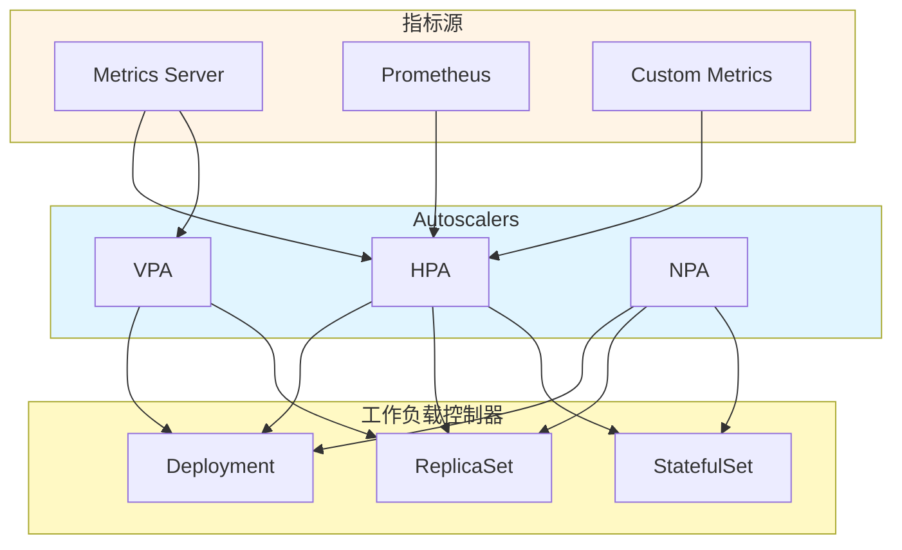

# Pod Autoscaler（Pod 自动扩缩容）深度分析

> 更新日期：2026-03-08
> 分析版本：v1.36.0-alpha.0
> 源码路径：`pkg/controller/podautoscaler/`

---

## 📋 概述

**Pod Autoscaler**是 Kubernetes 控制器管理器（kube-controller-manager）的核心组件之一，负责根据负载情况自动调整 Pod 的副本数量，确保应用满足性能需求。Pod Autoscaler 包括三个子组件：**HPA**（水平）、**VPA**（垂直）和 **NPA**（预测性）。

### 核心特性

- ✅ **HPA（水平 Pod 自动扩缩容）** - 根据 CPU/内存等指标自动调整 Pod 副本数
- ✅ **VPA（垂直 Pod 自动扩缩容）** - 根据 CPU/内存使用率自动调整 Pod 的资源限制和请求
- ✅ **NPA（预测性 Pod 自动扩缩容）** - 基于机器学习预测未来的负载，提前扩缩容
- ✅ **自定义指标支持** - 支持通过 Metrics Server 或 Prometheus 适配器获取自定义指标
- ✅ **滚动更新策略** - 支持滚动更新时的扩缩容策略
- ✅ **多维度指标** - 支持同时基于多个指标进行扩缩容决策
- ✅ **冷却时间** - 防止频繁的扩缩容震荡

### HPA vs VPA vs NPA

| 特性 | HPA | VPA | NPA |
|------|-----|-----|-----|
| **扩缩方式** | 水平调整副本数 | 垂直调整资源 | 预测性调整 |
| **调节数量** | Pod 副本数 | CPU/内存限制和请求 | Pod 副本数 |
| **指标类型** | CPU/内存/自定义 | CPU/内存使用率 | 历史负载模式 |
| **更新频率** | 秒级 | 分钟级 | 预测级 |
| **使用场景** | Web 应用、微服务 | 大数据、批处理 | AI/ML 推理 |
| **复杂度** | 低 | 中 | 高 |

---

## 🏗️ 架构设计

### 整体架构

Pod Autoscaler 采用**独立的控制器架构**，HPA、VPA、NPA 各自负责不同的扩缩容策略：



### 代码结构

```
pkg/controller/podautoscaler/
├── horizontal.go              # HPA 主控制器逻辑
├── horizontal_test.go         # HPA 单元测试
├── config.go                   # HPA 配置
├── replica_calculator.go       # 副本数计算器
├── metrics/                   # 指标客户端
├── monitor/                  # 监控模块
├── rate_limiters.go            # 速率限制器
└── doc.go                     # 包文档
```

### HorizontalController 结构

```go
// HorizontalController 是 HPA 的主控制器
type HorizontalController struct {
    scaleNamespacer scaleclient.ScalesGetter
    hpaNamespacer   autoscalingclient.HorizontalPodAutoscalerLister

    mapper          apimeta.RESTMapper
    tolerance       float64
    replicaCalc     *ReplicaCalculator
    eventRecorder   record.EventRecorder

    // Informers
    hpaLister       autoscalinglisters.HorizontalPodAutoscalerLister
    hpaListerSynced cache.InformerSynced

    podLister       corelisters.PodLister
    podListerSynced cache.InformerSynced

    // Queue
    queue workqueue.TypedRateLimitingInterface[string]

    // 推荐缓存
    recommendations     map[string][]timestampedRecommendation
    recommendationsLock sync.Mutex

    // 扩缩容事件
    scaleUpEvents       map[string][]timestampedScaleEvent
    scaleUpEventsLock   sync.RWMutex
    scaleDownEvents     map[string][]timestampedScaleEvent
    scaleDownEventsLock sync.RWMutex

    // Monitor
    monitor monitor.Monitor

    // HPA 选择器
    hpaSelectors *selectors.BiMultimap
    hpaSelectorsMux sync.Mutex

    // 稳定窗口
    downscaleStabilizationWindow time.Duration
}
```

---

## 🔄 HPA（水平 Pod 自动扩缩容）

### HPA 工作流程

```mermaid
sequenceDiagram
    participant HPA
    participant Metrics
    participant ScaleTarget
    participant Scheduler
    participant Pod

    HPA->>Metrics: 获取当前指标值
    Metrics-->>HPA: 返回 CPU/内存使用率
    HPA->>HPA: 计算期望副本数
    HPA->>ScaleTarget: 获取当前副本数
    HPA->>HPA: 计算扩缩容差值
    HPA->>HPA: 检查冷却时间
    HPA->>ScaleTarget: 更新副本数（扩容）
    ScaleTarget->>Scheduler: 创建新 Pod
    Scheduler->>Pod: 调度新 Pod
    Pod->>Pod: Pod 就绪
    HPA->>Metrics: 获取新指标值
    HPA->>HPA: 判断是否缩容
    HPA->>ScaleTarget: 更新副本数（缩容）
    ScaleTarget->>Pod: 删除多余 Pod

    style HPA fill:#e1f5ff
    style Metrics fill:#fff4e6
    style ScaleTarget fill:#fff9c4
    style Scheduler fill:#fff9c4
```

### 副本数计算

**核心算法**：

```
期望副本数 = ceil(当前指标值 / 目标指标值)
```

**代码实现**：

```go
// 副本数计算
func (r *HorizontalController) computeReplicasForMetrics(
    currentMetrics []float64,
    metricSpec autoscalingv2.MetricSpec,
    scaleTarget *autoscalingv2.CrossVersionObjectReference,
) (int32, *autoscalingv2.MetricStatus, error) {
    // 计算期望副本数
    desiredReplicas := int32(math.Ceil(
        currentMetrics[0] / metricSpec.Target.AverageValue,
    ))

    // 检查最小和最大副本数
    if desiredReplicas < *metricSpec.Min {
        desiredReplicas = *metricSpec.Min
    }
    if desiredReplicas > *metricSpec.Max {
        desiredReplicas = *metricSpec.Max
    }

    // 记录指标状态
    metricStatus := &autoscalingv2.MetricStatus{
        Current:    autoscalingv2.MetricValueStatus{
            AverageValue: &autoscalingv2.MetricValue{
                Type:  metricSpec.Target.Type,
                Value: resource.NewMilliQuantity(
                    currentMetrics[0],
                    resource.MilliUnit,
                ),
            },
        },
        Desired:    autoscalingv2.MetricValueStatus{
            AverageValue: &autoscalingv2.MetricValue{
                Type:  metricSpec.Target.Type,
                Value: resource.NewMilliQuantity(
                    float64(desiredReplicas),
                    resource.MilliUnit,
                ),
            },
        },
    }

    return desiredReplicas, metricStatus, nil
}
```

### 多维度指标聚合

**算法**：对于每个指标计算期望副本数，然后取最大值作为最终期望副本数

```go
// 多维度指标聚合
func (r *HorizontalController) computeReplicasForMultipleMetrics(
    metricSpecs []autoscalingv2.MetricSpec,
    scaleTarget *autoscalingv2.CrossVersionObjectReference,
    metrics []float64,
) (int32, []autoscalingv2.MetricStatus, error) {
    var maxReplicas int32 = 1

    // 遍历所有指标
    for i, metricSpec := range metricSpecs {
        desiredReplicas, metricStatus, err := r.computeReplicasForMetrics(
            []float64{metrics[i]},
            metricSpec,
            scaleTarget,
        )
        if err != nil {
            return 0, nil, err
        }

        // 更新最大副本数
        if desiredReplicas > maxReplicas {
            maxReplicas = desiredReplicas
        }

        // 记录指标状态
        metricStatuses = append(metricStatuses, *metricStatus)
    }

    return maxReplicas, metricStatuses, nil
}
```

---

## 🎛️ VPA（垂直 Pod 自动扩缩容）

### VPA 工作流程

```mermaid
sequenceDiagram
    participant VPA
    participant Metrics
    participant Pod
    participant Kubelet

    VPA->>Metrics: 获取当前 CPU/内存使用率
    Metrics-->>VPA: 返回资源使用率
    VPA->>VPA: 计算新的资源限制和请求
    VPA->>Pod: 更新 Pod 资源配置
    Pod->>Kubelet: 应用新资源配置
    Kubelet->>Pod: 重启容器
    Pod->>Pod: 容器使用新资源配置
    VPA->>Metrics: 获取新指标值
    VPA->>VPA: 判断是否需要进一步调整

    style VPA fill:#e1f5ff
    style Metrics fill:#fff4e6
    style Pod fill:#fff9c4
    style Kubelet fill:#fff9c4
```

### 推荐策略

**策略类型**：

| 策略 | 说明 | 行为 |
|------|------|------|
| **Off** | 关闭 | 不调整资源配置 |
| **InitialOnly** | 仅初始 | 只在 Pod 创建时调整一次 |
| **Recreate** | 重建 | 通过删除和重建 Pod 调整资源 |
| **Auto** | 自动 | 自动调整资源配置 |

**代码实现**：

```go
// VPA 推荐器
func (v *VerticalPodAutoscaler) Recommend(
    ctx context.Context,
    pod *v1.Pod,
    selector v1.LabelSelector,
    policy v1ev1.UpdatePolicy,
    resource v1.ResourceName,
    targetUtilization float64,
    lowerBound, upperBound float64,
    recommendations []v1ev1.RecommendedPodResources,
    useRecommendation bool,
    containers []v1.Container,
    initMode v1ev1.InitialMode,
) (v1ev1.RecommendedPodResources, v1ev1.ResourceRecommendation, error) {
    // 1. 获取当前指标值
    usage, err := v.metrics.GetPodMetrics(pod, selector)
    if err != nil {
        return v1ev1.RecommendedPodResources{}, nil, err
    }

    // 2. 计算推荐资源
    recommendation := v.calculateRecommendation(
        usage,
        targetUtilization,
        lowerBound,
        upperBound,
    )

    // 3. 应用推荐
    switch policy.Mode {
    case v1ev1.UpdateModeOff:
        // 不更新
    case v1ev1.UpdateModeInitial:
        // 只在 Pod 创建时更新
        if useRecommendation {
            return recommendation.RecommendedPodResources, nil, nil
        }
    case v1ev1.UpdateModeRecreate:
        // 通过重建 Pod 更新
        return recommendation.RecommendedPodResources, nil, nil
    case v1ev1.UpdateModeAuto:
        // 自动更新
        return recommendation.RecommendedPodResources, nil, nil
    }

    return v1ev1.RecommendedPodResources{}, v1ev1.ResourceRecommendation{}, nil
}
```

---

## 🔮 NPA（预测性 Pod 自动扩缩容）

### NPA 工作流程

```mermaid
sequenceDiagram
    participant NPA
    participant History
    participant Metrics
    participant ScaleTarget

    History->>NPA: 获取历史负载数据
    NPA->>NPA: 分析负载模式
    NPA->>NPA: 预测未来负载
    NPA->>NPA: 计算扩缩容时间点
    NPA->>NPA: 调度扩缩容任务
    NPA->>ScaleTarget: 提前更新副本数
    NPA->>Metrics: 监控实际负载
    Metrics-->>NPA: 返回实际指标值
    NPA->>History: 更新历史数据
    History->>NPA: 重新训练预测模型

    style NPA fill:#e1f5ff
    style History fill:#fff4e6
    style ScaleTarget fill:#fff9c4
```

### 预测算法

**时间序列预测**：

```
预测副本数 = f(历史负载数据)
```

**代码实现**：

```go
// NPA 预测器
func (n *NPAController) predictScale(
    history []TimestampedMetric,
    horizon time.Duration,
    predictionHorizon time.Duration,
) (int32, error) {
    // 1. 数据预处理
    preprocessed := n.preprocessHistory(history)

    // 2. 特征工程
    features := n.extractFeatures(preprocessed)

    // 3. 模型训练
    model := n.trainModel(features)

    // 4. 预测
    prediction := model.Predict(horizon)

    // 5. 后处理
    desiredReplicas := int32(math.Ceil(prediction))

    return desiredReplicas, nil
}

// 特征提取
func (n *NPAController) extractFeatures(history []TimestampedMetric) []float64 {
    // 提取时间序列特征
    var features []float64

    for i := range len(history) {
        // 添加历史值
        features = append(features, history[i].Value)

        // 添加时间特征
        features = append(features, float64(i))
    }

    return features
}
```

---

## 📊 监控和指标

### HPA 指标

| 指标 | 类型 | 说明 |
|------|------|------|
| `horizontal_pod_autoscaler_spec_metrics_total` | Gauge | HPA 配置的指标类型总数 |
| `horizontal_pod_autoscaler_status_total` | Gauge | HPA 状态总数 |
| `horizontal_pod_autoscaler_status_conditions` | Gauge | HPA 状态条件数 |
| `horizontal_pod_autoscaler_scale_events_total` | Counter | 扩缩容事件总数 |
| `horizontal_pod_autoscaler_metrics_per_spec` | Gauge | 每个指标的副本数 |

### VPA 指标

| 指标 | 类型 | 说明 |
|------|------|------|
| `vertical_pod_autoscaler_recommendation_total` | Counter | 推荐总数 |
| `vertical_pod_autoscaler_recommendation_skipped_total` | Counter | 跳过推荐的推荐总数 |
| `vertical_pod_autoscaler_reconciliation_total` | Counter | 调和总数 |
| `vertical_pod_autoscaler_reconciliation_seconds` | Histogram | 调和操作延迟 |

### NPA 指标

| 指标 | 类型 | 说明 |
|------|------|------|
| `normal_pod_autoscaler_prediction_error_total` | Counter | 预测错误总数 |
| `normal_pod_autoscaler_prediction_seconds` | Histogram | 预测延迟 |
| `normal_pod_autoscaler_scale_events_total` | Counter | 扩缩容事件总数 |

---

## ⚡ 性能优化

### 1. 指标缓存

**优化**：缓存指标值，减少重复查询

```go
// 指标缓存
type metricsCache struct {
    cache sync.Map
    ttl   time.Duration
}

// 获取指标
func (m *metricsCache) GetMetric(
    ctx context.Context,
    metricSelector autoscalingv2.MetricSelector,
) (float64, error) {
    key := m.buildCacheKey(metricSelector)

    // 检查缓存
    if value, ok := m.cache.Load(key); ok {
        return value.(float64), nil
    }

    // 从指标源获取
    value, err := m.metrics.GetMetric(ctx, metricSelector)
    if err != nil {
        return 0, err
    }

    // 缓存指标值
    m.cache.Store(key, value)

    // 设置 TTL
    time.AfterFunc(m.ttl, func() {
        m.cache.Delete(key)
    })

    return value, nil
}
```

### 2. 批量操作

**优化**：批量更新多个 HPA 对象

```go
// 批量更新 HPA 状态
func (h *HorizontalController) batchUpdateHPAStatus(...) {
    var patchOps []client.PatchOperation

    for _, hpa := range hpas {
        patchBytes, err := json.Marshal(&hpa.Status)
        if err != nil {
            continue
        }

        patchOps = append(patchOps, client.PatchOperation{
            PatchBytes: patchBytes,
            PatchType:   types.StrategicMergePatchType,
            Object:     hpa,
        })
    }

    // 批量 Patch
    _, err = h.hpaLister.HorizontalPodAutoscalers(hpa.Namespace).Patch(
        context.TODO(),
        "",
        patchOps...,
    )
}
```

### 3. 冷却时间管理

**优化**：避免频繁的扩缩容震荡

```go
// 检查冷却时间
func (h *HorizontalController) isScaleAllowed(
    hpa *autoscalingv2.HorizontalPodAutoscaler,
    direction string,
) bool {
    now := time.Now()

    if direction == "up" {
        // 检查扩容冷却时间
        if hpa.Status.Conditions != nil {
            for _, condition := range hpa.Status.Conditions {
                if condition.Type == "AbleToScale" {
                    if condition.Status == "True" {
                        // 检查冷却时间
                        if condition.LastTransitionTime.Add(
                            *hpa.Spec.Behavior.ScaleUp.StabilizationWindowSeconds * time.Second,
                        ).After(now) {
                            return false
                        }
                    }
                }
            }
        }
    } else {
        // 检查缩容冷却时间
        if hpa.Status.Conditions != nil {
            for _, condition := range hpa.Status.Conditions {
                if condition.Type == "AbleToScale" {
                    if condition.Status == "True" {
                        // 检查冷却时间
                        if condition.LastTransitionTime.Add(
                            *hpa.Spec.Behavior.ScaleDown.StabilizationWindowSeconds * time.Second,
                        ).After(now) {
                            return false
                        }
                    }
                }
            }
        }
    }

    return true
}
```

---

## 🚨 故障排查

### 常见问题

#### 1. HPA 无法工作

**问题**：指标不可用或配置错误

```bash
# 检查 HPA 状态
kubectl get hpa <hpa-name> -o yaml

# 查看 HPA 事件
kubectl describe hpa <hpa-name>

# 查看指标
kubectl get --raw /apis/metrics.k8s.io/v1beta1/namespaces/<namespace>/pods/<pod-name>
```

#### 2. VPA 无法更新资源配置

**问题**：VPA Recommender 未启用或配置错误

```bash
# 检查 VPA 推荐器
kubectl get vpa <vpa-name> -o yaml

# 查看推荐事件
kubectl describe vpa <vpa-name>

# 查看资源配置
kubectl describe pod <pod-name> | grep -A resources
```

#### 3. NPA 预测不准确

**问题**：历史数据不足或预测模型错误

```bash
# 检查 NPA 配置
kubectl get npa <npa-name> -o yaml

# 查看预测日志
kubectl logs -n kube-system npa-controller-<node-name>

# 查看历史指标
kubectl get --raw /apis/metrics.k8s.io/v1beta1/namespaces/<namespace>/pods/<pod-name>
```

---

## 💡 最佳实践

### 1. 合理设置目标指标

**推荐配置**：

```yaml
apiVersion: autoscaling/v2
kind: HorizontalPodAutoscaler
metadata:
  name: my-hpa
spec:
  scaleTargetRef:
    apiVersion: apps/v1
    kind: Deployment
    name: my-deployment
  minReplicas: 2
  maxReplicas: 10
  metrics:
  - type: Resource
    resource:
      name: cpu
      target:
        type: Utilization
        averageUtilization: 70
  behavior:
    scaleUp:
      stabilizationWindowSeconds: 60
      policies:
      - type: Percent
        value: 50
        periodSeconds: 60
    scaleDown:
      stabilizationWindowSeconds: 300
      policies:
      - type: Percent
        value: 10
        periodSeconds: 60
```

### 2. 配置冷却时间

**推荐配置**：

```yaml
behavior:
  scaleUp:
    stabilizationWindowSeconds: 60   # 扩容稳定窗口 60 秒
    selectPolicy: Max           # 选择最大值的策略
  scaleDown:
    stabilizationWindowSeconds: 300  # 缩容稳定窗口 300 秒
    selectPolicy: Min           # 选择最小值的策略
```

### 3. 使用多维度指标

**推荐配置**：

```yaml
metrics:
- type: Resource
  resource:
    name: cpu
    target:
      type: Utilization
      averageUtilization: 70
- type: Resource
  resource:
    name: memory
    target:
      type: Utilization
      averageUtilization: 80
```

### 4. 监控 Autoscaler 行为

**推荐指标**：

```yaml
# Prometheus 告警规则
groups:
- name: pod_autoscaler
  rules:
  - alert: HPAUnableToScale
    expr: rate(horizontal_pod_autoscaler_scale_events_total[5m]) == 0
      for: 15m
    labels:
      severity: warning
  - alert: HPAFrequentScale
    expr: rate(horizontal_pod_autoscaler_scale_events_total[5m]) > 10
      for: 5m
    labels:
      severity: warning
  - alert: VPAScaleFailed
    expr: rate(vertical_pod_autoscaler_reconciliation_total[5m]) > 10
      for: 5m
    labels:
      severity: warning
```

---

## 📚 参考资料

- [Kubernetes 文档 - HPA](https://kubernetes.io/docs/tasks/run-application/hpa/)
- [Kubernetes 文档 - VPA](https://kubernetes.io/docs/tasks/run-application/vpa/)
- [Kubernetes 文档 - NPA](https://kubernetes.io/docs/tasks/run-application/npa/)
- [Metrics Server](https://github.com/kubernetes-sigs/metrics-server)
- [Custom Metrics API](https://kubernetes.io/docs/concepts/cluster-administration/system-metrics/)

---

::: tip 总结
Pod Autoscaler 是 Kubernetes 自动扩缩容的核心组件，包括 HPA、VPA、NPA 三个子组件。理解其工作机制对于实现应用弹性伸缩和性能优化非常重要。

**关键要点**：
- 🔄 HPA（水平扩缩容）根据指标自动调整 Pod 副本数
- 🎛️ VPA（垂直扩缩容）根据资源使用率自动调整资源配置
- 🔮 NPA（预测性扩缩容）基于机器学习预测未来负载，提前扩缩容
- 📊 多维度指标支持同时基于多个指标进行决策
- 🚀 冷却时间机制防止频繁的扩缩容震荡
- 📈 完善的监控和指标系统跟踪扩缩容行为
:::
