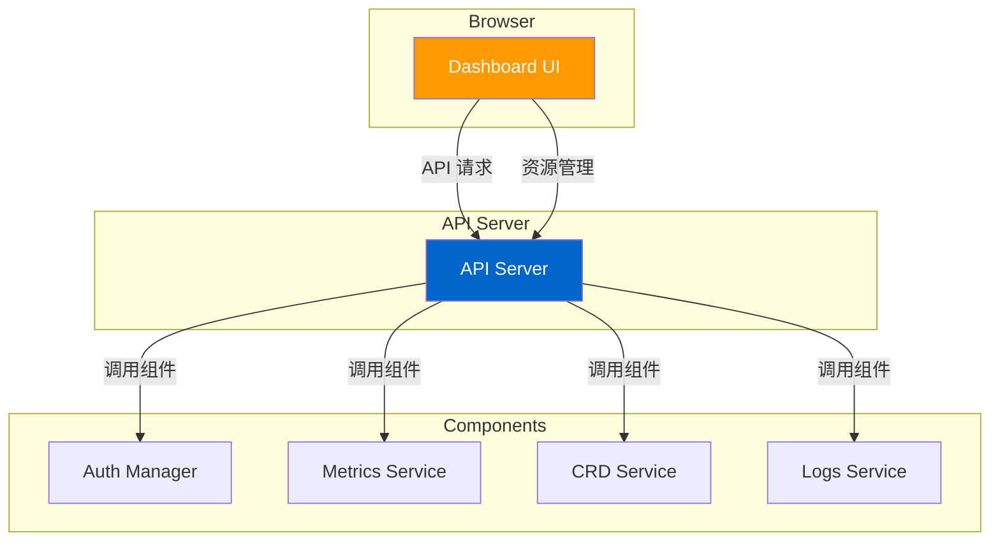

# Kubernetes Dashboard 深度分析

> 本文档深入分析 Kubernetes Dashboard，包括架构、权限管理、UI 组件、部署配置和最佳实践。

---

## Dashboard 概述

### 作用

Kubernetes Dashboard 是 Kubernetes 的官方 Web UI：



### 核心功能

| 功能 | 说明 |
|------|------|
| **资源管理**：创建、更新、删除 Kubernetes 资源 |
| **监控查看**：查看 Pod、节点等资源的指标 |
| **日志查看**：查看 Pod 容器日志 |
| **终端访问**：通过 Web 终端访问容器 |
| **权限管理**：基于 RBAC 的权限控制 |

---

## Dashboard 架构

### 整体架构

```go
// Kubernetes Dashboard 项目结构
.
├── src
│   ├── app
│   │   ├── backend
│   │   │   ├── handler  // API 处理器
│   │   │   ├── client   // Kubernetes 客户端
│   │   │   └── config   // 配置管理
│   │   └── frontend
│   │       ├── views     // 页面视图
│   │       ├── components  // UI 组件
│   │       └── services   // 前端服务
│   └── assets
├── i18n
├── pkg
└── go
```

### 核心组件

#### 1. Auth Manager

**位置**：`src/app/backend/handler/auth_handler.go`

```go
// AuthManager 认证管理器
type AuthManager struct {
    // TokenManager Token 管理器
    TokenManager TokenManager

    // SessionManager Session 管理器
    SessionManager SessionManager
}

// Login 登录
func (a *AuthManager) Login(username, password string) (*LoginResponse, error) {
    // 1. 验证用户名密码
    if err := a.authenticate(username, password); err != nil {
        return nil, err
    }

    // 2. 生成 Token
    token, err := a.TokenManager.GenerateToken(username)
    if err != nil {
        return nil, err
    }

    // 3. 返回登录响应
    return &LoginResponse{
        Token: token,
        JWE:   a.getJWEToken(username),
    }, nil
}
```

#### 2. Metrics Service

**位置**：`src/app/backend/handler/metrics_handler.go`

```go
// MetricsService 指标服务
type MetricsService struct {
    // MetricsClient Metrics 客户端
    MetricsClient MetricsClient

    // Cache 指标缓存
    Cache *MetricsCache
}

// GetMetrics 获取指标
func (m *MetricsService) GetMetrics(namespace string) (*MetricsData, error) {
    // 1. 从缓存获取
    if cached, ok := m.Cache.Get(namespace); ok {
        return cached, nil
    }

    // 2. 从 Metrics Server 获取
    metrics, err := m.MetricsClient.GetPodMetrics(namespace)
    if err != nil {
        return nil, err
    }

    // 3. 更新缓存
    m.Cache.Set(namespace, metrics, 30*time.Second)

    return metrics, nil
}
```

---

## 权限管理

### RBAC 集成

```yaml
apiVersion: rbac.authorization.k8s.io/v1
kind: ClusterRoleBinding
metadata:
  name: kubernetes-dashboard
roleRef:
  apiGroup: rbac.authorization.k8s.io
  kind: ClusterRole
  name: cluster-admin
subjects:
- kind: ServiceAccount
  name: kubernetes-dashboard
  namespace: kubernetes-dashboard
```

### 权限管理

```go
// PermissionManager 权限管理器
type PermissionManager struct {
    // KubeClient Kubernetes 客户端
    KubeClient kubernetes.Interface
}

// GetPermissions 获取权限
func (p *PermissionManager) GetPermissions(username string) (*Permissions, error) {
    // 1. 获取用户 Roles
    roles, err := p.getRolesForUser(username)
    if err != nil {
        return nil, err
    }

    // 2. 获取 RoleBindings
    roleBindings, err := p.getRoleBindingsForUser(username)
    if err != nil {
        return nil, err
    }

    // 3. 返回权限
    return &Permissions{
        Roles:         roles,
        RoleBindings:  roleBindings,
        ClusterRoles:  p.getClusterRolesForUser(username),
    }, nil
}
```

---

## 部署配置

### Deployment 配置

```yaml
apiVersion: apps/v1
kind: Deployment
metadata:
  name: kubernetes-dashboard
  namespace: kubernetes-dashboard
spec:
  replicas: 1
  selector:
    matchLabels:
      k8s-app: kubernetes-dashboard
  template:
    metadata:
      labels:
        k8s-app: kubernetes-dashboard
    spec:
      containers:
      - name: kubernetes-dashboard
        image: kubernetesui/dashboard:v2.7.0
        args:
        - --namespace=kubernetes-dashboard
        ports:
        - containerPort: 8443
          protocol: TCP
        volumeMounts:
        - name: kubernetes-dashboard-certs
          mountPath: /certs
      volumes:
      - name: kubernetes-dashboard-certs
        secret:
          secretName: kubernetes-dashboard-certs
```

### Service 配置

```yaml
apiVersion: v1
kind: Service
metadata:
  name: kubernetes-dashboard
  namespace: kubernetes-dashboard
spec:
  ports:
  - port: 443
    targetPort: 8443
  selector:
    k8s-app: kubernetes-dashboard
```

### Ingress 配置

```yaml
apiVersion: networking.k8s.io/v1
kind: Ingress
metadata:
  name: kubernetes-dashboard
  namespace: kubernetes-dashboard
spec:
  rules:
  - host: dashboard.example.com
    http:
      paths:
      - path: /
        pathType: Prefix
        backend:
          service:
            name: kubernetes-dashboard
            port:
              number: 443
```

---

## 安全最佳实践

### 1. 使用 HTTPS

```yaml
args:
  - --auto-generate-certificates
  - --namespace=kubernetes-dashboard
```

### 2. 限制访问

```yaml
apiVersion: v1
kind: Service
metadata:
  name: kubernetes-dashboard
  namespace: kubernetes-dashboard
spec:
  type: NodePort  # 或 LoadBalancer
  externalIPs:
  - 192.168.1.100  # 仅允许特定 IP
```

### 3. 使用 RBAC

```yaml
apiVersion: rbac.authorization.k8s.io/v1
kind: Role
metadata:
  name: kubernetes-dashboard-minimal
  namespace: kubernetes-dashboard
rules:
- apiGroups: [""]
  resources: ["configmaps"]
  verbs: ["get", "list"]
```

---

## 故障排查

### 问题 1：Dashboard 无法访问

**症状**：浏览器无法访问 Dashboard

**排查步骤**：

```bash
# 1. 检查 Pod 状态
kubectl get pods -n kubernetes-dashboard

# 2. 查看 Pod 日志
kubectl logs -n kubernetes-dashboard deployment/kubernetes-dashboard

# 3. 检查 Service
kubectl get svc -n kubernetes-dashboard
```

### 问题 2：登录失败

**症状**：用户无法登录

**排查步骤**：

```bash
# 1. 检查 ServiceAccount
kubectl get sa -n kubernetes-dashboard

# 2. 检查 RoleBinding
kubectl get rolebinding -n kubernetes-dashboard

# 3. 检查 Token
kubectl get secret -n kubernetes-dashboard
```

---

## 总结

### 关键要点

1. **Web UI**：提供可视化的 Kubernetes 管理界面
2. **权限管理**：基于 RBAC 的权限控制
3. **多组件**：包含多个服务和处理器
4. **易于使用**：图形化界面，降低学习门槛
5. **功能丰富**：支持资源管理、监控、日志、终端等

### 源码位置

| 组件 | 位置 |
|------|------|
| Dashboard | `github.com/kubernetes/dashboard/` |
| Auth Manager | `src/app/backend/handler/auth_handler.go` |
| Metrics Service | `src/app/backend/handler/metrics_handler.go` |

### 相关资源

- [Kubernetes Dashboard 文档](https://kubernetes.io/docs/tasks/access-application-cluster/web-ui-dashboard/)
- [Kubernetes Dashboard GitHub](https://github.com/kubernetes/dashboard)
- [Kubernetes RBAC 文档](https://kubernetes.io/docs/reference/access-authn-authz/rbac/)

---

::: tip 最佳实践
1. 使用 HTTPS 访问
2. 限制 Dashboard 访问权限
3. 定期更新 Dashboard 版本
4. 监控 Dashboard 性能
5. 使用 RBAC 管理权限
:::

::: warning 注意事项
- 默认权限过大（cluster-admin）
- 生产环境应限制访问
- Dashboard 不是企业级解决方案
:::
