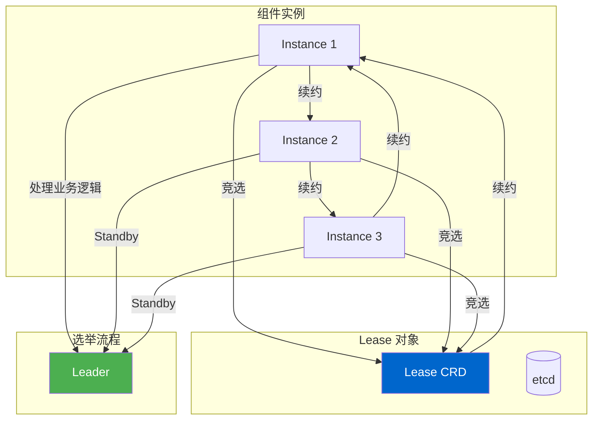

# Kubernetes 选举机制深度解析

## 概述

Kubernetes 组件使用 Leader Election 确保高可用性，同一时间只有一个实例作为 Leader 处理业务逻辑，其他实例为 Standby。当 Leader 故障时，自动选举新的 Leader。本文档深入分析选举机制的原理、实现和使用场景。

---

## 一、选举机制概述

### 1.1 为什么需要选举

Kubernetes 组件通常部署多个实例以实现高可用性（HA）：
- kube-apiserver：3+ 个实例
- kube-controller-manager：2+ 个实例
- kube-scheduler：2+ 个实例

**问题：** 如果多个实例同时处理同一个资源，会产生冲突

**解决：** Leader Election 确保同一时间只有一个 Leader

### 1.2 选举机制架构



### 1.3 Lease 资源

Kubernetes 使用 Coordination API 的 Lease 资源进行选举：

```yaml
apiVersion: coordination.k8s.io/v1
kind: Lease
metadata:
  name: kube-scheduler
  namespace: kube-system
spec:
  holderIdentity: "kube-scheduler-1"
  leaseDurationSeconds: 15
  acquireTime: "2026-03-03T00:00:00Z"
  renewTime: "2026-03-03T00:00:05Z"
  leaseTransitions: 3
```

**字段说明：**

| 字段 | 类型 | 说明 |
|------|------|------|
| `holderIdentity` | string | 当前 Lease 的持有者标识 |
| `leaseDurationSeconds` | int32 | Lease 有效期（秒） |
| `acquireTime` | timestamp | 获取 Lease 的时间 |
| `renewTime` | timestamp | 最后续约时间 |
| `leaseTransitions` | int32 | 转移次数 |

---

## 二、选举算法

### 2.1 选举流程

```mermaid
sequenceDiagram
    participant I1 as Instance 1
    participant I2 as Instance 2
    participant I3 as Instance 3
    participant Lease as Lease
    participant ETCD as etcd

    Note over I1, I2, I3: 启动选举
    I1->>Lease: 尝试获取 Lease
    I2->>Lease: 尝试获取 Lease
    I3->>Lease: 尝试获取 Lease

    Lease->>ETCD: 检查 Lease 是否存在
    ETCD-->>Lease: Lease 不存在

    alt Lease 不存在
        I1->>ETCD: 创建 Lease
        ETCD-->>I1: 创建成功
        I1->>I1: 成为 Leader
        Note over I1, I2, I3: I1 开始处理业务逻辑
        I2->>I2: 处于 Standby
        I3->>I3: 处于 Standby
    else Lease 存在
        Note over I1, I2, I3: 检查 Lease 的持有者和过期时间
        Lease->>I1: 返回 Lease 已被占用
        Lease->>I2: 返回 Lease 已被占用
        Lease->>I3: 返回 Lease 已被占用
    end
```

### 2.2 选举关键操作

#### 1. 获取 Lease（Acquire）

```go
func (l *LeaderElector) acquire(ctx context.Context) error {
    // 1. 构建 Lease 对象
    lease := &coordinationv1.Lease{
        ObjectMeta: metav1.ObjectMeta{
            Name:      l.lockIdentity,
            Namespace: l.leaseNamespace,
        },
        Spec: coordinationv1.LeaseSpec{
            HolderIdentity:       l.identity,
            LeaseDurationSeconds: l.leaseDuration,
            AcquireTime:        metav1.Now(),
            RenewTime:          metav1.Now(),
        },
    }

    // 2. 尝试创建 Lease
    // 如果 Lease 不存在，创建成功
    // 如果 Lease 存在且过期，更新成功
    // 如果 Lease 存在且未过期，创建失败
    result, err := l.client.CoordinationV1().Leases(l.leaseNamespace).Create(ctx, lease, metav1.CreateOptions{})
    if errors.IsAlreadyExists(err) {
        // Lease 已存在，尝试更新
        currentLease, err := l.client.CoordinationV1().Leases(l.leaseNamespace).Get(ctx, l.lockIdentity, metav1.GetOptions{})
        if err != nil {
            return err
        }

        // 检查 Lease 是否过期
        if isExpired(currentLease.Spec.RenewTime) {
            // Lease 已过期，可以获取
            lease.ResourceVersion = currentLease.ResourceVersion
            _, err := l.client.CoordinationV1().Leases(l.leaseNamespace).Update(ctx, lease, metav1.UpdateOptions{})
            return err
        } else {
            // Lease 未过期，获取失败
            return fmt.Errorf("lease is held by %s", currentLease.Spec.HolderIdentity)
        }
    } else if err != nil {
        return err
    }

    return nil
}
```

#### 2.3 续约 Lease（Renew）

```go
func (l *LeaderElector) renew(ctx context.Context) error {
    // 1. 获取当前 Lease
    currentLease, err := l.client.CoordinationV1().Leases(l.leaseNamespace).Get(ctx, l.lockIdentity, metav1.GetOptions{})
    if err != nil {
        return err
    }

    // 2. 检查是否持有者
    if currentLease.Spec.HolderIdentity != l.identity {
        return fmt.Errorf("lease is held by %s", currentLease.Spec.HolderIdentity)
    }

    // 3. 更新 RenewTime
    currentLease.Spec.RenewTime = metav1.Now()
    _, err = l.client.CoordinationV1().Leases(l.leaseNamespace).Update(ctx, currentLease, metav1.UpdateOptions{})
    return err
}
```

#### 4. 释放 Lease（Release）

```go
func (l *LeaderElector) release(ctx context.Context) error {
    // 1. 获取当前 Lease
    currentLease, err := l.client.CoordinationV1().Leases(l.leaseNamespace).Get(ctx, l.lockIdentity, metav1.GetOptions{})
    if err != nil {
        return err
    }

    // 2. 检查是否持有者
    if currentLease.Spec.HolderIdentity != l.identity {
        return nil
    }

    // 3. 删除 Lease
    err = l.client.CoordinationV1().Leases(l.leaseNamespace).Delete(ctx, l.lockIdentity, metav1.DeleteOptions{})
    return err
}
```

### 2.4 Leader Election 接口

**文件：** `staging/k8s.io/client-go/tools/leaderelection/leaderelection.go`

```go
type Interface interface {
    // Run 启动选举
    Run(ctx context.Context)

    // RunElection 启动选举并返回 Channel
    RunElection(ctx context.Context) <-chan bool

    // Close 停止选举
    Close()
}
```

**LeaderElector 结构：**
```go
type LeaderElector struct {
    // 客户端
    client coordinationv1client.CoordinationV1Interface

    // Lease 配置
    lockIdentity        string
    leaseNamespace     string
    leaseDuration      time.Duration
    renewDeadline      time.Duration
    retryPeriod       time.Duration

    // 回调函数
    callbacks LeaderCallbacks

    // 当前状态
    observedRecord  LeaderElectionRecord
    observedRaw    []byte
    observedTime   time.Time
}
```

---

## 三、组件中的选举使用

### 3.1 kube-controller-manager

**文件：** `cmd/kube-controller-manager/app/controllermanager.go`

```go
func Run(ctx context.Context, c *config.CompletedConfig) error {
    // 1. 配置选举
    leaderElectionConfig := leaderElectionConfig{
        lockIdentity:      c.ComponentConfig.LeaderElection.LeaderElectResourceNamespace,
        leaseName:         c.ComponentConfig.LeaderElection.LeaderElectResourceName,
        leaseDuration:     c.ComponentConfig.LeaderElection.LeaseDuration.Duration,
        renewDeadline:     c.ComponentConfig.LeaderElection.RenewDeadline.Duration,
        retryPeriod:       c.ComponentConfig.LeaderElection.RetryPeriod.Duration,
    }

    // 2. 启动选举
    leaderElector, err := leaderelection.NewLeaderElector(
        c.Client,
        c.Kubeconfig,
        c.ComponentConfig.LeaderElection.LeaderElectResourceName,
        c.ComponentConfig.LeaderElection.LeaderElectResourceNamespace,
    )

    go leaderElector.Run(ctx)

    // 3. 只有 Leader 运行控制器
    if leaderElector.IsLeader() {
        go StartControllers(ctx, controllers, c)
    }

    return nil
}
```

### 3.2 kube-scheduler

**文件：** `cmd/kube-scheduler/app/server.go`

```go
func Run(ctx context.Context, cc *schedulerserverconfig.CompletedConfig, sched *scheduler.Scheduler) error {
    // 1. 配置选举
    leaderElection := cc.ComponentConfig.LeaderElection

    // 2. 启动选举
    go leaderElector.Run(ctx)

    // 3. 只有 Leader 运行调度器
    if leaderElector.IsLeader() {
        go sched.Run(ctx)
    }

    return nil
}
```

### 3.3 kube-apiserver

kube-apiserver 通常不使用 Leader Election，因为：
- API Server 可以同时服务多个请求
- 使用 HA 架构（负载均衡）
- 每个实例独立工作

---

## 四、选举策略

### 4.1 选举参数

| 参数 | 说明 | 默认值 |
|------|------|---------|
| `lockIdentity` | Lease 名称 | `<component-name>` |
| `leaseNamespace` | Lease 命名空间 | `kube-system` |
| `leaseDuration` | Lease 有效期 | 15s |
| `renewDeadline` | 续约截止时间 | 10s |
| `retryPeriod` | 重试周期 | 2s |

### 4.2 选举超时

**Lease 过期处理：**
```
时间轴：

T0: Instance 1 获取 Lease（leader）
T0+15s: Lease 过期（Instance 2 可以获取）
T0+10s: Instance 1 续约失败（超过 renewDeadline）
T0+15s: Instance 2 获取 Lease（成为新 leader）
```

**处理逻辑：**
```go
func (l *LeaderElector) renew() error {
    ctx, cancel := context.WithTimeout(context.Background(), l.renewDeadline)
    defer cancel()

    err := l.client.CoordinationV1().Leases(l.leaseNamespace).Update(ctx, lease, metav1.UpdateOptions{})

    // 如果超时，说明网络问题或 API Server 不可达
    if err != nil && errors.IsTimeout(err) {
        l.observeLeaseRenewalFailure()
        return err
    }

    return nil
}
```

### 4.3 选举冲突处理

**多个实例同时获取 Lease：**

```go
func (l *LeaderElector) tryAcquireOrRenew(ctx context.Context) (bool, error) {
    // 1. 获取 Lease
    currentLease, err := l.client.Get(ctx, l.lockIdentity)
    if err != nil {
        return false, err
    }

    // 2. 检查 Lease 是否过期
    if isExpired(currentLease.Spec.RenewTime) {
        // 3. Lease 已过期，可以获取
        lease.Spec.HolderIdentity = l.identity
        lease.Spec.LeaseDurationSeconds = int32(l.leaseDuration.Seconds())
        lease.Spec.AcquireTime = metav1.Now()
        lease.Spec.RenewTime = metav1.Now()

        _, err := l.client.Update(ctx, lease)
        if err != nil {
            return false, err
        }
        return true, nil
    }

    // 4. Lease 未过期，检查是否持有者
    if currentLease.Spec.HolderIdentity != l.identity {
        // 5. 不是持有者，获取失败
        return false, fmt.Errorf("lease is held by %s", currentLease.Spec.HolderIdentity)
    }

    // 6. 是持有者，续约
    lease.Spec.RenewTime = metav1.Now()
    _, err := l.client.Update(ctx, lease)
    if err != nil {
        return false, err
    }

    return true, nil
}
```

---

## 五、Leader Election 监控

### 5.1 选举指标

**kube-controller-manager 指标：**

```
leader_election_master_status{component="kube-controller-manager"}
  - 0: Standby
  - 1: Leader

leader_election_record_status
  - acquired: 获取 Lease 成功
  - renewed: 续约成功
  - failed: 续约失败
```

### 5.2 选举事件

```go
func (l *LeaderElector) observeLeader(event string) {
    switch event {
    case "acquired":
        l.metrics.leaseAcquired.Inc()
        l.eventRecorder.Eventf(&coordinationv1.Lease{
            ObjectMeta: metav1.ObjectMeta{
                Name:      l.lockIdentity,
                Namespace: l.leaseNamespace,
            },
        }, corev1.EventTypeNormal, "LeaderElection", "became leader")
    case "renewed":
        l.metrics.leaseRenewed.Inc()
    case "failed":
        l.metrics.leaseFailed.Inc()
    }
}
```

---

## 六、故障排查

### 6.1 常见问题

#### 1. 频繁选举切换
**症状：** Leader 频繁切换

**原因：**
- 续约超时（renewDeadline 设置太短）
- 网络延迟高
- API Server 负载高

**排查：**
- 检查选举日志
- 检查网络连接
- 调整 renewDeadline

#### 2. 无法成为 Leader
**症状：** 所有实例都是 Standby

**原因：**
- Lease 未过期（leaseDuration 太长）
- 组件配置错误
- 权限问题

**排查：**
- 检查 Lease 状态
- 检查组件日志
- 检查 RBAC 规则

#### 3. 多个 Leader
**症状：** 多个实例同时成为 Leader

**原因：**
- Lease 冲突（etcd 问题）
- 选举实现错误

**排查：**
- 检查 Lease 记录
- 检查 etcd 日志
- 检查组件版本

### 6.2 调试技巧

1. **检查 Lease 状态**
   ```bash
   kubectl get lease -n kube-system kube-scheduler -o yaml
   ```

2. **查看选举事件**
   ```bash
   kubectl get events -n kube-system --field-selector reason=LeaderElection
   ```

3. **检查 Leader 状态**
   ```bash
   # kube-controller-manager
   curl -s http://localhost:10252/healthz
   
   # kube-scheduler
   curl -s http://localhost:10259/healthz
   ```

4. **监控选举指标**
   ```bash
   # Leader 状态
   curl -s http://localhost:10252/metrics | grep leader_election_master_status
   
   # 续约失败率
   curl -s http://localhost:10252/metrics | grep leader_election_record_status
   ```

---

## 七、最佳实践

### 7.1 选举配置

**生产环境推荐配置：**

```yaml
leaderElection:
  leaderElect: true
  leaseDuration: 15s
  renewDeadline: 10s
  retryPeriod: 2s
  resourceNamespace: kube-system
  resourceName: kube-controller-manager
```

### 7.2 选举最佳实践

1. **合理的 Lease Duration**
   - 太短：频繁选举
   - 太长：切换慢

2. **充足的 Renew Deadline**
   - 确保网络延迟高时仍能续约
   - 通常设置为 leaseDuration 的 60-70%

3. **适当的 Retry Period**
   - 快速检测 Leader 状态
   - 避免频繁重试

4. **监控选举指标**
   - Leader 状态
   - 选举切换频率
   - 续约失败率

### 7.3 组件 HA 部署

1. **kube-controller-manager**
   ```yaml
   replicas: 3
   ```
   - 3 个实例确保 HA
   - 使用 Leader Election

2. **kube-scheduler**
   ```yaml
   replicas: 2
   ```
   - 2 个实例确保 HA
   - 使用 Leader Election

3. **自定义控制器**
   ```go
   leaderelection.RunOrDie(ctx, leaderelection.LeaderElectionConfig{
       Lock: &resourcelock.LeaseLock{
           LeaseMeta: metav1.ObjectMeta{
               Name:      "my-controller-lock",
               Namespace: "default",
           },
           LockDuration: 15 * time.Second,
       },
   })
   ```

---

## 八、关键代码路径

### 8.1 选举库
```
staging/k8s.io/client-go/tools/leaderelection/
├── leaderelection.go              # LeaderElection 接口
├── leader_election.go            # LeaderElector 实现
├── healthz_adaptor.go           # 健康检查
└── metrics.go                   # 选举指标
```

### 8.2 kube-controller-manager 选举
```
pkg/controlplane/controller/leaderelection/
├── leaderelection_controller.go    # 选举控制器
├── election.go                   # 选举逻辑
└── run_with_leaderelection.go  # 运行配置
```

### 8.3 kube-scheduler 选举
```
cmd/kube-scheduler/app/
├── server.go                      # 主入口
└── options/options.go            # 配置选项
```

---

## 九、总结

### 9.1 选举机制特点

1. **Lease 资源**：使用 CRD 进行选举
2. **自动切换**：Leader 故障时自动选举
3. **续约机制**：Leader 定期续约 Lease
4. **HA 支持**：多实例部署，确保高可用性

### 9.2 关键流程

1. **获取流程**：尝试创建/更新 Lease → 检查持有者和过期时间 → 返回结果
2. **续约流程**：获取 Lease → 检查是否持有者 → 更新 RenewTime
3. **释放流程**：获取 Lease → 检查是否持有者 → 删除 Lease

### 9.3 最佳实践

1. **合理配置**：leaseDuration, renewDeadline, retryPeriod
2. **监控指标**：Leader 状态、切换频率、续约失败率
3. **日志记录**：选举事件、失败原因
4. **健康检查**：提供 /healthz 和 /readyz 端点

---

## 参考资源

- [Kubernetes Lease 文档](https://kubernetes.io/docs/concepts/architecture/coordination-leadership/)
- [Leader Election 文档](https://kubernetes.io/docs/concepts/architecture/lease/)
- [Kubernetes 源码](https://github.com/kubernetes/kubernetes)
- [选举设计文档](https://github.com/kubernetes/community/blob/master/contributors/design-proposals)

---

**文档版本**：v1.0
**最后更新**：2026-03-03
**分析范围**：Kubernetes v1.x
