# Kubernetes 生命周期管理深度分析

> 本文档深入分析 Kubernetes 的生命周期管理机制，包括 Pod/容器生命周期、健康检查（Probe）、Hook 机制、优雅关闭和驱逐机制（Eviction）。

---

## 目录

1. [Pod 生命周期](#pod-生命周期)
2. [容器生命周期](#容器-生命周期)
3. [健康检查机制（Probe）](#健康检查机制probe)
4. [Hook 机制](#hook-机制)
5. [优雅关闭](#优雅关闭)
6. [驱逐机制（Eviction）](#驱逐机制eviction)
7. [最佳实践](#最佳实践)

---

## Pod 生命周期

### Pod 状态机

Pod 有 5 种主要状态，通过状态机转换：

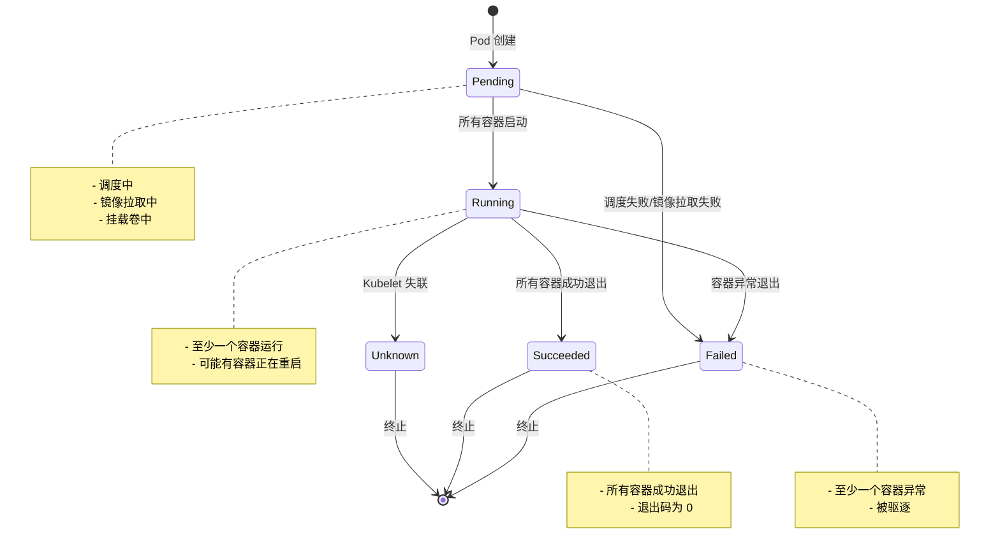

### Pod 状态定义

**位置**: `pkg/apis/core/types.go`

```go
type PodPhase string

const (
    PodPending   PodPhase = "Pending"
    PodRunning   PodPhase = "Running"
    PodSucceeded PodPhase = "Succeeded"
    PodFailed    PodPhase = "Failed"
    PodUnknown   PodPhase = "Unknown"
)
```

### Pod 状态转换条件

| 当前状态 | 下一个状态 | 触发条件 |
|---------|-----------|---------|
| **Pending** | Running | 所有容器（包括 Init Containers）已成功启动 |
| **Pending** | Failed | 调度失败、镜像拉取失败、容器启动失败 |
| **Running** | Succeeded | 所有容器成功退出（退出码 0） |
| **Running** | Failed | 至少一个容器异常退出 |
| **Running** | Unknown | Kubelet 失联（心跳丢失） |
| **Unknown** | Pending | Kubelet 重新连接，Pod 状态恢复 |
| **Failed** | Running | 容器被重启（restartPolicy != Never） |

### Pod 条件（Pod Conditions）

Pod 包含一组条件用于表示其状态：

| 条件 | 说明 | 状态 |
|------|------|------|
| `PodScheduled` | Pod 已调度到节点 | True/False/Unknown |
| `PodInitialized` | Init Containers 已完成 | True/False/Unknown |
| `PodReady` | Pod 可以接收流量 | True/False/Unknown |
| `ContainersReady` | 所有容器就绪 | True/False/Unknown |
| `PodInitialized` | Init Containers 已完成 | True/False/Unknown |

### Pod 生命周期事件

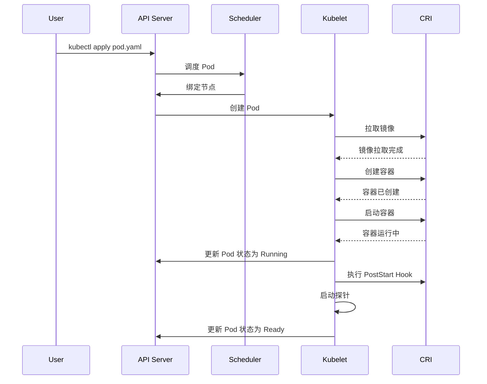

---

## 容器生命周期

### 容器状态机

容器有 3 种状态：

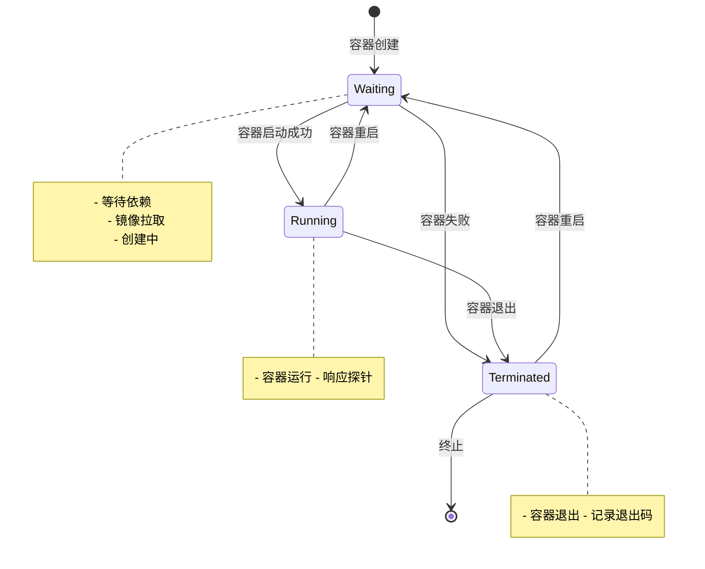

### 容器状态定义

**位置**: `pkg/apis/core/types.go`

```go
// ContainerStateWaiting 表示容器等待状态
type ContainerStateWaiting struct {
    Reason  string
    Message string
}

// ContainerStateRunning 表示容器运行状态
type ContainerStateRunning struct {
    StartedAt metav1.Time
}

// ContainerStateTerminated 表示容器终止状态
type ContainerStateTerminated struct {
    ExitCode    int32
    Signal      int32
    Reason      string
    Message     string
    StartedAt   metav1.Time
    FinishedAt  metav1.Time
    ContainerID string
}

// ContainerState 表示容器的可能状态
type ContainerState struct {
    Waiting    *ContainerStateWaiting
    Running    *ContainerStateRunning
    Terminated *ContainerStateTerminated
}
```

### 容器退出码

| 退出码 | 说明 | 常见原因 |
|--------|------|---------|
| **0** | 正常退出 | 程序正常完成 |
| **125** | Docker 守护进程错误 | Docker 守护进程未运行 |
| **126** | 容器命令无法调用 | 命令不可执行 |
| **127** | 容器命令未找到 | 命令不存在 |
| **128** | 信号终止 | 信号 N = 128 + 信号码 |
| **137** (9) | SIGKILL | 容器被强制终止（OOM Kill、驱逐） |
| **139** (11) | SIGSEGV | 段错误，程序崩溃 |
| **143** (15) | SIGTERM | 优雅关闭 |
| **255** | 退出码超出范围 | 程序退出码不在 0-255 范围 |

### 重启策略

| 策略 | 说明 | 适用场景 |
|------|------|---------|
| **Always** | 容器总是重启 | 长期运行服务 |
| **OnFailure** | 容器失败时重启 | 批处理任务 |
| **Never** | 容器从不重启 | 一次性任务（Job、CronJob） |

---

## 健康检查机制（Probe）

### Probe 类型

Kubernetes 支持 3 种探针类型：

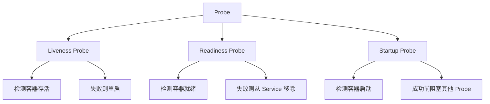

### Probe 配置

| 字段 | 说明 | Liveness | Readiness | Startup |
|------|------|----------|-----------|---------|
| `initialDelaySeconds` | 容器启动后等待多久开始探测 | 推荐 10-30s | 推荐 0-10s | 推荐 0-30s |
| `periodSeconds` | 探测间隔 | 10s（最小 1s） | 10s（最小 1s） | 10s（最小 1s） |
| `timeoutSeconds` | 超时时间 | 1s（最小 1s） | 1s（最小 1s） | 1s（最小 1s） |
| `successThreshold` | 成功阈值 | 1 | 1 | 1 |
| `failureThreshold` | 失败阈值 | 3 | 3 | 30 |
| `terminationGracePeriodSeconds` | 优雅关闭时间 | 30s | - | - |

### Probe 实现类型

#### 1. Exec Probe

在容器内执行命令：

```yaml
livenessProbe:
  exec:
    command:
    - cat
    - /tmp/health
  initialDelaySeconds: 5
  periodSeconds: 10
```

**实现位置**: `pkg/probe/exec/probe.go`

#### 2. HTTP Get Probe

发送 HTTP GET 请求：

```yaml
readinessProbe:
  httpGet:
    path: /health
    port: 8080
    scheme: HTTP
    httpHeaders:
    - name: Custom-Header
      value: Awesome
  initialDelaySeconds: 3
  periodSeconds: 3
```

**实现位置**: `pkg/probe/http/probe.go`

#### 3. TCP Socket Probe

尝试建立 TCP 连接：

```yaml
livenessProbe:
  tcpSocket:
    port: 8080
  initialDelaySeconds: 15
  periodSeconds: 20
```

**实现位置**: `pkg/probe/tcp/probe.go`

#### 4. gRPC Probe

检查 gRPC 服务健康状态：

```yaml
livenessProbe:
  grpc:
    port: 8080
    service: health-check
  initialDelaySeconds: 5
```

**实现位置**: `pkg/probe/grpc/probe.go`

### Probe Manager 架构

**位置**: `pkg/kubelet/prober/prober_manager.go`

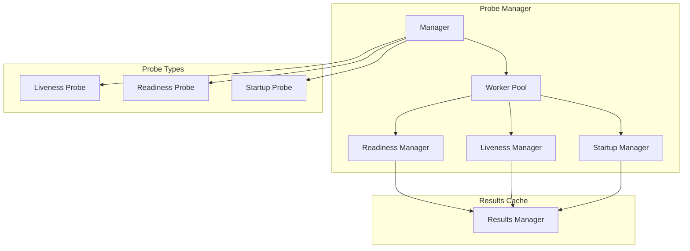

### Probe Manager 实现

```go
type Manager interface {
    // 为每个容器 Probe 创建工作线程
    AddPod(ctx context.Context, pod *v1.Pod)

    // 停止 Pod 的 Liveness 和 Startup Probe（终止期间）
    StopLivenessAndStartup(pod *v1.Pod)

    // 清理 Pod，包括终止工作线程和删除缓存结果
    RemovePod(pod *v1.Pod)

    // 清理不应运行的 Pods
    CleanupPods(desiredPods map[types.UID]sets.Empty)

    // 更新 Pod 状态，设置 Ready 状态
    UpdatePodStatus(context.Context, *v1.Pod, *v1.PodStatus)
}
```

### Prober 实现

**位置**: `pkg/kubelet/prober/prober.go`

```go
type prober struct {
    exec   execprobe.Prober
    http   httpprobe.Prober
    tcp    tcpprobe.Prober
    grpc   grpcprobe.Prober
    runner kubecontainer.CommandRunner
    recorder record.EventRecorderLogger
}

func (pb *prober) probe(ctx context.Context, probeType probeType, pod *v1.Pod, status v1.PodStatus, container v1.Container, containerID kubecontainer.ContainerID) (results.Result, error) {
    var probeSpec *v1.Probe
    switch probeType {
    case readiness:
        probeSpec = container.ReadinessProbe
    case liveness:
        probeSpec = container.LivenessProbe
    case startup:
        probeSpec = container.StartupProbe
    default:
        return results.Failure, fmt.Errorf("unknown probe type: %q", probeType)
    }

    if probeSpec == nil {
        return results.Success, nil
    }

    result, output, err := pb.runProbeWithRetries(ctx, probeType, probeSpec, pod, status, container, containerID, maxProbeRetries)

    if err != nil {
        pb.recordContainerEvent(ctx, pod, &container, v1.EventTypeWarning, events.ContainerUnhealthy,
            "%s probe errored and resulted in %s state: %s", probeType, result, err)
        return results.Failure, err
    }

    switch result {
    case probe.Success:
        return results.Success, nil
    case probe.Failure:
        pb.recordContainerEvent(ctx, pod, &container, v1.EventTypeWarning, events.ContainerUnhealthy,
            "%s probe failed: %s", probeType, output)
        return results.Failure, nil
    default:
        return results.Failure, nil
    }
}
```

### Worker 实现

每个 Probe 有一个独立的工作线程：

```go
type worker struct {
    manager *manager
    pod     *v1.Pod
    container *v1.Container
    probeType probeType

    // 探测结果管理器
    resultsManager results.Manager

    // 手动触发通道
    manualTriggerCh chan struct{}

    // 停止通道
    stopCh chan struct{}
}

func (w *worker) run(ctx context.Context) {
    defer w.manager.removeWorker(w.pod.UID, w.container.Name, w.probeType)

    probeTicker := time.NewTicker(time.Duration(w.probeSpec.PeriodSeconds) * time.Second)
    defer probeTicker.Stop()

    for {
        select {
        case <-w.stopCh:
            return
        case <-probeTicker.C:
            w.doProbe(ctx)
        case <-w.manualTriggerCh:
            w.doProbe(ctx)
        }
    }
}
```

### Probe 结果管理

```go
type Manager interface {
    Get(key kubecontainer.ContainerID) (Result, bool)
    Set(key kubecontainer.ContainerID, result Result)
    Remove(key kubecontainer.ContainerID)
}

type Result int

const (
    Success Result = iota
    Failure
    Unknown
)
```

### Startup Probe 特性

Startup Probe 用于慢启动应用，**会禁用 Liveness 和 Readiness Probe 直到成功**：

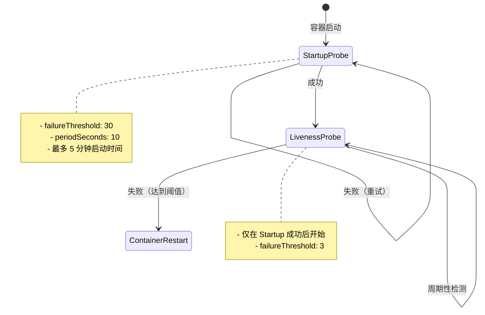

### Readiness 影响流量

```yaml
# Readiness Probe 失败导致从 Service 移除
apiVersion: v1
kind: Service
metadata:
  name: my-service
spec:
  selector:
    app: my-app
  ports:
  - port: 80
---
apiVersion: apps/v1
kind: Deployment
metadata:
  name: my-app
spec:
  template:
    spec:
      containers:
      - name: my-app
        image: my-app:latest
        readinessProbe:
          httpGet:
            path: /ready
            port: 8080
          failureThreshold: 3
```

### Probe 指标

```go
var ProberResults = metrics.NewCounterVec(
    &metrics.CounterOpts{
        Subsystem:      "prober",
        Name:           "probe_total",
        Help:           "Cumulative number of a liveness, readiness or startup probe for a container by result.",
        StabilityLevel: metrics.BETA,
    },
    []string{"probe_type", "result", "container", "pod", "namespace", "pod_uid"},
)

var ProberDuration = metrics.NewHistogramVec(
    &metrics.HistogramOpts{
        Subsystem:      "prober",
        Name:           "probe_duration_seconds",
        Help:           "Duration in seconds for a probe response.",
        StabilityLevel: metrics.ALPHA,
    },
    []string{"probe_type", "container", "pod", "namespace"},
)
```

### Probe 最佳实践

#### 1. Liveness Probe 配置

```yaml
livenessProbe:
  exec:
    command:
    - /bin/sh
    - -c
    - "if [ -f /tmp/live ]; then echo OK; else exit 1; fi"
  initialDelaySeconds: 30   # 等待应用完全启动
  periodSeconds: 10         # 每 10 秒检查一次
  timeoutSeconds: 3         # 超时 3 秒
  failureThreshold: 3        # 连续 3 次失败才重启
  terminationGracePeriodSeconds: 30  # 优雅关闭 30 秒
```

#### 2. Readiness Probe 配置

```yaml
readinessProbe:
  httpGet:
    path: /ready
    port: 8080
    httpHeaders:
    - name: X-Ready
      value: "true"
  initialDelaySeconds: 5    # 尽快开始探测
  periodSeconds: 5           # 高频探测，快速就绪
  timeoutSeconds: 1         # 快速超时
  failureThreshold: 3        # 从 Service 移除
  successThreshold: 1       # 立即就绪
```

#### 3. Startup Probe 配置（慢启动应用）

```yaml
startupProbe:
  httpGet:
    path: /startup
    port: 8080
  initialDelaySeconds: 0    # 立即开始
  periodSeconds: 10         # 每 10 秒检查
  timeoutSeconds: 3
  failureThreshold: 30       # 30 * 10s = 5 分钟启动时间
  successThreshold: 1
```

---

## Hook 机制

### Hook 类型

Kubernetes 支持 2 种容器 Hook：

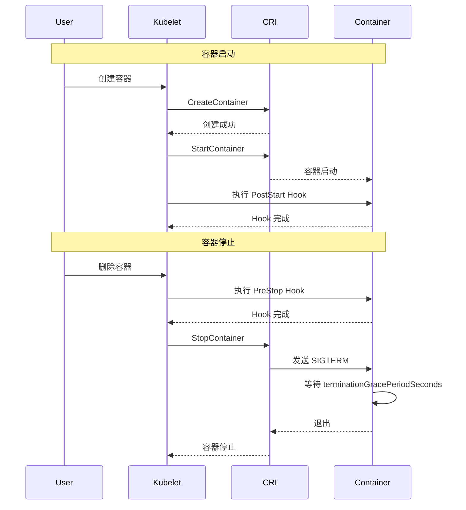

### PostStart Hook

在容器创建后**立即**执行，**不保证**在容器 ENTRYPOINT 之前执行：

```yaml
apiVersion: v1
kind: Pod
metadata:
  name: hook-demo
spec:
  containers:
  - name: my-container
    image: nginx:latest
    lifecycle:
      postStart:
        exec:
          command:
          - /bin/sh
          - -c
          - "echo 'Hello from the postStart handler' >> /usr/share/message"
```

**注意事项**：
- **异步执行**，不阻塞容器启动
- **不保证执行顺序**
- 失败会记录事件，但不会阻止容器启动

### PreStop Hook

在容器终止前**立即**执行，**同步阻塞**容器删除：

```yaml
apiVersion: v1
kind: Pod
metadata:
  name: hook-demo
spec:
  containers:
  - name: my-container
    image: nginx:latest
    lifecycle:
      preStop:
        exec:
          command:
          - /bin/sh
          - -c
          - "sleep 15 && nginx -s quit"
        httpGet:
          path: /quit
          port: 8080
```

**注意事项**：
- **同步执行**，阻塞容器删除
- 必须在 `terminationGracePeriodSeconds` 内完成
- 失败会记录事件，但仍然继续终止流程

### Handler 类型

#### 1. Exec Handler

```yaml
lifecycle:
  postStart:
    exec:
      command:
      - /bin/sh
      - -c
      - "echo 'Hello'"
```

#### 2. HTTPGet Handler

```yaml
lifecycle:
  preStop:
    httpGet:
      path: /shutdown
      port: 8080
      scheme: HTTP
```

### Hook 错误处理

```go
// Hook 错误常量
const (
    ErrPreCreateHook  = errors.New("PreCreateHookError")
    ErrPreStartHook  = errors.New("PreStartHookError")
    ErrPostStartHook = errors.New("PostStartHookError")
)
```

| Hook 类型 | 失败影响 | 事件记录 |
|----------|----------|---------|
| PostStart | 容器仍然启动 | `FailedPostStartHook` |
| PreStop | 容器仍然终止 | `FailedPreStopHook` |

### Hook 最佳实践

#### 1. 使用 PreStop 实现优雅关闭

```yaml
apiVersion: v1
kind: Pod
metadata:
  name: graceful-shutdown
spec:
  terminationGracePeriodSeconds: 60
  containers:
  - name: web-app
    image: my-app:latest
    lifecycle:
      preStop:
        exec:
          command:
          - /bin/sh
          - -c
          - |
            # 1. 通知负载均衡器移除
            curl -X POST http://lb/deregister
            # 2. 停止接受新连接
            curl -X POST http://localhost:8080/draining
            # 3. 等待现有连接完成
            sleep 30
            # 4. 优雅关闭
            curl -X POST http://localhost:8080/shutdown
```

#### 2. 使用 PostStart 初始化资源

```yaml
apiVersion: v1
kind: Pod
metadata:
  name: init-resources
spec:
  containers:
  - name: app
    image: my-app:latest
    lifecycle:
      postStart:
        exec:
          command:
          - /bin/sh
          - -c
          - |
            # 初始化缓存
            redis-cli FLUSHALL
            # 预热数据
            curl http://warmup-cache/preload
```

---

## 优雅关闭

### 优雅关闭流程

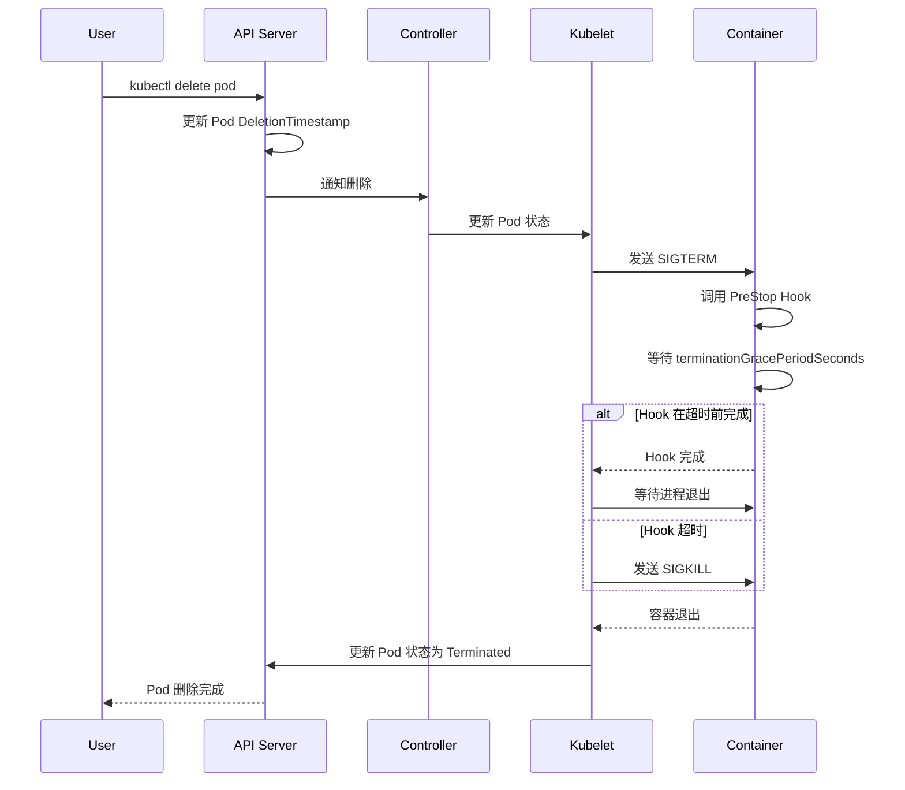

### 优雅关闭时间线

```
Time 0s:        收到删除请求
Time 0s:        设置 DeletionTimestamp
Time 0s:        从 Service 移除（流量停止）
Time 0s:        执行 PreStop Hook
Time 0-60s:      等待 terminationGracePeriodSeconds（默认 30s）
Time > 60s:      发送 SIGKILL（强制终止）
```

### Termination Grace Period

| 组件 | 说明 | 默认值 |
|------|------|---------|
| `terminationGracePeriodSeconds` | Pod 级别优雅关闭时间 | 30s |
| `terminationGracePeriodSeconds` | 容器级别优雅关闭时间 | 30s |

```yaml
apiVersion: v1
kind: Pod
metadata:
  name: graceful-pod
spec:
  terminationGracePeriodSeconds: 60
  containers:
  - name: my-app
    image: my-app:latest
```

### 容器信号处理

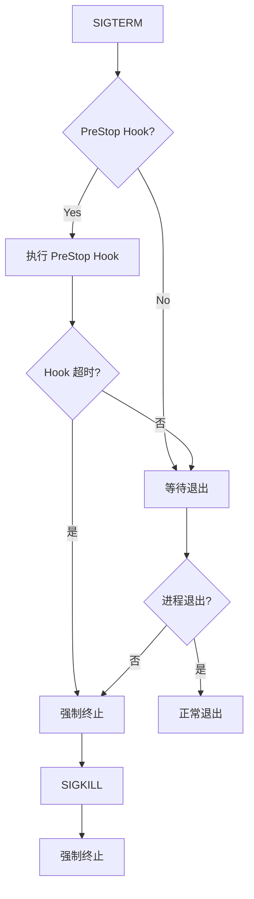

### 优雅关闭最佳实践

#### 1. 信号处理器

```go
package main

import (
    "os"
    "os/signal"
    "syscall"
)

func main() {
    // 监听信号
    sigChan := make(chan os.Signal, 1)
    signal.Notify(sigChan, syscall.SIGTERM, syscall.SIGINT)

    // 启动服务
    go runServer()

    // 等待信号
    <-sigChan

    // 优雅关闭
    log.Println("Received SIGTERM, shutting down...")
    gracefulShutdown()
}

func gracefulShutdown() {
    // 1. 停止接受新连接
    server.StopAccepting()

    // 2. 等待现有请求完成
    server.WaitRequestsComplete()

    // 3. 关闭连接
    server.CloseConnections()

    // 4. 刷新缓存
    flushCache()

    log.Println("Shutdown complete")
}
```

#### 2. PreStop Hook 配合

```yaml
apiVersion: v1
kind: Pod
metadata:
  name: graceful-app
spec:
  terminationGracePeriodSeconds: 60
  containers:
  - name: app
    image: my-app:latest
    lifecycle:
      preStop:
        exec:
          command:
          - /bin/sh
          - -c
          - |
            # PreStop 触发应用关闭
            curl -X POST http://localhost:8080/shutdown
            # 等待应用关闭
            for i in $(seq 1 30); do
              if ! curl -s http://localhost:8080/health > /dev/null 2>&1; then
                echo "Application shutdown complete"
                exit 0
              fi
              sleep 1
            done
```

---

## 驱逐机制（Eviction）

### Eviction 信号

Kubelet 支持多种驱逐信号：

| 信号 | 资源 | 说明 |
|------|--------|------|
| `memory.available` | 内存 | 可用内存低于阈值 |
| `nodefs.available` | 节点文件系统 | 节点文件系统可用空间低于阈值 |
| `nodefs.inodesFree` | 节点文件系统 | 节点文件系统可用 inode 低于阈值 |
| `imagefs.available` | 镜像文件系统 | 镜像文件系统可用空间低于阈值 |
| `imagefs.inodesFree` | 镜像文件系统 | 镜像文件系统可用 inode 低于阈值 |
| `pid.available` | PID | PID 使用率超过阈值 |

### Eviction Manager 架构

**位置**: `pkg/kubelet/eviction/eviction_manager.go`

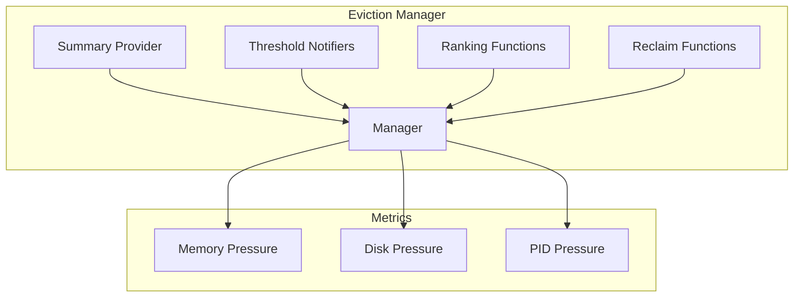

### Eviction Manager 实现

```go
type managerImpl struct {
    clock                clock.WithTicker
    config               Config
    killPodFunc           KillPodFunc
    imageGC              ImageGC
    containerGC          ContainerGC
    nodeConditions        []v1.NodeConditionType
    nodeRef             *v1.ObjectReference
    recorder             record.EventRecorder
    summaryProvider      stats.SummaryProvider
    thresholdsFirstObservedAt thresholdsObservedAt
    thresholdsMet        []evictionapi.Threshold
    signalToRankFunc      map[evictionapi.Signal]rankFunc
    signalToNodeReclaimFuncs map[evictionapi.Signal]nodeReclaimFuncs
    thresholdNotifiers   []ThresholdNotifier
}
```

### Eviction 控制循环

```go
func (m *managerImpl) Start(ctx context.Context, diskInfoProvider DiskInfoProvider, podFunc ActivePodsFunc, podCleanedUpFunc PodCleanedUpFunc, monitoringInterval time.Duration) {
    thresholdHandler := func(message string) {
        m.synchronize(ctx, diskInfoProvider, podFunc)
    }

    // 启动内存阈值通知器
    if m.config.KernelMemcgNotification || runtime.GOOS == "windows" {
        for _, threshold := range m.config.Thresholds {
            if threshold.Signal == evictionapi.SignalMemoryAvailable {
                notifier, err := NewMemoryThresholdNotifier(logger, threshold, m.config.PodCgroupRoot, &CgroupNotifierFactory{}, thresholdHandler)
                if err != nil {
                    logger.Info("Eviction manager: failed to create memory threshold notifier")
                } else {
                    go notifier.Start(ctx)
                    m.thresholdNotifiers = append(m.thresholdNotifiers, notifier)
                }
            }
        }
    }

    // 启动驱逐管理监控
    go func() {
        for {
            evictedPods, err := m.synchronize(ctx, diskInfoProvider, podFunc)
            if evictedPods != nil && err == nil {
                m.waitForPodsCleanup(logger, podCleanedUpFunc, evictedPods)
            } else {
                if err != nil {
                    logger.Error(err, "Eviction manager: failed to synchronize")
                }
                time.Sleep(monitoringInterval)
            }
        }
    }()
}
```

### Eviction 流程

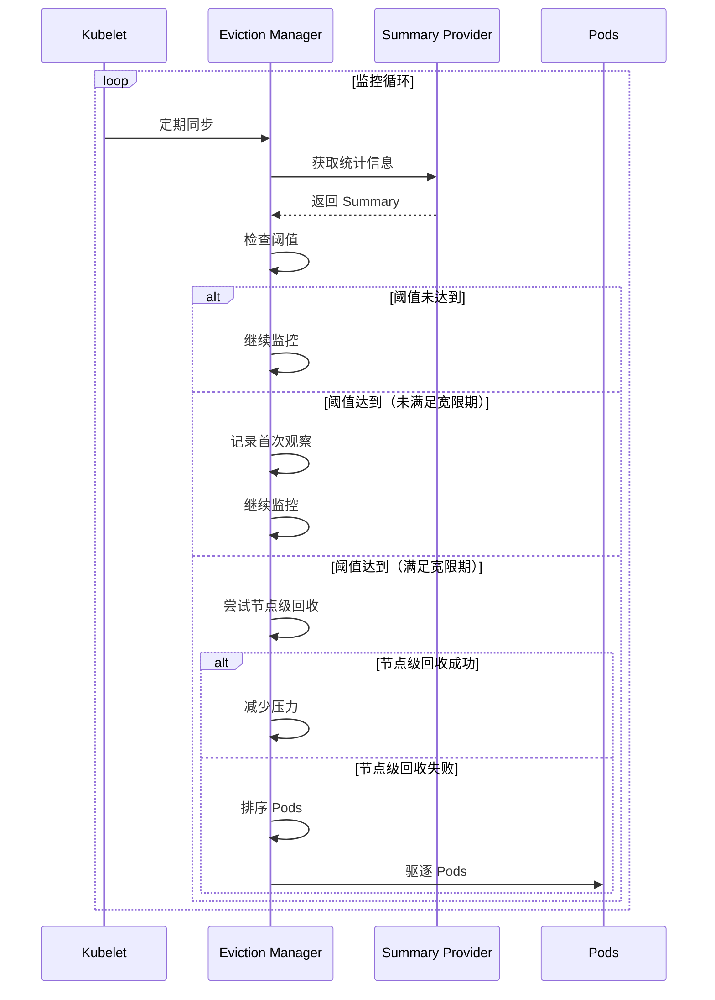

### Eviction 排序策略

Pod 驱逐按优先级排序：

| 优先级 | 说明 |
|---------|------|
| **BestEffort** | 低 QoS，最先驱逐 |
| **Burstable** | 中等 QoS |
| **Guaranteed** | 高 QoS，最后驱逐 |

```go
type rankFunc func(pods []*v1.Pod, statsFunc statsFunc) []*v1.Pod

func buildSignalToRankFunc(hasImageFs bool, splitContainerImageFs bool) map[evictionapi.Signal]rankFunc {
    rankFuncs := map[evictionapi.Signal]rankFunc{}

    rankFuncs[evictionapi.SignalMemoryAvailable] = memoryPressureRankFunc(hasImageFs, splitContainerImageFs)
    rankFuncs[evictionapi.SignalNodeFsAvailable] = diskPressureRankFunc(hasImageFs, splitContainerImageFs)
    rankFuncs[evictionapi.SignalImageFsAvailable] = diskPressureRankFunc(hasImageFs, splitContainerImageFs)
    rankFuncs[evictionapi.SignalPIDAvailable] = pidPressureRankFunc

    return rankFuncs
}
```

### QoS 类别

| QoS | Requests/Limits | 示例 |
|------|-----------------|--------|
| **Guaranteed** | requests == limits，且都设置 | 内存: 1Gi/1Gi, CPU: 1/1 |
| **Burstable** | requests 存在，但不等于 limits | 内存: 512Mi/1Gi, CPU: 0.5/1 |
| **BestEffort** | requests 和 limits 都不设置 | 内存: -, CPU: - |

### 驱逐事件

```yaml
apiVersion: v1
kind: Pod
metadata:
  name: evicted-pod
  annotations:
    kubernetes.io/description: "Evicted due to memory pressure"
status:
  phase: Failed
  reason: Evicted
  message: "The node was low on resource: memory."
```

### Eviction 配置

```yaml
apiVersion: kubelet.config.k8s.io/v1beta1
kind: KubeletConfiguration
evictionHard:
  memory.available: "200Mi"
  nodefs.available: "10%"
  imagefs.available: "15%"
  pid.available: "20%"
evictionSoft:
  memory.available: "300Mi"
  imagefs.available: "20%"
evictionSoftGracePeriod:
  memory.available: "1m30s"
  imagefs.available: "2m"
```

### Eviction 最佳实践

#### 1. 合理设置 QoS

```yaml
apiVersion: v1
kind: Pod
metadata:
  name: high-priority-pod
spec:
  containers:
  - name: app
    image: my-app:latest
    resources:
      requests:
        memory: "512Mi"
        cpu: "500m"
      limits:
        memory: "1Gi"
        cpu: "1000m"
  priorityClassName: high-priority
```

#### 2. 使用 PriorityClass 保护关键 Pod

```yaml
apiVersion: scheduling.k8s.io/v1
kind: PriorityClass
metadata:
  name: system-critical
value: 1000000
globalDefault: false
description: "Priority class for critical system pods"
---
apiVersion: v1
kind: Pod
metadata:
  name: critical-pod
spec:
  priorityClassName: system-critical
  containers:
  - name: app
    image: my-app:latest
```

#### 3. 驱逐容忍配置

```yaml
apiVersion: v1
kind: Pod
metadata:
  name: pressure-tolerant-pod
spec:
  tolerations:
  - key: "node.kubernetes.io/memory-pressure"
    operator: "Exists"
    effect: "NoSchedule"
  - key: "node.kubernetes.io/disk-pressure"
    operator: "Exists"
    effect: "NoSchedule"
  containers:
  - name: app
    image: my-app:latest
```

---

## 最佳实践

### 1. Probe 配置建议

#### Liveness Probe

```yaml
livenessProbe:
  initialDelaySeconds: 30    # 等待应用完全启动
  periodSeconds: 10         # 检测间隔
  timeoutSeconds: 5         # 超时时间
  failureThreshold: 3        # 失败阈值
  terminationGracePeriodSeconds: 30
```

**规则**：
- `initialDelaySeconds` >= 应用启动时间
- `failureThreshold * periodSeconds` <= 60s（避免频繁重启）
- 避免使用 `/bin/true`（无意义）

#### Readiness Probe

```yaml
readinessProbe:
  initialDelaySeconds: 5     # 尽快开始
  periodSeconds: 5            # 高频检测
  timeoutSeconds: 1           # 快速超时
  failureThreshold: 3          # 从 Service 移除
  successThreshold: 1          # 立即就绪
```

**规则**：
- 快速响应服务状态变化
- 检测依赖服务就绪
- 避免过度重试

#### Startup Probe

```yaml
startupProbe:
  initialDelaySeconds: 0
  periodSeconds: 10
  timeoutSeconds: 3
  failureThreshold: 30        # 5 分钟启动时间
  successThreshold: 1
```

**规则**：
- 用于慢启动应用
- 成功前禁用其他 Probe
- `failureThreshold * periodSeconds` = 最大启动时间

### 2. Hook 最佳实践

#### PostStart Hook

```yaml
lifecycle:
  postStart:
    exec:
      command:
      - /bin/sh
      - -c
      - |
        # 初始化任务
        log "PostStart: Initializing..."
        init-cache
        register-service
        log "PostStart: Complete"
```

**注意事项**：
- 不要阻塞容器启动
- 使用幂等操作
- 记录日志便于调试

#### PreStop Hook

```yaml
lifecycle:
  preStop:
    exec:
      command:
      - /bin/sh
      - -c
      - |
        # 优雅关闭
        log "PreStop: Shutting down..."
        stop-accepting-requests
        wait-for-connections-to-complete
        flush-cache
        log "PreStop: Complete"
```

**注意事项**：
- 必须在 `terminationGracePeriodSeconds` 内完成
- 使用幂等操作
- 同步执行，阻塞容器删除

### 3. 优雅关闭最佳实践

#### 容器信号处理

```go
// Go 信号处理示例
func main() {
    sigChan := make(chan os.Signal, 1)
    signal.Notify(sigChan, syscall.SIGTERM, syscall.SIGINT)

    go runServer()

    <-sigChan
    log.Println("Received termination signal")

    // 1. 停止接受新连接
    server.StopAccepting()

    // 2. 等待现有请求完成
    server.Wait(30 * time.Second)

    // 3. 关闭资源
    db.Close()
    cache.Flush()

    log.Println("Shutdown complete")
}
```

#### Kubernetes 配置

```yaml
apiVersion: v1
kind: Pod
metadata:
  name: graceful-shutdown-pod
spec:
  terminationGracePeriodSeconds: 60
  containers:
  - name: app
    image: my-app:latest
    lifecycle:
      preStop:
        exec:
          command:
          - /bin/sh
          - -c
          - |
            # 触发应用关闭
            curl -X POST http://localhost:8080/shutdown
            # 等待应用关闭
            for i in $(seq 1 30); do
              if ! nc -z localhost 8080; then
                echo "Application stopped"
                exit 0
              fi
              sleep 1
            done
```

### 4. Eviction 抵御策略

#### 设置资源请求和限制

```yaml
apiVersion: v1
kind: Pod
metadata:
  name: protected-pod
spec:
  containers:
  - name: app
    image: my-app:latest
    resources:
      requests:
        memory: "512Mi"
        cpu: "500m"
      limits:
        memory: "1Gi"
        cpu: "1000m"
```

#### 使用 PriorityClass

```yaml
apiVersion: scheduling.k8s.io/v1
kind: PriorityClass
metadata:
  name: production-high
value: 1000000
globalDefault: false
---
apiVersion: v1
kind: Pod
metadata:
  name: production-pod
spec:
  priorityClassName: production-high
  containers:
  - name: app
    image: my-app:latest
```

#### 容忍压力

```yaml
apiVersion: v1
kind: Pod
metadata:
  name: pressure-tolerant-pod
spec:
  tolerations:
  - key: "node.kubernetes.io/memory-pressure"
    operator: "Exists"
    effect: "NoSchedule"
  - key: "node.kubernetes.io/disk-pressure"
    operator: "Exists"
    effect: "NoSchedule"
  containers:
  - name: app
    image: my-app:latest
```

### 5. 故障排查

#### Probe 失败

```bash
# 查看 Pod 事件
kubectl describe pod <pod-name>

# 查看 Pod 日志
kubectl logs <pod-name>

# 查看容器日志
kubectl logs <pod-name> -c <container-name>

# 测试 Probe 端点
kubectl exec -it <pod-name> -- curl http://localhost:8080/health
```

#### Hook 失败

```bash
# 查看 Pod 事件
kubectl get events --field-selector involvedObject.name=<pod-name>

# 查看 Kubelet 日志
journalctl -u kubelet -f

# 查看 Kubelet 日志（容器化部署）
kubectl logs -n kube-system -l component=kubelet
```

#### Eviction 问题

```bash
# 查看节点条件
kubectl describe node <node-name>

# 查看被驱逐的 Pods
kubectl get pods --all-namespaces --field-selector status.phase==Failed

# 查看节点资源使用
kubectl top nodes

# 查看节点详情
kubectl describe node <node-name>
```

---

## 总结

### 核心要点

1. **Pod 生命周期**：5 种状态（Pending、Running、Succeeded、Failed、Unknown），通过状态机转换
2. **容器生命周期**：3 种状态（Waiting、Running、Terminated），支持重启策略
3. **健康检查**：3 种 Probe（Liveness、Readiness、Startup），支持 4 种实现类型（Exec、HTTP、TCP、gRPC）
4. **Hook 机制**：PostStart（异步）、PreStop（同步），用于生命周期事件处理
5. **优雅关闭**：支持信号处理、Hook 执行、宽限期配置
6. **驱逐机制**：基于资源阈值，按 QoS 优先级驱逐 Pods

### 关键路径

```
Pod 创建 → 调度 → 容器启动 → PostStart Hook → Startup Probe
                                                            ↓
                                                       Readiness Probe
                                                            ↓
                                                       Service 流量

容器退出 → PreStop Hook → 优雅关闭 → SIGTERM → SIGKILL（超时）
```

### 推荐阅读

- [Configure Liveness, Readiness and Startup Probes](https://kubernetes.io/docs/tasks/configure-pod-container/configure-liveness-readiness-startup-probes/)
- [Container Lifecycle Hooks](https://kubernetes.io/docs/concepts/containers/container-lifecycle-hooks/)
- [Pod Priority and Preemption](https://kubernetes.io/docs/concepts/scheduling-eviction/pod-priority-preemption/)
- [Configure Pod Disruption Budget](https://kubernetes.io/docs/tasks/run-application/configure-pdb/)

---

**文档版本**：v1.0
**创建日期**：2026-03-04
**维护者**：AI Assistant
**Kubernetes 版本**：v1.28+
