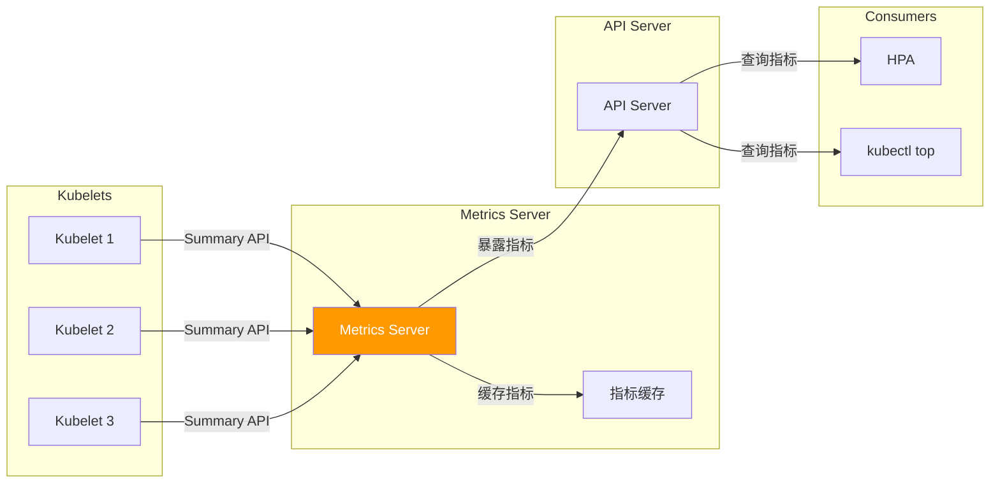

# Metrics Server 深度分析

> 本文档深入分析 Kubernetes Metrics Server，包括架构、Kubelet Summary API、指标聚合和缓存、HPA 集成。

---

## Metrics Server 概述

### 作用

Metrics Server 是 Kubernetes 的资源指标监控组件：



### 核心组件

| 组件 | 说明 |
|------|------|
| **Metrics API** | 提供资源指标 API |
| **Kubelet Scraping** | 从 Kubelet 获取指标 |
| **指标缓存** | 缓存指标数据 |
| **HPA 集成** | HPA 自动扩缩容 |

---

## Kubelet Summary API

### API 端点

**位置**：`pkg/kubelet/summary/summary.go`

```go
// Summary 摘要
type Summary struct {
    // Node 节点信息
    Node Node `json:"node"`

    // Pods Pod 列表
    Pods []PodSummary `json:"pods"`
}

// PodSummary Pod 摘要
type PodSummary struct {
    // PodReference Pod 引用
    PodReference PodReference

    // CPU CPU 指标
    CPU *CPUStats `json:"cpu,omitempty"`

    // Memory 内存指标
    Memory *MemoryStats `json:"memory,omitempty"`

    // Volume 存储指标
    Volume []VolumeStats `json:"volume,omitempty"`
}
```

### 端点路径

```bash
# 摘要 API
GET /stats/summary

# 容器指标
GET /stats/container/<container-id>

# Pod 指标
GET /stats/<pod-name>/<namespace>
```

---

## 指标采集

### Kubelet Scraping

**位置**：`cmd/metrics-server/app/options.go`

```go
// Options 配置选项
type Options struct {
    // KubeletURL Kubelet 地址
    KubeletURL string

    // APIServerHost API Server 地址
    APIServerHost string

    // MetricsResolution 指标分辨率
    MetricsResolution time.Duration

    // HousekeepingInterval 清理间隔
    HousekeepingInterval time.Duration
}

// scrapeMetrics 采集指标
func (o *Options) scrapeMetrics() error {
    // 1. 从 Kubelet 获取节点信息
    nodeSummary, err := o.scrapeNode()
    if err != nil {
        return err
    }

    // 2. 从 Kubelet 获取 Pod 信息
    podSummaries, err := o.scrapePods()
    if err != nil {
        return err
    }

    // 3. 更新指标缓存
    o.updateCache(nodeSummary, podSummaries)

    return nil
}
```

---

## 指标缓存

### 缓存机制

```go
// MetricsCache 指标缓存
type MetricsCache struct {
    sync.RWMutex

    // NodeInfo 节点信息
    NodeInfo *NodeInfo

    // PodInfos Pod 信息
    PodInfos map[string]*PodInfo

    // LastUpdate 最后更新时间
    LastUpdate time.Time
}

// GetMetrics 获取指标
func (c *MetricsCache) GetMetrics(podName, namespace string) (*PodMetrics, error) {
    c.RLock()
    defer c.RUnlock()

    podInfo, ok := c.PodInfos[podKey(namespace, podName)]
    if !ok {
        return nil, fmt.Errorf("pod not found")
    }

    return podInfo.Metrics, nil
}
```

---

## Metrics API

### Resource Metrics API

```go
// PodMetrics Pod 指标
type PodMetrics struct {
    metav1.TypeMeta
    metav1.ObjectMeta

    // Timestamp 时间戳
    Timestamp metav1.Time

    // Window 时间窗口
    Window metav1.Duration

    // Containers 容器指标
    Containers []ContainerMetrics
}

// ContainerMetrics 容器指标
type ContainerMetrics struct {
    // Name 容器名称
    Name string

    // Usage 资源使用量
    Usage v1.ResourceList
}
```

### API 端点

```bash
# 节点指标
GET /apis/metrics.k8s.io/v1beta1/nodes

# Pod 指标
GET /apis/metrics.k8s.io/v1beta1/namespaces/<namespace>/pods

# 特定 Pod 指标
GET /apis/metrics.k8s.io/v1beta1/namespaces/<namespace>/pods/<pod-name>
```

---

## HPA 集成

### 使用 Resource Metrics

```yaml
apiVersion: autoscaling/v2
kind: HorizontalPodAutoscaler
metadata:
  name: myapp-hpa
spec:
  scaleTargetRef:
    apiVersion: apps/v1
    kind: Deployment
    name: myapp
  minReplicas: 2
  maxReplicas: 10
  metrics:
  - type: Resource
    resource:
      name: cpu
      target:
        type: Utilization
        averageUtilization: 80
  - type: Resource
    resource:
      name: memory
      target:
        type: Utilization
        averageUtilization: 80
```

---

## 最佳实践

### 1. 调整指标采集间隔

```yaml
args:
  - --kubelet-insecure
  - --kubelet-preferred-address-types=InternalIP
  - --metric-resolution=15s  # 指标分辨率
  - --v=2
```

### 2. 设置合理的缓存时间

```yaml
args:
  - --metric-resolution=15s
  - --housekeeping-interval=60s  # 清理间隔
```

### 3. 监控 Metrics Server

```bash
# 查看 Metrics Server 状态
kubectl get pods -n kube-system -l k8s-app=metrics-server

# 查看 Metrics Server 日志
kubectl logs -n kube-system deployment/metrics-server
```

---

## 故障排查

### 问题 1：指标不可用

**症状**：`kubectl top` 命令失败

**排查步骤**：

```bash
# 1. 检查 Metrics Server Pod
kubectl get pods -n kube-system -l k8s-app=metrics-server

# 2. 查看 Metrics Server 日志
kubectl logs -n kube-system deployment/metrics-server

# 3. 测试 Metrics API
kubectl get --raw /apis/metrics.k8s.io/v1beta1/nodes
```

### 问题 2：HPA 不工作

**症状**：HPA 无法获取指标

**排查步骤**：

```bash
# 1. 检查 Metrics Server 状态
kubectl get --raw /apis/metrics.k8s.io/v1beta1/namespaces/<namespace>/pods

# 2. 查看 HPA 状态
kubectl get hpa <hpa-name> -o yaml

# 3. 查看 HPA 事件
kubectl describe hpa <hpa-name>
```

---

## 总结

### 关键要点

1. **资源指标**：提供 CPU、内存等资源指标
2. **Kubelet 集成**：从 Kubelet Summary API 采集指标
3. **HPA 集成**：HPA 自动扩缩容的基础
4. **指标缓存**：缓存指标减少 API 调用
5. **轻量级**：资源占用低
6. **易部署**：简单的 Deployment 部署

### 源码位置

| 组件 | 位置 |
|------|------|
| Metrics Server | `github.com/kubernetes-sigs/metrics-server/` |
| Kubelet Summary API | `pkg/kubelet/summary/` |
| Metrics API | `staging/src/k8s.io/metrics/pkg/apis/metrics/v1beta1/` |

### 相关资源

- [Metrics Server 文档](https://github.com/kubernetes-sigs/metrics-server)
- [Kubernetes Metrics 文档](https://kubernetes.io/docs/tasks/debug/debug-cluster/resource-usage-monitoring/)
- [Kubernetes HPA 文档](https://kubernetes.io/docs/tasks/run-application/horizontal-pod-autoscale/)

---

::: tip 最佳实践
1. 设置合理的指标采集间隔
2. 监控 Metrics Server 状态
3. 设置合理的缓存时间
4. 定期检查日志和错误
:::

::: warning 注意事项
- Metrics Server 只提供资源指标
- 指标有延迟（采集间隔）
- 大集群中 Metrics Server 可能成为瓶颈
:::
