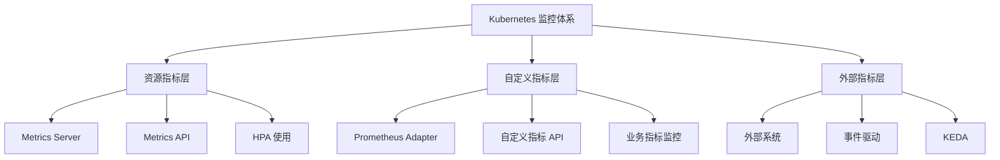
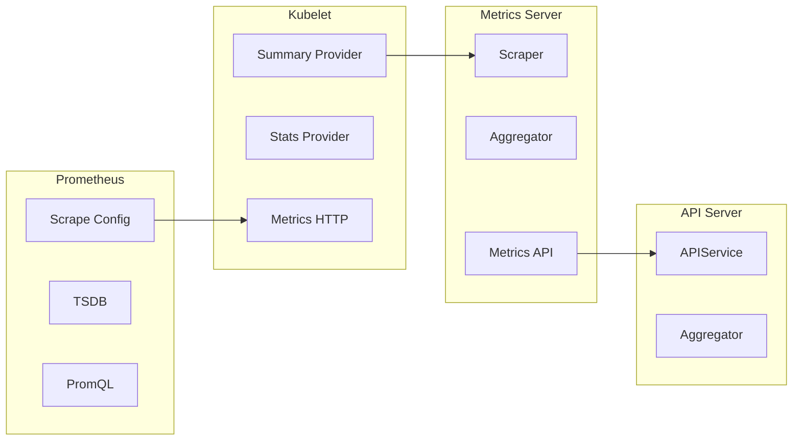
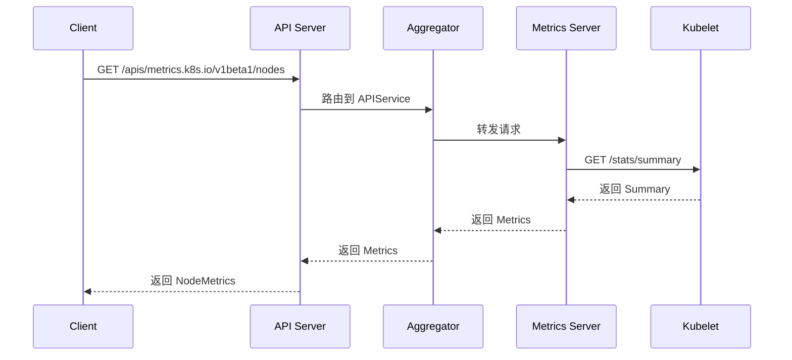
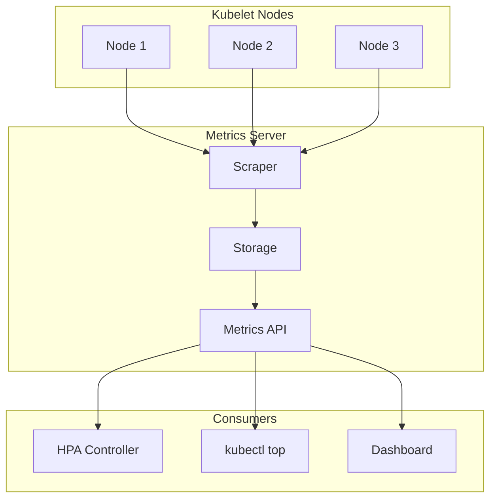
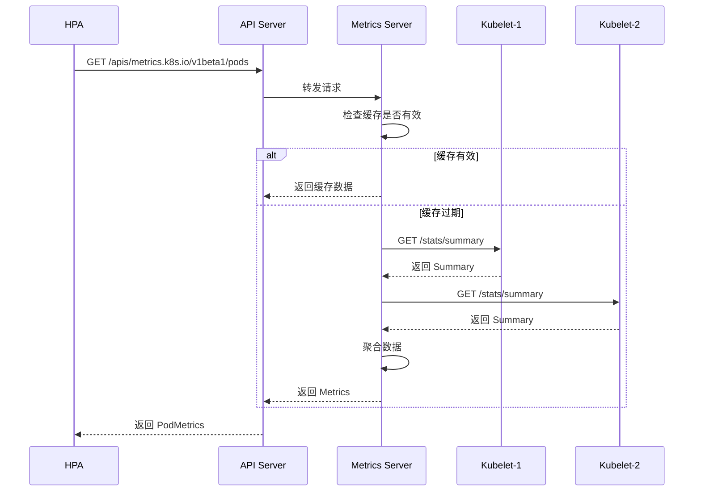
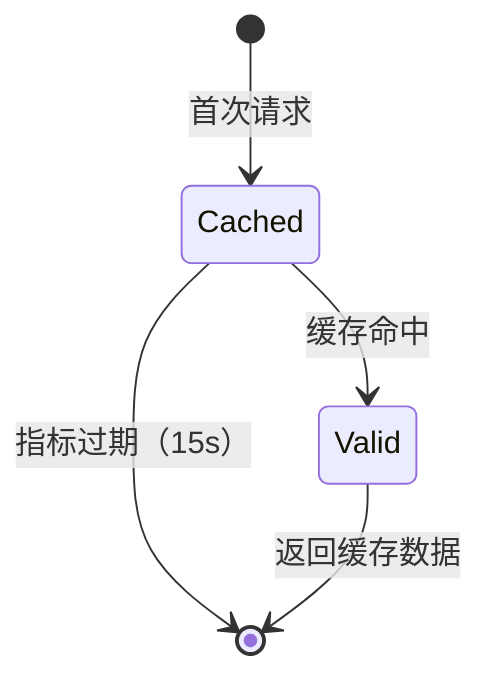
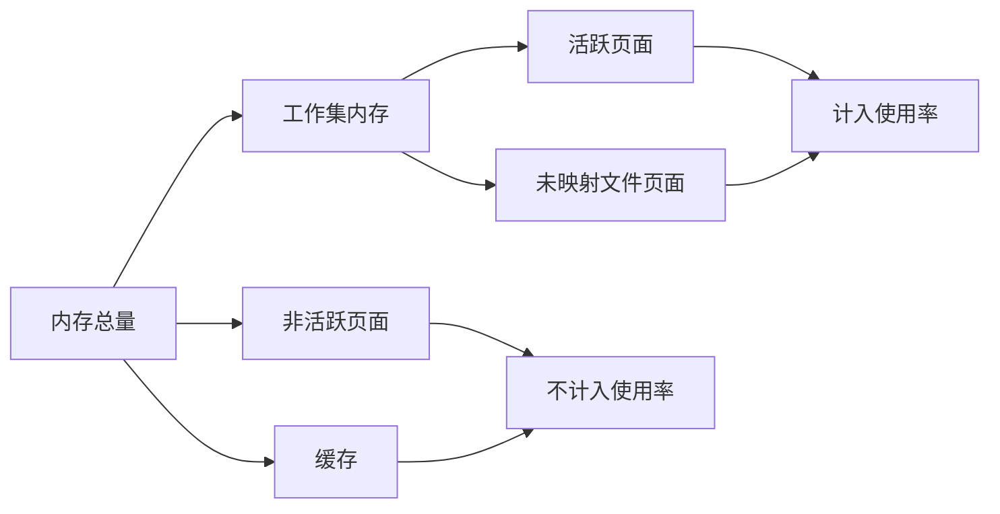
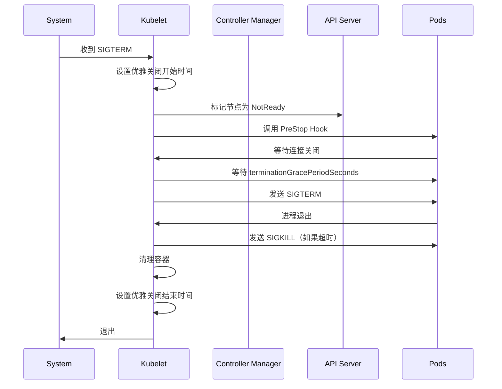

# Kubernetes 监控和指标深度分析

> 本文档深入分析 Kubernetes 的监控和指标体系，包括 Metrics Server 实现、Prometheus 集成、自定义指标 API 和资源使用率计算。

---

## 目录

1. [概览](#概览)
2. [Metrics API 架构](#metrics-api-架构)
3. [Kubelet 指标收集机制](#kubelet-指标收集机制)
4. [Metrics Server 实现](#metrics-server-实现)
5. [Prometheus 集成](#prometheus-集成)
6. [自定义指标 API](#自定义指标-api)
7. [资源使用率计算](#资源使用率计算)
8. [优雅关闭](#优雅关闭)
9. [最佳实践](#最佳实践)

---

## 概览

### 监控体系架构

Kubernetes 的监控体系分为三个层次：



### 三大指标层次

| 指标层次 | API | 提供者 | 用途 |
|---------|-----|--------|------|
| **资源指标** | `metrics.k8s.io` | Metrics Server | HPA 自动扩缩容 |
| **自定义指标** | `custom.metrics.k8s.io` | Prometheus Adapter | 业务指标 HPA |
| **外部指标** | `external.metrics.k8s.io` | 外部系统 | 事件驱动扩缩容 |

### 核心组件



---

## Metrics API 架构

### Metrics API 定义

Kubernetes 通过 `metrics.k8s.io/v1beta1` API 暴露资源使用指标。

**核心类型定义**:

位置: `staging/src/k8s.io/metrics/pkg/apis/metrics/v1beta1/types.go`

```go
// NodeMetrics 设置节点的资源使用指标
type NodeMetrics struct {
    metav1.TypeMeta   `json:",inline"`
    metav1.ObjectMeta `json:"metadata,omitempty"`

    // 指标收集的时间窗口 [Timestamp-Window, Timestamp]
    Timestamp metav1.Time     `json:"timestamp"`
    Window    metav1.Duration `json:"window"`

    // 内存使用量为工作集内存
    Usage v1.ResourceList `json:"usage"`
}

// PodMetrics 设置 Pod 的资源使用指标
type PodMetrics struct {
    metav1.TypeMeta   `json:",inline"`
    metav1.ObjectMeta `json:"metadata,omitempty"`

    Timestamp metav1.Time     `json:"timestamp"`
    Window    metav1.Duration `json:"window"`

    // 所有容器的指标在同一时间窗口内收集
    Containers []ContainerMetrics `json:"containers"`
}

// ContainerMetrics 设置容器的资源使用指标
type ContainerMetrics struct {
    // 容器名称，对应 pod.spec.containers 中的名称
    Name string `json:"name"`

    // 内存使用量为工作集内存
    Usage v1.ResourceList `json:"usage"`
}
```

### API 服务注册

Metrics Server 通过 `APIService` 注册到 Kubernetes API 聚合层：

**位置**: `cluster/addons/metrics-server/metrics-apiservice.yaml`

```yaml
apiVersion: apiregistration.k8s.io/v1
kind: APIService
metadata:
  name: v1beta1.metrics.k8s.io
spec:
  service:
    name: metrics-server
    namespace: kube-system
  group: metrics.k8s.io
  version: v1beta1
  insecureSkipTLSVerify: true
  groupPriorityMinimum: 100
  versionPriority: 100
```

### API 路由流程



---

## Kubelet 指标收集机制

### 指标暴露端点

Kubelet 提供两类指标端点：

1. **Prometheus 格式指标** - `/metrics`
2. **Kubelet Summary API** - `/stats/summary`

### Summary Provider 实现

**位置**: `pkg/kubelet/server/stats/summary.go`

```go
type SummaryProvider interface {
    // Get 提供新的 Summary，包含 Kubelet 的统计信息
    Get(ctx context.Context, updateStats bool) (*statsapi.Summary, error)
    // GetCPUAndMemoryStats 提供仅包含 CPU 和内存的 Summary
    GetCPUAndMemoryStats(ctx context.Context) (*statsapi.Summary, error)
}

// summaryProviderImpl 实现 SummaryProvider 接口
type summaryProviderImpl struct {
    kubeletCreationTime metav1.Time
    systemBootTime      metav1.Time
    provider            Provider
}
```

### Summary 数据结构

```mermaid
graph TD
    A[Summary] --> B[NodeStats]
    A --> C[PodStats[]]

    B --> B1[CPU Usage]
    B --> B2[Memory Usage]
    B --> B3[Network Stats]
    B --> B4[Filesystem Stats]
    B --> B5[Runtime Stats]
    B --> B6[Swap Stats]

    C --> C1[Pod Name]
    C --> C2[Pod UID]
    C --> C3[ContainerStats[]]

    C3 --> C4[Container Name]
    C3 --> C5[CPU Usage]
    C3 --> C6[Memory Usage]
    C3 --> C7[RootFS Usage]
```

### Get 方法实现

```go
func (sp *summaryProviderImpl) Get(ctx context.Context, updateStats bool) (*statsapi.Summary, error) {
    // 1. 获取节点信息
    node, err := sp.provider.GetNode(ctx)
    if err != nil {
        return nil, fmt.Errorf("failed to get node info: %v", err)
    }

    // 2. 获取根 cgroup 的 CPU 和网络统计
    nodeConfig := sp.provider.GetNodeConfig()
    rootStats, networkStats, err := sp.provider.GetCgroupStats("/", updateStats)
    if err != nil {
        return nil, fmt.Errorf("failed to get root cgroup stats: %v", err)
    }

    // 3. 获取文件系统统计
    rootFsStats, err := sp.provider.RootFsStats()
    if err != nil {
        return nil, fmt.Errorf("failed to get rootFs stats: %v", err)
    }

    // 4. 获取镜像文件系统统计
    imageFsStats, containerFsStats, err := sp.provider.ImageFsStats(ctx)
    if err != nil {
        return nil, fmt.Errorf("failed to get imageFs stats: %v", err)
    }

    // 5. 列出 Pod 统计
    var podStats []statsapi.PodStats
    if updateStats {
        podStats, err = sp.provider.ListPodStatsAndUpdateCPUNanoCoreUsage(ctx)
    } else {
        podStats, err = sp.provider.ListPodStats(ctx)
    }
    if err != nil {
        return nil, fmt.Errorf("failed to list pod stats: %v", err)
    }

    // 6. 获取资源限制统计
    rlimit, err := sp.provider.RlimitStats()
    if err != nil {
        return nil, fmt.Errorf("failed to get rlimit stats: %v", err)
    }

    // 7. 构建节点统计
    nodeStats := statsapi.NodeStats{
        NodeName:    node.Name,
        CPU:         rootStats.CPU,
        Memory:      rootStats.Memory,
        Swap:        rootStats.Swap,
        Network:     networkStats,
        StartTime:   sp.systemBootTime,
        Fs:          rootFsStats,
        Runtime:     &statsapi.RuntimeStats{ContainerFs: containerFsStats, ImageFs: imageFsStats},
        Rlimit:      rlimit,
        SystemContainers: sp.GetSystemContainersStats(ctx, nodeConfig, podStats, updateStats),
    }

    // 8. 构建并返回 Summary
    summary := statsapi.Summary{
        Node: nodeStats,
        Pods: podStats,
    }
    return &summary, nil
}
```

### Kubelet 自身指标

**位置**: `pkg/kubelet/metrics/metrics.go`

Kubelet 暴露大量自身的 Prometheus 指标：

| 指标名称 | 类型 | 说明 |
|---------|------|------|
| `kubelet_pod_start_duration_seconds` | Histogram | Pod 启动延迟 |
| `kubelet_pod_worker_duration_seconds` | Histogram | Pod Worker 执行时间 |
| `kubelet_pleg_relist_duration_seconds` | Histogram | PLEG 重列表时间 |
| `kubelet_runtime_operations_total` | Counter | 运行时操作计数 |
| `kubelet_evictions` | Counter | 驱逐计数 |
| `kubelet_volume_stats_capacity_bytes` | Gauge | 卷容量 |
| `kubelet_running_pods` | Gauge | 运行中 Pod 数量 |

### 关键指标详解

#### 1. Pod 启动延迟 SLI

```go
// Pod 启动延迟指标（不包括镜像拉取时间）
PodStartSLIDuration = metrics.NewHistogramVec(
    &metrics.HistogramOpts{
        Subsystem:      KubeletSubsystem,
        Name:           "pod_start_sli_duration_seconds",
        Help:           "Duration in seconds to start a pod, excluding time to pull images",
        Buckets:        podStartupDurationBuckets,
        StabilityLevel: metrics.ALPHA,
    },
    []string{},
)

// Pod 启动延迟指标（包括镜像拉取时间）
PodStartTotalDuration = metrics.NewHistogramVec(
    &metrics.HistogramOpts{
        Subsystem:      KubeletSubsystem,
        Name:           "pod_start_total_duration_seconds",
        Help:           "Duration in seconds to start a pod since creation, including time to pull images",
        Buckets:        podStartupDurationBuckets,
        StabilityLevel: metrics.ALPHA,
    },
    []string{},
)
```

#### 2. 镜像拉取延迟

```go
// 镜像拉取延迟（按镜像大小分桶）
ImagePullDuration = metrics.NewHistogramVec(
    &metrics.HistogramOpts{
        Subsystem:      KubeletSubsystem,
        Name:           "image_pull_duration_seconds",
        Help:           "Duration in seconds to pull an image.",
        Buckets:        imagePullDurationBuckets,
        StabilityLevel: metrics.ALPHA,
    },
    []string{"image_size_in_bytes"},
)
```

#### 3. 资源管理器指标

```go
// CPU 管理器独占 CPU 分配计数
CPUManagerExclusiveCPUsAllocationCount = metrics.NewGauge(
    &metrics.GaugeOpts{
        Subsystem:      KubeletSubsystem,
        Name:           "cpu_manager_exclusive_cpu_allocation_count",
        Help:           "The total number of CPUs exclusively allocated to containers",
        StabilityLevel: metrics.ALPHA,
    },
)

// 内存管理器 Pinning 请求计数
MemoryManagerPinningRequestTotal = metrics.NewCounter(
    &metrics.CounterOpts{
        Subsystem:      KubeletSubsystem,
        Name:           "memory_manager_pinning_requests_total",
        Help:           "The number of memory pages allocations which required pinning.",
        StabilityLevel: metrics.ALPHA,
    },
)
```

### HTTP 指标端点

**位置**: `pkg/kubelet/server/metrics/metrics.go`

```go
// HTTP 请求计数器
HTTPRequests = metrics.NewCounterVec(
    &metrics.CounterOpts{
        Subsystem:      kubeletSubsystem,
        Name:           "http_requests_total",
        Help:           "Number of the http requests received since the server started",
        StabilityLevel: metrics.ALPHA,
    },
    []string{"method", "path", "server_type", "long_running"},
)

// HTTP 请求延迟直方图
HTTPRequestsDuration = metrics.NewHistogramVec(
    &metrics.HistogramOpts{
        Subsystem:      kubeletSubsystem,
        Name:           "http_requests_duration_seconds",
        Help:           "Duration in seconds to serve http requests",
        Buckets:        metrics.DefBuckets,
        StabilityLevel: metrics.ALPHA,
    },
    []string{"method", "path", "server_type", "long_running"},
)

// HTTP 进行中请求计数器
HTTPInflightRequests = metrics.NewGaugeVec(
    &metrics.GaugeOpts{
        Subsystem:      kubeletSubsystem,
        Name:           "http_inflight_requests",
        Help:           "Number of the inflight http requests",
        StabilityLevel: metrics.ALPHA,
    },
    []string{"method", "path", "server_type", "long_running"},
)
```

### Stats Provider 实现

Stats Provider 负责从底层运行时收集统计信息：

```go
// Provider 提供统计信息的接口
type Provider interface {
    // 获取节点信息
    GetNode(ctx context.Context) (*v1.Node, error)

    // 获取节点配置
    GetNodeConfig() NodeConfig

    // 获取根 cgroup 统计
    GetCgroupStats(cgroup string, updateStats bool) (*statsapi.CPUStats, *statsapi.NetworkStats, error)

    // 获取 CPU 和内存统计
    GetCgroupCPUAndMemoryStats(cgroup string, updateStats bool) (*statsapi.CPUStats, *statsapi.MemoryStats, error)

    // 获取根文件系统统计
    RootFsStats() (*statsapi.FsStats, error)

    // 获取镜像文件系统统计
    ImageFsStats(ctx context.Context) (*statsapi.FsStats, *statsapi.FsStats, error)

    // 列出 Pod 统计
    ListPodStats(ctx context.Context) ([]statsapi.PodStats, error)

    // 列出 Pod 统计并更新 CPU 纳秒核心使用量
    ListPodStatsAndUpdateCPUNanoCoreUsage(ctx context.Context) ([]statsapi.PodStats, error)

    // 获取资源限制统计
    RlimitStats() (*statsapi.RlimitStats, error)
}
```

---

## Metrics Server 实现

### Metrics Server 架构

Metrics Server 是 Kubernetes 集群的核心监控组件，负责：

1. 从 Kubelet 收集容器指标
2. 聚合和存储指标数据
3. 通过 Metrics API 暴露指标



### 部署配置

**位置**: `cluster/addons/metrics-server/metrics-server-deployment.yaml`

```yaml
apiVersion: apps/v1
kind: Deployment
metadata:
  name: metrics-server-v0.8.0
  namespace: kube-system
spec:
  selector:
    matchLabels:
      k8s-app: metrics-server
  template:
    spec:
      priorityClassName: system-cluster-critical
      serviceAccountName: metrics-server
      nodeSelector:
        kubernetes.io/os: linux
      containers:
      - name: metrics-server
        image: registry.k8s.io/metrics-server/metrics-server:v0.8.0
        command:
        - /metrics-server
        - --metric-resolution=15s                      # 指标分辨率
        - --kubelet-use-node-status-port               # 使用 Kubelet 状态端口
        - --kubelet-insecure-tls                       # 跳过 TLS 验证（测试环境）
        - --kubelet-preferred-address-types=InternalIP,Hostname,InternalDNS,ExternalDNS,ExternalIP
        - --cert-dir=/tmp
        - --secure-port=10250
        ports:
        - containerPort: 10250
          name: https
          protocol: TCP
        readinessProbe:
          httpGet:
            path: /readyz
            port: https
            scheme: HTTPS
        livenessProbe:
          httpGet:
            path: /livez
            port: https
            scheme: HTTPS
```

### 关键参数说明

| 参数 | 说明 | 推荐值 |
|------|------|--------|
| `--metric-resolution` | 指标收集间隔 | 15s（默认） |
| `--kubelet-use-node-status-port` | 使用 Kubelet 状态端口（10250） | true |
| `--kubelet-insecure-tls` | 跳过 TLS 验证 | 生产环境应配置证书 |
| `--kubelet-preferred-address-types` | Kubelet 地址类型优先级 | InternalIP,Hostname |
| `--secure-port` | Metrics Server HTTPS 端口 | 10250 |

### Metrics Server 工作流程



### 缓存策略

Metrics Server 使用缓存来减少对 Kubelet 的请求：



### 资源自适应

Metrics Server 包含一个 `nanny` 容器，根据集群规模自动调整资源：

```yaml
- name: metrics-server-nanny
  image: registry.k8s.io/autoscaling/addon-resizer:1.8.20
  command:
  - /pod_nanny
  - --config-dir=/etc/config
  - --cpu={{ base_metrics_server_cpu }}
  - --extra-cpu=0.5m
  - --memory={{ base_metrics_server_memory }}
  - --extra-memory={{ metrics_server_memory_per_node }}Mi
  - --threshold=5
  - --deployment=metrics-server-v0.8.0
  - --container=metrics-server
  - --poll-period=30000
  - --estimator=exponential
  - --minClusterSize={{ metrics_server_min_cluster_size }}
  - --use-metrics=true
```

### Service 配置

**位置**: `cluster/addons/metrics-server/metrics-server-service.yaml`

```yaml
apiVersion: v1
kind: Service
metadata:
  name: metrics-server
  namespace: kube-system
  labels:
    kubernetes.io/cluster-service: "true"
    addonmanager.kubernetes.io/mode: Reconcile
spec:
  selector:
    k8s-app: metrics-server
  ports:
  - port: 443
    protocol: TCP
    targetPort: https
```

---

## Prometheus 集成

### Prometheus Operator

Prometheus Operator 是管理 Prometheus 的最常用方式：

```yaml
apiVersion: monitoring.coreos.com/v1
kind: Prometheus
metadata:
  name: prometheus
  namespace: monitoring
spec:
  replicas: 2
  resources:
    requests:
      memory: 400Mi
  serviceAccountName: prometheus
  serviceMonitorSelector:
    matchLabels:
      release: prometheus
```

### ServiceMonitor

ServiceMonitor 定义 Prometheus 如何抓取指标：

```yaml
apiVersion: monitoring.coreos.com/v1
kind: ServiceMonitor
metadata:
  name: kubelet
  namespace: monitoring
spec:
  selector:
    matchLabels:
      k8s-app: kubelet
  endpoints:
  - port: https-metrics
    interval: 30s
    scheme: https
    tlsConfig:
      insecureSkipVerify: true
```

### Kubelet ServiceMonitor

```yaml
apiVersion: v1
kind: Service
metadata:
  name: kubelet
  namespace: kube-system
  labels:
    k8s-app: kubelet
spec:
  type: ClusterIP
  ports:
  - name: https-metrics
    port: 10250
    targetPort: 10250
    protocol: TCP
```

### 常用 PromQL 查询

#### 1. Pod CPU 使用率

```sql
sum(rate(container_cpu_usage_seconds_total{image!="", pod="<pod-name>"}[5m])) by (pod)
```

#### 2. Node CPU 使用率

```sql
sum(rate(node_cpu_seconds_total{mode!="idle"}[5m])) by (instance)
```

#### 3. Pod 内存使用量

```sql
sum(container_memory_working_set_bytes{image!="", pod="<pod-name>"}) by (pod)
```

#### 4. Pod 网络流量

```sql
sum(rate(container_network_receive_bytes_total{pod="<pod-name>"}[5m])) by (pod)
sum(rate(container_network_transmit_bytes_total{pod="<pod-name>"}[5m])) by (pod)
```

#### 5. 集群资源使用率

```sql
# 集群 CPU 使用率
sum(rate(container_cpu_usage_seconds_total{image!=""}[5m])) /
sum(kube_node_status_capacity{resource="cpu"})

# 集群内存使用率
sum(container_memory_working_set_bytes{image!=""}) /
sum(kube_node_status_capacity{resource="memory"})
```

### Prometheus 告警规则

```yaml
apiVersion: monitoring.coreos.com/v1
kind: PrometheusRule
metadata:
  name: k8s-alerts
  namespace: monitoring
spec:
  groups:
  - name: kubernetes-resources
    rules:
    - alert: PodCPUUsageHigh
      expr: sum(rate(container_cpu_usage_seconds_total{image!=""}[5m])) by (pod) > 0.8
      for: 5m
      labels:
        severity: warning
      annotations:
        summary: "Pod {{ $labels.pod }} CPU usage is high"
        description: "Pod {{ $labels.pod }} CPU usage is above 80% for 5 minutes"

    - alert: NodeMemoryUsageHigh
      expr: sum(container_memory_working_set_bytes{image!="", device=~".+"}) by (instance) / sum(node_memory_MemTotal_bytes) by (instance) > 0.9
      for: 5m
      labels:
        severity: critical
      annotations:
        summary: "Node {{ $labels.instance }} memory usage is high"
        description: "Node {{ $labels.instance }} memory usage is above 90% for 5 minutes"
```

---

## 自定义指标 API

### Prometheus Adapter

Prometheus Adapter 将 Prometheus 指标暴露为 Kubernetes 自定义指标 API：

```yaml
apiVersion: apiregistration.k8s.io/v1
kind: APIService
metadata:
  name: v1beta1.custom.metrics.k8s.io
spec:
  service:
    name: prometheus-adapter
    namespace: monitoring
  group: custom.metrics.k8s.io
  version: v1beta1
  groupPriorityMinimum: 100
  versionPriority: 100
```

### 自定义指标规则

```yaml
apiVersion: monitoring.coreos.com/v1
kind: PrometheusRule
metadata:
  name: custom-metrics
  namespace: monitoring
spec:
  groups:
  - name: custom-metrics
    rules:
    # HTTP 请求数
    - record: http_requests_total
      expr: sum(rate(http_requests_total[5m])) by (namespace, pod)

    # HTTP 错误率
    - record: http_errors_rate
      expr: sum(rate(http_requests_total{status=~"5.."}[5m])) by (namespace, pod)

    # 消息队列长度
    - record: queue_length
      expr: rabbitmq_queue_messages
```

### Adapter 配置

```yaml
apiVersion: v1
kind: ConfigMap
metadata:
  name: prometheus-adapter-config
  namespace: monitoring
data:
  config.yaml: |
    resourceRules:
      - cpu:
          containerQuery: sum(rate(container_cpu_usage_seconds_total{<<.LabelMatchers>>}[1m])) by (<<.GroupBy>>)
          containerLabel: container
          nodeQuery: sum(rate(container_cpu_usage_seconds_total{<<.LabelMatchers>>}[1m])) by (<<.GroupBy>>)
          resources:
            overrides:
              node:
                resource: node
              pod:
                resource: pod
              namespace:
                resource: namespace
      - memory:
          containerQuery: sum(container_memory_working_set_bytes{<<.LabelMatchers>>}) by (<<.GroupBy>>)
          containerLabel: container
          nodeQuery: sum(container_memory_working_set_bytes{<<.LabelMatchers>>}) by (<<.GroupBy>>)
          resources:
            overrides:
              node:
                resource: node
              pod:
                resource: pod
              namespace:
                resource: namespace

    externalRules:
    - seriesQuery: '{__name__=~"^http_.*"}'
      resources:
        overrides:
          namespace:
            resource: namespace
          pod:
            resource: pod
      metricsQuery: sum(<<.Series>>{<<.LabelMatchers>>}) by (<<.GroupBy>>)
```

### 使用自定义指标的 HPA

```yaml
apiVersion: autoscaling/v2
kind: HorizontalPodAutoscaler
metadata:
  name: web-app-hpa
  namespace: default
spec:
  scaleTargetRef:
    apiVersion: apps/v1
    kind: Deployment
    name: web-app
  minReplicas: 2
  maxReplicas: 10
  metrics:
  - type: Pods
    pods:
      metric:
        name: http_requests_per_second
      target:
        type: AverageValue
        averageValue: 100
  - type: Resource
    resource:
      name: cpu
      target:
        type: Utilization
        averageUtilization: 50
```

---

## 资源使用率计算

### 内存计算

Kubernetes 使用**工作集内存**（Working Set Memory）来计算内存使用率：



工作集内存计算公式：

```
工作集内存 = active_memory + inactive_memory + file_mapped
```

### CPU 计算模式

Kubernetes 支持两种 CPU 计算模式：

#### 1. cAdvisor 模式（传统）

- 读取 `/sys/fs/cgroup/cpuacct/cpuacct.usage`
- 计算容器累计 CPU 时间
- 需要定期读取 `/proc/stat`

#### 2. CRI 模式（推荐）

- 通过 CRI 接口获取 CPU 统计
- 不需要读取 cgroup 文件
- 性能更好

```go
// 设置指标提供者
func SetMetricsProvider(provider MetricsProviderType) {
    MetricsProvider.Reset()
    MetricsProvider.WithLabelValues(string(provider)).Set(1)
}
```

### 资源请求 vs 使用率

| 指标 | 说明 | 用途 |
|------|------|------|
| `request` | 资源请求量 | 调度和 QoS |
| `usage` | 实际使用量 | 监控和 HPA |
| `limit` | 资源上限 | 资源隔离 |

### 使用率计算示例

```bash
# 获取 Pod 资源使用
kubectl top pod <pod-name> --containers

# 输出示例
NAME         CPU(cores)   MEMORY(bytes)
my-app       250m         128Mi
```

使用率计算：

```bash
# CPU 使用率 = 实际使用 / 请求量
CPU 使用率 = 250m / 500m = 50%

# 内存使用率 = 实际使用 / 请求量
内存使用率 = 128Mi / 256Mi = 50%
```

---

## 优雅关闭

### 优雅关闭流程



### 优雅关闭指标

```go
// 优雅关闭开始时间
GracefulShutdownStartTime = metrics.NewGauge(
    &metrics.GaugeOpts{
        Subsystem:      KubeletSubsystem,
        Name:           "graceful_shutdown_start_time_seconds",
        Help:           "Last graceful shutdown start time since unix epoch in seconds",
        StabilityLevel: metrics.ALPHA,
    },
)

// 优雅关闭结束时间
GracefulShutdownEndTime = metrics.NewGauge(
    &metrics.GaugeOpts{
        Subsystem:      KubeletSubsystem,
        Name:           "graceful_shutdown_end_time_seconds",
        Help:           "Last graceful shutdown end time since unix epoch in seconds",
        StabilityLevel: metrics.ALPHA,
    },
)
```

### 基于 Pod 优先级的优雅关闭

当启用了 `GracefulNodeShutdownBasedOnPodPriority` 特性门控时：

```yaml
apiVersion: kubeadm.k8s.io/v1beta3
kind: ClusterConfiguration
apiServer:
  extraArgs:
    feature-gates: GracefulNodeShutdown=true,GracefulNodeShutdownBasedOnPodPriority=true
```

关闭顺序：

1. 低优先级 Pod
2. 中优先级 Pod
3. 高优先级 Pod

### 优雅关闭配置

```yaml
apiVersion: kubelet.config.k8s.io/v1beta1
kind: KubeletConfiguration
shutdownGracePeriod: 60s        # 总优雅关闭时间
shutdownGracePeriodCriticalPods: 20s  # 关键 Pod 保留时间
```

---

## 最佳实践

### 1. 监控指标选择

#### 必须监控的指标

| 指标类别 | 关键指标 | 阈值 |
|---------|---------|------|
| **节点** | CPU 使用率 | > 85% 告警 |
| **节点** | 内存使用率 | > 90% 告警 |
| **节点** | 磁盘使用率 | > 80% 告警 |
| **Pod** | 重启次数 | > 3/h 告警 |
| **Pod** | CPU 使用率 | > 80% 告警 |
| **Pod** | OOM Kill | 立即告警 |

#### 业务指标

| 指标类型 | 示例 | 监控方式 |
|---------|------|---------|
| **延迟** | P95/P99 延迟 | Prometheus |
| **吞吐量** | QPS/TPS | Prometheus |
| **错误率** | 5xx 错误率 | Prometheus |
| **队列** | 消息队列长度 | 自定义指标 |

### 2. Metrics Server 配置建议

#### 生产环境配置

```yaml
# 使用 TLS 证书
- --kubelet-certificate-authority=/var/run/secrets/kubernetes.io/serviceaccount/ca.crt
- --kubelet-client-certificate=/var/run/secrets/kubernetes.io/kubelet/client.crt
- --kubelet-client-key=/var/run/secrets/kubernetes.io/kubelet/client.key

# 调整指标分辨率
- --metric-resolution=30s  # 降低分辨率减少负载

# 启用节点状态端口
- --kubelet-use-node-status-port=true
```

#### 大规模集群优化

```yaml
# 调整副本数
replicas: 3

# 增加资源
resources:
  requests:
    cpu: 200m
    memory: 500Mi
  limits:
    cpu: 500m
    memory: 1Gi

# 启用缓存
- --metric-resolution=60s
```

### 3. Prometheus 配置建议

#### 存储配置

```yaml
apiVersion: v1
kind: PersistentVolumeClaim
metadata:
  name: prometheus-storage
  namespace: monitoring
spec:
  accessModes:
  - ReadWriteOnce
  resources:
    requests:
      storage: 100Gi  # 根据数据保留期调整
  storageClassName: fast-ssd
```

#### 数据保留期

```yaml
spec:
  retention: 15d  # 保留 15 天数据
  walCompression: true  # 启用 WAL 压缩
```

#### 抓取间隔

```yaml
scrape_configs:
- job_name: 'kubelet'
  scrape_interval: 30s  # Kubelet 指标
  scrape_timeout: 10s

- job_name: 'node-exporter'
  scrape_interval: 15s  # 节点指标
  scrape_timeout: 10s
```

### 4. 告警规则建议

#### 分级告警

```yaml
# P0 - 立即处理
- alert: NodeDown
  expr: up{job="node-exporter"} == 0
  for: 1m
  labels:
    severity: critical
    priority: P0

# P1 - 1 小时内处理
- alert: NodeCPUHigh
  expr: sum(rate(node_cpu_seconds_total{mode!="idle"}[5m])) by (instance) > 0.9
  for: 10m
  labels:
    severity: warning
    priority: P1

# P2 - 1 天内处理
- alert: DiskSpaceLow
  expr: node_filesystem_avail_bytes{mountpoint="/"} / node_filesystem_size_bytes < 0.2
  for: 1h
  labels:
    severity: info
    priority: P2
```

### 5. HPA 配置建议

#### 多指标 HPA

```yaml
apiVersion: autoscaling/v2
kind: HorizontalPodAutoscaler
metadata:
  name: multi-metric-hpa
spec:
  scaleTargetRef:
    apiVersion: apps/v1
    kind: Deployment
    name: my-app
  minReplicas: 2
  maxReplicas: 10
  behavior:
    scaleDown:
      stabilizationWindowSeconds: 300
      policies:
      - type: Percent
        value: 50
        periodSeconds: 60
    scaleUp:
      stabilizationWindowSeconds: 0
      policies:
      - type: Percent
        value: 100
        periodSeconds: 15
      - type: Pods
        value: 4
        periodSeconds: 15
      selectPolicy: Max
  metrics:
  # CPU 指标
  - type: Resource
    resource:
      name: cpu
      target:
        type: Utilization
        averageUtilization: 70
  # 内存指标
  - type: Resource
    resource:
      name: memory
      target:
        type: Utilization
        averageUtilization: 80
  # 自定义指标
  - type: Pods
    pods:
      metric:
        name: requests_per_second
      target:
        type: AverageValue
        averageValue: 1000
```

### 6. 故障排查

#### Metrics Server 问题

```bash
# 检查 Metrics Server Pod
kubectl get pods -n kube-system -l k8s-app=metrics-server

# 查看 Metrics Server 日志
kubectl logs -n kube-system -l k8s-app=metrics-server

# 测试 Metrics API
kubectl get --raw /apis/metrics.k8s.io/v1beta1/nodes
kubectl get --raw /apis/metrics.k8s.io/v1beta1/pods

# 查看 kubectl top 输出
kubectl top nodes
kubectl top pods
```

#### Prometheus 问题

```bash
# 检查 Prometheus Pod
kubectl get pods -n monitoring -l app=prometheus

# 查看 Prometheus 配置
kubectl get configmap -n monitoring prometheus-config -o yaml

# 检查 ServiceMonitor
kubectl get servicemonitor -A

# 查看 Prometheus 目标
kubectl port-forward -n monitoring svc/prometheus 9090:9090
# 浏览器打开 http://localhost:9090/targets
```

#### 自定义指标问题

```bash
# 检查 Prometheus Adapter
kubectl get pods -n monitoring -l name=prometheus-adapter

# 查看 Adapter 日志
kubectl logs -n monitoring -l name=prometheus-adapter

# 测试自定义指标 API
kubectl get --raw /apis/custom.metrics.k8s.io/v1beta1/namespaces/default/pods/*/http_requests_per_second

# 查看 Adapter 配置
kubectl get configmap -n monitoring prometheus-adapter-config -o yaml
```

### 7. 性能优化

#### Metrics Server 优化

```yaml
# 增加副本数
replicas: 3

# 调整指标分辨率
- --metric-resolution=60s

# 启用缓存
- --metric-gc-interval=60s
```

#### Prometheus 优化

```yaml
# 启用 WAL 压缩
walCompression: true

# 启用查询并发
spec:
  queryConcurrency: 20

# 调整存储块大小
storage:
  tsdb:
    retentionTime: 15d
    headChunksWriteQueueSize: 2000
```

### 8. 安全最佳实践

#### TLS 配置

```yaml
# Metrics Server 使用 TLS
- --kubelet-certificate-authority=/etc/kubernetes/pki/ca.crt
- --kubelet-client-certificate=/etc/kubernetes/pki/metrics-server.crt
- --kubelet-client-key=/etc/kubernetes/pki/metrics-server.key

# Prometheus 使用 TLS
spec:
  externalLabels:
    cluster: production
  storage:
    tsdb:
      path: /prometheus
  securityContext:
    runAsUser: 1000
    runAsGroup: 1000
    fsGroup: 1000
```

#### RBAC 配置

```yaml
apiVersion: v1
kind: ServiceAccount
metadata:
  name: prometheus
  namespace: monitoring
---
apiVersion: rbac.authorization.k8s.io/v1
kind: ClusterRole
metadata:
  name: prometheus
rules:
- apiGroups: [""]
  resources: ["nodes", "nodes/metrics", "pods", "services"]
  verbs: ["get", "list", "watch"]
- nonResourceURLs: ["/metrics"]
  verbs: ["get"]
---
apiVersion: rbac.authorization.k8s.io/v1
kind: ClusterRoleBinding
metadata:
  name: prometheus
roleRef:
  apiGroup: rbac.authorization.k8s.io
  kind: ClusterRole
  name: prometheus
subjects:
- kind: ServiceAccount
  name: prometheus
  namespace: monitoring
```

---

## 总结

### 核心要点

1. **Metrics Server** 提供 Kubernetes 原生资源指标（CPU、内存），是 HPA 的基础
2. **Prometheus** 提供强大的监控和告警能力，支持自定义指标
3. **自定义指标 API** 通过 Prometheus Adapter 实现业务指标 HPA
4. **Kubelet** 是所有指标的数据源，提供 Summary API 和 Prometheus 格式指标
5. **优雅关闭** 指标帮助追踪节点关闭过程，确保服务平滑退出

### 关键路径

```
Kubelet (/stats/summary) → Metrics Server → Metrics API → HPA
Kubelet (/metrics) → Prometheus → Prometheus Adapter → Custom Metrics API → HPA
```

### 推荐阅读

- [Kubernetes Monitoring Architecture](https://kubernetes.io/docs/tasks/debug/debug-cluster/resource-usage-monitoring/)
- [Metrics Server Documentation](https://github.com/kubernetes-sigs/metrics-server)
- [Prometheus Operator](https://prometheus-operator.dev/)
- [Prometheus Adapter](https://github.com/kubernetes-sigs/prometheus-adapter)

---

**文档版本**：v1.0
**创建日期**：2026-03-04
**维护者**：AI Assistant
**Kubernetes 版本**：v1.28+
