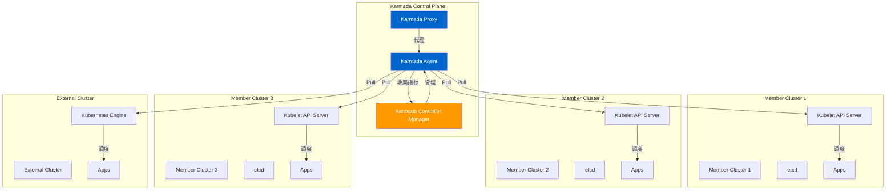
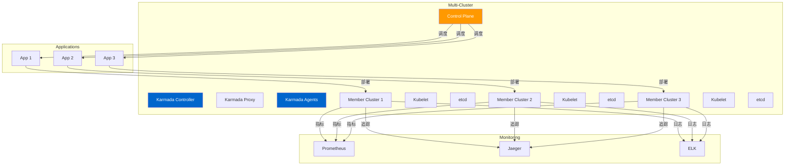
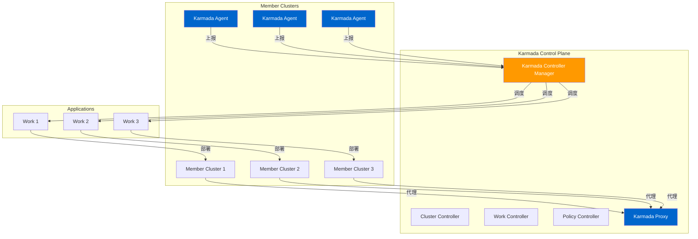
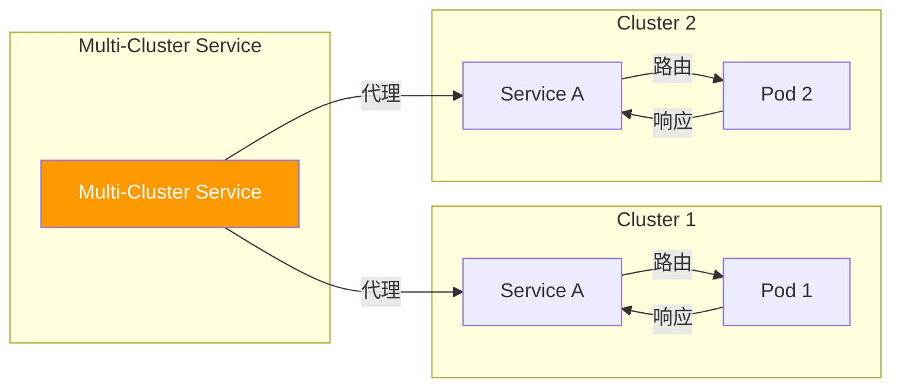

# Multi-Cluster (karmada/vcluster) 深度分析

> 本文档深入分析 Kubernetes 多集群管理，包括 Karmada 和 vcluster 架构、跨集群调度、服务发现、策略管理和可观测性。

---

## 目录

1. [Multi-Cluster 概述](#multi-cluster-概述)
2. [Multi-Cluster 架构](#multi-cluster-架构)
3. [Karmada 架构](#karmada-架构)
4. [vcluster 架构](#vcluster-架构)
5. [跨集群调度](#跨集群调度)
6. [跨集群服务发现](#跨集群服务发现)
7. [跨集群策略和迁移](#跨集群策略和迁移)
8. [跨集群监控和可观测性](#跨集群监控和可观测性)
9. [故障排查](#故障排查)
10. [最佳实践](#最佳实践)

---

## Multi-Cluster 概述

### Multi-Cluster 的作用

Multi-Cluster 是管理和协调多个 Kubernetes 集群的基础设施：



### Multi-Cluster 的核心特性

| 特性 | 说明 |
|------|------|
| **统一控制平面**：通过单一控制平面管理多个集群 |
| **跨集群调度**：自动将应用调度到最优集群 |
| **跨集群服务发现**：支持跨集群的服务调用 |
| **策略管理**：统一的策略和配置管理 |
| **故障转移**：跨集群的故障转移和恢复 |
| **可观测性**：统一的监控、追踪和日志 |

### Multi-Cluster 的价值

- **高可用**：跨集群部署提升应用可用性
- **负载均衡**：跨集群资源利用和负载均衡
- **灾难恢复**：跨集群故障转移和恢复
- **弹性伸缩**：按需扩缩容集群资源
- **统一管理**：统一的配置和策略管理

---

## Multi-Cluster 架构

### 整体架构



### 核心组件

#### 1. Control Plane

**位置**：`karmada.io/karmada/cmd/controller-manager`

Control Plane 是多集群管理的核心组件：

```go
// ControllerManager 控制器管理器
type ControllerManager struct {
    // KubeClient Kubernetes 客户端
    KubeClient karmadaclientset.Interface

    // InformerLister
    ClusterInformer clusterv1lister.ClusterLister
    WorkInformer workv1lister.WorkLister

    // Controllers
    ClusterController *cluster.ClusterController
    WorkController *work.WorkController
}

// Start 启动控制器管理器
func (cm *ControllerManager) Start(ctx context.Context) error {
    // 1. 启动 Cluster Controller
    if err := cm.ClusterController.Start(ctx); err != nil {
        return err
    }

    // 2. 启动 Work Controller
    if err := cm.WorkController.Start(ctx); err != nil {
        return err
    }

    // 3. 启动其他控制器
    if err := cm.startControllers(ctx); err != nil {
        return err
    }

    return nil
}
```

#### 2. Karmada Agent

**位置**：`karmada.io/karmada/cmd/agent`

Karmada Agent 运行在成员集群中，与控制平面通信：

```go
// Agent Agent
type Agent struct {
    // KubeClient 成员集群客户端
    KubeClient kubernetes.Interface

    // ControlPlaneClient 控制平面客户端
    ControlPlaneClient karmadaclientset.Interface

    // ControllerManager 控制器管理器
    ControllerManager *controller.ControllerManager

    // StopCh 停止通道
    StopCh chan struct{}
}

// Run 运行 Agent
func (a *Agent) Run(ctx context.Context) error {
    // 1. 启动本地控制器管理器
    if err := a.ControllerManager.Start(ctx); err != nil {
        return err
    }

    // 2. 启动与控制平面的通信
    go a.startUpstream(ctx)

    // 3. 等待停止信号
    <-ctx.Done()

    return nil
}
```

---

## Karmada 架构

### 整体架构



### 核心组件

#### 1. Work Controller

**位置**：`karmada.io/karmada/pkg/workcontroller`

Work Controller 管理跨集群的应用部署：

```go
// WorkController Work 控制器
type WorkController struct {
    // KubeClient Kubernetes 客户端
    KubeClient karmadaclientset.Interface

    // InformerLister
    WorkInformer workv1lister.WorkLister
    ClusterInformer clusterv1lister.ClusterLister

    // WorkQueue 工作队列
    WorkQueue workqueue.RateLimitingInterface
}

// reconcile 协调 Work
func (w *WorkController) reconcile(ctx context.Context, key string) error {
    // 1. 获取 Work
    namespace, name, err := cache.SplitMetaNamespaceKey(key)
    if err != nil {
        return err
    }

    work, err := w.WorkLister.Works(namespace).Get(name)
    if err != nil {
        return err
    }

    // 2. 获取目标集群
    clusters, err := w.getClustersForWork(work)
    if err != nil {
        return err
    }

    // 3. 分发 Work 到集群
    for _, cluster := range clusters {
        if err := w.distributeWorkToCluster(ctx, work, cluster); err != nil {
            return err
        }
    }

    // 4. 更新 Work 状态
    if err := w.updateWorkStatus(work); err != nil {
        return err
    }

    return nil
}
```

#### 2. Cluster Controller

**位置**：`karmada.io/karmada/pkg/clustercontroller`

Cluster Controller 管理成员集群的生命周期：

```go
// ClusterController 集群控制器
type ClusterController struct {
    // KubeClient Kubernetes 客户端
    KubeClient karmadaclientset.Interface

    // InformerLister
    ClusterInformer clusterv1lister.ClusterLister

    // ClusterQueue 集群队列
    ClusterQueue workqueue.RateLimitingInterface
}

// reconcile 协调 Cluster
func (c *ClusterController) reconcile(ctx context.Context, key string) error {
    // 1. 获取 Cluster
    namespace, name, err := cache.SplitMetaNamespaceKey(key)
    if err != nil {
        return err
    }

    cluster, err := c.ClusterLister.Clusters(namespace).Get(name)
    if err != nil {
        return err
    }

    // 2. 连接到成员集群
    if err := c.connectToCluster(ctx, cluster); err != nil {
        return err
    }

    // 3. 安装 Karmada Agent
    if err := c.installAgent(ctx, cluster); err != nil {
        return err
    }

    // 4. 更新 Cluster 状态
    if err := c.updateClusterStatus(cluster); err != nil {
        return err
    }

    return nil
}
```

---

## vcluster 架构

### 整体架构

```mermaid
graph TB
    subgraph "Host Cluster"
        HC[Host Cluster]
            VK[vcluster Namespace]
                VC[vcluster Virtual Cluster]
                    VC1[Virtual API Server]
                    VE1[Virtual etcd]
                    VK1[Virtual Kubelet]
                VP[vcluster Pod]
        end
    end

    subgraph "Applications"
        APP1[App 1]
        APP2[App 2]
    end

    APP1 -->|部署| VK
    APP2 -->|部署| VK

    VK -->|管理| VC

    VC1 -->|调度| VK1
    VK1 -->|管理| VE1
    VK1 -->|运行| VP

    style VK fill:#ff9900,color:#fff
    style VC fill:#0066cc,color:#fff
```

### 核心组件

#### 1. vcluster Controller

**位置**：`github.com/loft-sh/vcluster/pkg/controller`

vcluster Controller 管理虚拟集群的生命周期：

```go
// VirtualClusterController 虚拟集群控制器
type VirtualClusterController struct {
    // HostClient 宿主集群客户端
    HostClient kubernetes.Interface

    // VirtualClient 虚拟集群客户端
    VirtualClient kubernetes.Interface

    // InformerLister
    VirtualClusterInformer vcv1lister.VirtualClusterLister
}

// reconcile 协调 VirtualCluster
func (v *VirtualClusterController) reconcile(ctx context.Context, key string) error {
    // 1. 获取 VirtualCluster
    namespace, name, err := cache.SplitMetaNamespaceKey(key)
    if err != nil {
        return err
    }

    vc, err := v.VirtualClusterLister.VirtualClusters(namespace).Get(name)
    if err != nil {
        return err
    }

    // 2. 创建虚拟集群
    if err := v.createVirtualCluster(ctx, vc); err != nil {
        return err
    }

    // 3. 创建虚拟 API Server
    if err := v.createVirtualAPIServer(ctx, vc); err != nil {
        return err
    }

    // 4. 创建虚拟 Kubelet
    if err := v.createVirtualKubelet(ctx, vc); err != nil {
        return err
    }

    return nil
}
```

---

## 跨集群调度

### 调度策略

```mermaid
sequenceDiagram
    participant U as User
    participant KC as Karmada Controller
    participant MC1 as Member Cluster 1
    participant MC2 as Member Cluster 2
    participant MC3 as Member Cluster 3

    U->>KC: 1. 创建 Work
    KC->>KC: 2. 调度 Work
    KC->>MC1: 3. 分发 Work
    KC->>MC2: 4. 分发 Work
    KC->>MC3: 5. 分发 Work
    MC1-->>KC: 6. Work 已调度
    MC2-->>KC: 7. Work 已调度
    MC3-->>KC: 8. Work 已调度
    KC-->>U: 9. Work 已调度

    style KC fill:#ff9900,color:#fff
```

### 调度算法

```go
// Scheduler 调度器
type Scheduler struct {
    // ClusterInformer 集群 Informer
    ClusterInformer clusterv1lister.ClusterLister

    // ClusterScore 集群评分
    ClusterScore *clusterscore.ClusterScore
}

// Schedule 调度 Work
func (s *Scheduler) Schedule(ctx context.Context, work *workv1.Work) (*clusterv1.Cluster, error) {
    // 1. 获取可用集群
    clusters, err := s.getAvailableClusters(ctx, work)
    if err != nil {
        return nil, err
    }

    // 2. 评分集群
    scores, err := s.ClusterScore.Score(clusters, work)
    if err != nil {
        return nil, err
    }

    // 3. 选择最优集群
    cluster, err := s.selectBestCluster(clusters, scores)
    if err != nil {
        return nil, err
    }

    return cluster, nil
}

// getAvailableClusters 获取可用集群
func (s *Scheduler) getAvailableClusters(ctx context.Context, work *workv1.Work) ([]*clusterv1.Cluster, error) {
    var clusters []*clusterv1.Cluster

    // 1. 获取所有集群
    clusterList, err := s.ClusterInformer.List(labels.Everything())
    if err != nil {
        return nil, err
    }

    // 2. 过滤可用集群
    for _, cluster := range clusterList {
        // 检查集群状态
        if !isClusterReady(cluster) {
            continue
        }

        // 检查资源是否足够
        if !hasEnoughResources(cluster, work) {
            continue
        }

        clusters = append(clusters, cluster)
    }

    return clusters, nil
}
```

### 跨集群调度实现

```go
// distributeWorkToCluster 分发 Work 到集群
func (w *WorkController) distributeWorkToCluster(ctx context.Context, work *workv1.Work, cluster *clusterv1.Cluster) error {
    // 1. 创建 ResourceBinding
    binding := &resourcev1alpha2.Binding{
        ObjectMeta: metav1.ObjectMeta{
            Name:      work.Name,
            Namespace: work.Namespace,
            Labels:    work.Labels,
            Annotations: work.Annotations,
        },
        Spec: resourcev1alpha2.BindingSpec{
            TargetCluster: cluster.Name,
            Resource: work.Spec.ResourceTemplate,
        },
    }

    // 2. 创建 ResourceBinding
    if err := w.KubeClient.Create(ctx, binding); err != nil {
        return err
    }

    return nil
}
```

---

## 跨集群服务发现

### 服务发现机制



### ServiceExport 和 ServiceImport

```go
// ServiceExport 服务导出
type ServiceExport struct {
    // ObjectMeta 元数据
    metav1.ObjectMeta `json:"metadata,omitempty"`

    // Spec 规范
    Spec ServiceExportSpec `json:"spec,omitempty"`
}

// ServiceImport 服务导入
type ServiceImport struct {
    // ObjectMeta 元数据
    metav1.ObjectMeta `json:"metadata,omitempty"`

    // Spec 规范
    Spec ServiceImportSpec `json:"spec,omitempty"`
}
```

### 跨集群服务发现实现

```go
// ServiceController 服务控制器
type ServiceController struct {
    // KubeClient Kubernetes 客户端
    KubeClient karmadaclientset.Interface

    // InformerLister
    ServiceExportInformer multiclusterv1alpha1.ServiceExportLister
    ServiceImportInformer multiclusterv1alpha1.ServiceImportLister
}

// reconcile ServiceExport
func (s *ServiceController) reconcileServiceExport(ctx context.Context, key string) error {
    // 1. 获取 ServiceExport
    namespace, name, err := cache.SplitMetaNamespaceKey(key)
    if err != nil {
        return err
    }

    export, err := s.ServiceExportInformer.ServiceExports(namespace).Get(name)
    if err != nil {
        return err
    }

    // 2. 创建 EndpointSlice
    endpointSlice := s.createEndpointSlice(export)

    // 3. 分发到所有集群
    if err := s.distributeEndpointSlice(ctx, export, endpointSlice); err != nil {
        return err
    }

    return nil
}
```

---

## 跨集群策略和迁移

### 故障转移策略

```yaml
apiVersion: policy.karmada.io/v1alpha1
kind: PropagationPolicy
metadata:
  name: app-propagation-policy
spec:
  resourceSelectors:
    - apiVersion: apps/v1
      kind: Deployment
      name: nginx
  placement:
    clusterAffinity:
      clusterNames:
      - cluster-1
      - cluster-2
      - cluster-3
    replicaScheduling:
      - cluster-1:
          replicas: 2
      - cluster-2:
          replicas: 2
      - cluster-3:
          replicas: 2
```

### 跨集群迁移

```yaml
apiVersion: policy.karmada.io/v1alpha1
kind: ClusterPropagationPolicy
metadata:
  name: cluster-migration-policy
spec:
  resourceSelectors:
    - apiVersion: apps/v1
      kind: Deployment
      name: app
  placement:
    clusterAffinity:
      clusterNames:
      - new-cluster
    replicaScheduling:
      - new-cluster:
          replicas: 3
  migrate:
    enabled: true
    deleteAfterMigration: true
```

---

## 跨集群监控和可观测性

### Prometheus 聚合

```yaml
# Prometheus 配置
scrape_configs:
- job_name: 'karmada-apiserver'
  static_configs:
  - targets:
    - 'karmada-apiserver.karmada-system.svc:443'
  metrics_path: '/metrics'

- job_name: 'member-cluster-1'
  static_configs:
  - targets:
    - 'member-cluster-1-apiserver.kube-system.svc:443'
  metrics_path: '/metrics'

- job_name: 'member-cluster-2'
  static_configs:
  - targets:
    - 'member-cluster-2-apiserver.kube-system.svc:443'
  metrics_path: '/metrics'
```

### 多集群追踪

```yaml
# Jaeger 配置
apiVersion: jaegertracing.io/v1
kind: Jaeger
metadata:
  name: jaeger
spec:
  allInOne:
    enabled: true
  storage:
    type: elasticsearch
  query:
    base-path: /jaeger
```

---

## 故障排查

### 问题 1：Work 分发失败

**症状**：Work 无法分发到成员集群

**排查步骤**：

```bash
# 1. 查看 Work 状态
kubectl get work <work-name> -n karmada-system -o yaml

# 2. 查看 Karmada Controller 日志
kubectl logs -n karmada-system deployment/karmada-controller-manager

# 3. 查看成员集群状态
kubectl get cluster <cluster-name> -n karmada-system -o yaml

# 4. 查看 Karmada Agent 日志
kubectl logs -n karmada-system pod/<karmada-agent-name>
```

### 问题 2：跨集群服务发现失败

**症状**：无法跨集群访问服务

**排查步骤**：

```bash
# 1. 查看 ServiceExport 状态
kubectl get serviceexport <export-name> -n karmada-system -o yaml

# 2. 查看 ServiceImport 状态
kubectl get serviceimport <import-name> -n karmada-system -o yaml

# 3. 查看 EndpointSlice 状态
kubectl get endpointslice <endpointslice-name> -n karmada-system -o yaml

# 4. 测试服务连通性
kubectl run -it --rm debug --image=curlimages/curl -- sh -c "curl <service-name>"
```

---

## 最佳实践

### 1. 集群规划

```yaml
# 集群规划建议
regions:
  - region-1
  - region-2
  - region-3

clusters:
  - region-1-cluster-1
  - region-1-cluster-2
  - region-2-cluster-1
  - region-2-cluster-2
  - region-3-cluster-1
  - region-3-cluster-2
```

### 2. 故障转移策略

```yaml
# 故障转移策略
apiVersion: policy.karmada.io/v1alpha1
kind: FailoverPolicy
metadata:
  name: app-failover-policy
spec:
  resourceSelectors:
    - apiVersion: apps/v1
      kind: Deployment
      name: app
  failover:
    enabled: true
    autoMigration: true
    migrateAfterCluster: primary-cluster
```

### 3. 监控和告警

```yaml
# Prometheus 告警
apiVersion: monitoring.coreos.com/v1
kind: PrometheusRule
metadata:
  name: karmada-alerts
  namespace: karmada-system
spec:
  groups:
  - name: karmada
    rules:
    - alert: WorkFailed
      expr: karmada_work_failed_total > 0
      for: 5m
      labels:
        severity: critical
      annotations:
        summary: "Work {{ $labels.work_name }} failed"
```

---

## 总结

### 关键要点

1. **统一控制平面**：单一控制平面管理多个集群
2. **跨集群调度**：自动调度应用到最优集群
3. **跨集群服务发现**：支持跨集群的服务调用
4. **策略管理**：统一的策略和配置管理
5. **故障转移**：跨集群故障转移和恢复
6. **可观测性**：统一的监控、追踪和日志

### 源码位置

| 组件 | 位置 |
|------|------|
| Karmada | `github.com/karmada-io/karmada/` |
| vcluster | `github.com/loft-sh/vcluster/` |

### 相关资源

- [Karmada 官方文档](https://karmada.io/)
- [vcluster 官方文档](https://www.vcluster.com/)
- [Multi-Cluster 管理文档](https://kubernetes.io/docs/concepts/cluster-administration/)
- [跨集群服务发现文档](https://kubernetes.io/docs/concepts/services-networking/)

---

::: tip 最佳实践
1. 规划集群架构和故障转移策略
2. 使用统一的监控和告警系统
3. 定期备份和测试故障转移
4. 使用 ServiceExport/Import 实现跨集群服务发现
5. 配置合理的调度策略
:::

::: warning 注意事项
- 跨集群通信会增加延迟
- 需要额外的网络配置
- 故障转移需要测试验证
:::
