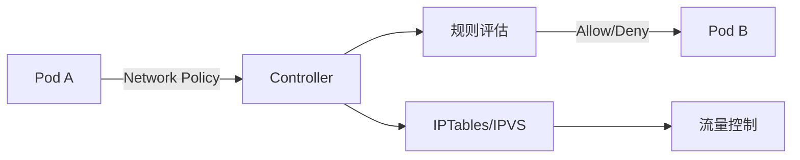
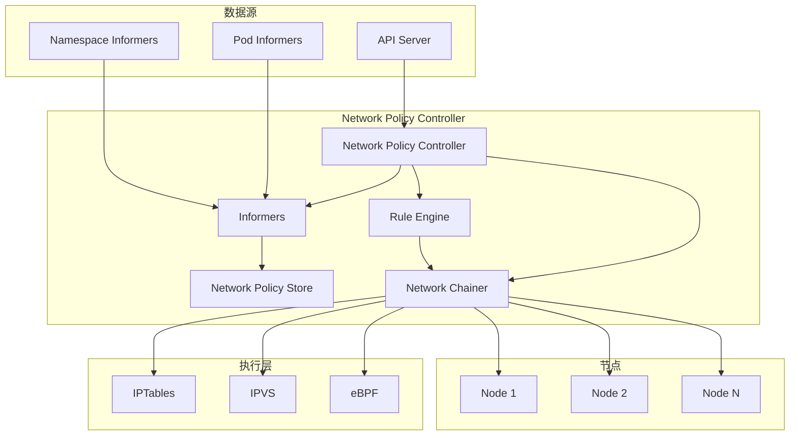
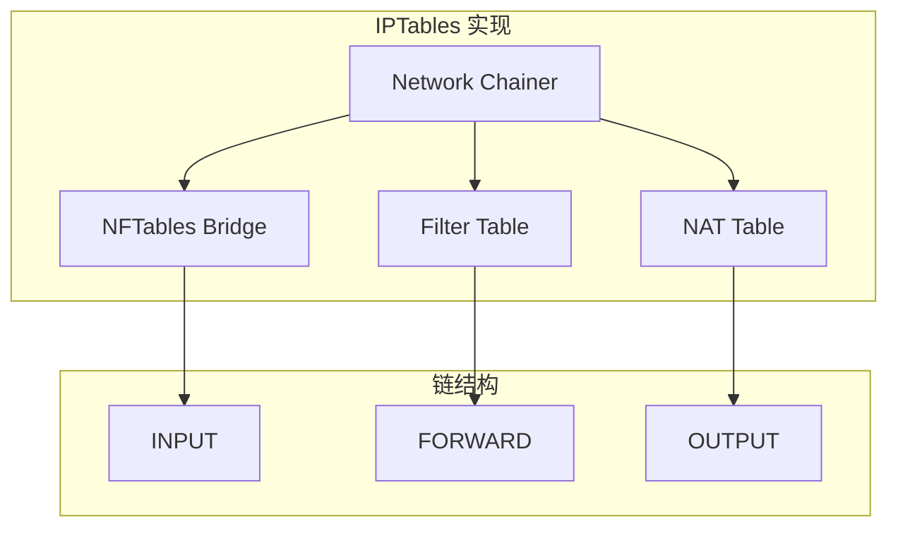
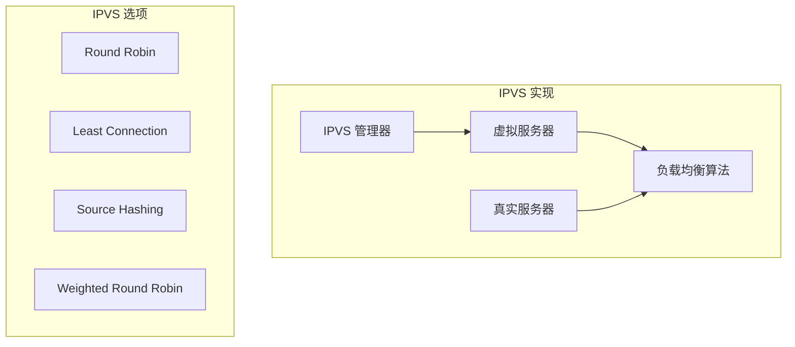
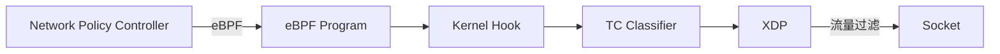

# Network Policy 实现深度分析

> 本文档深入分析 Kubernetes 的 Network Policy 实现，包括 Policy Controller、规则评估引擎、IPTables/IPVS 实现细节和 eBPF 网络策略。

---

## 目录

1. [Network Policy 概述](#network-policy-概述)
2. [Network Policy Controller 架构](#network-policy-controller-架构)
3. [规则评估引擎](#规则评估引擎)
4. [IPTables 实现](#iptables-实现)
5. [IPVS 实现](#ipvs-实现)
6. [eBPF 网络策略](#ebpf-网络策略)
7. [性能优化](#性能优化)
8. [最佳实践](#最佳实践)

---

## Network Policy 概述

### Network Policy 的作用

Network Policy 是 Kubernetes 的**网络安全策略**，用于控制 Pod 之间的流量：



### Network Policy 的价值

| 价值 | 说明 |
|------|------|
| **网络安全** | 控制命名空间内 Pod 之间的流量 |
| **最小权限** | 默认拒绝所有流量，仅允许必要的访问 |
| **分段隔离** | 支持多租户环境下的网络隔离 |
| **灵活规则** | 支持 Label 选择器、端口、协议、CIDR |

### Network Policy 资源

```go
// NetworkPolicy 资源定义
const (
    // 资源名称
    ResourceName = "networkpolicies"
)

// PolicyType 类型
type PolicyType string

const (
    // Ingress 类型（入站流量）
    PolicyTypeIngress PolicyType = "Ingress"
    
    // Egress 类型（出站流量）
    PolicyTypeEgress PolicyType = "Egress"
)
```

---

## Network Policy Controller 架构

### Controller 组件



### Controller 接口定义

**位置**: `pkg/controller/networkpolicy/controller.go`

```go
// Controller 接口
type Controller interface {
    // Run 运行控制器
    Run(ctx context.Context, stopCh <-chan struct{})
}

// NetworkPolicyController 实现
type NetworkPolicyController struct {
    // NetworkPolicy Informer
    networkPolicyLister corev1listers.NetworkPolicyLister
    
    // Namespace Informer
    namespaceLister corev1listers.NamespaceLister
    
    // Pod Informer
    podLister corev1listers.PodLister
    
    // 规则计算器
    ruleCalculator *networkpolicy.NetworkPolicyRulesCalculator
    
    // 网络规则器
    networkRules *networkpolicy.NetworkChainer
    
    // 同步队列
    queue workqueue.RateLimitingInterface
}
```

### Controller 启动流程

```go
// Run 运行控制器
func (c *NetworkPolicyController) Run(ctx context.Context, stopCh <-chan struct{}) {
    logger := klog.FromContext(ctx)
    
    // 1. 等待 Informers 缓存同步
    if !cache.WaitForCacheSync(ctx.Done()) {
        return
    }
    
    // 2. 启动 Informers
    informerFactory := informers.NewSharedInformerFactory()
    
    networkPolicyInformer := informerFactory.Networking().V1().NetworkPolicies()
    networkPolicyInformer.Informer().AddEventHandler(cache)
    
    namespaceInformer := informerFactory.Core().V1().Namespaces()
    namespaceInformer.Informer().AddEventHandler(cache)
    
    podInformer := informerFactory.Core().V1().Pods()
    podInformer.Informer().AddEventHandler(cache)
    
    // 3. 启动控制器
    go c.ruleCalculator.Run(ctx.Done())
    go c.networkRules.Run(ctx.Done())
    go wait.Until(ctx.Done(), stopCh, c.worker)
}
```

---

## 规则评估引擎

### 规则计算

**位置**: `pkg/controller/networkpolicy/network_policy_controller.go`

```go
// NetworkPolicyRulesCalculator 计算网络规则
type NetworkPolicyRulesCalculator struct {
    // NetworkPolicy Store
    policyStore networkpolicy.NetworkPolicyStore
    
    // Pod Store
    podStore corev1store.Store
    
    // Namespace Store
    namespaceStore corev1store.Store
    
    // 同步队列
    queue workqueue.RateLimitingInterface
}

// Compute 计算网络规则
func (c *NetworkPolicyRulesCalculator) Compute(ctx context.Context, pod *v1.Pod) ([]networkpolicy.NetworkPolicyRule, error) {
    logger := klog.FromContext(ctx)
    
    // 1. 获取 Pod 的所有 Network Policies
    policies, err := c.getNetworkPoliciesForPod(pod)
    if err != nil {
        return nil, err
    }
    
    if len(policies) == 0 {
        return nil, nil
    }
    
    // 2. 计算规则
    var rules []networkpolicy.NetworkPolicyRule
    
    for _, policy := range policies {
        policyRules := c.calculateRulesForPolicy(ctx, pod, policy)
        rules = append(rules, policyRules...)
    }
    
    return rules, nil
}

// calculateRulesForPolicy 为单个 Policy 计算规则
func (c *NetworkPolicyRulesCalculator) calculateRulesForPolicy(
    ctx context.Context,
    pod *v1.Pod,
    policy *networkpolicy.NetworkPolicy,
) []networkpolicy.NetworkPolicyRule {
    var rules []networkpolicy.NetworkPolicyRule
    
    // 1. Ingress 规则
    for _, ingress := range policy.Spec.Ingress {
        rule := networkpolicy.NetworkPolicyRule{
            Policy:       policy,
            RuleType:     networkpolicy.PolicyTypeIngress,
            Source:       ingress.From,
            Destination:  policy,
            Ports:        ingress.Ports,
        }
        rules = append(rules, rule)
    }
    
    // 2. Egress 规则
    for _, egress := range policy.Spec.Egress {
        rule := networkpolicy.NetworkPolicyRule{
            Policy:       policy,
            RuleType:     networkpolicy.PolicyTypeEgress,
            Source:       policy,
            Destination:  egress.To,
            Ports:        egress.Ports,
        }
        rules = append(rules, rule)
    }
    
    return rules
}
```

### 规则匹配

```go
// NetworkPolicyRule 网络策略规则
type NetworkPolicyRule struct {
    // 策略
    Policy *networkpolicy.NetworkPolicy
    
    // 规则类型
    RuleType networkpolicy.PolicyType
    
    // 源 Pod
    Source networkpolicy.PolicyPeer
    
    // 目标 Pod
    Destination *networkpolicy.NetworkPolicy
    
    // 端口
    Ports []networkpolicy.NetworkPolicyPort
}

// Matches 检查规则是否匹配
func (r *NetworkPolicyRule) Matches(pod *v1.Pod) bool {
    logger := klog.Background()
    
    // 1. 检查 Pod Selector
    if r.Source != nil {
        if !r.Source.Selector.Matches(labels.Set(pod.Labels)) {
            return false
        }
    }
    
    // 2. 检查 Namespace Selector
    if r.Source != nil {
        if !r.Source.NamespaceSelector.Matches(pod.Namespace) {
            return false
        }
    }
    
    // 3. 检查 IPBlock
    if r.Policy != nil && r.Policy.Spec.PodSelector != nil {
        if !r.Policy.Spec.PodSelector.Matches(labels.Set(pod.Labels)) {
            return false
        }
    }
    
    logger.V(5).Info("Rule matches", "pod", pod.Name, "policy", r.Policy.Name)
    return true
}
```

---

## IPTables 实现

### IPTables 架构



### IPTables 规则生成

```go
// GenerateRules 生成 IPTables 规则
func (nc *NetworkChainer) GenerateRules() []iptables.Rule {
    var rules []iptables.Rule
    
    // 1. INPUT 链规则
    inputRule := iptables.Rule{
        Table:   iptables.TableFilter,
        Chain:   iptables.ChainInput,
        Action:  iptables.ActionAccept,
        Comment: "k8s-network-policy input",
    }
    rules = append(rules, inputRule)
    
    // 2. FORWARD 链规则
    forwardRule := iptables.Rule{
        Table:   iptables.TableFilter,
        Chain:   iptables.ChainForward,
        Action:  iptables.ActionAccept,
        Comment: "k8s-network-policy forward",
    }
    rules = append(rules, forwardRule)
    
    // 3. Network Policy 规则
    for _, policy := range nc.policies {
        for _, rule := range policy.Rules {
            iptablesRule := nc.generateIPTablesRule(rule)
            rules = append(rules, iptablesRule)
        }
    }
    
    return rules
}

// generateIPTablesRule 生成单个 IPTables 规则
func (nc *NetworkChainer) generateIPTablesRule(rule *networkpolicy.NetworkPolicyRule) iptables.Rule {
    // 1. 确定 Table 和 Chain
    var table iptables.Table
    var chain iptables.Chain
    
    switch rule.RuleType {
    case networkpolicy.PolicyTypeIngress:
        table = iptables.TableFilter
        chain = "INPUT"
        
    case networkpolicy.PolicyTypeEgress:
        table = iptables.TableFilter
        chain = "OUTPUT"
    }
    
    // 2. 生成规则
    return iptables.Rule{
        Table:  table,
        Chain:  chain,
        Source: rule.Source.IP,
        Dest:   rule.Destination.IP,
        Proto:  rule.Ports.Protocol,
        DPort:  rule.Ports.Port,
        Action:  iptables.ActionAccept,
        Comment: fmt.Sprintf("k8s-network-policy %s", rule.Policy.Name),
    }
}
```

### IPTables 规则同步

```go
// Sync 同步 IPTables 规则
func (nc *NetworkChainer) Sync(ctx context.Context) error {
    logger := klog.FromContext(ctx)
    
    // 1. 计算规则
    rules := nc.GenerateRules()
    
    // 2. 构建 IPTables 命令
    cmds := make([][]string, 0, len(rules))
    
    for _, rule := range rules {
        cmd := []string{"iptables", "-A", string(rule.Table)}
        cmd = append(cmd, string(rule.Chain)...)
        cmd = append(cmd, "-j", rule.Comment)
        cmds[i] = cmd
    }
    
    // 3. 清空旧规则
    for _, cmd := range []string{"iptables", "-F", "-j", "k8s-network-policy"} {
        if err := exec.CommandContext(ctx, nil, cmd[0], cmd[1:]...).Run(); err != nil {
            logger.Error(err, "Failed to flush rules")
            return err
        }
    }
    
    // 4. 添加新规则
    for i, cmd := range cmds {
        if err := exec.CommandContext(ctx, nil, cmd[0], cmd[1:]...).Run(); err != nil {
            logger.Error(err, "Failed to add rule")
            return err
        }
    }
    
    logger.Info("NetworkPolicy rules synchronized")
    return nil
}
```

---

## IPVS 实现

### IPVS 架构



### IPVS 服务创建

```go
// UpdateServices 更新 IPVS 服务
func (nc *NetworkChainer) UpdateServices(pods []*v1.Pod) error {
    logger := klog.Background()
    
    // 1. 遍历 Pods
    for _, pod := range pods {
        // 2. 获取 Pod 的所有 IP
        podIPs := nc.getPodIPs(pod)
        
        for _, podIP := range podIPs {
            // 3. 创建 IPVS 服务
            service := ipvs.Service{
                VirtualIP:    podIP,
                Port:         nc.servicePort,
                Scheduler:    nc.ipvsScheduler,
            }
            
            if err := nc.ipvs.AddService(service); err != nil {
                logger.Error(err, "Failed to add IPVS service", "ip", podIP)
                return err
            }
        }
    }
    
    logger.Info("IPVS services updated")
    return nil
}
```

### IPVS 负载均衡算法

```go
// IPVS Scheduler 算法
type ipvsScheduler string

const (
    // Round Robin 调度器
    ipvsRR = "rr"
    
    // Least Connection 调度器
    ipvsLC = "lc"
    
    // Destination Hashing 调度器
    ipvsDH = "dh"
    
    // Weighted Round Robin 调度器
    ipvsWRR = "wrr"
)

// SetIPVSScheduler 设置 IPVS 调度器
func (nc *NetworkChainer) SetIPVSScheduler(scheduler ipvsScheduler) {
    nc.ipvsScheduler = scheduler
}
```

---

## eBPF 网络策略

### eBPF 概述

eBPF（Extended Berkeley Packet Filter）是 Linux 内核的**高性能网络数据包过滤**框架：



### eBPF 优势

| 特性 | IPTables | eBPF |
|------|---------|------|
| **性能** | 低 | 高（内核空间执行） |
| **扩展性** | 有限 | 高（有状态维护） |
| **规则数** | 限制（链深度） | 无限制 |
| **更新延迟** | 高 | 低（原子更新） |

### eBPF NetworkPolicy Controller

**位置**: `pkg/controller/networkpolicy/apis/cilium`（第三方实现）

```go
// eBPF NetworkPolicy Controller 实现
type eBPFNetworkPolicyController struct {
    // NetworkPolicy Store
    policyStore networkpolicy.NetworkPolicyStore
    
    // Pod Store
    podStore corev1store.Store
    
    // eBPF 程序
    bpfProgram *ebpf.BPFProgram
    
    // 同步队列
    queue workqueue.RateLimitingInterface
}

// Sync 同步 eBPF 程序
func (c *eBPFNetworkPolicyController) Sync(ctx context.Context) error {
    logger := klog.FromContext(ctx)
    
    // 1. 计算网络规则
    rules := c.calculateEBPFRules(ctx)
    
    // 2. 加载 eBPF 程序
    if err := c.bpfProgram.Load(rules); err != nil {
        return fmt.Errorf("failed to load eBPF program: %w", err)
    }
    
    // 3. 附加 eBPF 程序
    if err := c.bpfProgram.Attach(); err != nil {
        return fmt.Errorf("failed to attach eBPF program: %w", err)
    }
    
    logger.Info("eBPF program loaded and attached")
    return nil
}
```

---

## 性能优化

### 规则缓存

```go
// RuleCache 规则缓存
type RuleCache struct {
    sync.RWMutex
    cache map[string][]networkpolicy.NetworkPolicyRule
}

// Get 获取规则
func (c *RuleCache) Get(key string) ([]networkpolicy.NetworkPolicyRule, bool) {
    c.RLock()
    defer c.RUnlock()
    
    if rules, ok := c.cache[key]; ok {
        return rules, true
    }
    
    return nil, false
}

// Set 设置规则
func (c *RuleCache) Set(key string, rules []networkpolicy.NetworkPolicyRule) {
    c.Lock()
    defer c.Unlock()
    
    c.cache[key] = rules
}
```

### 并发规则更新

```go
// 规则更新器
type RuleUpdater struct {
    // 规则通道
    ruleChan chan networkpolicy.RuleUpdate
    
    // 并发数
    concurrency int
}

// Run 运行规则更新器
func (u *RuleUpdater) Run(ctx context.Context) {
    var wg sync.WaitGroup
    sem := make(chan struct{}, u.concurrency)
    
    for {
        select {
        case update := <-u.ruleChan:
            sem <- struct{}{}
            wg.Add(1)
            go func(update networkpolicy.RuleUpdate) {
                defer wg.Done()
                defer func() { <-sem }()
                
                // 更新规则
                u.updateRule(ctx, update)
            }(update)
            
        case <-ctx.Done():
            wg.Wait()
            return
        }
    }
}
```

### 批量规则同步

```go
// BatchSync 批量同步规则
func (nc *NetworkChainer) BatchSync(ctx context.Context, batchSize int) error {
    logger := klog.FromContext(ctx)
    
    // 1. 获取所有 Pods
    pods, err := nc.podLister.List(labels.Everything())
    if err != nil {
        return err
    }
    
    // 2. 批量处理
    for i := 0; i < len(pods); i += batchSize {
        end := i + batchSize
        if end > len(pods) {
            end = len(pods)
        }
        
        batch := pods[i:end]
        
        // 同步批次
        if err := nc.SyncBatch(ctx, batch); err != nil {
            logger.Error(err, "Failed to sync batch")
            return err
        }
    }
    
    logger.Info("Batch sync completed", "podCount", len(pods))
    return nil
}
```

---

## 最佳实践

### 1. Network Policy 配置

#### 默认拒绝策略

```yaml
apiVersion: v1
kind: Namespace
metadata:
  name: default-deny
spec:
  podSelector: {}
  policyTypes:
    - Ingress
    - Egress
```

#### 允许同命名空间

```yaml
apiVersion: v1
kind: NetworkPolicy
metadata:
  name: allow-same-namespace
spec:
  podSelector:
    matchLabels:
      app: my-app
  policyTypes:
    - Ingress
    - Egress
```

#### 限制出站流量

```yaml
apiVersion: v1
kind: NetworkPolicy
metadata:
  name: allow-dns
spec:
  podSelector:
    matchLabels:
      app: my-app
  policyTypes:
    - Egress
  egress:
    - to:
        namespaceSelector: {}
      ports:
      - protocol: UDP
        port: 53
```

### 2. IPTables 配置

#### 启用 IPTables

```yaml
apiVersion: kubelet.config.k8s.io/v1beta1
kind: KubeletConfiguration
# 启用 IPTables 插件
enableIPTables: true
```

#### IPTables 性能优化

```yaml
apiVersion: k8s.io/v1
kind: ConfigMap
metadata:
  name: network-policy-config
data:
  # 最大连接跟踪数
  conntrackMax: 1000000
  # IPTables 模块加载
  modules: "nf_conntrack nf_conntrack_ipv4 ip_tables"
```

### 3. IPVS 配置

#### 启用 IPVS

```yaml
apiVersion: kube-proxy.config.k8s.io/v1alpha1
kind: KubeProxyConfiguration
# IPVS 模式
mode: "ipvs"
```

#### IPVS 调度器

```yaml
apiVersion: v1
kind: ConfigMap
metadata:
  name: ipvs-config
data:
  # Round Robin 调度器
  ipvsScheduler: "rr"
  # 超时时间
  ipvsTCPTimeout: "0"
  ipvsTCPFinTimeout: "0"
  ipvsUDPTimeout: "0"
```

### 4. eBPF 配置

#### 启用 eBPF

```bash
# 检查 eBPF 支持
ls -la /sys/fs/bpf

# 启用 eBPF NetworkPolicy
kubectl apply -f https://raw.githubusercontent.com/kubernetes-sigs/bpf-network-policy-policy/main/rbac/v1beta1.yml
```

#### eBPF 性能优化

```yaml
apiVersion: cilium.io/v2
kind: CiliumNetworkPolicy
metadata:
  name: cnp-default-deny-all
spec:
  egress:
    - {}
  ingress:
    - {}
```

### 5. 监控和调优

#### Network Policy 指标

```go
var (
    // NetworkPolicy 评估次数
    NetworkPolicyEvalationsTotal = metrics.NewCounterVec(
        &metrics.CounterOpts{
            Subsystem:      "networkpolicy",
            Name:           "evaluations_total",
            Help:           "Total number of network policy evaluations",
            StabilityLevel: metrics.ALPHA,
        },
        []string{"policy", "rule"})
    
    // NetworkPolicy 应用次数
    NetworkPolicySyncsTotal = metrics.NewCounterVec(
        &metrics.CounterOpts{
            Subsystem:      "networkpolicy",
            Name:           "syncs_total",
            Help:           "Total number of network policy syncs",
            StabilityLevel: metrics.ALPHA,
        },
        []string{"policy"})
    
    // NetworkPolicy 规则数
    NetworkPolicyRulesTotal = metrics.NewGauge(
        &metrics.GaugeOpts{
            Subsystem:      "networkpolicy",
            Name:           "rules_total",
            Help:           "Total number of network policy rules",
            StabilityLevel: metrics.ALPHA,
        })
)
```

#### 监控 PromQL

```sql
# NetworkPolicy 评估速率
sum(rate(networkpolicy_evaluations_total[5m])) by (policy)

# NetworkPolicy 规则数
networkpolicy_rules_total

# NetworkPolicy 同步延迟
histogram_quantile(0.95, networkpolicy_sync_latency_seconds_bucket)

# IPVS 连接数
ipvs_connections_total
```

### 6. 故障排查

#### Network Policy 不生效

```bash
# 查看生效的 Network Policies
kubectl get networkpolicy -A

# 查看规则评估
kubectl describe pod <pod-name> | grep -A 5 "Network Policy"

# 查看 IPTables 规则
sudo iptables -L -n | grep -i "k8s-network-policy"
```

#### IPTables 问题

```bash
# 查看 IPTables 日志
journalctl -u kubelet -f | grep -i iptables

# 查看 IPTables 规则
sudo iptables -L -n -v | grep -i "k8s"

# 检查 IPTables 模块
lsmod | grep -i "ip_tables"
```

#### IPVS 问题

```bash
# 查看 IPVS 状态
sudo ipvsadm -L -n

# 查看 IPVS 聚合链
sudo ipvsadm -L -n --stat

# 查看 IPVS 连接
sudo ipvsadm -L -n --connection
```

---

## 总结

### 核心要点

1. **Network Policy 概述**：控制 Pod 间流量的网络安全策略
2. **Controller 架构**：Network Policy Controller、规则引擎、网络链
3. **规则评估**：规则匹配、PolicyType、端口、协议
4. **IPTables 实现**：规则生成、规则同步、规则缓存
5. **IPVS 实现**：服务管理、负载均衡算法、调度器
6. **eBPF 网络策略**：高性能内核空间规则执行、有状态维护
7. **性能优化**：规则缓存、并发更新、批量同步
8. **最佳实践**：默认拒绝策略、端口限制、IPVS 配置、监控

### 关键路径

```
NetworkPolicy 更新 → Controller → 规则评估引擎 → 
规则生成 → IPTables/IPVS/eBPF → 网络规则 → 流量控制
```

### 推荐阅读

- [Network Policies](https://kubernetes.io/docs/concepts/services-networking/network-policies/)
- [Network Policy Controller](https://github.com/kubernetes/kubernetes/tree/master/pkg/controller/networkpolicy)
- [eBPF NetworkPolicy](https://github.com/kubernetes-sigs/bpf-network-policy-policy)
- [IPTables Performance](https://www.netfilter.org/documentation/)

---

**文档版本**：v1.0
**创建日期**：2026-03-04
**维护者**：AI Assistant
**Kubernetes 版本**：v1.28+
