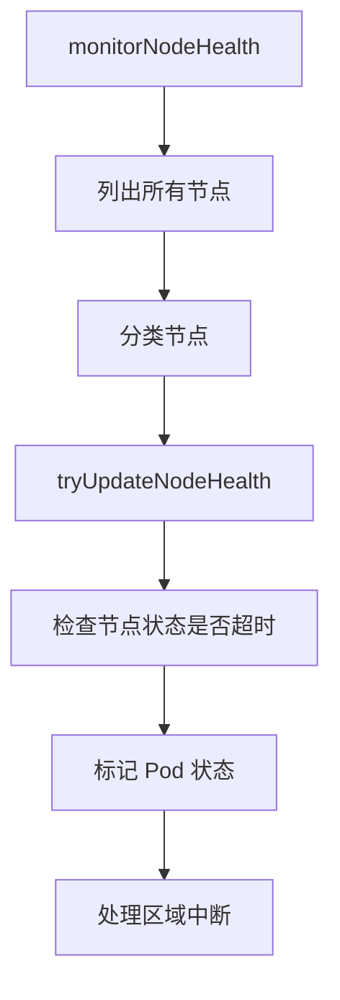

# Kubernetes Node Lifecycle Controller 源码分析

## 1. 概述

Node Lifecycle Controller (NLC) 是 Kubernetes 控制平面中的核心控制器之一，负责监控和管理集群中节点（Node）的生命周期。

### 主要职责

- **节点健康监控**：持续监测节点状态，检测节点故障
- **故障检测**：基于节点状态和心跳判断节点是否健康
- **驱逐机制**：对不健康的节点应用 Taint，防止新 Pod 调度到该节点
- **区域健康管理**：管理不同故障域（Zone）的健康状态
- **标签同步**：维护节点标签的一致性

## 2. 目录结构

```
pkg/controller/nodelifecycle/
├── node_lifecycle_controller.go    # 主控制器实现
├── metrics.go                    # 监控指标定义
├── config/                       # 配置相关
└── scheduler/                    # 调度器实现
```

## 3. 核心机制

### 3.1 节点状态监控

NLC 通过以下两种监控机制获取节点状态：

#### NodeStatus 监控
- kubelet 定期更新节点的 `NodeStatus`
- 包含多个条件：`NodeReady`、`NodeMemoryPressure`、`NodeDiskPressure` 等
- `LastHeartbeatTime` 和 `LastTransitionTime` 用于判断状态变化

#### NodeLease 监控
- 使用 Kubernetes Lease 机制进行心跳检测
- 更轻量级，适用于大规模集群
- 通过 `spec.renewTime` 判断节点是否活跃

### 3.2 故障检测逻辑

NLC 的故障检测基于以下时间窗口：

1. **NodeStartupGracePeriod**：节点启动时的宽容期（默认 1 分钟）
2. **NodeMonitorPeriod**：监控周期（默认 5 秒）
3. **NodeMonitorGracePeriod**：故障判定宽容期（默认 40 秒）

### 3.3 驱逐机制

NLC 使用两种 Taint 策略进行驱逐：

#### NoSchedule Taints
- **作用**：阻止新 Pod 调度到该节点
- **类型**：
  - `node.kubernetes.io/not-ready`：节点 NotReady
  - `node.kubernetes.io/unreachable`：节点无法联系

#### NoExecute Taints
- **作用**：不仅阻止新调度，还会驱逐已存在的 Pod
- **特性**：
  - 支持速率限制
  - 分区域管理
  - 可恢复时自动移除

## 4. 核心数据结构

```go
type Controller struct {
    taintManager *tainteviction.Controller
    
    // 信息获取器
    podLister corelisters.PodLister
    nodeLister corelisters.NodeLister
    leaseLister coordlisters.LeaseLister
    
    // 时间相关配置
    nodeMonitorPeriod time.Duration
    nodeStartupGracePeriod time.Duration
    nodeMonitorGracePeriod time.Duration
    
    // 节点健康状态存储
    knownNodeSet map[string]*v1.Node
    nodeHealthMap *nodeHealthMap
    
    // 驱逐相关
    zoneNoExecuteTainter map[string]*scheduler.RateLimitedTimedQueue
    zoneStates map[string]ZoneState
}
```

## 5. 工作流程



## 6. 最佳实践

### 6.1 配置优化

```yaml
nodeMonitorGracePeriod: 40s  # 必须大于 kubelet 的 nodeStatusUpdateFrequency
nodeMonitorPeriod: 5s        # 监控检查间隔
nodeStartupGracePeriod: 1m   # 节点启动宽容期
```

### 6.2 节点排除

对于关键节点，添加 `node.kubernetes.io/exclude-disruption` 标签：
```bash
kubectl label node <node-name> node.kubernetes.io/exclude-disruption=true
```

## 7. 总结

Node Lifecycle Controller 是 Kubernetes 集群稳定性的重要保障。通过合理的配置和监控，可以确保在节点故障时快速响应，同时避免过度驱逐导致的服务中断。
