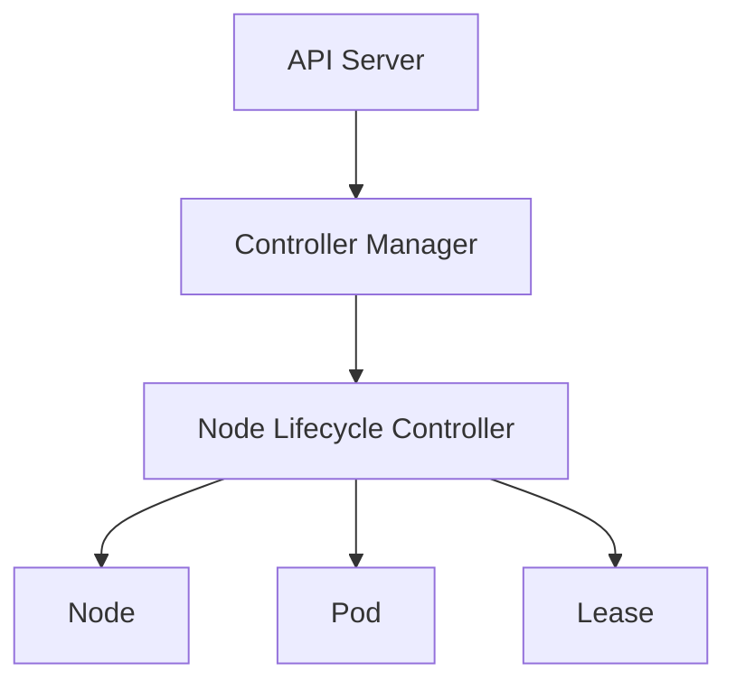
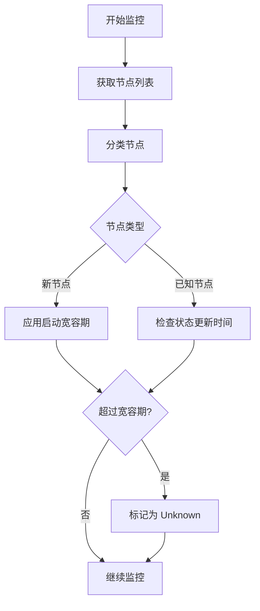
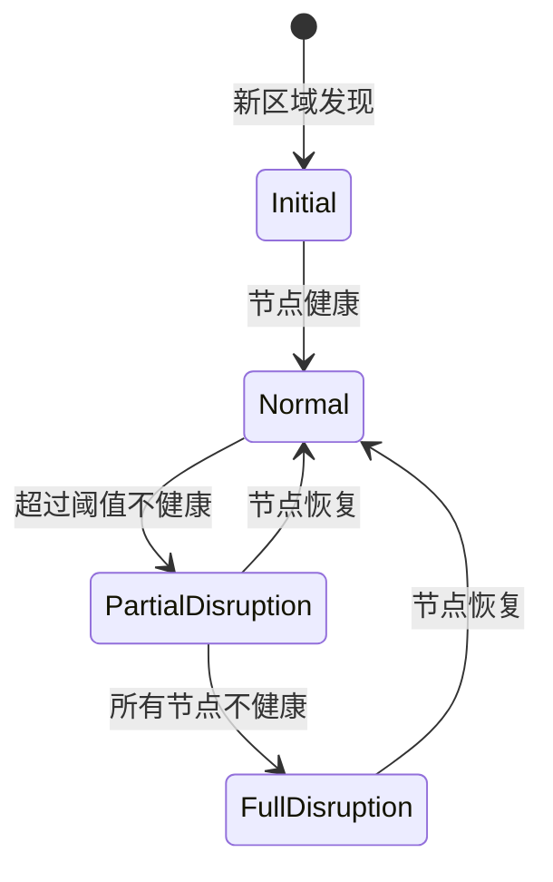
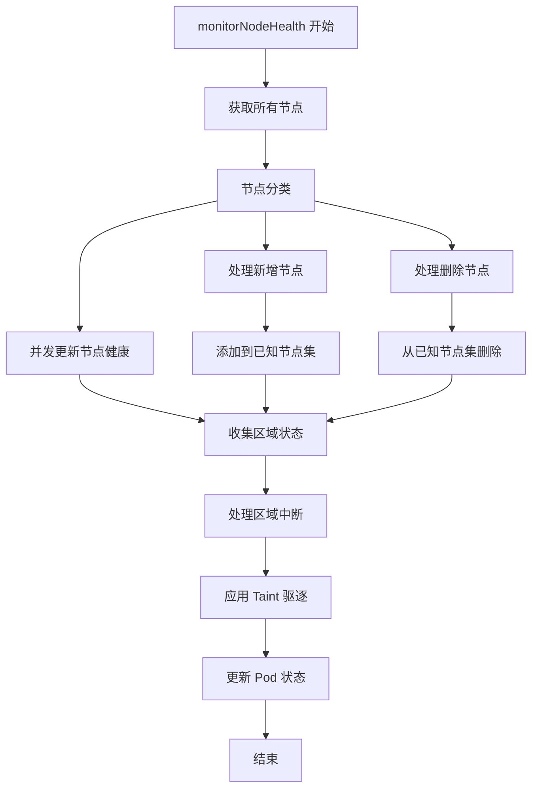

# Kubernetes Node Lifecycle Controller 源码深度分析

## 1. 概述

Node Lifecycle Controller (NLC) 是 Kubernetes 控制平面的核心组件，负责监控和管理集群中节点的生命周期。通过监控节点状态、健康检查和驱逐机制，确保集群在节点故障时的稳定性和可用性。

### 主要职责

- **节点健康监控**：持续监测节点状态，检测节点故障
- **故障检测**：基于节点状态和心跳判断节点是否健康
- **驱逐机制**：对不健康的节点应用 Taint，防止新 Pod 调度到该节点
- **区域健康管理**：管理不同故障域（Zone）的健康状态
- **标签同步**：维护节点标签的一致性

### 在 Kubernetes 架构中的位置



NLC 通过监听 Node 和 Lease 事件来获取节点健康信息，并通过 Taint 机制影响 Pod 调度。

## 2. 目录结构

```
pkg/controller/nodelifecycle/
├── node_lifecycle_controller.go    # 主控制器实现
├── metrics.go                        # 监控指标定义
├── config/                           # 配置相关
└── scheduler/                        # 调度器实现
```

## 3. 核心机制

### 3.1 节点状态监控

NLC 通过以下两种监控机制获取节点状态：

#### NodeStatus 监控

- kubelet 定期更新节点的 `NodeStatus`
- 包含多个条件：`NodeReady`、`NodeMemoryPressure`、`NodeDiskPressure` 等
- `LastHeartbeatTime` 和 `LastTransitionTime` 用于判断状态变化

```go
// NodeCondition 定义
type NodeCondition struct {
    Type               NodeConditionType
    Status             ConditionStatus
    LastHeartbeatTime  metav1.Time
    LastTransitionTime metav1.Time
    Reason             string
    Message            string
}
```

#### NodeLease 监控

- 使用 Kubernetes Lease 机制进行心跳检测
- 更轻量级，适用于大规模集群
- 通过 `spec.renewTime` 判断节点是否活跃

```go
// Lease 结构
type Lease struct {
    metav1.TypeMeta
    metav1.ObjectMeta

    Spec LeaseSpec
}

type LeaseSpec struct {
    RenewTime      metav1.MicroTime
    LeaseDurationSeconds int32
}
```

### 3.2 故障检测逻辑

NLC 的故障检测基于以下时间窗口：

1. **NodeStartupGracePeriod**：节点启动时的宽容期（默认 1 分钟）
2. **NodeMonitorPeriod**：监控周期（默认 5 秒）
3. **NodeMonitorGracePeriod**：故障判定宽容期（默认 40 秒）



### 3.3 驱逐机制

NLC 使用两种 Taint 策略进行驱逐：

#### NoSchedule Taints

- **作用**：阻止新 Pod 调度到该节点
- **类型**：
  - `node.kubernetes.io/not-ready`：节点 NotReady
  - `node.kubernetes.io/unreachable`：节点无法联系

```go
// NoSchedule Taint 应用
func (nc *Controller) markNodeForTainting(node *v1.Node) bool {
    switch currentReadyCondition.Status {
    case v1.ConditionFalse:
        // 节点 NotReady
        taintToAdd = *NotReadyTaintTemplate
    case v1.ConditionUnknown:
        // 节点不可达
        taintToAdd = *UnreachableTaintTemplate
    }

    // 应用 Taint
    controllerutil.SwapNodeControllerTaint(ctx, nc.kubeClient,
        []*v1.Taint{&taintToAdd}, nil, node)
}
```

#### NoExecute Taints

- **作用**：不仅阻止新调度，还会驱逐已存在的 Pod
- **特性**：
  - 支持速率限制
  - 分区域管理
  - 可恢复时自动移除

```go
// NoExecute Taint 应用
func (nc *Controller) doNoExecuteTaintingPass(ctx context.Context) {
    for _, zone := range zoneNoExecuteTainterKeys {
        zoneNoExecuteTainterWorker.Try(logger, func(value scheduler.TimedValue) (bool, time.Duration) {
            node, err := nc.nodeLister.Get(value.Value)

            // 原子性交换 Taint
            result := controllerutil.SwapNodeControllerTaint(ctx, nc.kubeClient,
                []*v1.Taint{&taintToAdd}, []*v1.Taint{&oppositeTaint}, node)
            return result, 0
        })
    }
}
```

## 4. Zone 状态管理机制

### 4.1 Zone 状态定义

```go
type ZoneState string

const (
    stateInitial           = ZoneState("Initial")
    stateNormal            = ZoneState("Normal")
    stateFullDisruption    = ZoneState("FullDisruption")
    statePartialDisruption = ZoneState("PartialDisruption")
)
```

### 4.2 Zone 状态计算逻辑

```go
func (nc *Controller) ComputeZoneState(nodeReadyConditions []*v1.NodeCondition) (int, ZoneState) {
    readyNodes := 0
    notReadyNodes := 0

    for i := range nodeReadyConditions {
        if nodeReadyConditions[i] != nil && nodeReadyConditions[i].Status == v1.ConditionTrue {
            readyNodes++
        } else {
            notReadyNodes++
        }
    }

    switch {
    case readyNodes == 0 && notReadyNodes > 0:
        return notReadyNodes, stateFullDisruption
    case notReadyNodes > 2 && float32(notReadyNodes)/float32(notReadyNodes+readyNodes) >= nc.unhealthyZoneThreshold:
        return notReadyNodes, statePartialDisruption
    default:
        return notReadyNodes, stateNormal
    }
}
```

### 4.3 Zone 状态管理流程



### 4.4 分区驱逐队列

```go
// 每个区域拥有独立的 RateLimitedTimedQueue
zoneNoExecuteTainter map[string]*scheduler.RateLimitedTimedQueue
```

### 4.5 速率限制策略

```go
func (nc *Controller) setLimiterInZone(zone string, zoneSize int, state ZoneState) {
    switch state {
    case stateNormal:
        nc.zoneNoExecuteTainter[zone].SwapLimiter(nc.evictionLimiterQPS)
    case statePartialDisruption:
        nc.zoneNoExecuteTainter[zone].SwapLimiter(
            nc.enterPartialDisruptionFunc(zoneSize))
    case stateFullDisruption:
        nc.zoneNoExecuteTainter[zone].SwapLimiter(
            nc.enterFullDisruptionFunc(zoneSize))
    }
}
```

## 5. 节点健康评估算法

### 5.1 健康数据结构

```go
type nodeHealthData struct {
    probeTimestamp           metav1.Time  // 最后一次探测时间
    readyTransitionTimestamp metav1.Time  // Ready 状态转换时间
    status                   *v1.NodeStatus  // 节点状态快照
    lease                    *coordv1.Lease  // Lease 信息
}
```

### 5.2 健康评估逻辑

```go
func (nc *Controller) tryUpdateNodeHealth(ctx context.Context, node *v1.Node) (time.Duration, v1.NodeCondition, *v1.NodeCondition, error) {
    // 获取当前节点的健康数据
    nodeHealth := nc.nodeHealthMap.getDeepCopy(node.Name)

    // 计算宽容期
    var gracePeriod time.Duration
    _, currentReadyCondition := controllerutil.GetNodeCondition(&node.Status, v1.NodeReady)
    if currentReadyCondition == nil {
        gracePeriod = nc.nodeStartupGracePeriod
    } else {
        gracePeriod = nc.nodeMonitorGracePeriod
    }

    // 检查是否超时
    if nc.now().After(nodeHealth.probeTimestamp.Add(gracePeriod)) {
        // 更新所有节点条件为 Unknown
        nodeConditionTypes := []v1.NodeConditionType{
            v1.NodeReady,
            v1.NodeMemoryPressure,
            v1.NodeDiskPressure,
            v1.NodePIDPressure,
        }

        for _, nodeConditionType := range nodeConditionTypes {
            _, currentCondition := controllerutil.GetNodeCondition(&node.Status, nodeConditionType)
            if currentCondition == nil {
                // 添加从未更新过的条件
                node.Status.Conditions = append(node.Status.Conditions, v1.NodeCondition{
                    Type:               nodeConditionType,
                    Status:             v1.ConditionUnknown,
                    Reason:             "NodeStatusNeverUpdated",
                    Message:            "Kubelet never posted node status.",
                    LastHeartbeatTime:  node.CreationTimestamp,
                    LastTransitionTime: nowTimestamp,
                })
            } else if currentCondition.Status != v1.ConditionUnknown {
                // 将不健康状态更新为 Unknown
                currentCondition.Status = v1.ConditionUnknown
                currentCondition.Reason = "NodeStatusUnknown"
                currentCondition.Message = "Kubelet stopped posting node status."
                currentCondition.LastTransitionTime = nowTimestamp
            }
        }
    }

    return gracePeriod, observedReadyCondition, currentReadyCondition, nil
}
```

### 5.3 Lease 健康检查

```go
// 如果 NodeLease 被更新，同步更新探测时间
observedLease, _ := nc.leaseLister.Leases(v1.NamespaceNodeLease).Get(node.Name)
if observedLease != nil && (savedLease == nil || savedLease.Spec.RenewTime.Before(observedLease.Spec.RenewTime)) {
    nodeHealth.lease = observedLease
    nodeHealth.probeTimestamp = nc.now()
}
```

## 6. 分区容忍（Partial Disruption）策略

### 6.1 分区检测机制

```go
func (nc *Controller) handleDisruption(ctx context.Context, zoneToNodeConditions map[string][]*v1.NodeCondition, nodes []*v1.Node) {
    newZoneStates := map[string]ZoneState{}
    allAreFullyDisrupted := true

    // 计算每个区域的状态
    for k, v := range zoneToNodeConditions {
        unhealthy, newState := nc.computeZoneStateFunc(v)
        zoneHealth.WithLabelValues(k).Set(float64(100*(len(v)-unhealthy)) / float64(len(v)))
        unhealthyNodes.WithLabelValues(k).Set(float64(unhealthy))

        if newState != stateFullDisruption {
            allAreFullyDisrupted = false
        }
        newZoneStates[k] = newState
    }

    // 全局中断处理
    if allAreFullyDisrupted {
        logger.Info("Controller detected that all Nodes are not-Ready. Entering master disruption mode")
        // 停止所有驱逐
        for k := range nc.zoneStates {
            nc.zoneNoExecuteTainter[k].SwapLimiter(0)
        }
    } else if allWasFullyDisrupted {
        // 从全局中断恢复
        logger.Info("Controller detected that some Nodes are Ready. Exiting master disruption mode")
        // 重置所有限制器
        for k := range nc.zoneStates {
            nc.setLimiterInZone(k, len(zoneToNodeConditions[k]), newZoneStates[k])
        }
    }
}
```

### 6.2 降级策略

1. **Partial Disruption 触发条件**：
   - 至少 3 个节点不健康（硬编码限制）
   - 不健康节点比例超过 `unhealthyZoneThreshold`

2. **降级行为**：
   - 小集群：停止驱逐（QPS = 0）
   - 大集群：降级到 `secondaryEvictionLimiterQPS`

3. **恢复策略**：
   - 监测到健康节点时自动恢复正常速率
   - 重置所有节点的探测时间戳

## 7. 核心数据结构

### 7.1 Controller 结构

```go
type Controller struct {
    taintManager *tainteviction.Controller

    // 信息获取器
    podLister         corelisters.PodLister
    nodeLister        corelisters.NodeLister
    leaseLister       coordlisters.LeaseLister
    daemonSetStore    appsv1listers.DaemonSetLister

    // 节点健康状态管理
    knownNodeSet      map[string]*v1.Node
    nodeHealthMap     *nodeHealthMap

    // 驱逐相关（分区管理）
    evictorLock       sync.Mutex
    zoneNoExecuteTainter map[string]*scheduler.RateLimitedTimedQueue
    zoneStates        map[string]ZoneState

    // 工作队列
    nodeUpdateQueue   workqueue.TypedInterface[string]
    podUpdateQueue    workqueue.TypedRateLimitingInterface[podUpdateItem]

    // 配置参数
    nodeMonitorPeriod         time.Duration
    nodeStartupGracePeriod    time.Duration
    nodeMonitorGracePeriod    time.Duration
    evictionLimiterQPS        float32
    secondaryEvictionLimiterQPS float32
    largeClusterThreshold      int32
    unhealthyZoneThreshold     float32
}
```

## 8. 工作流程

### 8.1 monitorNodeHealth 完整流程



### 8.2 节点更新函数

```go
updateNodeFunc := func(piece int) {
    start := nc.now()
    defer updateNodeHealthDuration.Observe(time.Since(start.Time).Seconds())

    // 1. 获取节点副本
    node := nodes[piece].DeepCopy()

    // 2. 更新节点健康状态（带重试机制）
    var err error
    var observedReadyCondition v1.NodeCondition
    var currentReadyCondition *v1.NodeCondition

    for i := 0; i < NodeHealthUpdateRetry; i++ {
        _, observedReadyCondition, currentReadyCondition, err = nc.tryUpdateNodeHealth(ctx, node)
        if err == nil {
            break
        }
        // 获取最新节点状态重试
        node, err = nc.kubeClient.CoreV1().Nodes().Get(ctx, node.Name, metav1.GetOptions{})
        if err != nil {
            return
        }
    }

    // 3. 收集区域状态
    if !isNodeExcludedFromDisruptionChecks(node) {
        zoneToNodeConditionsLock.Lock()
        zoneToNodeConditions[nodetopology.GetZoneKey(node)] = append(zoneToNodeConditions[nodetopology.GetZoneKey(node)], currentReadyCondition)
        zoneToNodeConditionsLock.Unlock()
    }

    // 4. 处理驱逐
    nc.processTaintBaseEviction(ctx, node, currentReadyCondition)

    // 5. 更新 Pod 状态
    pods, err := nc.getPodsAssignedToNode(node.Name)
    if err != nil {
        return
    }

    // 6. 标记不健康节点的 Pod 为 NotReady
    if currentReadyCondition != nil && currentReadyCondition.Status != v1.ConditionTrue {
        if err = controllerutil.MarkPodsNotReady(ctx, nc.kubeClient, nc.recorder, pods, node.Name); err != nil {
            nc.nodesToRetry.Store(node.Name, struct{}{})
            return
        }
    }
}
```

## 9. 监控指标

### 9.1 关键指标

| 指标名称 | 类型 | 描述 |
|---------|------|------|
| `node_health_zone_health` | Gauge | 每个区域的健康节点百分比 |
| `node_health_zone_size` | Gauge | 每个区域的节点数量 |
| `node_health_unhealthy_nodes_in_zone` | Gauge | 每个区域的不健康节点数 |
| `node_controller_evictions_total` | Counter | 自启动以来的驱逐总数 |
| `update_node_health_duration_seconds` | Histogram | 单个节点健康更新耗时 |
| `update_all_nodes_health_duration_seconds` | Histogram | 所有节点健康更新总耗时 |

## 10. 最佳实践

### 10.1 配置优化

```yaml
nodeMonitorGracePeriod: 40s    # 必须大于 kubelet 的 nodeStatusUpdateFrequency
nodeMonitorPeriod: 5s           # 监控检查间隔
nodeStartupGracePeriod: 1m      # 节点启动宽容期
unhealthyZoneThreshold: 0.55    # 55% 的节点不健康时触发分区中断
```

### 10.2 节点排除

对于关键节点，添加 `node.kubernetes.io/exclude-disruption` 标签：

```bash
kubectl label node <node-name> node.kubernetes.io/exclude-disruption=true
```

### 10.3 故障排查

1. **查看区域状态**：
   ```bash
   kubectl get nodes -o wide --label-columns topology.kubernetes.io/zone
   ```

2. **监控驱逐事件**：
   ```bash
   kubectl get events --field-selector involvedObject.kind=Node
   ```

3. **检查 Taint 状态**：
   ```bash
   kubectl describe node <node-name> | grep -i taint
   ```

## 11. 总结

Node Lifecycle Controller 通过精心设计的多层架构实现了：

1. **细粒度的健康监控**：结合 NodeStatus 和 NodeLease 实现可靠的健康检测
2. **智能的区域管理**：支持分区中断检测和降级策略
3. **速率限制保护**：防止大规模驱逐导致集群雪崩
4. **原子性 Taint 管理**：确保状态转换的一致性
5. **全面的监控**：提供详细的性能和健康指标

这些机制共同确保了 Kubernetes 集群在面对节点故障时的稳定性和自愈能力。
