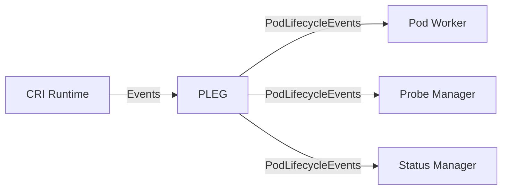
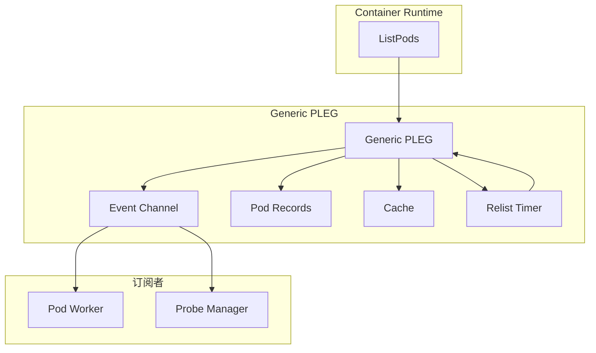
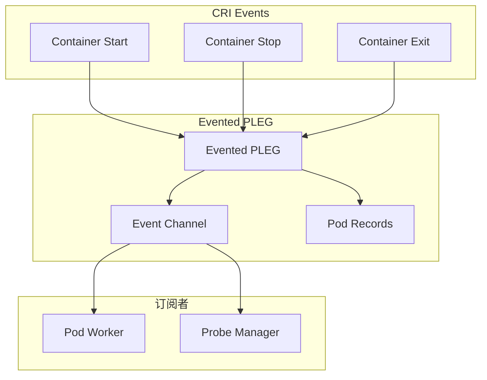
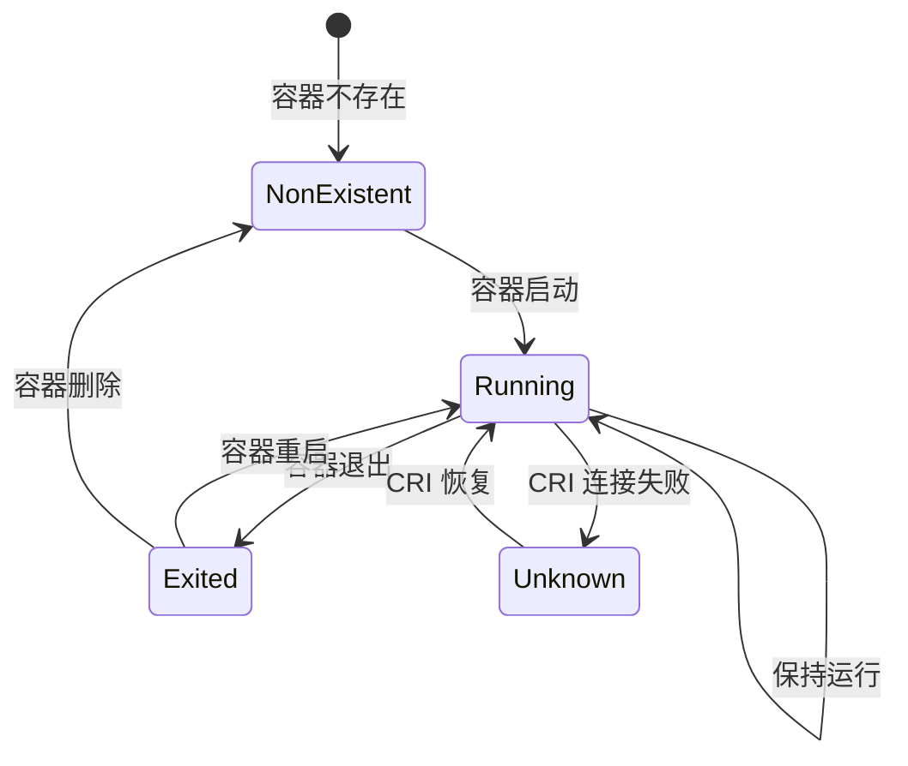
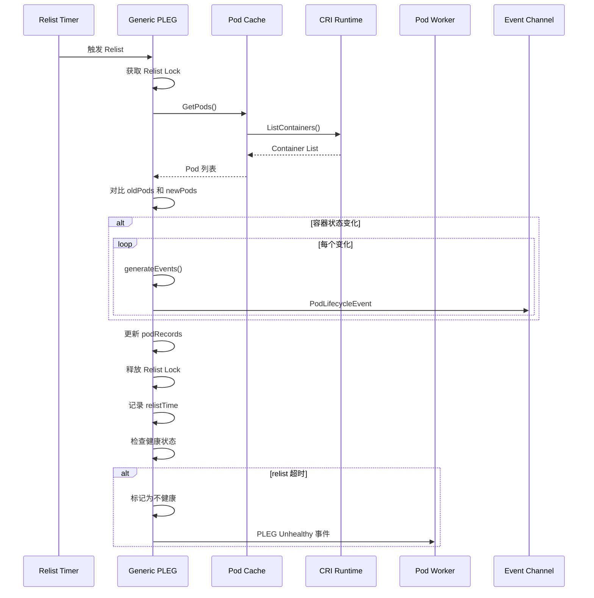
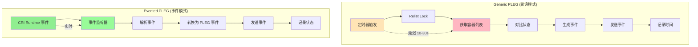

# PLEG 深度分析

> 本文档深入分析 Kubernetes 的 PLEG（Pod Lifecycle Event Generator），包括 Generic PLEG、Evented PLEG、容器状态监听、事件处理和性能优化。

---

## 目录

1. [PLEG 概述](#pleg-概述)
2. [PLEG 架构](#pleg-架构)
3. [Generic PLEG](#generic-pleg)
4. [Evented PLEG](#evented-pleg)
5. [容器状态监听](#容器状态监听)
6. [事件处理机制](#事件处理机制)
7. [Relist 机制](#relist-机制)
8. [性能优化](#性能优化)
9. [最佳实践](#最佳实践)

---

## PLEG 概述

### PLEG 的作用

PLEG（Pod Lifecycle Event Generator）是 Kubelet 感知容器状态变化的核心组件：



### PLEG 的职责

| 职责 | 说明 |
|------|------|
| **状态监听** | 通过 CRI Events 或定期 relist 监听容器状态变化 |
| **事件生成** | 将容器状态变化转换为 Pod 生命周期事件 |
| **事件广播** | 将 Pod 生命周期事件发送给订阅者（Pod Worker、Probe Manager、Status Manager） |
| **健康检查** | 定期检查 PLEG 是否正常运行 |

### PLEG 的价值

- **实时性**：实时感知容器状态变化
- **准确性**：避免轮询延迟
- **解耦性**：将容器运行时与 Kubelet 逻辑解耦
- **可靠性**：提供健康检查和故障恢复机制

---

## PLEG 架构

### PLEG 接口定义

**位置**: `pkg/kubelet/pleg/pleg.go`

```go
// PodLifecycleEventGenerator Pod 生命周期事件生成器接口
type PodLifecycleEventGenerator interface {
    // Watch 返回事件通道
    Watch() chan *PodLifecycleEvent
    
    // Healthy 检查 PLEG 是否健康
    Healthy() (bool, error)
    
    // Update 更新 PLEG 配置
    Update(relistDuration *RelistDuration)
}

// PodLifecycleEvent 表示 Pod 生命周期事件
type PodLifecycleEvent struct {
    ID        types.UID      // Pod UID
    Type      string          // 事件类型
    Data      interface{}      // 事件数据
}
```

### PLEG 实现类型

| 实现类型 | 说明 | 使用场景 |
|----------|------|---------|
| **Generic PLEG** | 通过定期 relist 检测状态变化 | 不支持 CRI Events 的运行时 |
| **Evented PLEG** | 通过 CRI Events 实时监听状态变化 | 支持 CRI Events 的运行时 |

---

## Generic PLEG

### Generic PLEG 架构

**位置**: `pkg/kubelet/pleg/generic.go`



### Generic PLEG 实现

```go
// GenericPLEG 通用 PLEG 实现
type GenericPLEG struct {
    // 容器运行时
    runtime kubecontainer.Runtime
    
    // 事件通道
    eventChannel chan *PodLifecycleEvent
    
    // Pod 记录（old 和 new）
    podRecords podRecords
    
    // 最后 relist 时间
    relistTime atomic.Value
    
    // 缓存
    cache kubecontainer.Cache
    
    // 时钟
    clock clock.Clock
    
    // relist 锁
    relistLock sync.Mutex
    
    // 运行状态
    isRunning bool
    
    // relist 配置
    relistDuration *RelistDuration
}

type podRecord struct {
    old *kubecontainer.Pod
    current *kubecontainer.Pod
}

type podRecords map[types.UID]*podRecord
```

### Generic PLEG 初始化

```go
// NewGenericPLEG 创建 Generic PLEG
func NewGenericPLEG(logger klog.Logger, runtime kubecontainer.Runtime, eventChannel chan *PodLifecycleEvent,
    relistDuration *RelistDuration, cache kubecontainer.Cache, clock clock.Clock) PodLifecycleEventGenerator {
    if cache == nil {
        panic("cache cannot be nil")
    }
    return &GenericPLEG{
        logger:          logger,
        relistDuration:  relistDuration,
        runtime:         runtime,
        eventChannel:    eventChannel,
        podRecords:      make(podRecords),
        cache:           cache,
        clock:           clock,
        watchConditions: make(map[types.UID]map[string]versionedWatchCondition),
    }
}
```

### Generic PLEG 启动

```go
// Start 启动 PLEG
func (g *GenericPLEG) Start() {
    g.runningMu.Lock()
    defer g.runningMu.Unlock()
    if !g.isRunning {
        g.isRunning = true
        g.stopCh = make(chan struct{})
        // 启动定期 relist
        go wait.Until(g.Relist, g.relistDuration.RelistPeriod, g.stopCh)
    }
}

// Stop 停止 PLEG
func (g *GenericPLEG) Stop() {
    g.runningMu.Lock()
    defer g.runningMu.Unlock()
    if g.isRunning {
        close(g.stopCh)
        g.isRunning = false
    }
}
```

---

## Evented PLEG

### Evented PLEG 架构

**位置**: `pkg/kubelet/pleg/evented.go`



### Evented PLEG 实现

```go
// EventedPLEG 基于 CRI Events 的 PLEG
type EventedPLEG struct {
    // 容器运行时
    runtime kubecontainer.Runtime
    
    // 事件通道
    eventChannel chan *PodLifecycleEvent
    
    // Pod 记录
    podRecords podRecords
    
    // 最后 relist 时间
    relistTime atomic.Value
    
    // 缓存
    cache kubecontainer.Cache
    
    // 时钟
    clock clock.Clock
    
    // 运行状态
    isRunning bool
    
    // 运行锁
    runningMu sync.Mutex
    
    // relist 配置
    relistDuration *RelistDuration
}
```

### CRI Events 处理

```go
// handleContainerEvent 处理 CRI 容器事件
func (e *EventedPLEG) handleContainerEvent(ctx context.Context, event *runtimeapi.ContainerEventResponse) {
    logger := klog.FromContext(ctx)
    
    switch event.Type {
    case runtimeapi.ContainerEvent_CONTAINER_CREATED:
        e.handleContainerCreated(event)
        
    case runtimeapi.ContainerEvent_CONTAINER_STARTED:
        e.handleContainerStarted(event)
        
    case runtimeapi.ContainerEvent_CONTAINER_STOPPED:
        e.handleContainerStopped(event)
        
    case runtimeapi.ContainerEvent_CONTAINER_DELETED:
        e.handleContainerDeleted(event)
    }
}

// handleContainerStarted 处理容器启动事件
func (e *EventedPLEG) handleContainerStarted(event *runtimeapi.ContainerEventResponse) {
    logger := klog.FromContext(ctx)
    
    // 1. 生成 PodLifecycleEvent
    ple := &PodLifecycleEvent{
        ID:   event.PodSandboxId,
        Type:  ContainerStarted,
        Data:  event,
    }
    
    // 2. 发送到事件通道
    select {
    case e.eventChannel <- ple:
        logger.V(4).Info("Container started", "podUID", event.PodSandboxId, "containerID", event.ContainerId)
    case <-e.stopCh:
        logger.Info("PLEG stopped, dropping event")
    }
}
```

---

## 容器状态监听

### 容器状态定义

```go
// plegContainerState PLEG 容器状态
type plegContainerState string

const (
    plegContainerRunning     plegContainerState = "running"
    plegContainerExited      plegContainerState = "exited"
    plegContainerUnknown     plegContainerState = "unknown"
    plegContainerNonExistent plegContainerState = "non-existent"
)
```

### 状态转换



---

## 事件处理机制

### 事件类型

```go
// 事件类型
const (
    // 容器启动
    ContainerStarted = "CONTAINER_STARTED"
    
    // 容器停止
    ContainerStopped = "CONTAINER_STOPPED"
    
    // 容器删除
    ContainerRemoved = "CONTAINER_REMOVED"
    
    // Pod 删除
    PodRemoved = "POD_REMOVED"
)
```

### 事件生成

```go
// generateEvents 生成 Pod 生命周期事件
func generateEvents(logger klog.Logger, podID types.UID, cid string, oldState, newState plegContainerState) []*PodLifecycleEvent {
    if newState == oldState {
        return nil
    }

    logger.V(4).Info("GenericPLEG", "podUID", podID, "containerID", cid, "oldState", oldState, "newState", newState)
    events := []*PodLifecycleEvent{}

    switch newState {
    case plegContainerRunning:
        events = append(events, &PodLifecycleEvent{
            ID:   podID,
            Type:  ContainerStarted,
            Data:  cid,
        })
        
    case plegContainerExited:
        events = append(events, &PodLifecycleEvent{
            ID:   podID,
            Type:  ContainerStopped,
            Data:  cid,
        })
        
    case plegContainerNonExistent:
        events = append(events, &PodLifecycleEvent{
            ID:   podID,
            Type:  ContainerRemoved,
            Data:  cid,
        })
    }
    
    return events
}
```

### 事件去重

```go
// 事件去重机制
type eventDedup struct {
    sync.Mutex
    recentEvents map[string]time.Time
}

func (d *eventDedup) dedup(event *PodLifecycleEvent) bool {
    d.Lock()
    defer d.Unlock()
    
    // 生成事件键
    key := fmt.Sprintf("%s:%s:%s", event.ID, event.Type, event.Data)
    
    // 检查是否为重复事件
    if lastSeen, ok := d.recentEvents[key]; ok {
        if time.Since(lastSeen) < time.Second {
            // 1 秒内的重复事件，忽略
            return true
        }
    }
    
    // 更新最后看到时间
    d.recentEvents[key] = time.Now()
    return false
}
```

---

## Relist 机制

### Generic PLEG Relist

```go
// Relist 定期 relist 容器状态
func (g *GenericPLEG) Relist() {
    g.relistLock.Lock()
    defer g.relistLock.Unlock()

    // 1. 获取当前运行时状态
    pods, err := g.cache.GetPods(context.Background())
    if err != nil {
        return
    }

    // 2. 对比之前的 Pod 记录
    oldPods := g.podRecords
    events := g.generateEvents(oldPods, pods)

    // 3. 发送事件到订阅者
    for _, event := range events {
        g.eventChannel <- event
    }

    // 4. 更新 Pod 记录
    for _, newPod := range pods {
        g.podRecords[newPod.ID] = &podRecord{
            old:    g.podRecords[newPod.ID],
            current: newPod,
        }
    }

    // 5. 删除不存在的 Pod 记录
    for uid, record := range oldPods {
        if _, ok := g.podRecords[uid]; !ok {
            g.eventChannel <- &PodLifecycleEvent{
                ID:   uid,
                Type:  PodRemoved,
                Data:  record.current,
            }
        }
    }

    // 6. 记录 relist 时间
    g.relistTime.Store(g.clock.Now())
}
```

#### Relist 完整流程图



#### Evented PLEG vs Generic PLEG 流程对比



### Relist 配置

```go
// RelistDuration relist 配置
type RelistDuration struct {
    // Relist 周期
    RelistPeriod time.Duration
    
    // Relist 阈值
    RelistThreshold time.Duration
}

// 默认配置
const (
    defaultRelistPeriod     = 10 * time.Second
    defaultRelistThreshold  = 3 * time.Minute
)
```

### Relist 优化

| 优化策略 | 说明 | 配置 |
|----------|------|------|
| **减少 Relist 频率** | 降低 CPU 开销 | `relistPeriod: 30s` |
| **使用 Evented PLEG** | 实时事件，避免轮询 | `evented: true` |
| **增量 Relist** | 只检查变化的部分 | - |
| **Relist 优先级** | 优先 relist 关键 Pod | - |

---

## 性能优化

### 批量事件发送

```go
// 批量发送事件
func (g *GenericPLEG) sendEvents(events []*PodLifecycleEvent) {
    for _, event := range events {
        select {
        case g.eventChannel <- event:
        case <-g.stopCh:
            return
        }
    }
}
```

### 事件通道缓冲

```go
// 带缓冲的事件通道
type GenericPLEG struct {
    // 事件通道（缓冲）
    eventChannel chan *PodLifecycleEvent
}

// NewGenericPLEG 创建带缓冲的 PLEG
func NewGenericPLEG(...) PodLifecycleEventGenerator {
    // 带缓冲的通道
    eventChannel := make(chan *PodLifecycleEvent, 1000)
    
    return &GenericPLEG{
        eventChannel: eventChannel,
        ...
    }
}
```

### 缓存优化

```go
// 缓存 Pods
type cache struct {
    sync.RWMutex
    pods map[types.UID]*kubecontainer.Pod
    time time.Time
}

// GetPods 返回缓存的 Pods
func (c *cache) GetPods(ctx context.Context) ([]*kubecontainer.Pod, error) {
    c.RLock()
    defer c.RUnlock()
    
    // 检查缓存是否过期
    if time.Since(c.time) < cachePeriod {
        return c.pods, nil
    }
    
    // 更新缓存
    c.updateCache(ctx)
    return c.pods, nil
}
```

---

## 最佳实践

### 1. PLEG 配置

#### 使用 Evented PLEG

```yaml
apiVersion: kubelet.config.k8s.io/v1beta1
kind: KubeletConfiguration
# 使用 Evented PLEG（推荐）
eventedPLEG: true
# Evented PLEG relist 间隔
eventedPLEGRelistPeriod: 10s
```

#### Generic PLEG 配置

```yaml
apiVersion: kubelet.config.k8s.io/v1beta1
kind: KubeletConfiguration
# Generic PLEG relist 间隔
relistPeriod: 10s
# PLEG 健康检查阈值
relistThreshold: 3m
```

### 2. 监控和调优

#### PLEG 指标

```go
var (
    // PLEG relist 延迟
    PLEGLastSeen = metrics.NewGauge(
        &metrics.GaugeOpts{
            Subsystem:      "kubelet",
            Name:           "pleg_last_seen_seconds",
            Help:           "Timestamp when PLEG was last seen active",
            StabilityLevel: metrics.ALPHA,
        })
    
    // PLEG relist 持续时间
    PLEGRelistDuration = metrics.NewHistogram(
        &metrics.HistogramOpts{
            Subsystem:      "kubelet",
            Name:           "pleg_relist_duration_seconds",
            Help:           "Duration of PLEG relist",
            StabilityLevel: metrics.ALPHA,
        })
    
    // PLEG 事件数量
    PLEGEventsTotal = metrics.NewCounterVec(
        &metrics.CounterOpts{
            Subsystem:      "kubelet",
            Name:           "pleg_events_total",
            Help:           "Cumulative number of PLEG events",
            StabilityLevel: metrics.ALPHA,
        },
        []string{"event_type"})
)
```

#### 监控 PromQL

```sql
# PLEG 最后看到时间
time() - kubelet_pleg_last_seen_seconds

# PLEG relist 延迟
rate(kubelet_pleg_relist_duration_seconds_bucket[5m], 5m)

# PLEG 事件数量
sum(rate(kubelet_pleg_events_total[5m])) by (event_type)
```

### 3. 故障排查

#### PLEG 健康检查失败

```bash
# 检查 PLEG 健康状态
kubectl get cs --field-selector='name==PLEG'

# 查看 PLEG 日志
journalctl -u kubelet -f | grep -i pleg

# 检查 PLEG 事件通道
kubectl logs -n kube-system -l component=kubelet | grep -i "pleg.*event"
```

#### 容器状态不同步

```bash
# 检查容器状态
kubectl describe pod <pod-name>

# 查看 Kubelet 日志
journalctl -u kubelet -f | grep -i "container.*state"

# 对比 CRI 和 Kubelet 状态
crictl ps
kubectl get pods
```

#### 事件丢失

```bash
# 检查 PLEG relist 时间
journalctl -u kubelet -f | grep -i "pleg.*relist"

# 检查事件通道
kubectl logs -n kube-system -l component=kubelet | grep -i "event.*channel"

# 检查订阅者
kubectl logs -n kube-system -l component=kubelet | grep -i "pod.*worker.*event"
```

### 4. 优化建议

#### 减少事件数量

```yaml
apiVersion: v1
kind: Pod
metadata:
  name: optimized-pod
spec:
  # 减少容器数量，降低 PLEG 事件频率
  containers:
  - name: app
    image: my-app:latest
    # 使用 Init Container 减少主容器事件
    initContainers:
    - name: init
      image: my-init:latest
```

#### 增加事件缓冲

```yaml
apiVersion: kubelet.config.k8s.io/v1beta1
kind: KubeletConfiguration
# 增加 PLEG 事件缓冲大小
plegChannelCapacity: 1000
```

#### 优化 Relist 间隔

```yaml
apiVersion: kubelet.config.k8s.io/v1beta1
kind: KubeletConfiguration
# 优化 Relist 间隔（根据 Pod 数量）
relistPeriod: 15s
# 增加 PLEG 健康检查阈值
relistThreshold: 5m
```

---

## 总结

### 核心要点

1. **PLEG 概述**：监听容器状态变化并生成 Pod 生命周期事件
2. **两种实现**：Generic PLEG（轮询）和 Evented PLEG（CRI Events）
3. **事件生成**：将容器状态变化转换为 Pod 生命周期事件
4. **Relist 机制**：Generic PLEG 通过定期 relist 检测状态变化
5. **事件广播**：将事件发送给订阅者（Pod Worker、Probe Manager、Status Manager）
6. **性能优化**：批量事件发送、事件通道缓冲、缓存优化
7. **健康检查**：定期检查 PLEG 是否正常运行

### 关键路径

```
容器状态变化 → PLEG → 生成 PodLifecycleEvent → 事件通道 → 
订阅者（Pod Worker、Probe Manager、Status Manager）→ 处理
```

### 推荐阅读

- [PLEG Design](https://github.com/kubernetes/kubernetes/blob/master/pkg/kubelet/pleg/pleg.go)
- [CRI Events](https://github.com/kubernetes/kubernetes/blob/master/pkg/kubelet/pleg/evented.go)
- [Kubelet Configuration](https://kubernetes.io/docs/reference/config-api/kubelet-config.v1beta1/)
- [Container Runtime Interface](https://github.com/kubernetes/cri-api)

---

**文档版本**：v1.0
**创建日期**：2026-03-04
**维护者**：AI Assistant
**Kubernetes 版本**：v1.28+
