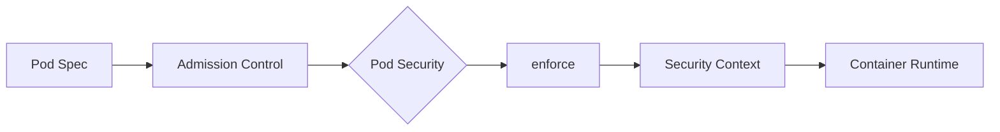
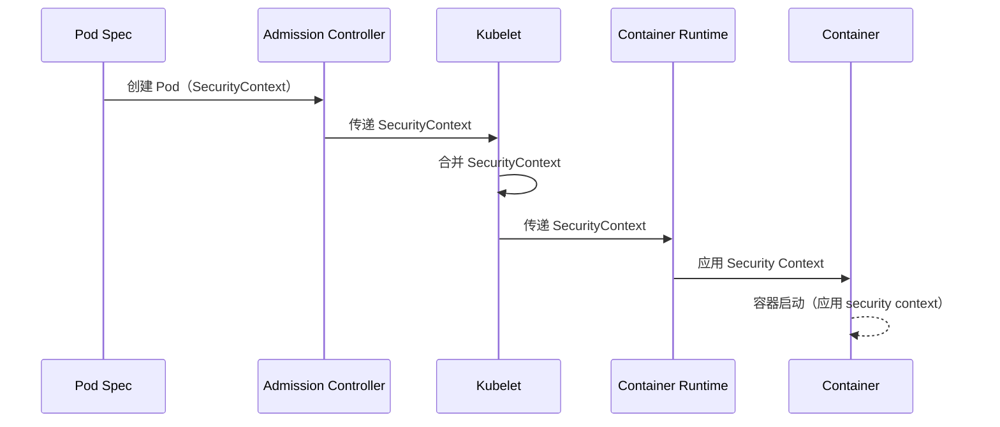
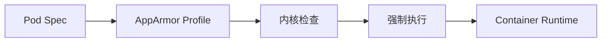
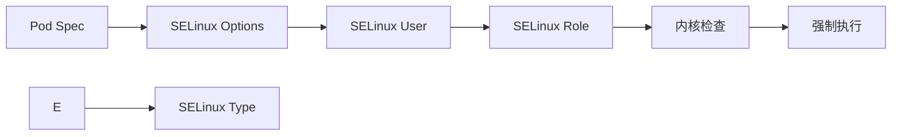
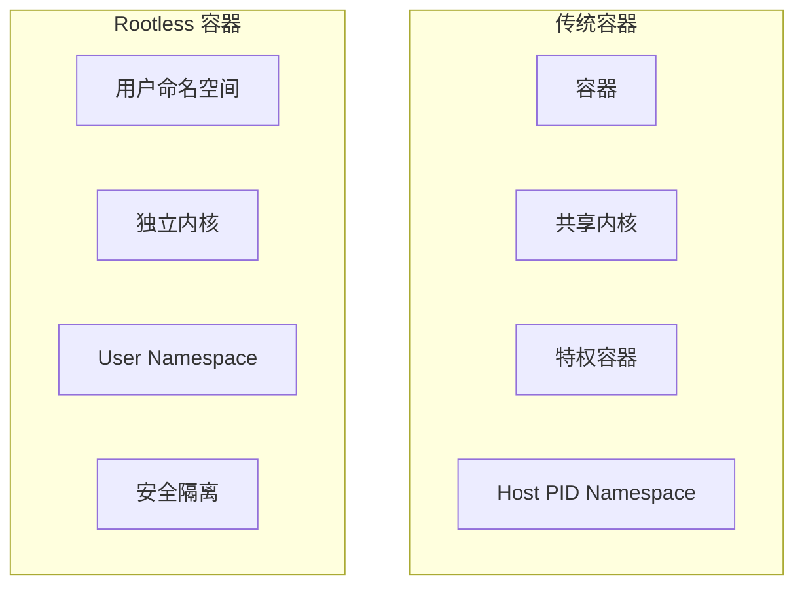

# Pod Security Admission 深度分析

> 本文档深入分析 Kubernetes 的 Pod Security Admission 机制，包括 Pod Security Standards、Security Context 实现、Seccomp/AppArmor/SELinux 配置、Rootless 容器和最佳实践。

---

## 目录

1. [Pod Security 概述](#pod-security-概述)
2. [Pod Security Standards](#pod-security-standards)
3. [Security Context 实现](#security-context-实现)
4. [Pod Security Admission](#pod-security-admission)
5. [Seccomp 配置](#seccomp-配置)
6. [AppArmor 配置](#apparmor-配置)
7. [SELinux 配置](#selinux-配置)
8. [Rootless 容器](#rootless-容器)
9. [最佳实践](#最佳实践)

---

## Pod Security 概述

### Pod Security 的作用

Pod Security 是 Kubernetes 强制执行**安全策略**的机制：



### Pod Security 的职责

| 职责 | 说明 |
|------|------|
| **强制执行** | 确保 Pod 符合配置的 Security Standards |
| **安全评估** | 根据 Pod 配置选择正确的 Security Standard |
| **上下文传播** | 为容器应用提供安全相关的配置信息 |
| **能力过滤** | 过滤掉危险的 Linux capabilities |

### Pod Security 的价值

- **安全隔离**：限制容器权限，防止容器逃逸
- **策略一致性**：跨集群强制统一的安全标准
- **最小权限原则**：只授予容器必要的权限
- **灵活性**：支持多个 Security Standard（Baseline、Restricted、Privileged）

---

## Pod Security Standards

### 3 种 Security Standard

```mermaid
graph TD
    A[Pod Spec] --> B{Security Policy}
    B --> C{评估选择}
    
    C --> D[Baseline]
    C --> E[Restricted]
    C --> F[Privileged]
    
    D -->|标准|
    D -->|基础措施|
    D -->|严格安全|
    D -->|无限制|
```

### Standard 对比

| Standard | 适用场景 | 说明 | 限制 |
|---------|---------|------|------|
| **Baseline** | 通用应用 | 基本安全措施 | 无 Root、无 hostNetwork、可变 capabilities |
| **Restricted** | 关键工作负载 | 最严格安全措施 | 无 Root、只读文件系统、固定 capabilities |
| **Privileged** | 系统级 Pod | 无任何限制（仅限特权 Pod） | 完全访问 |

### Standard 配置

**位置**: `pkg/apiserver/admission/plugin/podsecurity/podsecurity.go`

```go
const (
    // Baseline 标准
    Baseline PodSecurityStandard = "baseline"
    
    // Restricted 标准
    Restricted PodSecurityStandard = "restricted"
    
    // Privileged 标准
    Privileged PodSecurityStandard = "privileged"
)
```

### Standard 评估逻辑

```mermaid
flowchart TD
    A[Pod Spec] --> B{检查 Privileged}
    
    B -->|是|
        C[Privileged]
        C -->|Privileged Standard|
    B -->|否|
        D{检查 restricted}
        D -->|是|
        C[Restricted]
        E -->|Restricted Standard|
        D -->|否|
            E{检查 baseline}
            F -->|是|
                G[Baseline Standard|
                F -->|否|
                H[Drop Certain Caps]
                H[Standard Drop]
            F -->|否|
                I[Baseline Standard]
                I[Allow All Caps]
```

---

## Security Context 实现

### Security Context 结构

```go
// SecurityContext 定义 Pod 级别安全选项
type SecurityContext struct {
    // 是否为特权容器
    Privileged bool
    
    // 运行时用户和组
    RunAsUser *int64
    RunAsGroup *int64
    RunAsNonRoot *bool
    
    // Seccomp profile
    SeccompProfile string
    
    // AppArmor profile
    AppArmorProfile string
    
    // SELinux 选项
    SELinuxOptions *SELinuxOptions
    
    // Windows 选项
    WindowsOptions *WindowsOptions
    
    // 只读根文件系统
    ReadOnlyRootFilesystem bool
    
    // 进程命名空间
    ProcMountType v1.ProcMountType
    
    // 补充组
    SupplementalGroups *int64
}
```

### Security Context 优先级

```mermaid
graph TB
    A[Pod Spec] --> B{SecurityContext}
    B --> C{Pod Spec}
    C --> D{Default Context}
    D --> E{Container Runtime Defaults}
    
    D -->|字段优先级|
        D -->|Pod.Spec > Default > Runtime Defaults|
        D -->|Pod Spec = Default, Runtime Defaults|
    
    E -->|字段覆盖|
        D -->|Pod Spec 不为 nil > 使用 Runtime Defaults|
```

### Security Context 传播



---

## Pod Security Admission

### Admission 插件实现

**位置**: `pkg/apiserver/admission/plugin/podsecurity/podsecurity.go`

```go
// PluginName 插件名称
const PluginName = "PodSecurity"

type plugin struct {
    admission.Controller admission.Controller
    featureGate featuregate.FeatureGate
}

// Admit 准入 Pod
func (p *plugin) Admit(ctx context.Context, a Attributes) (err error) {
    logger := klog.FromContext(ctx)
    pod := a.Object.(*v1.Pod)
    
    // 1. 获取 Pod Security Admission 配置
    config, err := p.getPodSecurityAdmissionConfig()
    if err != nil {
        return err
    }
    
    // 2. 检查是否跳过
    if p.shouldSkipPodSecurityPolicy(pod, config) {
        logger.V(4).Info("Skipping pod security policy evaluation")
        return nil
    }
    
    // 3. 评估 Pod Security Standard
    standard, err := p.evaluatePodSecurityStandard(pod, config)
    if err != nil {
        return err
    }
    
    // 4. 应用 Pod Security Admission
    if err := p.applyPodSecurityPolicy(ctx, pod, standard); err != nil {
        return err
    }
    
    return nil
}
```

### Pod Security Standard 评估

```go
// evaluatePodSecurityStandard 评估 Pod 应该使用哪个 Security Standard
func (p *plugin) evaluatePodSecurityStandard(pod *v1.Pod, config *admission.Config) (string, error) {
    var standard string
    
    // 1. 检查特权标记
    if pod.Spec.HostNetwork {
        standard = Privileged
        return standard, nil
    }
    
    // 2. 检查特权容器
    for _, container := range pod.Spec.Containers {
        if container.SecurityContext != nil && container.SecurityContext.Privileged {
            standard = Privileged
            return standard, nil
        }
    }
    
    // 3. 检查是否需要 Restricted
    if requiresRestricted(pod) {
        standard = Restricted
    } else {
        standard = Baseline
    }
    
    return standard, nil
}

// requiresRestricted 检查是否需要 Restricted 标准
func requiresRestricted(pod *v1.Pod) bool {
    // 有 hostPath？
    for _, volume := range pod.Spec.Volumes {
        if volume.HostPath != nil {
            return true
        }
    }
    
    return false
}
```

### 安全策略应用

```mermaid
graph TB
    subgraph "安全策略"
        A[Capabilities]
            B[Drop All]
            C[Drop Certain]
            D[Allow Specific]
        end
        
        subgraph "文件系统"
            E[ReadOnly RootFS]
            F[Allow All]
        end
        
        subgraph "网络"
            G[No Host Network]
            H[Allow All]
        end
    end
    
    subgraph "用户命名空间"
        I[RunAsUser]
        J[RunAsGroup]
        K[NonRoot]
    end
    
    A --> B
    A --> C
    A --> D
    A --> E
    A --> F
    A --> G
    A --> H
    A --> I
    A --> J
    A --> K
```

---

## Seccomp 配置

### Seccomp Profile 类型

```go
// SeccompProfile 定义容器可以使用的 seccomp profile
type SeccompProfile string

const (
    // RuntimeDefault 使用运行时默认 profile
    RuntimeDefault SeccompProfile = "RuntimeDefault"
    
    // Unconfined 无 seccomp 限制
    Unconfined SeccompProfile = "Unconfined"
    
    // Localhost 允许访问本地主机资源
    Localhost SeccompProfile = "Localhost"
    
    // LocalhostV2 允许访问本地主机资源（V2）
    LocalhostV2 SeccompProfile = "LocalhostV2"
)
```

### Seccomp Profile 特性

| Profile | 安全性 | 适用场景 |
|---------|---------|---------|
| **RuntimeDefault** | 推荐 | 通用应用 |
| **Unconfined** | 不安全 | 仅测试环境 |
| **Localhost** | 最低安全 | 需要访问本地主机资源的应用 |

### Seccomp 配置示例

```yaml
apiVersion: v1
kind: Pod
metadata:
  name: seccomp-pod
spec:
  securityContext:
    seccompProfile:
      type: RuntimeDefault
  containers:
  - name: app
    image: my-app:latest
```

### Seccomp 指令

```bash
# 查看容器 seccomp 状态
docker inspect <container-id> | jq '.[0].HostConfig.SeccompProfile'

# 查看进程 seccomp 状态
cat /proc/<pid>/status | grep Secc
```

---

## AppArmor 配置

### AppArmor 概述

AppArmor 是 Linux 的**应用级访问控制**框架：



### AppArmor Profile 结构

```go
// AppArmorProfile 定义容器可以使用的 AppArmor profile
type AppArmorProfile struct {
    // Profile 名称
    Name string
    
    // Profile 内容
    Content string
}
```

### AppArmor 指令

```bash
# 查看可用的 AppArmor profiles
sudo aa-status

# 检查 AppArmor 状态
sudo dmesg | grep -i apparmor

# 查看 AppArmor 日志
sudo journalctl -k
```

### AppArmor 配置示例

```yaml
apiVersion: v1
kind: Pod
metadata:
  name: apparmor-pod
spec:
  securityContext:
    appArmorProfile: runtime/default
  containers:
  - name: app
    image: my-app:latest
```

---

## SELinux 配置

### SELinux 概述

SELinux 是 Linux 的**强制访问控制**框架：



### SELinux Options 结构

```go
// SELinuxOptions 定义 SELinux 相关选项
type SELinuxOptions struct {
    // SELinux 用户
    User string
    
    // SELinux 角色
    Role string
    
    // SELinux 类型
    Type string
}
```

### SELinux User 和 Role

| User | Role | Type | 说明 |
|------|------|------|---------|
| **system_u** | system_r | Systemd | 系统进程 |
| **system_u** | system_r | Systemd | 系统进程 |
| **root** | root | Systemd | Root 进程 |
| **_default** | "" | "" | 使用默认值 |

### SELinux 配置示例

```yaml
apiVersion: v1
kind: Pod
spec:
  securityContext:
    seLinuxOptions:
      user: system_u
      role: system_r
      type: Systemd
    level: s0:c15,c30
  containers:
  - name: app
    image: my-app:latest
```

---

## Rootless 容器

### Rootless 容器架构



### Rootless 特性

| 特性 | 说明 |
|------|------|
| **独立内核** | 每个 Pod 有自己的内核实例 |
| **用户命名空间** | 可以自定义 UID 和 GID |
| **没有特权** | 不能使用特权容器功能 |
| **安全隔离** | 更强的安全边界 |

### Rootless 容器配置

```yaml
apiVersion: v1
kind: Pod
metadata:
  name: rootless-pod
spec:
  securityContext:
    runAsUser: 1000
    runAsGroup: 3000
    runAsNonRoot: true
    seccompProfile:
      type: RuntimeDefault
    capabilities:
      drop:
      - ALL
      add:
      - NET_BIND_SERVICE
  containers:
  - name: app
    image: my-app:latest
```

### Rootless 容器要求

| 要求 | 说明 | 推荐值 |
|------|------|---------|
| **Kubernetes 版本** | v1.25+ | Rootless 支持版本 |
| **运行时** | 支持 Rootless | containerd、CRI-O |
| **Kubelet 配置** | `--enable-rootless` | 启用 Rootless |

---

## 最佳实践

### 1. 使用正确的 Security Standard

#### 基础应用 → Baseline

```yaml
apiVersion: v1
kind: Pod
spec:
  securityContext:
    runAsNonRoot: true
    seccompProfile:
      type: RuntimeDefault
    capabilities:
      drop:
      - NET_RAW
          - SYS_CHROOT
      add:
      - NET_BIND_SERVICE
  containers:
  - name: app
    image: my-app:latest
```

#### 关键工作负载 → Restricted

```yaml
apiVersion: v1
kind: Pod
metadata:
  name: restricted-pod
spec:
  securityContext:
    runAsNonRoot: true
    runAsUser: 1000
    runAsGroup: 3000
    seccompProfile:
      type: RuntimeDefault
    capabilities:
      drop: [ALL]
      add:
      - NET_BIND_SERVICE
    readOnlyRootFilesystem: true
    fsGroup: 2000
  containers:
  - name: app
    image: my-app:latest
    volumeMounts:
    - mountPath: /data
      name: data-volume
      readOnly: true
```

### 2. 最小权限原则

#### 只授予必要的 Capabilities

```yaml
apiVersion: v1
kind: Pod
spec:
  containers:
  - name: app
    image: my-app:latest
    securityContext:
      capabilities:
        add:
        - NET_BIND_SERVICE  # 只需要绑定网络端口
        drop:
        - ALL           # 删除所有其他能力
```

### 3. 只读文件系统

#### 敏感数据使用只读挂载

```yaml
apiVersion: v1
kind: Pod
spec:
  volumes:
  - name: config
    secret:
      secretName: app-config
  containers:
  - name: app
    image: my-app:latest
    volumeMounts:
    - name: config
      mountPath: /etc/app/config
      readOnly: true  # 只读访问
```

### 4. 用户命名空间隔离

#### 使用非 root 用户

```yaml
apiVersion: v1
kind: Pod
spec:
  securityContext:
    runAsUser: 1000  # 非 root 用户
    runAsGroup: 3000
    runAsNonRoot: true
  containers:
  - name: app
    image: my-app:latest
```

### 5. Pod Security Admission 配置

#### 启用和配置

```yaml
apiVersion: kubeapiserver.config.k8s.io/v1
kind: AdmissionConfiguration
plugins:
  - name: PodSecurity
    configuration:
      apiVersion: pod-security.admission.config.k8s.io/v1
      kind: PodSecurityConfiguration
      defaults:
        enforce: baseline
        audit: restricted
        warn: privileged
      exemptions:
        namespaces:
          - kube-system
        runtimeClasses:
          - untrusted
```

### 6. 监控和调优

#### Pod Security 指标

```go
var (
    // Pod Security 拒绝次数
    PodSecurityRejectionsTotal = metrics.NewCounterVec(
        &metrics.CounterOpts{
            Subsystem:      "podsecurity",
            Name:           "rejections_total",
            Help:           "Total number of pod security rejections",
            StabilityLevel: metrics.ALPHA,
        },
        []string{"standard", "reason"})
    
    // Pod Security 评估次数
    PodSecurityEvaluationsTotal = metrics.NewCounterVec(
        &metrics.CounterOpts{
            Subsystem:      "podsecurity",
            Name:           "evaluations_total",
            Help:           "Total number of pod security evaluations",
            StabilityLevel: metrics.ALPHA,
        },
        []string{"standard"})
)
```

#### 监控 PromQL

```sql
# Pod Security 拒绝速率
rate(podsecurity_rejections_total[5m])) by (standard, reason)

# Pod Security 评估速率
rate(podsecurity_evaluations_total[5m])) by (standard)

# Restricted Pod 数量
sum(kube_pod_info{pod_security="restricted"})
```

### 7. 故障排查

#### Pod 被 Security Admission 拒绝

```bash
# 查看被拒绝的 Pods
kubectl get pods --field-selector status.phase=Failed

# 查看 Pod 安全事件
kubectl get events --field-selector reason=SecurityContext

# 查看日志
kubectl logs -n kube-system -l component=kube-apiserver | grep -i "pod.*security"
```

#### Security Context 应用失败

```bash
# 检查容器安全上下文
kubectl exec -it <pod-name> -- cat /proc/1/status

# 查看 seccomp 配置
kubectl exec -it <pod-name> -- seccomp --print

# 查看 AppArmor 状态
kubectl exec -it <pod-name> -- aa-status

# 查看 SELinux 状态
kubectl exec -it <pod-name> -- ls -Z /proc/1/attr/current
```

---

## 总结

### 核心要点

1. **Pod Security Standards**：3 种标准
   - Baseline：基础安全措施
   - Restricted：最严格安全措施
   - Privileged：无任何限制
2. **Security Context 实现**：
   - 合并 Pod Spec 和默认 Context
   - 字段优先级（Pod Spec > Runtime Defaults）
3. **Pod Security Admission**：
   - 强制执行 Security Standards
   - 评估和选择适当的 Standard
   - 应用安全策略（Capabilities、只读文件系统等）
4. **Seccomp**：
   - 限制系统调用
   - RuntimeDefault、Unconfined、Localhost
5. **AppArmor**：
   - 应用级访问控制
   - Profile 加载和强制执行
6. **SELinux**：
   - 内核强制访问控制
   - User、Role、Type 配置
7. **Rootless 容器**：
   - 独立内核
   - 用户命名空间
   - 无特权功能
8. **最佳实践**：
   - 最小权限原则
   - 只读文件系统
   - 用户命名空间隔离
   - 监控和故障排查

### 关键路径

```
Pod Spec → Pod Security Admission → 评估 Standard → 
enforce → Security Context → Container Runtime → 容器启动（应用 Security Context）
```

### 推荐阅读

- [Pod Security Policies](https://kubernetes.io/docs/concepts/security/pod-security-policies/)
- [Configure a Security Context](https://kubernetes.io/docs/tasks/configure-pod-container/configure-security-context/)
- [Pod Security Standards](https://kubernetes.io/docs/concepts/security/pod-security-standards/)
- [Rootless Containers](https://kubernetes.io/docs/concepts/security/rootless-containers/)
- [Seccomp](https://man7.org/linux/man-pages/man7/seccomp.1.html)
- [AppArmor](https://wiki.apparmor.net)

---

**文档版本**：v1.0
**创建日期**：2026-03-04
**维护者**：AI Assistant
**Kubernetes 版本**：v1.28+
