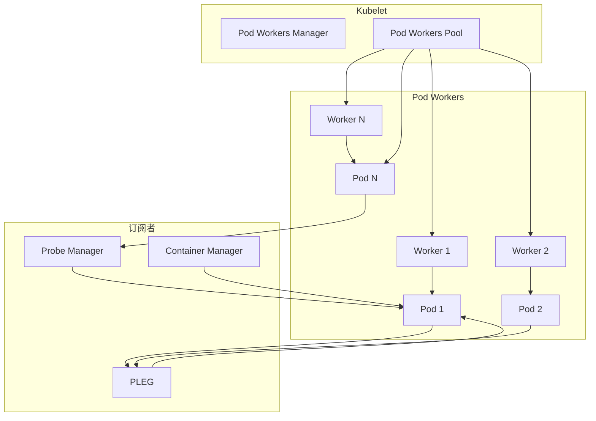
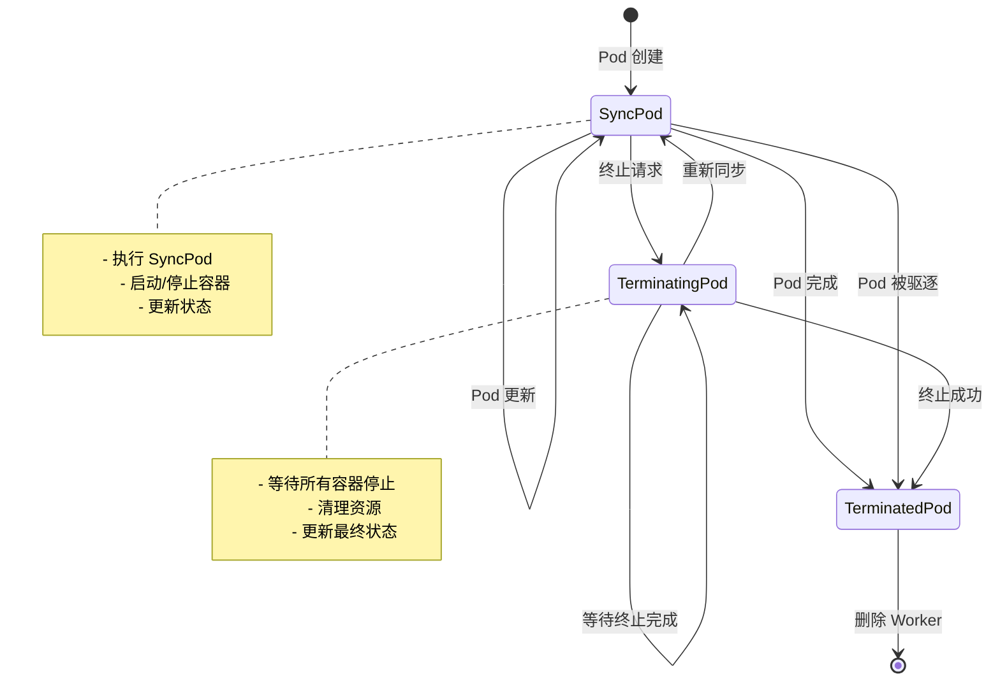
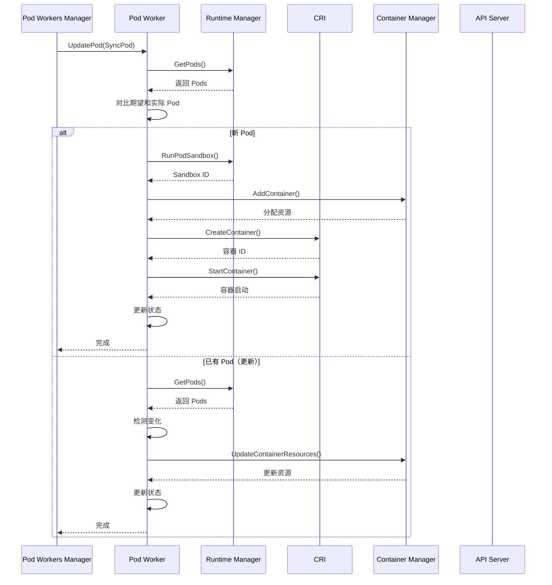
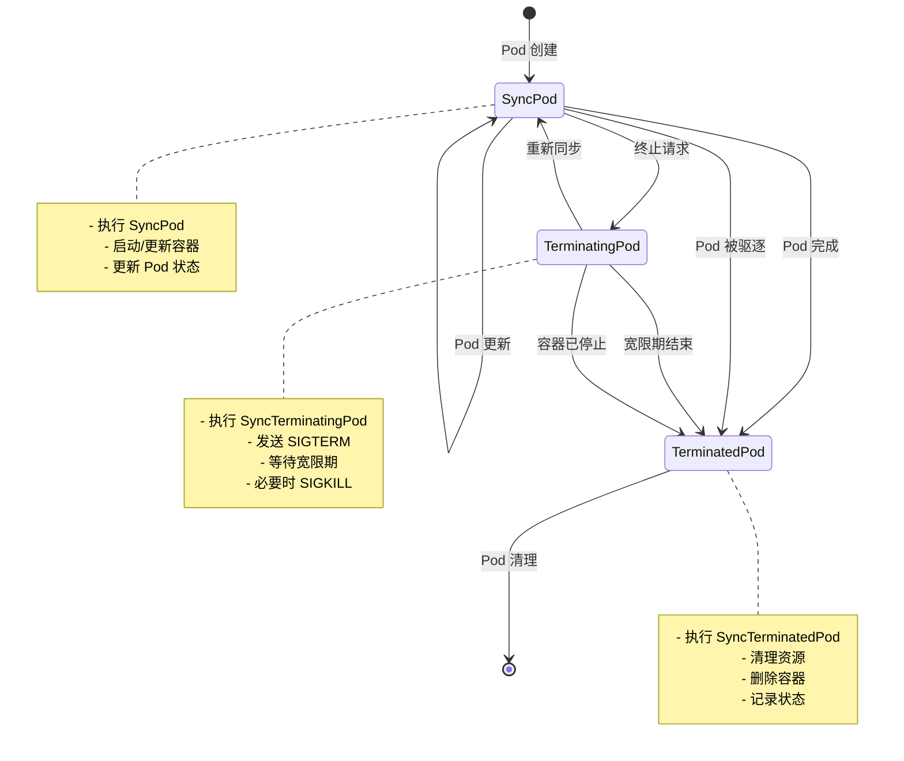
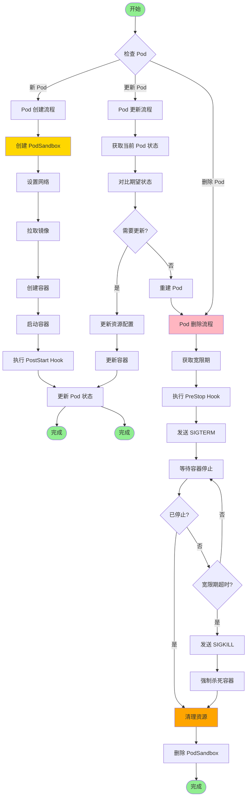
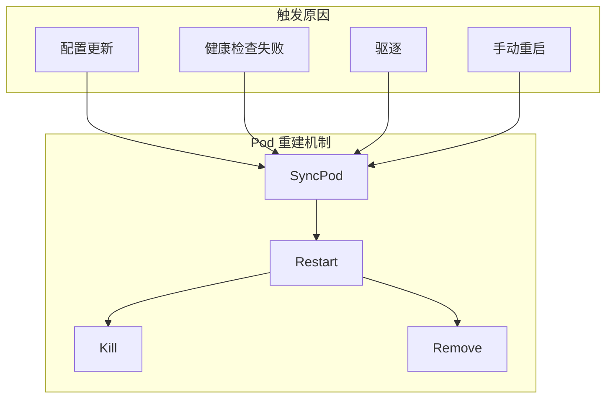

# Kubelet Pod Worker 深度分析

> 本文档深入分析 Kubelet 的 Pod Worker 机制，包括 Pod Worker 状态机、SyncHandler 接口、Pod 调度流程、重建机制和性能优化。

---

## 目录

1. [Pod Worker 架构](#pod-worker-架构)
2. [Pod Worker 状态机](#pod-worker-状态机)
3. [SyncHandler 接口](#synchandler-接口)
4. [Pod 调度流程](#pod-调度流程)
5. [Pod 重建机制](#pod-重建机制)
6. [镜像拉取并发控制](#镜像拉取并发控制)
7. [性能优化](#性能优化)
8. [最佳实践](#最佳实践)

---

## Pod Worker 架构

### Pod Worker 概述

Pod Worker 是 Kubelet 管理 Pod 生命周期的核心组件，每个 Pod 有一个独立的 Worker：



### Pod Workers 接口

**位置**: `pkg/kubelet/pod_workers.go`

```go
// PodWorkers 管理所有 Pod Worker
type PodWorkers interface {
    // UpdatePod 通知 Pod Worker 更新
    UpdatePod(options UpdatePodOptions) error
    
    // SyncKnownPods 同步已知的 Pods
    SyncKnownPods(desiredPods []*v1.Pod) (knownPods map[types.UID]PodWorkerSync)
    
    // IsPodKnownTerminated 检查 Pod 是否已终止
    IsPodKnownTerminated(uid types.UID) bool
    
    // IsPodForMirrorPodTerminating 检查镜像 Pod 是否终止
    IsPodForMirrorPodTerminating(podFullname string) bool
    
    // CouldHaveRunningContainers 是否可能有运行中的容器
    CouldHaveRunningContainers(uid types.UID) bool
    
    // ShouldPodBeFinished Pod 是否完成
    ShouldPodBeFinished(uid types.UID) bool
}
```

### PodWorkerSync 状态

```go
// PodWorkerSync 描述 Worker 的状态
type PodWorkerSync struct {
    // State Worker 状态
    State PodWorkerState
    
    // Orphan Pod 不在期望的 Pod 集合中
    Orphan bool
    
    // HasConfig 是否有历史配置
    HasConfig bool
    
    // Static 是否为静态 Pod
    Static bool
}

// PodWorkerState Worker 状态
type PodWorkerState int

const (
    // SyncPod 正在同步
    SyncPod PodWorkerState = iota
    
    // TerminatingPod 正在终止
    TerminatingPod
    
    // Terminated Pod 已终止
    TerminatedPod
)

func (state PodWorkerState) String() string {
    switch state {
    case SyncPod:
        return "sync"
    case TerminatingPod:
        return "terminating"
    case TerminatedPod:
        return "terminated"
    default:
        panic(fmt.Sprintf("the state %d is not defined", state))
}
```

### UpdatePodOptions

```go
// UpdatePodOptions 更新 Pod 的选项
type UpdatePodOptions struct {
    // UpdateType 更新类型
    UpdateType kubetypes.SyncPodType
    
    // StartTime 更新开始时间（用于指标）
    StartTime time.Time
    
    // MirrorPod 镜像 Pod
    MirrorPod *v1.Pod
    
    // RunningPod 运行中的 Pod（用于 Runtime Pod）
    RunningPod *kubecontainer.Pod
    
    // Pod Pod 对象
    Pod *v1.Pod
}
```

---

## Pod Worker 状态机

### Pod Worker 状态转换



### SyncPod 状态

**SyncPod**：Pod 正在同步和运行

- 执行 `SyncPod` 操作
- 启动/停止容器
- 更新 Pod 状态
- 响应 Pod 更新

### TerminatingPod 状态

**TerminatingPod**：Pod 正在被终止

- 等待所有容器停止
- 清理资源（卷、设备）
- 执行 PreStop Hook
- 调用 `SyncTerminatingPod`

### TerminatedPod 状态

**TerminatedPod**：Pod 已完全终止

- 所有容器已停止
- 资源已清理
- 更新最终状态到 API Server
- Worker 可被删除

---

## SyncHandler 接口

### PodSyncer 接口

```go
// PodSyncer Pod 同步器接口
type PodSyncer interface {
    // SyncPod 同步 Pod
    SyncPod(ctx context.Context, updateType kubetypes.SyncPodType, pod *v1.Pod, mirrorPod *v1.Pod, podStatus *kubecontainer.PodStatus) (bool, error)
    
    // SyncTerminatingPod 终止 Pod
    SyncTerminatingPod(ctx context.Context, pod *v1.Pod, podStatus *kubecontainer.PodStatus, gracePeriod *int64, podStatusFn func(*v1.PodStatus)) error
    
    // SyncTerminatedPod 同步终止的 Pod
    SyncTerminatedPod(ctx context.Context, pod *v1.Pod, podStatus *kubecontainer.PodStatus) error
}

// PodSyncerFuncs Pod Syncer 的函数实现
type PodSyncerFuncs struct {
    syncPod                   syncPodFnType
    syncTerminatingPod        syncTerminatingPodFnType
    syncTerminatedPod         syncTerminatedPodFnType
}
```

### PodSyncerFuncs 实现

**位置**: `pkg/kubelet/pod_workers.go`

```go
func newPodSyncerFuncs(
    syncPodFunc syncPodFnType,
    syncTerminatingPodFunc syncTerminatingPodFnType,
    syncTerminatedPodFunc syncTerminatedPodFnType,
) PodSyncerFuncs {
    return &PodSyncerFuncs{
        syncPod:              syncPodFunc,
        syncTerminatingPod: syncTerminatingPodFunc,
        syncTerminatedPod:  syncTerminatedPodFunc,
    }
}

// syncPodFnType 同步函数类型
type syncPodFnType func(ctx context.Context, updateType kubetypes.SyncPodType, pod *v1.Pod, mirrorPod *v1.Pod, podStatus *kubecontainer.PodStatus) (bool, error)

// syncTerminatingPodFnType 终止函数类型
type syncTerminatingPodFnType func(ctx context.Context, pod *v1.Pod, podStatus *kubecontainer.PodStatus, gracePeriod *int64, podStatusFn func(*v1.PodStatus)) error

// syncTerminatedPodFnType 终止同步函数类型
type syncTerminatedPodFnType func(ctx context.Context, pod *v1.Pod, podStatus *kubecontainer.PodStatus) error
```

---

## Pod 调度流程

### SyncPod 完整流程



### Pod Worker 状态机完整流程图



### Pod 创建和删除完整流程图



### SyncPod 实现

**位置**: `pkg/kubelet/pod_workers.go`

```go
// syncPod 同步 Pod
func syncPod(ctx context.Context, pod *v1.Pod, mirrorPod *v1.Pod, podStatus *kubecontainer.PodStatus, podWorkerSync PodWorkerSync) (bool, error) {
    logger := klog.FromContext(ctx)
    
    // 1. 检查是否为孤儿镜像 Pod
    if isMirrorPod(pod) && podWorkerSync.Orphan {
        logger.Info("Orphan mirror pod detected, removing", "pod", klog.KObj(pod))
        return false, nil
    }
    
    // 2. 获取运行时状态
    runningPod, err := kl.podManager.GetPod(ctx, pod.UID)
    if err != nil {
        return false, err
    }
    
    // 3. 调用 Runtime Manager 同步
    result, err := kl.runtime.SyncPod(ctx, pod, runningPod)
    if err != nil {
        return false, err
    }
    
    // 4. 更新 Pod 状态
    return result, nil
}
```

### SyncTerminatingPod 实现

```go
// SyncTerminatingPod 终止 Pod
func SyncTerminatingPod(ctx context.Context, pod *v1.Pod, podStatus *kubecontainer.PodStatus, gracePeriod *int64, podStatusFn func(*v1.PodStatus)) error {
    logger := klog.FromContext(ctx)
    
    // 1. 杀死 Pod Sandbox
    err := kl.runtime.KillPodSandbox(ctx, pod.UID)
    if err != nil {
        return fmt.Errorf("failed to kill pod sandbox: %w", err)
    }
    
    // 2. 等待容器停止
    err = kl.containerManager.WaitForTermination(pod.UID, gracePeriod, func(updatedPodStatus *v1.PodStatus) {
        podStatusFn(updatedPodStatus)
    })
    if err != nil {
        return fmt.Errorf("failed to wait for pod termination: %w", err)
    }
    
    // 3. 清理资源
    err = kl.containerManager.CleanupPodResources(ctx, pod.UID)
    if err != nil {
        return fmt.Errorf("failed to clean up pod resources: %w", err)
    }
    
    return nil
}
```

### SyncTerminatedPod 实现

```go
// SyncTerminatedPod 同步终止的 Pod
func SyncTerminatedPod(ctx context.Context, pod *v1.Pod, podStatus *kubecontainer.PodStatus) error {
    logger := klog.FromContext(ctx)
    
    // 1. 检查是否已删除
    _, err := kl.podManager.GetPod(ctx, pod.UID)
    if err != nil {
        return err
    }
    
    // 2. 更新最终状态到 API Server
    status := kl.statusManager.GetPodStatus(pod)
    status.Phase = v1.PodSucceeded
    
    if _, err := kl.podManager.SetPodStatus(ctx, pod, status); err != nil {
        return fmt.Errorf("failed to set pod status: %w", err)
    }
    
    logger.Info("Pod terminated", "pod", klog.KObj(pod), "status", status)
    return nil
}
```

---

## Pod 重建机制

### Pod 重建类型



### Restart 实现

```go
// Restart 重启 Pod
func Restart(pod *v1.Pod) error {
    logger := klog.FromContext(ctx)
    
    // 1. 获取当前状态
    status := kl.statusManager.GetPodStatus(pod)
    
    // 2. 增加 restart 计数
    status.ContainerStatuses[0].RestartCount++
    
    // 3. 更新状态
    if _, err := kl.podManager.SetPodStatus(ctx, pod, status); err != nil {
        return err
    }
    
    logger.Info("Pod restarted", "pod", klog.KObj(pod), "restartCount", status.ContainerStatuses[0].RestartCount)
    return nil
}
```

### Kill 实现

```go
// Kill 杀死 Pod
func Kill(pod *v1.Pod, gracePeriodSeconds int64, killOptions *KillPodOptions) error {
    logger := klog.FromContext(ctx)
    
    // 1. 设置终止时间
    gracePeriod := kl.getTerminationGracePeriodSeconds(pod, gracePeriodSeconds)
    
    // 2. 更新状态为 Terminating
    status := kl.statusManager.GetPodStatus(pod)
    status.Phase = v1.PodFailed
    status.Reason = "Shutdown"
    
    if _, err := kl.podManager.SetPodStatus(ctx, pod, status); err != nil {
        return err
    }
    
    // 3. 调用 Worker 终止
    podWorkers.UpdatePod(UpdatePodOptions{
        UpdateType: kubetypes.SyncPodKill,
        Pod:        pod,
        StartTime:  time.Now(),
    })
    
    logger.Info("Pod killed", "pod", klog.KObj(pod), "gracePeriod", gracePeriod)
    return nil
}
```

### Remove 实现

```go
// Remove 移除 Pod
func Remove(pod *v1.Pod) error {
    logger := klog.FromContext(ctx)
    
    // 1. 获取当前状态
    status := kl.statusManager.GetPodStatus(pod)
    
    // 2. 设置终止时间
    gracePeriod := kl.getTerminationGracePeriodSeconds(pod, 0)
    
    // 3. 更新状态为 Failed
    status.Phase = v1.PodFailed
    status.Reason = "Deleted"
    status.Message = "Pod removed by user"
    
    if _, err := kl.podManager.SetPodStatus(ctx, pod, status); err != nil {
        return err
    }
    
    // 4. 调用 Worker 终止
    podWorkers.UpdatePod(UpdatePodOptions{
        UpdateType: kubetypes.SyncPodRemove,
        Pod:        pod,
        StartTime:  time.Now(),
    })
    
    logger.Info("Pod removed", "pod", klog.KObj(pod))
    return nil
}
```

---

## 镜像拉取并发控制

### 并发拉取器

```go
// SerialPuller 串行拉取器
type SerialPuller struct {
    puller images.Puller
}

func (p *SerialPuller) PullImage(image string, pod *v1.Pod, pullSecrets []v1.Secret) (string, error) {
    return p.puller.PullImage(image, pod, pullSecrets)
}

// ParallellPuller 并发拉取器
type ParallellPuller struct {
    puller        images.Puller
    maxParallel   int
    sem           chan struct{}
}

func NewParallellPuller(puller images.Puller, maxParallel int) *ParallellPuller {
    return &ParallellPuller{
        puller:      puller,
        maxParallel: maxParallel,
        sem:         make(chan struct{}, maxParallel),
    }
}

func (p *ParallellPuller) PullImage(image string, pod *v1.Pod, pullSecrets []v1.Secret) (string, error) {
    p.sem <- struct{}        // 获取信号量
    defer func() { <-p.sem }() // 释放信号量
    
    return p.puller.PullImage(image, pod, pullSecrets)
}
```

### 并发拉取配置

```yaml
apiVersion: kubelet.config.k8s.io/v1beta1
kind: KubeletConfiguration
# 镜像拉取并发控制
serializeImagePulls: false
# 最大并发拉取数
maxParallelImagePulls: 5
# 镜像拉取超时
imagePullProgressDeadline: 10m
```

### 镜像拉取优化

| 优化策略 | 说明 | 配置 |
|----------|------|------|
| **串行拉取** | 一次拉取一个镜像 | `serializeImagePulls: true` |
| **并发拉取** | 多个镜像并行拉取 | `maxParallelImagePulls: 5` |
| **镜像缓存** | 使用本地镜像避免重复拉取 | - |
| **镜像预拉取** | 在 Pod 创建前预拉取镜像 | - |

---

## 性能优化

### Pod 启动优化

#### 1. 并发 Pod 同步

```go
// 并发同步多个 Pods
func (pm *podWorkersManager) syncPods(pods []*v1.Pod) {
    var wg sync.WaitGroup
    for _, pod := range pods {
        wg.Add(1)
        go func(p *v1.Pod) {
            defer wg.Done()
            pm.UpdatePod(UpdatePodOptions{
                Pod:        pod,
                UpdateType: kubetypes.SyncPodCreate,
            })
        }(pod)
    }
    wg.Wait()
}
```

#### 2. 容器预创建

```go
// 预创建容器配置
func (kl *Kubelet) preCreateContainers(pod *v1.Pod) error {
    // 1. 提前生成容器配置
    configs := kl.generateContainerConfigs(pod)
    
    // 2. 提前分配资源
    allocations := kl.containerManager.AllocateResources(pod)
    
    // 3. 并发创建容器
    return kl.runtime.CreateContainers(ctx, configs, allocations)
}
```

### 状态缓存优化

```go
// Pod 状态缓存
type PodStatusCache struct {
    sync.RWMutex
    cache map[types.UID]*v1.PodStatus
}

func (c *PodStatusCache) Get(podUID types.UID) (*v1.PodStatus, bool) {
    c.RLock()
    defer c.RUnlock()
    status, ok := c.cache[podUID]
    return status, ok
}

func (c *PodStatusCache) Set(podUID types.UID, status *v1.PodStatus) {
    c.Lock()
    defer c.Unlock()
    c.cache[podUID] = status
}
```

### 批量状态更新

```go
// 批量更新 Pod 状态到 API Server
func (kl *Kubelet) batchUpdatePodStatus(pods []*v1.Pod) error {
    statuses := make([]*v1.PodStatus, len(pods))
    for i, pod := range pods {
        statuses[i] = kl.statusManager.GetPodStatus(pod)
    }
    
    // 批量更新
    if _, err := kl.client.PatchStatuses(statuses...); err != nil {
        return fmt.Errorf("failed to batch update pod statuses: %w", err)
    }
    
    return nil
}
```

---

## 最佳实践

### 1. Pod Worker 配置

#### 镜像拉取并发

```yaml
apiVersion: kubelet.config.k8s.io/v1beta1
kind: KubeletConfiguration
# 并发镜像拉取
maxParallelImagePulls: 5
# 镜像拉取超时
imagePullProgressDeadline: 10m
```

#### Pod 启动并发

```yaml
apiVersion: kubelet.config.k8s.io/v1beta1
kind: KubeletConfiguration
# Pod 启动并发
syncPodMaxWorkers: 10
# Pod 同步间隔
syncPodPeriod: 10s
# Pod 同步超时
syncPodTimeout: 2m
```

#### 镜像缓存

```yaml
apiVersion: kubelet.config.k8s.io/v1beta1
kind: KubeletConfiguration
# 镜像缓存
imageMaximumGCAge: 168h
imageMinimumGCAge: 2h
imageGCHighThresholdPercent: 85
imageGCLowThresholdPercent: 80
```

### 2. 监控和调优

#### Pod Worker 指标

```go
var (
    PodWorkerDuration = metrics.NewHistogramVec(
        &metrics.HistogramOpts{
            Subsystem:      "kubelet",
            Name:           "pod_worker_duration_seconds",
            Help:           "Duration in seconds for pod worker operations",
            StabilityLevel: metrics.ALPHA,
        },
        []string{"operation_type", "pod", "namespace"},
    )
    
    PodWorkerErrors = metrics.NewCounterVec(
        &metrics.CounterOpts{
            Subsystem:      "kubelet",
            Name:           "pod_worker_errors_total",
            Help:           "Cumulative number of pod worker errors",
            StabilityLevel: metrics.ALPHA,
        },
        []string{"operation_type", "pod", "namespace"},
    )
)
```

#### Pod Worker 状态监控

```bash
# 查看 Pod Worker 状态
kubectl get pods -o custom-columns=NAME:.metadata.name,UID:.metadata.uid,STATUS:.status.phase,RESTARTS:.status.containerStatuses[*].restartCount

# 查看 Pod 事件
kubectl describe pod <pod-name> | grep -A 10 "Events:"
```

### 3. 故障排查

#### Pod 无法启动

```bash
# 检查 Pod 状态
kubectl describe pod <pod-name>

# 查看 Pod 事件
kubectl get events --sort-by='.lastTimestamp' --field-selector involvedObject.name=<pod-name>

# 查看 Kubelet 日志
journalctl -u kubelet -f | grep -i "pod.*<pod-uid>"
```

#### Pod 卡在 Terminating 状态

```bash
# 检查是否为孤儿镜像 Pod
kubectl get pods -A | grep -i mirror

# 查看 Kubelet 日志
journalctl -u kubelet -f | grep -i "terminating"

# 检查容器状态
kubectl exec -it <pod-name> -- ps aux
```

#### Pod Worker 性能问题

```bash
# 检查 Worker 数量
kubectl logs -n kube-system -l component=kubelet | grep "pod.*workers"

# 检查 Pod 同步延迟
kubectl logs -n kube-system -l component=kubelet | grep "sync.*duration"

# 检查资源分配
kubectl describe node <node-name> | grep -A 10 "Allocatable"
```

### 4. 优化建议

#### 减少 Pod Worker 开销

```yaml
apiVersion: v1
kind: Pod
metadata:
  name: optimized-pod
spec:
  # 减少容器数量
  containers:
  - name: app
    image: my-app:latest
    # 使用 Init Container
    initContainers:
    - name: init
      image: my-init:latest
```

#### 优化镜像拉取

```yaml
apiVersion: kubelet.config.k8s.io/v1beta1
kind: KubeletConfiguration
# 使用本地镜像仓库
registryPullQPS: 10
# 镜像拉取带宽限制
registryBurst: 20
```

#### 优化 Pod 同步

```yaml
apiVersion: kubelet.config.k8s.io/v1beta1
kind: KubeletConfiguration
# 增加 Worker 数量
syncPodMaxWorkers: 20
# 减少 Pod 同步间隔
syncPodPeriod: 5s
```

---

## 总结

### 核心要点

1. **Pod Worker 架构**：每个 Pod 有一个独立 Worker，通过 Pod Workers Manager 管理
2. **Pod Worker 状态机**：SyncPod → TerminatingPod → Terminated
3. **SyncHandler 接口**：SyncPod、SyncTerminatingPod、SyncTerminatedPod 三个核心方法
4. **Pod 调度流程**：Runtime Manager → Container Manager → CRI → 状态更新
5. **重建机制**：Restart、Kill、Remove 三种方式
6. **并发控制**：镜像拉取并发控制，优化启动性能
7. **性能优化**：容器预创建、批量状态更新、状态缓存

### 关键路径

```
Pod 创建 → UpdatePod(SyncPod) → Worker 创建 → SyncPod → 
Runtime Manager → Container Manager → CRI → 容器启动 → 状态更新

Pod 终止 → UpdatePod(Kill) → Worker 终止 → SyncTerminatingPod → 
Runtime Manager → 等待停止 → 清理资源 → SyncTerminatedPod → 最终状态
```

### 推荐阅读

- [Pod Lifecycle](https://kubernetes.io/docs/concepts/workloads/pods/pod-lifecycle/)
- [Configure Pod Grace Period](https://kubernetes.io/docs/concepts/workloads/pods/pod/#termination-of-pods)
- [Configure Container Probes](https://kubernetes.io/docs/tasks/configure-pod-container/configure-liveness-readiness-startup-probes/)
- [Kubelet Configuration](https://kubernetes.io/docs/reference/config-api/kubelet-config.v1beta1/)

---

**文档版本**：v1.0
**创建日期**：2026-03-04
**维护者**：AI Assistant
**Kubernetes 版本**：v1.28+
