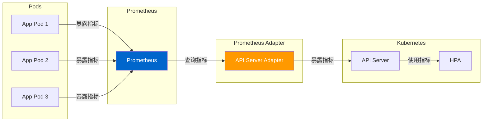

# Prometheus Adapter 深度分析

> 本文档深入分析 Prometheus Adapter，包括 Custom Metrics API、External Metrics API、HPA 自定义指标和最佳实践。

---

## Prometheus Adapter 概述

### 作用

Prometheus Adapter 允许 Kubernetes 使用 Prometheus 中的指标作为扩展指标：



### 核心组件

| 组件 | 说明 |
|------|------|
| **Custom Metrics API** | 提供自定义指标 API |
| **External Metrics API** | 提供外部指标 API |
| **HPA 集成** | 水平 Pod 自动伸缩 |
| **Metric Discovery** | 自动发现 Prometheus 指标 |

---

## Custom Metrics API

### 概述

Custom Metrics API 允许 HPA 使用自定义指标：

```yaml
apiVersion: autoscaling/v2
kind: HorizontalPodAutoscaler
metadata:
  name: myapp-hpa
spec:
  scaleTargetRef:
    apiVersion: apps/v1
    kind: Deployment
    name: myapp
  minReplicas: 1
  maxReplicas: 10
  metrics:
  - type: Pods
    pods:
      metric:
        name: http_requests_per_second
      target:
        type: AverageValue
        averageValue: "100"
```

### 实现原理

**位置**：`pkg/api/v1beta1/custom_metrics_types.go`

```go
// MetricValue 指标值
type MetricValue struct {
    // DescribedObject 对象引用
    DescribedObject v1.ObjectReference

    // Metric 指标名称
    Metric v1beta2.MetricIdentifier

    // Value 指标值
    Value resource.Quantity

    // Timestamp 时间戳
    Timestamp metav1.Time
}

// MetricValueList 指标值列表
type MetricValueList struct {
    metav1.TypeMeta
    metav1.ListMeta

    // Items 指标值列表
    Items []MetricValue
}
```

---

## External Metrics API

### 概述

External Metrics API 允许 HPA 使用外部指标（如队列长度、数据库连接数）：

```yaml
apiVersion: autoscaling/v2
kind: HorizontalPodAutoscaler
metadata:
  name: myapp-hpa
spec:
  scaleTargetRef:
    apiVersion: apps/v1
    kind: Deployment
    name: myapp
  minReplicas: 1
  maxReplicas: 10
  metrics:
  - type: External
    external:
      metric:
        name: queue_messages_ready
      target:
        type: AverageValue
        averageValue: "1000"
```

### 实现原理

**位置**：`pkg/api/v1beta1/external_metrics_types.go`

```go
// ExternalMetricValue 外部指标值
type ExternalMetricValue struct {
    // MetricName 指标名称
    MetricName string

    // MetricLabels 指标标签
    MetricLabels v1.LabelSelector

    // Value 指标值
    Value resource.Quantity
}

// ExternalMetricValueList 外部指标值列表
type ExternalMetricValueList struct {
    metav1.TypeMeta
    metav1.ListMeta

    // Items 指标值列表
    Items []ExternalMetricValue
}
```

---

## Prometheus Adapter 配置

### 配置文件

**位置**：`deploy/config.yaml`

```yaml
apiVersion: v1
kind: ConfigMap
metadata:
  name: prometheus-adapter-config
  namespace: custom-metrics
data:
  config.yaml: |
    discovery:
      url: http://prometheus-service.monitoring.svc:9090
    rules:
    - seriesQuery: '{__name__=~"^container_.*"}'
      seriesFilters: []
      resources:
        overrides:
          container: { resource: "container" }
      name:
        matches: "^(.*)_total$"
        as: "${1}_per_second"
      metricsQuery: (sum(rate(<<.Series>>{<<.LabelMatchers>>}[2m])) by (<<.GroupBy>>))
    - seriesQuery: '{__name__=~"^http_.*"}'
      seriesFilters: []
      resources:
        template: <<.Resource>>
      name:
        matches: "^http_(.*)_(.*)$"
        as: "http_${1}_total"
      metricsQuery: sum(rate(<<.Series>>{<<.LabelMatchers>>}[2m])) by (<<.GroupBy>>)
```

### 部署

```yaml
apiVersion: apps/v1
kind: Deployment
metadata:
  name: prometheus-adapter
  namespace: custom-metrics
spec:
  replicas: 1
  selector:
    matchLabels:
      name: prometheus-adapter
  template:
    metadata:
      labels:
        name: prometheus-adapter
    spec:
      containers:
      - name: prometheus-adapter
        image: directxman12/k8s-prometheus-adapter-amd64:v0.9.1
        args:
        - --cert-dir=/var/run/adapter
        - --v=4
        - --prometheus-url=http://prometheus-service.monitoring.svc:9090
        - --metrics-relist-interval=30s
        - --v=4
        ports:
        - containerPort: 443
        volumeMounts:
        - mountPath: /var/run/adapter
          name: tmpfs
      volumes:
      - name: tmpfs
        emptyDir: {}
```

---

## HPA 自定义指标

### 使用 Custom Metrics

```yaml
apiVersion: autoscaling/v2
kind: HorizontalPodAutoscaler
metadata:
  name: myapp-hpa
spec:
  scaleTargetRef:
    apiVersion: apps/v1
    kind: Deployment
    name: myapp
  minReplicas: 2
  maxReplicas: 10
  metrics:
  - type: Pods
    pods:
      metric:
        name: http_requests_per_second
      target:
        type: AverageValue
        averageValue: "100"
```

### 使用 External Metrics

```yaml
apiVersion: autoscaling/v2
kind: HorizontalPodAutoscaler
metadata:
  name: queue-hpa
spec:
  scaleTargetRef:
    apiVersion: apps/v1
    kind: Deployment
    name: worker
  minReplicas: 1
  maxReplicas: 10
  metrics:
  - type: External
    external:
      metric:
        name: queue_messages_ready
      target:
        type: AverageValue
        averageValue: "1000"
```

---

## 指标转换

### 指标查询

```yaml
rules:
- seriesQuery: '{__name__=~"^http_.*"}'
  resources:
    template: <<.Resource>>
  name:
    matches: "^http_(.*)_(.*)$"
    as: "http_${1}_total"
  metricsQuery: sum(rate(<<.Series>>{<<.LabelMatchers>>}[2m])) by (<<.GroupBy>>)
```

### 指标发现

```yaml
discovery:
  url: http://prometheus-service.monitoring.svc:9090
  refreshInterval: 30s
```

---

## 最佳实践

### 1. 合理设置目标值

```yaml
apiVersion: autoscaling/v2
kind: HorizontalPodAutoscaler
spec:
  metrics:
  - type: Pods
    pods:
      metric:
        name: cpu_usage_percentage
      target:
        type: AverageValue
        averageValue: "80"  # 80% CPU 使用率
```

### 2. 使用多个指标

```yaml
apiVersion: autoscaling/v2
kind: HorizontalPodAutoscaler
spec:
  metrics:
  - type: Resource
    resource:
      name: cpu
      target:
        type: Utilization
        averageUtilization: 80
  - type: Pods
    pods:
      metric:
        name: http_requests_per_second
      target:
        type: AverageValue
        averageValue: "100"
```

### 3. 监控 HPA 行为

```bash
# 查看 HPA 状态
kubectl get hpa

# 查看 HPA 事件
kubectl describe hpa <hpa-name>
```

---

## 故障排查

### 问题 1：指标不可用

**症状**：HPA 显示 `unable to get metric`

**排查步骤**：

```bash
# 1. 检查 Prometheus Adapter 日志
kubectl logs -n custom-metrics deployment/prometheus-adapter

# 2. 检查 Prometheus 指标
kubectl exec -it -n custom-metrics deployment/prometheus-adapter -- \
  curl http://prometheus-service.monitoring.svc:9090/api/v1/query

# 3. 检查 Custom Metrics API
kubectl get --raw /apis/custom.metrics.k8s.io/v1beta1/namespaces/<namespace>/pods/<pod-name>/http_requests_per_second
```

### 问题 2：HPA 不扩容

**症状**：指标超出目标值但副本数不增加

**排查步骤**：

```bash
# 1. 查看 HPA 状态
kubectl get hpa <hpa-name> -o yaml

# 2. 查看 HPA 事件
kubectl describe hpa <hpa-name> | grep -A 5 "Able to scale"

# 3. 检查指标值
kubectl get --raw /apis/custom.metrics.k8s.io/v1beta1/namespaces/<namespace>/pods/<pod-name>/http_requests_per_second
```

---

## 总结

### 关键要点

1. **Custom Metrics**：提供自定义指标 API
2. **External Metrics**：提供外部指标 API
3. **HPA 集成**：支持自定义指标的自动扩缩容
4. **Prometheus 集成**：从 Prometheus 查询指标
5. **自动发现**：自动发现和注册指标
6. **灵活配置**：支持多种查询和转换规则

### 源码位置

| 组件 | 位置 |
|------|------|
| Prometheus Adapter | `github.com/DirectXMan12/k8s-prometheus-adapter/` |
| Custom Metrics API | `pkg/api/v1beta1/custom_metrics_types.go` |
| External Metrics API | `pkg/api/v1beta1/external_metrics_types.go` |

### 相关资源

- [Prometheus Adapter 文档](https://github.com/DirectXMan12/k8s-prometheus-adapter)
- [Kubernetes HPA 文档](https://kubernetes.io/docs/tasks/run-application/horizontal-pod-autoscale/)
- [Prometheus 查询语法](https://prometheus.io/docs/prometheus/latest/querying/basics/)

---

::: tip 最佳实践
1. 合理设置目标值，避免频繁扩缩容
2. 使用多个指标，综合考虑
3. 监控 HPA 行为，及时调整
4. 定期检查 Prometheus Adapter 日志
:::

::: warning 注意事项
- Prometheus Adapter 需要 Prometheus 指标
- 指标查询语法正确性很重要
- 避免过于复杂的查询规则
:::
