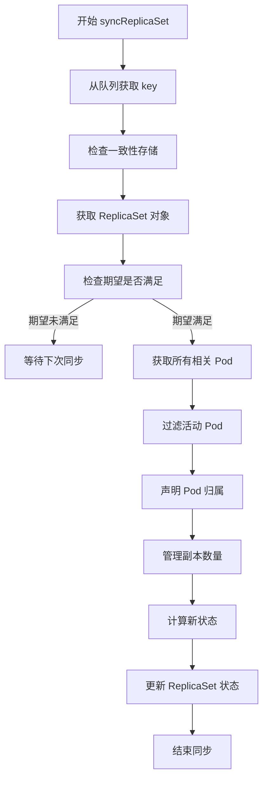

# Kubernetes ReplicaSet Controller 源码深度分析

## 1. 概述 - ReplicaSet Controller 的职责和作用

ReplicaSet Controller 是 Kubernetes 控制平面中的核心控制器之一，负责维护指定数量的 Pod 副本，确保系统始终期望运行着与 ReplicaSet 规范匹配的 Pod 数量。

### 核心职责

- **Pod 副本管理**：监控和管理 Pod 的创建、删除和更新
- **Pod 生命周期管理**：处理 Pod 的各种状态变化
- **控制器引用管理**：通过 ControllerRef 机制建立 ReplicaSet 与 Pod 的所有权关系
- **Pod 模板同步**：当 Pod 模板发生变化时，确保新 Pod 使用更新后的模板
- **服务可用性保证**：通过 MinReadySeconds 机制确保 Pod 真正可用后才标记为 Ready

### 设计特点

- **期望模式**：使用期望机制来跟踪创建和删除操作，避免不必要的重试
- **批量处理**：采用慢启动算法批量处理 Pod 创建，防止 API 服务器过载
- **优先级处理**：删除 Pod 时优先选择启动早期的 Pod
- **容错机制**：具备重试、指数退避等容错机制

## 2. 目录结构

```
pkg/controller/replicaset/
├── config/                          # 配置相关
├── doc.go                          # 包级文档
├── metrics/                        # 指标收集
├── replica_set.go                  # 主要实现代码
├── replica_set_utils.go            # 工具函数
└── *_test.go                       # 单元测试
```

## 3. 核心机制

### 3.1 Pod 副本管理

```go
// manageReplicas 核心逻辑
diff := len(activePods) - int(*(rs.Spec.Replicas))
if diff < 0 {
    // 需要创建更多 Pod
    successfulCreations, err := slowStartBatch(diff, controller.SlowStartInitialBatchSize, func() error {
        return rsc.podControl.CreatePods(ctx, rs.Namespace, &rs.Spec.Template, rs, metav1.NewControllerRef(rs, rsc.GroupVersionKind))
    })
} else if diff > 0 {
    // 需要删除多余的 Pod
    podsToDelete := getPodsToDelete(activePods, relatedPods, diff)
}
```

### 3.2 慢启动批量处理

```go
func slowStartBatch(count int, initialBatchSize int, fn func() error) (int, error) {
    remaining := count
    successes := 0
    for batchSize := min(remaining, initialBatchSize); batchSize > 0; batchSize = min(2*batchSize, remaining) {
        // 并发执行批量操作
        errCh := make(chan error, batchSize)
        var wg sync.WaitGroup
        wg.Add(batchSize)
        for i := 0; i < batchSize; i++ {
            go func() {
                defer wg.Done()
                if err := fn(); err != nil {
                    errCh <- err
                }
            }()
        }
        wg.Wait()
        successes += batchSize - len(errCh)
        if len(errCh) > 0 {
            return successes, <-errCh
        }
        remaining -= batchSize
    }
    return successes, nil
}
```

## 4. 工作流程



## 5. 核心数据结构

```go
type ReplicaSetController struct {
    kubeClient clientset.Interface
    podControl controller.PodControlInterface
    podIndexer cache.Indexer
    eventBroadcaster record.EventBroadcaster
    burstReplicas int
    syncHandler func(ctx context.Context, rsKey string) error
    expectations *controller.UIDTrackingControllerExpectations
    rsLister appslisters.ReplicaSetLister
    podLister corelisters.PodLister
    queue workqueue.TypedRateLimitingInterface[string]
    clock clock.PassiveClock
}
```

## 6. 最佳实践

### 6.1 监控关键指标

- `replicaset_controller_sorting_deletion_age_ratio`：删除 Pod 的年龄比例
- `replicaset_controller_stale_sync_skips_total`：由于缓存过期跳过的同步次数

### 6.2 故障排除

1. **Pod 无法创建**：
   - 检查 ResourceQuota 限制
   - 检查 Node 资源是否充足
   - 查看 Pod 事件了解失败原因

2. **Pod 无法删除**：
   - 检查 Pod 是否有 Finalizer
   - 检查 Node 是否正常
   - 检查是否有 PVC 仍在使用

## 7. 总结

ReplicaSet Controller 通过期望管理、批处理、智能删除策略等机制实现了高效的 Pod 副本管理，是 Kubernetes 中设计精良的核心控制器。
