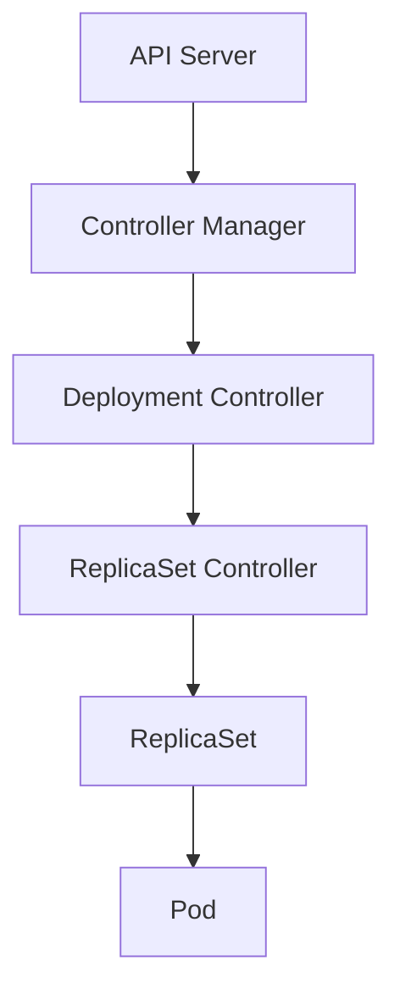
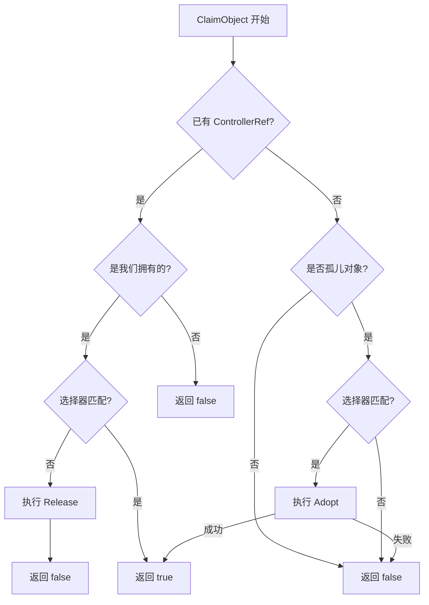
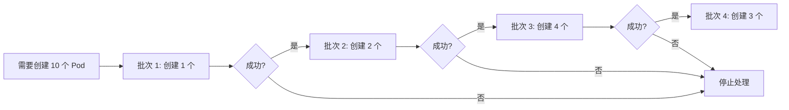
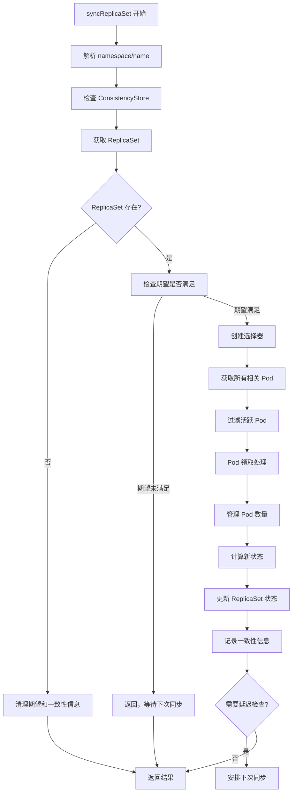
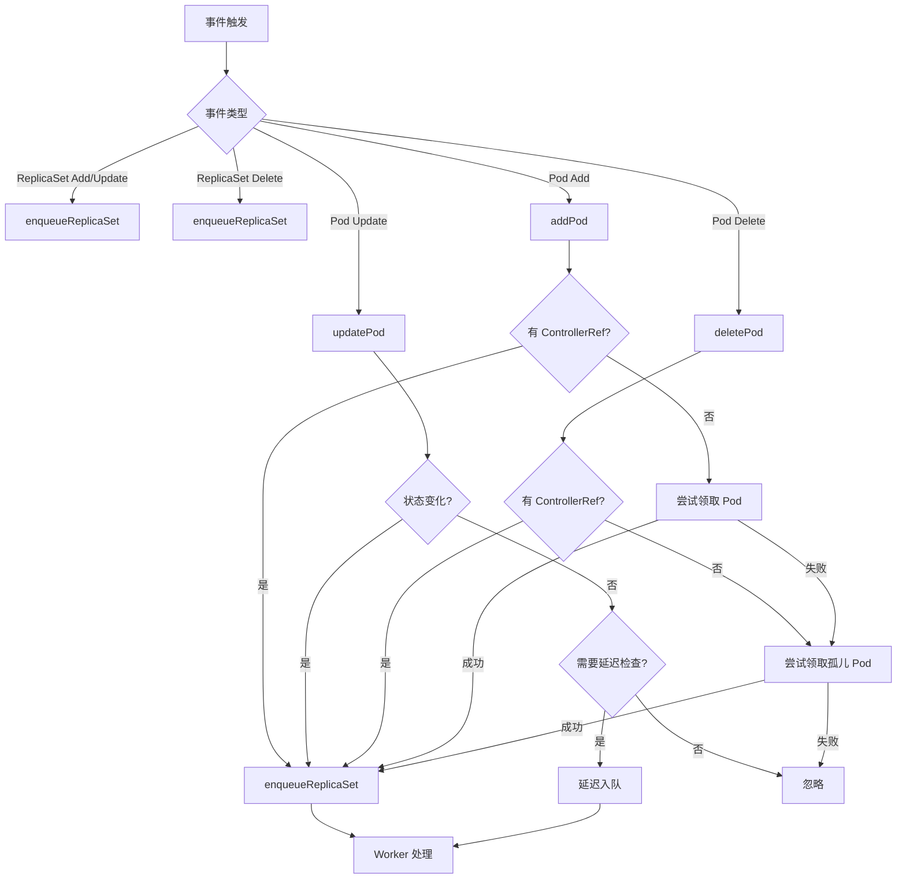

# Kubernetes ReplicaSet Controller 源码深度分析

## 1. 概述

ReplicaSet Controller 是 Kubernetes 控制平面中的核心控制器之一，负责维护指定数量的 Pod 副本，确保系统始终运行着与 ReplicaSet 规范匹配的 Pod 数量。

### 核心职责

- **Pod 副本管理**：监控和管理 Pod 的创建、删除和更新
- **Pod 生命周期管理**：处理 Pod 的各种状态变化
- **控制器引用管理**：通过 ControllerRef 机制建立 ReplicaSet 与 Pod 的所有权关系
- **Pod 模板同步**：当 Pod 模板发生变化时，确保新 Pod 使用更新后的模板
- **服务可用性保证**：通过 MinReadySeconds 机制确保 Pod 真正可用后才标记为 Ready

### 设计特点

- **期望模式**：使用期望机制来跟踪创建和删除操作，避免不必要的重试
- **批量处理**：采用慢启动算法批量处理 Pod 创建，防止 API 服务器过载
- **优先级处理**：删除 Pod 时优先选择启动早期的 Pod
- **容错机制**：具备重试、指数退避等容错机制

### 在 Kubernetes 架构中的位置



ReplicaSet Controller 通常由 Deployment Controller 间接管理，Deployment 通过创建和管理多个 ReplicaSet 来实现滚动更新和版本控制。

## 2. 目录结构

```
pkg/controller/replicaset/
├── config/                          # 配置相关
├── doc.go                          # 包级文档
├── metrics/                        # 指标收集
├── replica_set.go                  # 主要实现代码
├── replica_set_utils.go            # 工具函数
└── *_test.go                       # 单元测试
```

### 关键文件说明

- **replica_set.go**：主控制器实现，包含 ReplicaSetController 结构定义和核心同步逻辑
- **replica_set_utils.go**：工具函数库，包含慢启动、Pod 过滤、状态计算等辅助功能
- **metrics/**：监控指标收集和导出

## 3. 核心机制

### 3.1 期望机制（Expectations）

期望机制是 Kubernetes 控制器模式中的核心优化策略，用于：

1. **减少不必要的工作**：控制器只在期望的事件发生时才执行同步
2. **防止重复工作**：避免对同一操作的重复处理
3. **提高效率**：减少 API 调用和系统负载

#### 期望数据结构

```go
// ControlleeExpectations 跟踪每个控制器的期望创建/删除数量
type ControlleeExpectations struct {
    key               string
    expectedCreates   int32
    expectedDeletions int32
    createsObserved   int32
    deletionsObserved int32
}

// UIDTrackingControllerExpectations 跟踪删除pod的UID
type UIDTrackingControllerExpectations struct {
    ControllerExpectationsInterface
    uidStoreLock sync.Mutex
    uidStore     cache.Store
}
```

#### 期望满足检查

```go
// SatisfiedExpectations 检查期望是否满足
func (rsc *ReplicaSetController) syncReplicaSet(ctx context.Context, key string) error {
    // 检查期望是否满足
    rsNeedsSync := rsc.expectations.SatisfiedExpectations(logger, key)

    if rsNeedsSync && rs.DeletionTimestamp == nil {
        // 只有期望满足时才执行实际的副本管理
        manageReplicasErr = rsc.manageReplicas(ctx, activePods, rs)
    }
}
```

#### 期望创建和观察

```go
// manageReplicas 中的期望管理
diff := len(activePods) - int(*(rs.Spec.Replicas))

if diff < 0 {
    // 设置期望创建的pod数量
    rsc.expectations.ExpectCreations(logger, rsKey, -diff)

    // 批量创建pod
    successfulCreations, err := slowStartBatch(-diff, controller.SlowStartInitialBatchSize, func() error {
        return rsc.podControl.CreatePods(ctx, rs.Namespace, &rs.Spec.Template, rs, ...)
    })

    // 调整期望值（跳过的pod）
    if skippedPods := -diff - successfulCreations; skippedPods > 0 {
        for i := 0; i < skippedPods; i++ {
            rsc.expectations.CreationObserved(logger, rsKey)
        }
    }
} else if diff > 0 {
    // 设置期望删除的pod
    rsc.expectations.ExpectDeletions(logger, rsKey, getPodKeys(podsToDelete))
}
```

期望超时机制：期望会在 5 分钟后自动过期，防止控制器卡死。

### 3.2 ControllerRef 管理机制

ControllerRef 是 Kubernetes 中建立对象所有权关系的核心机制。

#### PodControllerRefManager 结构

```go
type PodControllerRefManager struct {
    BaseControllerRefManager
    controllerKind schema.GroupVersionKind
    podControl     PodControlInterface
    finalizers     []string
}
```

#### Pod 领取（Claim）流程

```go
func (rsc *ReplicaSetController) claimPods(ctx context.Context, rs *apps.ReplicaSet, selector labels.Selector, filteredPods []*v1.Pod) ([]*v1.Pod, error) {
    // 检查控制器是否可以领取（处理并发删除）
    canAdoptFunc := controller.RecheckDeletionTimestamp(func(ctx context.Context) (metav1.Object, error) {
        fresh, err := rsc.kubeClient.AppsV1().ReplicaSets(rs.Namespace).Get(ctx, rs.Name, metav1.GetOptions{})
        if err != nil {
            return nil, err
        }
        if fresh.UID != rs.UID {
            return nil, fmt.Errorf("original %v %v/%v is gone: got uid %v, wanted %v",
                rsc.Kind, rs.Namespace, rs.Name, fresh.UID, rs.UID)
        }
        return fresh, nil
    })

    // 创建ControllerRef管理器
    cm := controller.NewPodControllerRefManager(rsc.podControl, rs, selector, rsc.GroupVersionKind, canAdoptFunc)

    // 尝试领取pod
    return cm.ClaimPods(ctx, filteredPods)
}
```

#### 领取逻辑



### 3.3 Pod 删除排序算法

当需要删除多余 Pod 时，ReplicaSet 使用智能排序算法来选择要删除的 Pod：

```go
func getPodsToDelete(filteredPods, relatedPods []*v1.Pod, diff int) []*v1.Pod {
    // 如果要删除所有pod，不需要排序
    if diff < len(filteredPods) {
        // 按照相关Pod数量排序，优先删除节点上相关Pod多的Pod
        podsWithRanks := getPodsRankedByRelatedPodsOnSameNode(filteredPods, relatedPods)
        sort.Sort(podsWithRanks)

        // 报告删除年龄比例指标
        reportSortingDeletionAgeRatioMetric(filteredPods, diff)
    }
    return filteredPods[:diff]
}
```

#### 排序实现

```go
// getPodsRankedByRelatedPodsOnSameNode 为Pod分配排序等级
func getPodsRankedByRelatedPodsOnSameNode(podsToRank, relatedPods []*v1.Pod) controller.ActivePodsWithRanks {
    // 统计每个节点上的活跃Pod数量
    podsOnNode := make(map[string]int)
    for _, pod := range relatedPods {
        if controller.IsPodActive(pod) {
            podsOnNode[pod.Spec.NodeName]++
        }
    }

    // 为每个Pod分配排名（节点上相关Pod越多，排名越高，越容易被删除）
    ranks := make([]int, len(podsToRank))
    for i, pod := range podsToRank {
        ranks[i] = podsOnNode[pod.Spec.NodeName]
    }

    return controller.ActivePodsWithRanks{Pods: podsToRank, Rank: ranks, Now: metav1.Now()}
}
```

#### 排序算法的影响因素

1. **节点负载均衡**：优先删除节点上相关 Pod 更多的 Pod，实现更好的负载分布
2. **Pod 年龄**：在可选 Pod 中选择较老的 Pod 删除
3. **Pod 状态**：优先删除非 Ready 的 Pod
4. **启动阶段**：优先删除处于早期启动阶段的 Pod

### 3.4 慢启动批量处理机制

慢启动机制通过渐进式的批量处理来避免因配额限制等问题导致的 API 调用风暴：

```go
func slowStartBatch(count int, initialBatchSize int, fn func() error) (int, error) {
    remaining := count
    successes := 0

    for batchSize := min(remaining, initialBatchSize); batchSize > 0; batchSize = min(2*batchSize, remaining) {
        errCh := make(chan error, batchSize)
        var wg sync.WaitGroup
        wg.Add(batchSize)

        // 并发执行批次中的任务
        for i := 0; i < batchSize; i++ {
            go func() {
                defer wg.Done()
                if err := fn(); err != nil {
                    errCh <- err
                }
            }()
        }

        wg.Wait()
        curSuccesses := batchSize - len(errCh)
        successes += curSuccesses

        // 如果有失败，立即停止
        if len(errCh) > 0 {
            return successes, <-errCh
        }

        remaining -= batchSize
    }

    return successes, nil
}
```

#### 批量处理特点



1. **指数增长**：初始批大小为 1，后续批大小翻倍（1, 2, 4, 8...）
2. **快速失败**：任何批次失败后立即停止处理
3. **并发执行**：每个批次内的任务并发执行
4. **灵活调整**：通过 `SlowStartInitialBatchSize` 参数控制初始批大小

### 3.5 与 Deployment 的交互关系

ReplicaSet 通常由 Deployment 管理，Deployment 通过创建和协调多个 ReplicaSet 来实现滚动更新。

#### 架构关系

```
Deployment (管理多个)
    ↓
ReplicaSet (每个版本对应一个)
    ↓
Pod
```

#### 获取同控制器的所有 ReplicaSet

```go
// getReplicaSetsWithSameController 获取同一控制器下的所有ReplicaSet
func (rsc *ReplicaSetController) getReplicaSetsWithSameController(logger klog.Logger, rs *apps.ReplicaSet) []*apps.ReplicaSet {
    controllerRef := metav1.GetControllerOf(rs)
    if controllerRef == nil {
        return nil
    }

    // 通过索引查找所有具有相同控制器的ReplicaSet
    objects, err := rsc.rsIndexer.ByIndex(controllerUIDIndex, string(controllerRef.UID))
    // ...
    return relatedRSs
}
```

#### 获取间接相关的 Pod（用于删除排序）

```go
// getIndirectlyRelatedPods 获取相关Pod
func (rsc *ReplicaSetController) getIndirectlyRelatedPods(logger klog.Logger, rs *apps.ReplicaSet) ([]*v1.Pod, error) {
    var relatedPods []*v1.Pod
    seen := make(map[types.UID]*apps.ReplicaSet)

    // 获取同一控制器的所有ReplicaSet
    for _, relatedRS := range rsc.getReplicaSetsWithSameController(logger, rs) {
        // 获取每个ReplicaSet的Pod
        pods, err := rsc.podLister.Pods(relatedRS.Namespace).List(selector)
        // ...
    }

    return relatedPods, nil
}
```

## 4. 核心数据结构

### 4.1 ReplicaSetController 结构

```go
type ReplicaSetController struct {
    // GroupVersionKind indicates the controller type
    schema.GroupVersionKind

    kubeClient clientset.Interface
    podControl controller.PodControlInterface
    podIndexer cache.Indexer

    eventBroadcaster record.EventBroadcaster

    // 批量处理副本的上限
    burstReplicas int
    syncHandler func(ctx context.Context, rsKey string) error

    // 期望机制，跟踪期望创建/删除的pod
    expectations *controller.UIDTrackingControllerExpectations

    // 存储和列表器
    rsLister appslisters.ReplicaSetLister
    rsIndexer cache.Indexer
    podLister corelisters.PodLister

    // 任务队列
    queue workqueue.TypedRateLimitingInterface[string]

    clock clock.PassiveClock
    consistencyStore consistencyutil.ConsistencyStore
    controllerFeatures ReplicaSetControllerFeatures
}
```

### 4.2 ReplicaSetStatus 结构

```go
type ReplicaSetStatus struct {
    // 实际存在的 Pod 数量
    Replicas int32
    // 具有完整标签的 Pod 数量
    FullyLabeledReplicas int32
    // Ready 状态的 Pod 数量
    ReadyReplicas int32
    // 可用状态（Ready 且持续 MinReadySeconds）的 Pod 数量
    AvailableReplicas int32
    // 正在终止的 Pod 数量（FeatureGate 控制）
    TerminatingReplicas int32
    // 观察到的代数
    ObservedGeneration int64
    // 当前状态的条件列表
    Conditions []ReplicaSetCondition
}
```

## 5. 工作流程

### 5.1 syncReplicaSet 完整流程



### 5.2 详细实现

```go
func (rsc *ReplicaSetController) syncReplicaSet(ctx context.Context, key string) error {
    logger := klog.FromContext(ctx)
    startTime := rsc.clock.Now()
    defer func() {
        logger.V(4).Info("Finished syncing", "kind", rsc.Kind, "key", key,
            "duration", time.Since(startTime))
    }()

    // 1. 解析key，获取namespace和name
    namespace, name, err := cache.SplitMetaNamespaceKey(key)
    if err != nil {
        return err
    }
    rsNamespacedName := types.NamespacedName{Namespace: namespace, Name: name}

    // 2. 确保一致性存储准备就绪
    if err := rsc.consistencyStore.EnsureReady(rsNamespacedName); err != nil {
        return err
    }

    // 3. 获取ReplicaSet
    rs, err := rsc.rsLister.ReplicaSets(namespace).Get(name)
    if apierrors.IsNotFound(err) {
        // ReplicaSet被删除，清理期望和一致性信息
        rsc.consistencyStore.Clear(rsNamespacedName, "")
        rsc.expectations.DeleteExpectations(logger, key)
        return nil
    }
    if err != nil {
        return err
    }

    // 4. 检查期望是否满足
    rsNeedsSync := rsc.expectations.SatisfiedExpectations(logger, key)

    // 5. 创建选择器
    selector, err := metav1.LabelSelectorAsSelector(rs.Spec.Selector)
    if err != nil {
        return err
    }

    // 6. 获取所有相关的Pod
    allRSPods, err := controller.FilterPodsByOwner(rsc.podIndexer, &rs.ObjectMeta, rsc.Kind, true)
    if err != nil {
        return err
    }

    // 7. 过滤活跃Pod
    allActivePods := controller.FilterActivePods(logger, allRSPods)
    activePods, err := rsc.claimPods(ctx, rs, selector, allActivePods)
    if err != nil {
        return err
    }

    // 8. 处理终止中的Pod（如果启用）
    var terminatingPods []*v1.Pod
    if utilfeature.DefaultFeatureGate.Enabled(features.DeploymentReplicaSetTerminatingReplicas) &&
        rsc.controllerFeatures.EnableStatusTerminatingReplicas {
        allTerminatingPods := controller.FilterTerminatingPods(allRSPods)
        terminatingPods = controller.FilterClaimedPods(rs, selector, allTerminatingPods)
    }

    // 9. 管理Pod数量
    var manageReplicasErr error
    if rsNeedsSync && rs.DeletionTimestamp == nil {
        manageReplicasErr = rsc.manageReplicas(ctx, activePods, rs)
    }

    // 10. 计算新的状态
    rs = rs.DeepCopy()
    now := rsc.clock.Now()
    newStatus := calculateStatus(rs, activePods, terminatingPods, manageReplicasErr, rsc.controllerFeatures, now)

    // 11. 更新ReplicaSet状态
    updatedRS, err := updateReplicaSetStatus(logger, rsc.kubeClient.AppsV1().ReplicaSets(rs.Namespace), rs, newStatus, rsc.controllerFeatures)
    if err != nil {
        return err
    }

    // 12. 记录一致性信息
    rsc.consistencyStore.WroteAt(
        types.NamespacedName{Name: rs.Name, Namespace: rs.Namespace},
        rs.UID,
        replicaSetGroupResource,
        updatedRS.ResourceVersion,
    )

    // 13. 计划下次可用性检查
    if updatedRS.Spec.MinReadySeconds > 0 &&
        updatedRS.Status.ReadyReplicas != updatedRS.Status.AvailableReplicas {
        nextSyncDuration = ptr.To(time.Duration(updatedRS.Spec.MinReadySeconds) * time.Second)
        if nextCheck := controller.FindMinNextPodAvailabilityCheck(activePods, updatedRS.Spec.MinReadySeconds, now, rsc.clock); nextCheck != nil {
            nextSyncDuration = nextCheck
        }
        rsc.queue.AddAfter(key, *nextSyncDuration)
    }

    return manageReplicasErr
}
```

### 5.3 事件处理流程



## 6. 状态计算

### 6.1 calculateStatus 实现

```go
func calculateStatus(rs *apps.ReplicaSet, activePods []*v1.Pod, terminatingPods []*v1.Pod, manageReplicasErr error, controllerFeatures ReplicaSetControllerFeatures, now time.Time) apps.ReplicaSetStatus {
    newStatus := rs.Status

    // 统计各种状态的Pod数量
    fullyLabeledReplicasCount := 0
    readyReplicasCount := 0
    availableReplicasCount := 0
    templateLabel := labels.Set(rs.Spec.Template.Labels).AsSelectorPreValidated()

    for _, pod := range activePods {
        if templateLabel.Matches(labels.Set(pod.Labels)) {
            fullyLabeledReplicasCount++
        }
        if podutil.IsPodReady(pod) {
            readyReplicasCount++
            if podutil.IsPodAvailable(pod, rs.Spec.MinReadySeconds, metav1.Time{Time: now}) {
                availableReplicasCount++
            }
        }
    }

    // 设置各种计数
    newStatus.Replicas = int32(len(activePods))
    newStatus.FullyLabeledReplicas = int32(fullyLabeledReplicasCount)
    newStatus.ReadyReplicas = int32(readyReplicasCount)
    newStatus.AvailableReplicas = int32(availableReplicasCount)

    // 处理错误条件
    if manageReplicasErr != nil {
        if diff := len(activePods) - int(*(rs.Spec.Replicas)); diff < 0 {
            // 创建失败
            SetCondition(&newStatus, NewReplicaSetCondition(
                apps.ReplicaSetReplicaFailure, v1.ConditionTrue,
                "FailedCreate", manageReplicasErr.Error()))
        } else if diff > 0 {
            // 删除失败
            SetCondition(&newStatus, NewReplicaSetCondition(
                apps.ReplicaSetReplicaFailure, v1.ConditionTrue,
                "FailedDelete", manageReplicasErr.Error()))
        }
    }

    return newStatus
}
```

### 6.2 ReplicaSetCondition 类型

```go
const (
    // ReplicaSetReplicaFailure 表示副本管理失败
    ReplicaSetReplicaFailure ReplicaSetConditionType = "ReplicaFailure"
)

type ReplicaSetCondition struct {
    Type               ReplicaSetConditionType
    Status             v1.ConditionStatus
    LastTransitionTime metav1.Time
    Reason             string
    Message            string
}
```

## 7. 监控指标

### 7.1 关键指标

| 指标名称 | 类型 | 描述 |
|---------|------|------|
| `replicaset_controller_splits` | Gauge | 慢启动批处理中遇到的批次数 |
| `replicaset_controller_syncs_total` | Counter | 同步操作总数 |
| `replicaset_controller_sync_duration_seconds` | Histogram | 同步操作耗时分布 |
| `replicaset_controller_sorting_deletion_age_ratio` | Gauge | 删除 Pod 时选择最老 Pod 的比例 |
| `replicaset_controller_stale_sync_skips_total` | Counter | 由于缓存过期跳过的同步次数 |

### 7.2 指标使用示例

```bash
# 查看同步操作耗时
kubectl get --raw /metrics | grep replicaset_controller_sync_duration_seconds

# 查看删除排序比例
kubectl get --raw /metrics | grep replicaset_controller_sorting_deletion_age_ratio
```

## 8. 最佳实践

### 8.1 配置建议

1. **合理的副本数**：根据应用负载设置适当的副本数
2. **MinReadySeconds**：确保 Pod 真正就绪后再接收流量
3. **资源限制**：为 Pod 设置合理的资源请求和限制

### 8.2 故障排除

1. **Pod 无法创建**：
   - 检查 ResourceQuota 限制
   - 检查 Node 资源是否充足
   - 查看 Pod 事件了解失败原因

2. **Pod 无法删除**：
   - 检查 Pod 是否有 Finalizer
   - 检查 Node 是否正常
   - 检查是否有 PVC 仍在使用

3. **副本数不正确**：
   - 检查期望是否满足（可能有操作正在进行）
   - 查看 ReplicaSet 状态了解详情
   - 检查 Pod 的 ControllerRef 是否正确

### 8.3 与 Deployment 配合使用

```yaml
apiVersion: apps/v1
kind: Deployment
metadata:
  name: nginx-deployment
spec:
  replicas: 3
  revisionHistoryLimit: 10
  strategy:
    type: RollingUpdate
    rollingUpdate:
      maxSurge: 25%
      maxUnavailable: 25%
  selector:
    matchLabels:
      app: nginx
  template:
    metadata:
      labels:
        app: nginx
    spec:
      containers:
      - name: nginx
        image: nginx:1.14.2
        readinessProbe:
          httpGet:
            path: /
            port: 80
          initialDelaySeconds: 5
          periodSeconds: 10
```

## 9. 总结

ReplicaSet Controller 通过以下核心机制实现了高效的 Pod 副本管理：

1. **期望机制**：避免不必要的同步操作，提高效率
2. **ControllerRef 管理**：清晰的所有权关系，支持孤儿 Pod 领养
3. **慢启动批量处理**：渐进式创建，避免 API 风暴
4. **智能删除排序**：负载均衡优先，优化集群资源分布
5. **一致性存储**：确保状态同步的一致性

这些设计原则不仅适用于 ReplicaSet，也广泛应用于其他 Kubernetes 控制器的实现中，是理解 Kubernetes 控制器模式的重要基础。
