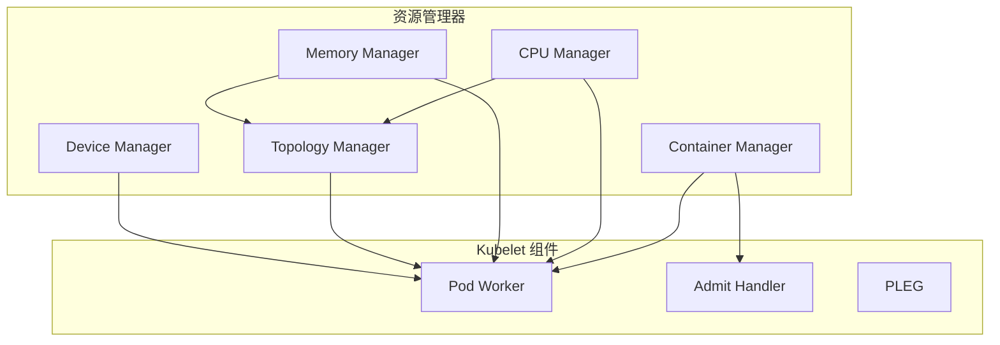
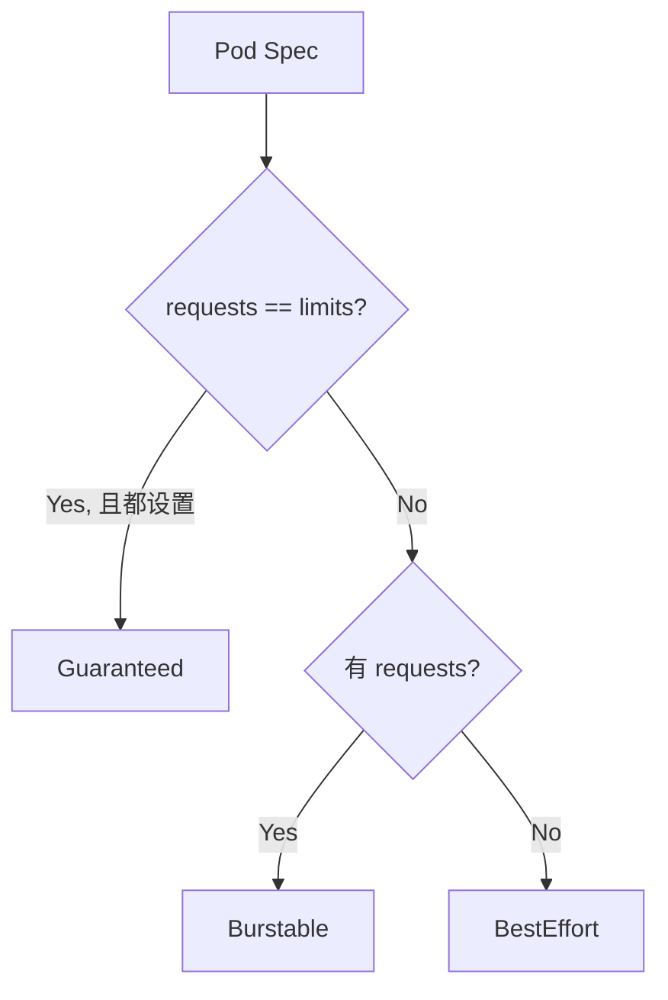
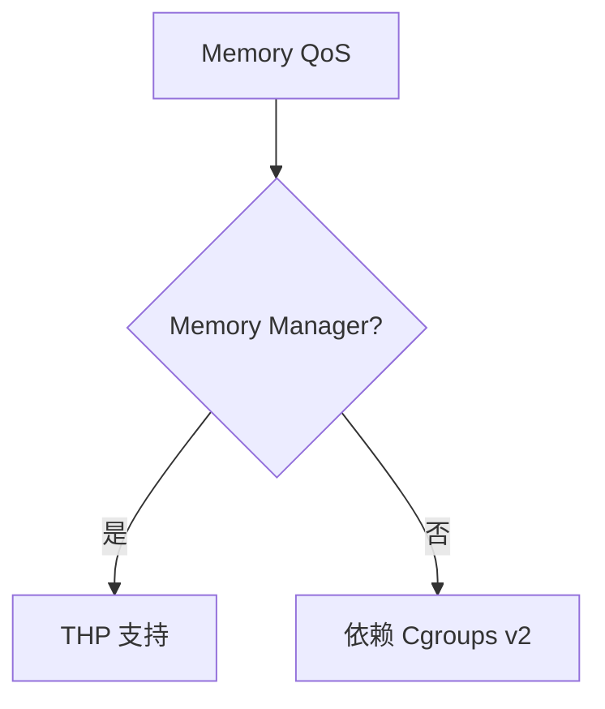
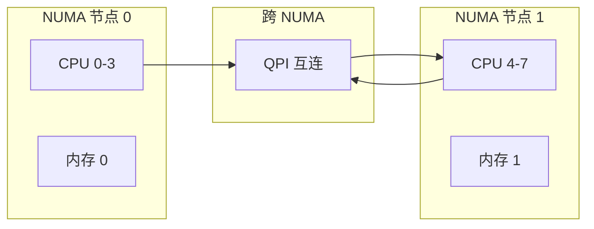
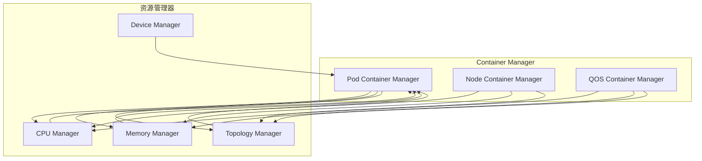
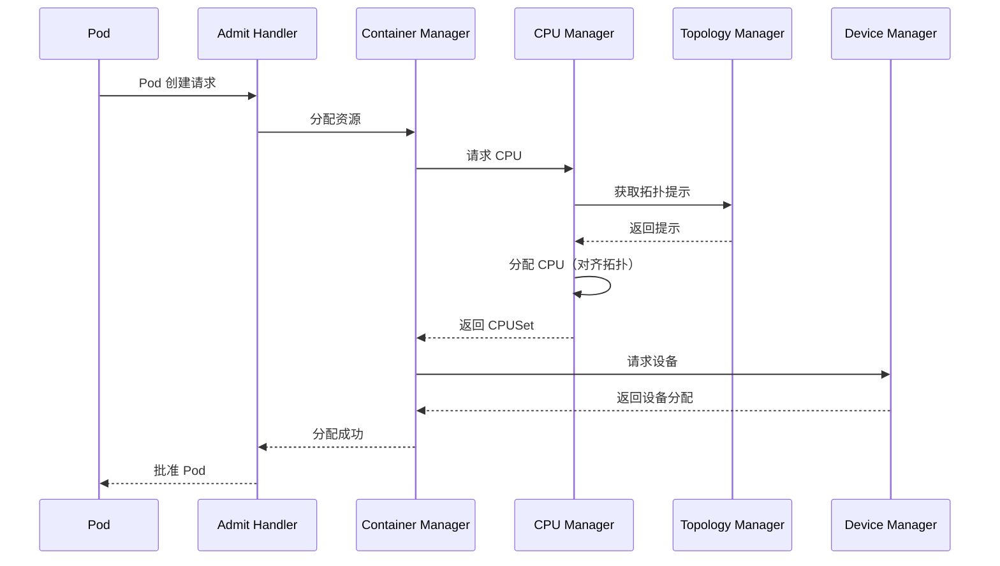

# 资源管理器深度分析

> 本文档深入分析 Kubernetes 资源管理器（CPU Manager、Memory Manager、Topology Manager），包括策略实现、QoS 模型、资源预留和 NUMA 拓扑感知调度。

---

## 目录

1. [资源管理器概述](#资源管理器概述)
2. [QoS 模型](#qos-模型)
3. [CPU Manager](#cpu-manager)
4. [Memory Manager](#memory-manager)
5. [Topology Manager](#topology-manager)
6. [Container Manager](#container-manager)
7. [资源预留](#资源预留)
8. [最佳实践](#最佳实践)

---

## 资源管理器概述

### 资源管理器架构



### 资源管理器接口

**位置**: `pkg/kubelet/cm/container_manager.go`

```go
// ContainerManager 管理容器资源
type ContainerManager interface {
    // Start 启动容器管理器
    Start(ctx context.Context, node *v1.Node, activePods ActivePodsFunc, ...) error
    
    // SystemCgroupsLimit 返回系统 cgroup 限制
    SystemCgroupsLimit() v1.ResourceList
    
    // GetNodeConfig 返回节点配置
    GetNodeConfig() NodeConfig
    
    // Status 返回内部状态
    Status() Status
    
    // GetResources 返回容器运行选项
    GetResources(ctx context.Context, pod *v1.Pod, container *v1.Container) (*kubecontainer.RunContainerOptions, error)
    
    // UpdatePluginResources 更新插件资源
    UpdatePluginResources(*schedulerframework.NodeInfo, *lifecycle.PodAdmitAttributes) error
    
    // GetPodCgroupRoot 返回 Pod cgroup 根目录
    GetPodCgroupRoot() string
}
```

### 资源管理器职责

| 职责 | 说明 |
|------|------|
| **资源分配** | 分配 CPU、内存、设备给容器 |
| **资源回收** | 回收已删除容器的资源 |
| **QoS 执行** | 根据请求和限制设置 QoS 类别 |
| **NUMA 拓扑** | 提供拓扑提示实现 NUMA 感知调度 |
| **资源预留** | 为系统预留 CPU 和内存 |
| **资源更新** | 动态更新容器资源（In-place Resize） |

---

## QoS 模型

### QoS 类别定义

Kubernetes 定义 3 种 QoS（Quality of Service）类别：



**位置**: `pkg/apis/core/types.go`

```go
// PodQOSClass 定义了支持的 QoS 类别
type PodQOSClass string

const (
    // Guaranteed QoS: requests == limits，且都设置
    PodQOSGuaranteed PodQOSClass = "Guaranteed"
    
    // Burstable QoS: requests 存在，但不等于 limits
    PodQOSBurstable PodQOSClass = "Burstable"
    
    // BestEffort QoS: requests 和 limits 都不设置
    PodQOSBestEffort PodQOSClass = "BestEffort"
)
```

### QoS 计算

| Pod 配置 | CPU QoS | 内存 QoS | Pod QoS |
|----------|---------|---------|---------|
| requests=1, limits=1 | Guaranteed | Guaranteed | Guaranteed |
| requests=1, limits=2 | Burstable | Guaranteed | Burstable |
| requests=2, limits=2 | Guaranteed | Guaranteed | Guaranteed |
| requests=1, limits=unlimited | Burstable | Burstable | Burstable |
| requests=2, limits=unlimited | Burstable | Burstable | Burstable |
| requests=unlimited, limits=unlimited | BestEffort | BestEffort | BestEffort |
| requests=unlimited, limits=1 | BestEffort | Guaranteed | Burstable |

### QoS 特性

| QoS 类别 | CPU 调度 | 内存 OOM | CPU Share | 内存 Swap |
|----------|----------|---------|----------|----------|
| **Guaranteed** | 最低优先级 | 严格限制 | 固定份额 | 禁止 swap |
| **Burstable** | 中等优先级 | 可交换 | 可变份额 | 允许 swap |
| **BestEffort** | 最低优先级 | 可交换 | 最小份额 | 允许 swap |

---

## CPU Manager

### CPU Manager 策略

**位置**: `pkg/kubelet/cm/cpumanager/cpu_manager.go`

```go
// Policy 定义了 CPU 管理策略
type Policy interface {
    // Name 返回策略名称
    Name() string
    
    // Allocate 分配 CPU 给容器
    Allocate(pod *v1.Pod, container *v1.Container) (cpuset.CPUSet, error)
    
    // Remove 移除容器 CPU 分配
    RemoveContainer(containerID string) error
    
    // GetExclusiveCPUs 返回独占 CPU
    GetExclusiveCPUs(podUID types.UID, containerName string) cpuset.CPUSet
    
    // GetTopologyHints 返回拓扑提示
    GetTopologyHints(pod *v1.Pod, container *v1.Container) map[string][]topologymanager.TopologyHint
}
```

### CPU Manager 策略类型

| 策略 | 说明 | 使用场景 |
|------|------|---------|
| **None** | 不使用 CPU Manager，容器使用默认 cgroup CPU 限制 | 测试环境 |
| **Static** | 静态分配 CPU，独占模式 | 生产环境推荐 |
| **Static (NUMA）** | 静态分配 + NUMA 拓扑感知 | NUMA 服务器 |

### Static Policy 实现

**位置**: `pkg/kubelet/cm/cpumanager/policy_static.go`

```go
// CPU 分配策略
type CPUAllocation struct {
    CPUs  []int
}

// Allocate 静态分配 CPU
func (p *staticPolicy) Allocate(pod *v1.Pod, container *v1.Container) (cpuset.CPUSet, error) {
    // 1. 检查是否需要独占 CPU
    if !p.requiresExclusiveCPUs(container) {
        return cpuset.NewCPUSet(), nil
    }
    
    // 2. 获取可用 CPU
    availableCPUs := p.getAvailableCPUs()
    if len(availableCPUs) == 0 {
        return nil, fmt.Errorf("no CPUs available")
    }
    
    // 3. 分配 CPU（最匹配 NUMA）
    cpus := p.selectCPUsForContainer(pod, container, availableCPUs)
    
    // 4. 记录分配
    p.assignCPUs(containerID, cpus)
    
    return cpus, nil
}

// selectCPUsForContainer 选择最优 CPU
func (p *staticPolicy) selectCPUsForContainer(pod *v1.Pod, container *v1.Container, available []int) []int {
    // 1. 获取拓扑提示
    hints := p.topology.GetPodTopologyHints(pod, container)
    
    // 2. 根据拓扑选择 CPU
    return p.topologyManager.AllocateAlignedCPUs(pod, container, available, hints)
}
```

### CPU 请求配置

```yaml
apiVersion: v1
kind: Pod
spec:
  containers:
  - name: app
    image: my-app:latest
    resources:
      requests:
        cpu: "2"              # 需要 2 个 CPU
        memory: "4Gi"            # 需要 4GB 内存
      limits:
        cpu: "4"              # 最多使用 4 个 CPU
        memory: "8Gi"            # 最多使用 8GB 内存
```

### CPU Manager 指标

```go
var (
    // CPU Pinning 请求计数
    CPUManagerPinningRequestsTotal = metrics.NewCounter(...)
    
    // CPU Pinning 错误计数
    CPUManagerPinningErrorsTotal = metrics.NewCounter(...)
    
    // 共享 CPU 池大小
    CPUManagerSharedPoolSizeMilliCores = metrics.NewGauge(...)
    
    // 独占 CPU 分配计数
    CPUManagerExclusiveCPUsAllocationCount = metrics.NewGauge(...)
    
    // NUMA 节点 CPU 分配
    CPUManagerAllocationPerNUMA = metrics.NewGaugeVec(...)
)
```

### CPU Manager 配置

```yaml
apiVersion: kubelet.config.k8s.io/v1beta1
kind: KubeletConfiguration
cpuManagerPolicy: static                    # none, static, static
cpuManagerPolicyOptions:
  full-pcpus-only: false               # 仅使用物理 CPU
  align-by-socket: false                # 按 socket 对齐
  align-by-numa-node: false             # 按 NUMA 节点对齐
  distribute-cpus-across-numa: true    # 跨 NUMA 分布 CPU
```

---

## Memory Manager

### Memory Manager 概述

Memory Manager 管理 HUGEPAGE（2MB）的透明大页分配，虽然 K8s 当前主要依赖 cgroups v2 内存限制，但预留了接口用于扩展。

### Memory QoS



### Memory 预留

| 预留类型 | 说明 | 配置参数 |
|---------|------|---------|
| **Kube Reserved** | Kubelet 系统预留 | `--kube-reserved <memory>` |
| **System Reserved** | 系统进程预留 | `--system-reserved <memory>` |
| **Eviction Threshold** | 驱逐阈值 | `--eviction-hard memory.available` |

### Memory Manager 配置

```yaml
apiVersion: kubelet.config.k8s.io/v1beta1
kind: KubeletConfiguration
memoryManagerPolicy: none    # none, static (预留）
enforceCPULimits: true        # 强制 CPU CFS 限流
evictionHard:
  memory.available: "100Mi"    # 硬驱逐阈值
evictionSoft:
  memory.available: "200Mi"    # 软驱逐阈值
evictionSoftGracePeriod: "1m30s"  # 软驱逐宽限期
```

### 内存限制实现

```go
// 容器内存限制设置
func (cm *containerManagerImpl) setMemoryLimits(container *v1.Container, containerID string) error {
    // 1. 获取内存限制
    memoryLimit := container.Resources.Limits.Memory()
    if memoryLimit.IsZero() {
        return nil
    }
    
    // 2. 设置 cgroup v2 内存控制器
    if err := cm.setMemoryController(containerID, memoryLimit.Value()); err != nil {
        return fmt.Errorf("failed to set memory limit: %v", err)
    }
    
    // 3. 设置内存交换策略
    if err := cm.setMemorySwap(containerID); err != nil {
        return fmt.Errorf("failed to set memory swap: %v", err)
    }
    
    return nil
}
```

---

## Topology Manager

### NUMA 拓扑概念

NUMA（Non-Uniform Memory Access）是一种多处理器系统架构，每个 CPU 访问本地内存的速度更快：



### Topology Manager 实现

**位置**: `pkg/kubelet/cm/cpumanager/topology/topology.go`

```go
// TopologyHint 表示拓扑提示
type TopologyHint struct {
    NUMANodeID     int
    CPUs            []int
}

// Store 存储拓扑信息
type Store interface {
    // AddCPU 添加 CPU
    AddCPU(numaID int, cpu int)
    
    // GetNUMANodes 返回 NUMA 节点
    GetNUMANodes() []int
    
    // GetCPUs 返回所有 CPU
    GetCPUs() []int
    
    // AlignedCPUs 返回对齐的 CPU
    AlignedCPUs() []int
}

// NewTopology 发现硬件拓扑
func NewTopology(logger logr.Logger, machineInfo *cadvisorapi.MachineInfo, specificCPUs cpuset.CPUSet) (*CPUTopology, error) {
    // 1. 发现 NUMA 节点
    numaNodes := discoverNUMANodes(machineInfo)
    
    // 2. 映射 CPU 到 NUMA 节点
    cpuToNUMA := mapCPUsToNUMA(numaNodes)
    
    // 3. 构建 CPU 拓扑
    return &CPUTopology{
        numaNodes:    numaNodes,
        cpuToNUMA:    cpuToNUMA,
        numaCPUs:    buildNUMACPUs(numaNodes),
        allCPUs:      specificCPUs,
    }, nil
}
```

### 拓扑对齐策略

| 策略 | 说明 | 优点 | 缺点 |
|------|------|------|------|
| **Single Socket** | CPU 在同一 NUMA 节点 | 最小延迟 | NUMA 利用率低 |
| **Multiple Sockets** | CPU 分布在多个 NUMA | 高 NUMA 利用率 | 跨 NUMA 延迟 |
| **Best Fit** | 选择最优 NUMA 组合 | 平衡性能和利用率 | 计算复杂 |
| **Spread** | 均匀分布 CPU | 最高 NUMA 利用率 | 最大延迟 |

### 拓扑感知配置

```yaml
apiVersion: v1
kind: Pod
spec:
  containers:
  - name: app
    image: my-app:latest
    resources:
      limits:
        cpu: "4"
        memory: "8Gi"
        # 拓扑约束（示例）
        devices.kubevirt.io/kvm: "1"
  # 节点亲和性
  nodeAffinity:
    requiredDuringSchedulingIgnoredDuringExecution:
      nodeSelectorTerms:
      - matchExpressions:
        - key: "node.kubernetes.io/instance-type"
          operator: In
          values:
          - "numa-optimized"
```

---

## Container Manager

### Container Manager 架构



### Pod Container Manager

```go
type podContainerManager interface {
    // AddPod 添加 Pod
    AddPod(pod *v1.Pod) error
    
    // RemovePod 移除 Pod
    RemovePod(pod *v1.Pod) error
    
    // GetPod 获取 Pod
    GetPod(podUID types.UID) (*Pod, error)
    
    // GetPods 获取所有 Pods
    GetPods() []*Pod
}
```

### 资源分配流程



### 动态资源更新

```go
// UpdateContainerResources 动态更新容器资源
func (m *containerManagerImpl) UpdateContainerResources(ctx context.Context, pod *v1.Pod, container *v1.Container) error {
    // 1. 获取当前分配
    current := m.getContainerAllocation(containerID)
    
    // 2. 计算新分配
    newCPUs := m.calculateNewCPUs(pod, container)
    newDevices := m.calculateNewDevices(pod, container)
    
    // 3. 调用 CRI 更新资源
    if err := m.runtime.UpdateContainerResources(ctx, containerID, newResources); err != nil {
        return fmt.Errorf("failed to update container resources: %v", err)
    }
    
    // 4. 更新内部状态
    m.updateAllocation(containerID, newAllocation)
    
    return nil
}
```

---

## 资源预留

### 预留类型

| 预留类型 | CPU | 内存 | 说明 |
|---------|-----|------|------|
| **Kube Reserved** | 100m | 200Mi | Kubelet 系统进程预留 |
| **System Reserved** | 50m | 100Mi | 系统进程预留 |
| **Eviction Hard** | - | 100Mi | 硬驱逐阈值 |
| **Node Allocatable** | 可分配 | 可分配 | 节点可分配资源 |

### 资源分配计算

```go
// 计算节点可分配资源
func calculateNodeAllocatable(total v1.ResourceList, reserved v1.ResourceList) v1.ResourceList {
    allocatable := v1.ResourceList{}
    
    // CPU
    cpuTotal := total.Cpu().MilliValue()
    cpuReserved := reserved.Cpu().MilliValue()
    allocatable.SetCpu(*resource.NewMilliQuantity(cpuTotal - cpuReserved))
    
    // 内存
    memoryTotal := total.Memory().Value()
    memoryReserved := reserved.Memory().Value()
    allocatable.SetMemory(*resource.NewQuantity(memoryTotal - memoryReserved))
    
    // ephemeral-storage
    storageTotal := total.StorageEphemeral().Value()
    storageReserved := reserved.StorageEphemeral().Value()
    allocatable.SetStorageEphemeral(*resource.NewQuantity(storageTotal - storageReserved))
    
    return allocatable
}
```

### 资源预留配置

```yaml
apiVersion: kubelet.config.k8s.io/v1beta1
kind: KubeletConfiguration
# Kubelet 系统预留
kubeReserved:
  cpu: "100m"
  memory: "200Mi"
  ephemeral-storage: "1Gi"
# 系统进程预留
systemReserved:
  cpu: "50m"
  memory: "100Mi"
  ephemeral-storage: "500Mi"
```

### 容量保证

```go
// AllocatableResources 调用容量保证
func (cm *containerManagerImpl) AllocatableResources(pod *v1.Pod) v1.ResourceList {
    podRequests := podResourceRequests(pod)
    
    // 1. 检查节点可分配资源
    nodeAllocatable := cm.getNodeAllocatable()
    
    // 2. 确保 Pod 请求不超过可分配资源
    if !checkPodFitsNode(podRequests, nodeAllocatable) {
        return v1.ResourceList{}, nil
    }
    
    // 3. 返回实际可分配资源
    return calculateRealAllocatable(nodeAllocatable, podRequests)
}
```

---

## 最佳实践

### 1. QoS 优化

#### Guaranteed Pod 配置

```yaml
apiVersion: v1
kind: Pod
spec:
  containers:
  - name: app
    image: my-app:latest
    resources:
      requests:
        cpu: "2"
        memory: "4Gi"
      limits:
        cpu: "2"              # requests == limits
        memory: "4Gi"           # requests == limits
  # Guaranteed QoS: requests == limits，且都设置
```

**适用场景**：关键服务、数据库、低延迟应用

#### Burstable Pod 配置

```yaml
apiVersion: v1
kind: Pod
spec:
  containers:
  - name: app
    image: my-app:latest
    resources:
      requests:
        cpu: "1"
        memory: "2Gi"
      limits:
        cpu: "2"              # limits >= requests
        memory: "4Gi"           # limits >= requests
  # Burstable QoS: requests 存在，limits >= requests
```

**适用场景**：Web 应用、批处理、通用工作负载

#### BestEffort Pod 配置

```yaml
apiVersion: v1
kind: Pod
metadata:
  name: batch-job
spec:
  containers:
  - name: worker
    image: worker:latest
    resources:              # 不设置 requests 和 limits
      limits:
        cpu: "2"
        memory: "4Gi"
  # BestEffort QoS: requests 和 limits 都不设置
```

**适用场景**：批处理、测试任务、可中断工作负载

### 2. CPU Manager 配置

#### Static Policy 配置

```yaml
apiVersion: kubelet.config.k8s.io/v1beta1
kind: KubeletConfiguration
# 静态 CPU 管理策略
cpuManagerPolicy: static
cpuManagerPolicyOptions:
  # 按 socket 对齐
  align-by-socket: false
  # 按 NUMA 节点对齐
  align-by-numa-node: false
  # 跨 NUMA 分布 CPU
  distribute-cpus-across-numa: true
```

#### NUMA 感知 Pod 配置

```yaml
apiVersion: v1
kind: Pod
spec:
  containers:
  - name: numa-aware-app
    image: my-app:latest
    resources:
      requests:
        cpu: "4"              # 请求 4 个 CPU
        memory: "8Gi"           # 请求 8GB 内存
      limits:
        cpu: "4"
        memory: "8Gi"
  # NUMA 感知节点选择
  nodeSelector:
    matchLabels:
      numa-aware: "true"
```

### 3. 内存管理优化

#### 内存限制配置

```yaml
apiVersion: v1
kind: Pod
spec:
  containers:
  - name: app
    image: my-app:latest
    resources:
      requests:
        memory: "2Gi"
      limits:
        memory: "4Gi"
    # 禁用 swap
    securityContext:
      runAsUser: 1000
      runAsGroup: 3000
      fsGroup: 2000
```

#### OOM 保护

```yaml
apiVersion: kubelet.config.k8s.io/v1beta1
kind: KubeletConfiguration
# 驱逐配置
evictionHard:
  memory.available: "100Mi"
evictionSoft:
  memory.available: "200Mi"
evictionSoftGracePeriod: "1m30s"
# 软硬驱逐避免 OOM Kill
```

### 4. 资源预留配置

#### 生产环境预留

```yaml
apiVersion: kubelet.config.k8s.io/v1beta1
kind: KubeletConfiguration
# Kubelet 预留（4 核服务器）
kubeReserved:
  cpu: "400m"
  memory: "2Gi"
  ephemeral-storage: "4Gi"
# 系统进程预留
systemReserved:
  cpu: "200m"
  memory: "1Gi"
  ephemeral-storage: "2Gi"
```

#### 开发环境预留

```yaml
apiVersion: kubelet.config.k8s.io/v1beta1
kind: KubeletConfiguration
# Kubelet 预留（2 核开发服务器）
kubeReserved:
  cpu: "100m"
  memory: "500Mi"
  ephemeral-storage: "2Gi"
# 系统进程预留
systemReserved:
  cpu: "50m"
  memory: "200Mi"
  ephemeral-storage: "1Gi"
```

### 5. 性能监控

#### CPU 使用率监控

```sql
# CPU 使用率
sum(rate(container_cpu_usage_seconds_total{image!=""}[5m])) by (pod, container) /
sum(kube_pod_container_info{pod!=""}) by (pod, container)

# CPU 节流限制使用率
sum(kube_pod_container_info{pod!=""}) by (node)
```

#### 内存使用率监控

```sql
# 内存使用率
sum(container_memory_working_set_bytes{image!=""}) by (pod, container) /
sum(kube_pod_container_info{pod!=""}) by (pod, container)

# OOM 事件
increase(kube_pod_container_status{reason="OOMKilled"}[5m])
```

### 6. 故障排查

#### CPU 亲和性问题

```bash
# 检查 CPU 分配
kubectl get pod -o jsonpath='{.status.containerStatuses[*].allocatedCPU}'

# 查看 NUMA 拓扑
lscpu | grep -A 10 "NUMA"

# 检查容器 CPU 绑定
kubectl exec -it <pod> -- cat /proc/<pid>/status | grep Cpus_allowed_list
```

#### 内存问题排查

```bash
# 检查内存限制
kubectl describe pod <pod> | grep -A 5 "Memory Limits"

# 查看 OOM 日志
journalctl -u kubelet | grep -i oom

# 检查内存使用
kubectl top pod <pod> --containers
```

#### QoS 问题排查

```bash
# 检查 Pod QoS 类别
kubectl get pod <pod> -o jsonpath='{.status.qosClass}'

# 查看节点资源
kubectl describe node <node> | grep -A 10 "Allocatable"

# 检查资源预留
kubectl get configmaps -n kube-system -l component=kubelet -o yaml
```

---

## 总结

### 核心要点

1. **资源管理器架构**：Container Manager 统一管理 CPU、Memory、Topology、Device Manager
2. **QoS 模型**：3 种类别（Guaranteed、Burstable、BestEffort），根据 requests/limits 计算
3. **CPU Manager**：Static Policy 支持 NUMA 拓扑感知，独占和共享 CPU
4. **Memory Manager**：主要依赖 cgroups v2，支持内存限制和 OOM 保护
5. **Topology Manager**：提供 NUMA 拓扑提示，优化内存访问延迟
6. **资源预留**：Kube Reserved + System Reserved，确保系统稳定性
7. **动态更新**：支持 In-place Resize 动态调整容器资源

### 关键路径

```
Pod 创建 → Admit Handler → Container Manager → CPU/Memory/Topology Manager → 
资源分配（NUMA 对齐）→ CRI UpdateContainerResources → Pod 启动
```

### 推荐阅读

- [Configure Memory Management](https://kubernetes.io/docs/tasks/administer-cluster/memory-management/)
- [Configure CPU Management Policies](https://kubernetes.io/docs/tasks/administer-cluster/cpu-management-policies/)
- [Toplogy Manager Policies](https://kubernetes.io/docs/tasks/administer-cluster/toplogy-manager/)
- [Manage Resources for Containers](https://kubernetes.io/docs/concepts/configuration/manage-resources-containers/)
- [Pod Overhead](https://kubernetes.io/docs/concepts/scheduling-eviction/pod-overhead/)

---

**文档版本**：v1.0
**创建日期**：2026-03-04
**维护者**：AI Assistant
**Kubernetes 版本**：v1.28+
