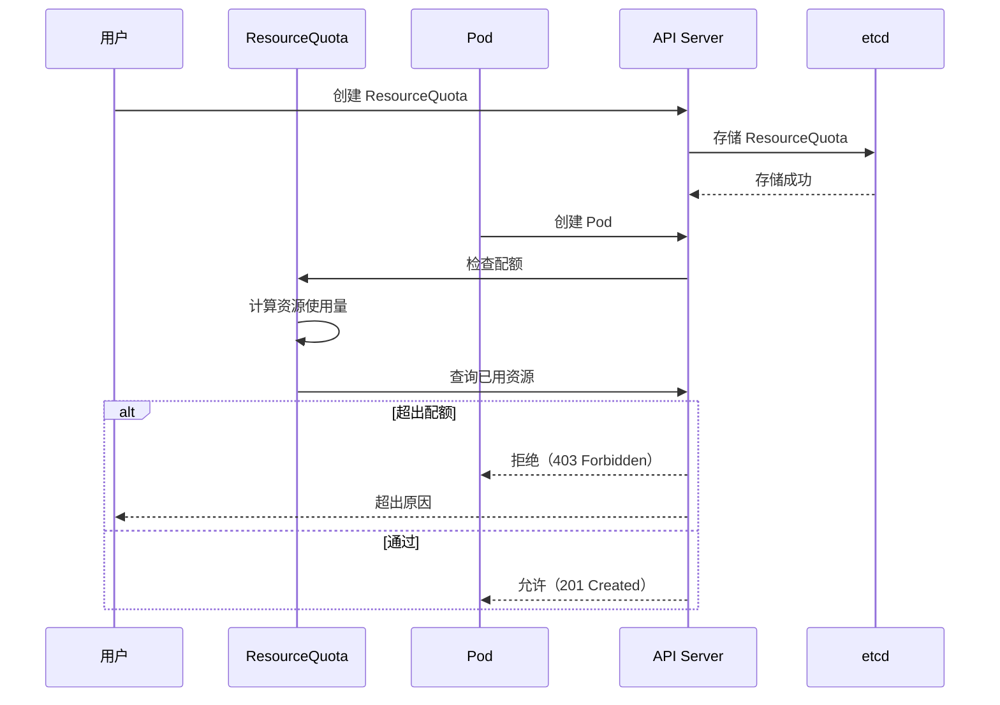

# Kubernetes 资源配额和限制深度解析

## 概述

Kubernetes 提供了强大的资源管理机制，包括：
- ResourceQuota（资源配额）：限制命名空间资源使用量
- LimitRange（限制范围）：为 Pod 和 Container 定义默认资源限制
- PriorityClass（优先级类）：定义 Pod 优先级
- 请求和限制（Request/Limit）：定义容器资源需求

本文档深入分析这些机制的原理、实现和最佳实践。

---

## 一、资源配额（ResourceQuota）

### 1.1 ResourceQuota 概述

ResourceQuota 限制命名空间的资源总量：
- 限制 CPU、内存、存储等资源
- 防止租户占用过多资源
- 支持硬性限制（Hard）和默认配额

### 1.2 ResourceQuota 类型

#### 1. 计算资源配额

```yaml
apiVersion: v1
kind: ResourceQuota
metadata:
  name: compute-resources
  namespace: default
spec:
  hard:
    requests.cpu: "4"
    requests.memory: 8Gi
    limits.cpu: "8"
    limits.memory: 16Gi
    requests.nvidia.com/gpu: 4
    persistentvolumeclaims: "10"
```

**支持的资源类型：**

| 资源类型 | 作用 | 计数单位 |
|---------|------|----------|
| `requests.cpu` | CPU 请求 | 核心数 |
| `requests.memory` | 内存请求 | 字节数 |
| `limits.cpu` | CPU 限制 | 核心数 |
| `limits.memory` | 内存限制 | 字节数 |
| `requests.storage` | 存储请求 | 字节数 |
| `persistentvolumeclaims` | PV 声明数 | 数量 |
| `requests.ephemeral-storage` | 临时存储请求 | 字节数 |
| `limits.ephemeral-storage` | 临时存储限制 | 字节数 |
| `count/<resource>.<resource>` | 自定义资源 | 数量 |

#### 2. 存储资源配额

```yaml
apiVersion: v1
kind: ResourceQuota
metadata:
  name: storage-quota
spec:
  hard:
    requests.storage: "100Gi"
    persistentvolumeclaims: "10"
```

### 1.3 ResourceQuota 控制器

**文件：** `pkg/controller/resourcequota/resource_quota_controller.go`

```go
type Controller struct {
    // 客户端
    client clientset.Interface

    // Listers
    quotaLister   corelisters.ResourceQuotaLister
    configMapLister corelisters.ConfigMapLister
    nsLister      corelisters.NamespaceLister

    // 工作队列
    queue      workqueue.TypedRateLimitingInterface[string]

    // 同步状态
    informersSynced cache.InformerSynced
}
```

**核心功能：**
- 管理 ResourceQuota 对象
- 计算资源使用量
- 检查是否超过配额
- 拒绝超限请求

### 1.4 资源配额计算流程



### 1.5 配额执行模式

ResourceQuota 支持两种执行模式：

| 模式 | 作用 | 配置 |
|------|------|------|
| `Limited` | 限制资源使用 | `spec.scope: BestEffort` |
| `NotLimited` | 仅监控，不限制 | `spec.scope: NotBestEffort` |
| `Terminating` | 终止命名空间 | 自动设置 |

**配置示例：**
```yaml
apiVersion: v1
kind: ResourceQuota
metadata:
  name: compute-quota
  namespace: default
spec:
  scopes:
    - NotBestEffort  # 允许超越 BestEffort 范围的 Pod
```

### 1.6 配额状态

ResourceQuota 有以下状态：

```yaml
status:
  hard:
    requests.cpu: "4"
    requests.memory: 8Gi
  used:
    requests.cpu: "3"          # 已使用 3 个核
    requests.memory: 6Gi      # 已使用 6GB
  scopes:
    - Terminating              # 命名空间正在终止
```

**计算方式：**
- `hard`: 配额限制
- `used`: 当前使用量
- `used / hard * 100%`: 使用率

---

## 二、LimitRange（限制范围）

### 2.1 LimitRange 概述

LimitRange 为 Pod 和 Container 定义默认资源请求和限制：
- 简化 Pod 定义
- 确保最小资源可用性
- 支持优先级（PriorityClass）

### 2.2 LimitRange 类型

#### 1. CPU 限制

```yaml
apiVersion: v1
kind: LimitRange
metadata:
  name: cpu-limit-range
  namespace: default
spec:
  limits:
    - type: CPU
      default: 100m
      max: "2"
```

#### 2. 内存限制

```yaml
apiVersion: v1
kind: LimitRange
metadata:
  name: memory-limit-range
  namespace: default
spec:
  limits:
    - type: Memory
      default: 512Mi
      maxLimit: 2Gi
```

#### 3. 存储限制

```yaml
apiVersion: v1
kind: LimitRange
metadata:
  name: storage-limit-range
  namespace: default
spec:
  limits:
    - type: Storage
      default: 1Gi
      max: 5Gi
```

#### 4. GPU 限制

```yaml
apiVersion: v1
kind: LimitRange
metadata:
  name: gpu-limit-range
  namespace: default
spec:
  limits:
    - type: "nvidia.com/gpu"
      default: 1
      max: 4
```

### 2.3 LimitRange 字段

| 字段 | 说明 |
|------|------|
| `max` | 最大值（硬限制） |
| `default` | 默认值 |
| `type` | 资源类型（CPU、Memory、Storage、GPU） |
| `defaultRequest` | 默认请求值 |
| `maxLimitRequest` | 最大请求限制 |

### 2.4 LimitRange 匹配优先级

LimitRange 通过 `type` 和 `maxLimitRequest` 进行匹配：

1. **精确匹配**：`type: CPU`
2. **通配符匹配**：`type: "nvidia.com/*"`

**匹配优先级：**
1. 匹配 `maxLimitRequest`（最具体）
2. 匹配 `type`（次具体）
3. 使用默认限制（最不具体）

---

## 三、PriorityClass（优先级类）

### 3.1 PriorityClass 概述

PriorityClass 定义 Pod 的调度优先级：
- 数字越大优先级越高
- 支持 Preemption（抢占）机制
- 可以禁用非抢占

### 3.2 PriorityClass 定义

```yaml
apiVersion: scheduling.k8s.io/v1
kind: PriorityClass
metadata:
  name: high-priority
value: 1000
globalDefault: false  # 是否为全局默认
description: "This priority class should be used for high priority pods only."
preemptionPolicy: PreemptLowerPriority  # 抢占策略
```

**抢占策略：**

| 策略 | 说明 |
|------|------|
| `PreemptLowerPriority` | 抢占低优先级 Pod（默认） |
| `PreemptNever` | 禁用抢占 |
| `PreemptOther` | 抢占其他优先级 Pod |

### 3.3 PriorityClass 使用

在 Pod 中指定 PriorityClass：

```yaml
apiVersion: v1
kind: Pod
metadata:
  name: high-priority-pod
spec:
  priorityClassName: high-priority  # 使用高优先级类
  containers:
    - name: app
      image: nginx
      resources:
        requests:
          cpu: 100m
          memory: 128Mi
```

---

## 四、请求和限制（Request/Limit）

### 4.1 Request vs Limit

| 类型 | 作用 | 超出处理 |
|------|------|----------|
| `requests.cpu` | CPU 请求量 | 容器最多使用这么多 CPU |
| `limits.cpu` | CPU 限制量 | 容器不能超过这个值 |
| `requests.memory` | 内存请求量 | 容器至少需要这么多内存 |
| `limits.memory` | 内存限制量 | 容器最多使用这么多内存 |

**关键点：**
- `Request` ≤ `Limit`
- 超过 Limit 会触发 OOM（Out of Memory）
- Scheduler 基于 Request 进行调度
- 基于 Limit 进行资源预留

### 4.2 资源请求示例

```yaml
apiVersion: v1
kind: Pod
metadata:
  name: resource-pod
spec:
  containers:
    - name: app
      image: nginx
      resources:
        requests:
          cpu: 100m              # 0.1 核
          memory: 128Mi          # 128MB
        limits:
          cpu: 500m              # 0.5 核
          memory: 256Mi          # 256MB
```

### 4.3 服务质量（QoS）

Kubernetes 根据资源定义分配 QoS 级别：

| QoS 级别 | Request/Limit | 说明 |
|----------|--------------|------|
| `Guaranteed` | Request = Limit | 最高优先级， Guaranteed |
| `Burstable` | Request ≤ Limit < 2*Request | 中等优先级，可突发 |
| `BestEffort` | Request 未设置 | 最低优先级，BestEffort |

**计算示例：**
```yaml
# Guaranteed
resources:
  requests:
    cpu: 100m
  limits:
    cpu: 100m

# Burstable
resources:
  requests:
    cpu: 100m
  limits:
    cpu: 200m

# BestEffort
resources:
  limits:
    cpu: 200m
```

---

## 五、ResourceQuota Controller 深度分析

### 5.1 控制器架构

**文件：** `pkg/controller/resourcequota/resource_quota_controller.go`

```go
type Controller struct {
    // 客户端
    rqClient corev1client.ResourceQuotasGetter

    // Listers
    quotaLister corelisters.ResourceQuotaLister
    configMapLister corelisters.ConfigMapLister
    nsLister      corelisters.NamespaceLister

    // 计算器
    calculators map[schema.GroupVersionResource]*usageCalculator

    // 工作队列
    queue workqueue.TypedRateLimitingInterface[string]
}
```

### 5.2 资源使用量计算

**文件：** `pkg/controller/resourcequota/calculator.go`

```go
type usageCalculator struct {
    quotaClient corev1client.ResourceQuotasGetter
    listers    registry.Listers
}

func (c *usageCalculator) Usage(obj quota.Interface) (v1.ResourceList, error) {
    // 1. 获取命名空间中所有对象
    // 2. 统计资源使用量
    // 3. 返回资源列表
}
```

**计算方式：**
- 遍历所有 Pod、PVC、Service、Secret
- 累加 Request 资源
- 与 ResourceQuota 对比

### 5.3 配额执行流程

```go
func (c *Controller) syncResourceQuota(ctx context.Context, key string) error {
    // 1. 解析 key
    namespace, name, err := cache.SplitMetaNamespaceKey(key)
    if err != nil {
        return err
    }

    // 2. 获取 ResourceQuota
    quota, err := c.rqLister.ResourceQuotas(namespace).Get(name)
    if errors.IsNotFound(err) {
        return nil
    }

    // 3. 检查执行模式
    if !c.isQuotaTerminating(quota) {
        return nil
    }

    // 4. 计算资源使用量
    usage, err := c.calculateUsage(quota)
    if err != nil {
        return err
    }

    // 5. 检查是否超过配额
    if !c.fitsQuota(quota, usage) {
        // 拒绝请求
        return c.denyPod(ctx, pod, quota, usage)
    }

    // 6. 更新配额状态
    if err := c.updateQuotaStatus(ctx, quota, usage); err != nil {
        return err
    }

    return nil
}
```

### 5.4 配额检查算法

```go
func (c *Controller) fitsQuota(quota *v1.ResourceQuota, usage v1.ResourceList) bool {
    for _, resourceQuota := range quota.Spec.Hard {
        requested := usage[resourceQuota]
        hard := quota.Spec.Hard[resourceQuota]

        // 检查是否超出配额
        if requested > hard {
            return false
        }
    }

    return true
}
```

---

## 六、LimitRange Controller 深度分析

### 6.1 控制器架构

**文件：** `pkg/controller/limitrange/limit_range_controller.go`

```go
type Controller struct {
    // 客户端
    lrClient  corev1client.LimitRangesGetter

    // Listers
    lrLister  corelisters.LimitRangeLister
    nsLister   corelisters.NamespaceLister

    // 工作队列
    queue workqueue.TypedRateLimitingInterface[string]

    // 同步状态
    lrListerSynced cache.InformerSynced
    informersSynced cache.InformerSynced
}
```

**核心功能：**
- 管理 LimitRange 对象
- 为新创建的 Pod 设置默认资源
- 确保 LimitRange 规则生效

### 6.2 资源限制应用

```go
func (c *Controller) applyLimitLimits(ctx context.Context, pod *v1.Pod) error {
    // 1. 获取所有 LimitRange
    limitRanges, err := c.lrLister.LimitRanges(pod.Namespace).List()
    if err != nil {
        return err
    }

    // 2. 为每个容器应用 LimitRange
    for i, container := range pod.Spec.Containers {
        limits, err := c.limitsForContainer(container, limitRanges)
        if err != nil {
            return err
        }

        if len(limits) > 0 {
            // 应用第一个匹配的限制
            pod.Spec.Containers[i].Resources.Limits = limits[0]
        }
    }

    return nil
}
```

### 6.3 匹配算法

```go
func (c *Controller) limitsForContainer(container *v1.Container, limitRanges []*v1.LimitRange) (v1.ResourceList, error) {
    var allLimits v1.ResourceList
    for _, limitRange := range limitRanges {
        // 检查是否匹配
        if c.containerMatchesLimitRange(container, limitRange) {
            // 添加限制
            allLimits = append(allLimits, limitRange.Max)
        }
    }

    return allLimits, nil
}
```

---

## 七、资源管理最佳实践

### 7.1 ResourceQuota 最佳实践

1. **为命名空间设置配额**
   ```yaml
   apiVersion: v1
   kind: ResourceQuota
   metadata:
     name: team-quota
     namespace: team-a
   spec:
     hard:
       requests.cpu: "8"
       requests.memory: 16Gi
       pods: "10"
   ```

2. **使用 Scope 控制执行**
   ```yaml
   spec:
     scopes:
       - NotBestEffort  # 允许系统 Pod
   ```

3. **监控配额使用**
   ```bash
   kubectl describe resourcequota <quota-name>
   kubectl get quota <namespace>
   ```

4. **避免过度配额**
   - 定期审计配额使用
   - 按需分配
   - 清理未使用的配额

### 7.2 LimitRange 最佳实践

1. **为不同类型设置 LimitRange**
   - CPU 限制
   - 内存限制
   - GPU 限制

2. **设置合理的默认值**
   - 避免默认值过高
   - 确保最小资源可用性

3. **使用 max 限制**
   - 防止资源滥用
   - 保护集群稳定性

### 7.3 资源请求最佳实践

1. **设置合理的 Request**
   - 基于 Profile 进行测试
   - 避免过度请求资源

2. **使用 Limit 控制**
   - 防止 OOM（Out of Memory）
   - 限制 CPU 使用

3. **选择合适的 QoS**
   - 生产环境：`Guaranteed`
   - 开发环境：`Burstable` 或 `BestEffort`

4. **使用 PriorityClass**
   - 关键业务 Pod：高优先级
   - 批处理作业：低优先级

---

## 八、故障排查

### 8.1 常见问题

#### 1. Pod 无法创建（配额限制）

**症状：** `Forbidden (exceeded quota)`

**排查：**
- 检查 ResourceQuota 状态
- 计算资源使用量
- 申请增加配额

```bash
kubectl describe resourcequota <quota-name>
kubectl get pods -n <namespace>
```

#### 2. 资源使用量统计不准确

**症状：** 使用量与实际不符

**排查：**
- 检查 ResourceQuota Controller 日志
- 检查计算器实现
- 重新同步 ResourceQuota

#### 3. LimitRange 不生效

**症状：** 新 Pod 没有应用默认限制

**排查：**
- 检查 LimitRange 对象
- 检查匹配规则
- 检查控制器日志

```bash
kubectl get limitrange -n <namespace>
kubectl describe limitrange <limitrange-name>
```

### 8.2 调试技巧

1. **查看资源使用量**
   ```bash
   kubectl describe node <node-name>
   kubectl top nodes
   kubectl top pods
   ```

2. **查看配额状态**
   ```bash
   kubectl get quota -n <namespace>
   kubectl describe quota <quota-name>
   ```

3. **检查 Pod 资源**
   ```bash
   kubectl describe pod <pod-name>
   kubectl get pod <pod-name> -o yaml
   ```

4. **监控资源指标**
   - `resource_quota_usage_bytes`
   - `resource_quota_requests_bytes`
   - `limit_range_creations_total`

---

## 九、关键代码路径

### 9.1 ResourceQuota Controller
```
pkg/controller/resourcequota/
├── resource_quota_controller.go       # 主控制器
├── calculator.go                     # 资源计算器
├── resource_quota_monitor.go          # 配额监控
└── ...其他支持文件
```

### 9.2 LimitRange Controller
```
pkg/controller/limitrange/
├── limit_range_controller.go         # 主控制器
├── limit_range_controller_test.go    # 测试
└── ...其他支持文件
```

### 9.3 核心类型定义
```
staging/k8s.io/api/core/v1/
├── types.go                          # ResourceQuota/ LimitRange 类型
├── defaults.go                       # 默认值
├── register.go                      # 类型注册
└── ...
```

### 9.4 调度 API
```
staging/k8s.io/api/scheduling.k8s.io/v1/
├── types.go                          # PriorityClass 类型
└── register.go                      # 类型注册
```

---

## 十、总结

### 10.1 资源管理特点

1. **多层保护**：ResourceQuota + LimitRange + PriorityClass 三层保护
2. **配额机制**：防止资源滥用，支持硬性限制和默认配额
3. **限制范围**：简化 Pod 定义，确保最小资源
4. **优先级**：支持抢占机制，确保关键业务优先处理
5. **QoS 级别**：根据 Request/Limit 自动分配服务质量

### 10.2 关键流程

1. **配额流程**：Pod 创建 → 配额检查 → 通过/拒绝 → 更新状态
2. **限制应用**：Pod 创建 → LimitRange 匹配 → 应用默认限制
3. **优先级调度**：PriorityClass → Scheduler → 抢占机制
4. **资源预留**：基于 Limit 进行资源预留
5. **QoS 分配**：Request/Limit 计算 → QoS 级别分配

### 10.3 最佳实践

1. **ResourceQuota**：按需分配、监控使用、定期审计
2. **LimitRange**：合理默认值、使用 max 限制、分类管理
3. **资源请求**：合理 Request、设置 Limit、选择 QoS
4. **PriorityClass**：关键业务高优先级、批处理低优先级

---

## 参考资源

- [Kubernetes ResourceQuota 文档](https://kubernetes.io/docs/concepts/policy/resource-quotas/)
- [Kubernetes LimitRange 文档](https://kubernetes.io/docs/concepts/policy/limit-range/)
- [Kubernetes PriorityClass 文档](https://kubernetes.io/docs/concepts/scheduling-eviction/pod-priority-preemption/)
- [Kubernetes Requests and Limits 文档](https://kubernetes.io/docs/concepts/configuration/manage-resources-containers/)
- [Kubernetes QoS 文档](https://kubernetes.io/docs/concepts/config/pod-qos/)

---

**文档版本**：v1.0
**最后更新**：2026-03-03
**分析范围**：Kubernetes v1.x
