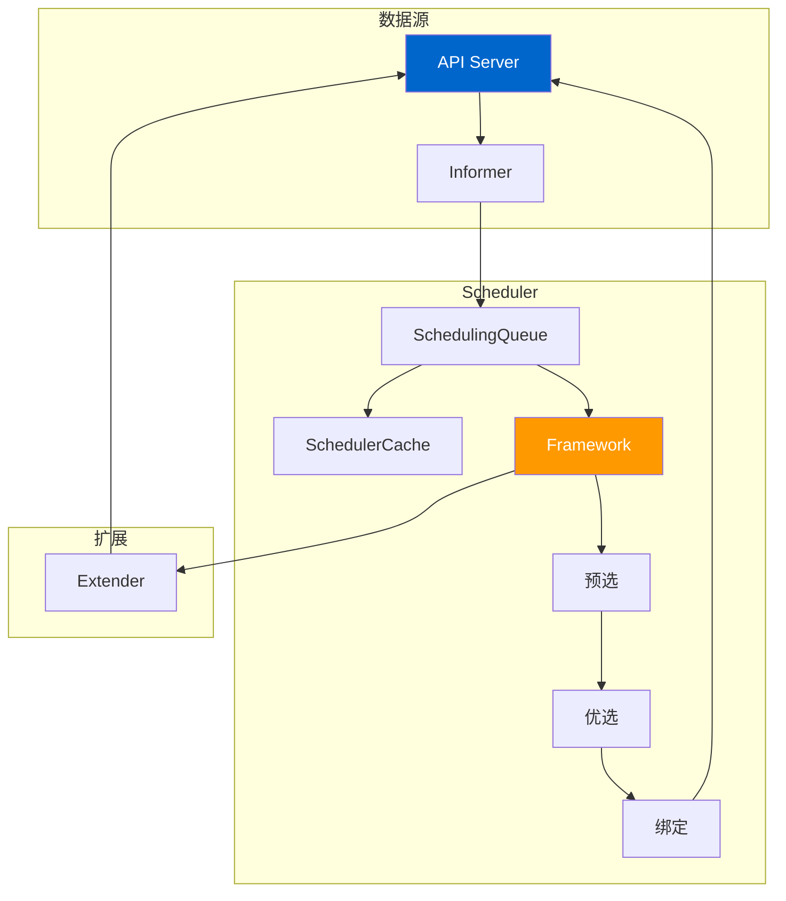
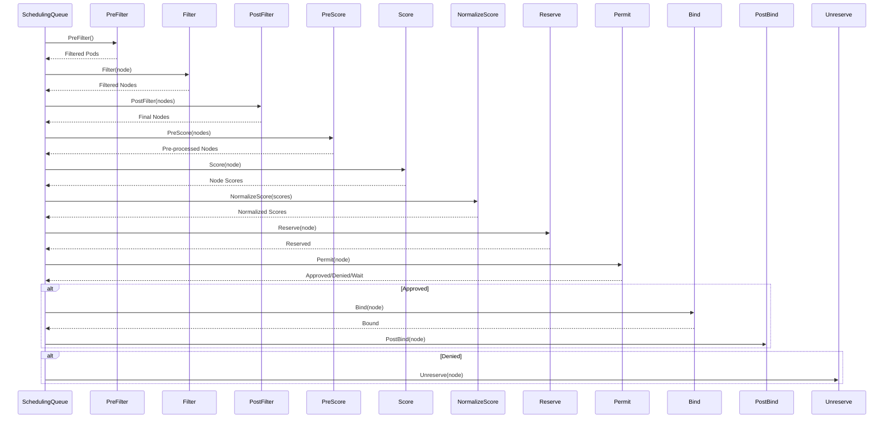
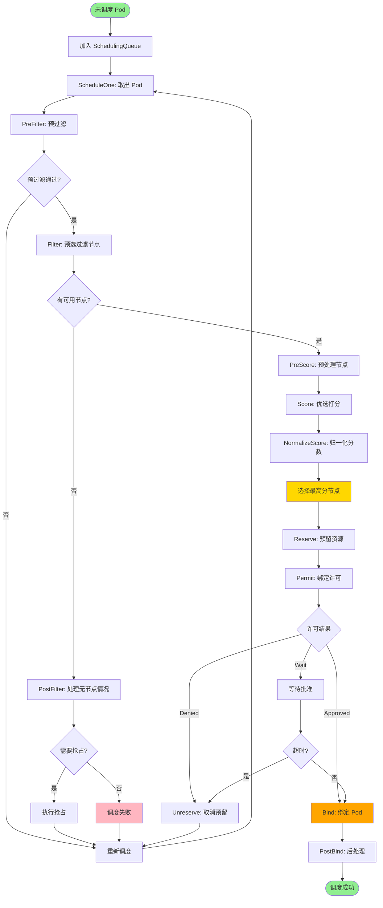
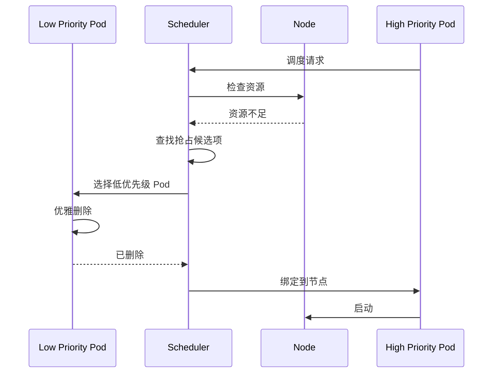

# Kubernetes Scheduler 深度解析

## 概述

kube-scheduler 是 Kubernetes 集群的控制平面组件，负责：
- 监听未调度的 Pod
- 为 Pod 选择合适的节点
- 执行预选（Predicate）和优选（Priority）算法
- 将 Pod 绑定到选定的节点
- 支持 Pod 抢占（Preemption）
- 支持自定义调度器（Scheduler Extender）

本文档深入分析 Scheduler 的启动流程、调度框架、预选/优选算法、亲和性/反亲和性、Taints/Tolerations 和抢占机制。

---

## 一、Scheduler 架构

### 1.1 整体架构



### 1.2 调度流程

```
未调度 Pod → Scheduling Queue → ScheduleOne → 预选 → 优选 → 抢占 → 绑定 → API Server
```

**关键步骤：**
1. 从 SchedulingQueue 获取下一个 Pod
2. 执行预选（Filter），过滤掉不符合条件的节点
3. 执行优选（Score），给符合条件的节点打分
4. 选择得分最高的节点
5. 执行抢占（如果需要）
6. 绑定（Bind）Pod 到节点

---

## 二、启动流程

### 2.1 主入口

**文件：** `cmd/kube-scheduler/app/server.go`

```go
func NewSchedulerCommand(registryOptions ...Option) *cobra.Command {
    opts := options.NewOptions()

    cmd := &cobra.Command{
        Use: "kube-scheduler",
        Long: `The Kubernetes scheduler is a control plane process which assigns
Pods to Nodes. The scheduler determines which Nodes are valid placements for
each Pod in the scheduling queue according to constraints and available
resources. The scheduler then ranks each valid Node and binds the Pod to a
suitable Node.`,
        RunE: func(cmd *cobra.Command, args []string) error {
            return runCommand(cmd, opts, registryOptions...)
        },
    }

    return cmd
}

func runCommand(cmd *cobra.Command, opts *options.Options, registryOptions ...Option) error {
    // 1. 验证日志配置
    if err := logsapi.ValidateAndApply(opts.Logs, fg); err != nil {
        fmt.Fprintf(os.Stderr, "%v\n", err)
        os.Exit(1)
    }

    // 2. 创建 Context
    ctx, cancel := context.WithCancel(context.Background())
    defer cancel()

    // 3. 设置信号处理
    go func() {
        stopCh := server.SetupSignalHandler()
        <-stopCh
        cancel()
    }()

    // 4. 创建配置
    cc, sched, err := Setup(ctx, opts, registryOptions...)
    if err != nil {
        return err
    }

    // 5. 运行调度器
    return Run(ctx, cc, sched)
}
```

### 2.2 Scheduler 创建

**文件：** `cmd/kube-scheduler/app/server.go`

```go
func Setup(ctx context.Context, opts *options.Options, outOfTreeRegistryOptions ...Option) (*schedulerserverconfig.CompletedConfig, *scheduler.Scheduler, error) {
    // 1. 创建配置
    c, err := opts.Config()
    if err != nil {
        return nil, nil, err
    }

    // 2. 完成配置
    completedConfig, err := c.Complete()
    if err != nil {
        return nil, nil, err
    }

    // 3. 创建调度器
    sched, err := scheduler.New(
        ctx,
        schedulerClient,
        informerFactory,
        recorderFactory,
        completedConfig.KubeConfig,
        completedConfig,
    )
    if err != nil {
        return nil, nil, err
    }

    return completedConfig, sched, nil
}
```

### 2.3 Scheduler 结构

**文件：** `pkg/scheduler/scheduler.go`

```go
type Scheduler struct {
    // 调度缓存
    Cache internalcache.Cache

    // 调度器扩展
    Extenders []fwk.Extender

    // 下一个 Pod 函数（从队列获取）
    NextPod func(logger klog.Logger) (*framework.QueuedPodInfo, error)

    // 失败处理器
    FailureHandler FailureHandlerFn

    // 调度 Pod 函数
    SchedulePod func(ctx context.Context, fwk framework.Framework, state fwk.CycleState, podInfo *framework.QueuedPodInfo) (ScheduleResult, error)

    // 停止通道
    StopEverything <-chan struct{}

    // 调度队列
    SchedulingQueue internalqueue.SchedulingQueue

    // API Dispatcher
    APIDispatcher *apidispatcher.APIDispatcher

    // 调度框架
    frameworksMap map[string]framework.Framework
}
```

---

## 三、调度框架（Scheduling Framework）

### 3.1 框架扩展点

调度框架定义了多个扩展点（Extension Points）：

| 扩展点 | 插件类型 | 作用 |
|---------|----------|------|
| QueueSort | 排序 | 对调度队列中的 Pod 排序 |
| PreFilter | 预过滤 | 过滤前的预处理 |
| Filter | 预选 | 过滤不符合条件的节点 |
| PostFilter | 后过滤 | 过滤后的处理 |
| PreScore | 预打分 | 打分前的预处理 |
| Score | 打分 | 给节点打分 |
| NormalizeScore | 标准化分 | 标准化分数 |
| Reserve | 预留 | 预留节点资源 |
| Permit | 允许 | 允许/拒绝/延迟绑定 |
| PreBind | 预绑定 | 绑定前的处理 |
| Bind | 绑定 | 绑定 Pod 到节点 |
| PostBind | 后绑定 | 绑定后的处理 |
| Unreserve | 取消预留 | 取消预留的资源 |

### 3.2 调度周期



#### Pod 调度完整流程图



### 3.3 调度流程代码

**文件：** `pkg/scheduler/schedule_one.go`

```go
func (sched *Scheduler) scheduleOnePod(ctx context.Context, podInfo *framework.QueuedPodInfo) {
    pod := podInfo.Pod
    fwk, err := sched.frameworkForPod(pod)

    // 1. 获取调度周期状态
    state := fwk.NewCycleState()

    // 2. PreFilter
    s := fwk.RunPreFilterPlugins(ctx, state, pod)
    if !s.IsSuccess() {
        sched.FailureHandler(ctx, fwk, podInfo, s.AsError(), nil, time.Now())
        return
    }

    // 3. Filter（预选）
    feasibleNodes, diagnosticFilter, err := sched.findNodesThatFitPod(ctx, fwk, state, pod)
    if err != nil {
        sched.FailureHandler(ctx, fwk, podInfo, err, nil, time.Now())
        return
    }

    // 4. PreScore
    if err := fwk.RunPreScorePlugins(ctx, state, pod, feasibleNodes); err != nil {
        sched.FailureHandler(ctx, fwk, podInfo, err, nil, time.Now())
        return
    }

    // 5. Score（优选）
    nodeList := feasibleNodes
    priorityList, err := sched.prioritizeNodes(ctx, fwk, state, pod, nodeList)
    if err != nil {
        sched.FailureHandler(ctx, fwk, podInfo, err, nil, time.Now())
        return
    }

    // 6. NormalizeScore
    normalizedStatus := fwk.RunScorePlugins(ctx, state, pod, nodeList)
    if !normalizedStatus.IsSuccess() {
        sched.FailureHandler(ctx, fwk, podInfo, normalizedStatus.AsError(), nil, time.Now())
        return
    }

    // 7. 选择节点
    host, err := sched.selectHost(priorityList)
    if err != nil {
        sched.FailureHandler(ctx, fwk, podInfo, err, nil, time.Now())
        return
    }

    // 8. Reserve
    assumed, status := fwk.RunReservePlugins(ctx, state, pod, host)
    if !status.IsSuccess() {
        sched.FailureHandler(ctx, fwk, podInfo, status.AsError(), nil, time.Now())
        return
    }

    // 9. Permit
    permitStatus := fwk.RunPermitPlugins(ctx, state, pod, host)
    if permitStatus.Code() == framework.Wait {
        // 等待 Permit 插件
        sched.WaitForPermit(ctx, fwk, pod, host)
    } else if !permitStatus.IsSuccess() {
        // 取消预留
        fwk.RunUnreservePlugins(ctx, state, pod, host)
        sched.FailureHandler(ctx, fwk, podInfo, permitStatus.AsError(), nil, time.Now())
        return
    }

    // 10. Bind（绑定）
    err = sched.Bind(ctx, fwk, assumed, pod, host, state)
    if err != nil {
        // 取消预留
        fwk.RunUnreservePlugins(ctx, state, pod, host)
        sched.FailureHandler(ctx, fwk, podInfo, err, nil, time.Now())
        return
    }

    // 11. PostBind
    fwk.RunPostBindPlugins(ctx, state, pod, host)
}
```

---

## 四、预选算法（Predicate）

### 4.1 预选作用

预选阶段快速过滤掉不符合条件的节点：
- 检查节点资源是否充足
- 检查 Pod 是否满足节点约束
- 检查 Pod 是否与节点上已有 Pod 冲突

### 4.2 预选插件

**位置：** `pkg/scheduler/framework/plugins/`

#### 1. NodeName
```go
// 检查是否指定了 nodeName
if pod.Spec.NodeName != "" {
    if pod.Spec.NodeName != node.Name {
        return framework.NewStatus(framework.Unschedulable, "node doesn't match the specified nodeName")
    }
    return nil
}
```

#### 2. NodePorts
```go
// 检查节点端口是否冲突
for _, container := range pod.Spec.Containers {
    for _, port := range container.Ports {
        if port.HostPort != 0 {
            if nodeInfo.UsedPorts.Has(port.HostPort, port.Protocol) {
                return framework.NewStatus(framework.Unschedulable, "host port conflict")
            }
        }
    }
}
```

#### 3. NodeResourcesFit
```go
// 检查节点资源是否充足
podRequest := computePodResourceRequest(pod)
nodeAllocatable := nodeInfo.Allocatable

if podRequest.MilliCPU > nodeAllocatable.MilliCPU {
    return framework.NewStatus(framework.Unschedulable, "insufficient cpu")
}
if podRequest.Memory > nodeAllocatable.Memory {
    return framework.NewStatus(framework.Unschedulable, "insufficient memory")
}
```

#### 4. NodeUnschedulable
```go
// 检查节点是否可调度
if nodeInfo.Unschedulable != taints.TaintKeyNoSchedule {
    return framework.NewStatus(framework.Unschedulable, "node is unschedulable")
}
```

#### 5. NodeAffinity
```go
// 检查节点亲和性
if nodeAffinity != nil {
    matches, err := nodeMatchesNodeAffinity(node, nodeAffinity.RequiredDuringScheduling)
    if err != nil {
        return framework.NewStatus(framework.Unschedulable, err.Error())
    }
    if !matches {
        return framework.NewStatus(framework.Unschedulable, "node doesn't match affinity")
    }
}
```

#### 6. TaintToleration
```go
// 检查 Pod 是否容忍节点的 Taints
for _, taint := range nodeInfo.Taints {
    if !toleratesTaint(taint, tolerations) {
        return framework.NewStatus(framework.UnschedulableAndUnresolvable, "node(s) had taint(s)")
    }
}
```

### 4.3 预选代码

**文件：** `pkg/scheduler/schedule_one.go`

```go
func (sched *Scheduler) findNodesThatFitPod(ctx context.Context, fwk framework.Framework, state *framework.CycleState, pod *v1.Pod) ([]*v1.Node, []*framework.Diagnostic, error) {
    // 1. 获取所有节点
    allNodes, err := sched.nodeInfoLister.List()
    if err != nil {
        return nil, nil, err
    }

    // 2. 并行预选
    feasibleNodes, _, err := parallelize.Until(ctx, 16, len(allNodes), func(index int) (bool, error) {
        node := allNodes[index]
        status := fwk.RunFilterPlugins(ctx, state, pod, node)
        if !status.IsSuccess() {
            return false, nil
        }
        return true, nil
    })

    // 3. 收集符合条件的节点
    filteredNodes := make([]*v1.Node, 0, len(feasibleNodes))
    for i, feasible := range feasibleNodes {
        if feasible {
            filteredNodes = append(filteredNodes, allNodes[i])
        }
    }

    return filteredNodes, nil, nil
}
```

---

## 五、优选算法（Priority）

### 5.1 优选作用

优选阶段给符合条件的节点打分，选择得分最高的节点：
- 根据资源使用率打分
- 根据 Pod 分散程度打分
- 根据亲和性打分

### 5.2 优选插件

#### 1. NodeResourcesFit
```go
// 根据资源使用率打分
score = (request / allocatable) * MaxNodeScore
```

**计算方式：**
- CPU 使用率越低，分数越高
- 内存使用率越低，分数越高

#### 2. NodeAffinity
```go
// 根据节点亲和性打分
if nodeMatchesPreferredAffinity {
    score += weight
}
```

#### 3. InterPodAffinity
```go
// 根据 Pod 间亲和性打分
for _, existingPod := range nodeInfo.Pods {
    if podMatchesAffinity(pod, existingPod) {
        score += weight
    }
}
```

#### 4. PodTopologySpread
```go
// 根据 Pod 拓扑分散程度打分
domains := getTopologyDomains(node, topologyKey)
existingPods := countPodsInDomains(domains, pod.Labels)
score = MaxScore - (existingPods / totalPods) * MaxScore
```

### 5.3 优选代码

**文件：** `pkg/scheduler/schedule_one.go`

```go
func (sched *Scheduler) prioritizeNodes(ctx context.Context, fwk framework.Framework, state *framework.CycleState, pod *v1.Pod, nodes []*v1.Node) (framework.NodeScoreList, error) {
    // 1. 并行打分
    scoresList, err := parallelize.Until(ctx, 16, len(nodes), func(index int) (bool, error) {
        node := nodes[index]
        score, status := fwk.RunScorePlugins(ctx, state, pod, node)
        if !status.IsSuccess() {
            return false, status.AsError()
        }
        return true, nil
    })

    // 2. 收集分数
    result := make(framework.NodeScoreList, len(nodes))
    for i, ok := range scoresList {
        if ok {
            result[i] = framework.NodeScore{
                Name:  nodes[i].Name,
                Score: scoresList[i],
            }
        }
    }

    return result, nil
}
```

---

## 六、亲和性与反亲和性

### 6.1 节点亲和性（Node Affinity）

```yaml
apiVersion: v1
kind: Pod
metadata:
  name: with-node-affinity
spec:
  affinity:
    nodeAffinity:
      requiredDuringSchedulingIgnoredDuringExecution:
        nodeSelectorTerms:
        - matchExpressions:
          - key: kubernetes.io/e2e-az-name
            operator: In
            values:
            - e2e-az1
            - e2e-az2
      preferredDuringSchedulingIgnoredDuringExecution:
      - weight: 1
        preference:
          matchExpressions:
          - key: another-node-label-key
            operator: In
            values:
            - another-node-label-value
```

**类型：**
- **required**：硬要求，必须满足
- **preferred**：软要求，优先满足

**操作符：**
- `In`：值在列表中
- `NotIn`：值不在列表中
- `Exists`：标签存在
- `DoesNotExist`：标签不存在
- `Gt`：大于
- `Lt`：小于

### 6.2 Pod 亲和性（Pod Affinity）

```yaml
apiVersion: v1
kind: Pod
metadata:
  name: with-pod-affinity
spec:
  affinity:
    podAffinity:
      requiredDuringSchedulingIgnoredDuringExecution:
      - labelSelector:
          matchExpressions:
          - key: security
            operator: In
            values:
            - S1
        topologyKey: kubernetes.io/hostname
      preferredDuringSchedulingIgnoredDuringExecution:
      - weight: 100
        podAffinityTerm:
          labelSelector:
            matchExpressions:
            - key: security
              operator: In
              values:
              - S2
          topologyKey: failure-domain.beta.kubernetes.io/zone
```

**类型：**
- **podAffinity**：Pod 亲和性，调度到特定 Pod 附近
- **podAntiAffinity**：Pod 反亲和性，调度到远离特定 Pod 的节点

**拓扑键（TopologyKey）：**
- `kubernetes.io/hostname`：同一主机
- `failure-domain.beta.kubernetes.io/zone`：同一可用区
- `topology.kubernetes.io/zone`：同一区域

### 6.3 亲和性实现

**位置：** `pkg/scheduler/framework/plugins/nodeaffinity/`

```go
type NodeAffinity struct{}

func (p *NodeAffinity) Filter(ctx context.Context, state *framework.CycleState, pod *v1.Pod, nodeInfo *framework.NodeInfo) *framework.Status {
    // 1. 检查必需的节点亲和性
    if pod.Spec.Affinity != nil && pod.Spec.Affinity.NodeAffinity != nil {
        if pod.Spec.Affinity.NodeAffinity.RequiredDuringSchedulingIgnoredDuringExecution != nil {
            matches, err := p.matchNode(nodeInfo, pod.Spec.Affinity.NodeAffinity.RequiredDuringSchedulingIgnoredDuringExecution)
            if err != nil {
                return framework.NewStatus(framework.UnschedulableAndUnresolvable, err.Error())
            }
            if !matches {
                return framework.NewStatus(framework.Unschedulable, "node didn't match the node selector")
            }
        }
    }

    return nil
}

func (p *NodeAffinity) Score(ctx context.Context, state *framework.CycleState, pod *v1.Pod, nodeInfo *framework.NodeInfo) (int64, *framework.Status) {
    var score int64 = 0

    // 2. 检查优先的节点亲和性
    if pod.Spec.Affinity != nil && pod.Spec.Affinity.NodeAffinity != nil {
        for _, term := range pod.Spec.Affinity.NodeAffinity.PreferredDuringSchedulingIgnoredDuringExecution {
            matches, err := p.matchNode(nodeInfo, term.Preference)
            if err != nil {
                return 0, framework.AsStatus(err)
            }
            if matches {
                score += int64(term.Weight)
            }
        }
    }

    return score, nil
}
```

---

## 七、Taints 和 Tolerations

### 7.1 Taints

Taints 用于标记节点的特殊属性：

```bash
kubectl taint nodes node1 key=value:NoSchedule
```

**效果（Effect）：**
- `NoSchedule`：除非 Pod 有对应的 Toleration，否则不调度
- `PreferNoSchedule`：优先不调度到该节点
- `NoExecute`：驱逐没有对应 Toleration 的 Pod

**示例：**
```yaml
taints:
- key: dedicated
  value: gpu
  effect: NoSchedule
- key: special
  effect: NoExecute
```

### 7.2 Tolerations

Tolerations 允许 Pod 调度到有 Taints 的节点：

```yaml
apiVersion: v1
kind: Pod
metadata:
  name: with-tolerations
spec:
  tolerations:
  - key: "key1"
    operator: "Equal"
    value: "value1"
    effect: "NoSchedule"
  - key: "key1"
    operator: "Exists"
    effect: "NoSchedule"
```

**操作符：**
- `Equal`：key=value 必须匹配
- `Exists`：key 存在即可

### 7.3 Taints 和 Tolerations 实现

**位置：** `pkg/scheduler/framework/plugins/tainttoleration/`

```go
type TaintToleration struct{}

func (p *TaintToleration) Filter(ctx context.Context, state *framework.CycleState, pod *v1.Pod, nodeInfo *framework.NodeInfo) *framework.Status {
    // 1. 获取 Pod 的 Tolerations
    tolerations := pod.Spec.Tolerations

    // 2. 检查节点的 Taints
    for _, taint := range nodeInfo.Taints {
        tolerated := false
        for _, toleration := range tolerations {
            if p.toleratesTaint(taint, toleration) {
                tolerated = true
                break
            }
        }

        // 3. 如果不兼容，则过滤掉该节点
        if !tolerated {
            return framework.NewStatus(framework.UnschedulableAndUnresolvable, "node(s) had taint(s)")
        }
    }

    return nil
}

func (p *TaintToleration) toleratesTaint(taint *v1.Taint, toleration *v1.Toleration) bool {
    // 检查 key 是否匹配
    if toleration.Key != taint.Key && toleration.Key != "" {
        return false
    }

    // 检查 operator
    if toleration.Operator == v1.TolerationOpExists {
        // Exists 操作符只检查 key
        return true
    }

    // 检查 value 是否匹配
    if toleration.Operator == v1.TolerationOpEqual && toleration.Value != taint.Value {
        return false
    }

    // 检查 effect 是否匹配
    if toleration.Effect != v1.TaintEffectNoSchedule &&
       toleration.Effect != v1.TaintEffectPreferNoSchedule &&
       toleration.Effect != "" &&
       toleration.Effect != taint.Effect {
        return false
    }

    return true
}
```

---

## 八、PriorityClass 和抢占

### 8.1 PriorityClass

PriorityClass 定义 Pod 的优先级：

```yaml
apiVersion: scheduling.k8s.io/v1
kind: PriorityClass
metadata:
  name: high-priority
value: 1000
globalDefault: false
description: "This priority class should be used for high priority pods only."
```

**字段：**
- `value`：优先级数值（越大越高）
- `globalDefault`：是否为默认优先级
- `preemptionPolicy`：抢占策略

### 8.2 Pod 抢占（Preemption）

**抢占流程：**



**抢占步骤：**
1. 高优先级 Pod 无法调度
2. 寻找可以抢占的低优先级 Pod
3. 删除低优先级 Pod
4. 调度高优先级 Pod

### 8.3 抢占实现

**位置：** `pkg/scheduler/framework/plugins/defaultpreemption/`

```go
type DefaultPreemption struct{}

func (p *DefaultPreemption) Preempt(ctx context.Context, state *framework.CycleState, pod *v1.Pod, nodeInfo *framework.NodeInfo) (*v1.Node, []*v1.Pod, int, *framework.Status) {
    // 1. 获取节点上的所有 Pod
    pods := nodeInfo.Pods

    // 2. 按优先级排序
    sort.Slice(pods, func(i, j int) bool {
        return getPriority(pods[i]) < getPriority(pods[j])
    })

    // 3. 选择要抢占的 Pod
    victims := []*v1.Pod{}
    totalReclaimed := 0

    for _, victim := range pods {
        if totalReclaimed >= pod.Request {
            break
        }
        victims = append(victims, victim)
        totalReclaimed += getPodRequest(victim)
    }

    // 4. 检查是否满足需求
    if totalReclaimed < pod.Request {
        return nil, nil, 0, framework.NewStatus(framework.Unschedulable, "not enough resources after preemption")
    }

    return nodeInfo.Node(), victims, len(victims), nil
}
```

---

## 九、关键代码路径

### 9.1 启动流程
```
cmd/kube-scheduler/app/server.go
├── NewSchedulerCommand()      # 创建命令
├── runCommand()                # 运行命令
├── Setup()                     # 创建配置
└── Run()                       # 运行调度器
```

### 9.2 调度核心
```
pkg/scheduler/scheduler.go
├── Scheduler                    # 调度器结构
├── New()                        # 创建调度器
└── Run()                        # 运行调度器
```

### 9.3 调度流程
```
pkg/scheduler/schedule_one.go
├── ScheduleOne()                # 调度单个实体
├── scheduleOnePod()              # 调度单个 Pod
├── findNodesThatFitPod()       # 预选节点
├── prioritizeNodes()             # 优选节点
└── selectHost()                 # 选择节点
```

### 9.4 框架插件
```
pkg/scheduler/framework/plugins/
├── nodename/                    # NodeName 插件
├── nodeports/                   # NodePorts 插件
├── noderesources/               # NodeResources 插件
├── nodeaffinity/                # NodeAffinity 插件
├── tainttoleration/             # TaintToleration 插件
├── interpodaffinity/            # InterPodAffinity 插件
├── podtopologyspread/           # PodTopologySpread 插件
├── defaultpreemption/            # DefaultPreemption 插件
└── defaultbinder/               # DefaultBinder 插件
```

---

## 十、最佳实践

### 10.1 调度器配置

**生产环境推荐配置：**

```yaml
apiVersion: kubescheduler.config.k8s.io/v1
kind: KubeSchedulerConfiguration
clientConnection:
  kubeconfig: /etc/kubernetes/scheduler.conf
  qps: 50
  burst: 100
leaderElection:
  leaderElect: true
  leaseDuration: 15s
  leaseRenewDuration: 5s
  retryPeriod: 10s
profiles:
- schedulerName: default-scheduler
  plugins:
    preEnabling:
      - name: PrioritySort
      - name: QueueSort
    preFilter:
      - name: NodeResourcesFit
      - name: NodeAffinity
    filter:
      - name: NodeUnschedulable
      - name: NodeName
      - name: NodePorts
      - name: NodeAffinity
      - name: TaintToleration
      - name: NodeResourcesFit
      - name: VolumeBinding
    postFilter:
      - name: DefaultPreemption
    preScore:
      - name: InterPodAffinity
      - name: PodTopologySpread
    score:
      - name: NodeResourcesFit
      - name: NodeAffinity
      - name: PodTopologySpread
      - name: InterPodAffinity
    normalizeScore:
      - name: NodeResourcesFit
    reserve:
      - name: VolumeBinding
    permit:
      - name: VolumeBinding
    preBind:
      - name: VolumeBinding
    bind:
      - name: DefaultBinder
```

### 10.2 性能优化

1. **并行调度**
   ```yaml
   percentageOfNodesToScore: 50
   ```

2. **启用 PodTopologySpread**
   ```yaml
   - name: PodTopologySpread
   ```

3. **使用 PriorityClass**
   - 确保关键 Pod 优先调度
   - 配置合理的抢占策略

### 10.3 调度策略

1. **使用节点亲和性**
   - 将 Pod 调度到特定节点
   - 支持硬要求和软要求

2. **使用 Pod 亲和性/反亲和性**
   - 亲和性：Pod 靠近部署
   - 反亲和性：Pod 分散部署

3. **使用 Taints 和 Tolerations**
   - 专用节点（GPU 节点）
   - 特殊用途节点（基础设施节点）

4. **使用 PodTopologySpread**
   - 跨拓扑域分散
   - 提高可用性

---

## 十一、故障排查

### 11.1 常见问题

#### 1. Pod 无法调度
**症状：** `Pod Unschedulable`

**排查：**
- 检查调度器日志
- 使用 `kubectl describe pod <pod-name>` 查看调度失败原因
- 检查节点资源是否充足

```bash
kubectl describe pod <pod-name>
```

#### 2. 节点资源不足
**症状：** `insufficient cpu`, `insufficient memory`

**排查：**
- 检查节点资源使用率
- 调整 Pod 资源请求
- 扩展节点

```bash
kubectl describe nodes
kubectl top nodes
```

#### 3. 亲和性冲突
**症状：** `node(s) didn't match affinity`

**排查：**
- 检查 Pod 亲和性配置
- 检查节点标签
- 验证拓扑键

```bash
kubectl get nodes --show-labels
```

### 11.2 调试技巧

1. **启用详细日志**
   ```bash
   --v=4
   --vmodule=schedule*=4
   ```

2. **检查调度事件**
   ```bash
   kubectl get events --sort-by='.lastTimestamp'
   ```

3. **使用调度模拟器**
   ```bash
   kubectl scheduler --dry-run=true
   ```

4. **监控调度指标**
   - `scheduler_schedule_attempts_total` - 调度尝试次数
   - `scheduler_pod_scheduling_duration_seconds` - 调度延迟
   - `scheduler_scheduling_algorithm_duration_seconds` - 调度算法延迟

---

## 十二、总结

### 12.1 架构特点

1. **调度框架**：插件化架构，灵活扩展
2. **预选+优选**：两阶段调度，提高效率
3. **并行处理**：预选和优选并行执行
4. **抢占机制**：支持高优先级 Pod 抢占低优先级 Pod
5. **亲和性/反亲和性**：灵活的调度策略

### 12.2 关键流程

1. **启动流程**：配置 → 创建调度器 → 运行
2. **调度流程**：Pod → 预选 → 优选 → 抢占 → 绑定
3. **扩展点**：12 个调度扩展点

### 12.3 扩展点

1. **自定义插件**：实现调度框架接口
2. **Scheduler Extender**：外部调度器
3. **多调度器**：支持不同调度策略

---

## 参考资源

- [Kubernetes Scheduler 文档](https://kubernetes.io/docs/concepts/scheduling-eviction/kube-scheduler/)
- [调度框架文档](https://kubernetes.io/docs/concepts/scheduling-eviction/scheduling-framework/)
- [Kubernetes 源码](https://github.com/kubernetes/kubernetes)
- [调度设计文档](https://github.com/kubernetes/community/blob/master/contributors/design-proposals/scheduling/)

---

**文档版本**：v1.0
**最后更新**：2026-03-03
**分析范围**：Kubernetes v1.x
