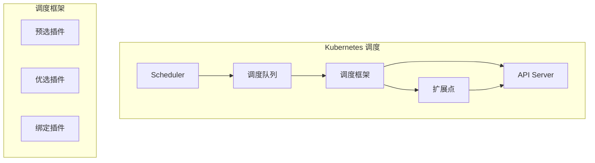
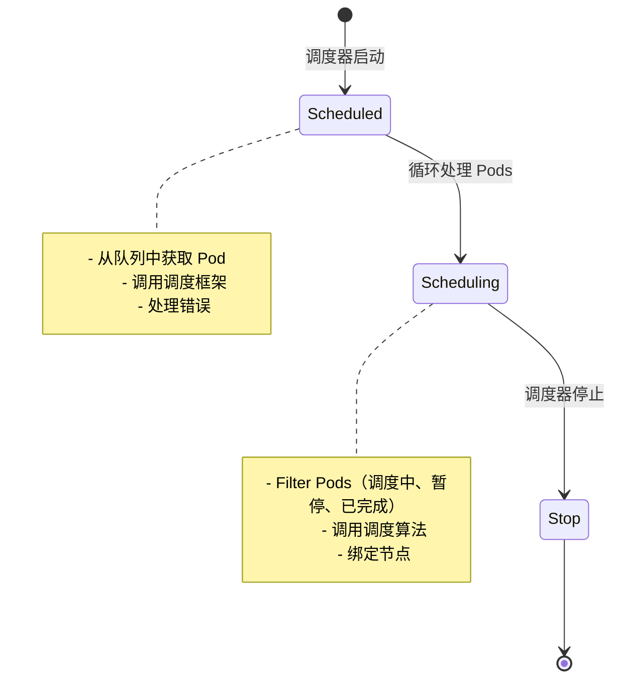
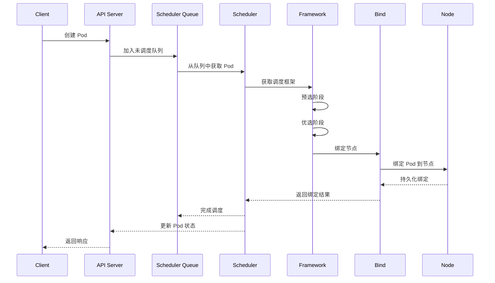
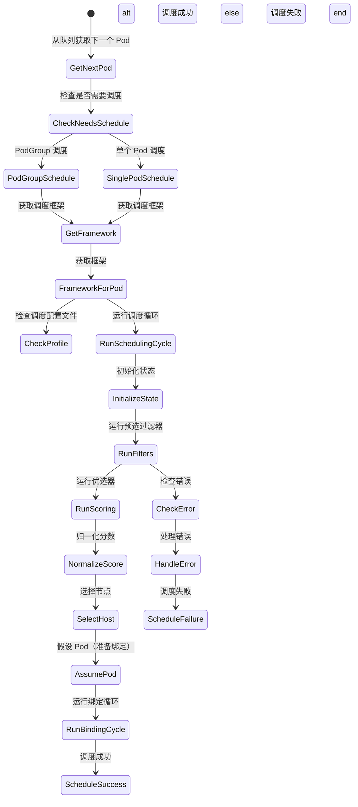
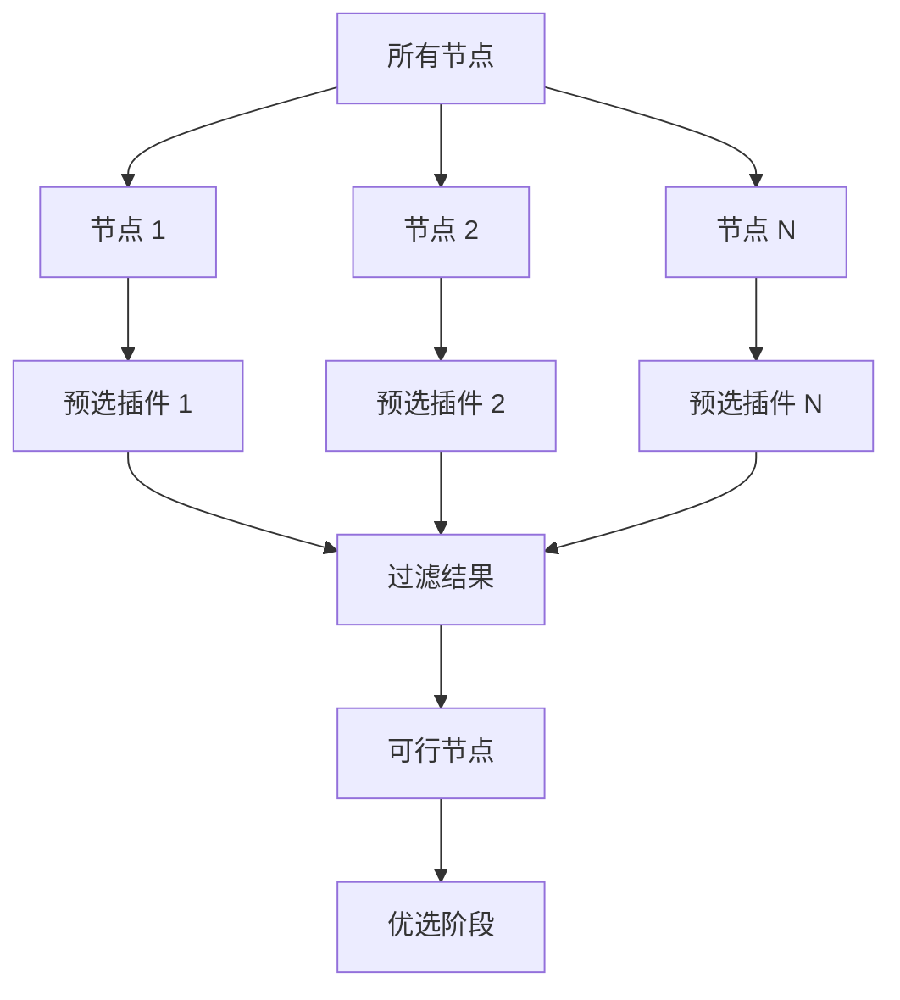
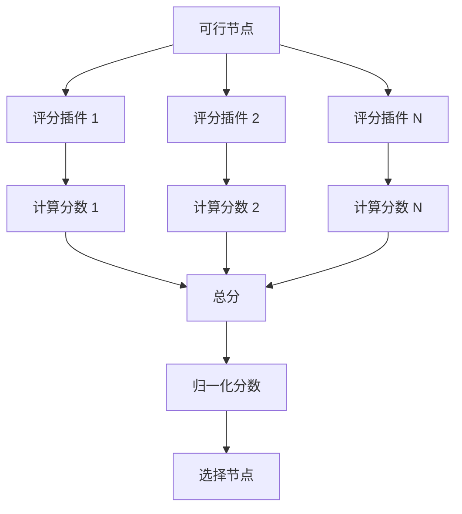
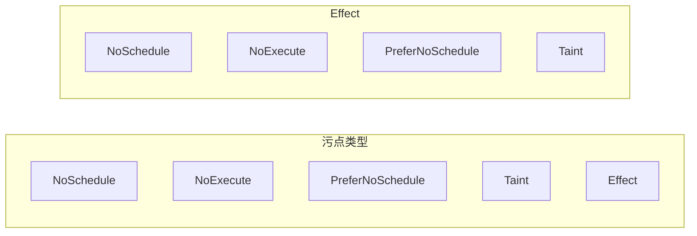
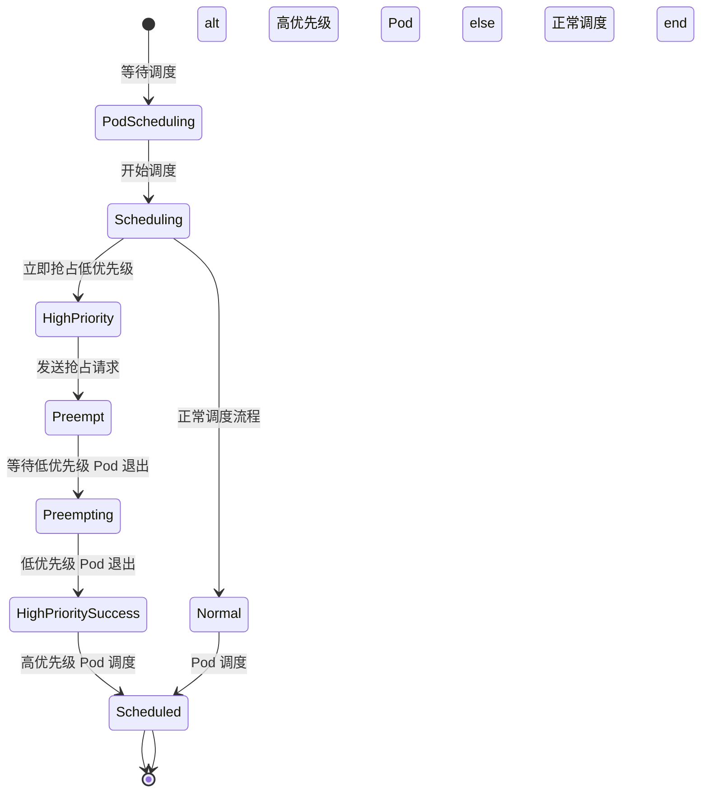

# 调度算法深度分析

> 本文档深入分析 Kubernetes 的调度算法和调度框架，包括调度流程、预选算法、优选算法、亲和性/反亲和性、污点和容忍度、优先级和抢占。

---

## 目录

1. [调度框架概述](#调度框架概述)
2. [调度流程](#调度流程)
3. [预选算法](#预选算法)
4. [优选算法](#优选算法)
5. [亲和性/反亲和性](#亲和性-反亲和性)
6. [污点和容忍度](#污点和容忍度)
7. [优先级和抢占](#优先级和抢占)
8. [调度性能优化](#调度性能优化)
9. [最佳实践](#最佳实践)

---

## 调度框架概述

### 调度器架构



### 调度器核心组件

**位置**: `pkg/scheduler/scheduler.go`

| 组件 | 说明 |
|------|------|
| **Scheduler** | 调度器主入口，管理调度循环 |
| **SchedulingQueue** | 未调度 Pods 队列 |
| **Extenders** | 绑定插件（如云厂商） |
| **Framework** | 调度框架，管理插件 |
| **InformerFactory** | 创建 Informer 监听 API 变化 |
| **NodeInfoSnapshot** | 节点信息快照 |

### 调度器状态



---

## 调度流程

### 完整调度流程



### ScheduleOne 流程

**位置**: `pkg/scheduler/schedule_one.go`



### ScheduleOne 实现

```go
// ScheduleOne 执行整个调度工作流
func (sched *Scheduler) ScheduleOne(ctx context.Context) {
    logger := klog.FromContext(ctx)
    
    // 1. 获取下一个 Pod
    podInfo, err := sched.NextPod(logger)
    if err != nil {
        return err
    }
    
    // 2. Pod 为 nil，结束
    if podInfo == nil || podInfo.Pod == nil {
        return nil
    }
    
    // 3. 检查是否为 PodGroup
    if podInfo.NeedsPodGroupScheduling {
        return sched.scheduleOnePodGroup(ctx, podInfo)
    }
    
    // 4. 获取调度框架
    fwk, err := sched.frameworkForPod(podInfo.Pod)
    if err != nil {
        return err
    }
    
    // 5. 运行调度循环
    start := time.Now()
    scheduleResult := sched.schedulingCycle(ctx, sched.state, fwk, podInfo, start, nil)
    
    // 6. 处理调度结果
    if scheduleResult.IsSuccess() {
        return nil
    }
    
    logger.V(4).Info("Failed to schedule pod", "pod", klog.KObj(podInfo.Pod))
    return scheduleResult.AsError()
}
```

### 调度循环

```go
// schedulingCycle 执行一次完整的调度循环
func (sched *Scheduler) schedulingCycle(
    ctx context.Context,
    state fwk.CycleState,
    schedFramework framework.Framework,
    podInfo *framework.QueuedPodInfo,
    start time.Time,
    podsToActivate *framework.PodsToActivate,
) (fwk.Status, *fwk.Status, *fwk.CycleResult) {
    
    logger := klog.FromContext(ctx)
    
    // 1. 初始化调度状态
    state.SetRecordPluginMetrics(rand.Intn(100) < sched.percentageOfNodesToScore)
    
    // 2. 运行预选
    filteredNodes, status := sched.runPreFilters(ctx, state, schedFramework, podInfo)
    if !status.IsSuccess() {
        return status, status, fwk.Status{}, status
    }
    
    // 3. 运行优选
    nodesWithScores, status := sched.runScorePlugins(ctx, state, schedFramework, podInfo, filteredNodes)
    if !status.IsSuccess() {
        return status, status, status, nodesWithScores
    }
    
    // 4. 归一化分数
    normalizedScores := sched.normalizeScores(state, nodesWithScores)
    
    // 5. 选择节点
    nodeResult, status := sched.selectHost(ctx, state, normalizedScores)
    if !status.IsSuccess() {
        return status, status, nodeResult
    }
    
    // 6. 准备绑定
    scheduleResult := sched.prepareForBindingCycle(ctx, state, schedFramework, podInfo, nodeResult)
    
    return scheduleResult.AsSuccess(), scheduleResult, nodeResult, nil
}
```

---

## 预选算法

### 预选阶段



### 内置预选插件

| 预选插件 | 说明 | 源码位置 |
|---------|------|---------|
| **MatchNodeSelector** | 匹配节点选择器 | `pkg/scheduler/framework/plugins/noderesources` |
| **MatchNodeAffinity** | 匹配节点亲和性 | `pkg/scheduler/framework/plugins/nodeaffinity` |
| **MatchPodAffinity** | 匹配 Pod 亲和性 | `pkg/scheduler/framework/plugins/podaffinity` |
| **NodeUnschedulable** | 过滤不可调度节点 | `pkg/scheduler/framework/plugins/noderesources` |
| **NodeVolumeLimits** | 过滤卷限制节点 | `pkg/scheduler/framework/plugins/noderesources` |
| **NodePorts** | 过滤端口冲突 | `pkg/scheduler/framework/plugins/noderesources` |
| **CheckNodeMemoryPressure** | 检查内存压力 | `pkg/scheduler/framework/plugins/noderesources` |
| **CheckNodeDiskPressure** | 检查磁盘压力 | `pkg/scheduler/framework/plugins/noderesources` |
| **CheckNodePIDPressure** | 检查 PID 压力 | `pkg/scheduler/framework/plugins/noderesources` |

### MatchNodeSelector 实现

```go
type MatchNodeSelector struct{}

// Filter 过滤节点选择器
func (p *MatchNodeSelector) Filter(
    ctx context.Context,
    state *fwk.CycleState,
    pod *v1.Pod,
    nodeInfo *framework.NodeInfo,
) *framework.Status {
    logger := klog.FromContext(ctx)
    
    // 1. 获取节点选择器
    selector, ok := nodeInfo.Selector
    if !ok {
        return framework.NewStatus(fwk.Unschedulable), fmt.Errorf("node selector is missing")
    }
    
    // 2. 检查节点是否有标签匹配
    if !selector.Matches(nodeInfo.Node().Labels) {
        return framework.NewStatus(fwk.Unschedulable), fmt.Errorf("node does not match selector")
    }
    
    return framework.NewStatus(fwk.Success), nil
}
```

### CheckNodeMemoryPressure 实现

```go
type CheckNodeMemoryPressure struct{}

// Filter 检查节点内存压力
func (p *CheckNodeMemoryPressure) Filter(
    ctx context.Context,
    state *fwk.CycleState,
    pod *v1.Pod,
    nodeInfo *framework.NodeInfo,
) *framework.Status {
    logger := klog.FromContext(ctx)
    
    // 1. 检查节点内存条件
    condition, exists := nodeInfo.Condition(v1.NodeMemoryPressure)
    if !exists {
        return framework.NewStatus(fwk.Unschedulable), fmt.Errorf("node memory pressure condition not found")
    }
    
    // 2. 如果节点有内存压力，过滤掉
    if condition.Status == v1.ConditionTrue {
        return framework.NewStatus(fwk.Unschedulable), fmt.Errorf("node is under memory pressure")
    }
    
    return framework.NewStatus(fwk.Success), nil
}
```

### 预选策略

| 策略 | 说明 | 配置 |
|------|------|---------|
| **最小节点数** | 保证调度扩展性 | `minFeasibleNodesToFind = 100` |
| **评分节点数** | 限制预选节点数量 | `minFeasibleNodesPercentageToFind = 5%` |
| **容忍度污点** | 考虑 Pod 的容忍度 | 内置 |

---

## 优选算法

### 优选阶段



### 内置评分插件

| 评分插件 | 说明 | 策略 |
|---------|------|--------|
| **NodeResourcesFit** | 资源充足性评分 | 最小资源 > Pod 请求 |
| **NodeResourcesBalancedAllocation** | 资源均衡分配 | CPU/内存 均衡分配 |
| **ImageLocality** | 镜像本地性评分 | 优先本地镜像 |
| **NodeAffinity** | 节点亲和性评分 | 满足亲和性得高分 |
| **InterPodAffinity** | Pod 间亲和性评分 | Pod 尽量聚集 |
| **PodTopologySpread** | Pod 拓扑分布评分 | 跨域/节点分布 |
| **TaintToleration** | 污点容忍度评分 | 容忍更多污点得高分 |

### NodeResourcesFit 实现

```go
type NodeResourcesFit struct {
    scoringStrategy scoringStrategy
}

func (p *NodeResourcesFit) Score(
    ctx context.Context,
    state *fwk.CycleState,
    pod *v1.Pod,
    nodes []*framework.NodeInfo,
) (framework.NodeScoreList, *framework.Status) {
    logger := klog.FromContext(ctx)
    
    var scores framework.NodeScoreList
    
    // 1. 对每个节点计算资源评分
    for _, node := range nodes {
        score, err := p.scoreNode(ctx, state, pod, node)
        if err != nil {
            return framework.NodeScoreList{}, framework.NewStatus(fwk.Error, err.Error())
        }
        scores = append(scores, score)
    }
    
    return scores, nil
}

// scoreNode 计算单个节点的资源评分
func (p *NodeResourcesFit) scoreNode(
    ctx context.Context,
    state *fwk.CycleState,
    pod *v1.Pod,
    nodeInfo *framework.NodeInfo,
) (int64, error) {
    var resourceRequests v1.ResourceList
    for _, container := range pod.Spec.Containers {
        resourceRequests.Add(container.Resources.Requests)
    }
    
    // 计算资源不足惩罚
    requested := calculateRequested(resourceRequests)
    allocatable := nodeInfo.Allocatable
    
    // 简单线性评分：allocatable / requested
    // 可用资源越多，分数越高
    score := int64(float64(allocatable.MilliValue()) / float64(requested.MilliValue()) * framework.MaxNodeScore)
    
    // 确保分数在 0-100 之间
    if score > framework.MaxNodeScore {
        score = framework.MaxNodeScore
    }
    if score < 0 {
        score = 0
    }
    
    return score, nil
}
```

### 评分策略

```go
// 评分策略配置
type scoringStrategy struct {
    leastAllocated int64 // 最小分配资源得分
}

// CalculateScore 根据策略计算分数
func (p *NodeResourcesFit) CalculateScore(
    requested v1.ResourceList,
    allocatable v1.ResourceList,
    strategy scoringStrategy,
) int64 {
    switch strategy {
    case LeastAllocated:
        // 最小分配资源策略：优先选择剩余资源最多的节点
        return calculateLeastAllocatedScore(requested, allocatable)
    default:
        return calculateBalancedScore(requested, allocatable)
    }
}

// calculateLeastAllocatedScore 计算最小分配资源评分
func calculateLeastAllocatedScore(requested, allocatable v1.ResourceList) int64 {
    var totalRequested float64
    var totalAllocatable float64
    
    for _, resource := range []v1.ResourceName{v1.ResourceCPU, v1.ResourceMemory} {
        requested := requested[resource].MilliValue()
        allocatable := allocatable[resource].MilliValue()
        totalRequested += float64(requested)
        totalAllocatable += float64(allocatable)
    }
    
    // 剩余资源比例
    if totalAllocatable == 0 {
        return 0
    }
    
    remainingRatio := (totalAllocatable - totalRequested) / totalAllocatable
    
    // 剩余资源越多，分数越高
    score := int64(remainingRatio * float64(framework.MaxNodeScore))
    
    if score > framework.MaxNodeScore {
        score = framework.MaxNodeScore
    }
    
    return score
}
```

---

## 亲和性/反亲和性

### 节点亲和性

```yaml
apiVersion: v1
kind: Pod
metadata:
  name: affinity-pod
spec:
  affinity:
    nodeAffinity:
      requiredDuringSchedulingIgnoredDuringExecution:
        # 必须满足的亲和性规则
        nodeSelectorTerms:
        - matchExpressions:
          - key: "disktype"
            operator: In
            values:
            - "ssd"
        - matchLabels:
          - key: "zone"
            operator: In
            values:
            - "us-west-1"
      preferredDuringSchedulingIgnoredDuringExecution:
        # 优先满足的亲和性规则
        nodeSelectorTerms:
        - matchExpressions:
          - key: "disktype"
            operator: In
            values:
            - "nvme"
```

### Pod 间亲和性

```yaml
apiVersion: v1
kind: Pod
metadata:
  name: pod-affinity-pod
spec:
  affinity:
    podAffinity:
      # 期望和某个 Pod 在同一节点
      requiredDuringSchedulingIgnoredDuringExecution:
        - labelSelector:
            matchExpressions:
              - key: "app"
                operator: In
                values:
                - "web"
      # 优先和某个 Pod 在同一节点
      preferredDuringSchedulingIgnoredDuringExecution:
        - weight: 100
          podAffinityTerm:
            - labelSelector:
                matchLabels:
                  app: cache
```

### Pod 反亲和性

```yaml
apiVersion: v1
kind: Pod
spec:
  affinity:
    # 避免和某个 Pod 在同一节点
    podAntiAffinity:
      requiredDuringSchedulingIgnoredDuringExecution:
        - labelSelector:
            matchLabels:
              app: web
      preferredDuringSchedulingIgnoredDuringExecution:
        - podAffinityTerm:
            - labelSelector:
                matchExpressions:
                  key: "app"
                operator: In
                values:
                  - "db"
```

---

## 污点和容忍度

### 污点类型



| Effect | 说明 | 优先级 |
|---------|------|---------|
| **NoSchedule** | Pod 不能调度到节点 | 最低 |
| **PreferNoSchedule** | Pod 优先不调度到节点 | 中等 |
| **NoExecute** | 容器不能在节点上执行 | 最高 |

### 污点示例

```bash
# 添加内存压力污点
kubectl taint nodes node1 key=node.kubernetes.io/memory-pressure:NoSchedule

# 添加专用污点
kubectl taint nodes node1 key=special-node:NoExecute
```

### 容忍度配置

```yaml
apiVersion: v1
kind: Pod
metadata:
  name: tolerations-pod
spec:
  containers:
  - name: app
    image: my-app:latest
  tolerations:
    # 容忍内存压力
    - key: "node.kubernetes.io/memory-pressure"
      operator: "Equal"
      value: "NoSchedule"
    # 容忍专用污点
    - key: "special-node"
      operator: "Equal"
      value: "NoExecute"
    # 容忍污点（不限 Effect）
    - key: "disktype"
      operator: "Equal"
      value: "ssd"
      tolerationSeconds: 3600
```

---

## 优先级和抢占

### 优先级类

```yaml
apiVersion: scheduling.k8s.io/v1
kind: PriorityClass
metadata:
  name: high-priority
value: 1000
globalDefault: false
description: "高优先级"
---
apiVersion: scheduling.k8s.io/v1
kind: PriorityClass
metadata:
  name: medium-priority
value: 500
globalDefault: false
description: "中优先级"
---
apiVersion: scheduling.k8s.io/v1
kind: PriorityClass
metadata:
  name: low-priority
value: 100
globalDefault: false
description: "低优先级"
```

### 抢占流程



### 抢占算法

```go
type preemptor struct {
    framework framework.Framework
}

// preemption 抢占低优先级 Pod
func (p *preemptor) preempt(
    ctx context.Context,
    state fwk.CycleState,
    schedFramework framework.Framework,
    podInfo *framework.QueuedPodInfo,
    nodesToUse []*framework.NodeInfo,
) (framework.NodeScoreList, *framework.Status) {
    logger := klog.FromContext(ctx)
    
    // 1. 找出候选节点
    candidates := findPreemptibleNodes(nodesToUse)
    if len(candidates) == 0 {
        return framework.NodeScoreList{}, framework.NewStatus(fwk.Unschedulable), fmt.Errorf("no preemptible nodes found")
    }
    
    // 2. 计算抢占得分
    var preemptorPreemptors []fwk.Preemptor
    
    for _, node := range candidates {
        p, ok := findPodToPreempt(node, state)
        if !ok {
            continue
        }
        
        preemptor := fwk.Preemptor{
            Name:       fmt.Sprintf("%s_%s", p.Pod.UID),
            Selected:    false,
            Pod:        p,
            Namespace:   p.Namespace,
        }
        
        preemptorPreemptors = append(preemptorPreemptors, preemptor)
    }
    
    return nil, nil
}
```

### 抢占配置

```yaml
apiVersion: kubelet.config.k8s.io/v1beta1
kind: KubeletConfiguration
# 抢占策略
preemptionPolicy: PreemptLowerPriority
# 抢占周期
preemptionPeriod: 10s
# 驱逐宽限期
preemptionGracePeriodSeconds: 60
```

---

## 调度性能优化

### 并行调度

```go
// 并行调度循环
func (sched *Scheduler) schedulePodsConcurrent(
    ctx context.Context,
    pods []*v1.Pod,
) error {
    var wg sync.WaitGroup
    errChan := make(chan error, len(pods))
    
    // 并发处理多个 Pods
    for _, pod := range pods {
        wg.Add(1)
        go func(p *v1.Pod) {
            defer wg.Done()
            err := sched.SchedulePod(ctx, pod)
            errChan <- err
        }(pod)
    }
    
    wg.Wait()
    close(errChan)
    
    for err := range errChan {
        if err != nil {
            return err
        }
    }
    
    return nil
}
```

### 调度缓存

```go
// 节点信息缓存
type nodeInfoSnapshot struct {
    sync.RWMutex
    nodeInfos []*framework.NodeInfo
}

// GetNodeInfos 返回节点信息快照
func (s *nodeInfoSnapshot) GetNodeInfos() []*framework.NodeInfo {
    s.RLock()
    defer s.RUnlock()
    return s.nodeInfos
}

// UpdateNodeInfos 更新节点信息
func (s *nodeInfoSnapshot) UpdateNodeInfos(nodeInfos []*framework.NodeInfo) {
    s.Lock()
    defer s.Unlock()
    s.nodeInfos = nodeInfos
}
```

### 指标收集

```go
// 调度器指标
var (
    // 调度尝试总数
    ScheduleAttemptsTotal = metrics.NewCounterVec(
        &metrics.CounterOpts{
            Subsystem:      "scheduler",
            Name:           "schedule_attempts_total",
            Help:           "Total number of scheduling attempts",
            StabilityLevel: metrics.ALPHA,
        },
        []string{"result"})
    
    // 调度失败次数
    ScheduleFailures = metrics.NewCounterVec(
        &metrics.CounterOpts{
            Subsystem:      "scheduler",
            Name:           "schedule_failures_total",
            Help:           "Total number of scheduling failures",
            StabilityLevel: metrics.ALPHA,
        },
        []string{"reason"})
    
    // 调度延迟
    SchedulingLatency = metrics.NewHistogramVec(
        &metrics.HistogramOpts{
            Subsystem:      "scheduler",
            Name:           "scheduling_duration_seconds",
            Help:           "Scheduling latency in seconds",
            StabilityLevel: metrics.ALPHA,
        },
        []string{"result", "pod", "namespace"})
    
    // 抢占指标
    PreemptionTotal = metrics.NewCounterVec(
        &metrics.CounterOpts{
            Subsystem:      "scheduler",
            Name:           "preemption_total",
            Help:           "Total number of pod preemptions",
            StabilityLevel: metrics.ALPHA,
        },
        []string{"result"})
)
```

---

## 最佳实践

### 1. 调度器配置

#### 启用并行调度

```yaml
apiVersion: kubelet.config.k8s.io/v1beta1
kind: KubeletConfiguration
# 调度并行度
parallelism: 16  # 16 个调度线程
```

#### 调度超时配置

```yaml
apiVersion: kubelet.config.k8s.io/v1beta1
kind: KubeletConfiguration
# 调度超时
apiServerRequestTimeout: 30s
apiServerTimeout: 30s
```

#### 启用百分比节点评分

```yaml
apiVersion: kubelet.config.k8s.io/v1beta1
kind: KubeletConfiguration
# 百分比节点评分
percentageOfNodesToScore: 5
```

### 2. 亲和性配置

#### 节点选择器

```yaml
apiVersion: v1
kind: Pod
spec:
  affinity:
    nodeAffinity:
      # 必须调度到指定节点
      requiredDuringSchedulingIgnoredDuringExecution:
        nodeSelectorTerms:
        - matchLabels:
            node-type: fast-ssd
```

#### Pod 间亲和性

```yaml
apiVersion: v1
kind: Deployment
metadata:
  name: web-deployment
spec:
  replicas: 3
  template:
    spec:
      affinity:
        # 将 Pods 尽量分布到不同节点
        podAntiAffinity:
          preferredDuringSchedulingIgnoredDuringExecution:
          - weight: 100
            podAffinityTerm:
              - labelSelector:
                  matchLabels:
                    app: web
```

### 3. 污点和容忍度配置

#### 节点污点

```bash
# 添加 GPU 节点（只有带有 GPU 的节点）
kubectl taint nodes gpu-node key=nvidia.com/gpu:NoSchedule

# 添加专用节点污点
kubectl taint nodes special-node key=special-node:NoExecute
```

#### Pod 容忍度

```yaml
apiVersion: v1
kind: Pod
metadata:
  name: tolerations-pod
spec:
  tolerations:
    - key: "node.kubernetes.io/not-ready"
      operator: "Exists"
    - key: "nvidia.com/gpu"
      operator: "Equal"
      value: "NoSchedule"
    - key: "key=value"
      operator: "Equal"
      value: "value"
```

### 4. 优先级配置

#### 定义优先级类

```yaml
apiVersion: scheduling.k8s.io/v1
kind: PriorityClass
metadata:
  name: high-priority
value: 1000
globalDefault: false
```

#### 使用优先级

```yaml
apiVersion: v1
kind: Pod
metadata:
  name: high-priority-pod
spec:
  # 使用高优先级类
  priorityClassName: high-priority
  containers:
  - name: app
    image: my-app:latest
```

### 5. 监控和调优

#### 调度指标

```sql
# 调度尝试速率
rate(scheduler_schedule_attempts_total[5m])

# 调度成功率
sum(rate(scheduler_schedule_attempts_total{result="success"}[5m])) /
sum(rate(scheduler_schedule_attempts_total[5m]))

# 调度延迟 P95
histogram_quantile(0.95, scheduler_scheduling_duration_seconds_bucket)

# 调度延迟 P99
histogram_quantile(0.99, scheduler_scheduling_duration_seconds_bucket)

# 抢占次数
rate(scheduler_preemption_total[5m])
```

#### 调度器健康检查

```bash
# 检查调度器状态
kubectl describe deployment scheduler -n kube-system

# 查看调度器日志
kubectl logs -n kube-system -l component=kube-scheduler

# 查看未调度 Pods
kubectl get pods --field-selector spec.schedulerName!= --all-namespaces
```

### 6. 故障排查

#### Pod 未调度

```bash
# 查看未调度 Pods
kubectl get pods --field-selector spec.schedulerName!=

# 查看事件
kubectl describe pod <pod-name>

# 检查调度器日志
kubectl logs -n kube-system -l component=kube-scheduler | grep -i "<pod-name>"
```

#### 调度器故障

```bash
# 检查调度器日志
kubectl logs -n kube-system -l component=kube-scheduler --tail=100

# 检查调度器配置
kubectl get configmaps -n kube-system -l component=kube-scheduler -o yaml

# 重启调度器
kubectl rollout restart deployment kube-scheduler -n kube-system
```

---

## 总结

### 核心要点

1. **调度框架**：Scheduler、SchedulingQueue、Framework、Extenders 协同工作
2. **调度流程**：Pod → 调度队列 → 调度循环 → 预选 → 优选 → 绑定
3. **预选算法**：MatchNodeSelector、CheckNodeMemoryPressure 等快速过滤节点
4. **优选算法**：NodeResourcesFit、NodeAffinity、PodTopologySpread 等评分插件
5. **亲和性/反亲和性**：NodeAffinity、PodAffinity、PodAntiAffinity 控制调度
6. **污点和容忍度**：NodeSelector + Pod Tolerations 控制调度
7. **优先级和抢占**：PriorityClass、PreemptLowerPriority 机制
8. **性能优化**：并行调度、节点缓存、指标收集
9. **最佳实践**：亲和性配置、容忍度配置、优先级配置、监控

### 关键路径

```
Pod 创建 → 调度队列 → ScheduleOne → 调度循环（预选 → 优选 → 选择节点）→ 
绑定 → API Server → Pod 状态更新
```

### 推荐阅读

- [Scheduler Configuration](https://kubernetes.io/docs/concepts/scheduling-eviction/scheduler-perf-tuning/)
- [Scheduling Framework](https://kubernetes.io/docs/concepts/scheduling-eviction/scheduler-perf-tuning/scheduling-framework/)
- [Kube Scheduler Configuration](https://kubernetes.io/docs/reference/config-api/kubelet-config.v1beta1/)
- [Multiple Schedulers](https://kubernetes.io/docs/concepts/scheduling-eviction/scheduler-perf-tuning/schedulers-performance/)
- [PriorityClass](https://kubernetes.io/docs/concepts/scheduling-eviction/pod-priority-preemption/)

---

**文档版本**：v1.0
**创建日期**：2026-03-04
**维护者**：AI Assistant
**Kubernetes 版本**：v1.28+
